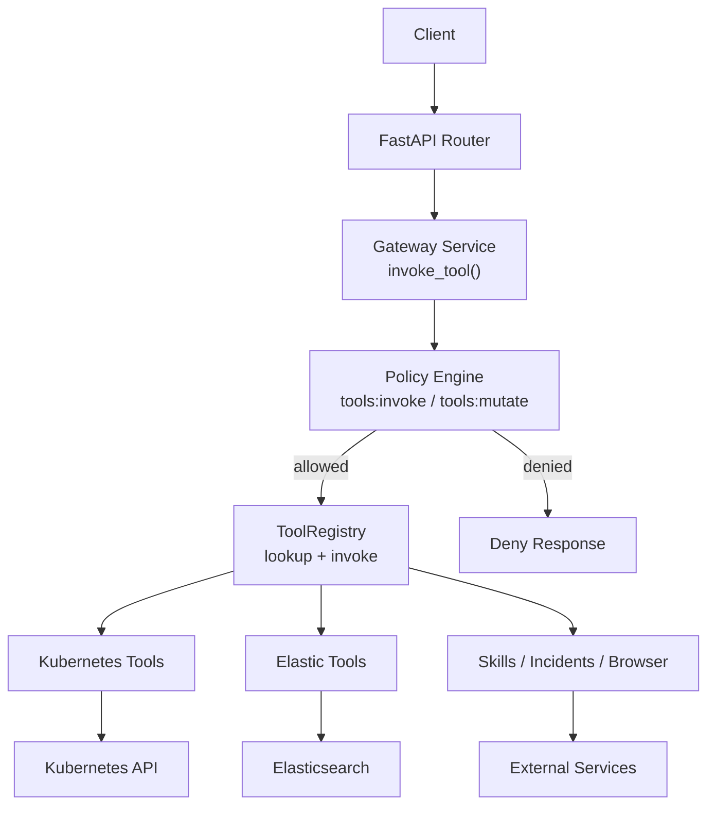
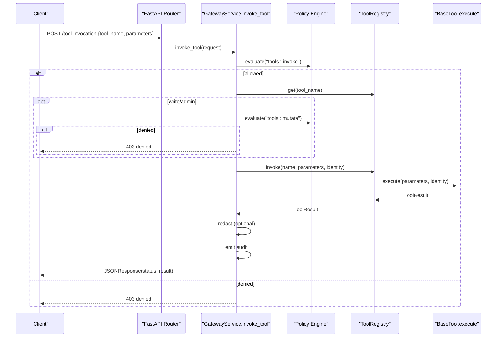
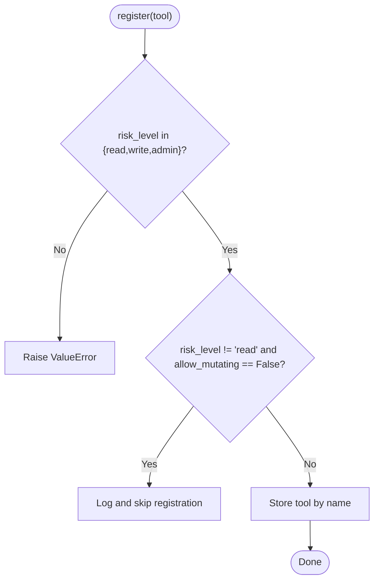
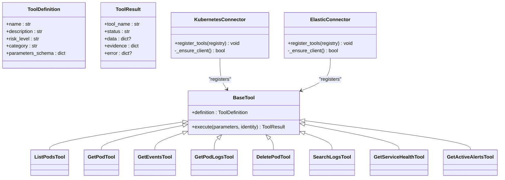
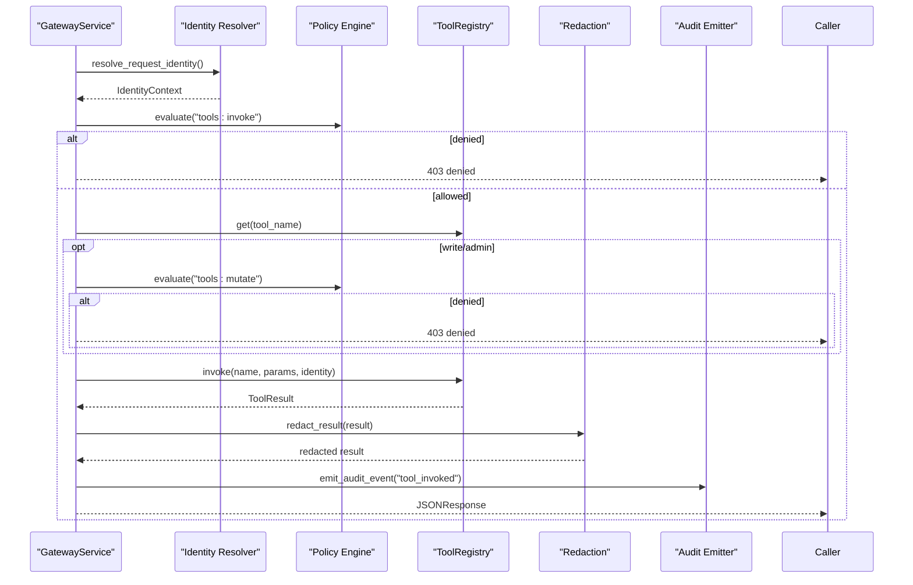
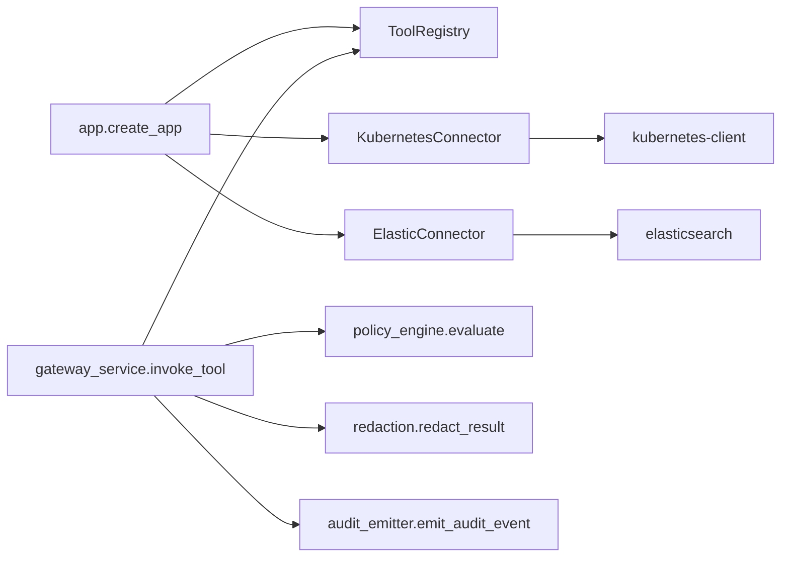

# Tool Registry and Base Interface

<cite>
**Referenced Files in This Document**
- [app.py](file://products/tool-gateway/src/tool_gateway/app.py)
- [registry.py](file://products/tool-gateway/src/tool_gateway/tools/registry.py)
- [base.py](file://products/tool-gateway/src/tool_gateway/tools/base.py)
- [k8s_connector.py](file://products/tool-gateway/src/tool_gateway/tools/k8s_connector.py)
- [elastic_connector.py](file://products/tool-gateway/src/tool_gateway/tools/elastic_connector.py)
- [gateway_service.py](file://products/tool-gateway/src/tool_gateway/services/gateway_service.py)
- [config.py](file://products/tool-gateway/src/tool_gateway/core/config.py)
- [adding-a-tool.md](file://docs/guides/adding-a-tool.md)
</cite>

## Table of Contents
1. Introduction
2. Project Structure
3. Core Components
4. Architecture Overview
5. Detailed Component Analysis
6. Dependency Analysis
7. Performance Considerations
8. Troubleshooting Guide
9. Conclusion

## Introduction
This document explains the Tool Gateway’s registry system and base tool interface, focusing on how tools are discovered, registered, validated, and invoked through a centralized registry. It documents the base connector class specification, parameter validation patterns, error handling conventions, lifecycle management, metadata schema, permissions and risk tiers, versioning strategies, dependency management between tools, and performance considerations for discovery and invocation.

## Project Structure
The Tool Gateway is a FastAPI service that builds an in-process registry of tools at startup, conditionally enabling connectors based on configuration. Each connector registers one or more tools with the registry. Invocations flow through policy enforcement, optional redaction, audit emission, and finally dispatch to the selected tool via the registry.

**Diagram sources**
- [app.py:19-97](file://products/tool-gateway/src/tool_gateway/app.py#L19-L97)
- [gateway_service.py:158-376](file://products/tool-gateway/src/tool_gateway/services/gateway_service.py#L158-L376)
- [registry.py:18-89](file://products/tool-gateway/src/tool_gateway/tools/registry.py#L18-L89)
- [k8s_connector.py:41-92](file://products/tool-gateway/src/tool_gateway/tools/k8s_connector.py#L41-L92)
- [elastic_connector.py:40-103](file://products/tool-gateway/src/tool_gateway/tools/elastic_connector.py#L40-L103)

**Section sources**
- [app.py:19-146](file://products/tool-gateway/src/tool_gateway/app.py#L19-L146)
- [config.py:32-189](file://products/tool-gateway/src/tool_gateway/core/config.py#L32-L189)

## Core Components
- Base abstractions: ToolDefinition, ToolResult, BaseTool, evidence/error helpers.
- Registry: validates risk levels, enforces mutating-tools admission, provides lookup and invocation.
- Connectors: own upstream client lifecycle and register concrete tools.
- Gateway service: orchestrates identity resolution, policy checks, redaction, auditing, and dispatch.

Key responsibilities:
- Discovery: connectors call registry.register during app startup when enabled by configuration.
- Registration: registry validates risk_level and gating for mutating tools.
- Invocation: gateway_service.invoke_tool enforces policies, then calls registry.invoke which delegates to the tool’s execute method.

**Section sources**
- [base.py:15-123](file://products/tool-gateway/src/tool_gateway/tools/base.py#L15-L123)
- [registry.py:18-89](file://products/tool-gateway/src/tool_gateway/tools/registry.py#L18-L89)
- [gateway_service.py:158-376](file://products/tool-gateway/src/tool_gateway/services/gateway_service.py#L158-L376)

## Architecture Overview
The runtime architecture centers on a single ToolRegistry instance created at application startup. Connectors are conditionally instantiated and their tools registered. Requests to invoke tools pass through identity verification and policy evaluation before being dispatched to the appropriate tool implementation. Results are optionally redacted and audited.

**Diagram sources**
- [gateway_service.py:158-376](file://products/tool-gateway/src/tool_gateway/services/gateway_service.py#L158-L376)
- [registry.py:18-89](file://products/tool-gateway/src/tool_gateway/tools/registry.py#L18-L89)
- [base.py:108-123](file://products/tool-gateway/src/tool_gateway/tools/base.py#L108-L123)

## Detailed Component Analysis

### Base Tool Interface and Metadata Schema
- ToolDefinition: immutable metadata including name, description, risk_level, category, and parameters_schema. Used by the registry and exposed for tool cataloging.
- ToolResult: structured envelope with status (success/error/denied), optional data, evidence, and error details. Evidence includes execution timestamp, duration_ms, risk_level, and source_system.
- BaseTool: abstract interface requiring definition and async execute(parameters, identity). Implementations must measure duration and build evidence using provided helpers.
- Helpers: build_evidence, make_error_result, make_denied_result provide consistent envelopes and codes.

Risk-level vocabulary: read, write, admin. Mutating tools (write/admin) require additional authorization and are gated by configuration.

**Section sources**
- [base.py:15-123](file://products/tool-gateway/src/tool_gateway/tools/base.py#L15-L123)

### Tool Registry: Validation, Admission, and Dispatch
- Registration:
  - Validates risk_level against the allowed set; raises ValueError if invalid.
  - Refuses registration of non-read tools unless allow_mutating is true (controlled by configuration).
  - Logs warnings on overwrites and info on successful registrations.
- Lookup and invocation:
  - Returns None for unknown tools; invoke wraps errors into structured TOOL_EXECUTION_ERROR results.
  - Preserves risk_level and source_system in error evidence.

**Diagram sources**
- [registry.py:18-56](file://products/tool-gateway/src/tool_gateway/tools/registry.py#L18-L56)

**Section sources**
- [registry.py:18-89](file://products/tool-gateway/src/tool_gateway/tools/registry.py#L18-L89)

### Connector Lifecycle and Tool Registration Patterns
Connectors encapsulate upstream client setup and expose register_tools(registry). They lazily initialize clients and return structured errors when not configured. Examples:
- KubernetesConnector: lazy in-cluster or kubeconfig initialization; registers read and bounded mutating tools.
- ElasticConnector: lazy connection with API key or basic auth; registers read-only tools.

Both follow the pattern:
- Lazy client creation with failure caching.
- Parameter coercion utilities to clamp values and produce INVALID_PARAMETERS errors.
- Sync operations executed off the event loop to avoid blocking.

**Diagram sources**
- [base.py:15-123](file://products/tool-gateway/src/tool_gateway/tools/base.py#L15-L123)
- [k8s_connector.py:41-92](file://products/tool-gateway/src/tool_gateway/tools/k8s_connector.py#L41-L92)
- [elastic_connector.py:40-103](file://products/tool-gateway/src/tool_gateway/tools/elastic_connector.py#L40-L103)

**Section sources**
- [k8s_connector.py:41-518](file://products/tool-gateway/src/tool_gateway/tools/k8s_connector.py#L41-L518)
- [elastic_connector.py:40-535](file://products/tool-gateway/src/tool_gateway/tools/elastic_connector.py#L40-L535)

### Gateway Orchestration: Identity, Policy, Redaction, Audit
- Identity resolution supports bearer tokens or synthetic dev identity depending on settings.
- Policy enforcement evaluates tools:invoke for all invocations and tools:mutate for write/admin tools.
- Risk-tier gating: mutating tools additionally require the mutate permission.
- Redaction: applies credential redaction to results; can withhold output on overflow.
- Audit: emits durable audit events for policy decisions and tool invocations.

**Diagram sources**
- [gateway_service.py:61-121](file://products/tool-gateway/src/tool_gateway/services/gateway_service.py#L61-L121)
- [gateway_service.py:124-156](file://products/tool-gateway/src/tool_gateway/services/gateway_service.py#L124-L156)
- [gateway_service.py:158-376](file://products/tool-gateway/src/tool_gateway/services/gateway_service.py#L158-L376)

**Section sources**
- [gateway_service.py:61-376](file://products/tool-gateway/src/tool_gateway/services/gateway_service.py#L61-L376)

### Configuration and Feature Flags
- Connector enablement: k8s_enabled, elastic_enabled, skills_service_url, incidents_service_url, browser_enabled.
- Mutating tools gate: mutating_tools_enabled controls whether write/admin tools may be registered.
- Redaction: redaction_enabled and redaction_overflow_fraction control output sanitization behavior.
- Identity and policy: identity service URL/JWKS, token issuer/audience, policy path, require_auth.

These settings drive conditional wiring in the application builder and influence runtime behavior.

**Section sources**
- [config.py:32-189](file://products/tool-gateway/src/tool_gateway/core/config.py#L32-L189)
- [app.py:19-97](file://products/tool-gateway/src/tool_gateway/app.py#L19-L97)

### Adding a Custom Connector and Tool
The guide outlines a step-by-step process:
- Create a connector class that owns configuration and registers tools.
- Define each tool by subclassing BaseTool, providing ToolDefinition and async execute.
- Use standard error ladder: validate parameters, coerce inputs, handle transport errors, map upstream errors, project minimal data, attach evidence.
- Add configuration fields and environment variables.
- Wire the connector in app.py under a feature flag with lazy import.
- Verify authorization rules in the policy bundle.
- Write tests covering parameter validation, transport failures, upstream errors, success paths, and registration gating.

**Section sources**
- [adding-a-tool.md:13-45](file://docs/guides/adding-a-tool.md#L13-L45)
- [adding-a-tool.md:47-210](file://docs/guides/adding-a-tool.md#L47-L210)
- [adding-a-tool.md:212-297](file://docs/guides/adding-a-tool.md#L212-L297)

## Dependency Analysis
- Application startup constructs the registry and conditionally imports connectors to avoid loading unnecessary dependencies.
- Connectors depend on external libraries (kubernetes, elasticsearch) and fail gracefully when unavailable.
- The gateway service depends on policy engine, token verifier, redaction, and audit emitter.
- Registry depends only on base abstractions.

**Diagram sources**
- [app.py:19-97](file://products/tool-gateway/src/tool_gateway/app.py#L19-L97)
- [k8s_connector.py:49-75](file://products/tool-gateway/src/tool_gateway/tools/k8s_connector.py#L49-L75)
- [elastic_connector.py:61-96](file://products/tool-gateway/src/tool_gateway/tools/elastic_connector.py#L61-L96)
- [gateway_service.py:158-376](file://products/tool-gateway/src/tool_gateway/services/gateway_service.py#L158-L376)

**Section sources**
- [app.py:19-97](file://products/tool-gateway/src/tool_gateway/app.py#L19-L97)
- [k8s_connector.py:49-75](file://products/tool-gateway/src/tool_gateway/tools/k8s_connector.py#L49-L75)
- [elastic_connector.py:61-96](file://products/tool-gateway/src/tool_gateway/tools/elastic_connector.py#L61-L96)
- [gateway_service.py:158-376](file://products/tool-gateway/src/tool_gateway/services/gateway_service.py#L158-L376)

## Performance Considerations
- Lazy connector initialization: clients are created on first use and cached per connector instance to avoid repeated setup costs.
- Blocking I/O off the event loop: synchronous upstream calls run in an executor to prevent blocking the asyncio event loop.
- Parameter clamping: input limits (e.g., tail_lines, time_range_minutes, max_results) protect downstream systems from excessive load.
- Redaction overhead: redaction runs once per invocation; overflow detection prevents large sensitive payloads from leaking.
- Registry lookup: O(1) dictionary lookup by tool name; list_definitions returns metadata without invoking tools.

[No sources needed since this section provides general guidance]

## Troubleshooting Guide
Common issues and diagnostics:
- Unknown tool name: registry.invoke returns TOOL_NOT_FOUND; verify tool registration and name spelling.
- Invalid risk level: registry.register raises ValueError; ensure risk_level is one of read, write, admin.
- Mutating tools disabled: non-read tools are skipped when mutating_tools_enabled is false; enable the flag to admit them.
- Upstream not configured: connectors return domain-specific NOT_CONFIGURED errors (e.g., K8S_NOT_CONFIGURED, ELASTIC_NOT_CONFIGURED); check settings and connectivity.
- Policy denial: 403 responses indicate missing tools:invoke or tools:mutate permissions; review roles and policy bundle.
- Redaction overflow: output withheld due to high proportion of sensitive content; adjust parameters to reduce sensitive data exposure.

Diagnostics tips:
- Inspect logs for registration messages and policy decision entries.
- Check readiness endpoint for policy bundle load status and fingerprint.
- Validate tool definitions via registry.list_definitions to confirm metadata and schemas.

**Section sources**
- [registry.py:31-56](file://products/tool-gateway/src/tool_gateway/tools/registry.py#L31-L56)
- [gateway_service.py:124-156](file://products/tool-gateway/src/tool_gateway/services/gateway_service.py#L124-L156)
- [gateway_service.py:158-376](file://products/tool-gateway/src/tool_gateway/services/gateway_service.py#L158-L376)
- [k8s_connector.py:49-75](file://products/tool-gateway/src/tool_gateway/tools/k8s_connector.py#L49-L75)
- [elastic_connector.py:61-96](file://products/tool-gateway/src/tool_gateway/tools/elastic_connector.py#L61-L96)

## Conclusion
The Tool Gateway provides a robust, extensible framework for discovering, registering, and invoking tools through a centralized registry with strong safety guarantees. The base interface standardizes metadata, execution, and error handling, while connectors encapsulate upstream integration and lifecycle management. Policy enforcement, risk-tier gating, redaction, and auditing ensure secure and observable operations. Following the documented patterns enables safe addition of new tools with clear permissions, predictable behavior, and maintainable code.