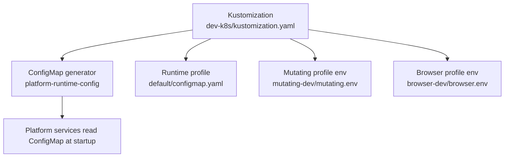
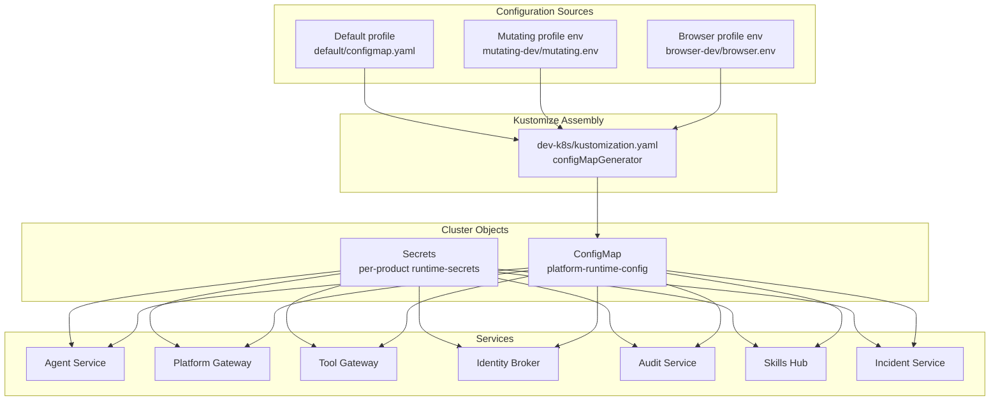
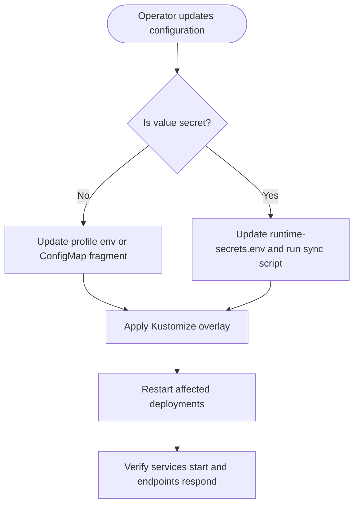
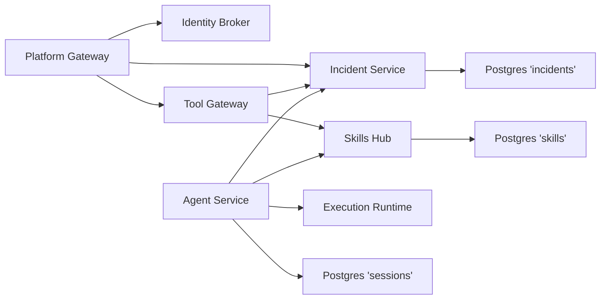

# Configuration Management

<cite>
**Referenced Files in This Document**
- [kustomization.yaml](file://shared/platform-ops/gitops/dev-k8s/kustomization.yaml)
- [configmap.yaml](file://shared/platform-ops/gitops/runtime-profiles/default/configmap.yaml)
- [runtime-secrets.example.env](file://shared/platform-ops/gitops/runtime-profiles/default/runtime-secrets.example.env)
- [sync-runtime-secret.sh](file://shared/platform-ops/gitops/sync-runtime-secret.sh)
- [sync-delegation-secrets.sh](file://shared/platform-ops/gitops/sync-delegation-secrets.sh)
- [sync-execution-signing-secret.sh](file://shared/platform-ops/gitops/sync-execution-signing-secret.sh)
- [sync-sessions-db.sh](file://shared/platform-ops/gitops/sync-sessions-db.sh)
- [sync-incident-secrets.sh](file://shared/platform-ops/gitops/sync-incident-secrets.sh)
- [sync-skills-secrets.sh](file://shared/platform-ops/gitops/sync-skills-secrets.sh)
</cite>

## Table of Contents
1. Introduction
2. Project Structure
3. Core Components
4. Architecture Overview
5. Detailed Component Analysis
6. Dependency Analysis
7. Performance Considerations
8. Troubleshooting Guide
9. Conclusion
10. Appendices

## Introduction
This document explains how the Luban AIOPS platform manages configuration and secrets across environments. It focuses on:
- The hierarchical configuration system that assembles a single ConfigMap named platform-runtime-config from product-scoped environment fragments under shared, agent-platform, execution-runtime, platform-gateway, tool-gateway, identity-broker, audit-service, skills-hub, and incident-service directories.
- The secret management strategy for runtime-sensitive values such as API keys, database credentials, OIDC client secrets, and delegation tokens.
- The sync scripts that provision secrets into the cluster and how they differ from non-secret ConfigMap values.
- How to change configuration without redeploying images.
- Environment-specific configuration, startup validation behavior, and troubleshooting techniques.
- Best practices for managing configuration across development, staging, and production.

## Project Structure
The configuration is assembled with Kustomize. The dev overlay defines a configMapGenerator that merges multiple env files into one ConfigMap named platform-runtime-config. Runtime profiles add additional environment fragments (for example, default, mutating-dev, browser-dev). Product deployments reference these ConfigMaps and Secrets through their deployment manifests.

**Diagram sources**
- [kustomization.yaml:9-15](file://shared/platform-ops/gitops/dev-k8s/kustomization.yaml#L9-L15)
- [configmap.yaml:1-11](file://shared/platform-ops/gitops/runtime-profiles/default/configmap.yaml#L1-L11)

**Section sources**
- [kustomization.yaml:1-22](file://shared/platform-ops/gitops/dev-k8s/kustomization.yaml#L1-L22)
- [configmap.yaml:1-11](file://shared/platform-ops/gitops/runtime-profiles/default/configmap.yaml#L1-L11)

## Core Components
- Platform runtime ConfigMap: Assembled by Kustomize from multiple env fragments. Non-secret configuration such as provider selection, model names, base URLs, and feature toggles live here.
- Per-product runtime secrets: Stored in Kubernetes Secrets mounted as environment variables. Sensitive values such as API keys, database credentials, OIDC client secrets, and delegation tokens are managed via Secrets.
- Sync scripts: Shell utilities that generate or reuse secrets, write them into per-product runtime-secrets.env files, apply them to the cluster, and restart affected deployments.
- Environment overlays: Profiles under runtime-profiles allow environment-specific configuration without changing application code.

Key responsibilities:
- Non-secret configuration: Managed via ConfigMap; changes can be applied without image rebuilds.
- Secret configuration: Managed via Secrets; provisioned by sync scripts; changes require Secret updates and workload restarts.

**Section sources**
- [kustomization.yaml:9-15](file://shared/platform-ops/gitops/dev-k8s/kustomization.yaml#L9-L15)
- [runtime-secrets.example.env:1-57](file://shared/platform-ops/gitops/runtime-profiles/default/runtime-secrets.example.env#L1-L57)

## Architecture Overview
The platform uses a layered configuration approach:
- Base overlays define service deployments and per-service runtime-config.env files.
- Runtime profiles contribute additional environment fragments.
- Kustomize merges all env fragments into a single platform-runtime-config ConfigMap.
- Secrets are provisioned separately by sync scripts and mounted into pods.

**Diagram sources**
- [kustomization.yaml:9-15](file://shared/platform-ops/gitops/dev-k8s/kustomization.yaml#L9-L15)
- [configmap.yaml:1-11](file://shared/platform-ops/gitops/runtime-profiles/default/configmap.yaml#L1-L11)

## Detailed Component Analysis

### Hierarchical ConfigMap assembly
- The Kustomization file declares a configMapGenerator that merges environment files from runtime profiles into a single ConfigMap named platform-runtime-config.
- The default profile provides a ConfigMap with generic deploy labels and provider settings.
- Additional profiles (mutating-dev, browser-dev) contribute environment fragments that are merged into the same ConfigMap.

Operational implications:
- Non-secret configuration is centralized in one ConfigMap and consumed by services at startup.
- Adding or updating environment fragments in profiles updates the ConfigMap without rebuilding images.

**Section sources**
- [kustomization.yaml:9-15](file://shared/platform-ops/gitops/dev-k8s/kustomization.yaml#L9-L15)
- [configmap.yaml:1-11](file://shared/platform-ops/gitops/runtime-profiles/default/configmap.yaml#L1-L11)

### Secret management strategy
Secrets are provisioned using dedicated sync scripts. Each script handles a specific concern:
- Runtime secrets: sync-runtime-secret.sh provisions agent-platform runtime secrets from a profile-scoped runtime-secrets.env file.
- Delegation secrets: sync-delegation-secrets.sh generates or reuses a shared client secret, writes it into platform-gateway and identity-broker runtime-secrets.env files, applies the corresponding Secrets, and restarts affected deployments.
- Execution signing key: sync-execution-signing-secret.sh ensures an execution signing key exists in a Secret and restarts the agent-service to pick it up.
- Incident secrets: sync-incident-secrets.sh provisions webhook tokens and query client secrets, ensures the incidents database exists, updates per-product runtime-secrets.env files, applies Secrets, and restarts workloads.
- Skills secrets: sync-skills-secrets.sh provisions query secrets, ensures the skills database exists, updates per-product runtime-secrets.env files, applies Secrets, and restarts workloads.
- Sessions database: sync-sessions-db.sh ensures the sessions database exists and restarts agent-service.

Non-secret vs protected values:
- Non-secret values (e.g., provider selection, model names, base URLs) belong in ConfigMap fragments and are merged by Kustomize.
- Protected values (API keys, database credentials, OIDC client secrets, delegation tokens) belong in Secrets and are provisioned by sync scripts.

**Section sources**
- [sync-runtime-secret.sh:1-29](file://shared/platform-ops/gitops/sync-runtime-secret.sh#L1-L29)
- [sync-delegation-secrets.sh:1-97](file://shared/platform-ops/gitops/sync-delegation-secrets.sh#L1-L97)
- [sync-execution-signing-secret.sh:1-72](file://shared/platform-ops/gitops/sync-execution-signing-secret.sh#L1-L72)
- [sync-incident-secrets.sh:1-176](file://shared/platform-ops/gitops/sync-incident-secrets.sh#L1-L176)
- [sync-skills-secrets.sh:1-197](file://shared/platform-ops/gitops/sync-skills-secrets.sh#L1-L197)
- [sync-sessions-db.sh:1-46](file://shared/platform-ops/gitops/sync-sessions-db.sh#L1-L46)
- [runtime-secrets.example.env:1-57](file://shared/platform-ops/gitops/runtime-profiles/default/runtime-secrets.example.env#L1-L57)

### Environment-specific configurations
- Default profile: Provides baseline provider configuration and optional catalog entries.
- Mutating-dev profile: Adds environment-specific flags via mutating.env.
- Browser-dev profile: Adds browser-related configuration via browser.env and patches tool-gateway with a sidecar.

To switch environments:
- Select or create a runtime profile under runtime-profiles.
- Update the profile’s env files or ConfigMap.
- Apply the overlay so Kustomize regenerates platform-runtime-config.

**Section sources**
- [kustomization.yaml:1-22](file://shared/platform-ops/gitops/dev-k8s/kustomization.yaml#L1-L22)
- [configmap.yaml:1-11](file://shared/platform-ops/gitops/runtime-profiles/default/configmap.yaml#L1-L11)

### Configuration validation at service startup
- Services read configuration from the merged ConfigMap and Secrets at startup.
- Missing or invalid configuration typically causes startup failures or feature gating. For example, if required LLM provider credentials are absent, the provider is disabled and discovery may fall back to curated lists or cached data.
- Secret provisioning scripts ensure required keys exist before restarting workloads. If a required secret is missing, services will fail open or closed according to their design (for example, signing_unavailable rejection paths).

Operational guidance:
- Validate that all required keys are present in the relevant runtime-secrets.env files before applying.
- Use the SKIP_* environment variables in sync scripts to bypass provisioning when CI injects secrets externally.

[No sources needed since this section synthesizes behavior described by scripts and examples]

### Managing configuration changes without redeploying images
- Non-secret changes: Update environment fragments in runtime profiles and apply the overlay. Kustomize regenerates platform-runtime-config. Services must be restarted to pick up new ConfigMap values.
- Secret changes: Update the appropriate runtime-secrets.env file and run the corresponding sync script. The script applies the Secret and restarts affected deployments.

Best practice:
- Keep non-secret configuration in profile env files and ConfigMaps.
- Keep sensitive configuration in Secrets and manage them exclusively via sync scripts.

**Section sources**
- [kustomization.yaml:9-15](file://shared/platform-ops/gitops/dev-k8s/kustomization.yaml#L9-L15)
- [sync-runtime-secret.sh:1-29](file://shared/platform-ops/gitops/sync-runtime-secret.sh#L1-L29)
- [sync-delegation-secrets.sh:1-97](file://shared/platform-ops/gitops/sync-delegation-secrets.sh#L1-L97)
- [sync-incident-secrets.sh:1-176](file://shared/platform-ops/gitops/sync-incident-secrets.sh#L1-L176)
- [sync-skills-secrets.sh:1-197](file://shared/platform-ops/gitops/sync-skills-secrets.sh#L1-L197)

### Common configuration scenarios

#### Switching the active LLM provider
- Set provider selection and model metadata in the default profile ConfigMap fragment.
- Provide provider API keys in the runtime-secrets.example.env template and copy to the active profile’s runtime-secrets.env.
- Apply the overlay and restart services to load the new provider configuration.

**Section sources**
- [configmap.yaml:1-11](file://shared/platform-ops/gitops/runtime-profiles/default/configmap.yaml#L1-L11)
- [runtime-secrets.example.env:1-57](file://shared/platform-ops/gitops/runtime-profiles/default/runtime-secrets.example.env#L1-L57)

#### Enabling token delegation between platform-gateway and identity-broker
- Run the delegation secret sync script to generate or reuse a shared client secret.
- The script updates both platform-gateway and identity-broker runtime-secrets.env files, applies Secrets, and restarts deployments.
- After rollout, the gateway can exchange user tokens for delegated tokens used by downstream services.

**Section sources**
- [sync-delegation-secrets.sh:1-97](file://shared/platform-ops/gitops/sync-delegation-secrets.sh#L1-L97)

#### Provisioning execution request signing
- Run the execution signing secret sync script. It reuses an existing key if present or generates a new one.
- The script applies the Secret and restarts agent-service so signed executions can proceed.

**Section sources**
- [sync-execution-signing-secret.sh:1-72](file://shared/platform-ops/gitops/sync-execution-signing-secret.sh#L1-L72)

#### Enabling incident intake and query
- Run the incident secrets sync script to provision webhook tokens and query client secrets.
- The script ensures the incidents database exists, updates per-product runtime-secrets.env files, applies Secrets, and restarts workloads.
- Point Alertmanager at the incident-service webhook endpoint with the provided bearer token.

**Section sources**
- [sync-incident-secrets.sh:1-176](file://shared/platform-ops/gitops/sync-incident-secrets.sh#L1-L176)

#### Enabling skills retrieval
- Run the skills secrets sync script to provision query secrets and optionally a Git PAT for remote skill sources.
- The script ensures the skills database exists, updates per-product runtime-secrets.env files, applies Secrets, and restarts workloads.

**Section sources**
- [sync-skills-secrets.sh:1-197](file://shared/platform-ops/gitops/sync-skills-secrets.sh#L1-L197)

### Conceptual overview

[No sources needed since this diagram shows conceptual workflow, not actual code structure]

## Dependency Analysis
The sync scripts coordinate dependencies across services and databases:
- Delegation secrets link platform-gateway and identity-broker via a shared client secret.
- Incident secrets link incident-service with callers (platform-gateway, tool-gateway, agent-service) via a shared query secret and a webhook token.
- Skills secrets link skills-hub with callers (tool-gateway, platform-gateway, agent-service) via a shared query secret.
- Execution signing links agent-service to a signing key stored in a Secret.
- Session store migration depends on Postgres being available and the sessions database existing.

**Diagram sources**
- [sync-delegation-secrets.sh:1-97](file://shared/platform-ops/gitops/sync-delegation-secrets.sh#L1-L97)
- [sync-incident-secrets.sh:1-176](file://shared/platform-ops/gitops/sync-incident-secrets.sh#L1-L176)
- [sync-skills-secrets.sh:1-197](file://shared/platform-ops/gitops/sync-skills-secrets.sh#L1-L197)
- [sync-execution-signing-secret.sh:1-72](file://shared/platform-ops/gitops/sync-execution-signing-secret.sh#L1-L72)
- [sync-sessions-db.sh:1-46](file://shared/platform-ops/gitops/sync-sessions-db.sh#L1-L46)

**Section sources**
- [sync-delegation-secrets.sh:1-97](file://shared/platform-ops/gitops/sync-delegation-secrets.sh#L1-L97)
- [sync-incident-secrets.sh:1-176](file://shared/platform-ops/gitops/sync-incident-secrets.sh#L1-L176)
- [sync-skills-secrets.sh:1-197](file://shared/platform-ops/gitops/sync-skills-secrets.sh#L1-L197)
- [sync-execution-signing-secret.sh:1-72](file://shared/platform-ops/gitops/sync-execution-signing-secret.sh#L1-L72)
- [sync-sessions-db.sh:1-46](file://shared/platform-ops/gitops/sync-sessions-db.sh#L1-L46)

## Performance Considerations
- Prefer ConfigMap-based configuration for non-secret values to avoid frequent Secret rotations.
- Batch configuration changes per environment to minimize rollout cycles.
- Use deterministic model pinning where possible to reduce live discovery overhead.
- Ensure database prerequisites exist before restarting services to avoid repeated restart loops.

[No sources needed since this section provides general guidance]

## Troubleshooting Guide
Common issues and resolutions:
- Missing runtime profile secret file: The runtime secret sync script requires a profile-scoped runtime-secrets.env file. Copy the example file and fill in values before running the script.
- Skipped provisioning in CI: Some scripts honor SKIP_* flags to skip provisioning when secrets are injected externally. Adjust flags accordingly.
- Database not found: Scripts for sessions, incidents, and skills check for Postgres and create databases idempotently. If Postgres is not deployed yet, deploy the overlay first.
- Stale configuration after update: After applying ConfigMap or Secret changes, restart affected deployments to pick up new values.
- Delegation chain broken: Re-run the delegation secret sync script to regenerate or reuse the shared client secret and restart platform-gateway and identity-broker.
- Execution signing unavailable: Re-run the execution signing secret sync script to ensure the signing key exists and restart agent-service.

Verification steps:
- Confirm the platform-runtime-config ConfigMap contains expected keys.
- Confirm per-product Secrets contain required keys.
- Check rollout status for affected deployments after applying changes.

**Section sources**
- [sync-runtime-secret.sh:1-29](file://shared/platform-ops/gitops/sync-runtime-secret.sh#L1-L29)
- [sync-delegation-secrets.sh:1-97](file://shared/platform-ops/gitops/sync-delegation-secrets.sh#L1-L97)
- [sync-execution-signing-secret.sh:1-72](file://shared/platform-ops/gitops/sync-execution-signing-secret.sh#L1-L72)
- [sync-incident-secrets.sh:1-176](file://shared/platform-ops/gitops/sync-incident-secrets.sh#L1-L176)
- [sync-skills-secrets.sh:1-197](file://shared/platform-ops/gitops/sync-skills-secrets.sh#L1-L197)
- [sync-sessions-db.sh:1-46](file://shared/platform-ops/gitops/sync-sessions-db.sh#L1-L46)

## Conclusion
Luban’s configuration system separates non-secret and secret concerns:
- Non-secret configuration is assembled into a single ConfigMap via Kustomize from environment fragments across runtime profiles.
- Secrets are provisioned by targeted sync scripts that update per-product runtime-secrets.env files, apply Kubernetes Secrets, and restart workloads.
- Environment-specific behavior is achieved through runtime profiles and overlays without rebuilding images.
- Following the documented procedures ensures consistent, auditable, and recoverable configuration management across development, staging, and production.

[No sources needed since this section summarizes without analyzing specific files]

## Appendices

### Quick reference: Sync scripts and responsibilities
- sync-runtime-secret.sh: Provisions agent-platform runtime secrets from a profile-scoped env file.
- sync-delegation-secrets.sh: Provisions shared delegation secret for platform-gateway and identity-broker.
- sync-execution-signing-secret.sh: Provisions execution signing key for agent-service.
- sync-incident-secrets.sh: Provisions incident webhook and query secrets and ensures incidents database.
- sync-skills-secrets.sh: Provisions skills query secrets and ensures skills database.
- sync-sessions-db.sh: Ensures sessions database exists and restarts agent-service.

**Section sources**
- [sync-runtime-secret.sh:1-29](file://shared/platform-ops/gitops/sync-runtime-secret.sh#L1-L29)
- [sync-delegation-secrets.sh:1-97](file://shared/platform-ops/gitops/sync-delegation-secrets.sh#L1-L97)
- [sync-execution-signing-secret.sh:1-72](file://shared/platform-ops/gitops/sync-execution-signing-secret.sh#L1-L72)
- [sync-incident-secrets.sh:1-176](file://shared/platform-ops/gitops/sync-incident-secrets.sh#L1-L176)
- [sync-skills-secrets.sh:1-197](file://shared/platform-ops/gitops/sync-skills-secrets.sh#L1-L197)
- [sync-sessions-db.sh:1-46](file://shared/platform-ops/gitops/sync-sessions-db.sh#L1-L46)