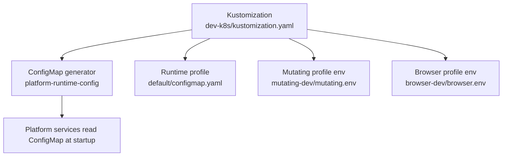
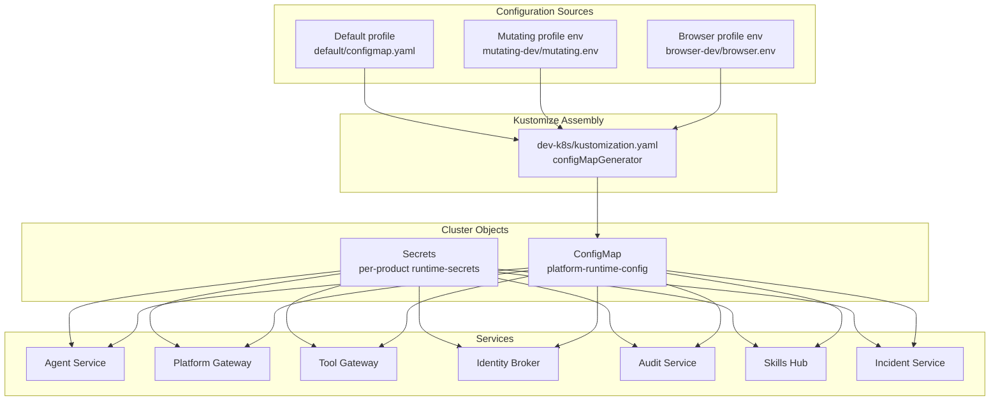
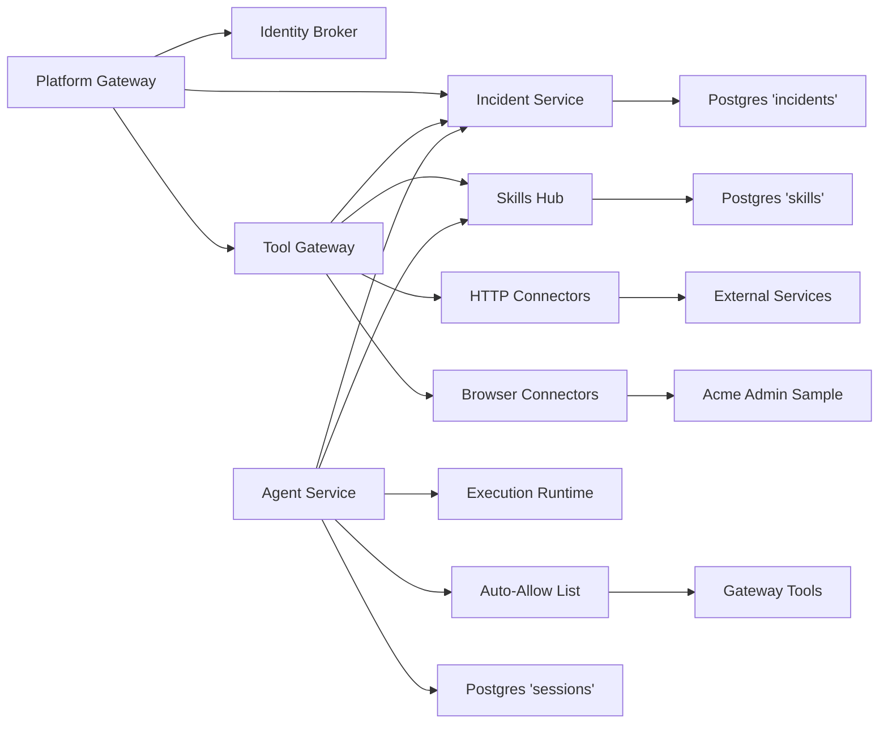

# Configuration Management

<cite>
**Referenced Files in This Document**
- [kustomization.yaml](file://shared/platform-ops/gitops/dev-k8s/kustomization.yaml)
- [configmap.yaml](file://shared/platform-ops/gitops/runtime-profiles/default/configmap.yaml)
- [runtime-secrets.example.env](file://shared/platform-ops/gitops/runtime-profiles/default/runtime-secrets.example.env)
- [sync-runtime-secret.sh](file://shared/platform-ops/gitops/sync-runtime-secret.sh)
- [sync-delegation-secrets.sh](file://shared/platform-ops/gitops/sync-delegation-secrets.sh)
- [sync-execution-signing-secret.sh](file://shared/platform-ops/gitops/sync-execution-signing-secret.sh)
- [sync-sessions-db.sh](file://shared/platform-ops/gitops/sync-sessions-db.sh)
- [sync-incident-secrets.sh](file://shared/platform-ops/gitops/sync-incident-secrets.sh)
- [sync-skills-secrets.sh](file://shared/platform-ops/gitops/sync-skills-secrets.sh)
- [browser.env](file://shared/platform-ops/gitops/runtime-profiles/browser-dev/browser.env)
- [tool-gateway runtime-config.env](file://shared/platform-ops/gitops/dev-k8s/base/tool-gateway/runtime-config.env)
- [agent-platform runtime-config.env](file://shared/platform-ops/gitops/dev-k8s/base/agent-platform/runtime-config.env)
- [kernel_middleware.py](file://products/agent-platform/src/agent_service/services/kernel_middleware.py)
- [config.py](file://products/tool-gateway/src/tool_gateway/core/config.py)
</cite>

## Update Summary
**Changes Made**
- Added documentation for new `AGENT_GATEWAY_TOOL_AUTO_ALLOW_EXTRA` environment variable that enables additive tool auto-approval without restating the entire default allowlist
- Updated agent-platform auto-allow list section with both hardened default behavior and dev-cluster opt-in pattern
- Enhanced configuration examples to show the new additive pattern alongside replacement semantics
- Updated troubleshooting guidance for tool auto-approval scenarios
- Added reference to v0.39.1 hardening changes that removed `http.get` from built-in defaults

## Table of Contents
1. Introduction
2. Project Structure
3. Core Components
4. Architecture Overview
5. Detailed Component Analysis
6. Dependency Analysis
7. Performance Considerations
8. Troubleshooting Guide
9. Conclusion
10. Appendices

## Introduction
This document explains how the Luban AIOPS platform manages configuration and secrets across environments. It focuses on:
- The hierarchical configuration system that assembles a single ConfigMap named platform-runtime-config from product-scoped environment fragments under shared, agent-platform, execution-runtime, platform-gateway, tool-gateway, identity-broker, audit-service, skills-hub, and incident-service directories.
- The secret management strategy for runtime-sensitive values such as API keys, database credentials, OIDC client secrets, and delegation tokens.
- The sync scripts that provision secrets into the cluster and how they differ from non-secret ConfigMap values.
- How to change configuration without redeploying images.
- Environment-specific configuration, startup validation behavior, and troubleshooting techniques.
- Best practices for managing configuration across development, staging, and production.

## Project Structure
The configuration is assembled with Kustomize. The dev overlay defines a configMapGenerator that merges multiple env files into one ConfigMap named platform-runtime-config. Runtime profiles add additional environment fragments (for example, default, mutating-dev, browser-dev). Product deployments reference these ConfigMaps and Secrets through their deployment manifests.



**Diagram sources**
- [kustomization.yaml:9-15](file://shared/platform-ops/gitops/dev-k8s/kustomization.yaml#L9-L15)
- [configmap.yaml:1-11](file://shared/platform-ops/gitops/runtime-profiles/default/configmap.yaml#L1-L11)

**Section sources**
- [kustomization.yaml:1-22](file://shared/platform-ops/gitops/dev-k8s/kustomization.yaml#L1-L22)
- [configmap.yaml:1-11](file://shared/platform-ops/gitops/runtime-profiles/default/configmap.yaml#L1-L11)

## Core Components
- Platform runtime ConfigMap: Assembled by Kustomize from multiple env fragments. Non-secret configuration such as provider selection, model names, base URLs, feature toggles, and HTTP connector settings live here.
- Per-product runtime secrets: Stored in Kubernetes Secrets mounted as environment variables. Sensitive values such as API keys, database credentials, OIDC client secrets, and delegation tokens are managed via Secrets.
- Sync scripts: Shell utilities that generate or reuse secrets, write them into per-product runtime-secrets.env files, apply them to the cluster, and restart affected deployments.
- Environment overlays: Profiles under runtime-profiles allow environment-specific configuration without changing application code.

Key responsibilities:
- Non-secret configuration: Managed via ConfigMap; changes can be applied without image rebuilds.
- Secret configuration: Managed via Secrets; provisioned by sync scripts; changes require Secret updates and workload restarts.

**Section sources**
- [kustomization.yaml:9-15](file://shared/platform-ops/gitops/dev-k8s/kustomization.yaml#L9-L15)
- [runtime-secrets.example.env:1-57](file://shared/platform-ops/gitops/runtime-profiles/default/runtime-secrets.example.env#L1-L57)

## Architecture Overview
The platform uses a layered configuration approach:
- Base overlays define service deployments and per-service runtime-config.env files.
- Runtime profiles contribute additional environment fragments.
- Kustomize merges all env fragments into a single platform-runtime-config ConfigMap.
- Secrets are provisioned separately by sync scripts and mounted into pods.



**Diagram sources**
- [kustomization.yaml:9-15](file://shared/platform-ops/gitops/dev-k8s/kustomization.yaml#L9-L15)
- [configmap.yaml:1-11](file://shared/platform-ops/gitops/runtime-profiles/default/configmap.yaml#L1-L11)

## Detailed Component Analysis

### Hierarchical ConfigMap assembly
- The Kustomization file declares a configMapGenerator that merges environment files from runtime profiles into a single ConfigMap named platform-runtime-config.
- The default profile provides a ConfigMap with generic deploy labels and provider settings.
- Additional profiles (mutating-dev, browser-dev) contribute environment fragments that are merged into the same ConfigMap.

Operational implications:
- Non-secret configuration is centralized in one ConfigMap and consumed by services at startup.
- Adding or updating environment fragments in profiles updates the ConfigMap without rebuilding images.

**Section sources**
- [kustomization.yaml:9-15](file://shared/platform-ops/gitops/dev-k8s/kustomization.yaml#L9-L15)
- [configmap.yaml:1-11](file://shared/platform-ops/gitops/runtime-profiles/default/configmap.yaml#L1-L11)

### Agent auto-allow list configuration
The agent-platform includes a sophisticated auto-allow list system that controls which tools can execute without operator confirmation. This system has two configuration surfaces:

**Primary Auto-Allow List (`AGENT_GATEWAY_TOOL_AUTO_ALLOW`):**
- **Replacement semantics**: When set, completely replaces the built-in vetted default list
- **Empty string**: Disables all auto-approval (every tool parks for confirmation)
- **Unset**: Uses the built-in vetted default list
- **Format**: Comma-separated dotted tool names (e.g., `k8s.list_pods,k8s.get_pod`)

**Additive Extra List (`AGENT_GATEWAY_TOOL_AUTO_ALLOW_EXTRA`):**
- **Additive semantics**: Adds tools to the resolved allow-list without restating the entire list
- **Union behavior**: Entries are unioned with either the built-in default or the replacement set
- **Opt-in pattern**: Enables adding specific tools back into auto-approval without maintaining full lists
- **Format**: Comma-separated dotted tool names (e.g., `http.get`)

**v0.39.1 Hardening Changes:**
- `http.get` was removed from the built-in default due to outbound egress security concerns
- Development clusters now use `AGENT_GATEWAY_TOOL_AUTO_ALLOW_EXTRA=http.get` to preserve demo behavior
- Production installations get hardened defaults where `http.get` requires explicit approval

**Security Invariants:**
- Mutating tools are never auto-approved regardless of configuration
- Read-only invariant enforced at middleware level
- Tool-gateway still enforces origin allowlists and structural refusals on every call

**Development Configuration Example:**
```bash
# Dev cluster preserves http.get auto-approval behavior
AGENT_GATEWAY_TOOL_AUTO_ALLOW_EXTRA=http.get

# Alternative: Replace entire default list (not recommended)
AGENT_GATEWAY_TOOL_AUTO_ALLOW=k8s.list_pods,k8s.get_pod,skills.search
```

**Production Hardened Default:**
```bash
# No auto-allow configuration - uses hardened built-in defaults
# http.get requires explicit operator approval
```

**Section sources**
- [kernel_middleware.py:71-138](file://products/agent-platform/src/agent_service/services/kernel_middleware.py#L71-L138)
- [agent-platform runtime-config.env:23-30](file://shared/platform-ops/gitops/dev-k8s/base/agent-platform/runtime-config.env#L23-L30)

### Secret management strategy
Secrets are provisioned using dedicated sync scripts. Each script handles a specific concern:
- Runtime secrets: sync-runtime-secret.sh provisions agent-platform runtime secrets from a profile-scoped runtime-secrets.env file.
- Delegation secrets: sync-delegation-secrets.sh generates or reuses a shared client secret, writes it into platform-gateway and identity-broker runtime-secrets.env files, applies the corresponding Secrets, and restarts affected deployments.
- Execution signing key: sync-execution-signing-secret.sh ensures an execution signing key exists in a Secret and restarts the agent-service to pick it up.
- Incident secrets: sync-incident-secrets.sh provisions webhook tokens and query client secrets, ensures the incidents database exists, updates per-product runtime-secrets.env files, applies Secrets, and restarts workloads.
- Skills secrets: sync-skills-secrets.sh provisions query secrets, ensures the skills database exists, updates per-product runtime-secrets.env files, applies Secrets, and restarts workloads.
- Sessions database: sync-sessions-db.sh ensures the sessions database exists and restarts agent-service.

Non-secret vs protected values:
- Non-secret values (e.g., provider selection, model names, base URLs) belong in ConfigMap fragments and are merged by Kustomize.
- Protected values (API keys, database credentials, OIDC client secrets, delegation tokens) belong in Secrets and are provisioned by sync scripts.

**Section sources**
- [sync-runtime-secret.sh:1-29](file://shared/platform-ops/gitops/sync-runtime-secret.sh#L1-L29)
- [sync-delegation-secrets.sh:1-97](file://shared/platform-ops/gitops/sync-delegation-secrets.sh#L1-L97)
- [sync-execution-signing-secret.sh:1-72](file://shared/platform-ops/gitops/sync-execution-signing-secret.sh#L1-L72)
- [sync-incident-secrets.sh:1-176](file://shared/platform-ops/gitops/sync-incident-secrets.sh#L1-L176)
- [sync-skills-secrets.sh:1-197](file://shared/platform-ops/gitops/sync-skills-secrets.sh#L1-L197)
- [sync-sessions-db.sh:1-46](file://shared/platform-ops/gitops/sync-sessions-db.sh#L1-L46)
- [runtime-secrets.example.env:1-57](file://shared/platform-ops/gitops/runtime-profiles/default/runtime-secrets.example.env#L1-L57)

### Tool-gateway HTTP connector configuration
The tool-gateway includes HTTP connector functionality that enables `http.get` and `http.post` tools for service health checks and HTTP operations. These connectors are controlled by environment variables:

**HTTP Connector Environment Variables:**
- `GATEWAY_HTTP_ENABLED`: Master switch to enable/disable HTTP connector tools (default: `false`)
- `GATEWAY_HTTP_ALLOW_ORIGINS`: Comma-separated list of allowed origins (deny-by-default when empty)
- `GATEWAY_HTTP_TIMEOUT_MS`: Per-request timeout in milliseconds (default: 10000, max: 30000)
- `GATEWAY_HTTP_MAX_RESPONSE_BYTES`: Response body size cap (default: 65536 bytes)
- `GATEWAY_HTTP_MAX_REQUEST_BYTES`: Request body size cap for POST operations (default: 4096 bytes)
- `GATEWAY_HTTP_CREDENTIAL_SETS`: Path to credential sets file (defaults to browser credential path if unset)

**Security Model:**
- HTTP connectors are disabled by default (`GATEWAY_HTTP_ENABLED=false`)
- Origin allowlist is deny-by-default (empty list blocks all requests)
- Redirects are validated against the allowlist
- Loopback, link-local, and multicast addresses are always blocked
- Credential sets must be mounted as files (no inline secrets)

**Development Configuration:**
In the browser-dev profile, HTTP connectors are enabled alongside browser tools:
```bash
GATEWAY_HTTP_ENABLED=true
GATEWAY_HTTP_ALLOW_ORIGINS=http://acme-admin:8080
# Inherits credential sets from browser configuration
```

**Updated** The browser-dev profile no longer ships the static browser-check-target app (retired by SPEC-061), so the only permitted origin is now `http://acme-admin:8080`.

**Section sources**
- [config.py:25-31](file://products/tool-gateway/src/tool_gateway/core/config.py#L25-L31)
- [config.py:201-234](file://products/tool-gateway/src/tool_gateway/core/config.py#L201-L234)
- [browser.env:16-26](file://shared/platform-ops/gitops/runtime-profiles/browser-dev/browser.env#L16-L26)
- [tool-gateway runtime-config.env:46-70](file://shared/platform-ops/gitops/dev-k8s/base/tool-gateway/runtime-config.env#L46-L70)

### Browser profile configuration
The browser-dev profile serves as the browser posture profile for development environments. After SPEC-061, it no longer ships the static browser-check-target app and instead permits only the acme-admin sample application.

**Browser Profile Configuration:**
- `GATEWAY_BROWSER_ENABLED=true`: Enables browser web-check tools
- `GATEWAY_BROWSER_CDP_ENDPOINT=ws://localhost:9222`: Chromium DevTools Protocol endpoint
- `GATEWAY_BROWSER_ALLOW_ORIGINS=http://acme-admin:8080`: Single permitted origin (deny-by-default)
- `GATEWAY_BROWSER_CREDENTIAL_SETS=/etc/luban/browser-credentials/credential-sets.json`: Credential file path

**Updated** The browser-dev profile now functions purely as a posture profile, providing the sidecar NetworkPolicy and environment configuration without shipping any target applications. The static browser-check-target mock was retired in favor of the stateful acme-admin sample application.

**Section sources**
- [browser.env:1-26](file://shared/platform-ops/gitops/runtime-profiles/browser-dev/browser.env#L1-L26)
- [kustomization.yaml:1-29](file://shared/platform-ops/gitops/runtime-profiles/browser-dev/kustomization.yaml#L1-L29)

### Environment-specific configurations
- Default profile: Provides baseline provider configuration and optional catalog entries.
- Mutating-dev profile: Adds environment-specific flags via mutating.env.
- Browser-dev profile: Adds browser-related configuration via browser.env and patches tool-gateway with a sidecar. Also enables HTTP connectors for service health checks.

To switch environments:
- Select or create a runtime profile under runtime-profiles.
- Update the profile's env files or ConfigMap.
- Apply the overlay so Kustomize regenerates platform-runtime-config.

**Section sources**
- [kustomization.yaml:1-22](file://shared/platform-ops/gitops/dev-k8s/kustomization.yaml#L1-L22)
- [configmap.yaml:1-11](file://shared/platform-ops/gitops/runtime-profiles/default/configmap.yaml#L1-L11)

### Configuration validation at service startup
- Services read configuration from the merged ConfigMap and Secrets at startup.
- Missing or invalid configuration typically causes startup failures or feature gating. For example, if required LLM provider credentials are absent, the provider is disabled and discovery may fall back to curated lists or cached data.
- Secret provisioning scripts ensure required keys exist before restarting workloads. If a required secret is missing, services will fail open or closed according to their design (for example, signing_unavailable rejection paths).
- HTTP connector validation: When `GATEWAY_HTTP_ENABLED=false`, no HTTP tools are registered. When enabled but origin allowlist is empty, all HTTP requests are denied.
- Browser connector validation: When `GATEWAY_BROWSER_ENABLED=false`, no browser tools are registered. When enabled but origin allowlist is empty, all browser navigation is denied.
- Agent auto-allow validation: Tools listed in auto-allow configuration must be read-only; mutating tools are logged as misconfiguration but remain available for HITL approval.

Operational guidance:
- Validate that all required keys are present in the relevant runtime-secrets.env files before applying.
- Use the SKIP_* environment variables in sync scripts to bypass provisioning when CI injects secrets externally.
- Verify auto-allow list composition matches expected behavior for your environment.

[No sources needed since this section synthesizes behavior described by scripts and examples]

### Managing configuration changes without redeploying images
- Non-secret changes: Update environment fragments in runtime profiles and apply the overlay. Kustomize regenerates platform-runtime-config. Services must be restarted to pick up new ConfigMap values.
- Secret changes: Update the appropriate runtime-secrets.env file and run the corresponding sync script. The script applies the Secret and restarts affected deployments.
- HTTP connector changes: Toggle `GATEWAY_HTTP_ENABLED` and adjust timeout/size limits through ConfigMap updates without requiring image rebuilds.
- Browser configuration changes: Modify browser profile settings through ConfigMap updates without requiring image rebuilds.
- Agent auto-allow changes: Update `AGENT_GATEWAY_TOOL_AUTO_ALLOW` or `AGENT_GATEWAY_TOOL_AUTO_ALLOW_EXTRA` through ConfigMap updates; changes take effect on service restart.

Best practice:
- Keep non-secret configuration in profile env files and ConfigMaps.
- Keep sensitive configuration in Secrets and manage them exclusively via sync scripts.
- Test HTTP and browser connector configurations in development profiles before promoting to production.
- Use additive auto-allow patterns (`_EXTRA` variables) for environment-specific opt-ins rather than replacing entire default lists.

**Section sources**
- [kustomization.yaml:9-15](file://shared/platform-ops/gitops/dev-k8s/kustomization.yaml#L9-L15)
- [sync-runtime-secret.sh:1-29](file://shared/platform-ops/gitops/sync-runtime-secret.sh#L1-L29)
- [sync-delegation-secrets.sh:1-97](file://shared/platform-ops/gitops/sync-delegation-secrets.sh#L1-L97)
- [sync-incident-secrets.sh:1-176](file://shared/platform-ops/gitops/sync-incident-secrets.sh#L1-L176)
- [sync-skills-secrets.sh:1-197](file://shared/platform-ops/gitops/sync-skills-secrets.sh#L1-L197)

### Common configuration scenarios

#### Switching the active LLM provider
- Set provider selection and model metadata in the default profile ConfigMap fragment.
- Provide provider API keys in the runtime-secrets.example.env template and copy to the active profile's runtime-secrets.env.
- Apply the overlay and restart services to load the new provider configuration.

**Section sources**
- [configmap.yaml:1-11](file://shared/platform-ops/gitops/runtime-profiles/default/configmap.yaml#L1-L11)
- [runtime-secrets.example.env:1-57](file://shared/platform-ops/gitops/runtime-profiles/default/runtime-secrets.example.env#L1-L57)

#### Enabling token delegation between platform-gateway and identity-broker
- Run the delegation secret sync script to generate or reuse a shared client secret.
- The script updates both platform-gateway and identity-broker runtime-secrets.env files, applies Secrets, and restarts deployments.
- After rollout, the gateway can exchange user tokens for delegated tokens used by downstream services.

**Section sources**
- [sync-delegation-secrets.sh:1-97](file://shared/platform-ops/gitops/sync-delegation-secrets.sh#L1-L97)

#### Provisioning execution request signing
- Run the execution signing secret sync script. It reuses an existing key if present or generates a new one.
- The script applies the Secret and restarts agent-service so signed executions can proceed.

**Section sources**
- [sync-execution-signing-secret.sh:1-72](file://shared/platform-ops/gitops/sync-execution-signing-secret.sh#L1-L72)

#### Enabling incident intake and query
- Run the incident secrets sync script to provision webhook tokens and query client secrets.
- The script ensures the incidents database exists, updates per-product runtime-secrets.env files, applies Secrets, and restarts workloads.
- Point Alertmanager at the incident-service webhook endpoint with the provided bearer token.

**Section sources**
- [sync-incident-secrets.sh:1-176](file://shared/platform-ops/gitops/sync-incident-secrets.sh#L1-L176)

#### Enabling skills retrieval
- Run the skills secrets sync script to provision query secrets and optionally a Git PAT for remote skill sources.
- The script ensures the skills database exists, updates per-product runtime-secrets.env files, applies Secrets, and restarts workloads.

**Section sources**
- [sync-skills-secrets.sh:1-197](file://shared/platform-ops/gitops/sync-skills-secrets.sh#L1-L197)

#### Enabling HTTP service health checks
- Enable HTTP connectors by setting `GATEWAY_HTTP_ENABLED=true` in the browser-dev profile or create a custom profile.
- Configure `GATEWAY_HTTP_ALLOW_ORIGINS` with permitted service endpoints.
- Adjust timeout and size limits based on your service requirements.
- Optionally configure `GATEWAY_HTTP_CREDENTIAL_SETS` for authenticated endpoints.
- Apply the overlay and restart tool-gateway to register HTTP tools.

**Section sources**
- [browser.env:16-26](file://shared/platform-ops/gitops/runtime-profiles/browser-dev/browser.env#L16-L26)
- [tool-gateway runtime-config.env:46-70](file://shared/platform-ops/gitops/dev-k8s/base/tool-gateway/runtime-config.env#L46-L70)

#### Configuring browser web-check tools
- Enable browser tools by setting `GATEWAY_BROWSER_ENABLED=true` in the browser-dev profile.
- Configure `GATEWAY_BROWSER_CDP_ENDPOINT` to point to a reachable Chromium instance.
- Set `GATEWAY_BROWSER_ALLOW_ORIGINS` to permit the acme-admin sample application.
- Mount credential sets file for authenticated browser interactions.
- Apply the overlay and restart tool-gateway to register browser tools.

**Updated** The browser-dev profile now only permits the acme-admin origin after retiring the static browser-check-target app.

**Section sources**
- [browser.env:1-26](file://shared/platform-ops/gitops/runtime-profiles/browser-dev/browser.env#L1-L26)
- [kustomization.yaml:1-29](file://shared/platform-ops/gitops/runtime-profiles/browser-dev/kustomization.yaml#L1-L29)

#### Opting in specific tools to auto-approval
- Use `AGENT_GATEWAY_TOOL_AUTO_ALLOW_EXTRA` for additive opt-in of specific tools without restating the entire default list.
- Use `AGENT_GATEWAY_TOOL_AUTO_ALLOW` for complete replacement of the default allow-list (advanced use cases).
- Both variables support comma-separated dotted tool names with automatic normalization.
- Mutating tools cannot be auto-approved regardless of configuration.

**Development Pattern (Dev Cluster):**
```bash
# Preserve http.get auto-approval behavior for demos
AGENT_GATEWAY_TOOL_AUTO_ALLOW_EXTRA=http.get
```

**Production Pattern (Hardened Default):**
```bash
# No auto-allow configuration - uses hardened built-in defaults
# All tools require explicit operator approval
```

**Section sources**
- [kernel_middleware.py:117-138](file://products/agent-platform/src/agent_service/services/kernel_middleware.py#L117-L138)
- [agent-platform runtime-config.env:23-30](file://shared/platform-ops/gitops/dev-k8s/base/agent-platform/runtime-config.env#L23-L30)

### Conceptual overview


[No sources needed since this diagram shows conceptual workflow, not actual code structure]

## Dependency Analysis
The sync scripts coordinate dependencies across services and databases:
- Delegation secrets link platform-gateway and identity-broker via a shared client secret.
- Incident secrets link incident-service with callers (platform-gateway, tool-gateway, agent-service) via a shared query secret and a webhook token.
- Skills secrets link skills-hub with callers (tool-gateway, platform-gateway, agent-service) via a shared query secret.
- Execution signing links agent-service to a signing key stored in a Secret.
- Session store migration depends on Postgres being available and the sessions database existing.
- HTTP connectors depend on configured origin allowlists and optional credential sets.
- Browser connectors depend on CDP endpoint availability and configured origin allowlists.
- Agent auto-allow list depends on tool definitions being available at toolkit construction time.



**Diagram sources**
- [sync-delegation-secrets.sh:1-97](file://shared/platform-ops/gitops/sync-delegation-secrets.sh#L1-L97)
- [sync-incident-secrets.sh:1-176](file://shared/platform-ops/gitops/sync-incident-secrets.sh#L1-L176)
- [sync-skills-secrets.sh:1-197](file://shared/platform-ops/gitops/sync-skills-secrets.sh#L1-L197)
- [sync-execution-signing-secret.sh:1-72](file://shared/platform-ops/gitops/sync-execution-signing-secret.sh#L1-L72)
- [sync-sessions-db.sh:1-46](file://shared/platform-ops/gitops/sync-sessions-db.sh#L1-L46)
- [kernel_middleware.py:117-138](file://products/agent-platform/src/agent_service/services/kernel_middleware.py#L117-L138)

**Section sources**
- [sync-delegation-secrets.sh:1-97](file://shared/platform-ops/gitops/sync-delegation-secrets.sh#L1-L97)
- [sync-incident-secrets.sh:1-176](file://shared/platform-ops/gitops/sync-incident-secrets.sh#L1-L176)
- [sync-skills-secrets.sh:1-197](file://shared/platform-ops/gitops/sync-skills-secrets.sh#L1-L197)
- [sync-execution-signing-secret.sh:1-72](file://shared/platform-ops/gitops/sync-execution-signing-secret.sh#L1-L72)
- [sync-sessions-db.sh:1-46](file://shared/platform-ops/gitops/sync-sessions-db.sh#L1-L46)

## Performance Considerations
- Prefer ConfigMap-based configuration for non-secret values to avoid frequent Secret rotations.
- Batch configuration changes per environment to minimize rollout cycles.
- Use deterministic model pinning where possible to reduce live discovery overhead.
- Ensure database prerequisites exist before restarting services to avoid repeated restart loops.
- Configure appropriate HTTP timeout and size limits to prevent resource exhaustion.
- Monitor HTTP connector usage to tune timeout and size parameters based on actual service response patterns.
- Browser connector performance depends on CDP endpoint responsiveness and session management settings.
- Auto-allow list resolution occurs at service startup; frequent changes require service restarts.

[No sources needed since this section provides general guidance]

## Troubleshooting Guide
Common issues and resolutions:
- Missing runtime profile secret file: The runtime secret sync script requires a profile-scoped runtime-secrets.env file. Copy the example file and fill in values before running the script.
- Skipped provisioning in CI: Some scripts honor SKIP_* flags to skip provisioning when secrets are injected externally. Adjust flags accordingly.
- Database not found: Scripts for sessions, incidents, and skills check for Postgres and create databases idempotently. If Postgres is not deployed yet, deploy the overlay first.
- Stale configuration after update: After applying ConfigMap or Secret changes, restart affected deployments to pick up new values.
- Delegation chain broken: Re-run the delegation secret sync script to regenerate or reuse the shared client secret and restart platform-gateway and identity-broker.
- Execution signing unavailable: Re-run the execution signing secret sync script to ensure the signing key exists and restart agent-service.
- HTTP connector not working: Verify `GATEWAY_HTTP_ENABLED=true`, check origin allowlist configuration, and ensure target services are reachable.
- HTTP requests timing out: Increase `GATEWAY_HTTP_TIMEOUT_MS` for slow services or investigate network connectivity issues.
- HTTP responses too large: Adjust `GATEWAY_HTTP_MAX_RESPONSE_BYTES` if legitimate responses exceed the default limit.
- Browser connector not working: Verify `GATEWAY_BROWSER_ENABLED=true`, check CDP endpoint connectivity, and ensure origin allowlist includes acme-admin.
- Browser navigation denied: Check that `GATEWAY_BROWSER_ALLOW_ORIGINS` includes `http://acme-admin:8080` and that the acme-admin sample is deployed.
- Tool auto-approval not working: Verify auto-allow list configuration and check that tools are read-only; mutating tools cannot be auto-approved.
- Unexpected tool parking: Check if tool is in the correct auto-allow list (built-in default vs. extra list) and verify environment-specific overrides.

**Updated** After SPEC-061, the browser-dev profile no longer includes the static browser-check-target app, so browser navigation is only permitted to the acme-admin sample application.

**Updated** v0.39.1 hardening removed `http.get` from built-in defaults; development clusters use `AGENT_GATEWAY_TOOL_AUTO_ALLOW_EXTRA=http.get` to preserve demo behavior while production gets hardened defaults.

Verification steps:
- Confirm the platform-runtime-config ConfigMap contains expected keys.
- Confirm per-product Secrets contain required keys.
- Check rollout status for affected deployments after applying changes.
- Test HTTP connector endpoints directly to verify reachability and response sizes.
- Verify browser connectivity to acme-admin sample through the CDP endpoint.
- Check agent-service logs for auto-allow list resolution and tool registration.
- Verify tool auto-approval behavior matches expected environment posture.

**Section sources**
- [sync-runtime-secret.sh:1-29](file://shared/platform-ops/gitops/sync-runtime-secret.sh#L1-L29)
- [sync-delegation-secrets.sh:1-97](file://shared/platform-ops/gitops/sync-delegation-secrets.sh#L1-L97)
- [sync-execution-signing-secret.sh:1-72](file://shared/platform-ops/gitops/sync-execution-signing-secret.sh#L1-L72)
- [sync-incident-secrets.sh:1-176](file://shared/platform-ops/gitops/sync-incident-secrets.sh#L1-L176)
- [sync-skills-secrets.sh:1-197](file://shared/platform-ops/gitops/sync-skills-secrets.sh#L1-L197)
- [sync-sessions-db.sh:1-46](file://shared/platform-ops/gitops/sync-sessions-db.sh#L1-L46)

## Conclusion
Luban's configuration system separates non-secret and secret concerns:
- Non-secret configuration is assembled into a single ConfigMap via Kustomize from environment fragments across runtime profiles.
- Secrets are provisioned by targeted sync scripts that update per-product runtime-secrets.env files, apply Kubernetes Secrets, and restart workloads.
- Environment-specific behavior is achieved through runtime profiles and overlays without rebuilding images.
- HTTP connector configuration provides flexible service health checking capabilities with security controls.
- Browser connector configuration enables web application testing through Chromium automation with strict origin controls.
- Agent auto-allow list configuration supports both hardened defaults and environment-specific opt-ins through additive patterns.
- Following the documented procedures ensures consistent, auditable, and recoverable configuration management across development, staging, and production.

**Updated** The retirement of browser-check-target per SPEC-061 simplifies the browser configuration surface while maintaining full functionality through the stateful acme-admin sample application. The addition of `AGENT_GATEWAY_TOOL_AUTO_ALLOW_EXTRA` provides more granular control over tool auto-approval while maintaining security-hardened defaults.

[No sources needed since this section summarizes without analyzing specific files]

## Appendices

### Quick reference: Sync scripts and responsibilities
- sync-runtime-secret.sh: Provisions agent-platform runtime secrets from a profile-scoped env file.
- sync-delegation-secrets.sh: Provisions shared delegation secret for platform-gateway and identity-broker.
- sync-execution-signing-secret.sh: Provisions execution signing key for agent-service.
- sync-incident-secrets.sh: Provisions incident webhook and query secrets and ensures incidents database.
- sync-skills-secrets.sh: Provisions skills query secrets and ensures skills database.
- sync-sessions-db.sh: Ensures sessions database exists and restarts agent-service.

**Section sources**
- [sync-runtime-secret.sh:1-29](file://shared/platform-ops/gitops/sync-runtime-secret.sh#L1-L29)
- [sync-delegation-secrets.sh:1-97](file://shared/platform-ops/gitops/sync-delegation-secrets.sh#L1-L97)
- [sync-execution-signing-secret.sh:1-72](file://shared/platform-ops/gitops/sync-execution-signing-secret.sh#L1-L72)
- [sync-incident-secrets.sh:1-176](file://shared/platform-ops/gitops/sync-incident-secrets.sh#L1-L176)
- [sync-skills-secrets.sh:1-197](file://shared/platform-ops/gitops/sync-skills-secrets.sh#L1-L197)
- [sync-sessions-db.sh:1-46](file://shared/platform-ops/gitops/sync-sessions-db.sh#L1-L46)

### HTTP Connector Configuration Reference
**Environment Variables:**
- `GATEWAY_HTTP_ENABLED`: Enable/disable HTTP connector (default: false)
- `GATEWAY_HTTP_ALLOW_ORIGINS`: Comma-separated origin allowlist (deny-by-default)
- `GATEWAY_HTTP_TIMEOUT_MS`: Request timeout in ms (default: 10000, max: 30000)
- `GATEWAY_HTTP_MAX_RESPONSE_BYTES`: Response size cap (default: 65536)
- `GATEWAY_HTTP_MAX_REQUEST_BYTES`: Request body size cap (default: 4096)
- `GATEWAY_HTTP_CREDENTIAL_SETS`: Credential file path (defaults to browser path)

**Security Features:**
- Deny-by-default origin policy
- Redirect validation against allowlist
- Blocked loopback/link-local/multicast addresses
- File-based credential management only

**Section sources**
- [config.py:25-31](file://products/tool-gateway/src/tool_gateway/core/config.py#L25-L31)
- [config.py:201-234](file://products/tool-gateway/src/tool_gateway/core/config.py#L201-L234)
- [browser.env:16-26](file://shared/platform-ops/gitops/runtime-profiles/browser-dev/browser.env#L16-L26)

### Browser Connector Configuration Reference
**Environment Variables:**
- `GATEWAY_BROWSER_ENABLED`: Enable/disable browser connector (default: false)
- `GATEWAY_BROWSER_CDP_ENDPOINT`: Chromium DevTools Protocol endpoint (default: ws://localhost:9222)
- `GATEWAY_BROWSER_ALLOW_ORIGINS`: Comma-separated origin allowlist (deny-by-default)
- `GATEWAY_BROWSER_SESSION_TTL_SECONDS`: Browser session TTL (default: 600)
- `GATEWAY_BROWSER_MAX_SESSIONS`: Maximum concurrent browser sessions (default: 4)
- `GATEWAY_BROWSER_FLOW_MAX_STEPS`: Maximum steps per browser flow (default: 20)
- `GATEWAY_BROWSER_SCREENSHOT_MAX_BYTES`: Screenshot size cap (default: 65536)
- `GATEWAY_BROWSER_UPLOAD_DIR`: Directory for browser uploads (default: /tmp/browser-uploads)
- `GATEWAY_BROWSER_CREDENTIAL_SETS`: Credential file path

**Security Features:**
- Deny-by-default origin policy
- CDP endpoint validation
- Session management with TTL and limits
- File-based credential management only

**Updated** The browser-dev profile now only permits the acme-admin origin after retiring the static browser-check-target app per SPEC-061.

**Section sources**
- [config.py:17-24](file://products/tool-gateway/src/tool_gateway/core/config.py#L17-L24)
- [config.py:72-80](file://products/tool-gateway/src/tool_gateway/core/config.py#L72-L80)
- [browser.env:1-15](file://shared/platform-ops/gitops/runtime-profiles/browser-dev/browser.env#L1-L15)

### Agent Auto-Allow List Configuration Reference
**Environment Variables:**
- `AGENT_GATEWAY_TOOL_AUTO_ALLOW`: Replacement allow-list (comma-separated dotted tool names)
- `AGENT_GATEWAY_TOOL_AUTO_ALLOW_EXTRA`: Additive allow-list (comma-separated dotted tool names)

**Behavior Matrix:**
| `AUTO_ALLOW` | `AUTO_ALLOW_EXTRA` | Resolved Behavior |
|---|---|---|
| unset | unset | Built-in hardened defaults (no `http.get`) |
| unset | `http.get` | Defaults ∪ `{http_get}` |
| `k8s.get_pod` | `http.get` | `{k8s_get_pod, http_get}` |
| "" (empty) | unset | Nothing auto-approved |
| "" (empty) | `http.get` | `{http_get}` |

**Security Invariants:**
- Mutating tools are never auto-approved regardless of configuration
- Read-only invariant enforced at middleware level
- Tool-gateway still enforces origin allowlists and structural refusals
- Names normalized to sanitized form (dots → underscores)

**Development Pattern:**
```bash
# Dev cluster preserves http.get auto-approval for demos
AGENT_GATEWAY_TOOL_AUTO_ALLOW_EXTRA=http.get
```

**Production Pattern:**
```bash
# Hardened defaults - all tools require explicit approval
# No auto-allow configuration
```

**Section sources**
- [kernel_middleware.py:117-138](file://products/agent-platform/src/agent_service/services/kernel_middleware.py#L117-L138)
- [agent-platform runtime-config.env:23-30](file://shared/platform-ops/gitops/dev-k8s/base/agent-platform/runtime-config.env#L23-L30)