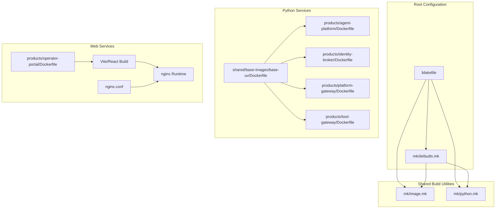
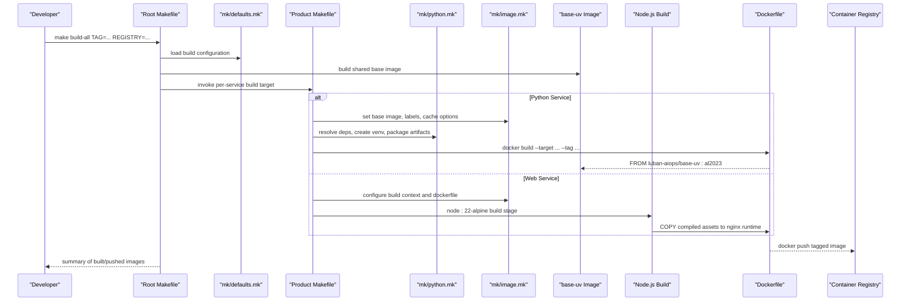
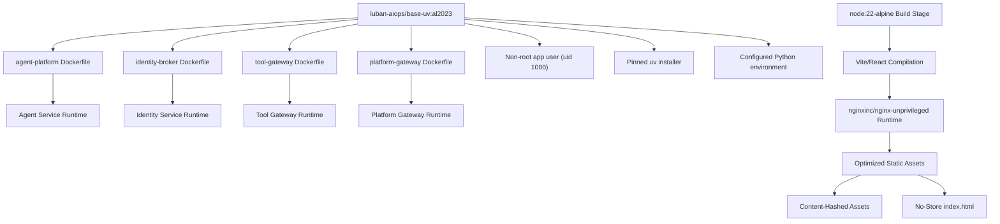
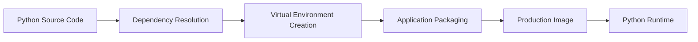
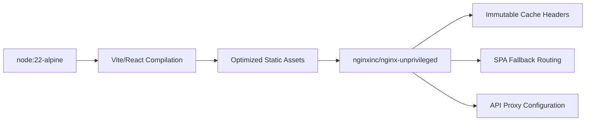
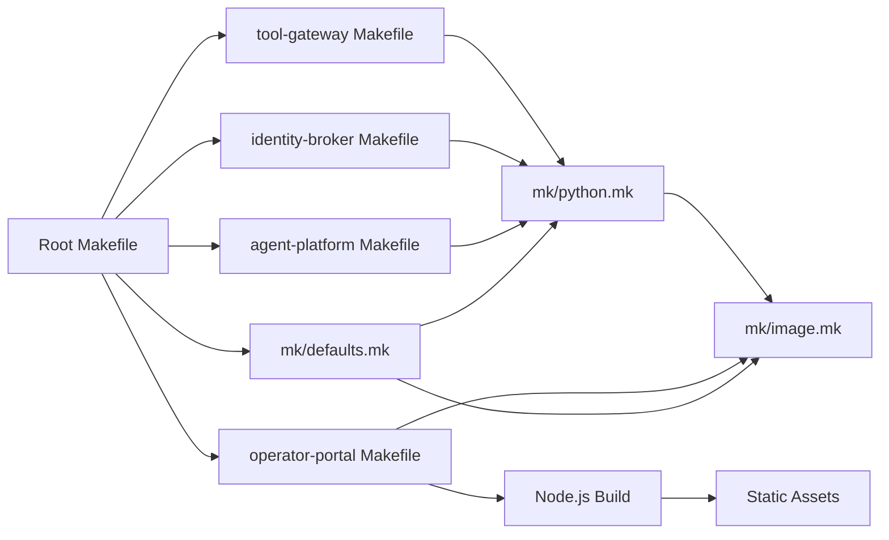

# Container Build and Management

<cite>
**Referenced Files in This Document**
- [Makefile](file://Makefile)
- [mk/defaults.mk](file://mk/defaults.mk)
- [mk/image.mk](file://mk/image.mk)
- [mk/python.mk](file://mk/python.mk)
- [shared/base-images/base-uv/Dockerfile](file://shared/base-images/base-uv/Dockerfile)
- [products/agent-platform/Dockerfile](file://products/agent-platform/Dockerfile)
- [products/agent-platform/Makefile](file://products/agent-platform/Makefile)
- [products/identity-broker/Dockerfile](file://products/identity-broker/Dockerfile)
- [products/identity-broker/Makefile](file://products/identity-broker/Makefile)
- [products/operator-portal/Dockerfile](file://products/operator-portal/Dockerfile)
- [products/operator-portal/Makefile](file://products/operator-portal/Makefile)
- [products/operator-portal/nginx.conf](file://products/operator-portal/nginx.conf)
- [products/platform-gateway/Dockerfile](file://products/platform-gateway/Dockerfile)
- [products/tool-gateway/Dockerfile](file://products/tool-gateway/Dockerfile)
- [products/tool-gateway/Makefile](file://products/tool-gateway/Makefile)
- [products/operator-portal/web-ui/app/vite.config.ts](file://products/operator-portal/web-ui/app/vite.config.ts)
- [products/operator-portal/web-ui/app/package.json](file://products/operator-portal/web-ui/app/package.json)
- [VERSION](file://VERSION)
- [.dockerignore](file://.dockerignore)
</cite>

## Update Summary
**Changes Made**
- Added comprehensive documentation for the new multi-stage Docker build process for the operator-portal service using Node.js for Vite/React compilation followed by nginx runtime image
- Updated architecture diagrams to reflect the dual build strategy (Python services vs static web UI)
- Enhanced security documentation covering the nginx-based static asset serving with proper caching headers
- Added detailed coverage of the Vite build configuration, version injection, and SPA routing setup
- Updated deployment preparation procedures to include the new web-ui image coordination

## Table of Contents
1. [Introduction](#introduction)
2. [Project Structure](#project-structure)
3. [Core Components](#core-components)
4. [Architecture Overview](#architecture-overview)
5. [Detailed Component Analysis](#detailed-component-analysis)
6. [Shared Base Image Strategy](#shared-base-image-strategy)
7. [Multi-Stage Build Patterns](#multi-stage-build-patterns)
8. [Dependency Analysis](#dependency-analysis)
9. [Performance Considerations](#performance-considerations)
10. [Security and Compliance](#security-and-compliance)
11. [Troubleshooting Guide](#troubleshooting-guide)
12. [Conclusion](#conclusion)

## Introduction
This document explains the container build and management system for the Luban AIOps Platform. It focuses on the Makefile-based build orchestration, Docker image construction, multi-stage builds for both Python applications and static web interfaces, shared utilities under mk/, optimization techniques, security scanning, image tagging strategies, registry management, versioning, and deployment preparation procedures. The platform now supports two distinct build patterns: Python services using the shared base-uv image and static web interfaces using Node.js compilation with nginx runtime.

## Project Structure
The repository uses a service-oriented layout with each product containing its own Dockerfile and Makefile. Shared build logic is centralized under mk/ with defaults.mk providing single-source-of-truth configuration. The root Makefile orchestrates common tasks such as building all images, pushing, and tagging while coordinating both Python base image and web UI build processes.

**Diagram sources**
- [Makefile](file://Makefile)
- [mk/defaults.mk](file://mk/defaults.mk)
- [mk/image.mk](file://mk/image.mk)
- [mk/python.mk](file://mk/python.mk)
- [shared/base-images/base-uv/Dockerfile](file://shared/base-images/base-uv/Dockerfile)
- [products/operator-portal/Dockerfile](file://products/operator-portal/Dockerfile)
- [products/operator-portal/nginx.conf](file://products/operator-portal/nginx.conf)

**Section sources**
- [Makefile](file://Makefile)
- [mk/defaults.mk](file://mk/defaults.mk)
- [mk/image.mk](file://mk/image.mk)
- [mk/python.mk](file://mk/python.mk)
- [shared/base-images/base-uv/Dockerfile](file://shared/base-images/base-uv/Dockerfile)
- [products/operator-portal/Dockerfile](file://products/operator-portal/Dockerfile)
- [products/operator-portal/nginx.conf](file://products/operator-portal/nginx.conf)
- [.dockerignore](file://.dockerignore)

## Core Components
- Root Makefile: Provides top-level targets for building, tagging, pushing, and scanning images across all products. It centralizes environment variables for registries, tags, and flags, and coordinates both the shared base image build process and web UI compilation.
- mk/defaults.mk: Single source of truth for overridable build settings including IMAGE_PLATFORM, IMAGE_TAG_PREFIX, REGISTRY, BASE_UV_* variables, and kind loading configuration.
- mk/image.mk: Common image build helpers (base image selection, builder stages, cache mounts, labels, signing hooks).
- mk/python.mk: Python-specific build helpers (dependency resolution, virtual environment setup, build isolation, artifact packaging).
- Per-service Dockerfiles: Multi-stage builds tailored to each service's runtime - Python services use the shared base-uv image, while the operator-portal uses Node.js compilation with nginx runtime.
- Per-service Makefiles: Product-level targets that compose shared rules into concrete build commands.

Key responsibilities:
- Standardize base images, labels, and metadata through centralized defaults.
- Enforce reproducible builds via pinned dependencies and caches.
- Provide consistent tagging and push workflows with coordinated image naming.
- Integrate security scanning and optional signing.
- Maintain shared base image consistency across all Python services.
- Support multi-stage builds for static web assets with optimized caching.

**Section sources**
- [Makefile](file://Makefile)
- [mk/defaults.mk](file://mk/defaults.mk)
- [mk/image.mk](file://mk/image.mk)
- [mk/python.mk](file://mk/python.mk)

## Architecture Overview
The build architecture follows a layered approach with centralized configuration supporting both Python and static web services:
- Top-level Makefile coordinates cross-product operations and base image builds.
- mk/defaults.mk provides single-source-of-truth configuration for all build settings.
- Shared mk/* modules encapsulate reusable logic for image and Python builds.
- Python services implement streamlined pipelines using the shared base-uv image.
- Static web services use Node.js compilation with nginx runtime for optimal performance.
- Per-product Makefiles bind shared rules to product-specific inputs and outputs.

**Diagram sources**
- [Makefile](file://Makefile)
- [mk/defaults.mk](file://mk/defaults.mk)
- [mk/image.mk](file://mk/image.mk)
- [mk/python.mk](file://mk/python.mk)
- [shared/base-images/base-uv/Dockerfile](file://shared/base-images/base-uv/Dockerfile)
- [products/operator-portal/Dockerfile](file://products/operator-portal/Dockerfile)

## Detailed Component Analysis

### Centralized Build Configuration: mk/defaults.mk
Purpose:
- Single source of truth for all overridable build settings.
- Provides default values for IMAGE_PLATFORM, IMAGE_TAG_PREFIX, REGISTRY, and BASE_UV_* variables.
- Supports command-line overrides while maintaining reproducibility.

Key behaviors:
- Guard against double inclusion to prevent configuration conflicts.
- Coordinated image tag generation with profile support.
- Auto-loading built images into local kind clusters.
- Pinned base image versions for deterministic builds.

Configuration examples:
- IMAGE_PLATFORM: Target platform for all image builds (default: linux/amd64)
- IMAGE_TAG_PREFIX: Coordinated image tag prefix (default: dev-k8s)
- BASE_UV_IMAGE: Base uv image name (default: luban-aiops/base-uv)
- BASE_UV_TAG: Base uv image tag (default: al2023)

**Section sources**
- [mk/defaults.mk](file://mk/defaults.mk)

### Shared Build Utilities: mk/image.mk
Purpose:
- Define common image variables (base image, labels, annotations).
- Provide helper targets for building, caching, and pushing images consistently.
- Support multi-arch builds and optional signing.

Key behaviors:
- Centralized base image pinning for reproducibility.
- Consistent label schema for provenance and metadata.
- Cache mount configuration to speed up repeated builds.
- Push target that respects REGISTRY and TAG variables.
- Flexible context and dockerfile path configuration for different build patterns.

Optimization tips:
- Use layer ordering to maximize cache hits.
- Leverage .dockerignore to reduce context size.
- Pin base images by digest where possible.
- Configure appropriate build contexts for complex projects.

**Section sources**
- [mk/image.mk](file://mk/image.mk)

### Shared Build Utilities: mk/python.mk
Purpose:
- Standardize Python dependency resolution and packaging.
- Create isolated environments and produce build artifacts for Docker layers.
- Ensure deterministic installs using lock files.

Key behaviors:
- Dependency resolution step that reads project lock files.
- Virtual environment creation and install of dependencies.
- Artifact packaging step that produces minimal runtime bundles.
- Targets compatible with multi-stage Dockerfiles.

Optimization tips:
- Separate dependency installation from application code to leverage Docker cache.
- Use read-only filesystems in final runtime stage.
- Avoid installing unnecessary packages.

**Section sources**
- [mk/python.mk](file://mk/python.mk)

### Shared Base Image: luban-aiops/base-uv:al2023
Purpose:
- Unified Python runtime environment for all backend services.
- Amazon Linux 2023 minimal with pinned uv and no system Python.
- Non-root user enforcement with app user (uid 1000).

Key characteristics:
- Uses public.ecr.aws/amazonlinux/amazonlinux:2023-minimal as base.
- Installs uv at /usr/local/bin with configurable version.
- Configures UV_PYTHON for deterministic Python version resolution.
- Sets up non-root app user with proper file ownership.
- Exposes essential environment variables for uv operation.

Build arguments:
- UV_VERSION: uv installer version (default: 0.12.1)
- PYTHON_VERSION: Default Python version (default: 3.12)

Security features:
- Runs as non-root app user by default.
- Minimal attack surface with only necessary packages.
- Cleaned package manager cache after installation.

**Section sources**
- [shared/base-images/base-uv/Dockerfile](file://shared/base-images/base-uv/Dockerfile)

### Python Services: agent-platform, identity-broker, tool-gateway
Build characteristics:
- Streamlined Dockerfiles using the shared base-uv image.
- Single-stage builds optimized for production deployment.
- Consistent file copying pattern with proper ownership.
- Dependency installation using uv sync with frozen mode.

Tagging and pushing:
- Product Makefile composes shared rules to tag images with semantic versions and branch names.
- Push target publishes to configured REGISTRY.

Security considerations:
- Non-root user inheritance from base-uv image.
- Minimal base image selection.
- Optional vulnerability scanning via integrated targets.

**Section sources**
- [products/agent-platform/Dockerfile](file://products/agent-platform/Dockerfile)
- [products/agent-platform/Makefile](file://products/agent-platform/Makefile)
- [products/identity-broker/Dockerfile](file://products/identity-broker/Dockerfile)
- [products/identity-broker/Makefile](file://products/identity-broker/Makefile)
- [products/tool-gateway/Dockerfile](file://products/tool-gateway/Dockerfile)
- [products/tool-gateway/Makefile](file://products/tool-gateway/Makefile)
- [mk/python.mk](file://mk/python.mk)
- [mk/image.mk](file://mk/image.mk)

### Static Web Service: operator-portal with Multi-Stage Build
**Updated** The operator-portal now uses a sophisticated multi-stage build process that compiles Vite/React frontend assets using Node.js and serves them through an optimized nginx runtime.

Build characteristics:
- **Stage 1 (Build)**: Uses `node:22-alpine` to compile the Vite/React SPA from `web-ui/app`. The build context is set to the repository root to access the VERSION file for PLATFORM_VERSION injection.
- **Stage 2 (Runtime)**: Uses `nginxinc/nginx-unprivileged:1.27-alpine` to serve the compiled static assets with optimized caching headers and API proxy configuration.

Key features:
- **Version Injection**: Reads the root VERSION file during build time to inject `PLATFORM_VERSION` into the application via Vite's define configuration.
- **Optimized Caching**: Content-hashed assets are served with immutable cache headers (`Cache-Control: public, max-age=31536000, immutable`) while index.html remains no-store for immediate deploys.
- **SPA Routing**: Proper client-side routing fallback to index.html for deep linking support.
- **API Proxy**: Proxies `/api/` requests to the platform gateway with appropriate headers and timeouts.

Build Process:
1. Mirror repository structure in build container to maintain relative path resolution
2. Install dependencies using `npm ci` for deterministic builds
3. Copy source code and run `npm run build` to generate optimized static assets
4. Serve compiled assets through nginx with optimized configuration

Security considerations:
- Minimal OS base image with unprivileged nginx
- No unnecessary binaries or scripts included
- Scanning targets enabled for compliance
- Proper separation of build and runtime concerns

**Section sources**
- [products/operator-portal/Dockerfile:1-29](file://products/operator-portal/Dockerfile#L1-L29)
- [products/operator-portal/Makefile:1-14](file://products/operator-portal/Makefile#L1-L14)
- [products/operator-portal/nginx.conf:1-32](file://products/operator-portal/nginx.conf#L1-L32)
- [products/operator-portal/web-ui/app/vite.config.ts:1-38](file://products/operator-portal/web-ui/app/vite.config.ts#L1-L38)
- [products/operator-portal/web-ui/app/package.json:1-36](file://products/operator-portal/web-ui/app/package.json#L1-L36)
- [mk/image.mk:1-58](file://mk/image.mk#L1-L58)

### Root Makefile Orchestration
Responsibilities:
- Aggregate per-service build targets for both Python and web services.
- Manage global variables like REGISTRY, TAG, DOCKER_BUILDKIT, and SCAN_ENABLED.
- Provide convenience targets for build-all, push-all, scan-all, and clean.
- Coordinate shared base image building before product builds.
- Write coordinated image state file including the new web-ui image reference.

Usage patterns:
- Local development: make build-all TAG=dev-latest
- CI pipeline: make build-all TAG=vX.Y.Z REGISTRY=registry.example.com
- Security gates: make scan-all SCAN_ENABLED=true
- Base image building: make base-images

**Section sources**
- [Makefile:1-178](file://Makefile#L1-L178)

### Docker Context Optimization: .dockerignore
Purpose:
- Exclude unnecessary files from Docker build context to reduce image size and build time.
- Prevent secrets and local artifacts from being baked into images.

Recommended exclusions:
- Version control directories.
- Local logs and temporary files.
- IDE configurations and test fixtures not needed at runtime.
- Python cache directories and virtual environments.

**Section sources**
- [.dockerignore](file://.dockerignore)

## Shared Base Image Strategy
The shared base image strategy centralizes Python runtime configuration across all backend services, while the operator-portal uses a separate Node.js-based build strategy for optimal static asset serving.

### Base Image Architecture

**Diagram sources**
- [shared/base-images/base-uv/Dockerfile](file://shared/base-images/base-uv/Dockerfile)
- [products/operator-portal/Dockerfile](file://products/operator-portal/Dockerfile)
- [products/operator-portal/nginx.conf](file://products/operator-portal/nginx.conf)

### Benefits of Dual Build Strategy
- **Python Services**: Consistent runtime environments with shared base-uv image for backend services
- **Web Services**: Optimized static asset compilation and serving with nginx for frontend interfaces
- **Security**: Both strategies enforce non-root execution and minimal attack surfaces
- **Performance**: Content-hashed assets enable long-term caching while allowing immediate deploys
- **Maintainability**: Clear separation between build-time and runtime concerns

### Build Process Integration
The root Makefile coordinates both build strategies:
1. Build shared base-uv image for Python services
2. Build individual product images using appropriate strategies
3. Apply coordinated tagging strategy across all services
4. Push to registry with consistent naming including web-ui image

**Section sources**
- [shared/base-images/base-uv/Dockerfile](file://shared/base-images/base-uv/Dockerfile)
- [products/operator-portal/Dockerfile](file://products/operator-portal/Dockerfile)
- [Makefile:90-116](file://Makefile#L90-L116)
- [mk/defaults.mk](file://mk/defaults.mk)

## Multi-Stage Build Patterns
The platform now supports two distinct multi-stage build patterns optimized for different service types.

### Python Service Pattern

**Diagram sources**
- [mk/python.mk](file://mk/python.mk)
- [shared/base-images/base-uv/Dockerfile](file://shared/base-images/base-uv/Dockerfile)

### Web Service Pattern

**Diagram sources**
- [products/operator-portal/Dockerfile](file://products/operator-portal/Dockerfile)
- [products/operator-portal/nginx.conf](file://products/operator-portal/nginx.conf)
- [products/operator-portal/web-ui/app/vite.config.ts](file://products/operator-portal/web-ui/app/vite.config.ts)

### Version Injection Strategy
Both build patterns support version injection:
- **Python Services**: Use shared base image with consistent Python versioning
- **Web Services**: Read root VERSION file during build time to inject PLATFORM_VERSION
- **Coordinated Releases**: All services share the same coordinated image tag

**Section sources**
- [products/operator-portal/web-ui/app/vite.config.ts:6-18](file://products/operator-portal/web-ui/app/vite.config.ts#L6-L18)
- [VERSION:1-2](file://VERSION#L1-L2)
- [Makefile:33-36](file://Makefile#L33-L36)

## Dependency Analysis
The build system exhibits clear separation between shared utilities and product-specific implementations:
- mk/* modules are imported by both root and product Makefiles.
- Dockerfiles depend on mk/python.mk conventions for consistent Python builds.
- Root Makefile depends on product Makefiles to aggregate results.
- New centralized configuration in mk/defaults.mk provides single source of truth.
- Web services integrate with the same build infrastructure while using different base images.

**Diagram sources**
- [Makefile](file://Makefile)
- [mk/defaults.mk](file://mk/defaults.mk)
- [mk/image.mk](file://mk/image.mk)
- [mk/python.mk](file://mk/python.mk)
- [products/operator-portal/Makefile](file://products/operator-portal/Makefile)

**Section sources**
- [Makefile](file://Makefile)
- [mk/defaults.mk](file://mk/defaults.mk)
- [mk/image.mk](file://mk/image.mk)
- [mk/python.mk](file://mk/python.mk)

## Performance Considerations
- **Multi-stage builds**: Separate dependency resolution and build steps from runtime to minimize final image size.
- **Layer caching**: Order instructions to maximize cache hits; isolate dependency installation above code changes.
- **Context size**: Use .dockerignore to exclude large or irrelevant files.
- **Base images**: Choose slim or distroless variants where feasible.
- **Parallelization**: Build independent services concurrently in CI when possible.
- **BuildKit**: Enable DOCKER_BUILDKIT for improved caching and parallelism.
- **Shared base images**: Reduce redundant Python runtime layers across services.
- **Static asset optimization**: Content-hashed assets enable long-term browser caching while allowing immediate deploys.
- **Nginx optimization**: Unprivileged nginx with optimized caching headers reduces bandwidth usage.

## Security and Compliance
### Non-Root Enforcement
All services inherit non-root execution from their respective base images:
- **Python Services**: App user with uid 1000 created during base image build
- **Web Services**: Unprivileged nginx running as non-root user
- **File ownership**: Properly set for application directories across all services

### Base Image Security
- **Python Services**: Amazon Linux 2023 minimal base reduces attack surface
- **Web Services**: Alpine-based nginx with minimal package footprint
- **Only essential packages installed**: curl-minimal, ca-certificates, tar, gzip, shadow-utils
- **Package manager cache cleaned**: After installation across all base images
- **Pinned versions**: For all dependencies to ensure reproducibility

### Build Security
- **Frozen dependency resolution**: Prevents supply chain attacks in Python services
- **Read-only filesystem recommendations**: For runtime containers
- **Vulnerability scanning integration**: Available for all image types
- **Least privilege principle**: Applied throughout build process
- **Secure build contexts**: Proper .dockerignore configuration prevents secret exposure

### Compliance Features
- **Consistent labeling and metadata**: Across all images regardless of build type
- **Reproducible builds**: With pinned versions and deterministic dependency resolution
- **Audit trail**: Through coordinated tagging strategy
- **Centralized configuration management**: Via mk/defaults.mk

**Section sources**
- [shared/base-images/base-uv/Dockerfile](file://shared/base-images/base-uv/Dockerfile)
- [products/operator-portal/Dockerfile](file://products/operator-portal/Dockerfile)
- [mk/defaults.mk](file://mk/defaults.mk)
- [.dockerignore](file://.dockerignore)

## Troubleshooting Guide
Common issues and resolutions:
- **Build context too large**: Review .dockerignore and remove unnecessary files.
- **Dependency resolution failures**: Ensure lock files are present and up-to-date; verify network access in CI.
- **Permission errors in runtime stage**: Confirm non-root user and file ownership settings.
- **Push failures**: Validate REGISTRY credentials and permissions; check rate limits and policies.
- **Inconsistent builds**: Pin base images and dependencies; enable strict mode in Make targets.
- **Base image build failures**: Verify internet connectivity for downloading uv installer and dependencies.
- **Python version conflicts**: Check .python-version files match BASE_UV_PYTHON_VERSION setting.
- **Node.js build failures**: Ensure Node.js version compatibility (>=22) and network access for npm ci.
- **Version injection issues**: Verify root VERSION file exists and is readable by the build context.
- **SPA routing problems**: Check nginx configuration for proper fallback to index.html.

Operational tips:
- Use incremental builds locally to validate changes quickly.
- Run scanning early in CI to catch vulnerabilities before promotion.
- Maintain consistent TAG formats across services for coordinated rollouts.
- Test base image updates in isolation before applying to all services.
- Monitor shared base image usage across all dependent services.
- Validate web UI builds separately from Python services for faster iteration.

## Conclusion
The Luban AIOps Platform employs a robust, standardized container build system centered around Makefiles and shared utilities with centralized configuration. The platform now supports two distinct build strategies: Python services using the shared base-uv image and static web interfaces using Node.js compilation with nginx runtime. The new multi-stage build process for the operator-portal service demonstrates how different service types can be optimized while maintaining consistent build practices, security standards, and deployment procedures.

The introduction of mk/defaults.mk provides a single source of truth for build configuration, making it easier to maintain consistency across the entire platform while allowing flexible overrides for different environments. The dual build strategy significantly improves both efficiency and security posture by eliminating redundant configurations while optimizing each service type for its specific runtime requirements.

The coordinated build system ensures that all services, whether Python-based or web-based, follow the same tagging, scanning, and deployment procedures, enabling reliable releases and consistent operational practices across the entire platform.