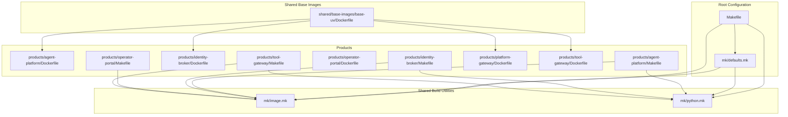
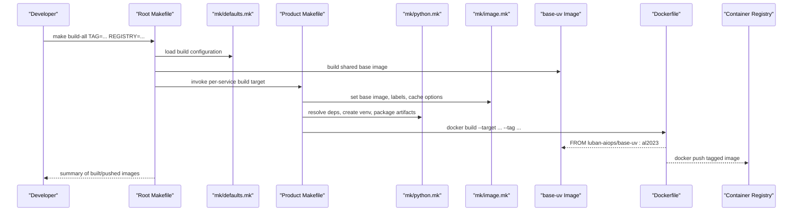
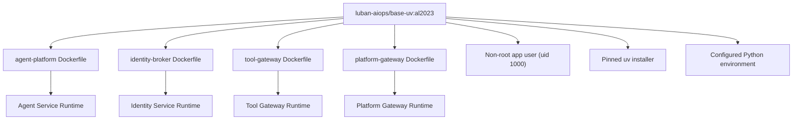
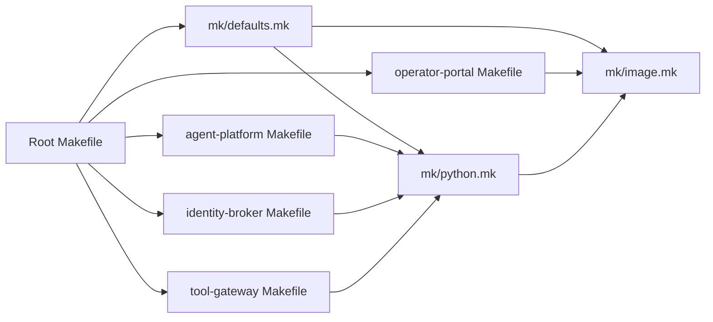

# Container Build and Management

<cite>
**Referenced Files in This Document**
- [Makefile](file://Makefile)
- [mk/defaults.mk](file://mk/defaults.mk)
- [mk/image.mk](file://mk/image.mk)
- [mk/python.mk](file://mk/python.mk)
- [shared/base-images/base-uv/Dockerfile](file://shared/base-images/base-uv/Dockerfile)
- [products/agent-platform/Dockerfile](file://products/agent-platform/Dockerfile)
- [products/agent-platform/Makefile](file://products/agent-platform/Makefile)
- [products/identity-broker/Dockerfile](file://products/identity-broker/Dockerfile)
- [products/identity-broker/Makefile](file://products/identity-broker/Makefile)
- [products/operator-portal/Dockerfile](file://products/operator-portal/Dockerfile)
- [products/operator-portal/Makefile](file://products/operator-portal/Makefile)
- [products/platform-gateway/Dockerfile](file://products/platform-gateway/Dockerfile)
- [products/tool-gateway/Dockerfile](file://products/tool-gateway/Dockerfile)
- [products/tool-gateway/Makefile](file://products/tool-gateway/Makefile)
- [.dockerignore](file://.dockerignore)
</cite>

## Update Summary
**Changes Made**
- Added comprehensive documentation for the new mk/defaults.mk centralized build configuration system
- Updated base image strategy documentation to cover the new luban-aiops/base-uv:al2023 shared base image
- Enhanced security documentation covering non-root enforcement and standardized Dockerfiles across Python services
- Updated architecture diagrams to reflect the consolidated build system structure
- Added detailed coverage of the shared base image construction and optimization techniques

## Table of Contents
1. [Introduction](#introduction)
2. [Project Structure](#project-structure)
3. [Core Components](#core-components)
4. [Architecture Overview](#architecture-overview)
5. [Detailed Component Analysis](#detailed-component-analysis)
6. [Shared Base Image Strategy](#shared-base-image-strategy)
7. [Dependency Analysis](#dependency-analysis)
8. [Performance Considerations](#performance-considerations)
9. [Security and Compliance](#security-and-compliance)
10. [Troubleshooting Guide](#troubleshooting-guide)
11. [Conclusion](#conclusion)

## Introduction
This document explains the container build and management system for the Luban AIOps Platform. It focuses on the Makefile-based build orchestration, Docker image construction, multi-stage builds for Python applications, shared utilities under mk/, optimization techniques, security scanning, image tagging strategies, registry management, versioning, and deployment preparation procedures. The goal is to provide a clear, consistent guide for building, securing, and shipping platform images across services with a unified base image strategy and centralized build configuration.

## Project Structure
The repository uses a service-oriented layout with each product containing its own Dockerfile and Makefile. Shared build logic is centralized under mk/ with a new defaults.mk providing single-source-of-truth configuration. The root Makefile orchestrates common tasks such as building all images, pushing, and tagging while coordinating the shared base image build process.

**Diagram sources**
- [Makefile](file://Makefile)
- [mk/defaults.mk](file://mk/defaults.mk)
- [mk/image.mk](file://mk/image.mk)
- [mk/python.mk](file://mk/python.mk)
- [shared/base-images/base-uv/Dockerfile](file://shared/base-images/base-uv/Dockerfile)
- [products/agent-platform/Dockerfile](file://products/agent-platform/Dockerfile)
- [products/agent-platform/Makefile](file://products/agent-platform/Makefile)
- [products/identity-broker/Dockerfile](file://products/identity-broker/Dockerfile)
- [products/identity-broker/Makefile](file://products/identity-broker/Makefile)
- [products/operator-portal/Dockerfile](file://products/operator-portal/Dockerfile)
- [products/operator-portal/Makefile](file://products/operator-portal/Makefile)
- [products/platform-gateway/Dockerfile](file://products/platform-gateway/Dockerfile)
- [products/tool-gateway/Dockerfile](file://products/tool-gateway/Dockerfile)
- [products/tool-gateway/Makefile](file://products/tool-gateway/Makefile)

**Section sources**
- [Makefile](file://Makefile)
- [mk/defaults.mk](file://mk/defaults.mk)
- [mk/image.mk](file://mk/image.mk)
- [mk/python.mk](file://mk/python.mk)
- [shared/base-images/base-uv/Dockerfile](file://shared/base-images/base-uv/Dockerfile)
- [.dockerignore](file://.dockerignore)

## Core Components
- Root Makefile: Provides top-level targets for building, tagging, pushing, and scanning images across all products. It centralizes environment variables for registries, tags, and flags, and coordinates the shared base image build process.
- mk/defaults.mk: Single source of truth for overridable build settings including IMAGE_PLATFORM, IMAGE_TAG_PREFIX, REGISTRY, BASE_UV_* variables, and kind loading configuration.
- mk/image.mk: Common image build helpers (base image selection, builder stages, cache mounts, labels, signing hooks).
- mk/python.mk: Python-specific build helpers (dependency resolution, virtual environment setup, build isolation, artifact packaging).
- Per-service Dockerfiles: Multi-stage builds tailored to each service's runtime (Python or static assets), all using the shared base-uv image.
- Per-service Makefiles: Product-level targets that compose shared rules into concrete build commands.

Key responsibilities:
- Standardize base images, labels, and metadata through centralized defaults.
- Enforce reproducible builds via pinned dependencies and caches.
- Provide consistent tagging and push workflows with coordinated image naming.
- Integrate security scanning and optional signing.
- Maintain shared base image consistency across all Python services.

**Section sources**
- [Makefile](file://Makefile)
- [mk/defaults.mk](file://mk/defaults.mk)
- [mk/image.mk](file://mk/image.mk)
- [mk/python.mk](file://mk/python.mk)

## Architecture Overview
The build architecture follows a layered approach with centralized configuration:
- Top-level Makefile coordinates cross-product operations and base image builds.
- mk/defaults.mk provides single-source-of-truth configuration for all build settings.
- Shared mk/* modules encapsulate reusable logic for image and Python builds.
- Each product's Dockerfile implements a streamlined pipeline optimized for its runtime using the shared base-uv image.
- Per-product Makefiles bind shared rules to product-specific inputs and outputs.

**Diagram sources**
- [Makefile](file://Makefile)
- [mk/defaults.mk](file://mk/defaults.mk)
- [mk/image.mk](file://mk/image.mk)
- [mk/python.mk](file://mk/python.mk)
- [shared/base-images/base-uv/Dockerfile](file://shared/base-images/base-uv/Dockerfile)

## Detailed Component Analysis

### Centralized Build Configuration: mk/defaults.mk
Purpose:
- Single source of truth for all overridable build settings.
- Provides default values for IMAGE_PLATFORM, IMAGE_TAG_PREFIX, REGISTRY, and BASE_UV_* variables.
- Supports command-line overrides while maintaining reproducibility.

Key behaviors:
- Guard against double inclusion to prevent configuration conflicts.
- Coordinated image tag generation with profile support.
- Auto-loading built images into local kind clusters.
- Pinned base image versions for deterministic builds.

Configuration examples:
- IMAGE_PLATFORM: Target platform for all image builds (default: linux/amd64)
- IMAGE_TAG_PREFIX: Coordinated image tag prefix (default: dev-k8s)
- BASE_UV_IMAGE: Base uv image name (default: luban-aiops/base-uv)
- BASE_UV_TAG: Base uv image tag (default: al2023)

**Section sources**
- [mk/defaults.mk](file://mk/defaults.mk)

### Shared Build Utilities: mk/image.mk
Purpose:
- Define common image variables (base image, labels, annotations).
- Provide helper targets for building, caching, and pushing images consistently.
- Support multi-arch builds and optional signing.

Key behaviors:
- Centralized base image pinning for reproducibility.
- Consistent label schema for provenance and metadata.
- Cache mount configuration to speed up repeated builds.
- Push target that respects REGISTRY and TAG variables.

Optimization tips:
- Use layer ordering to maximize cache hits.
- Leverage .dockerignore to reduce context size.
- Pin base images by digest where possible.

**Section sources**
- [mk/image.mk](file://mk/image.mk)

### Shared Build Utilities: mk/python.mk
Purpose:
- Standardize Python dependency resolution and packaging.
- Create isolated environments and produce build artifacts for Docker layers.
- Ensure deterministic installs using lock files.

Key behaviors:
- Dependency resolution step that reads project lock files.
- Virtual environment creation and install of dependencies.
- Artifact packaging step that produces minimal runtime bundles.
- Targets compatible with multi-stage Dockerfiles.

Optimization tips:
- Separate dependency installation from application code to leverage Docker cache.
- Use read-only filesystems in final runtime stage.
- Avoid installing unnecessary packages.

**Section sources**
- [mk/python.mk](file://mk/python.mk)

### Shared Base Image: luban-aiops/base-uv:al2023
Purpose:
- Unified Python runtime environment for all backend services.
- Amazon Linux 2023 minimal with pinned uv and no system Python.
- Non-root user enforcement with app user (uid 1000).

Key characteristics:
- Uses public.ecr.aws/amazonlinux/amazonlinux:2023-minimal as base.
- Installs uv at /usr/local/bin with configurable version.
- Configures UV_PYTHON for deterministic Python version resolution.
- Sets up non-root app user with proper file ownership.
- Exposes essential environment variables for uv operation.

Build arguments:
- UV_VERSION: uv installer version (default: 0.12.1)
- PYTHON_VERSION: Default Python version (default: 3.12)

Security features:
- Runs as non-root app user by default.
- Minimal attack surface with only necessary packages.
- Cleaned package manager cache after installation.

**Section sources**
- [shared/base-images/base-uv/Dockerfile](file://shared/base-images/base-uv/Dockerfile)

### Python Services: agent-platform, identity-broker, tool-gateway
Build characteristics:
- Streamlined Dockerfiles using the shared base-uv image.
- Single-stage builds optimized for production deployment.
- Consistent file copying pattern with proper ownership.
- Dependency installation using uv sync with frozen mode.

Tagging and pushing:
- Product Makefile composes shared rules to tag images with semantic versions and branch names.
- Push target publishes to configured REGISTRY.

Security considerations:
- Non-root user inheritance from base-uv image.
- Minimal base image selection.
- Optional vulnerability scanning via integrated targets.

**Section sources**
- [products/agent-platform/Dockerfile](file://products/agent-platform/Dockerfile)
- [products/agent-platform/Makefile](file://products/agent-platform/Makefile)
- [products/identity-broker/Dockerfile](file://products/identity-broker/Dockerfile)
- [products/identity-broker/Makefile](file://products/identity-broker/Makefile)
- [products/tool-gateway/Dockerfile](file://products/tool-gateway/Dockerfile)
- [products/tool-gateway/Makefile](file://products/tool-gateway/Makefile)
- [mk/python.mk](file://mk/python.mk)
- [mk/image.mk](file://mk/image.mk)

### Static Web Service: operator-portal
Build characteristics:
- Single-stage Dockerfile using nginxinc/nginx-unprivileged base image.
- Nginx-based serving of static web UI assets.
- No Python runtime; relies on mk/image.mk for base image and labels.

Tagging and pushing:
- Tagged consistently with other services for coordinated releases.
- Push target supports staging and production registries.

Security considerations:
- Minimal OS base image.
- No unnecessary binaries or scripts included.
- Scanning targets enabled for compliance.

**Section sources**
- [products/operator-portal/Dockerfile](file://products/operator-portal/Dockerfile)
- [products/operator-portal/Makefile](file://products/operator-portal/Makefile)
- [mk/image.mk](file://mk/image.mk)

### Root Makefile Orchestration
Responsibilities:
- Aggregate per-service build targets.
- Manage global variables like REGISTRY, TAG, DOCKER_BUILDKIT, and SCAN_ENABLED.
- Provide convenience targets for build-all, push-all, scan-all, and clean.
- Coordinate shared base image building before product builds.

Usage patterns:
- Local development: make build-all TAG=dev-latest
- CI pipeline: make build-all TAG=vX.Y.Z REGISTRY=registry.example.com
- Security gates: make scan-all SCAN_ENABLED=true
- Base image building: make base-images

**Section sources**
- [Makefile](file://Makefile)

### Docker Context Optimization: .dockerignore
Purpose:
- Exclude unnecessary files from Docker build context to reduce image size and build time.
- Prevent secrets and local artifacts from being baked into images.

Recommended exclusions:
- Version control directories.
- Local logs and temporary files.
- IDE configurations and test fixtures not needed at runtime.
- Python cache directories and virtual environments.

**Section sources**
- [.dockerignore](file://.dockerignore)

## Shared Base Image Strategy
The new shared base image strategy centralizes Python runtime configuration across all backend services:

### Base Image Architecture

**Diagram sources**
- [shared/base-images/base-uv/Dockerfile](file://shared/base-images/base-uv/Dockerfile)
- [products/agent-platform/Dockerfile](file://products/agent-platform/Dockerfile)
- [products/identity-broker/Dockerfile](file://products/identity-broker/Dockerfile)
- [products/tool-gateway/Dockerfile](file://products/tool-gateway/Dockerfile)
- [products/platform-gateway/Dockerfile](file://products/platform-gateway/Dockerfile)

### Benefits of Shared Base Image
- **Consistency**: All Python services run with identical runtime environments.
- **Security**: Centralized security updates and vulnerability patches.
- **Efficiency**: Reduced image sizes through shared layers.
- **Maintainability**: Single point of update for Python runtime changes.
- **Reproducibility**: Deterministic builds with pinned versions.

### Build Process Integration
The root Makefile coordinates the base image build before product builds:
1. Build shared base-uv image with configured versions
2. Build individual product images using the base image
3. Apply coordinated tagging strategy
4. Push to registry with consistent naming

**Section sources**
- [shared/base-images/base-uv/Dockerfile](file://shared/base-images/base-uv/Dockerfile)
- [Makefile](file://Makefile)
- [mk/defaults.mk](file://mk/defaults.mk)

## Dependency Analysis
The build system exhibits clear separation between shared utilities and product-specific implementations:
- mk/* modules are imported by both root and product Makefiles.
- Dockerfiles depend on mk/python.mk conventions for consistent Python builds.
- Root Makefile depends on product Makefiles to aggregate results.
- New centralized configuration in mk/defaults.mk provides single source of truth.

**Diagram sources**
- [Makefile](file://Makefile)
- [mk/defaults.mk](file://mk/defaults.mk)
- [mk/image.mk](file://mk/image.mk)
- [mk/python.mk](file://mk/python.mk)
- [products/agent-platform/Makefile](file://products/agent-platform/Makefile)
- [products/identity-broker/Makefile](file://products/identity-broker/Makefile)
- [products/operator-portal/Makefile](file://products/operator-portal/Makefile)
- [products/tool-gateway/Makefile](file://products/tool-gateway/Makefile)

**Section sources**
- [Makefile](file://Makefile)
- [mk/defaults.mk](file://mk/defaults.mk)
- [mk/image.mk](file://mk/image.mk)
- [mk/python.mk](file://mk/python.mk)

## Performance Considerations
- Multi-stage builds: Separate dependency resolution and build steps from runtime to minimize final image size.
- Layer caching: Order instructions to maximize cache hits; isolate dependency installation above code changes.
- Context size: Use .dockerignore to exclude large or irrelevant files.
- Base images: Choose slim or distroless variants where feasible.
- Parallelization: Build independent services concurrently in CI when possible.
- BuildKit: Enable DOCKER_BUILDKIT for improved caching and parallelism.
- Shared base images: Reduce redundant Python runtime layers across services.

## Security and Compliance
### Non-Root Enforcement
All Python services inherit non-root execution from the shared base-uv image:
- App user with uid 1000 created during base image build
- File ownership properly set for application directories
- No root privileges required for service operation

### Base Image Security
- Amazon Linux 2023 minimal base reduces attack surface
- Only essential packages installed (curl-minimal, ca-certificates, tar, gzip, shadow-utils)
- Package manager cache cleaned after installation
- Pinned versions for all dependencies

### Build Security
- Frozen dependency resolution prevents supply chain attacks
- Read-only filesystem recommendations for runtime
- Vulnerability scanning integration available
- Least privilege principle applied throughout build process

### Compliance Features
- Consistent labeling and metadata across all images
- Reproducible builds with pinned versions
- Audit trail through coordinated tagging strategy
- Centralized configuration management

**Section sources**
- [shared/base-images/base-uv/Dockerfile](file://shared/base-images/base-uv/Dockerfile)
- [mk/defaults.mk](file://mk/defaults.mk)
- [.dockerignore](file://.dockerignore)

## Troubleshooting Guide
Common issues and resolutions:
- Build context too large: Review .dockerignore and remove unnecessary files.
- Dependency resolution failures: Ensure lock files are present and up-to-date; verify network access in CI.
- Permission errors in runtime stage: Confirm non-root user and file ownership settings.
- Push failures: Validate REGISTRY credentials and permissions; check rate limits and policies.
- Inconsistent builds: Pin base images and dependencies; enable strict mode in Make targets.
- Base image build failures: Verify internet connectivity for downloading uv installer and dependencies.
- Python version conflicts: Check .python-version files match BASE_UV_PYTHON_VERSION setting.

Operational tips:
- Use incremental builds locally to validate changes quickly.
- Run scanning early in CI to catch vulnerabilities before promotion.
- Maintain consistent TAG formats across services for coordinated rollouts.
- Test base image updates in isolation before applying to all services.
- Monitor shared base image usage across all dependent services.

## Conclusion
The Luban AIOps Platform employs a robust, standardized container build system centered around Makefiles and shared utilities with centralized configuration. The new shared base-uv image strategy ensures consistent Python runtime environments across all backend services while maintaining security best practices. Multi-stage Dockerfiles ensure efficient, secure images for both Python and static services. Centralized mk/* modules enforce consistency across products, while root orchestration simplifies local and CI workflows. By following the recommended optimization, security, and tagging practices, teams can reliably build, scan, and deploy platform images with confidence.

The introduction of mk/defaults.mk provides a single source of truth for build configuration, making it easier to maintain consistency across the entire platform while allowing flexible overrides for different environments. The shared base image strategy significantly improves build efficiency and security posture by eliminating redundant Python runtime configurations across services.