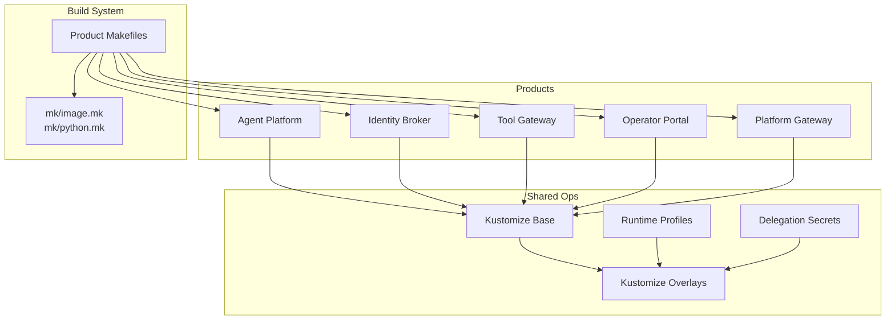
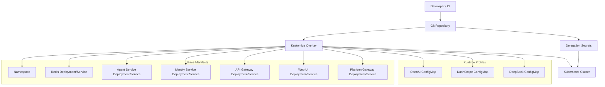
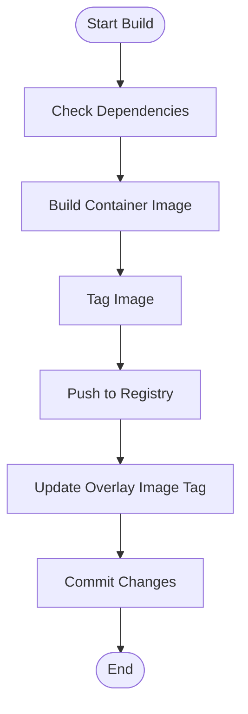
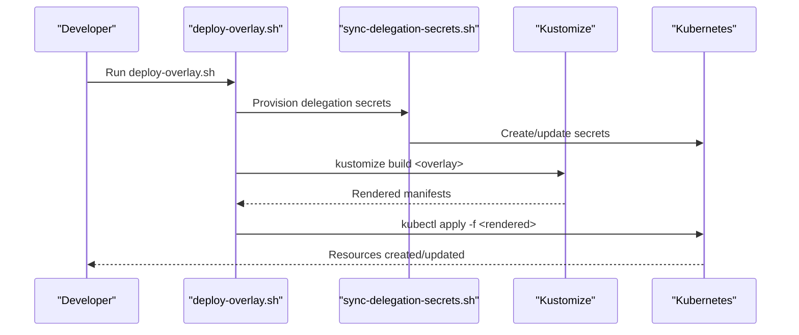
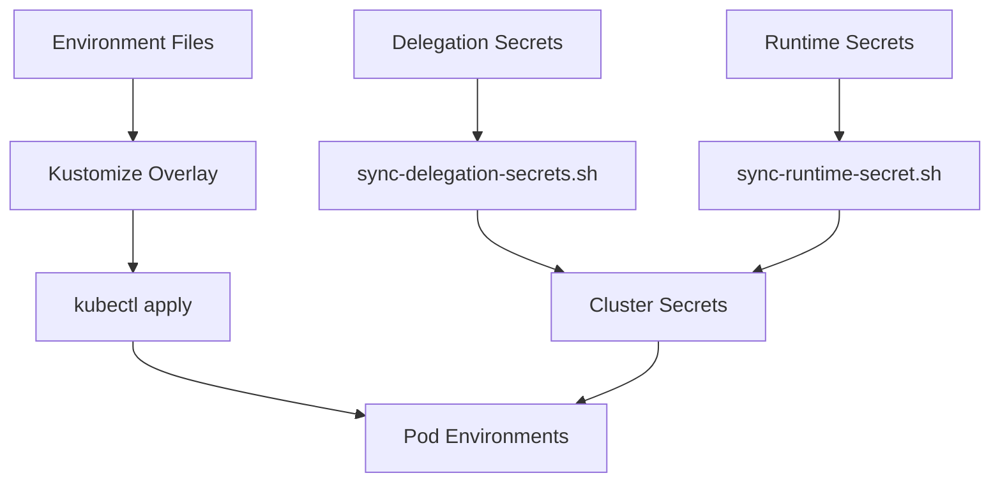
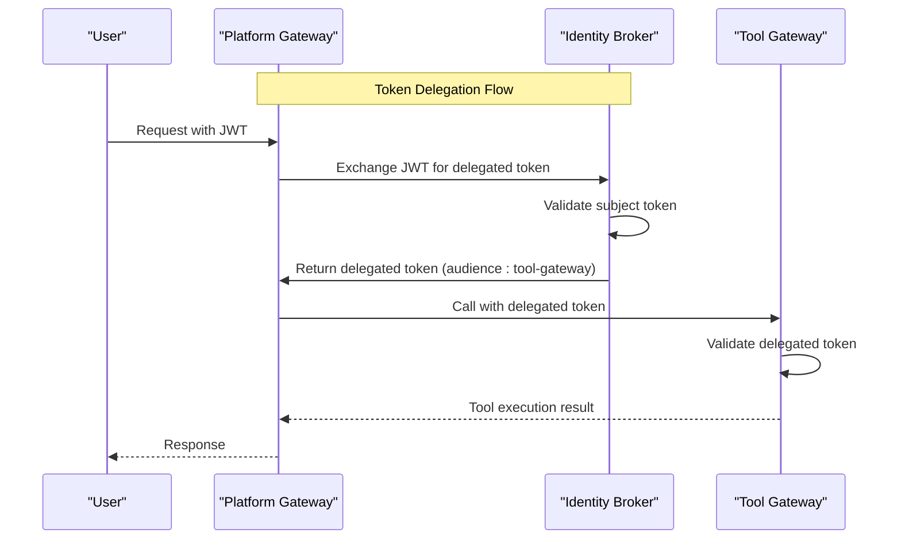
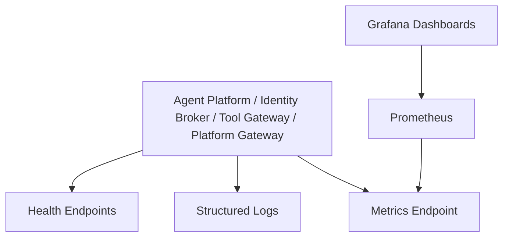
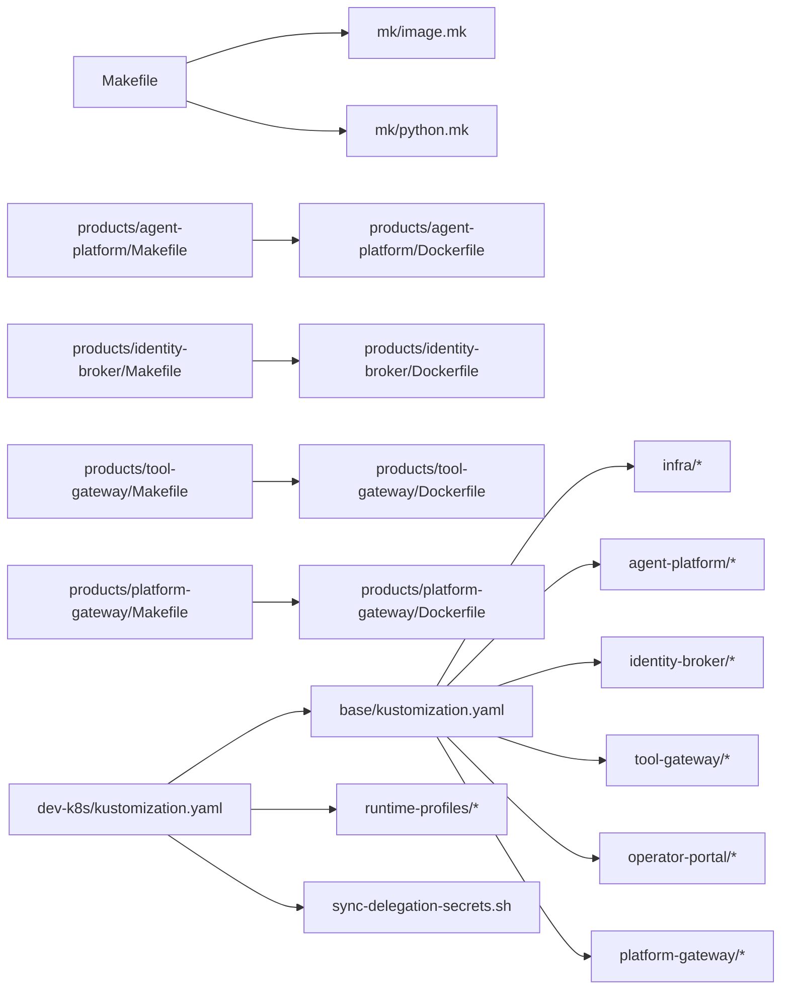

# Deployment and Operations

<cite>
**Referenced Files in This Document**
- [Makefile](file://Makefile)
- [README.md](file://README.md)
- [products/agent-platform/Dockerfile](file://products/agent-platform/Dockerfile)
- [products/agent-platform/Makefile](file://products/agent-platform/Makefile)
- [products/identity-broker/Dockerfile](file://products/identity-broker/Dockerfile)
- [products/identity-broker/Makefile](file://products/identity-broker/Makefile)
- [products/tool-gateway/Dockerfile](file://products/tool-gateway/Dockerfile)
- [products/tool-gateway/Makefile](file://products/tool-gateway/Makefile)
- [mk/image.mk](file://mk/image.mk)
- [mk/python.mk](file://mk/python.mk)
- [shared/platform-ops/gitops/dev-k8s/kustomization.yaml](file://shared/platform-ops/gitops/dev-k8s/kustomization.yaml)
- [shared/platform-ops/gitops/dev-k8s/base/kustomization.yaml](file://shared/platform-ops/gitops/dev-k8s/base/kustomization.yaml)
- [shared/platform-ops/gitops/dev-k8s/deploy.sh](file://shared/platform-ops/gitops/dev-k8s/deploy.sh)
- [shared/platform-ops/gitops/deploy-overlay.sh](file://shared/platform-ops/gitops/deploy-overlay.sh)
- [shared/platform-ops/gitops/select-runtime-profile.sh](file://shared/platform-ops/gitops/select-runtime-profile.sh)
- [shared/platform-ops/gitops/sync-runtime-secret.sh](file://shared/platform-ops/gitops/sync-runtime-secret.sh)
- [shared/platform-ops/gitops/sync-delegation-secrets.sh](file://shared/platform-ops/gitops/sync-delegation-secrets.sh)
- [shared/platform-ops/gitops/verify-runtime-profile.sh](file://shared/platform-ops/gitops/verify-runtime-profile.sh)
- [shared/platform-ops/gitops/runtime-profiles/openai/configmap.yaml](file://shared/platform-ops/gitops/runtime-profiles/openai/configmap.yaml)
- [shared/platform-ops/gitops/runtime-profiles/openai/kustomization.yaml](file://shared/platform-ops/gitops/runtime-profiles/openai/kustomization.yaml)
- [shared/platform-ops/gitops/runtime-profiles/dashscope/configmap.yaml](file://shared/platform-ops/gitops/runtime-profiles/dashscope/configmap.yaml)
- [shared/platform-ops/gitops/runtime-profiles/dashscope/kustomization.yaml](file://shared/platform-ops/gitops/runtime-profiles/dashscope/configmap.yaml)
- [shared/platform-ops/gitops/runtime-profiles/deepseek/configmap.yaml](file://shared/platform-ops/gitops/runtime-profiles/deepseek/configmap.yaml)
- [shared/platform-ops/gitops/runtime-profiles/deepseek/kustomization.yaml](file://shared/platform-ops/gitops/runtime-profiles/deepseek/configmap.yaml)
- [shared/platform-ops/gitops/dev-k8s/base/shared/observability.env](file://shared/platform-ops/gitops/dev-k8s/base/shared/observability.env)
- [shared/platform-ops/gitops/dev-k8s/base/agent-platform/runtime-config.env](file://shared/platform-ops/gitops/dev-k8s/base/agent-platform/runtime-config.env)
- [shared/platform-ops/gitops/dev-k8s/base/identity-broker/runtime-config.env](file://shared/platform-ops/gitops/dev-k8s/base/identity-broker/runtime-config.env)
- [shared/platform-ops/gitops/dev-k8s/base/tool-gateway/runtime-config.env](file://shared/platform-ops/gitops/dev-k8s/base/tool-gateway/runtime-config.env)
- [shared/platform-ops/gitops/dev-k8s/base/infra/redis-deployment.yaml](file://shared/platform-ops/gitops/dev-k8s/base/infra/redis-deployment.yaml)
- [shared/platform-ops/gitops/dev-k8s/base/infra/redis-service.yaml](file://shared/platform-ops/gitops/dev-k8s/base/infra/redis-service.yaml)
- [shared/platform-ops/gitops/dev-k8s/base/agent-platform/agent-service-deployment.yaml](file://shared/platform-ops/gitops/dev-k8s/base/agent-platform/agent-service-deployment.yaml)
- [shared/platform-ops/gitops/dev-k8s/base/agent-platform/agent-service-service.yaml](file://shared/platform-ops/gitops/dev-k8s/base/agent-platform/agent-service-service.yaml)
- [shared/platform-ops/gitops/dev-k8s/base/identity-broker/identity-service-deployment.yaml](file://shared/platform-ops/gitops/dev-k8s/base/identity-broker/identity-service-deployment.yaml)
- [shared/platform-ops/gitops/dev-k8s/base/identity-broker/identity-service-service.yaml](file://shared/platform-ops/gitops/dev-k8s/base/identity-broker/identity-service-service.yaml)
- [shared/platform-ops/gitops/dev-k8s/base/operator-portal/web-ui-deployment.yaml](file://shared/platform-ops/gitops/dev-k8s/base/operator-portal/web-ui-deployment.yaml)
- [shared/platform-ops/gitops/dev-k8s/base/operator-portal/web-ui-service.yaml](file://shared/platform-ops/gitops/dev-k8s/base/operator-portal/web-ui-service.yaml)
- [shared/platform-ops/gitops/dev-k8s/base/tool-gateway/api-gateway-deployment.yaml](file://shared/platform-ops/gitops/dev-k8s/base/tool-gateway/api-gateway-deployment.yaml)
- [shared/platform-ops/gitops/dev-k8s/base/tool-gateway/api-gateway-service.yaml](file://shared/platform-ops/gitops/dev-k8s/base/tool-gateway/api-gateway-service.yaml)
- [shared/platform-ops/gitops/dev-k8s/base/tool-gateway/policy.yaml](file://shared/platform-ops/gitops/dev-k8s/base/tool-gateway/policy.yaml)
- [shared/platform-ops/gitops/dev-k8s/base/tool-gateway/rbac.yaml](file://shared/platform-ops/gitops/dev-k8s/base/tool-gateway/rbac.yaml)
- [shared/platform-ops/gitops/dev-k8s/reconcile-portal-oidc-client.sh](file://shared/platform-ops/gitops/dev-k8s/reconcile-portal-oidc-client.sh)
- [products/agent-platform/src/agent_service/core/metrics.py](file://products/agent-platform/src/agent_service/core/metrics.py)
- [products/agent-platform/src/agent_service/core/observability.py](file://products/agent-platform/src/agent_service/core/observability.py)
- [products/identity-broker/src/identity_service/core/metrics.py](file://products/identity-broker/src/identity_service/core/metrics.py)
- [products/identity-broker/src/identity_service/core/observability.py](file://products/identity-broker/src/identity_service/core/observability.py)
- [products/tool-gateway/src/api_gateway/core/metrics.py](file://products/tool-gateway/src/api_gateway/core/metrics.py)
- [products/tool-gateway/src/api_gateway/core/observability.py](file://products/tool-gateway/src/api_gateway/core/observability.py)
- [products/platform-gateway/src/platform_gateway/services/delegation_client.py](file://products/platform-gateway/src/platform_gateway/services/delegation_client.py)
- [products/identity-broker/src/identity_service/services/exchange_service.py](file://products/identity-broker/src/identity_service/services/exchange_service.py)
- [products/platform-gateway/src/platform_gateway/core/config.py](file://products/platform-gateway/src/platform_gateway/core/config.py)
- [shared/platform-ops/gitops/dev-k8s/base/platform-gateway/runtime-secrets.example.env](file://shared/platform-ops/gitops/dev-k8s/base/platform-gateway/runtime-secrets.example.env)
- [shared/platform-ops/gitops/dev-k8s/base/identity-broker/runtime-secrets.example.env](file://shared/platform-ops/gitops/dev-k8s/base/identity-broker/runtime-secrets.example.env)
</cite>

## Update Summary
**Changes Made**
- Added comprehensive documentation for delegation secret auto-provisioning via sync-delegation-secrets.sh script
- Enhanced GitOps workflow documentation for cross-service authentication tokens
- Updated secrets management section with new delegation secret provisioning process
- Added detailed explanation of token delegation chain between platform-gateway and identity-broker
- Updated operational procedures to include delegation secret synchronization steps

## Table of Contents
1. Introduction
2. Project Structure
3. Core Components
4. Architecture Overview
5. Detailed Component Analysis
6. Dependency Analysis
7. Performance Considerations
8. Troubleshooting Guide
9. Conclusion
10. Appendices

## Introduction
This document provides comprehensive deployment and operations guidance for the Luban AIOps Platform. It focuses on Kubernetes deployment using GitOps with Kustomize overlays, container build processes, image management, automation scripts, environment configuration, secrets management (including enhanced delegation secret auto-provisioning), scaling strategies, monitoring setup (Prometheus metrics, structured logging, health checks), operational procedures (updates, rollbacks, disaster recovery, capacity planning), performance tuning, resource optimization, and troubleshooting common issues.

## Project Structure
The platform is organized into multiple products and shared operational assets:
- Products: agent-platform, identity-broker, tool-gateway, operator-portal, platform-gateway
- Shared ops: GitOps manifests under shared/platform-ops/gitops with base and runtime profiles
- Build system: Makefiles per product and shared mk rules for images and Python packaging



**Diagram sources**
- [shared/platform-ops/gitops/dev-k8s/base/kustomization.yaml](file://shared/platform-ops/gitops/dev-k8s/base/kustomization.yaml)
- [shared/platform-ops/gitops/dev-k8s/kustomization.yaml](file://shared/platform-ops/gitops/dev-k8s/kustomization.yaml)
- [shared/platform-ops/gitops/runtime-profiles/openai/kustomization.yaml](file://shared/platform-ops/gitops/runtime-profiles/openai/kustomization.yaml)
- [mk/image.mk](file://mk/image.mk)
- [mk/python.mk](file://mk/python.mk)
- [products/agent-platform/Makefile](file://products/agent-platform/Makefile)
- [products/identity-broker/Makefile](file://products/identity-broker/Makefile)
- [products/tool-gateway/Makefile](file://products/tool-gateway/Makefile)

**Section sources**
- [README.md](file://README.md)
- [shared/platform-ops/gitops/dev-k8s/base/kustomization.yaml](file://shared/platform-ops/gitops/dev-k8s/base/kustomization.yaml)
- [shared/platform-ops/gitops/dev-k8s/kustomization.yaml](file://shared/platform-ops/gitops/dev-k8s/kustomization.yaml)
- [mk/image.mk](file://mk/image.mk)
- [mk/python.mk](file://mk/python.mk)

## Core Components
- Agent Platform: Provides agent runtime services, session management, and provider integrations. Exposes metrics and observability hooks.
- Identity Broker: Handles authentication, token issuance, and identity context propagation. Supports token delegation and exchange operations.
- Tool Gateway: API gateway enforcing policies, routing to agents/tools, and exposing metrics and observability hooks.
- Operator Portal: Web UI for operators to manage platform resources and configurations.
- Platform Gateway: Central gateway that handles user authentication and delegates tokens to downstream services through the identity broker.

Key operational artifacts:
- Dockerfiles per product define container images.
- Product Makefiles orchestrate builds and pushes.
- mk/image.mk and mk/python.mk provide reusable build targets.
- Kustomize base defines Kubernetes resources; overlays select runtime profiles and apply environment-specific patches.
- Shell scripts automate deployment, secret synchronization, profile selection, verification, and delegation secret provisioning.

**Section sources**
- [products/agent-platform/Dockerfile](file://products/agent-platform/Dockerfile)
- [products/identity-broker/Dockerfile](file://products/identity-broker/Dockerfile)
- [products/tool-gateway/Dockerfile](file://products/tool-gateway/Dockerfile)
- [products/agent-platform/Makefile](file://products/agent-platform/Makefile)
- [products/identity-broker/Makefile](file://products/identity-broker/Makefile)
- [products/tool-gateway/Makefile](file://products/tool-gateway/Makefile)
- [mk/image.mk](file://mk/image.mk)
- [mk/python.mk](file://mk/python.mk)

## Architecture Overview
The platform deploys as a set of Kubernetes workloads orchestrated via Kustomize. The GitOps workflow uses overlays to compose base manifests with environment-specific settings and runtime profiles. Enhanced with automated delegation secret provisioning for secure cross-service communication.



**Diagram sources**
- [shared/platform-ops/gitops/dev-k8s/base/kustomization.yaml](file://shared/platform-ops/gitops/dev-k8s/base/kustomization.yaml)
- [shared/platform-ops/gitops/dev-k8s/base/infra/redis-deployment.yaml](file://shared/platform-ops/gitops/dev-k8s/base/infra/redis-deployment.yaml)
- [shared/platform-ops/gitops/dev-k8s/base/agent-platform/agent-service-deployment.yaml](file://shared/platform-ops/gitops/dev-k8s/base/agent-platform/agent-service-deployment.yaml)
- [shared/platform-ops/gitops/dev-k8s/base/identity-broker/identity-service-deployment.yaml](file://shared/platform-ops/gitops/dev-k8s/base/identity-broker/identity-service-deployment.yaml)
- [shared/platform-ops/gitops/dev-k8s/base/tool-gateway/api-gateway-deployment.yaml](file://shared/platform-ops/gitops/dev-k8s/base/tool-gateway/api-gateway-deployment.yaml)
- [shared/platform-ops/gitops/dev-k8s/base/operator-portal/web-ui-deployment.yaml](file://shared/platform-ops/gitops/dev-k8s/base/operator-portal/web-ui-deployment.yaml)
- [shared/platform-ops/gitops/runtime-profiles/openai/configmap.yaml](file://shared/platform-ops/gitops/runtime-profiles/openai/configmap.yaml)
- [shared/platform-ops/gitops/runtime-profiles/dashscope/configmap.yaml](file://shared/platform-ops/gitops/runtime-profiles/dashscope/configmap.yaml)
- [shared/platform-ops/gitops/runtime-profiles/deepseek/configmap.yaml](file://shared/platform-ops/gitops/runtime-profiles/deepseek/configmap.yaml)

## Detailed Component Analysis

### Container Build Process and Image Management
- Each product has a Dockerfile defining its runtime image.
- Product Makefiles encapsulate build, test, and push steps.
- Shared mk rules standardize image tagging, multi-arch builds, and Python packaging.

Recommended flow:
- Use product Makefiles to build images locally or in CI.
- Tag images consistently (semantic versioning or commit SHA).
- Push images to a registry accessible by the target cluster.
- Reference exact image tags in Kustomize overlays to ensure deterministic deployments.



**Section sources**
- [products/agent-platform/Dockerfile](file://products/agent-platform/Dockerfile)
- [products/identity-broker/Dockerfile](file://products/identity-broker/Dockerfile)
- [products/tool-gateway/Dockerfile](file://products/tool-gateway/Dockerfile)
- [products/agent-platform/Makefile](file://products/agent-platform/Makefile)
- [products/identity-broker/Makefile](file://products/identity-broker/Makefile)
- [products/tool-gateway/Makefile](file://products/tool-gateway/Makefile)
- [mk/image.mk](file://mk/image.mk)
- [mk/python.mk](file://mk/python.mk)

### GitOps Deployment with Kustomize Overlays
- Base manifests define core resources (namespaces, services, deployments, RBAC, policies).
- Runtime profiles inject model provider configurations via ConfigMaps.
- Overlays select profiles and apply environment-specific patches.
- Scripts automate deploy, profile selection, secret sync, verification, and delegation secret provisioning.

Operational steps:
- Select runtime profile using the provided script.
- Sync runtime secrets to the cluster.
- Provision delegation secrets for cross-service authentication.
- Deploy overlay to the target cluster.
- Verify runtime profile and health endpoints.



**Diagram sources**
- [shared/platform-ops/gitops/deploy-overlay.sh](file://shared/platform-ops/gitops/deploy-overlay.sh)
- [shared/platform-ops/gitops/sync-delegation-secrets.sh](file://shared/platform-ops/gitops/sync-delegation-secrets.sh)
- [shared/platform-ops/gitops/dev-k8s/kustomization.yaml](file://shared/platform-ops/gitops/dev-k8s/kustomization.yaml)
- [shared/platform-ops/gitops/dev-k8s/base/kustomization.yaml](file://shared/platform-ops/gitops/dev-k8s/base/kustomization.yaml)

**Section sources**
- [shared/platform-ops/gitops/dev-k8s/kustomization.yaml](file://shared/platform-ops/gitops/dev-k8s/kustomization.yaml)
- [shared/platform-ops/gitops/dev-k8s/base/kustomization.yaml](file://shared/platform-ops/gitops/dev-k8s/base/kustomization.yaml)
- [shared/platform-ops/gitops/deploy-overlay.sh](file://shared/platform-ops/gitops/deploy-overlay.sh)
- [shared/platform-ops/gitops/select-runtime-profile.sh](file://shared/platform-ops/gitops/select-runtime-profile.sh)
- [shared/platform-ops/gitops/sync-runtime-secret.sh](file://shared/platform-ops/gitops/sync-runtime-secret.sh)
- [shared/platform-ops/gitops/sync-delegation-secrets.sh](file://shared/platform-ops/gitops/sync-delegation-secrets.sh)
- [shared/platform-ops/gitops/verify-runtime-profile.sh](file://shared/platform-ops/gitops/verify-runtime-profile.sh)

### Environment Configuration and Secrets Management
- Environment variables are supplied via env files mounted into pods.
- Observability settings are centralized in a shared env file.
- Runtime secrets are synchronized via dedicated scripts.
- OIDC client reconciliation is supported by a helper script.
- **Enhanced**: Delegation secrets are automatically provisioned for secure cross-service authentication.

Best practices:
- Keep sensitive values out of version control; use secret sync scripts to populate secure stores.
- Separate non-sensitive config from secrets.
- Validate overlays before applying to prevent misconfiguration.
- Use delegation secret provisioning to ensure consistent service-to-service authentication.



**Diagram sources**
- [shared/platform-ops/gitops/dev-k8s/base/shared/observability.env](file://shared/platform-ops/gitops/dev-k8s/base/shared/observability.env)
- [shared/platform-ops/gitops/dev-k8s/base/agent-platform/runtime-config.env](file://shared/platform-ops/gitops/dev-k8s/base/agent-platform/runtime-config.env)
- [shared/platform-ops/gitops/dev-k8s/base/identity-broker/runtime-config.env](file://shared/platform-ops/gitops/dev-k8s/base/identity-broker/runtime-config.env)
- [shared/platform-ops/gitops/dev-k8s/base/tool-gateway/runtime-config.env](file://shared/platform-ops/gitops/dev-k8s/base/tool-gateway/runtime-config.env)
- [shared/platform-ops/gitops/sync-runtime-secret.sh](file://shared/platform-ops/gitops/sync-runtime-secret.sh)
- [shared/platform-ops/gitops/sync-delegation-secrets.sh](file://shared/platform-ops/gitops/sync-delegation-secrets.sh)
- [shared/platform-ops/gitops/dev-k8s/reconcile-portal-oidc-client.sh](file://shared/platform-ops/gitops/dev-k8s/reconcile-portal-oidc-client.sh)

**Section sources**
- [shared/platform-ops/gitops/dev-k8s/base/shared/observability.env](file://shared/platform-ops/gitops/dev-k8s/base/shared/observability.env)
- [shared/platform-ops/gitops/dev-k8s/base/agent-platform/runtime-config.env](file://shared/platform-ops/gitops/dev-k8s/base/agent-platform/runtime-config.env)
- [shared/platform-ops/gitops/dev-k8s/base/identity-broker/runtime-config.env](file://shared/platform-ops/gitops/dev-k8s/base/identity-broker/runtime-config.env)
- [shared/platform-ops/gitops/dev-k8s/base/tool-gateway/runtime-config.env](file://shared/platform-ops/gitops/dev-k8s/base/tool-gateway/runtime-config.env)
- [shared/platform-ops/gitops/sync-runtime-secret.sh](file://shared/platform-ops/gitops/sync-runtime-secret.sh)
- [shared/platform-ops/gitops/sync-delegation-secrets.sh](file://shared/platform-ops/gitops/sync-delegation-secrets.sh)
- [shared/platform-ops/gitops/dev-k8s/reconcile-portal-oidc-client.sh](file://shared/platform-ops/gitops/dev-k8s/reconcile-portal-oidc-client.sh)

### Token Delegation and Cross-Service Authentication
**Updated** Enhanced with automated delegation secret provisioning and improved GitOps workflow for secure cross-service authentication.

The platform implements a sophisticated token delegation system that enables secure service-to-service communication:

- **Delegation Client**: The platform-gateway exchanges user JWTs for short-lived, audience-bound delegated tokens at the identity-broker
- **Token Exchange**: The identity-broker validates subject tokens and mints delegated tokens with restricted audiences
- **Secret Management**: Automated provisioning ensures consistent service credentials across platform-gateway and identity-broker
- **Workload Identity Support**: Optional projected workload tokens for enhanced security in production environments



**Diagram sources**
- [products/platform-gateway/src/platform_gateway/services/delegation_client.py](file://products/platform-gateway/src/platform_gateway/services/delegation_client.py)
- [products/identity-broker/src/identity_service/services/exchange_service.py](file://products/identity-broker/src/identity_service/services/exchange_service.py)

**Section sources**
- [products/platform-gateway/src/platform_gateway/services/delegation_client.py](file://products/platform-gateway/src/platform_gateway/services/delegation_client.py)
- [products/identity-broker/src/identity_service/services/exchange_service.py](file://products/identity-broker/src/identity_service/services/exchange_service.py)
- [shared/platform-ops/gitops/sync-delegation-secrets.sh](file://shared/platform-ops/gitops/sync-delegation-secrets.sh)
- [shared/platform-ops/gitops/dev-k8s/base/platform-gateway/runtime-secrets.example.env](file://shared/platform-ops/gitops/dev-k8s/base/platform-gateway/runtime-secrets.example.env)
- [shared/platform-ops/gitops/dev-k8s/base/identity-broker/runtime-secrets.example.env](file://shared/platform-ops/gitops/dev-k8s/base/identity-broker/runtime-secrets.example.env)

### Scaling Strategies
- Horizontal Pod Autoscaler (HPA): Configure based on CPU/memory utilization or custom metrics exposed by services.
- Vertical Pod Autoscaler (VPA): Review recommended resource requests/limits periodically.
- Replicas: Adjust deployment replicas per service workload characteristics.
- Stateful components: Ensure Redis sizing and persistence align with expected load.

Guidelines:
- Set resource requests and limits conservatively; monitor actual usage.
- Use separate HPA targets for stateless services (agent-platform, identity-broker, tool-gateway, platform-gateway).
- Monitor autoscaling events and adjust thresholds to avoid flapping.

**Section sources**
- [shared/platform-ops/gitops/dev-k8s/base/agent-platform/agent-service-deployment.yaml](file://shared/platform-ops/gitops/dev-k8s/base/agent-platform/agent-service-deployment.yaml)
- [shared/platform-ops/gitops/dev-k8s/base/identity-broker/identity-service-deployment.yaml](file://shared/platform-ops/gitops/dev-k8s/base/identity-broker/identity-service-deployment.yaml)
- [shared/platform-ops/gitops/dev-k8s/base/tool-gateway/api-gateway-deployment.yaml](file://shared/platform-ops/gitops/dev-k8s/base/tool-gateway/api-gateway-deployment.yaml)
- [shared/platform-ops/gitops/dev-k8s/base/infra/redis-deployment.yaml](file://shared/platform-ops/gitops/dev-k8s/base/infra/redis-deployment.yaml)

### Monitoring Setup: Prometheus Metrics, Structured Logging, Health Checks
- Each service exposes metrics and observability hooks through dedicated modules.
- Structured logging should be enabled via environment configuration.
- Health check endpoints are defined for readiness/liveness probes.

Implementation notes:
- Integrate Prometheus scraping via ServiceMonitors or scrape configs targeting service ports.
- Ensure metrics endpoints are reachable and not blocked by network policies.
- Configure log levels and output formats consistently across services.



**Section sources**
- [products/agent-platform/src/agent_service/core/metrics.py](file://products/agent-platform/src/agent_service/core/metrics.py)
- [products/agent-platform/src/agent_service/core/observability.py](file://products/agent-platform/src/agent_service/core/observability.py)
- [products/identity-broker/src/identity_service/core/metrics.py](file://products/identity-broker/src/identity_service/core/metrics.py)
- [products/identity-broker/src/identity_service/core/observability.py](file://products/identity-broker/src/identity_service/core/observability.py)
- [products/tool-gateway/src/api_gateway/core/metrics.py](file://products/tool-gateway/src/api_gateway/core/metrics.py)
- [products/tool-gateway/src/api_gateway/core/observability.py](file://products/tool-gateway/src/api_gateway/core/observability.py)

### Operational Procedures: Updates, Rollbacks, Disaster Recovery, Capacity Planning
- Updates:
  - Build new images and update overlay tags.
  - Apply overlay changes; verify rollout status.
  - Validate health endpoints and metrics.
  - Re-provision delegation secrets if service credentials change.
- Rollbacks:
  - Revert overlay commits to previous known-good tags.
  - Apply reverted overlay; confirm rollback success.
  - Restore delegation secrets if needed.
- Disaster Recovery:
  - Back up persistent data (e.g., Redis volumes).
  - Restore from backups and reapply overlays.
  - Re-provision delegation secrets and validate service connectivity.
  - Confirm data integrity and service functionality.
- Capacity Planning:
  - Analyze metrics trends and resource utilization.
  - Scale horizontally or vertically based on observed demand.
  - Plan node pool sizing and cluster upgrades.

**Section sources**
- [shared/platform-ops/gitops/dev-k8s/deploy.sh](file://shared/platform-ops/gitops/dev-k8s/deploy.sh)
- [shared/platform-ops/gitops/deploy-overlay.sh](file://shared/platform-ops/gitops/deploy-overlay.sh)
- [shared/platform-ops/gitops/sync-delegation-secrets.sh](file://shared/platform-ops/gitops/sync-delegation-secrets.sh)
- [shared/platform-ops/gitops/verify-runtime-profile.sh](file://shared/platform-ops/gitops/verify-runtime-profile.sh)

## Dependency Analysis
The platform's dependencies span build tools, container images, Kubernetes resources, runtime profiles, and delegation secret management.



**Diagram sources**
- [Makefile](file://Makefile)
- [mk/image.mk](file://mk/image.mk)
- [mk/python.mk](file://mk/python.mk)
- [products/agent-platform/Makefile](file://products/agent-platform/Makefile)
- [products/identity-broker/Makefile](file://products/identity-broker/Makefile)
- [products/tool-gateway/Makefile](file://products/tool-gateway/Makefile)
- [shared/platform-ops/gitops/dev-k8s/base/kustomization.yaml](file://shared/platform-ops/gitops/dev-k8s/base/kustomization.yaml)
- [shared/platform-ops/gitops/dev-k8s/kustomization.yaml](file://shared/platform-ops/gitops/dev-k8s/kustomization.yaml)
- [shared/platform-ops/gitops/runtime-profiles/openai/kustomization.yaml](file://shared/platform-ops/gitops/runtime-profiles/openai/kustomization.yaml)
- [shared/platform-ops/gitops/runtime-profiles/dashscope/kustomization.yaml](file://shared/platform-ops/gitops/runtime-profiles/dashscope/configmap.yaml)
- [shared/platform-ops/gitops/runtime-profiles/deepseek/kustomization.yaml](file://shared/platform-ops/gitops/runtime-profiles/deepseek/configmap.yaml)

**Section sources**
- [Makefile](file://Makefile)
- [mk/image.mk](file://mk/image.mk)
- [mk/python.mk](file://mk/python.mk)
- [shared/platform-ops/gitops/dev-k8s/base/kustomization.yaml](file://shared/platform-ops/gitops/dev-k8s/base/kustomization.yaml)
- [shared/platform-ops/gitops/dev-k8s/kustomization.yaml](file://shared/platform-ops/gitops/dev-k8s/kustomization.yaml)

## Performance Considerations
- Resource Requests/Limits:
  - Set realistic CPU/memory requests and limits based on profiling.
  - Avoid over-provisioning; use VPA recommendations cautiously.
- Concurrency and Timeouts:
  - Tune HTTP timeouts and concurrency settings per service workload.
- Caching:
  - Leverage Redis for session/state caching where applicable.
  - Utilize delegated token caching in platform-gateway to reduce identity broker calls.
- Garbage Collection:
  - For Python-based services, configure GC flags if needed to reduce latency spikes.
- Network Policies:
  - Minimize unnecessary egress/ingress to reduce overhead.
- Token Delegation Performance:
  - Monitor delegation cache hit rates to optimize token refresh intervals.
  - Consider workload identity for reduced authentication overhead in production.

## Troubleshooting Guide
Common issues and resolutions:
- Deployment failures:
  - Validate Kustomize rendering; check for missing fields or invalid references.
  - Inspect pod logs and events for errors.
- Secrets not applied:
  - Ensure secret sync script runs successfully and secrets exist in the target namespace.
  - Verify delegation secrets are properly provisioned for cross-service authentication.
- Health checks failing:
  - Confirm health endpoints are reachable and returning expected responses.
- Metrics not scraped:
  - Verify ServiceMonitors or scrape configs target correct ports and paths.
- Runtime profile mismatch:
  - Use verification script to ensure selected profile matches expectations.
- Token delegation failures:
  - Check delegation secret consistency between platform-gateway and identity-broker.
  - Verify workload identity configuration if using projected tokens.
  - Monitor delegation exchange metrics for failure patterns.

Operational commands:
- Use deploy scripts to apply overlays and reconcile resources.
- Use verification scripts to validate runtime profiles and health.
- Use delegation secret provisioning script to ensure consistent service credentials.

**Section sources**
- [shared/platform-ops/gitops/dev-k8s/deploy.sh](file://shared/platform-ops/gitops/dev-k8s/deploy.sh)
- [shared/platform-ops/gitops/deploy-overlay.sh](file://shared/platform-ops/gitops/deploy-overlay.sh)
- [shared/platform-ops/gitops/sync-delegation-secrets.sh](file://shared/platform-ops/gitops/sync-delegation-secrets.sh)
- [shared/platform-ops/gitops/verify-runtime-profile.sh](file://shared/platform-ops/gitops/verify-runtime-profile.sh)
- [shared/platform-ops/gitops/sync-runtime-secret.sh](file://shared/platform-ops/gitops/sync-runtime-secret.sh)

## Conclusion
This guide outlines the end-to-end deployment and operations for the Luban AIOps Platform using GitOps and Kustomize. By following the documented processes for building images, managing overlays, configuring environments, provisioning delegation secrets, and setting up monitoring, teams can reliably operate the platform at scale. The enhanced delegation secret auto-provisioning ensures secure cross-service authentication while maintaining operational simplicity. Continuous validation, robust secret management, proactive capacity planning, and careful monitoring of token delegation flows are essential for maintaining stability and performance.

## Appendices

### Appendix A: Key Scripts and Their Roles
- deploy-overlay.sh: Builds and applies Kustomize overlays to the cluster.
- select-runtime-profile.sh: Chooses the appropriate runtime profile for model providers.
- sync-runtime-secret.sh: Synchronizes runtime secrets into the cluster securely.
- **sync-delegation-secrets.sh**: Automatically provisions delegation secrets for cross-service authentication between platform-gateway and identity-broker.
- verify-runtime-profile.sh: Validates that the active runtime profile matches expectations.
- reconcile-portal-oidc-client.sh: Ensures OIDC client configuration remains consistent.

**Section sources**
- [shared/platform-ops/gitops/deploy-overlay.sh](file://shared/platform-ops/gitops/deploy-overlay.sh)
- [shared/platform-ops/gitops/select-runtime-profile.sh](file://shared/platform-ops/gitops/select-runtime-profile.sh)
- [shared/platform-ops/gitops/sync-runtime-secret.sh](file://shared/platform-ops/gitops/sync-runtime-secret.sh)
- [shared/platform-ops/gitops/sync-delegation-secrets.sh](file://shared/platform-ops/gitops/sync-delegation-secrets.sh)
- [shared/platform-ops/gitops/verify-runtime-profile.sh](file://shared/platform-ops/gitops/verify-runtime-profile.sh)
- [shared/platform-ops/gitops/dev-k8s/reconcile-portal-oidc-client.sh](file://shared/platform-ops/gitops/dev-k8s/reconcile-portal-oidc-client.sh)

### Appendix B: Environment Variables and Configurations
- Observability settings centralized in a shared env file.
- Per-service runtime configs mounted via env files.
- **Delegation configuration**: PLATFORM_GATEWAY_SERVICE_CLIENT_SECRET and IDENTITY_SERVICE_CLIENTS must match for secure token delegation.
- **Workload identity**: PLATFORM_GATEWAY_WORKLOAD_TOKEN_PATH for production deployments preferring projected tokens over static secrets.
- Ensure consistency across environments by pinning versions and tags.

**Section sources**
- [shared/platform-ops/gitops/dev-k8s/base/shared/observability.env](file://shared/platform-ops/gitops/dev-k8s/base/shared/observability.env)
- [shared/platform-ops/gitops/dev-k8s/base/agent-platform/runtime-config.env](file://shared/platform-ops/gitops/dev-k8s/base/agent-platform/runtime-config.env)
- [shared/platform-ops/gitops/dev-k8s/base/identity-broker/runtime-config.env](file://shared/platform-ops/gitops/dev-k8s/base/identity-broker/runtime-config.env)
- [shared/platform-ops/gitops/dev-k8s/base/tool-gateway/runtime-config.env](file://shared/platform-ops/gitops/dev-k8s/base/tool-gateway/runtime-config.env)
- [shared/platform-ops/gitops/dev-k8s/base/platform-gateway/runtime-secrets.example.env](file://shared/platform-ops/gitops/dev-k8s/base/platform-gateway/runtime-secrets.example.env)
- [shared/platform-ops/gitops/dev-k8s/base/identity-broker/runtime-secrets.example.env](file://shared/platform-ops/gitops/dev-k8s/base/identity-broker/runtime-secrets.example.env)

### Appendix C: Delegation Secret Management
**New Section** Enhanced delegation secret management for secure cross-service authentication.

The delegation secret system ensures secure communication between platform-gateway and identity-broker:

- **Automatic Secret Generation**: The sync-delegation-secrets.sh script generates a shared secret used by both services
- **Consistent Configuration**: The same secret is configured in both platform-gateway (PLATFORM_GATEWAY_SERVICE_CLIENT_SECRET) and identity-broker (IDENTITY_SERVICE_CLIENTS)
- **Automated Deployment**: The script creates Kubernetes secrets and restarts affected deployments
- **Security Best Practices**: Secrets are never committed to version control; generated dynamically during deployment

Usage:
```bash
# Generate and provision delegation secrets
./shared/platform-ops/gitops/sync-delegation-secrets.sh dev-luban-aiops

# Override with specific secret
DELEGATION_CLIENT_SECRET=my-secret ./shared/platform-ops/gitops/sync-delegation-secrets.sh dev-luban-aiops

# Skip in CI when secrets are injected externally
SKIP_DELEGATION_SECRETS=true make deploy
```

**Section sources**
- [shared/platform-ops/gitops/sync-delegation-secrets.sh](file://shared/platform-ops/gitops/sync-delegation-secrets.sh)
- [shared/platform-ops/gitops/dev-k8s/base/platform-gateway/runtime-secrets.example.env](file://shared/platform-ops/gitops/dev-k8s/base/platform-gateway/runtime-secrets.example.env)
- [shared/platform-ops/gitops/dev-k8s/base/identity-broker/runtime-secrets.example.env](file://shared/platform-ops/gitops/dev-k8s/base/identity-broker/runtime-secrets.example.env)