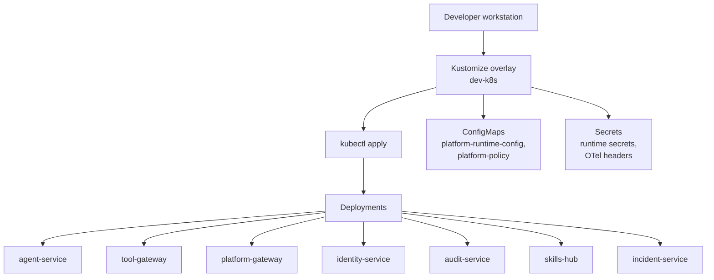
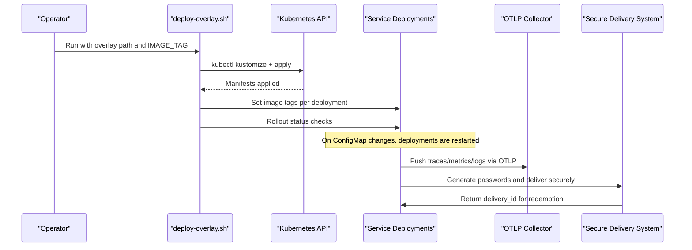
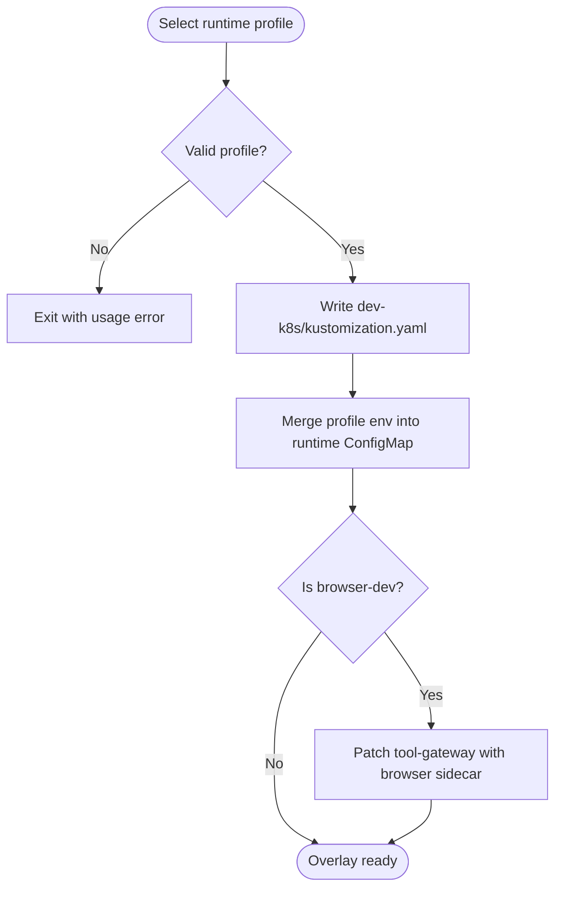
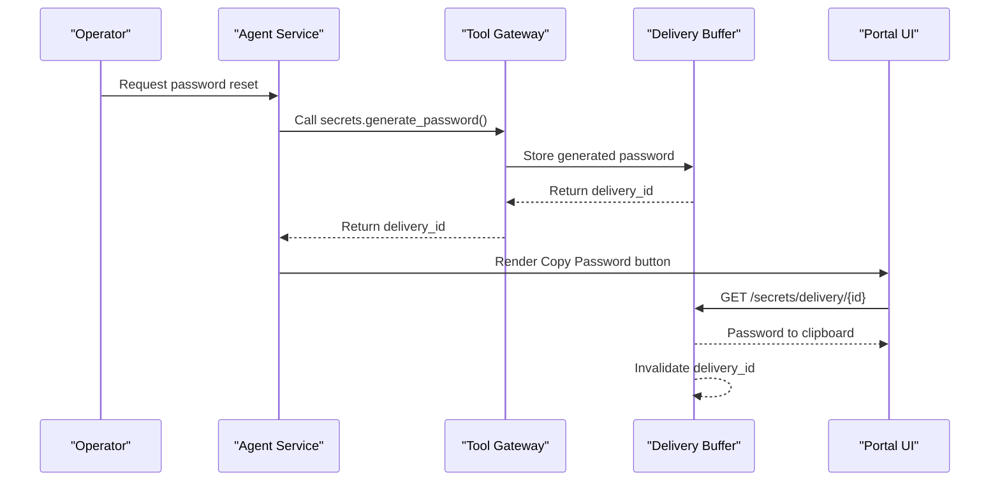
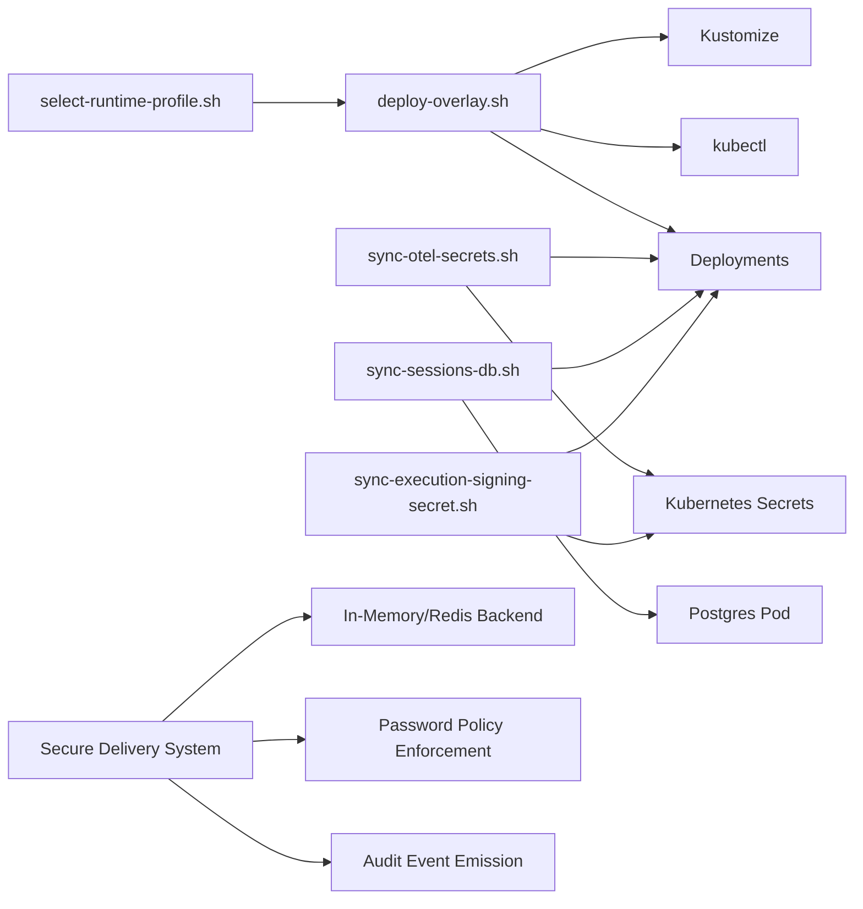

# Deployment and Operations

<cite>
**Referenced Files in This Document**
- [deploy-overlay.sh](file://shared/platform-ops/gitops/deploy-overlay.sh)
- [select-runtime-profile.sh](file://shared/platform-ops/gitops/select-runtime-profile.sh)
- [runtime-profiles README.md](file://shared/platform-ops/gitops/runtime-profiles/README.md)
- [default configmap.yaml](file://shared/platform-ops/gitops/runtime-profiles/default/configmap.yaml)
- [browser.env](file://shared/platform-ops/gitops/runtime-profiles/browser-dev/browser.env)
- [mutating.env](file://shared/platform-ops/gitops/runtime-profiles/mutating-dev/mutating.env)
- [sync-otel-secrets.sh](file://shared/platform-ops/gitops/sync-otel-secrets.sh)
- [sync-sessions-db.sh](file://shared/platform-ops/gitops/sync-sessions-db.sh)
- [sync-execution-signing-secret.sh](file://shared/platform-ops/gitops/sync-execution-signing-secret.sh)
- [agent-platform Dockerfile](file://products/agent-platform/Dockerfile)
- [tool-gateway Dockerfile](file://products/tool-gateway/Dockerfile)
- [base-uv Dockerfile](file://shared/base-images/base-uv/Dockerfile)
- [agent-service observability.py](file://products/agent-platform/src/agent_service/core/observability.py)
- [agent-service metrics.py](file://products/agent-platform/src/agent_service/core/metrics.py)
- [tool-gateway observability.py](file://products/tool-gateway/src/tool_gateway/core/observability.py)
- [SPEC-062 secure password generation and delivery spec](file://docs/specs/SPEC-062-secure-password-generation-and-delivery/spec.md)
- [acme-admin password-reset walkthrough](file://samples/acme-admin/password-reset/WALKTHROUGH.md)
- [acme-admin adhoc-password-reset walkthrough](file://samples/acme-admin/adhoc-password-reset/WALKTHROUGH.md)
</cite>

## Update Summary
**Changes Made**
- Added new section on Secure Password Generation and Delivery operational procedures
- Updated operational procedures to include password reset workflows using the secure delivery system
- Enhanced troubleshooting guidance for password-related operations
- Added configuration requirements for the secure delivery system
- Updated capacity planning considerations for delivery buffer backends

## Table of Contents
1. Introduction
2. Project Structure
3. Core Components
4. Architecture Overview
5. Detailed Component Analysis
6. Dependency Analysis
7. Performance Considerations
8. Troubleshooting Guide
9. Conclusion
10. Appendices

## Introduction
This document provides production-grade deployment and operations guidance for the Luban AIOPS platform. It focuses on GitOps-based delivery using Kubernetes overlays, environment-specific runtime profiles, secret management, containerization with uv, and end-to-end monitoring and observability via OpenTelemetry and Prometheus. It also covers operational procedures such as scaling services, managing database dependencies, backup and recovery, disaster recovery planning, performance tuning, resource allocation, capacity planning, and enhanced password reset workflows using the secure delivery system.

## Project Structure
The platform is delivered as a set of microservices packaged into containers and deployed to Kubernetes through Kustomize overlays. A central GitOps workflow applies overlay configurations, injects images by tag, and restarts workloads when configuration changes occur. Runtime profiles customize behavior per environment or feature posture (for example, enabling browser tools or mutating tools). Secrets are provisioned and merged into cluster Secrets so that sensitive values remain out of version control while still being reproducible.

**Diagram sources**
- [deploy-overlay.sh:15-108](file://shared/platform-ops/gitops/deploy-overlay.sh#L15-L108)
- [select-runtime-profile.sh:27-52](file://shared/platform-ops/gitops/select-runtime-profile.sh#L27-L52)

**Section sources**
- [deploy-overlay.sh:1-108](file://shared/platform-ops/gitops/deploy-overlay.sh#L1-L108)
- [select-runtime-profile.sh:1-55](file://shared/platform-ops/gitops/select-runtime-profile.sh#L1-L55)

## Core Components
- GitOps overlay application: Applies Kustomize overlays, updates image tags, and conditionally restarts deployments when ConfigMaps change.
- Runtime profiles: Selectable overlays that configure agent LLM provider settings and enable optional features like browser automation or mutating tools.
- Secret provisioning: Scripts merge OTLP authentication headers and other runtime secrets into service-specific Secrets without overwriting unrelated keys.
- Container images: Lightweight Python images built with uv; product images depend on a shared base image that pins uv and Python versions.
- Observability: Structured logging, Prometheus metrics endpoints, and OpenTelemetry OTLP export configured via environment variables and Secrets.
- Secure password delivery: One-time secret handoff system with copy-password button functionality and optional email delivery channel.

**Section sources**
- [deploy-overlay.sh:25-108](file://shared/platform-ops/gitops/deploy-overlay.sh#L25-L108)
- [runtime-profiles README.md:1-57](file://shared/platform-ops/gitops/runtime-profiles/README.md#L1-L57)
- [sync-otel-secrets.sh:1-162](file://shared/platform-ops/gitops/sync-otel-secrets.sh#L1-L162)
- [agent-platform Dockerfile:1-13](file://products/agent-platform/Dockerfile#L1-L13)
- [tool-gateway Dockerfile:1-15](file://products/tool-gateway/Dockerfile#L1-L15)
- [base-uv Dockerfile:1-40](file://shared/base-images/base-uv/Dockerfile#L1-L40)
- [agent-service metrics.py:1-224](file://products/agent-platform/src/agent_service/core/metrics.py#L1-L224)
- [agent-service observability.py:1-25](file://products/agent-platform/src/agent_service/core/observability.py#L1-L25)
- [tool-gateway observability.py:1-25](file://products/tool-gateway/src/tool_gateway/core/observability.py#L1-L25)

## Architecture Overview
The deployment pipeline uses a single overlay entry point to render and apply Kubernetes manifests. Image tags are injected at deploy time, and environment-specific behavior is controlled by merging runtime profile ConfigMaps and Secrets. Services expose Prometheus metrics and push telemetry via OTLP to an external collector. The secure password delivery system integrates with this architecture through one-time redemption endpoints and ephemeral storage backends.

**Diagram sources**
- [deploy-overlay.sh:25-108](file://shared/platform-ops/gitops/deploy-overlay.sh#L25-L108)
- [sync-otel-secrets.sh:73-162](file://shared/platform-ops/gitops/sync-otel-secrets.sh#L73-L162)
- [SPEC-062 secure password generation and delivery spec:171-185](file://docs/specs/SPEC-062-secure-password-generation-and-delivery/spec.md#L171-L185)

## Detailed Component Analysis

### GitOps Overlay and Deployment Workflow
- The overlay script validates inputs, loads image state, resolves default image names with a common tag, renders the overlay with Kustomize, applies it, and then sets image tags for each deployment.
- When the authoritative runtime or policy ConfigMaps change, the script explicitly restarts all app deployments to ensure new configuration is picked up.
- Rollout status is checked for each deployment to confirm successful rollout.

Operational notes:
- Always set IMAGE_TAG before deploying.
- Use the overlay directory argument to target a specific Kustomize overlay.
- Namespace defaults to dev-luban-aiops unless overridden.

**Section sources**
- [deploy-overlay.sh:1-108](file://shared/platform-ops/gitops/deploy-overlay.sh#L1-L108)

### Runtime Profiles
Runtime profiles allow you to switch LLM provider settings and enable optional postures without changing core overlays.

- Default profile: Sets a generic profile label and selects a provider/model pair via ConfigMap.
- Mutating-dev posture: Enables mutating tools in the gateway and grants bounded RBAC for development use.
- Browser-dev posture: Enables browser web-check capabilities, adds a Chromium sidecar patch to tool-gateway, and configures allowed origins and credential sets.

Profile selection:
- The select script writes the active dev-k8s Kustomization to include one LLM profile plus both committed dev postures (mutating-dev and browser-dev).
- Environment variables from profile env files are merged into the platform runtime ConfigMap.

**Diagram sources**
- [select-runtime-profile.sh:1-55](file://shared/platform-ops/gitops/select-runtime-profile.sh#L1-L55)
- [runtime-profiles README.md:15-57](file://shared/platform-ops/gitops/runtime-profiles/README.md#L15-L57)

**Section sources**
- [select-runtime-profile.sh:1-55](file://shared/platform-ops/gitops/select-runtime-profile.sh#L1-L55)
- [runtime-profiles README.md:1-57](file://shared/platform-ops/gitops/runtime-profiles/README.md#L1-L57)
- [default configmap.yaml:1-11](file://shared/platform-ops/gitops/runtime-profiles/default/configmap.yaml#L1-L11)
- [browser.env:1-11](file://shared/platform-ops/gitops/runtime-profiles/browser-dev/browser.env#L1-L11)
- [mutating.env:1-4](file://shared/platform-ops/gitops/runtime-profiles/mutating-dev/mutating.env#L1-L4)

### Secret Management and OTLP Provisioning
- OTLP headers are computed from OpenObserve root credentials and merged into every service's runtime Secret without overwriting other keys.
- If a local profile secret file exists, the script syncs it wholesale with the header inserted, ensuring consistency between cluster and local state.
- After merging secrets, the script restarts relevant deployments and waits for rollouts to complete.

Operational notes:
- Export OpenObserve credentials only at provision time; they are never echoed or committed.
- Skip provisioning in CI by setting SKIP_OTEL_SECRETS=true.
- Missing headers degrade gracefully: exporters authenticate anonymously and fail open until headers are provisioned.

**Section sources**
- [sync-otel-secrets.sh:1-162](file://shared/platform-ops/gitops/sync-otel-secrets.sh#L1-L162)

### Sessions Database Provisioning
- Ensures the sessions Postgres database exists for the agent platform session store.
- Uses an idempotent check and create operation against the running Postgres pod.
- Restarts agent-service to connect to the newly available database.

Operational notes:
- Requires the overlay to be deployed first so the Postgres pod exists.
- Until agent-service restarts, it falls back to an in-memory store.

**Section sources**
- [sync-sessions-db.sh:1-46](file://shared/platform-ops/gitops/sync-sessions-db.sh#L1-L46)

### Execution Signing Secret
- Provides the signing key used by agent-service to sign approved mutating execution requests and verify invocation-boundary digests.
- Reuses an existing key if present; otherwise generates a new one.
- Applies the secret and restarts agent-service to activate signing.

Operational notes:
- A missing key fails closed on resume paths rather than degrading to unsigned execution.
- Override the key by exporting EXECUTION_SIGNING_KEY.
- Skip provisioning in CI by setting SKIP_EXECUTION_SIGNING_SECRET=true.

**Section sources**
- [sync-execution-signing-secret.sh:1-72](file://shared/platform-ops/gitops/sync-execution-signing-secret.sh#L1-L72)

### Secure Password Generation and Delivery System
**Updated** Added comprehensive support for secure password generation and delivery as part of the platform's operational procedures.

The secure password delivery system provides two primary capabilities:

#### Password Generation
- Cryptographically strong password generation using Python's `secrets` module (CSPRNG)
- Policy-enforced password strength validation with configurable minimum length and character class requirements
- Integration with the platform's secret masking system to prevent accidental exposure

#### Secure Delivery Mechanisms
- **Primary Channel (Copy Password)**: One-time redemption endpoint that returns passwords directly to clipboard without ever appearing in transcripts, logs, or UI projections
- **Secondary Channel (Email)**: Optional gated email delivery with recipient allowlisting and mandatory approval workflow
- **Buffer Backends**: Pluggable storage supporting both in-memory (single-replica) and Redis (multi-replica) backends

#### Operational Configuration
- Generation tool activation via environment variables
- Password policy enforcement through centralized configuration
- Email delivery requires SMTP configuration and recipient allowlist setup
- Buffer backend selection based on deployment replica count

**Diagram sources**
- [SPEC-062 secure password generation and delivery spec:171-185](file://docs/specs/SPEC-062-secure-password-generation-and-delivery/spec.md#L171-L185)
- [SPEC-062 secure password generation and delivery spec:187-204](file://docs/specs/SPEC-062-secure-password-generation-and-delivery/spec.md#L187-L204)

**Section sources**
- [SPEC-062 secure password generation and delivery spec:35-45](file://docs/specs/SPEC-062-secure-password-generation-and-delivery/spec.md#L35-L45)
- [SPEC-062 secure password generation and delivery spec:90-121](file://docs/specs/SPEC-062-secure-password-generation-and-delivery/spec.md#L90-L121)
- [SPEC-062 secure password generation and delivery spec:171-204](file://docs/specs/SPEC-062-secure-password-generation-and-delivery/spec.md#L171-L204)

### Containerization Strategy with uv
- All backend services use a shared base image based on Amazon Linux 2023 minimal with a pinned uv and no system Python.
- Product images copy source, lockfiles, and project metadata, then run uv sync with frozen mode and no dev dependencies.
- The base image defines deterministic environment variables for uv and runs as a non-root user.

Build characteristics:
- Deterministic dependency resolution via uv.lock.
- Non-root execution improves security posture.
- Minimal attack surface due to minimal base image and pinned toolchain.

**Section sources**
- [base-uv Dockerfile:1-40](file://shared/base-images/base-uv/Dockerfile#L1-L40)
- [agent-platform Dockerfile:1-13](file://products/agent-platform/Dockerfile#L1-L13)
- [tool-gateway Dockerfile:1-15](file://products/tool-gateway/Dockerfile#L1-L15)

### Monitoring and Observability
- Logging: Each service configures structured logging at INFO level by default and exposes a helper to emit JSON events. LOG_LEVEL can override the log level.
- Metrics: The agent platform exposes a Prometheus /metrics endpoint with RED metrics and domain-specific counters/gauges for sessions, chat, evidence, audit emission, and model discovery.
- Tracing and logs: Services push telemetry via OTLP HTTP to an endpoint defined in shared configuration; Basic auth headers are provisioned via Secrets.

Operational notes:
- Ensure OTLP endpoint and headers are configured before enabling telemetry.
- Scrape /metrics from each service for Prometheus integration.
- Collect structured logs for audit trails and troubleshooting.

**Section sources**
- [agent-service observability.py:1-25](file://products/agent-platform/src/agent_service/core/observability.py#L1-L25)
- [tool-gateway observability.py:1-25](file://products/tool-gateway/src/tool_gateway/core/observability.py#L1-L25)
- [agent-service metrics.py:1-224](file://products/agent-platform/src/agent_service/core/metrics.py#L1-L224)
- [sync-otel-secrets.sh:1-162](file://shared/platform-ops/gitops/sync-otel-secrets.sh#L1-L162)

## Dependency Analysis
The overlay script depends on Kustomize and kubectl to render and apply manifests. It orchestrates image updates and rollout status checks across multiple deployments. Runtime profiles modify the overlay composition and environment variables. Secret provisioning scripts interact with Kubernetes Secrets and trigger workload restarts. The secure password delivery system integrates with existing infrastructure through pluggable buffer backends and policy enforcement.

**Diagram sources**
- [deploy-overlay.sh:25-108](file://shared/platform-ops/gitops/deploy-overlay.sh#L25-L108)
- [select-runtime-profile.sh:27-52](file://shared/platform-ops/gitops/select-runtime-profile.sh#L27-L52)
- [sync-otel-secrets.sh:73-162](file://shared/platform-ops/gitops/sync-otel-secrets.sh#L73-L162)
- [sync-sessions-db.sh:23-46](file://shared/platform-ops/gitops/sync-sessions-db.sh#L23-L46)
- [sync-execution-signing-secret.sh:37-72](file://shared/platform-ops/gitops/sync-execution-signing-secret.sh#L37-L72)
- [SPEC-062 secure password generation and delivery spec:187-204](file://docs/specs/SPEC-062-secure-password-generation-and-delivery/spec.md#L187-L204)

**Section sources**
- [deploy-overlay.sh:1-108](file://shared/platform-ops/gitops/deploy-overlay.sh#L1-L108)
- [select-runtime-profile.sh:1-55](file://shared/platform-ops/gitops/select-runtime-profile.sh#L1-L55)
- [sync-otel-secrets.sh:1-162](file://shared/platform-ops/gitops/sync-otel-secrets.sh#L1-L162)
- [sync-sessions-db.sh:1-46](file://shared/platform-ops/gitops/sync-sessions-db.sh#L1-L46)
- [sync-execution-signing-secret.sh:1-72](file://shared/platform-ops/gitops/sync-execution-signing-secret.sh#L1-L72)

## Performance Considerations
- Resource requests and limits: Size CPU and memory requests according to expected concurrency per service. Increase replicas horizontally under load spikes.
- Metrics scraping: Ensure Prometheus scrape intervals align with metric cardinality and retention policies.
- OTLP export: Configure appropriate batch sizes and timeouts in your OTLP exporter to avoid backpressure during high telemetry volume.
- Browser sidecar: When enabling browser-dev, allocate sufficient CPU/memory for the Chromium sidecar and limit concurrent browser sessions.
- Database connections: Tune connection pools for Postgres-backed stores to match replica counts and query patterns.
- **Delivery buffer performance**: For multi-replica deployments using Redis backend, monitor Redis latency and connection pool sizing. In-memory backends are suitable for single-replica development environments but require careful capacity planning.
- **Password generation throughput**: CSPRNG operations are lightweight but should be monitored under high-volume password generation scenarios.

[No sources needed since this section provides general guidance]

## Troubleshooting Guide
Common issues and resolutions:
- Missing IMAGE_TAG: The overlay requires IMAGE_TAG to be set before applying. Build images first or export the tag.
- ConfigMap changes not taking effect: The overlay restarts deployments when runtime or policy ConfigMaps change; if you edited env files directly, restart affected deployments.
- OTLP authentication failures: Provision OTLP headers using the secret provisioning script. Without headers, exporters authenticate anonymously and may receive 401 responses.
- Sessions store unavailable: Ensure the sessions database exists and agent-service has been restarted after provisioning.
- Execution signing unavailable: Provision the execution signing secret; without it, resume paths fail closed.
- **Password delivery failures**: Check buffer backend connectivity (Redis for multi-replica), verify delivery_id validity and TTL expiration, ensure proper owner-scoping for redemption attempts.
- **Email delivery issues**: Verify SMTP configuration, recipient allowlist settings, and approval workflow completion.

Operational checks:
- Verify rollout status for all deployments after applying overlays or syncing secrets.
- Confirm /metrics is reachable and returns Prometheus-formatted output.
- Validate that OTLP endpoint and headers are set in the runtime Secrets.
- Monitor delivery buffer health and Redis connectivity for multi-replica deployments.

**Section sources**
- [deploy-overlay.sh:41-76](file://shared/platform-ops/gitops/deploy-overlay.sh#L41-L76)
- [sync-otel-secrets.sh:30-52](file://shared/platform-ops/gitops/sync-otel-secrets.sh#L30-L52)
- [sync-sessions-db.sh:23-46](file://shared/platform-ops/gitops/sync-sessions-db.sh#L23-L46)
- [sync-execution-signing-secret.sh:37-72](file://shared/platform-ops/gitops/sync-execution-signing-secret.sh#L37-L72)
- [SPEC-062 secure password generation and delivery spec:187-204](file://docs/specs/SPEC-062-secure-password-generation-and-delivery/spec.md#L187-L204)

## Conclusion
The Luban AIOPS platform uses a robust GitOps workflow centered on Kustomize overlays, runtime profiles, and secret provisioning to deliver consistent, secure, and observable deployments. Containers are built deterministically with uv, and observability is enabled via structured logging, Prometheus metrics, and OTLP telemetry. The enhanced secure password generation and delivery system provides operators with cryptographically strong password creation and secure handoff mechanisms that maintain the platform's strict no-plaintext-projection posture. Operators can confidently manage environments by selecting runtime profiles, provisioning secrets, following documented operational procedures for scaling, database readiness, recovery, and password reset workflows.

[No sources needed since this section summarizes without analyzing specific files]

## Appendices

### Operational Procedures

- Scaling services:
  - Adjust replica counts via your Git repository overlays or kubectl scale commands.
  - Monitor metrics and logs to validate scaling effectiveness.
  - For multi-replica deployments, ensure delivery buffer backend switches to Redis for password delivery functionality.

- Managing database migrations:
  - Ensure the sessions database exists before starting agent-service.
  - Apply schema changes in a controlled manner and verify connectivity post-restart.

- Backup and recovery:
  - Back up Postgres data regularly for session persistence and any persistent storage used by services.
  - Test restore procedures periodically to validate recovery time objectives.
  - For Redis-backed delivery buffers, consider TTL implications during backup/restore operations.

- Disaster recovery planning:
  - Maintain off-cluster backups of databases and secrets.
  - Document runbooks for re-provisioning secrets and restoring services in a new cluster.
  - Include password delivery buffer recovery procedures for multi-replica deployments.

- Capacity planning:
  - Use Prometheus metrics to establish baselines for request rates, latencies, and resource utilization.
  - Plan horizontal scaling thresholds and right-size resources based on observed peaks and growth trends.
  - Account for delivery buffer memory usage in single-replica deployments and Redis connection pooling in multi-replica setups.

- **Password reset workflows using secure delivery**:
  - Configure password policy enforcement through centralized configuration
  - Set up delivery buffer backend based on deployment replica count
  - Enable email delivery channel only when SMTP configuration and recipient allowlists are properly configured
  - Monitor delivery event audit logs for compliance and troubleshooting
  - Implement proper approval workflows for email delivery of sensitive passwords

**Section sources**
- [SPEC-062 secure password generation and delivery spec:298-320](file://docs/specs/SPEC-062-secure-password-generation-and-delivery/spec.md#L298-L320)
- [SPEC-062 secure password generation and delivery spec:359-391](file://docs/specs/SPEC-062-secure-password-generation-and-delivery/spec.md#L359-L391)