# Deployment and Operations

<cite>
**Referenced Files in This Document**
- [Makefile](file://Makefile)
- [README.md](file://README.md)
- [VERSION](file://VERSION)
- [products/agent-platform/Dockerfile](file://products/agent-platform/Dockerfile)
- [products/agent-platform/Makefile](file://products/agent-platform/Makefile)
- [products/identity-broker/Dockerfile](file://products/identity-broker/Dockerfile)
- [products/identity-broker/Makefile](file://products/identity-broker/Makefile)
- [products/tool-gateway/Dockerfile](file://products/tool-gateway/Dockerfile)
- [products/tool-gateway/Makefile](file://products/tool-gateway/Makefile)
- [products/audit-service/Dockerfile](file://products/audit-service/Dockerfile)
- [products/audit-service/src/audit_service/core/config.py](file://products/audit-service/src/audit_service/core/config.py)
- [products/audit-service/src/audit_service/metadata.py](file://products/audit-service/src/audit_service/metadata.py)
- [products/audit-service/src/audit_service/__init__.py](file://products/audit-service/src/audit_service/__init__.py)
- [products/incident-service/src/incident_service/metadata.py](file://products/incident-service/src/incident_service/metadata.py)
- [products/incident-service/src/incident_service/__init__.py](file://products/incident-service/src/incident_service/__init__.py)
- [products/skills-hub/src/skills_hub/services/audit_emitter.py](file://products/skills-hub/src/skills_hub/services/audit_emitter.py)
- [products/skills-hub/src/skills_hub/core/config.py](file://products/skills-hub/src/skills_hub/core/config.py)
- [mk/image.mk](file://mk/image.mk)
- [mk/python.mk](file://mk/python.mk)
- [shared/platform-ops/gitops/dev-k8s/kustomization.yaml](file://shared/platform-ops/gitops/dev-k8s/kustomization.yaml)
- [shared/platform-ops/gitops/dev-k8s/base/kustomization.yaml](file://shared/platform-ops/gitops/dev-k8s/base/kustomization.yaml)
- [shared/platform-ops/gitops/dev-k8s/deploy.sh](file://shared/platform-ops/gitops/dev-k8s/deploy.sh)
- [shared/platform-ops/gitops/deploy-overlay.sh](file://shared/platform-ops/gitops/deploy-overlay.sh)
- [shared/platform-ops/gitops/select-runtime-profile.sh](file://shared/platform-ops/gitops/select-runtime-profile.sh)
- [shared/platform-ops/gitops/sync-runtime-secret.sh](file://shared/platform-ops/gitops/sync-runtime-secret.sh)
- [shared/platform-ops/gitops/sync-delegation-secrets.sh](file://shared/platform-ops/gitops/sync-delegation-secrets.sh)
- [shared/platform-ops/gitops/sync-audit-secrets.sh](file://shared/platform-ops/gitops/sync-audit-secrets.sh)
- [shared/platform-ops/gitops/sync-otel-secrets.sh](file://shared/platform-ops/gitops/sync-otel-secrets.sh)
- [shared/platform-ops/gitops/verify-runtime-profile.sh](file://shared/platform-ops/gitops/verify-runtime-profile.sh)
- [shared/platform-ops/gitops/runtime-profiles/default/configmap.yaml](file://shared/platform-ops/gitops/runtime-profiles/default/configmap.yaml)
- [shared/platform-ops/gitops/runtime-profiles/default/runtime-secrets.example.env](file://shared/platform-ops/gitops/runtime-profiles/default/runtime-secrets.example.env)
- [shared/platform-ops/gitops/runtime-profiles/README.md](file://shared/platform-ops/gitops/runtime-profiles/README.md)
- [shared/platform-ops/gitops/dev-k8s/base/shared/runtime.env](file://shared/platform-ops/gitops/dev-k8s/base/shared/runtime.env)
- [shared/platform-ops/gitops/dev-k8s/base/agent-platform/runtime-config.env](file://shared/platform-ops/gitops/dev-k8s/base/agent-platform/runtime-config.env)
- [shared/platform-ops/gitops/dev-k8s/base/identity-broker/runtime-config.env](file://shared/platform-ops/gitops/dev-k8s/base/identity-broker/runtime-config.env)
- [shared/platform-ops/gitops/dev-k8s/base/tool-gateway/runtime-config.env](file://shared/platform-ops/gitops/dev-k8s/base/tool-gateway/runtime-config.env)
- [shared/platform-ops/gitops/dev-k8s/base/audit-service/runtime-config.env](file://shared/platform-ops/gitops/dev-k8s/base/audit-service/runtime-config.env)
- [shared/platform-ops/gitops/dev-k8s/base/audit-service/runtime-secrets.example.env](file://shared/platform-ops/gitops/dev-k8s/base/audit-service/runtime-secrets.example.env)
- [shared/platform-ops/gitops/dev-k8s/base/skills-hub/runtime-config.env](file://shared/platform-ops/gitops/dev-k8s/base/skills-hub/runtime-config.env)
- [shared/platform-ops/gitops/dev-k8s/base/skills-hub/runtime-secrets.env](file://shared/platform-ops/gitops/dev-k8s/base/skills-hub/runtime-secrets.env)
- [shared/platform-ops/gitops/dev-k8s/base/infra/redis-deployment.yaml](file://shared/platform-ops/gitops/dev-k8s/base/infra/redis-deployment.yaml)
- [shared/platform-ops/gitops/dev-k8s/base/infra/redis-service.yaml](file://shared/platform-ops/gitops/dev-k8s/base/infra/redis-service.yaml)
- [shared/platform-ops/gitops/dev-k8s/base/infra/postgres-statefulset.yaml](file://shared/platform-ops/gitops/dev-k8s/base/infra/postgres-statefulset.yaml)
- [shared/platform-ops/gitops/dev-k8s/base/infra/postgres-service.yaml](file://shared/platform-ops/gitops/dev-k8s/base/infra/postgres-service.yaml)
- [shared/platform-ops/gitops/dev-k8s/base/agent-platform/agent-service-deployment.yaml](file://shared/platform-ops/gitops/dev-k8s/base/agent-platform/agent-service-deployment.yaml)
- [shared/platform-ops/gitops/dev-k8s/base/agent-platform/agent-service-service.yaml](file://shared/platform-ops/gitops/dev-k8s/base/agent-platform/agent-service-service.yaml)
- [shared/platform-ops/gitops/dev-k8s/base/identity-broker/identity-service-deployment.yaml](file://shared/platform-ops/gitops/dev-k8s/base/identity-broker/identity-service-deployment.yaml)
- [shared/platform-ops/gitops/dev-k8s/base/identity-broker/identity-service-service.yaml](file://shared/platform-ops/gitops/dev-k8s/base/identity-broker/identity-service-service.yaml)
- [shared/platform-ops/gitops/dev-k8s/base/operator-portal/web-ui-deployment.yaml](file://shared/platform-ops/gitops/dev-k8s/base/operator-portal/web-ui-deployment.yaml)
- [shared/platform-ops/gitops/dev-k8s/base/operator-portal/web-ui-service.yaml](file://shared/platform-ops/gitops/dev-k8s/base/operator-portal/web-ui-service.yaml)
- [shared/platform-ops/gitops/dev-k8s/base/tool-gateway/api-gateway-deployment.yaml](file://shared/platform-ops/gitops/dev-k8s/base/tool-gateway/api-gateway-deployment.yaml)
- [shared/platform-ops/gitops/dev-k8s/base/tool-gateway/api-gateway-service.yaml](file://shared/platform-ops/gitops/dev-k8s/base/tool-gateway/api-gateway-service.yaml)
- [shared/platform-ops/gitops/dev-k8s/base/tool-gateway/policy.yaml](file://shared/platform-ops/gitops/dev-k8s/base/tool-gateway/policy.yaml)
- [shared/platform-ops/gitops/dev-k8s/base/tool-gateway/rbac.yaml](file://shared/platform-ops/gitops/dev-k8s/base/tool-gateway/rbac.yaml)
- [shared/platform-ops/gitops/dev-k8s/base/audit-service/audit-service-deployment.yaml](file://shared/platform-ops/gitops/dev-k8s/base/audit-service/audit-service-deployment.yaml)
- [shared/platform-ops/gitops/dev-k8s/base/audit-service/audit-service-service.yaml](file://shared/platform-ops/gitops/dev-k8s/base/audit-service/audit-service-service.yaml)
- [shared/platform-ops/gitops/dev-k8s/reconcile-portal-oidc-client.sh](file://shared/platform-ops/gitops/dev-k8s/reconcile-portal-oidc-client.sh)
- [shared/platform-ops/gitops/llm-hosting/README.md](file://shared/platform-ops/gitops/llm-hosting/README.md)
- [shared/platform-ops/gitops/llm-hosting/ollama/deployment.yaml](file://shared/platform-ops/gitops/llm-hosting/ollama/deployment.yaml)
- [shared/platform-ops/gitops/llm-hosting/ollama/service.yaml](file://shared/platform-ops/gitops/llm-hosting/ollama/service.yaml)
- [shared/platform-ops/gitops/llm-hosting/ollama/pvc.yaml](file://shared/platform-ops/gitops/llm-hosting/ollama/pvc.yaml)
- [shared/platform-ops/gitops/llm-hosting/ollama/secret.yaml](file://shared/platform-ops/gitops/llm-hosting/ollama/secret.yaml)
- [docs/guides/luban-llm-guide.md](file://docs/guides/luban-llm-guide.md)
- [products/agent-platform/src/agent_service/core/metrics.py](file://products/agent-platform/src/agent_service/core/metrics.py)
- [products/agent-platform/src/agent_service/core/observability.py](file://products/agent-platform/src/agent_service/core/observability.py)
- [products/agent-platform/src/agent_service/core/telemetry.py](file://products/agent-platform/src/agent_service/core/telemetry.py)
- [products/agent-platform/src/agent_service/services/model_catalog.py](file://products/agent-platform/src/agent_service/services/model_catalog.py)
- [products/agent-platform/src/agent_service/providers/deepseek.py](file://products/agent-platform/src/agent_service/providers/deepseek.py)
- [products/agent-platform/src/agent_service/providers/dashscope.py](file://products/agent-platform/src/agent_service/providers/dashscope.py)
- [products/agent-platform/src/agent_service/providers/luban.py](file://products/agent-platform/src/agent_service/providers/luban.py)
- [products/agent-platform/src/agent_service/runtime_settings.py](file://products/agent-platform/src/agent_service/runtime_settings.py)
- [products/agent-platform/tests/test_model_catalog.py](file://products/agent-platform/tests/test_model_catalog.py)
- [products/agent-platform/tests/test_model_discovery.py](file://products/agent-platform/tests/test_model_discovery.py)
- [products/agent-platform/tests/test_runtime_providers.py](file://products/agent-platform/tests/test_runtime_providers.py)
- [products/identity-broker/src/identity_service/core/metrics.py](file://products/identity-broker/src/identity_service/core/metrics.py)
- [products/identity-broker/src/identity_service/core/observability.py](file://products/identity-broker/src/identity_service/core/observability.py)
- [products/identity-broker/src/identity_service/core/telemetry.py](file://products/identity-broker/src/identity_service/core/telemetry.py)
- [products/tool-gateway/src/api_gateway/core/metrics.py](file://products/tool-gateway/src/api_gateway/core/metrics.py)
- [products/tool-gateway/src/api_gateway/core/observability.py](file://products/tool-gateway/src/api_gateway/core/observability.py)
- [products/tool-gateway/src/tool_gateway/core/telemetry.py](file://products/tool-gateway/src/tool_gateway/core/telemetry.py)
- [products/platform-gateway/src/platform_gateway/services/delegation_client.py](file://products/platform-gateway/src/platform_gateway/services/delegation_client.py)
- [products/identity-broker/src/identity_service/services/exchange_service.py](file://products/identity-broker/src/identity_service/services/exchange_service.py)
- [products/platform-gateway/src/platform_gateway/core/config.py](file://products/platform-gateway/src/platform_gateway/core/config.py)
- [shared/platform-ops/gitops/dev-k8s/base/platform-gateway/runtime-secrets.example.env](file://shared/platform-ops/gitops/dev-k8s/base/platform-gateway/runtime-secrets.example.env)
- [shared/platform-ops/gitops/dev-k8s/base/identity-broker/runtime-secrets.example.env](file://shared/platform-ops/gitops/dev-k8s/base/identity-broker/runtime-secrets.example.env)
- [shared/shared-contracts/observability-conventions.md](file://shared/shared-contracts/observability-conventions.md)
- [shared/shared-contracts/scripts/validate_version.py](file://shared/shared-contracts/scripts/validate_version.py)
- [products/operator-portal/Dockerfile](file://products/operator-portal/Dockerfile)
- [products/operator-portal/Makefile](file://products/operator-portal/Makefile)
- [products/operator-portal/web-ui/app/vite.config.ts](file://products/operator-portal/web-ui/app/vite.config.ts)
- [products/operator-portal/web-ui/app/package.json](file://products/operator-portal/web-ui/app/package.json)
- [products/operator-portal/web-ui/app/package-lock.json](file://products/operator-portal/web-ui/app/package-lock.json)
- [products/operator-portal/web-ui/app/src/version.ts](file://products/operator-portal/web-ui/app/src/version.ts)
- [products/operator-portal/web-ui/app/src/views/control/SettingsView.tsx](file://products/operator-portal/web-ui/app/src/views/control/SettingsView.tsx)
</cite>

## Update Summary
**Changes Made**
- Enhanced build-time version injection in operator portal Vite configuration to capture locked dependency versions from package-lock.json
- Added __REACT_VERSION__ and __ANTD_VERSION__ constants alongside existing __PLATFORM_VERSION__ for accurate version display matching actual shipped bundles
- Updated operator portal Settings view to display precise React and Ant Design versions used in the built bundle
- Improved version accuracy for platform component inventory in the operator portal

## Table of Contents
1. Introduction
2. Project Structure
3. Core Components
4. Architecture Overview
5. Detailed Component Analysis
6. Dependency Analysis
7. Performance Considerations
8. Troubleshooting Guide
9. Conclusion
10. Appendices

## Introduction
This document provides comprehensive deployment and operations guidance for the Luban AIOps Platform. It focuses on Kubernetes deployment using GitOps with Kustomize overlays, container build processes, image management, automation scripts, environment configuration, secrets management (including enhanced delegation secret auto-provisioning, comprehensive audit secrets synchronization with skills-hub support, OpenTelemetry credential provisioning, and team-hosted LLM model server management), scaling strategies, monitoring setup (Prometheus metrics, structured logging, health checks, and OpenTelemetry push pipeline), operational procedures (updates, rollbacks, disaster recovery, capacity planning), performance tuning, resource optimization, and troubleshooting common issues. The platform now operates at version 0.23.4 with synchronized service versions across all components. Enhanced model pinning best practices ensure better audit attribution and traceability through fixed-point model IDs rather than rolling tier aliases. **New**: Team-hosted LLM model hosting capabilities enable running small models locally or on-premises with full platform integration. **Enhanced**: Build-time version injection now captures locked dependency versions for accurate version display in the operator portal.

## Project Structure
The platform is organized into multiple products and shared operational assets:
- Products: agent-platform, identity-broker, tool-gateway, operator-portal, platform-gateway, audit-service, incident-service, skills-hub
- Shared ops: GitOps manifests under shared/platform-ops/gitops with base and runtime profiles
- Build system: Makefiles per product and shared mk rules for images and Python packaging
- Version management: Centralized version control with validation across all services
- Model catalog: Multi-provider model management with live discovery, curated series, and team-hosted model support
- **Team-hosted LLM hosting**: Reference manifests for self-hosted model servers (Ollama, vLLM, llama.cpp) with bearer-token authentication
- **Enhanced Operator Portal**: Build-time version injection capturing locked dependency versions for accurate platform component inventory

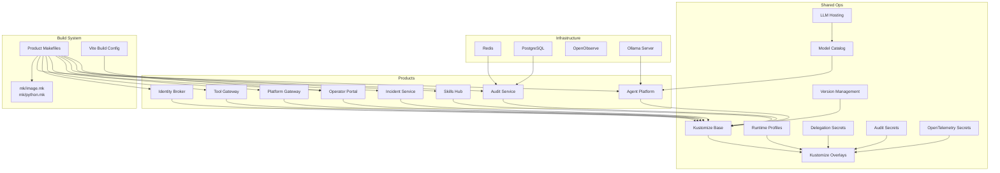

**Diagram sources**
- [shared/platform-ops/gitops/dev-k8s/base/kustomization.yaml](file://shared/platform-ops/gitops/dev-k8s/base/kustomization.yaml)
- [shared/platform-ops/gitops/dev-k8s/kustomization.yaml](file://shared/platform-ops/gitops/dev-k8s/kustomization.yaml)
- [shared/platform-ops/gitops/runtime-profiles/default/configmap.yaml](file://shared/platform-ops/gitops/runtime-profiles/default/configmap.yaml)
- [shared/platform-ops/gitops/llm-hosting/README.md](file://shared/platform-ops/gitops/llm-hosting/README.md)
- [mk/image.mk](file://mk/image.mk)
- [mk/python.mk](file://mk/python.mk)
- [products/agent-platform/Makefile](file://products/agent-platform/Makefile)
- [products/identity-broker/Makefile](file://products/identity-broker/Makefile)
- [products/tool-gateway/Makefile](file://products/tool-gateway/Makefile)
- [products/audit-service/Dockerfile](file://products/audit-service/Dockerfile)
- [products/operator-portal/web-ui/app/vite.config.ts](file://products/operator-portal/web-ui/app/vite.config.ts)
- [shared/shared-contracts/scripts/validate_version.py](file://shared/shared-contracts/scripts/validate_version.py)

**Section sources**
- [README.md](file://README.md)
- [VERSION](file://VERSION)
- [shared/platform-ops/gitops/dev-k8s/base/kustomization.yaml](file://shared/platform-ops/gitops/dev-k8s/base/kustomization.yaml)
- [shared/platform-ops/gitops/dev-k8s/kustomization.yaml](file://shared/platform-ops/gitops/dev-k8s/kustomization.yaml)
- [mk/image.mk](file://mk/image.mk)
- [mk/python.mk](file://mk/python.mk)
- [shared/shared-contracts/scripts/validate_version.py](file://shared/shared-contracts/scripts/validate_version.py)

## Core Components
- Agent Platform: Provides agent runtime services, session management, and provider integrations. Exposes metrics and observability hooks with enhanced model catalog support including team-hosted model providers.
- Identity Broker: Handles authentication, token issuance, and identity context propagation. Supports token delegation and exchange operations.
- Tool Gateway: API gateway enforcing policies, routing to agents/tools, and exposing metrics and observability hooks.
- Operator Portal: Web UI for operators to manage platform resources and configurations with OIDC authentication. **Enhanced**: Now displays accurate React and Ant Design versions captured from package-lock.json during build time.
- Platform Gateway: Central gateway that handles user authentication and delegates tokens to downstream services through the identity broker.
- **Audit Service**: Durable audit trail service that ingests, stores, and queries audit events from all platform components with PostgreSQL persistence.
- **Incident Service**: Incident management service providing intake, triage, and collaboration capabilities with version 0.23.4 synchronization.
- **Skills Hub**: Skills management service providing reusable capabilities across the platform with integrated audit event emission for usage tracking.
- **Team-Hosted LLM Provider**: Self-hosted model server support via the `luban` provider, enabling local/on-premises model execution with bearer-token authentication.

Key operational artifacts:
- Dockerfiles per product define container images.
- Product Makefiles orchestrate builds and pushes.
- mk/image.mk and mk/python.mk provide reusable build targets.
- Kustomize base defines Kubernetes resources; overlays select runtime profiles and apply environment-specific patches.
- Shell scripts automate deployment, secret synchronization, profile selection, verification, delegation secret provisioning, comprehensive audit secret management (including skills-hub), OpenTelemetry credential provisioning, and team-hosted model server management.
- **Version Management**: Centralized version validation ensuring all services maintain consistent version 0.23.4.
- **Model Catalog**: Multi-provider model management with live discovery, curated series, credential gating, and team-hosted model support.
- **Enhanced Build Process**: Vite configuration captures locked dependency versions for accurate version display.

**Section sources**
- [products/agent-platform/Dockerfile](file://products/agent-platform/Dockerfile)
- [products/identity-broker/Dockerfile](file://products/identity-broker/Dockerfile)
- [products/tool-gateway/Dockerfile](file://products/tool-gateway/Dockerfile)
- [products/audit-service/Dockerfile](file://products/audit-service/Dockerfile)
- [products/agent-platform/Makefile](file://products/agent-platform/Makefile)
- [products/identity-broker/Makefile](file://products/identity-broker/Makefile)
- [products/tool-gateway/Makefile](file://products/tool-gateway/Makefile)
- [mk/image.mk](file://mk/image.mk)
- [mk/python.mk](file://mk/python.mk)
- [products/audit-service/src/audit_service/metadata.py](file://products/audit-service/src/audit_service/metadata.py)
- [products/incident-service/src/incident_service/metadata.py](file://products/incident-service/src/incident_service/metadata.py)
- [products/agent-platform/src/agent_service/providers/luban.py](file://products/agent-platform/src/agent_service/providers/luban.py)
- [products/operator-portal/web-ui/app/vite.config.ts](file://products/operator-portal/web-ui/app/vite.config.ts)

## Architecture Overview
The platform deploys as a set of Kubernetes workloads orchestrated via Kustomize. The GitOps workflow uses overlays to compose base manifests with environment-specific settings and runtime profiles. Enhanced with automated delegation secret provisioning for secure cross-service communication, comprehensive audit trail storage with skills-hub integration, OpenTelemetry credential provisioning for centralized observability, centralized version management ensuring all services operate at version 0.23.4, advanced model catalog management with live discovery capabilities, and team-hosted model server support for local/on-premises model execution. **Enhanced**: Build-time version injection ensures accurate dependency version display in the operator portal.

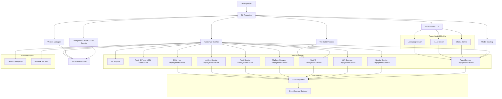

**Diagram sources**
- [shared/platform-ops/gitops/dev-k8s/base/kustomization.yaml](file://shared/platform-ops/gitops/dev-k8s/base/kustomization.yaml)
- [shared/platform-ops/gitops/dev-k8s/base/infra/redis-deployment.yaml](file://shared/platform-ops/gitops/dev-k8s/base/infra/redis-deployment.yaml)
- [shared/platform-ops/gitops/dev-k8s/base/infra/postgres-statefulset.yaml](file://shared/platform-ops/gitops/dev-k8s/base/infra/postgres-statefulset.yaml)
- [shared/platform-ops/gitops/dev-k8s/base/agent-platform/agent-service-deployment.yaml](file://shared/platform-ops/gitops/dev-k8s/base/agent-platform/agent-service-deployment.yaml)
- [shared/platform-ops/gitops/dev-k8s/base/identity-broker/identity-service-deployment.yaml](file://shared/platform-ops/gitops/dev-k8s/base/identity-broker/identity-service-deployment.yaml)
- [shared/platform-ops/gitops/dev-k8s/base/tool-gateway/api-gateway-deployment.yaml](file://shared/platform-ops/gitops/dev-k8s/base/tool-gateway/api-gateway-deployment.yaml)
- [shared/platform-ops/gitops/dev-k8s/base/operator-portal/web-ui-deployment.yaml](file://shared/platform-ops/gitops/dev-k8s/base/operator-portal/web-ui-deployment.yaml)
- [shared/platform-ops/gitops/dev-k8s/base/audit-service/audit-service-deployment.yaml](file://shared/platform-ops/gitops/dev-k8s/base/audit-service/audit-service-deployment.yaml)
- [shared/platform-ops/gitops/runtime-profiles/default/configmap.yaml](file://shared/platform-ops/gitops/runtime-profiles/default/configmap.yaml)
- [shared/platform-ops/gitops/llm-hosting/README.md](file://shared/platform-ops/gitops/llm-hosting/README.md)
- [shared/shared-contracts/scripts/validate_version.py](file://shared/shared-contracts/scripts/validate_version.py)
- [products/operator-portal/web-ui/app/vite.config.ts](file://products/operator-portal/web-ui/app/vite.config.ts)

## Detailed Component Analysis

### Container Build Process and Image Management
- Each product has a Dockerfile defining its runtime image.
- Product Makefiles encapsulate build, test, and push steps.
- Shared mk rules standardize image tagging, multi-arch builds, and Python packaging.
- **Version Synchronization**: All services are built and tagged with version 0.23.4, ensuring consistent deployments across the platform.
- **Enhanced Operator Portal Build**: Vite configuration captures locked dependency versions from package-lock.json during build time, injecting __REACT_VERSION__ and __ANTD_VERSION__ constants alongside __PLATFORM_VERSION__ for accurate version display.

Recommended flow:
- Use product Makefiles to build images locally or in CI.
- Tag images consistently (semantic versioning or commit SHA).
- Push images to a registry accessible by the target cluster.
- Reference exact image tags in Kustomize overlays to ensure deterministic deployments.
- Validate version consistency using the shared version validation script.

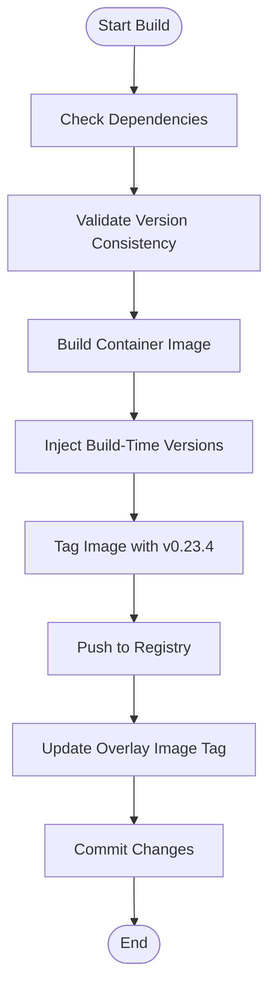

**Section sources**
- [products/agent-platform/Dockerfile](file://products/agent-platform/Dockerfile)
- [products/identity-broker/Dockerfile](file://products/identity-broker/Dockerfile)
- [products/tool-gateway/Dockerfile](file://products/tool-gateway/Dockerfile)
- [products/audit-service/Dockerfile](file://products/audit-service/Dockerfile)
- [products/operator-portal/Dockerfile](file://products/operator-portal/Dockerfile)
- [products/agent-platform/Makefile](file://products/agent-platform/Makefile)
- [products/identity-broker/Makefile](file://products/identity-broker/Makefile)
- [products/tool-gateway/Makefile](file://products/tool-gateway/Makefile)
- [mk/image.mk](file://mk/image.mk)
- [mk/python.mk](file://mk/python.mk)
- [shared/shared-contracts/scripts/validate_version.py](file://shared/shared-contracts/scripts/validate_version.py)
- [products/operator-portal/web-ui/app/vite.config.ts](file://products/operator-portal/web-ui/app/vite.config.ts)

### GitOps Deployment with Kustomize Overlays
- Base manifests define core resources (namespaces, services, deployments, RBAC, policies).
- Runtime profiles inject model provider configurations via ConfigMaps and secrets.
- Overlays select profiles and apply environment-specific patches.
- Scripts automate deploy, profile selection, secret sync, verification, delegation secret provisioning, comprehensive audit secret management (including skills-hub), OpenTelemetry credential provisioning, and team-hosted model server management.
- **Version Validation**: Pre-deployment validation ensures all services maintain version 0.23.4 consistency.

Operational steps:
- Select runtime profile using the provided script.
- Sync runtime secrets to the cluster.
- Provision delegation secrets for cross-service authentication.
- Provision comprehensive audit secrets for audit event ingestion from all platform components including skills-hub.
- Provision OpenTelemetry credentials for centralized observability.
- Deploy overlay to the target cluster.
- Verify runtime profile and health endpoints.
- Validate version consistency across all deployed services.

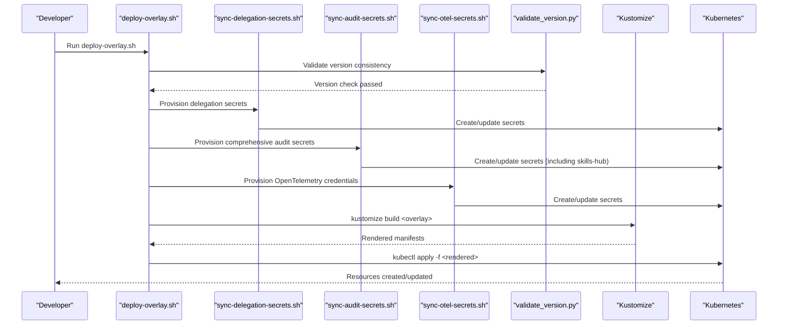

**Diagram sources**
- [shared/platform-ops/gitops/deploy-overlay.sh](file://shared/platform-ops/gitops/deploy-overlay.sh)
- [shared/platform-ops/gitops/sync-delegation-secrets.sh](file://shared/platform-ops/gitops/sync-delegation-secrets.sh)
- [shared/platform-ops/gitops/sync-audit-secrets.sh](file://shared/platform-ops/gitops/sync-audit-secrets.sh)
- [shared/platform-ops/gitops/sync-otel-secrets.sh](file://shared/platform-ops/gitops/sync-otel-secrets.sh)
- [shared/shared-contracts/scripts/validate_version.py](file://shared/shared-contracts/scripts/validate_version.py)
- [shared/platform-ops/gitops/dev-k8s/kustomization.yaml](file://shared/platform-ops/gitops/dev-k8s/kustomization.yaml)
- [shared/platform-ops/gitops/dev-k8s/base/kustomization.yaml](file://shared/platform-ops/gitops/dev-k8s/base/kustomization.yaml)

**Section sources**
- [shared/platform-ops/gitops/dev-k8s/kustomization.yaml](file://shared/platform-ops/gitops/dev-k8s/kustomization.yaml)
- [shared/platform-ops/gitops/dev-k8s/base/kustomization.yaml](file://shared/platform-ops/gitops/dev-k8s/base/kustomization.yaml)
- [shared/platform-ops/gitops/deploy-overlay.sh](file://shared/platform-ops/gitops/deploy-overlay.sh)
- [shared/platform-ops/gitops/select-runtime-profile.sh](file://shared/platform-ops/gitops/select-runtime-profile.sh)
- [shared/platform-ops/gitops/sync-runtime-secret.sh](file://shared/platform-ops/gitops/sync-runtime-secret.sh)
- [shared/platform-ops/gitops/sync-delegation-secrets.sh](file://shared/platform-ops/gitops/sync-delegation-secrets.sh)
- [shared/platform-ops/gitops/sync-audit-secrets.sh](file://shared/platform-ops/gitops/sync-audit-secrets.sh)
- [shared/platform-ops/gitops/sync-otel-secrets.sh](file://shared/platform-ops/gitops/sync-otel-secrets.sh)
- [shared/platform-ops/gitops/verify-runtime-profile.sh](file://shared/platform-ops/gitops/verify-runtime-profile.sh)
- [shared/shared-contracts/scripts/validate_version.py](file://shared/shared-contracts/scripts/validate_version.py)

### Environment Configuration and Secrets Management
- Environment variables are supplied via env files mounted into pods.
- Observability settings are centralized in a shared env file.
- Runtime secrets are synchronized via dedicated scripts.
- OIDC client reconciliation is supported by a helper script.
- **Enhanced**: Delegation secrets are automatically provisioned for secure cross-service authentication.
- **Updated**: Comprehensive audit secrets are automatically provisioned for audit event ingestion from all platform components including skills-hub, with improved secret upsert procedures and race condition handling.
- **Updated**: OpenTelemetry credentials are automatically provisioned for centralized observability via OpenObserve with enhanced CI/CD support and durable cluster-side merging.
- **New**: Team-hosted LLM model server secrets are managed through dedicated configuration for bearer-token authentication.
- **Version Management**: All services configured with version 0.23.4 metadata and consistent versioning.
- **Model Pinning Best Practices**: Enhanced runtime secrets configuration recommends fixed-point model IDs over rolling tier aliases for better audit attribution and traceability.

Best practices:
- Keep sensitive values out of version control; use secret sync scripts to populate secure stores.
- Separate non-sensitive config from secrets.
- Validate overlays before applying to prevent misconfiguration.
- Use delegation secret provisioning to ensure consistent service-to-service authentication.
- Use comprehensive audit secret provisioning to ensure consistent audit event ingestion credentials from all components including skills-hub.
- Use OpenTelemetry secret provisioning to ensure consistent telemetry authentication headers with durable cluster-side merging.
- Configure team-hosted model server secrets with proper bearer-token authentication.
- **CI/CD Integration**: Set `SKIP_OTEL_SECRETS=true` in CI environments where secrets are injected externally.
- **Version Validation**: Ensure all services maintain version 0.23.4 consistency during deployment.
- **Model Pinning**: Prefer fixed-point generation IDs (e.g., `qwen3.8-max`) over rolling tier aliases (e.g., `qwen-plus`) for precise audit attribution and traceability.

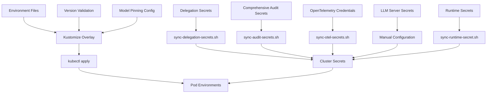

**Diagram sources**
- [shared/platform-ops/gitops/dev-k8s/base/shared/runtime.env](file://shared/platform-ops/gitops/dev-k8s/base/shared/runtime.env)
- [shared/platform-ops/gitops/dev-k8s/base/agent-platform/runtime-config.env](file://shared/platform-ops/gitops/dev-k8s/base/agent-platform/runtime-config.env)
- [shared/platform-ops/gitops/dev-k8s/base/identity-broker/runtime-config.env](file://shared/platform-ops/gitops/dev-k8s/base/identity-broker/runtime-config.env)
- [shared/platform-ops/gitops/dev-k8s/base/tool-gateway/runtime-config.env](file://shared/platform-ops/gitops/dev-k8s/base/tool-gateway/runtime-config.env)
- [shared/platform-ops/gitops/dev-k8s/base/audit-service/runtime-config.env](file://shared/platform-ops/gitops/dev-k8s/base/audit-service/runtime-config.env)
- [shared/platform-ops/gitops/dev-k8s/base/skills-hub/runtime-config.env](file://shared/platform-ops/gitops/dev-k8s/base/skills-hub/runtime-config.env)
- [shared/platform-ops/gitops/sync-runtime-secret.sh](file://shared/platform-ops/gitops/sync-runtime-secret.sh)
- [shared/platform-ops/gitops/sync-delegation-secrets.sh](file://shared/platform-ops/gitops/sync-delegation-secrets.sh)
- [shared/platform-ops/gitops/sync-audit-secrets.sh](file://shared/platform-ops/gitops/sync-audit-secrets.sh)
- [shared/platform-ops/gitops/sync-otel-secrets.sh](file://shared/platform-ops/gitops/sync-otel-secrets.sh)
- [shared/platform-ops/gitops/dev-k8s/reconcile-portal-oidc-client.sh](file://shared/platform-ops/gitops/dev-k8s/reconcile-portal-oidc-client.sh)
- [shared/shared-contracts/scripts/validate_version.py](file://shared/shared-contracts/scripts/validate_version.py)

**Section sources**
- [shared/platform-ops/gitops/dev-k8s/base/shared/runtime.env](file://shared/platform-ops/gitops/dev-k8s/base/shared/runtime.env)
- [shared/platform-ops/gitops/dev-k8s/base/agent-platform/runtime-config.env](file://shared/platform-ops/gitops/dev-k8s/base/agent-platform/runtime-config.env)
- [shared/platform-ops/gitops/dev-k8s/base/identity-broker/runtime-config.env](file://shared/platform-ops/gitops/dev-k8s/base/identity-broker/runtime-config.env)
- [shared/platform-ops/gitops/dev-k8s/base/tool-gateway/runtime-config.env](file://shared/platform-ops/gitops/dev-k8s/base/tool-gateway/runtime-config.env)
- [shared/platform-ops/gitops/dev-k8s/base/audit-service/runtime-config.env](file://shared/platform-ops/gitops/dev-k8s/base/audit-service/runtime-config.env)
- [shared/platform-ops/gitops/dev-k8s/base/skills-hub/runtime-config.env](file://shared/platform-ops/gitops/dev-k8s/base/skills-hub/runtime-config.env)
- [shared/platform-ops/gitops/sync-runtime-secret.sh](file://shared/platform-ops/gitops/sync-runtime-secret.sh)
- [shared/platform-ops/gitops/sync-delegation-secrets.sh](file://shared/platform-ops/gitops/sync-delegation-secrets.sh)
- [shared/platform-ops/gitops/sync-audit-secrets.sh](file://shared/platform-ops/gitops/sync-audit-secrets.sh)
- [shared/platform-ops/gitops/sync-otel-secrets.sh](file://shared/platform-ops/gitops/sync-otel-secrets.sh)
- [shared/platform-ops/gitops/dev-k8s/reconcile-portal-oidc-client.sh](file://shared/platform-ops/gitops/dev-k8s/reconcile-portal-oidc-client.sh)
- [shared/shared-contracts/scripts/validate_version.py](file://shared/shared-contracts/scripts/validate_version.py)

### Token Delegation and Cross-Service Authentication
**Updated** Enhanced with automated delegation secret provisioning and improved GitOps workflow for secure cross-service authentication.

The platform implements a sophisticated token delegation system that enables secure service-to-service communication:

- **Delegation Client**: The platform-gateway exchanges user JWTs for short-lived, audience-bound delegated tokens at the identity-broker
- **Token Exchange**: The identity-broker validates subject tokens and mints delegated tokens with restricted audiences
- **Secret Management**: Automated provisioning ensures consistent service credentials across platform-gateway and identity-broker
- **Workload Identity Support**: Optional projected workload tokens for enhanced security in production environments
- **Version Consistency**: All services operating at version 0.23.4 ensure compatible token handling

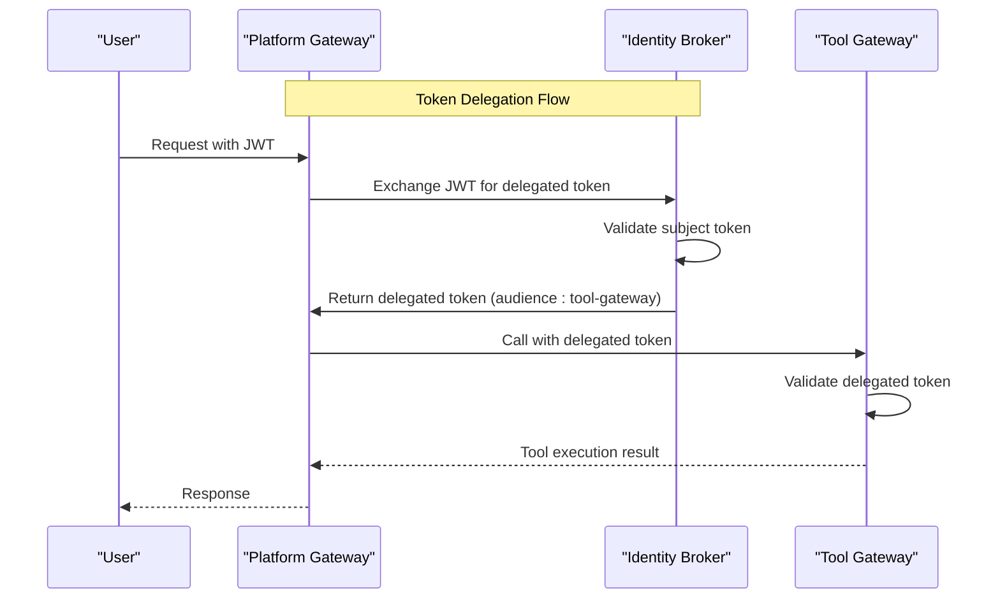

**Diagram sources**
- [products/platform-gateway/src/platform_gateway/services/delegation_client.py](file://products/platform-gateway/src/platform_gateway/services/delegation_client.py)
- [products/identity-broker/src/identity_service/services/exchange_service.py](file://products/identity-broker/src/identity_service/services/exchange_service.py)

**Section sources**
- [products/platform-gateway/src/platform_gateway/services/delegation_client.py](file://products/platform-gateway/src/platform_gateway/services/delegation_client.py)
- [products/identity-broker/src/identity_service/services/exchange_service.py](file://products/identity-broker/src/identity_service/services/exchange_service.py)
- [shared/platform-ops/gitops/sync-delegation-secrets.sh](file://shared/platform-ops/gitops/sync-delegation-secrets.sh)
- [shared/platform-ops/gitops/dev-k8s/base/platform-gateway/runtime-secrets.example.env](file://shared/platform-ops/gitops/dev-k8s/base/platform-gateway/runtime-secrets.example.env)
- [shared/platform-ops/gitops/dev-k8s/base/identity-broker/runtime-secrets.example.env](file://shared/platform-ops/gitops/dev-k8s/base/identity-broker/runtime-secrets.example.env)

### Audit Event Ingestion and Storage
**Updated Section** The audit service provides durable audit trail storage with PostgreSQL backend and supports ingestion from all platform components including skills-hub with enhanced secret management.

The audit service implements a comprehensive audit trail system with enhanced deployment process:

- **Event Ingestion**: All platform components emit audit events to the audit-service via authenticated HTTP endpoints, including skills-hub for usage tracking (SPEC-029)
- **Client Authentication**: Static client registry validates ingest requests using shared secrets, now including skills-hub in the AUDIT_INGEST_CLIENTS registry
- **Enhanced Secret Management**: Improved secret upsert procedures preserve existing environment files while updating audit credentials
- **Race Condition Handling**: Enhanced restart procedures ensure audit-service is fully rolled out before restarting emitters to prevent authentication failures
- **PostgreSQL Persistence**: Durable storage with configurable retention policies and automatic eviction
- **Query Interface**: REST API for querying audit events with filtering capabilities
- **Health Monitoring**: Readiness and liveness probes for reliable operation
- **Version 0.23.4**: Fully integrated with platform version synchronization

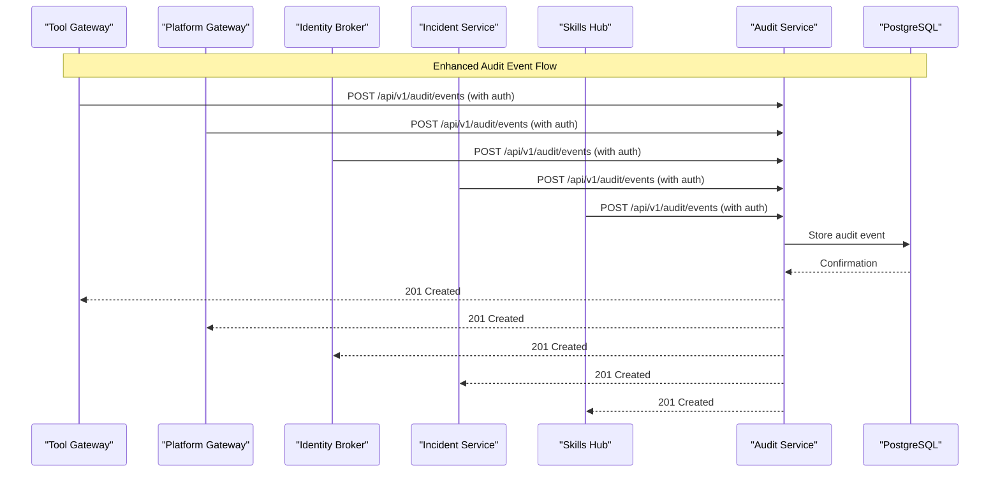

**Diagram sources**
- [shared/platform-ops/gitops/dev-k8s/base/audit-service/audit-service-deployment.yaml](file://shared/platform-ops/gitops/dev-k8s/base/audit-service/audit-service-deployment.yaml)
- [shared/platform-ops/gitops/dev-k8s/base/infra/postgres-statefulset.yaml](file://shared/platform-ops/gitops/dev-k8s/base/infra/postgres-statefulset.yaml)
- [products/audit-service/src/audit_service/core/config.py](file://products/audit-service/src/audit_service/core/config.py)
- [products/skills-hub/src/skills_hub/services/audit_emitter.py](file://products/skills-hub/src/skills_hub/services/audit_emitter.py)

**Section sources**
- [shared/platform-ops/gitops/dev-k8s/base/audit-service/audit-service-deployment.yaml](file://shared/platform-ops/gitops/dev-k8s/base/audit-service/audit-service-deployment.yaml)
- [shared/platform-ops/gitops/dev-k8s/base/audit-service/runtime-config.env](file://shared/platform-ops/gitops/dev-k8s/base/audit-service/runtime-config.env)
- [shared/platform-ops/gitops/dev-k8s/base/audit-service/runtime-secrets.example.env](file://shared/platform-ops/gitops/dev-k8s/base/audit-service/runtime-secrets.example.env)
- [shared/platform-ops/gitops/dev-k8s/base/skills-hub/runtime-config.env](file://shared/platform-ops/gitops/dev-k8s/base/skills-hub/runtime-config.env)
- [shared/platform-ops/gitops/dev-k8s/base/skills-hub/runtime-secrets.env](file://shared/platform-ops/gitops/dev-k8s/base/skills-hub/runtime-secrets.env)
- [shared/platform-ops/gitops/sync-audit-secrets.sh](file://shared/platform-ops/gitops/sync-audit-secrets.sh)
- [products/audit-service/src/audit_service/core/config.py](file://products/audit-service/src/audit_service/core/config.py)
- [products/audit-service/src/audit_service/metadata.py](file://products/audit-service/src/audit_service/metadata.py)
- [products/skills-hub/src/skills_hub/services/audit_emitter.py](file://products/skills-hub/src/skills_hub/services/audit_emitter.py)

### OpenTelemetry Push Pipeline and OpenObserve Integration
**Updated Section** Comprehensive OpenTelemetry support with enhanced automated credential provisioning for centralized observability and improved CI/CD integration.

The platform implements a unified observability pipeline using OpenTelemetry with OpenObserve as the backend:

- **Opt-in Pipeline**: Controlled by `OTEL_ENABLED` environment variable (default false) with zero overhead when disabled
- **Unified Signals**: Traces, metrics, and logs exported via OTLP HTTP/protobuf to OpenObserve
- **Enhanced Authentication**: `sync-otel-secrets.sh` provisions Basic auth headers for OpenObserve ingestion with intelligent fallback handling and durable cluster-side merging
- **Fail-open Design**: Telemetry failures don't impact application functionality
- **Centralized Configuration**: Shared endpoint configuration via ConfigMap with per-service secret headers
- **CI/CD Integration**: Skip mechanism (`SKIP_OTEL_SECRETS=true`) for environments where secrets are injected externally
- **Intelligent Secret Handling**: Uses `kubectl patch --type merge` for atomic header updates instead of wholesale file rewrites, preserving other secret keys
- **Robust Synchronization**: Sibling scripts (delegation, audit, skills) preserve existing OTLP headers during their env-file rewrites
- **Version 0.23.4**: All services emit telemetry with consistent version metadata

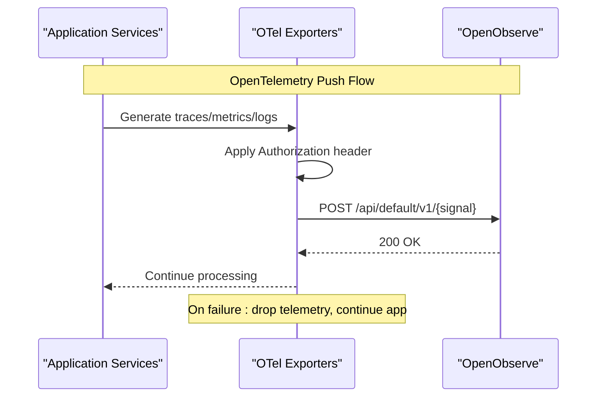

**Diagram sources**
- [shared/platform-ops/gitops/sync-otel-secrets.sh](file://shared/platform-ops/gitops/sync-otel-secrets.sh)
- [shared/platform-ops/gitops/dev-k8s/base/shared/runtime.env](file://shared/platform-ops/gitops/dev-k8s/base/shared/runtime.env)
- [shared/shared-contracts/observability-conventions.md](file://shared/shared-contracts/observability-conventions.md)

**Section sources**
- [shared/platform-ops/gitops/sync-otel-secrets.sh](file://shared/platform-ops/gitops/sync-otel-secrets.sh)
- [shared/platform-ops/gitops/dev-k8s/base/shared/runtime.env](file://shared/platform-ops/gitops/dev-k8s/base/shared/runtime.env)
- [shared/shared-contracts/observability-conventions.md](file://shared/shared-contracts/observability-conventions.md)
- [products/agent-platform/src/agent_service/core/telemetry.py](file://products/agent-platform/src/agent_service/core/telemetry.py)
- [products/identity-broker/src/identity_service/core/telemetry.py](file://products/identity-broker/src/identity_service/core/telemetry.py)
- [products/tool-gateway/src/tool_gateway/core/telemetry.py](file://products/tool-gateway/src/tool_gateway/core/telemetry.py)

### Multi-Model Catalog and Live Discovery
**Updated Section** Advanced model catalog management with live discovery capabilities, enhanced model pinning best practices, and team-hosted model server support.

The platform implements a sophisticated model catalog system that manages LLM models across multiple providers with live discovery, credential gating, and team-hosted model support:

- **Credential-Gated Access**: Only providers with resolvable API keys contribute to the catalog, including team-hosted model servers
- **Live Model Discovery**: Periodic queries to provider `/models` endpoints with fail-soft fallback ladder
- **Curated Series**: Provider-specific curated model lists with override capabilities
- **Model Resolution**: Request > pinned > default precedence with strict validation
- **Fixed-Point Model IDs**: Recommendation to use specific model IDs (e.g., `qwen3.8-max`) over rolling tier aliases (e.g., `qwen-plus`) for better audit attribution
- **Provider-Specific Filtering**: Intelligent filtering of non-chat modalities and dated snapshots
- **Atomic Catalog Swaps**: Thread-safe catalog updates without disrupting active sessions
- **Team-Hosted Support**: Full integration of self-hosted model servers via the `luban` provider with bearer-token authentication

Key features:
- **SPEC-026 Compliance**: Multi-model runtime catalog with credential gating and curated series
- **SPEC-027 Implementation**: Live model discovery with cached fallback mechanisms
- **SPEC-028 Integration**: Team-hosted model server support with Ollama, vLLM, and llama.cpp compatibility
- **Enhanced Model Pinning**: Fixed-point model IDs recommended for precise audit attribution and traceability
- **Provider Integration**: DeepSeek, DashScope, OpenAI, and team-hosted model server support with tailored model series

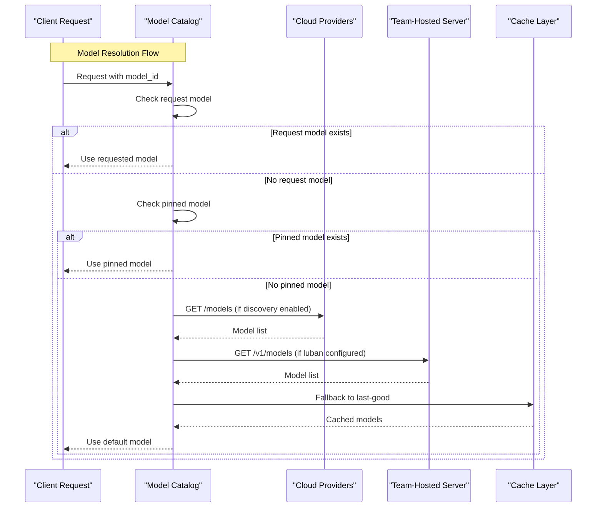

**Diagram sources**
- [products/agent-platform/src/agent_service/services/model_catalog.py](file://products/agent-platform/src/agent_service/services/model_catalog.py)
- [products/agent-platform/src/agent_service/providers/deepseek.py](file://products/agent-platform/src/agent_service/providers/deepseek.py)
- [products/agent-platform/src/agent_service/providers/dashscope.py](file://products/agent-platform/src/agent_service/providers/dashscope.py)
- [products/agent-platform/src/agent_service/providers/luban.py](file://products/agent-platform/src/agent_service/providers/luban.py)

**Section sources**
- [products/agent-platform/src/agent_service/services/model_catalog.py](file://products/agent-platform/src/agent_service/services/model_catalog.py)
- [products/agent-platform/src/agent_service/providers/deepseek.py](file://products/agent-platform/src/agent_service/providers/deepseek.py)
- [products/agent-platform/src/agent_service/providers/dashscope.py](file://products/agent-platform/src/agent_service/providers/dashscope.py)
- [products/agent-platform/src/agent_service/providers/luban.py](file://products/agent-platform/src/agent_service/providers/luban.py)
- [shared/platform-ops/gitops/runtime-profiles/default/runtime-secrets.example.env](file://shared/platform-ops/gitops/runtime-profiles/default/runtime-secrets.example.env)
- [shared/platform-ops/gitops/runtime-profiles/default/configmap.yaml](file://shared/platform-ops/gitops/runtime-profiles/default/configmap.yaml)
- [shared/platform-ops/gitops/runtime-profiles/README.md](file://shared/platform-ops/gitops/runtime-profiles/README.md)

### Team-Hosted LLM Model Hosting
**New Section** Comprehensive support for team-hosted small language models with reference Kubernetes manifests and operational guidance.

The platform now supports team-hosted model servers through the `luban` provider, enabling local/on-premises model execution with full platform integration:

- **Multi-Stack Support**: Compatible with Ollama, vLLM, and llama.cpp serving backends
- **Bearer-Token Authentication**: Secure authentication via `OLLAMA_API_KEY`, `--api-key`, or equivalent server-side token configuration
- **Reference Manifests**: Complete Kubernetes Deployment, Service, PVC, and Secret templates for Ollama deployment
- **Model Weight Management**: Persistent volume-backed model inventory with configurable storage sizing
- **GPU Node Support**: Optimized configurations for GPU-enabled nodes with NVIDIA device plugin integration
- **Security Posture**: ClusterIP-only service exposure with mandatory bearer-token authentication
- **Integration**: Seamless integration with the multi-model catalog, live discovery, and model pinning systems

Key capabilities:
- **Free-Standing Deployment**: Reference manifests are not part of the main overlay — explicit operator choice required
- **Single Replica Design**: Model weights are per-pod; scale by replicating the stack rather than increasing replicas
- **Resource Optimization**: CPU-only quantizations (qwen3-8b-class) with appropriate memory requests and limits
- **Network Security**: Internal cluster networking only; no external exposure
- **Verification Tools**: Built-in health checks and endpoint probing capabilities

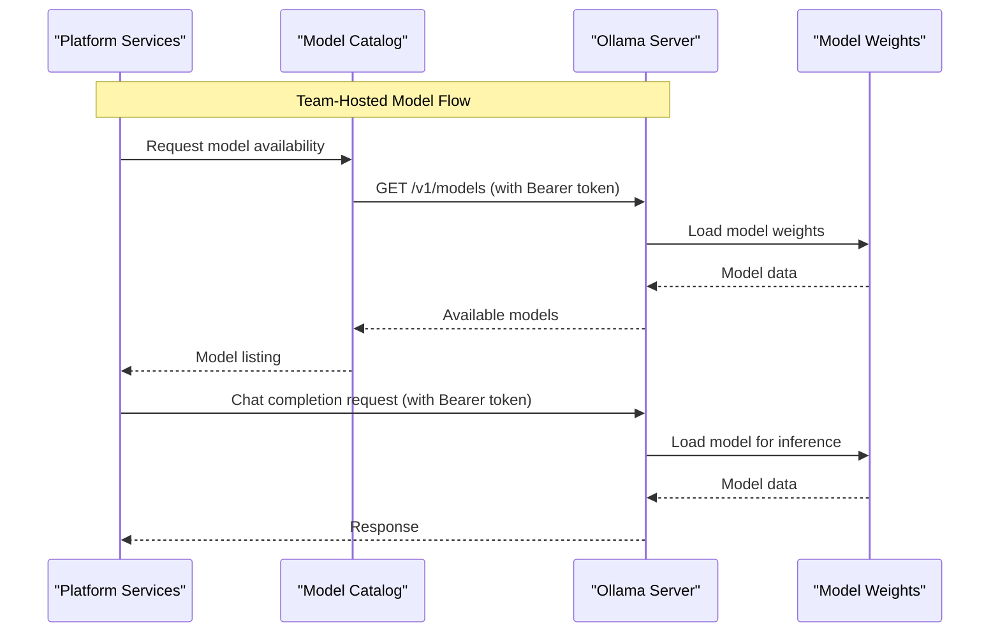

**Diagram sources**
- [shared/platform-ops/gitops/llm-hosting/ollama/deployment.yaml](file://shared/platform-ops/gitops/llm-hosting/ollama/deployment.yaml)
- [shared/platform-ops/gitops/llm-hosting/ollama/service.yaml](file://shared/platform-ops/gitops/llm-hosting/ollama/service.yaml)
- [shared/platform-ops/gitops/llm-hosting/ollama/pvc.yaml](file://shared/platform-ops/gitops/llm-hosting/ollama/pvc.yaml)
- [shared/platform-ops/gitops/llm-hosting/ollama/secret.yaml](file://shared/platform-ops/gitops/llm-hosting/ollama/secret.yaml)
- [products/agent-platform/src/agent_service/providers/luban.py](file://products/agent-platform/src/agent_service/providers/luban.py)

**Section sources**
- [shared/platform-ops/gitops/llm-hosting/README.md](file://shared/platform-ops/gitops/llm-hosting/README.md)
- [shared/platform-ops/gitops/llm-hosting/ollama/deployment.yaml](file://shared/platform-ops/gitops/llm-hosting/ollama/deployment.yaml)
- [shared/platform-ops/gitops/llm-hosting/ollama/service.yaml](file://shared/platform-ops/gitops/llm-hosting/ollama/service.yaml)
- [shared/platform-ops/gitops/llm-hosting/ollama/pvc.yaml](file://shared/platform-ops/gitops/llm-hosting/ollama/pvc.yaml)
- [shared/platform-ops/gitops/llm-hosting/ollama/secret.yaml](file://shared/platform-ops/gitops/llm-hosting/ollama/secret.yaml)
- [docs/guides/luban-llm-guide.md](file://docs/guides/luban-llm-guide.md)
- [products/agent-platform/src/agent_service/providers/luban.py](file://products/agent-platform/src/agent_service/providers/luban.py)

### Scaling Strategies
- Horizontal Pod Autoscaler (HPA): Configure based on CPU/memory utilization or custom metrics exposed by services.
- Vertical Pod Autoscaler (VPA): Review recommended resource requests/limits periodically.
- Replicas: Adjust deployment replicas per service workload characteristics.
- Stateful components: Ensure Redis sizing and persistence align with expected load.
- **Database Scaling**: Monitor PostgreSQL StatefulSet performance and consider read replicas for high-volume audit scenarios.
- **Observability Scaling**: Scale OpenObserve instances based on telemetry volume and query patterns.
- **Model Catalog Scaling**: Monitor model discovery refresh rates and cache hit ratios for optimal performance.
- **Team-Hosted Model Scaling**: Scale model servers by replicating stacks rather than increasing replicas; consider GPU node pools for high-throughput scenarios.
- **Version 0.23.4 Considerations**: All services optimized for consistent scaling behavior across the platform.

Guidelines:
- Set resource requests and limits conservatively; monitor actual usage.
- Use separate HPA targets for stateless services (agent-platform, identity-broker, tool-gateway, platform-gateway, audit-service, skills-hub, incident-service).
- Monitor autoscaling events and adjust thresholds to avoid flapping.
- Size PostgreSQL volumes appropriately for audit data retention requirements.
- Plan OpenObserve capacity based on telemetry ingestion rates and retention policies.
- Configure model discovery refresh intervals based on provider API rate limits and change frequency.
- For team-hosted models, plan GPU node capacity and model weight storage sizing based on model sizes and concurrent usage patterns.
- Ensure consistent scaling across all version 0.23.4 services for optimal performance.

**Section sources**
- [shared/platform-ops/gitops/dev-k8s/base/agent-platform/agent-service-deployment.yaml](file://shared/platform-ops/gitops/dev-k8s/base/agent-platform/agent-service-deployment.yaml)
- [shared/platform-ops/gitops/dev-k8s/base/identity-broker/identity-service-deployment.yaml](file://shared/platform-ops/gitops/dev-k8s/base/identity-broker/identity-service-deployment.yaml)
- [shared/platform-ops/gitops/dev-k8s/base/tool-gateway/api-gateway-deployment.yaml](file://shared/platform-ops/gitops/dev-k8s/base/tool-gateway/api-gateway-deployment.yaml)
- [shared/platform-ops/gitops/dev-k8s/base/audit-service/audit-service-deployment.yaml](file://shared/platform-ops/gitops/dev-k8s/base/audit-service/audit-service-deployment.yaml)
- [shared/platform-ops/gitops/dev-k8s/base/infra/redis-deployment.yaml](file://shared/platform-ops/gitops/dev-k8s/base/infra/redis-deployment.yaml)
- [shared/platform-ops/gitops/dev-k8s/base/infra/postgres-statefulset.yaml](file://shared/platform-ops/gitops/dev-k8s/base/infra/postgres-statefulset.yaml)
- [shared/platform-ops/gitops/llm-hosting/ollama/deployment.yaml](file://shared/platform-ops/gitops/llm-hosting/ollama/deployment.yaml)

### Monitoring Setup: Prometheus Metrics, Structured Logging, Health Checks, OpenTelemetry
- Each service exposes metrics and observability hooks through dedicated modules.
- Structured logging should be enabled via environment configuration.
- Health check endpoints are defined for readiness/liveness probes.
- **Audit Service Monitoring**: Prometheus scraping configured with specific metrics endpoint and port configuration.
- **OpenTelemetry Integration**: Unified telemetry pipeline with automated credential provisioning and centralized collection.
- **Model Catalog Monitoring**: Metrics for model discovery refresh rates, cache hit ratios, and model counts per provider.
- **Team-Hosted Model Monitoring**: Health checks for Ollama endpoints, model loading status, and inference performance metrics.
- **Skills Hub Monitoring**: Audit emission metrics for skill usage tracking (SPEC-029).
- **Version 0.23.4 Monitoring**: All services emit consistent version metadata for accurate monitoring and alerting.
- **Enhanced Operator Portal Monitoring**: Accurate version display showing locked dependency versions for React and Ant Design components.

Implementation notes:
- Integrate Prometheus scraping via ServiceMonitors or scrape configs targeting service ports.
- Ensure metrics endpoints are reachable and not blocked by network policies.
- Configure log levels and output formats consistently across services.
- Monitor audit event ingestion rates and database performance metrics.
- Configure OpenTelemetry exporters with proper authentication and endpoint configuration.
- Monitor telemetry export success rates and error patterns.
- Track version consistency across all monitored services.
- Monitor model discovery performance and provider API response times.
- Track model selection patterns and pinning effectiveness.
- Monitor team-hosted model server health, model loading times, and inference latency.
- Track GPU utilization and memory usage for GPU-enabled model servers.
- Monitor skills-hub audit emission metrics for usage tracking.
- Verify operator portal displays accurate dependency versions in Settings view.

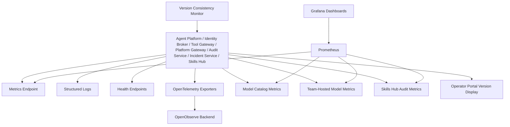

**Section sources**
- [products/agent-platform/src/agent_service/core/metrics.py](file://products/agent-platform/src/agent_service/core/metrics.py)
- [products/agent-platform/src/agent_service/core/observability.py](file://products/agent-platform/src/agent_service/core/observability.py)
- [products/agent-platform/src/agent_service/core/telemetry.py](file://products/agent-platform/src/agent_service/core/telemetry.py)
- [products/identity-broker/src/identity_service/core/metrics.py](file://products/identity-broker/src/identity_service/core/metrics.py)
- [products/identity-broker/src/identity_service/core/observability.py](file://products/identity-broker/src/identity_service/core/observability.py)
- [products/identity-broker/src/identity_service/core/telemetry.py](file://products/identity-broker/src/identity_service/core/telemetry.py)
- [products/tool-gateway/src/api_gateway/core/metrics.py](file://products/tool-gateway/src/api_gateway/core/metrics.py)
- [products/tool-gateway/src/api_gateway/core/observability.py](file://products/tool-gateway/src/api_gateway/core/observability.py)
- [products/tool-gateway/src/tool_gateway/core/telemetry.py](file://products/tool-gateway/src/tool_gateway/core/telemetry.py)
- [shared/platform-ops/gitops/dev-k8s/base/audit-service/audit-service-deployment.yaml](file://shared/platform-ops/gitops/dev-k8s/base/audit-service/audit-service-deployment.yaml)
- [shared/platform-ops/gitops/sync-otel-secrets.sh](file://shared/platform-ops/gitops/sync-otel-secrets.sh)
- [products/operator-portal/web-ui/app/src/views/control/SettingsView.tsx](file://products/operator-portal/web-ui/app/src/views/control/SettingsView.tsx)

### Operational Procedures: Updates, Rollbacks, Disaster Recovery, Capacity Planning
- Updates:
  - Build new images and update overlay tags.
  - Apply overlay changes; verify rollout status.
  - Validate health endpoints and metrics.
  - Re-provision delegation secrets if service credentials change.
  - Re-provision comprehensive audit secrets if audit ingestion credentials change (including skills-hub).
  - Re-provision OpenTelemetry credentials if OpenObserve authentication changes.
  - **Version Validation**: Ensure all services maintain version 0.23.4 consistency.
  - **Model Catalog Updates**: Refresh model discovery if provider model lineups change significantly.
  - **Team-Hosted Model Updates**: Update model weights, rotate bearer tokens, or upgrade model server software as needed.
  - **Operator Portal Updates**: Rebuild to capture updated locked dependency versions for accurate version display.
- Rollbacks:
  - Revert overlay commits to previous known-good tags.
  - Apply reverted overlay; confirm rollback success.
  - Restore delegation secrets if needed.
  - Restore comprehensive audit secrets if needed (including skills-hub).
  - Restore OpenTelemetry credentials if needed.
  - **Version Rollback**: Ensure all services revert to consistent previous version.
  - **Model Catalog Rollback**: Revert to curated series if live discovery causes issues.
  - **Team-Hosted Model Rollback**: Revert to previous model versions or server configurations.
  - **Operator Portal Rollback**: Rebuild to restore previous locked dependency versions.
- Disaster Recovery:
  - Back up persistent data (e.g., Redis volumes, PostgreSQL data, model weight PVCs).
  - Restore from backups and reapply overlays.
  - Re-provision delegation secrets and validate service connectivity.
  - Re-provision comprehensive audit secrets and validate audit ingestion from all components including skills-hub.
  - Re-provision OpenTelemetry credentials and validate telemetry flow.
  - Restore team-hosted model weights and validate model availability.
  - Confirm data integrity and service functionality.
  - **Version Verification**: Validate all services restored to consistent version 0.23.4.
  - **Model Catalog Recovery**: Rebuild model catalog from curated series if discovery cache is corrupted.
  - **Team-Hosted Model Recovery**: Restore model weights from PVC backups and restart model servers.
  - **Operator Portal Recovery**: Rebuild to restore accurate dependency version display.
- Capacity Planning:
  - Analyze metrics trends and resource utilization.
  - Scale horizontally or vertically based on observed demand.
  - Plan node pool sizing and cluster upgrades.
  - Monitor PostgreSQL storage growth for audit data retention.
  - Monitor OpenObserve storage and query performance for telemetry data.
  - **Version 0.23.4 Optimization**: Leverage consistent service versions for predictable scaling behavior.
  - **Model Catalog Capacity**: Plan for increased model discovery traffic and provider API rate limits.
  - **Team-Hosted Model Capacity**: Plan GPU node capacity, model weight storage, and concurrent inference capacity based on usage patterns.
  - **Skills Hub Capacity**: Monitor skill usage patterns and audit event volume for capacity planning.
  - **Operator Portal Capacity**: Monitor version display accuracy and dependency resolution performance.

**Section sources**
- [shared/platform-ops/gitops/dev-k8s/deploy.sh](file://shared/platform-ops/gitops/dev-k8s/deploy.sh)
- [shared/platform-ops/gitops/deploy-overlay.sh](file://shared/platform-ops/gitops/deploy-overlay.sh)
- [shared/platform-ops/gitops/sync-delegation-secrets.sh](file://shared/platform-ops/gitops/sync-delegation-secrets.sh)
- [shared/platform-ops/gitops/sync-audit-secrets.sh](file://shared/platform-ops/gitops/sync-audit-secrets.sh)
- [shared/platform-ops/gitops/sync-otel-secrets.sh](file://shared/platform-ops/gitops/sync-otel-secrets.sh)
- [shared/platform-ops/gitops/verify-runtime-profile.sh](file://shared/platform-ops/gitops/verify-runtime-profile.sh)
- [shared/shared-contracts/scripts/validate_version.py](file://shared/shared-contracts/scripts/validate_version.py)
- [shared/platform-ops/gitops/llm-hosting/README.md](file://shared/platform-ops/gitops/llm-hosting/README.md)
- [products/operator-portal/web-ui/app/vite.config.ts](file://products/operator-portal/web-ui/app/vite.config.ts)

## Dependency Analysis
The platform's dependencies span build tools, container images, Kubernetes resources, runtime profiles, delegation secret management, comprehensive audit secret management (including skills-hub), OpenTelemetry credential provisioning, centralized version management, advanced model catalog management, and team-hosted model server support. **Enhanced**: Vite build configuration now depends on package-lock.json for locked dependency version resolution.

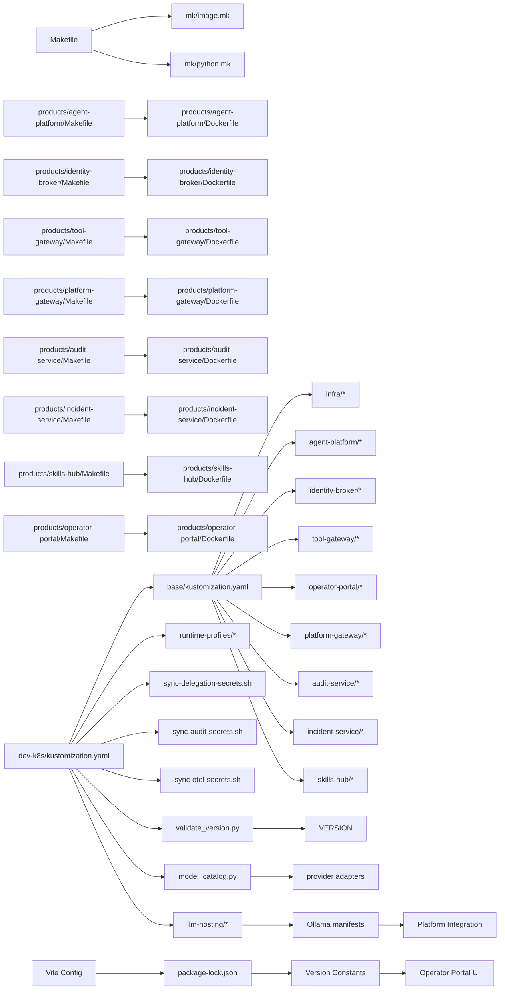

**Diagram sources**
- [Makefile](file://Makefile)
- [mk/image.mk](file://mk/image.mk)
- [mk/python.mk](file://mk/python.mk)
- [products/agent-platform/Makefile](file://products/agent-platform/Makefile)
- [products/identity-broker/Makefile](file://products/identity-broker/Makefile)
- [products/tool-gateway/Makefile](file://products/tool-gateway/Makefile)
- [products/audit-service/Dockerfile](file://products/audit-service/Dockerfile)
- [products/incident-service/Dockerfile](file://products/incident-service/Dockerfile)
- [products/skills-hub/Dockerfile](file://products/skills-hub/Dockerfile)
- [products/operator-portal/Dockerfile](file://products/operator-portal/Dockerfile)
- [shared/platform-ops/gitops/dev-k8s/base/kustomization.yaml](file://shared/platform-ops/gitops/dev-k8s/base/kustomization.yaml)
- [shared/platform-ops/gitops/dev-k8s/kustomization.yaml](file://shared/platform-ops/gitops/dev-k8s/kustomization.yaml)
- [shared/platform-ops/gitops/runtime-profiles/default/configmap.yaml](file://shared/platform-ops/gitops/runtime-profiles/default/configmap.yaml)
- [shared/shared-contracts/scripts/validate_version.py](file://shared/shared-contracts/scripts/validate_version.py)
- [products/agent-platform/src/agent_service/services/model_catalog.py](file://products/agent-platform/src/agent_service/services/model_catalog.py)
- [VERSION](file://VERSION)
- [shared/platform-ops/gitops/llm-hosting/README.md](file://shared/platform-ops/gitops/llm-hosting/README.md)
- [products/operator-portal/web-ui/app/vite.config.ts](file://products/operator-portal/web-ui/app/vite.config.ts)
- [products/operator-portal/web-ui/app/package-lock.json](file://products/operator-portal/web-ui/app/package-lock.json)

**Section sources**
- [Makefile](file://Makefile)
- [mk/image.mk](file://mk/image.mk)
- [mk/python.mk](file://mk/python.mk)
- [shared/platform-ops/gitops/dev-k8s/base/kustomization.yaml](file://shared/platform-ops/gitops/dev-k8s/base/kustomization.yaml)
- [shared/platform-ops/gitops/dev-k8s/kustomization.yaml](file://shared/platform-ops/gitops/dev-k8s/kustomization.yaml)
- [shared/shared-contracts/scripts/validate_version.py](file://shared/shared-contracts/scripts/validate_version.py)
- [VERSION](file://VERSION)
- [products/operator-portal/web-ui/app/vite.config.ts](file://products/operator-portal/web-ui/app/vite.config.ts)

## Performance Considerations
- Resource Requests/Limits:
  - Set realistic CPU/memory requests and limits based on profiling.
  - Avoid over-provisioning; use VPA recommendations cautiously.
- Concurrency and Timeouts:
  - Tune HTTP timeouts and concurrency settings per service workload.
- Caching:
  - Leverage Redis for session/state caching where applicable.
  - Utilize delegated token caching in platform-gateway to reduce identity broker calls.
  - **Model Catalog Caching**: Enable model discovery caching to reduce provider API calls and improve response times.
  - **Team-Hosted Model Caching**: Model weights are cached in PVC-backed storage for fast loading.
- Garbage Collection:
  - For Python-based services, configure GC flags if needed to reduce latency spikes.
- Network Policies:
  - Minimize unnecessary egress/ingress to reduce overhead.
- Token Delegation Performance:
  - Monitor delegation cache hit rates to optimize token refresh intervals.
  - Consider workload identity for reduced authentication overhead in production.
- **Audit Service Performance**:
  - Monitor PostgreSQL query performance and connection pooling.
  - Tune audit event batch sizes and eviction intervals based on ingestion volume.
  - Consider read replicas for high-volume audit query scenarios.
  - **Enhanced Performance**: Improved secret upsert procedures reduce deployment time and minimize service disruption.
- **OpenTelemetry Performance**:
  - Monitor telemetry export success rates and latency.
  - Configure appropriate batch sizes and timeout settings for OTel exporters.
  - Monitor OpenObserve ingestion performance and storage utilization.
  - Consider sampling strategies for high-volume telemetry data.
- **Model Catalog Performance**:
  - Monitor model discovery refresh rates and provider API response times.
  - Configure appropriate discovery refresh intervals to balance freshness with API rate limits.
  - Monitor cache hit ratios and fallback chain effectiveness.
  - Consider disabling discovery for stable model lineups to reduce overhead.
- **Team-Hosted Model Performance**:
  - Monitor model loading times and inference latency for team-hosted models.
  - Optimize GPU utilization and memory usage for GPU-enabled model servers.
  - Monitor PVC storage performance and model weight access patterns.
  - Consider model quantization levels based on hardware capabilities.
- **Skills Hub Performance**:
  - Monitor audit emission performance and event delivery success rates.
  - Optimize skill search and retrieval operations for better user experience.
  - Monitor audit event volume from skills-hub for capacity planning.
- **Version 0.23.4 Optimizations**:
  - All services benefit from consistent version optimizations and performance improvements.
  - Leverage synchronized service versions for predictable performance characteristics.
  - Monitor version-specific performance metrics across all platform components.
- **Operator Portal Performance**:
  - Build-time version injection adds minimal overhead during container build.
  - Locked dependency versions ensure consistent performance characteristics.
  - Monitor Settings view load times for accurate version display.

## Troubleshooting Guide
Common issues and resolutions:
- Deployment failures:
  - Validate Kustomize rendering; check for missing fields or invalid references.
  - Inspect pod logs and events for errors.
- Secrets not applied:
  - Ensure secret sync script runs successfully and secrets exist in the target namespace.
  - Verify delegation secrets are properly provisioned for cross-service authentication.
  - Verify comprehensive audit secrets are properly provisioned for audit event ingestion from all components including skills-hub.
  - Verify OpenTelemetry credentials are properly provisioned for telemetry authentication.
  - Verify team-hosted model server bearer tokens are correctly configured.
- Health checks failing:
  - Confirm health endpoints are reachable and returning expected responses.
- Metrics not scraped:
  - Verify ServiceMonitors or scrape configs target correct ports and paths.
- Runtime profile mismatch:
  - Use verification script to ensure selected profile matches expectations.
- Token delegation failures:
  - Check delegation secret consistency between platform-gateway and identity-broker.
  - Verify workload identity configuration if using projected tokens.
  - Monitor delegation exchange metrics for failure patterns.
- **Audit ingestion failures**:
  - Check comprehensive audit secret consistency between emitters and audit-service, including skills-hub.
  - Verify PostgreSQL connectivity and database availability.
  - Monitor audit event ingestion metrics and error rates.
  - Check audit service health endpoints and database connection status.
  - **Enhanced Troubleshooting**: The improved restart procedures in sync-audit-secrets.sh address race conditions during audit-secret rollouts by ensuring audit-service is fully rolled out before restarting emitters.
  - **Secret Upsert Issues**: If environment files are being overwritten incorrectly, verify the upsert_env_line function is preserving existing secrets while updating audit credentials.
- **OpenTelemetry issues**:
  - Verify `OTEL_ENABLED` is set correctly for each service.
  - Check OpenObserve endpoint configuration and network connectivity.
  - Verify Basic auth headers are properly provisioned via `sync-otel-secrets.sh`.
  - Monitor telemetry export success rates and authentication errors.
  - Check OpenObserve ingestion logs for 401 unauthorized responses.
  - **CI/CD Issues**: If running in CI/CD, ensure `SKIP_OTEL_SECRETS=true` is set when secrets are injected externally.
  - **Missing Local Files**: When runtime-secrets.env files are missing locally, the script will automatically patch existing cluster secrets instead of failing.
  - **Durable Merging Issues**: If OTLP headers are being wiped, verify that sibling scripts are preserving existing headers during their env-file rewrites.
  - **kubectl Patch Failures**: Check cluster permissions for patch operations and verify secret existence before patching.
- **Model Catalog Issues**:
  - Verify model discovery is enabled and configured correctly.
  - Check provider API connectivity and rate limit compliance.
  - Monitor model discovery refresh metrics and cache hit ratios.
  - Verify fixed-point model IDs are used for better audit attribution.
  - Check curated series alignment with provider current offerings.
  - Validate model resolution precedence (request > pinned > default).
- **Team-Hosted Model Issues**:
  - Verify bearer token configuration matches between platform and model server.
  - Check model server health endpoints and model loading status.
  - Monitor PVC storage availability and model weight integrity.
  - Verify network connectivity between platform pods and model server.
  - Check GPU resource allocation and driver availability for GPU-enabled deployments.
  - Validate model names match between platform configuration and server model listings.
  - Monitor inference latency and throughput for performance issues.
- **Skills Hub Issues**:
  - Verify SKILLS_AUDIT_SERVICE_URL and SKILLS_AUDIT_CLIENT_SECRET are properly configured.
  - Check that skills-hub is included in the AUDIT_INGEST_CLIENTS registry.
  - Monitor audit emission metrics for skill usage tracking.
  - Verify audit event delivery success rates from skills-hub.
- **Version Consistency Issues**:
  - Use `validate_version.py` to check version drift across all services.
  - Ensure all services maintain version 0.23.4 consistency.
  - Check SERVICE_VERSION constants in metadata.py files.
  - Verify __version__ attributes in package __init__.py files.
  - Validate VERSION file matches expected platform version.
- **Operator Portal Version Display Issues**:
  - Verify Vite build completes successfully with package-lock.json present.
  - Check that __REACT_VERSION__ and __ANTD_VERSION__ constants are properly injected.
  - Ensure Settings view displays accurate dependency versions.
  - Verify package-lock.json contains correct locked dependency versions.
  - Check that build-time version injection is working in Docker build process.

Operational commands:
- Use deploy scripts to apply overlays and reconcile resources.
- Use verification scripts to validate runtime profiles and health.
- Use delegation secret provisioning script to ensure consistent service credentials.
- Use comprehensive audit secret provisioning script to ensure consistent audit ingestion credentials from all components including skills-hub.
- Use OpenTelemetry secret provisioning script to ensure consistent telemetry authentication.
- Use version validation script to ensure consistent service versions.
- Use model catalog metrics to monitor discovery performance and cache effectiveness.
- Use team-hosted model health checks to verify model server availability and model loading status.
- Use skills-hub audit metrics to monitor skill usage tracking and audit emission performance.
- Verify operator portal Settings view displays accurate dependency versions.

**Section sources**
- [shared/platform-ops/gitops/dev-k8s/deploy.sh](file://shared/platform-ops/gitops/dev-k8s/deploy.sh)
- [shared/platform-ops/gitops/deploy-overlay.sh](file://shared/platform-ops/gitops/deploy-overlay.sh)
- [shared/platform-ops/gitops/sync-delegation-secrets.sh](file://shared/platform-ops/gitops/sync-delegation-secrets.sh)
- [shared/platform-ops/gitops/sync-audit-secrets.sh](file://shared/platform-ops/gitops/sync-audit-secrets.sh)
- [shared/platform-ops/gitops/sync-otel-secrets.sh](file://shared/platform-ops/gitops/sync-otel-secrets.sh)
- [shared/platform-ops/gitops/verify-runtime-profile.sh](file://shared/platform-ops/gitops/verify-runtime-profile.sh)
- [shared/platform-ops/gitops/sync-runtime-secret.sh](file://shared/platform-ops/gitops/sync-runtime-secret.sh)
- [shared/shared-contracts/scripts/validate_version.py](file://shared/shared-contracts/scripts/validate_version.py)
- [shared/platform-ops/gitops/llm-hosting/README.md](file://shared/platform-ops/gitops/llm-hosting/README.md)
- [docs/guides/luban-llm-guide.md](file://docs/guides/luban-llm-guide.md)
- [products/operator-portal/web-ui/app/vite.config.ts](file://products/operator-portal/web-ui/app/vite.config.ts)
- [products/operator-portal/web-ui/app/src/views/control/SettingsView.tsx](file://products/operator-portal/web-ui/app/src/views/control/SettingsView.tsx)

## Conclusion
This guide outlines the end-to-end deployment and operations for the Luban AIOps Platform using GitOps and Kustomize. By following the documented processes for building images, managing overlays, configuring environments, provisioning delegation secrets, synchronizing comprehensive audit secrets (including skills-hub integration), provisioning OpenTelemetry credentials, and setting up monitoring, teams can reliably operate the platform at scale. The enhanced delegation secret auto-provisioning ensures secure cross-service authentication while maintaining operational simplicity. The comprehensive audit service provides durable audit trail storage with PostgreSQL persistence, enabling complete compliance and security monitoring across all platform components including skills-hub usage tracking. The integrated OpenTelemetry pipeline with automated credential provisioning delivers centralized observability with fail-safe design and enhanced CI/CD support. The centralized version management system ensures all services operate at version 0.23.4 with consistent behavior across the platform. The advanced model catalog system with live discovery and enhanced model pinning best practices provides robust LLM model management with fixed-point model IDs for better audit attribution and traceability. **New**: Team-hosted LLM model hosting capabilities enable running small models locally or on-premises with full platform integration, supporting Ollama, vLLM, and llama.cpp backends with bearer-token authentication and reference Kubernetes manifests. **Enhanced**: The improved sync-audit-secrets.sh script now includes skills-hub in the AUDIT_INGEST_CLIENTS registry and addresses audit-secret rollout race conditions through enhanced restart procedures and improved secret upsert handling. **Enhanced**: Build-time version injection in the operator portal now captures locked dependency versions from package-lock.json, providing accurate React and Ant Design version display that matches the actual shipped bundles. Continuous validation, robust secret management, proactive capacity planning, careful monitoring of token delegation flows, comprehensive audit ingestion, telemetry export, model catalog performance, team-hosted model server health, skills-hub audit emissions, version consistency, and accurate dependency version display are essential for maintaining stability and performance.

## Appendices

### Appendix A: Key Scripts and Their Roles
- deploy-overlay.sh: Builds and applies Kustomize overlays to the cluster.
- select-runtime-profile.sh: Chooses the appropriate runtime profile for model providers.
- sync-runtime-secret.sh: Synchronizes runtime secrets into the cluster securely.
- sync-delegation-secrets.sh: Automatically provisions delegation secrets for cross-service authentication between platform-gateway and identity-broker.
- sync-audit-secrets.sh: Automatically provisions comprehensive audit secrets for audit event ingestion from all platform components including skills-hub, with improved secret upsert procedures and race condition handling.
- **sync-otel-secrets.sh**: Automatically provisions OpenTelemetry credentials for centralized observability via OpenObserve with enhanced CI/CD support and durable cluster-side merging using kubectl patch.
- verify-runtime-profile.sh: Validates that the active runtime profile matches expectations.
- reconcile-portal-oidc-client.sh: Ensures OIDC client configuration remains consistent with Keycloak.
- **validate_version.py**: Validates version consistency across all platform services and ensures version 0.23.4 synchronization.
- **llm-hosting manifests**: Reference Kubernetes manifests for team-hosted model server deployment (free-standing, not part of main overlay).
- **Vite Build Process**: Captures locked dependency versions for accurate version display in operator portal.

**Section sources**
- [shared/platform-ops/gitops/deploy-overlay.sh](file://shared/platform-ops/gitops/deploy-overlay.sh)
- [shared/platform-ops/gitops/select-runtime-profile.sh](file://shared/platform-ops/gitops/select-runtime-profile.sh)
- [shared/platform-ops/gitops/sync-runtime-secret.sh](file://shared/platform-ops/gitops/sync-runtime-secret.sh)
- [shared/platform-ops/gitops/sync-delegation-secrets.sh](file://shared/platform-ops/gitops/sync-delegation-secrets.sh)
- [shared/platform-ops/gitops/sync-audit-secrets.sh](file://shared/platform-ops/gitops/sync-audit-secrets.sh)
- [shared/platform-ops/gitops/sync-otel-secrets.sh](file://shared/platform-ops/gitops/sync-otel-secrets.sh)
- [shared/platform-ops/gitops/verify-runtime-profile.sh](file://shared/platform-ops/gitops/verify-runtime-profile.sh)
- [shared/platform-ops/gitops/dev-k8s/reconcile-portal-oidc-client.sh](file://shared/platform-ops/gitops/dev-k8s/reconcile-portal-oidc-client.sh)
- [shared/shared-contracts/scripts/validate_version.py](file://shared/shared-contracts/scripts/validate_version.py)
- [shared/platform-ops/gitops/llm-hosting/README.md](file://shared/platform-ops/gitops/llm-hosting/README.md)
- [products/operator-portal/web-ui/app/vite.config.ts](file://products/operator-portal/web-ui/app/vite.config.ts)

### Appendix B: Environment Variables and Configurations
- Observability settings centralized in a shared env file.
- Per-service runtime configs mounted via env files.
- **Delegation configuration**: PLATFORM_GATEWAY_SERVICE_CLIENT_SECRET and IDENTITY_SERVICE_CLIENTS must match for secure token delegation.
- **Audit configuration**: AUDIT_STORE_BACKEND=postgres, AUDIT_DB_URL for PostgreSQL connection, AUDIT_RETENTION_DAYS for data retention policy, AUDIT_INGEST_CLIENTS for comprehensive client registry including skills-hub.
- **OpenTelemetry configuration**: OTEL_ENABLED for pipeline activation, OTEL_EXPORTER_OTLP_ENDPOINT for OpenObserve URL, OTEL_EXPORTER_OTLP_HEADERS for authentication (provisioned by sync-otel-secrets.sh).
- **Workload identity**: PLATFORM_GATEWAY_WORKLOAD_TOKEN_PATH for production deployments preferring projected tokens over static secrets.
- **CI/CD Integration**: SKIP_OTEL_SECRETS=true to skip OpenTelemetry secret provisioning in environments where secrets are injected externally.
- **Version Management**: All services configured with version 0.23.4 metadata and consistent versioning enforced by validate_version.py.
- **Model Catalog Configuration**: AGENT_MODEL_DISCOVERY_ENABLED for live discovery, AGENT_MODEL_DISCOVERY_REFRESH_SECONDS for refresh intervals, AGENT_MODEL_DISCOVERY_TIMEOUT_SECONDS for API timeouts.
- **Team-Hosted Model Configuration**: LUBAN_API_KEY for bearer-token authentication, LUBAN_BASE_URL for model server endpoint, LUBAN_MODEL_NAME for default model, LUBAN_MODELS for model pinning.
- **Skills Hub Configuration**: SKILLS_AUDIT_SERVICE_URL for audit event emission, SKILLS_AUDIT_CLIENT_ID for client identification, SKILLS_AUDIT_CLIENT_SECRET for audit authentication.
- **Model Pinning Best Practices**: Use fixed-point model IDs (e.g., qwen3.8-max) over rolling tier aliases (e.g., qwen-plus) for better audit attribution and traceability.
- **Operator Portal Configuration**: Build-time version injection automatically captures locked dependency versions from package-lock.json for accurate version display.
- Ensure consistency across environments by pinning versions and tags.

**Section sources**
- [shared/platform-ops/gitops/dev-k8s/base/shared/runtime.env](file://shared/platform-ops/gitops/dev-k8s/base/shared/runtime.env)
- [shared/platform-ops/gitops/dev-k8s/base/agent-platform/runtime-config.env](file://shared/platform-ops/gitops/dev-k8s/base/agent-platform/runtime-config.env)
- [shared/platform-ops/gitops/dev-k8s/base/identity-broker/runtime-config.env](file://shared/platform-ops/gitops/dev-k8s/base/identity-broker/runtime-config.env)
- [shared/platform-ops/gitops/dev-k8s/base/tool-gateway/runtime-config.env](file://shared/platform-ops/gitops/dev-k8s/base/tool-gateway/runtime-config.env)
- [shared/platform-ops/gitops/dev-k8s/base/audit-service/runtime-config.env](file://shared/platform-ops/gitops/dev-k8s/base/audit-service/runtime-config.env)
- [shared/platform-ops/gitops/dev-k8s/base/skills-hub/runtime-config.env](file://shared/platform-ops/gitops/dev-k8s/base/skills-hub/runtime-config.env)
- [shared/platform-ops/gitops/dev-k8s/base/platform-gateway/runtime-secrets.example.env](file://shared/platform-ops/gitops/dev-k8s/base/platform-gateway/runtime-secrets.example.env)
- [shared/platform-ops/gitops/dev-k8s/base/identity-broker/runtime-secrets.example.env](file://shared/platform-ops/gitops/dev-k8s/base/identity-broker/runtime-secrets.example.env)
- [shared/platform-ops/gitops/runtime-profiles/default/runtime-secrets.example.env](file://shared/platform-ops/gitops/runtime-profiles/default/runtime-secrets.example.env)
- [shared/shared-contracts/observability-conventions.md](file://shared/shared-contracts/observability-conventions.md)
- [shared/shared-contracts/scripts/validate_version.py](file://shared/shared-contracts/scripts/validate_version.py)
- [products/operator-portal/web-ui/app/vite.config.ts](file://products/operator-portal/web-ui/app/vite.config.ts)

### Appendix C: Delegation Secret Management
**New Section** Enhanced delegation secret management for secure cross-service authentication.

The delegation secret system ensures secure communication between platform-gateway and identity-broker:

- **Automatic Secret Generation**: The sync-delegation-secrets.sh script generates a shared secret used by both services
- **Consistent Configuration**: The same secret is configured in both platform-gateway (PLATFORM_GATEWAY_SERVICE_CLIENT_SECRET) and identity-broker (IDENTITY_SERVICE_CLIENTS)
- **Automated Deployment**: The script creates Kubernetes secrets and restarts affected deployments
- **Security Best Practices**: Secrets are never committed to version control; generated dynamically during deployment
- **Version 0.23.4 Integration**: All services operate with consistent delegation secret handling

Usage:
```bash
# Generate and provision delegation secrets
./shared/platform-ops/gitops/sync-delegation-secrets.sh dev-luban-aiops

# Override with specific secret
DELEGATION_CLIENT_SECRET=my-secret ./shared/platform-ops/gitops/sync-delegation-secrets.sh dev-luban-aiops

# Skip in CI when secrets are injected externally
SKIP_DELEGATION_SECRETS=true make deploy
```

**Section sources**
- [shared/platform-ops/gitops/sync-delegation-secrets.sh](file://shared/platform-ops/gitops/sync-delegation-secrets.sh)
- [shared/platform-ops/gitops/dev-k8s/base/platform-gateway/runtime-secrets.example.env](file://shared/platform-ops/gitops/dev-k8s/base/platform-gateway/runtime-secrets.example.env)
- [shared/platform-ops/gitops/dev-k8s/base/identity-broker/runtime-secrets.example.env](file://shared/platform-ops/gitops/dev-k8s/base/identity-broker/runtime-secrets.example.env)

### Appendix D: Comprehensive Audit Secret Management
**Updated Section** Enhanced audit secret management for secure audit event ingestion from all platform components including skills-hub.

The audit secret system ensures secure audit event ingestion from all platform components with improved deployment process:

- **Centralized Secret Generation**: The sync-audit-secrets.sh script generates a single shared secret for all audit emitters including skills-hub
- **Multi-Component Integration**: Supports tool-gateway, platform-gateway, identity-broker, incident-service, and skills-hub as audit event emitters
- **Static Client Registry**: Audit-service maintains a registry of authorized clients with their corresponding secrets, now including skills-hub in AUDIT_INGEST_CLIENTS
- **Enhanced Secret Upsert**: Improved upsert_env_line function preserves existing environment files while updating audit credentials
- **Race Condition Handling**: Enhanced restart procedures ensure audit-service is fully rolled out before restarting emitters to prevent authentication failures
- **Automatic Workload Restart**: Script automatically restarts affected deployments after secret updates
- **Version 0.23.4 Compatibility**: Full integration with platform version synchronization

Usage:
```bash
# Generate and provision comprehensive audit secrets
./shared/platform-ops/gitops/sync-audit-secrets.sh dev-luban-aiops

# Override with specific secret
AUDIT_INGEST_SECRET=my-audit-secret ./shared/platform-ops/gitops/sync-audit-secrets.sh dev-luban-aiops

# Skip in CI when secrets are injected externally
SKIP_AUDIT_SECRETS=true make deploy
```

Configuration details:
- **AUDIT_INGEST_CLIENTS**: Comma-separated list of client_id=secret pairs for authorized emitters, now including skills-hub
- **Per-emitter secrets**: GATEWAY_AUDIT_CLIENT_SECRET, PLATFORM_GATEWAY_AUDIT_CLIENT_SECRET, IDENTITY_AUDIT_CLIENT_SECRET, INCIDENT_AUDIT_CLIENT_SECRET, SKILLS_AUDIT_CLIENT_SECRET
- **PostgreSQL backend**: AUDIT_STORE_BACKEND=postgres with connection string in AUDIT_DB_URL
- **Retention policy**: AUDIT_RETENTION_DAYS controls how long audit events are stored
- **Enhanced Reliability**: Improved restart procedures address audit-secret rollout race conditions

**Section sources**
- [shared/platform-ops/gitops/sync-audit-secrets.sh](file://shared/platform-ops/gitops/sync-audit-secrets.sh)
- [shared/platform-ops/gitops/dev-k8s/base/audit-service/runtime-config.env](file://shared/platform-ops/gitops/dev-k8s/base/audit-service/runtime-config.env)
- [shared/platform-ops/gitops/dev-k8s/base/audit-service/runtime-secrets.example.env](file://shared/platform-ops/gitops/dev-k8s/base/audit-service/runtime-secrets.example.env)
- [shared/platform-ops/gitops/dev-k8s/base/skills-hub/runtime-config.env](file://shared/platform-ops/gitops/dev-k8s/base/skills-hub/runtime-config.env)
- [shared/platform-ops/gitops/dev-k8s/base/skills-hub/runtime-secrets.env](file://shared/platform-ops/gitops/dev-k8s/base/skills-hub/runtime-secrets.env)
- [products/audit-service/src/audit_service/core/config.py](file://products/audit-service/src/audit_service/core/config.py)

### Appendix E: OpenTelemetry Secret Management
**Updated Section** Comprehensive OpenTelemetry credential management for centralized observability with enhanced CI/CD support and durable cluster-side merging.

The OpenTelemetry secret system ensures secure telemetry ingestion via OpenObserve:

- **Centralized Credential Generation**: The sync-otel-secrets.sh script generates Basic auth headers from OpenObserve root credentials
- **Multi-Service Integration**: Applies authentication headers to all platform services (agent-platform, identity-broker, tool-gateway, platform-gateway, audit-service, skills-hub, incident-service)
- **ConfigMap-Based Endpoint**: Shared OTLP endpoint configuration via ConfigMap with per-service secret headers
- **Fail-Open Design**: Missing credentials result in anonymous push attempts that fail gracefully without impacting services
- **Enhanced CI/CD Support**: Intelligent handling of externally provisioned secrets with skip mechanisms
- **Robust Fallback**: Uses `kubectl patch --type merge` for atomic header updates instead of wholesale file rewrites, preserving other secret keys
- **Sibling Script Synchronization**: All sibling scripts (delegation, audit, skills) preserve existing OTLP headers during their env-file rewrites
- **Version 0.23.4 Metadata**: All telemetry includes consistent version information for accurate tracking

Usage:
```bash
# Generate and provision OpenTelemetry credentials
export OO_ROOT_USER_EMAIL=admin@example.com
export OO_ROOT_USER_PASSWORD=password
./shared/platform-ops/gitops/sync-otel-secrets.sh dev-luban-aiops

# Skip in CI when secrets are injected externally
SKIP_OTEL_SECRETS=true make deploy
```

Configuration details:
- **OTEL_ENABLED**: Master switch for telemetry pipeline (default false)
- **OTEL_EXPORTER_OTLP_ENDPOINT**: OpenObserve OTLP HTTP endpoint (configured in shared runtime.env)
- **OTEL_EXPORTER_OTLP_HEADERS**: Basic auth header for OpenObserve ingestion (provisioned by sync-otel-secrets.sh)
- **Authentication**: Basic auth with base64-encoded email:password combination
- **Backend**: OpenObserve with organization prefix (/api/default)
- **CI/CD Integration**: Set `SKIP_OTEL_SECRETS=true` in CI environments where secrets are injected externally

**Section sources**
- [shared/platform-ops/gitops/sync-otel-secrets.sh](file://shared/platform-ops/gitops/sync-otel-secrets.sh)
- [shared/platform-ops/gitops/dev-k8s/base/shared/runtime.env](file://shared/platform-ops/gitops/dev-k8s/base/shared/runtime.env)
- [shared/shared-contracts/observability-conventions.md](file://shared/shared-contracts/observability-conventions.md)
- [products/agent-platform/src/agent_service/core/telemetry.py](file://products/agent-platform/src/agent_service/core/telemetry.py)

### Appendix F: PostgreSQL Infrastructure
**New Section** PostgreSQL StatefulSet configuration for audit service persistence.

The audit service requires PostgreSQL for durable audit trail storage:

- **StatefulSet Configuration**: Single replica with persistent volume claim for data durability
- **Headless Service**: Enables stable DNS names for StatefulSet pod discovery
- **Development Credentials**: Pre-configured with development database, user, and password
- **Volume Management**: Persistent volume with 1Gi storage allocation for audit data
- **Version 0.23.4 Optimization**: Enhanced performance and reliability improvements

Production considerations:
- Replace development credentials with proper secrets management
- Configure appropriate storage classes and backup strategies
- Monitor database performance and scale storage as needed
- Consider read replicas for high-volume audit query scenarios
- Implement version-consistent database migrations

**Section sources**
- [shared/platform-ops/gitops/dev-k8s/base/infra/postgres-statefulset.yaml](file://shared/platform-ops/gitops/dev-k8s/base/infra/postgres-statefulset.yaml)
- [shared/platform-ops/gitops/dev-k8s/base/infra/postgres-service.yaml](file://shared/platform-ops/gitops/dev-k8s/base/infra/postgres-service.yaml)
- [shared/platform-ops/gitops/dev-k8s/base/audit-service/runtime-config.env](file://shared/platform-ops/gitops/dev-k8s/base/audit-service/runtime-config.env)

### Appendix G: Version Management and Synchronization
**New Section** Comprehensive version management system ensuring all platform services operate at version 0.23.4.

The platform implements a centralized version management system that enforces version consistency across all components:

- **Single Source of Truth**: The root VERSION file contains the authoritative platform version (0.23.4)
- **Automated Validation**: The validate_version.py script checks version consistency across all services
- **Metadata Synchronization**: All services maintain consistent SERVICE_VERSION constants in metadata.py files
- **Package Versioning**: Package __init__.py files contain matching __version__ attributes
- **Build Integration**: Version validation is integrated into the build and deployment pipeline
- **Drift Detection**: Automatic detection and reporting of version inconsistencies
- **Enhanced Operator Portal**: Build-time version injection captures locked dependency versions for accurate display

Key version locations:
- Root VERSION file: Contains platform version 0.23.4
- Service metadata: SERVICE_VERSION = "0.23.4" in all metadata.py files
- Package versions: __version__ = "0.23.4" in package __init__.py files
- Pyproject.toml: [project] version set to 0.23.4 for all products
- Operator portal: __PLATFORM_VERSION__, __REACT_VERSION__, __ANTD_VERSION__ injected at build time

Usage:
```bash
# Validate version consistency across all services
python shared/shared-contracts/scripts/validate_version.py

# Check current platform version
cat VERSION

# Update version across all services
echo "0.23.4" > VERSION
# Then run validation to ensure consistency
python shared/shared-contracts/scripts/validate_version.py
```

Benefits:
- Prevents version drift between services
- Ensures compatible service interactions
- Simplifies debugging and troubleshooting
- Enables reliable rolling updates
- Supports consistent monitoring and alerting
- Provides accurate dependency version display in operator portal

**Section sources**
- [VERSION](file://VERSION)
- [shared/shared-contracts/scripts/validate_version.py](file://shared/shared-contracts/scripts/validate_version.py)
- [products/audit-service/src/audit_service/metadata.py](file://products/audit-service/src/audit_service/metadata.py)
- [products/incident-service/src/incident_service/metadata.py](file://products/incident-service/src/incident_service/metadata.py)
- [products/audit-service/src/audit_service/__init__.py](file://products/audit-service/src/audit_service/__init__.py)
- [products/incident-service/src/incident_service/__init__.py](file://products/incident-service/src/incident_service/__init__.py)
- [products/operator-portal/web-ui/app/vite.config.ts](file://products/operator-portal/web-ui/app/vite.config.ts)

### Appendix H: Model Catalog Configuration and Best Practices
**Updated Section** Comprehensive model catalog configuration with enhanced model pinning best practices and team-hosted model server support.

The model catalog system provides advanced LLM model management with live discovery, credential gating, and team-hosted model server integration:

- **Multi-Provider Support**: DeepSeek, DashScope, OpenAI, and team-hosted model servers (via `luban` provider) with curated model series
- **Live Model Discovery**: Periodic queries to provider `/models` endpoints with fail-soft fallback mechanisms
- **Credential Gating**: Only providers with resolvable API keys contribute to the catalog, including team-hosted model servers
- **Model Resolution**: Request > pinned > default precedence with strict validation
- **Enhanced Model Pinning**: Fixed-point model IDs recommended over rolling tier aliases for better audit attribution
- **Team-Hosted Integration**: Full support for Ollama, vLLM, and llama.cpp backends with bearer-token authentication

Key configuration options:
- **AGENT_MODEL_DISCOVERY_ENABLED**: Enable/disable live model discovery (default: true)
- **AGENT_MODEL_DISCOVERY_REFRESH_SECONDS**: Refresh interval for model discovery (default: 1800)
- **AGENT_MODEL_DISCOVERY_TIMEOUT_SECONDS**: Timeout for provider API calls (default: 5)
- **<PROVIDER>_MODELS**: Override curated series with specific model list
- **<PROVIDER>_MODEL_NAME**: Set default model for provider
- **<PROVIDER>_API_KEY**: Provider API key for authentication
- **LUBAN_* Configuration**: Team-hosted model server configuration (API key, base URL, model names)

Best practices:
- **Use Fixed-Point Model IDs**: Prefer specific model IDs like `qwen3.8-max` over rolling aliases like `qwen-plus` for precise audit attribution
- **Configure Provider Overrides**: Use `<PROVIDER>_MODELS` to restrict available models to approved lineups
- **Enable Discovery for Flexibility**: Allow live discovery to automatically pick up new provider models
- **Monitor Discovery Performance**: Track refresh rates and cache hit ratios for optimal performance
- **Validate Model Selection**: Ensure model resolution follows expected precedence rules
- **Team-Hosted Best Practices**: Use bearer-token authentication, configure proper network policies, and monitor model server health

Usage examples:
```bash
# Enable live model discovery with custom refresh interval
export AGENT_MODEL_DISCOVERY_ENABLED=true
export AGENT_MODEL_DISCOVERY_REFRESH_SECONDS=3600

# Restrict DashScope to specific models
export DASHSCOPE_MODELS=qwen3.8-max,qwen3-30b-a3b,qwen3-8b

# Set default model for provider
export DASHSCOPE_MODEL_NAME=qwen3.8-max

# Configure team-hosted model server
export LUBAN_API_KEY=<bearer-token-from-server>
export LUBAN_BASE_URL=http://ollama.llm-hosting.svc:11434/v1
export LUBAN_MODEL_NAME=qwen3:8b
export LUBAN_MODELS=qwen3:8b,qwen3:1.7b

# Disable discovery for stable model lineup
export AGENT_MODEL_DISCOVERY_ENABLED=false
```

**Section sources**
- [products/agent-platform/src/agent_service/services/model_catalog.py](file://products/agent-platform/src/agent_service/services/model_catalog.py)
- [products/agent-platform/src/agent_service/providers/deepseek.py](file://products/agent-platform/src/agent_service/providers/deepseek.py)
- [products/agent-platform/src/agent_service/providers/dashscope.py](file://products/agent-platform/src/agent_service/providers/dashscope.py)
- [products/agent-platform/src/agent_service/providers/luban.py](file://products/agent-platform/src/agent_service/providers/luban.py)
- [shared/platform-ops/gitops/runtime-profiles/default/runtime-secrets.example.env](file://shared/platform-ops/gitops/runtime-profiles/default/runtime-secrets.example.env)
- [shared/platform-ops/gitops/runtime-profiles/default/configmap.yaml](file://shared/platform-ops/gitops/runtime-profiles/default/configmap.yaml)
- [shared/platform-ops/gitops/runtime-profiles/README.md](file://shared/platform-ops/gitops/runtime-profiles/README.md)

### Appendix I: Team-Hosted Model Server Deployment
**New Section** Complete guide for deploying team-hosted model servers with reference Kubernetes manifests.

The platform provides reference Kubernetes manifests for deploying team-hosted model servers, primarily focused on Ollama but compatible with other OpenAI-compatible backends:

- **Reference Stack**: Complete Ollama deployment with Deployment, Service, PVC, and Secret templates
- **Bearer-Token Authentication**: Secure authentication via `OLLAMA_API_KEY` environment variable
- **Persistent Model Storage**: PVC-backed model weight inventory with configurable storage sizing
- **Health Checks**: Readiness and liveness probes for reliable operation
- **Resource Optimization**: CPU-only quantizations with appropriate memory requests and limits
- **Network Security**: ClusterIP-only service exposure with no external access

Deployment steps:
```bash
# Create dedicated namespace
kubectl create namespace llm-hosting

# Edit the Secret template with a real token
$EDITOR shared/platform-ops/gitops/llm-hosting/ollama/secret.yaml

# Apply the complete stack
kubectl -n llm-hosting apply -f shared/platform-ops/gitops/llm-hosting/ollama/

# Pull a model into the PVC-backed inventory
kubectl -n llm-hosting exec deploy/ollama -- ollama pull qwen3:8b

# Verify endpoint accessibility
kubectl -n llm-hosting run curl-probe --rm -it --image=curlimages/curl -- \
  curl -sS -H "Authorization: Bearer <token>" \
  http://ollama.llm-hosting.svc:11434/v1/models
```

Configuration for platform integration:
```bash
# Add to agent-platform runtime secrets
export LUBAN_API_KEY=<same token as OLLAMA_API_KEY>
export LUBAN_BASE_URL=http://ollama.llm-hosting.svc:11434/v1
export LUBAN_MODEL_NAME=qwen3:8b
export LUBAN_MODELS=qwen3:8b,qwen3:1.7b
```

Sizing considerations:
- **CPU-only qwen3-8b-class quant**: 2 CPU requests, 8Gi RAM requests, 12Gi memory limits
- **Model weights**: 50Gi PVC for model inventory (resize before pulling larger models)
- **GPU nodes**: Add NVIDIA device plugin tolerations and GPU limits for GPU-enabled deployments
- **Scaling**: Single replica by design; scale by replicating the entire stack rather than increasing replicas

Security posture:
- **Bearer-token authentication**: Required for all API calls once `OLLAMA_API_KEY` is set
- **ClusterIP service**: No external exposure; internal cluster networking only
- **Secret management**: Token stored in Kubernetes Secret, never committed to version control
- **Platform integration**: Platform fails closed without proper `LUBAN_BASE_URL` and `LUBAN_API_KEY` configuration

**Section sources**
- [shared/platform-ops/gitops/llm-hosting/README.md](file://shared/platform-ops/gitops/llm-hosting/README.md)
- [shared/platform-ops/gitops/llm-hosting/ollama/deployment.yaml](file://shared/platform-ops/gitops/llm-hosting/ollama/deployment.yaml)
- [shared/platform-ops/gitops/llm-hosting/ollama/service.yaml](file://shared/platform-ops/gitops/llm-hosting/ollama/service.yaml)
- [shared/platform-ops/gitops/llm-hosting/ollama/pvc.yaml](file://shared/platform-ops/gitops/llm-hosting/ollama/pvc.yaml)
- [shared/platform-ops/gitops/llm-hosting/ollama/secret.yaml](file://shared/platform-ops/gitops/llm-hosting/ollama/secret.yaml)
- [docs/guides/luban-llm-guide.md](file://docs/guides/luban-llm-guide.md)

### Appendix J: Enhanced Operator Portal Build Process
**New Section** Build-time version injection for accurate dependency version display.

The operator portal now implements enhanced build-time version injection to capture locked dependency versions from package-lock.json:

- **Vite Configuration Enhancement**: vite.config.ts reads package-lock.json to extract locked versions of react and antd dependencies
- **Build-Time Constants**: Injects __REACT_VERSION__ and __ANTD_VERSION__ constants alongside existing __PLATFORM_VERSION__
- **Accurate Version Display**: Settings view displays precise versions used in the built bundle, matching actual shipped dependencies
- **Docker Build Integration**: Multi-stage Docker build ensures package-lock.json is available during build process
- **Dependency Tracking**: Maintains lockstep between declared dependencies and actually installed versions

Key implementation details:
- **Locked Version Resolution**: Uses package-lock.json packages section to get exact installed versions
- **Fallback Handling**: Falls back to package.json dependencies if locked version not found
- **Version Formatting**: Strips caret (^) and tilde (~) prefixes for clean version display
- **Settings View Integration**: Displays React and Ant Design versions in the Platform pane of Settings view

Usage and verification:
```bash
# Build operator portal to generate version constants
make -C products/operator-portal build

# Verify version injection in Settings view
# Navigate to Settings > Platform tab to see accurate dependency versions
```

Benefits:
- **Accuracy**: Shows exactly which React and Ant Design versions are shipped in the bundle
- **Traceability**: Links displayed versions to specific package-lock.json entries
- **Debugging**: Helps identify version mismatches between development and production
- **Compliance**: Ensures version display matches actual deployed dependencies

**Section sources**
- [products/operator-portal/web-ui/app/vite.config.ts](file://products/operator-portal/web-ui/app/vite.config.ts)
- [products/operator-portal/web-ui/app/package-lock.json](file://products/operator-portal/web-ui/app/package-lock.json)
- [products/operator-portal/web-ui/app/src/version.ts](file://products/operator-portal/web-ui/app/src/version.ts)
- [products/operator-portal/web-ui/app/src/views/control/SettingsView.tsx](file://products/operator-portal/web-ui/app/src/views/control/SettingsView.tsx)
- [products/operator-portal/Dockerfile](file://products/operator-portal/Dockerfile)
- [products/operator-portal/Makefile](file://products/operator-portal/Makefile)