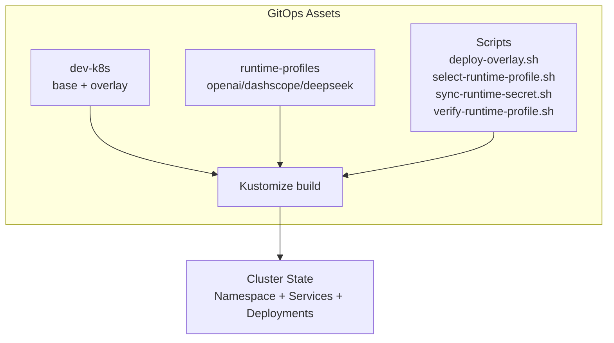
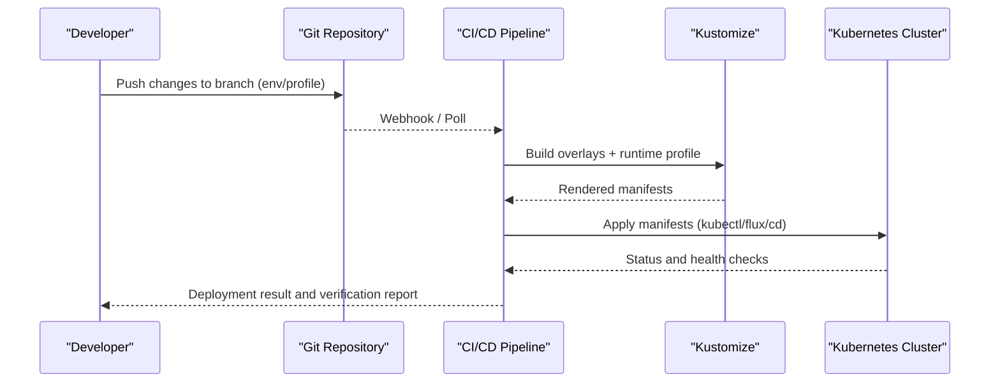
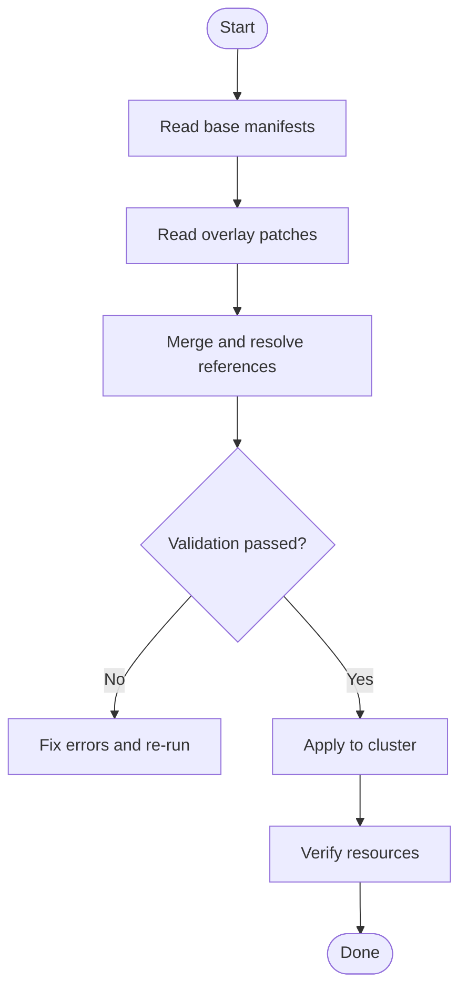
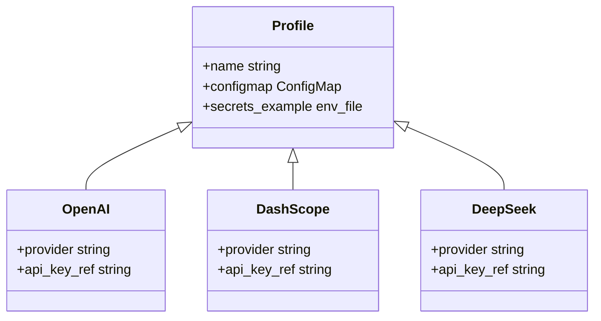
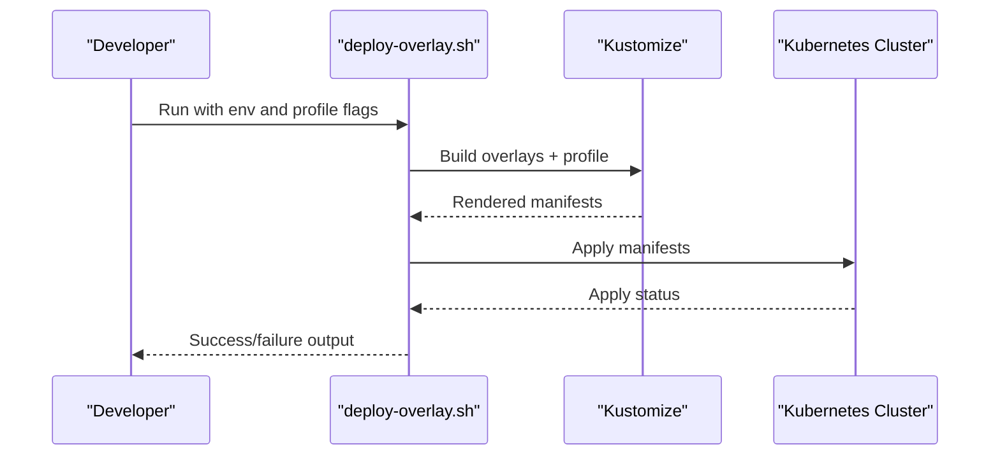
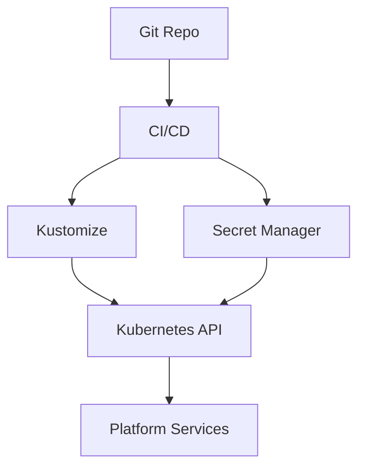

# GitOps Workflow

<cite>
**Referenced Files in This Document**
- [README.md](file://README.md)
- [kustomization.yaml](file://shared/platform-ops/gitops/dev-k8s/kustomization.yaml)
- [deploy-overlay.sh](file://shared/platform-ops/gitops/deploy-overlay.sh)
- [select-runtime-profile.sh](file://shared/platform-ops/gitops/select-runtime-profile.sh)
- [sync-runtime-secret.sh](file://shared/platform-ops/gitops/sync-runtime-secret.sh)
- [verify-runtime-profile.sh](file://shared/platform-ops/gitops/verify-runtime-profile.sh)
- [dev-k8s README.md](file://shared/platform-ops/gitops/dev-k8s/README.md)
- [runtime profiles README.md](file://shared/platform-ops/gitops/runtime-profiles/README.md)
- [openai kustomization.yaml](file://shared/platform-ops/gitops/runtime-profiles/openai/kustomization.yaml)
- [dashscope kustomization.yaml](file://shared/platform-ops/gitops/runtime-profiles/dashscope/kustomization.yaml)
- [deepseek kustomization.yaml](file://shared/platform-ops/gitops/runtime-profiles/deepseek/kustomization.yaml)
- [agent-platform deployment](file://shared/platform-ops/gitops/dev-k8s/base/agent-platform/agent-service-deployment.yaml)
- [identity-broker deployment](file://shared/platform-ops/gitops/dev-k8s/base/identity-broker/identity-service-deployment.yaml)
- [tool-gateway deployment](file://shared/platform-ops/gitops/dev-k8s/base/tool-gateway/api-gateway-deployment.yaml)
- [infra redis deployment](file://shared/platform-ops/gitops/dev-k8s/base/infra/redis-deployment.yaml)
- [operator-portal deployment](file://shared/platform-ops/gitops/dev-k8s/base/operator-portal/web-ui-deployment.yaml)
- [namespace manifest](file://shared/platform-ops/gitops/dev-k8s/base/shared/namespace.yaml)
</cite>

## Table of Contents
1. [Introduction](#introduction)
2. [Project Structure](#project-structure)
3. [Core Components](#core-components)
4. [Architecture Overview](#architecture-overview)
5. [Detailed Component Analysis](#detailed-component-analysis)
6. [Dependency Analysis](#dependency-analysis)
7. [Performance Considerations](#performance-considerations)
8. [Troubleshooting Guide](#troubleshooting-guide)
9. [Conclusion](#conclusion)
10. [Appendices](#appendices)

## Introduction
This document explains the GitOps workflow for the Luban AIOps Platform, focusing on a Git-based deployment pipeline using Kustomize overlays and runtime profiles. It covers how to manage different deployment environments through Git branches and overlays, configure AI providers at runtime (OpenAI, DashScope, DeepSeek), manage secrets with GitOps practices, automate synchronization, and verify deployments. It also includes best practices for version control, change management, and collaborative development workflows.

## Project Structure
The GitOps assets are organized under shared/platform-ops/gitops:
- dev-k8s: Base Kubernetes manifests and environment-specific overlays for local or development clusters.
- runtime-profiles: Provider-specific configurations for OpenAI, DashScope, and DeepSeek.
- Scripts: Utilities to select profiles, apply overlays, sync secrets, and verify profiles.

**Diagram sources**
- [kustomization.yaml](file://shared/platform-ops/gitops/dev-k8s/kustomization.yaml)
- [deploy-overlay.sh](file://shared/platform-ops/gitops/deploy-overlay.sh)
- [select-runtime-profile.sh](file://shared/platform-ops/gitops/select-runtime-profile.sh)
- [sync-runtime-secret.sh](file://shared/platform-ops/gitops/sync-runtime-secret.sh)
- [verify-runtime-profile.sh](file://shared/platform-ops/gitops/verify-runtime-profile.sh)

**Section sources**
- [dev-k8s README.md](file://shared/platform-ops/gitops/dev-k8s/README.md)
- [runtime profiles README.md](file://shared/platform-ops/gitops/runtime-profiles/README.md)

## Core Components
- Kustomize base and overlays: The base defines common resources (namespaces, services, deployments). Overlays enable per-environment customizations.
- Runtime profiles: Provider-specific ConfigMaps and example secret files that inject runtime configuration into applications.
- Automation scripts:
  - deploy-overlay.sh: Applies Kustomize overlays to the cluster.
  - select-runtime-profile.sh: Selects and applies a runtime profile.
  - sync-runtime-secret.sh: Syncs provider secrets into the cluster securely.
  - verify-runtime-profile.sh: Validates that the active profile is correctly applied.

Key responsibilities:
- Environment isolation via Git branches and overlays.
- Provider selection via runtime profiles.
- Secret injection without committing sensitive values.
- Automated sync and verification to ensure desired state.

**Section sources**
- [kustomization.yaml](file://shared/platform-ops/gitops/dev-k8s/kustomization.yaml)
- [deploy-overlay.sh](file://shared/platform-ops/gitops/deploy-overlay.sh)
- [select-runtime-profile.sh](file://shared/platform-ops/gitops/select-runtime-profile.sh)
- [sync-runtime-secret.sh](file://shared/platform-ops/gitops/sync-runtime-secret.sh)
- [verify-runtime-profile.sh](file://shared/platform-ops/gitops/verify-runtime-profile.sh)

## Architecture Overview
The GitOps flow uses Git as the source of truth. Changes pushed to specific branches trigger builds that render Kustomize templates and apply them to target clusters. Runtime profiles allow switching AI providers without changing application code.

[No sources needed since this diagram shows conceptual workflow, not actual code structure]

## Detailed Component Analysis

### Kustomize Base and Overlay Strategy
- Base manifests define core platform components:
  - Agent Platform service and deployment
  - Identity Broker service and deployment
  - Tool Gateway service and deployment
  - Shared infrastructure (e.g., Redis)
  - Namespace and shared configuration
- Overlays customize resources per environment (e.g., replicas, image tags, config mounts).

**Diagram sources**
- [kustomization.yaml](file://shared/platform-ops/gitops/dev-k8s/kustomization.yaml)

**Section sources**
- [agent-platform deployment](file://shared/platform-ops/gitops/dev-k8s/base/agent-platform/agent-service-deployment.yaml)
- [identity-broker deployment](file://shared/platform-ops/gitops/dev-k8s/base/identity-broker/identity-service-deployment.yaml)
- [tool-gateway deployment](file://shared/platform-ops/gitops/dev-k8s/base/tool-gateway/api-gateway-deployment.yaml)
- [infra redis deployment](file://shared/platform-ops/gitops/dev-k8s/base/infra/redis-deployment.yaml)
- [operator-portal deployment](file://shared/platform-ops/gitops/dev-k8s/base/operator-portal/web-ui-deployment.yaml)
- [namespace manifest](file://shared/platform-ops/gitops/dev-k8s/base/shared/namespace.yaml)

### Runtime Profiles for AI Providers
Runtime profiles encapsulate provider-specific configuration and secrets:
- openai: Configuration and example secrets for OpenAI integration.
- dashscope: Configuration and example secrets for DashScope integration.
- deepseek: Configuration and example secrets for DeepSeek integration.

Each profile contains:
- A Kustomization file to patch ConfigMaps and environment variables.
- A ConfigMap defining runtime settings.
- An example secrets file template for secure secret management.

**Diagram sources**
- [openai kustomization.yaml](file://shared/platform-ops/gitops/runtime-profiles/openai/kustomization.yaml)
- [dashscope kustomization.yaml](file://shared/platform-ops/gitops/runtime-profiles/dashscope/kustomization.yaml)
- [deepseek kustomization.yaml](file://shared/platform-ops/gitops/runtime-profiles/deepseek/kustomization.yaml)

**Section sources**
- [runtime profiles README.md](file://shared/platform-ops/gitops/runtime-profiles/README.md)
- [openai kustomization.yaml](file://shared/platform-ops/gitops/runtime-profiles/openai/kustomization.yaml)
- [dashscope kustomization.yaml](file://shared/platform-ops/gitops/runtime-profiles/dashscope/kustomization.yaml)
- [deepseek kustomization.yaml](file://shared/platform-ops/gitops/runtime-profiles/deepseek/kustomization.yaml)

### Secret Management with GitOps
Secrets should never be committed directly. Use one of these approaches:
- External secret stores (e.g., Kubernetes Secrets Manager, Vault) synced by operators.
- Sealed Secrets or SOPS encrypted files stored in Git; decrypted at deploy time.
- Local-only secret files referenced by sync scripts but excluded from version control.

Recommended practice:
- Store only example templates in Git (e.g., runtime-secrets.example.env).
- Maintain real secrets outside Git and sync them via CI/CD or a dedicated operator.
- Use namespace-scoped secrets aligned with platform components.

**Section sources**
- [sync-runtime-secret.sh](file://shared/platform-ops/gitops/sync-runtime-secret.sh)
- [runtime profiles README.md](file://shared/platform-ops/gitops/runtime-profiles/README.md)

### Automated Sync and Verification Workflows
- deploy-overlay.sh: Builds and applies Kustomize overlays for the selected environment.
- select-runtime-profile.sh: Switches the active runtime profile and updates ConfigMaps/env.
- sync-runtime-secret.sh: Ensures provider secrets exist in the target namespace.
- verify-runtime-profile.sh: Checks that the correct profile is applied and resources are healthy.

**Diagram sources**
- [deploy-overlay.sh](file://shared/platform-ops/gitops/deploy-overlay.sh)
- [kustomization.yaml](file://shared/platform-ops/gitops/dev-k8s/kustomization.yaml)

**Section sources**
- [deploy-overlay.sh](file://shared/platform-ops/gitops/deploy-overlay.sh)
- [select-runtime-profile.sh](file://shared/platform-ops/gitops/select-runtime-profile.sh)
- [sync-runtime-secret.sh](file://shared/platform-ops/gitops/sync-runtime-secret.sh)
- [verify-runtime-profile.sh](file://shared/platform-ops/gitops/verify-runtime-profile.sh)

## Dependency Analysis
The GitOps layer depends on:
- Kustomize for templating and patching.
- Kubernetes API for applying manifests.
- CI/CD system for automation and validation.
- External secret managers for secure secret handling.

[No sources needed since this diagram shows conceptual dependencies, not direct code mapping]

**Section sources**
- [kustomization.yaml](file://shared/platform-ops/gitops/dev-k8s/kustomization.yaml)
- [deploy-overlay.sh](file://shared/platform-ops/gitops/deploy-overlay.sh)

## Performance Considerations
- Keep base manifests minimal and reusable; use overlays for targeted changes.
- Avoid large diffs across overlays; prefer small, focused commits.
- Cache Kustomize builds in CI to speed up pipelines.
- Limit secret sync operations to necessary namespaces and resources.
- Use readiness/liveness probes in deployments to accelerate health checks.

[No sources needed since this section provides general guidance]

## Troubleshooting Guide
Common issues and resolutions:
- Profile mismatch: Ensure the selected runtime profile matches the intended provider. Use verify-runtime-profile.sh to validate.
- Missing secrets: Confirm secrets are synced to the correct namespace before applying overlays.
- Overlay conflicts: Review Kustomize patches for overlapping changes; resolve naming or selector mismatches.
- Health check failures: Inspect pod logs and events after apply; confirm external dependencies (e.g., Redis) are reachable.

Useful commands:
- Rebuild and preview manifests locally before pushing.
- Run verification script to assert profile and resource states.
- Check namespace and resource existence post-apply.

**Section sources**
- [verify-runtime-profile.sh](file://shared/platform-ops/gitops/verify-runtime-profile.sh)
- [sync-runtime-secret.sh](file://shared/platform-ops/gitops/sync-runtime-secret.sh)

## Conclusion
The Luban AIOps Platform’s GitOps workflow leverages Kustomize overlays and runtime profiles to deliver consistent, secure, and provider-flexible deployments across environments. By separating base manifests from overlays and isolating provider configuration into profiles, teams can collaborate effectively while maintaining strong security practices around secrets. Automation scripts streamline the process, enabling reliable synchronization and verification.

[No sources needed since this section summarizes without analyzing specific files]

## Appendices

### Best Practices for Version Control and Change Management
- Branch strategy:
  - main: Stable baseline with validated overlays.
  - feature/*: Experimental changes and new overlays.
  - release/*: Tagged releases with pinned images and profiles.
- Commit hygiene:
  - Small, atomic commits with clear messages.
  - Separate changes to overlays, profiles, and scripts.
- Review process:
  - Require PR reviews for overlay and profile changes.
  - Enforce automated checks (lint, test, verify).
- Collaboration:
  - Use issue templates and PR templates for consistency.
  - Document environment-specific decisions in overlay comments.

**Section sources**
- [README.md](file://README.md)