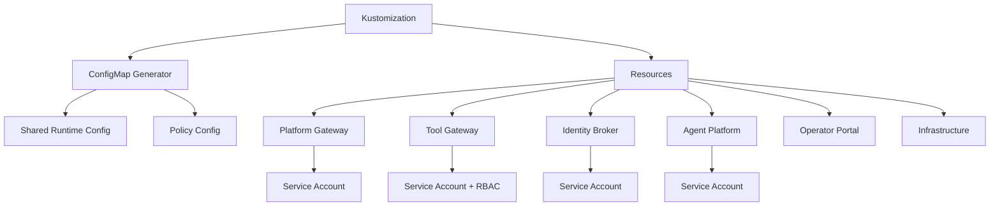
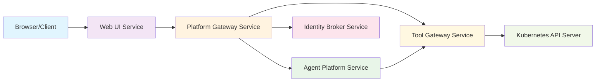

# Kubernetes Deployment

<cite>
**Referenced Files in This Document**
- [kustomization.yaml](file://shared/platform-ops/gitops/dev-k8s/base/kustomization.yaml)
- [platform-gateway-deployment.yaml](file://shared/platform-ops/gitops/dev-k8s/base/platform-gateway/platform-gateway-deployment.yaml)
- [platform-gateway-service.yaml](file://shared/platform-ops/gitops/dev-k8s/base/platform-gateway/platform-gateway-service.yaml)
- [tool-gateway-deployment.yaml](file://shared/platform-ops/gitops/dev-k8s/base/tool-gateway/tool-gateway-deployment.yaml)
- [tool-gateway-service.yaml](file://shared/platform-ops/gitops/dev-k8s/base/tool-gateway/tool-gateway-service.yaml)
- [platform-gateway-rbac.yaml](file://shared/platform-ops/gitops/dev-k8s/base/platform-gateway/rbac.yaml)
- [tool-gateway-rbac.yaml](file://shared/platform-ops/gitops/dev-k8s/base/tool-gateway/rbac.yaml)
- [platform-gateway-runtime-config.env](file://shared/platform-ops/gitops/dev-k8s/base/platform-gateway/runtime-config.env)
- [tool-gateway-runtime-config.env](file://shared/platform-ops/gitops/dev-k8s/base/tool-gateway/runtime-config.env)
- [shared-runtime.env](file://shared/platform-ops/gitops/dev-k8s/base/shared/runtime.env)
- [agent-service-deployment.yaml](file://shared/platform-ops/gitops/dev-k8s/base/agent-platform/agent-service-deployment.yaml)
- [identity-service-deployment.yaml](file://shared/platform-ops/gitops/dev-k8s/base/identity-broker/identity-service-deployment.yaml)
- [web-ui-deployment.yaml](file://shared/platform-ops/gitops/dev-k8s/base/operator-portal/web-ui-deployment.yaml)
- [redis-deployment.yaml](file://shared/platform-ops/gitops/dev-k8s/base/infra/redis-deployment.yaml)
- [deploy.sh](file://shared/platform-ops/gitops/dev-k8s/deploy.sh)
- [dev-k8s-readme.md](file://shared/platform-ops/gitops/dev-k8s/README.md)
</cite>

## Update Summary
**Changes Made**
- Updated deployment architecture to support independent platform-gateway and tool-gateway services instead of single api-gateway deployment
- Added separate RBAC configurations for each gateway service with distinct security boundaries
- Configured independent environment variables and secrets for each gateway service
- Updated service discovery and networking to reflect the new dual-gateway architecture
- Enhanced deployment automation scripts to handle the new service structure
- **Enhanced Security Contexts**: All service deployments now include comprehensive security contexts with runAsNonRoot: true, runAsUser: 1000, allowPrivilegeEscalation: false, and seccompProfile: RuntimeDefault for improved container security
- **Service Link Configuration**: Added `enableServiceLinks: false` across all dev-k8s deployments to prevent Kubernetes legacy service-link environment variable injection conflicts, ensuring DNS-based service discovery is used exclusively

## Table of Contents
1. Overview
2. Kustomize Structure and Base Configuration
3. Platform Gateway Service
4. Tool Gateway Service
5. Identity Broker Service
6. Agent Platform Service
7. Operator Portal Service
8. Infrastructure Services
9. Service Discovery and Networking
10. Persistent Storage Configuration
11. Deployment Automation
12. Rollback Procedures
13. Troubleshooting

## Overview

The Luban AIOps Platform uses a Kustomize-based deployment structure that supports both platform-gateway and tool-gateway services independently. This architectural change replaces the previous single api-gateway deployment with two specialized gateways, each serving distinct responsibilities:

- **Platform Gateway**: Handles user-facing API requests, authentication, authorization, and agent service orchestration
- **Tool Gateway**: Manages tool execution, Kubernetes resource access, and policy enforcement for tool operations

The deployment is organized using Kustomize overlays with a base configuration that includes all core services and their dependencies. All services are deployed with enhanced security contexts to ensure containers run as non-root users with minimal privileges. Additionally, all deployments now use `enableServiceLinks: false` to prevent Kubernetes legacy service-link environment variable injection conflicts, ensuring reliable DNS-based service discovery.

## Kustomize Structure and Base Configuration

The base Kustomize configuration orchestrates all platform components through a centralized kustomization file that defines common settings, config maps, and resource references.



**Diagram sources**
- [kustomization.yaml:1-33](file://shared/platform-ops/gitops/dev-k8s/base/kustomization.yaml#L1-L33)

The base configuration creates a unified `platform-runtime-config` ConfigMap from multiple environment fragments:
- Shared runtime settings (`shared/runtime.env`)
- Platform gateway specific settings (`platform-gateway/runtime-config.env`)
- Tool gateway specific settings (`tool-gateway/runtime-config.env`)
- Identity broker settings (`identity-broker/runtime-config.env`)
- Agent platform settings (`agent-platform/runtime-config.env`)

**Section sources**
- [kustomization.yaml:6-16](file://shared/platform-ops/gitops/dev-k8s/base/kustomization.yaml#L6-L16)
- [shared-runtime.env:1-8](file://shared/platform-ops/gitops/dev-k8s/base/shared/runtime.env#L1-L8)

## Platform Gateway Service

The platform-gateway service handles user-facing API requests, authentication, authorization, and orchestrates calls to the agent service. It operates as an independent service with its own security context and configuration.

### Deployment Configuration

The platform-gateway deployment runs with dedicated service account permissions and mounts policy configurations for authorization decisions. The deployment includes comprehensive security contexts to ensure secure container execution.

**Key Features:**
- Dedicated ServiceAccount for security isolation
- Prometheus monitoring annotations for observability
- Policy configuration mounted as read-only volume
- Environment variables from shared and platform-specific config maps
- Optional secret mounting for sensitive credentials
- **Security Context**: Non-root execution with UID 1000, privilege escalation disabled, and seccomp profile enabled
- **Service Link Configuration**: `enableServiceLinks: false` prevents legacy service-link environment variable injection conflicts

**Updated** Enhanced security context ensures the platform-gateway container runs with minimal privileges, preventing potential security vulnerabilities. The service link configuration ensures reliable DNS-based service discovery without conflicting environment variables.

**Section sources**
- [platform-gateway-deployment.yaml:1-49](file://shared/platform-ops/gitops/dev-k8s/base/platform-gateway/platform-gateway-deployment.yaml#L1-L49)
- [platform-gateway-rbac.yaml:1-5](file://shared/platform-ops/gitops/dev-k8s/base/platform-gateway/rbac.yaml#L1-L5)

### Service Configuration

The platform-gateway exposes HTTP service on port 8000 for external client connections.

**Section sources**
- [platform-gateway-service.yaml:1-12](file://shared/platform-ops/gitops/dev-k8s/base/platform-gateway/platform-gateway-service.yaml#L1-L12)

### Environment Variables

The platform-gateway requires specific configuration for authentication, authorization, and service communication:

| Variable | Description | Example Value |
|----------|-------------|---------------|
| AGENT_SERVICE_URL | Agent service endpoint | http://agent-service:8000 |
| PLATFORM_GATEWAY_DEV_USER | Development user override | demo.operator |
| PLATFORM_GATEWAY_REQUIRE_AUTH | Enable authentication | true |
| PLATFORM_GATEWAY_POLICY_PATH | Policy file location | /etc/luban/policy/policy.yaml |
| PLATFORM_GATEWAY_TOKEN_AUDIENCE | Token audience identifier | platform-gateway |
| PLATFORM_GATEWAY_DELEGATION_AUDIENCE | Delegated token audience | tool-gateway |
| PLATFORM_GATEWAY_SERVICE_CLIENT_ID | Service client identifier | platform-gateway |

**Section sources**
- [platform-gateway-runtime-config.env:1-8](file://shared/platform-ops/gitops/dev-k8s/base/platform-gateway/runtime-config.env#L1-L8)

## Tool Gateway Service

The tool-gateway service manages tool execution, Kubernetes resource access, and policy enforcement specifically for tool operations. It provides a secure boundary between user requests and cluster resources.

### Deployment Configuration

The tool-gateway deployment includes comprehensive RBAC configuration with role-based access control for Kubernetes resources. The deployment includes enhanced security contexts to ensure secure container execution.

**Key Features:**
- Dedicated ServiceAccount with minimal permissions
- Role-based access control for pods, events, and logs
- Prometheus monitoring for operational visibility
- Policy configuration for tool execution rules
- Kubernetes integration enabled by default
- **Security Context**: Non-root execution with UID 1000, privilege escalation disabled, and seccomp profile enabled
- **Service Link Configuration**: `enableServiceLinks: false` prevents legacy service-link environment variable injection conflicts

**Updated** Enhanced security context ensures the tool-gateway container runs with minimal privileges, reducing the attack surface for tool execution operations. The service link configuration ensures reliable DNS-based service discovery without conflicting environment variables.

**Section sources**
- [tool-gateway-deployment.yaml:1-46](file://shared/platform-ops/gitops/dev-k8s/base/tool-gateway/tool-gateway-deployment.yaml#L1-L46)
- [tool-gateway-rbac.yaml:1-30](file://shared/platform-ops/gitops/dev-k8s/base/tool-gateway/rbac.yaml#L1-L30)

### Service Configuration

The tool-gateway exposes HTTP service on port 8000 for internal service-to-service communication.

**Section sources**
- [tool-gateway-service.yaml:1-12](file://shared/platform-ops/gitops/dev-k8s/base/tool-gateway/tool-gateway-service.yaml#L1-L12)

### RBAC Configuration

The tool-gateway has granular permissions for Kubernetes resource access:

**Permissions Granted:**
- GET and LIST operations on pods and events
- GET operations on pod logs
- Namespace-scoped role binding for security isolation

**Section sources**
- [tool-gateway-rbac.yaml:7-30](file://shared/platform-ops/gitops/dev-k8s/base/tool-gateway/rbac.yaml#L7-L30)

### Environment Variables

The tool-gateway requires configuration for authentication, Kubernetes integration, and policy enforcement:

| Variable | Description | Example Value |
|----------|-------------|---------------|
| GATEWAY_DEV_USER | Development user override | demo.operator |
| GATEWAY_REQUIRE_AUTH | Enable authentication | true |
| GATEWAY_POLICY_PATH | Policy file location | /etc/luban/policy/policy.yaml |
| GATEWAY_K8S_ENABLED | Enable Kubernetes integration | true |
| GATEWAY_K8S_NAMESPACE | Target namespace | dev-luban-aiops |
| GATEWAY_TOKEN_AUDIENCE | Token audience identifier | tool-gateway |

**Section sources**
- [tool-gateway-runtime-config.env:1-7](file://shared/platform-ops/gitops/dev-k8s/base/tool-gateway/runtime-config.env#L1-L7)

## Identity Broker Service

The identity-broker service provides authentication and authorization services for the platform, handling OIDC flows and token management.

### Deployment Configuration

The identity-broker deployment includes runtime configuration and optional secrets for OIDC client credentials. The deployment includes enhanced security contexts to ensure secure container execution.

**Key Features:**
- Authentication service for platform users
- OIDC client management
- Token exchange capabilities
- Integration with external identity providers
- **Security Context**: Non-root execution with UID 1000, privilege escalation disabled, and seccomp profile enabled
- **Service Link Configuration**: `enableServiceLinks: false` prevents legacy service-link environment variable injection conflicts

**Updated** Enhanced security context ensures the identity-broker container runs with minimal privileges, protecting sensitive authentication operations. The service link configuration ensures reliable DNS-based service discovery without conflicting environment variables.

**Section sources**
- [identity-service-deployment.yaml:1-40](file://shared/platform-ops/gitops/dev-k8s/base/identity-broker/identity-service-deployment.yaml#L1-L40)

### Service Configuration

The identity-broker exposes HTTP service for authentication endpoints.

**Section sources**
- [identity-service-service.yaml:1-12](file://shared/platform-ops/gitops/dev-k8s/base/identity-broker/identity-service-service.yaml#L1-L12)

## Agent Platform Service

The agent-platform service provides the core agent runtime functionality, including session management, provider integration, and tool execution coordination.

### Deployment Configuration

The agent-platform deployment runs the agent service with appropriate runtime configuration and dependencies. The deployment includes enhanced security contexts to ensure secure container execution.

**Key Features:**
- Agent runtime execution environment
- Session state management
- Provider integration (OpenAI, DeepSeek, DashScope)
- Tool execution coordination via tool-gateway
- **Security Context**: Non-root execution with UID 1000, privilege escalation disabled, and seccomp profile enabled
- **Service Link Configuration**: `enableServiceLinks: false` prevents legacy service-link environment variable injection conflicts

**Updated** Enhanced security context ensures the agent-platform container runs with minimal privileges, protecting agent runtime operations and session data. The service link configuration ensures reliable DNS-based service discovery without conflicting environment variables.

**Section sources**
- [agent-service-deployment.yaml:1-48](file://shared/platform-ops/gitops/dev-k8s/base/agent-platform/agent-service-deployment.yaml#L1-L48)

### Service Configuration

The agent-platform exposes HTTP service for API endpoints consumed by platform-gateway.

**Section sources**
- [agent-service-service.yaml:1-12](file://shared/platform-ops/gitops/dev-k8s/base/agent-platform/agent-service-service.yaml#L1-L12)

## Operator Portal Service

The operator-portal service provides a web-based interface for platform administration and monitoring.

### Deployment Configuration

The operator-portal deployment serves static web content through nginx with API proxying to platform-gateway. The deployment includes enhanced security contexts with a different user ID optimized for nginx operation.

**Key Features:**
- Static web UI served by nginx
- API proxying to platform-gateway
- OIDC integration for authentication
- Development-friendly local access
- **Security Context**: Non-root execution with UID 101 (nginx user), privilege escalation disabled, and seccomp profile enabled
- **Service Link Configuration**: `enableServiceLinks: false` prevents legacy service-link environment variable injection conflicts

**Updated** Enhanced security context ensures the operator-portal container runs with minimal privileges using the nginx user (UID 101), which is more appropriate for web server operations. The service link configuration ensures reliable DNS-based service discovery without conflicting environment variables.

**Section sources**
- [web-ui-deployment.yaml:1-30](file://shared/platform-ops/gitops/dev-k8s/base/operator-portal/web-ui-deployment.yaml#L1-L30)

### Service Configuration

The operator-portal exposes HTTP service on port 8080 for web access.

**Section sources**
- [web-ui-service.yaml:1-12](file://shared/platform-ops/gitops/dev-k8s/base/operator-portal/web-ui-service.yaml#L1-L12)

## Infrastructure Services

### Redis Service

Redis provides in-memory data storage for session state and message coordination between services.

**Deployment Characteristics:**
- Uses emptyDir storage for development simplicity
- Not suitable for production persistence requirements
- Supports inter-service communication patterns
- **Note**: Currently lacks security context enhancements compared to other services

**Section sources**
- [redis-deployment.yaml:1-30](file://shared/platform-ops/gitops/dev-k8s/base/infra/redis-deployment.yaml#L1-30)
- [redis-service.yaml](file://shared/platform-ops/gitops/dev-k8s/base/infra/redis-service.yaml)

## Service Discovery and Networking

The platform uses Kubernetes service discovery for inter-service communication. Each service is exposed through a Kubernetes Service object with consistent naming conventions. The `enableServiceLinks: false` configuration ensures that DNS-based service discovery is used exclusively, preventing conflicts with legacy service-link environment variables.

### Service Architecture



**Diagram sources**
- [platform-gateway-service.yaml:1-12](file://shared/platform-ops/gitops/dev-k8s/base/platform-gateway/platform-gateway-service.yaml#L1-L12)
- [tool-gateway-service.yaml:1-12](file://shared/platform-ops/gitops/dev-k8s/base/tool-gateway/tool-gateway-service.yaml#L1-L12)
- [agent-service-service.yaml:1-12](file://shared/platform-ops/gitops/dev-k8s/base/agent-platform/agent-service-service.yaml#L1-L12)
- [identity-service-service.yaml:1-12](file://shared/platform-ops/gitops/dev-k8s/base/identity-broker/identity-service-service.yaml#L1-L12)

### Network Flow

1. **External Access**: Clients connect to Web UI service (port 8080)
2. **API Requests**: Web UI proxies `/api/` requests to platform-gateway service
3. **Authentication**: Platform-gateway communicates with identity-broker for authentication
4. **Agent Operations**: Platform-gateway calls agent-platform service for agent operations
5. **Tool Execution**: Agent-platform calls tool-gateway for tool execution
6. **Kubernetes Access**: Tool-gateway accesses Kubernetes API server with RBAC permissions

### Service Link Configuration Impact

All services now use `enableServiceLinks: false` to prevent Kubernetes from injecting legacy service-link environment variables (e.g., `AGENT_SERVICE_PORT=tcp://...`, `IDENTITY_SERVICE_HOST=...`). This ensures:

- **Consistent Service Discovery**: All services use DNS-based resolution exclusively
- **No Environment Variable Conflicts**: Prevents collisions between injected variables and application-specific configuration
- **Predictable Behavior**: Eliminates unexpected environment variable injection that could affect service connectivity
- **Cleaner Environment**: Containers only receive explicitly configured environment variables

**Section sources**
- [agent-service-deployment.yaml:19-21](file://shared/platform-ops/gitops/dev-k8s/base/agent-platform/agent-service-deployment.yaml#L19-L21)
- [identity-service-deployment.yaml:19-21](file://shared/platform-ops/gitops/dev-k8s/base/identity-broker/identity-service-deployment.yaml#L19-L21)
- [web-ui-deployment.yaml:15-17](file://shared/platform-ops/gitops/dev-k8s/base/operator-portal/web-ui-deployment.yaml#L15-L17)
- [platform-gateway-deployment.yaml:19-21](file://shared/platform-ops/gitops/dev-k8s/base/platform-gateway/platform-gateway-deployment.yaml#L19-L21)
- [tool-gateway-deployment.yaml:19-21](file://shared/platform-ops/gitops/dev-k8s/base/tool-gateway/tool-gateway-deployment.yaml#L19-L21)

## Persistent Storage Configuration

The current development deployment uses ephemeral storage for simplicity. Production deployments should implement persistent storage solutions.

### Current Storage Strategy

- **Redis**: Uses emptyDir for development testing only
- **Session State**: Stored in memory, not persisted across pod restarts
- **Configuration**: Stored in ConfigMaps and Secrets
- **Agent Workspaces**: Uses emptyDir for temporary workspace storage

### Production Recommendations

For production deployments, consider:
- Redis with persistent volumes or managed Redis service
- Database-backed session storage
- External configuration management
- Backup and disaster recovery procedures
- **Security Considerations**: Ensure persistent volumes are properly secured with appropriate access controls

## Deployment Automation

### Build Process

The build process creates coordinated images for all platform components:

```bash
make build
```

This generates images with tags like `dev-k8s-<gitsha>` and stores them in `.images.env`.

### Deployment Process

The deployment process applies the complete platform stack:

```bash
make deploy
```

This performs one-time cleanup of legacy api-gateway objects and deploys the new dual-gateway architecture.

### Manual Deployment

Individual components can be deployed using standard Kubernetes commands:

```bash
kubectl apply -f shared/platform-ops/gitops/dev-k8s/base/
```

**Section sources**
- [deploy.sh:1-15](file://shared/platform-ops/gitops/dev-k8s/deploy.sh#L1-L15)
- [dev-k8s-readme.md:253-287](file://shared/platform-ops/gitops/dev-k8s/README.md#L253-L287)

## Rollback Procedures

### Image Rollback

To rollback to a previous image version:

```bash
kubectl rollout undo deployment/platform-gateway
kubectl rollout undo deployment/tool-gateway
```

### Configuration Rollback

Revert configuration changes by restoring previous versions of ConfigMaps and Secrets:

```bash
kubectl apply -f shared/platform-ops/gitops/dev-k8s/base/
```

### Emergency Rollback

In case of critical issues, scale down affected services:

```bash
kubectl scale deployment/platform-gateway --replicas=0
kubectl scale deployment/tool-gateway --replicas=0
```

## Troubleshooting

### Common Issues

**Service Connectivity Problems:**
- Verify service DNS resolution within the cluster
- Check network policies that might block inter-service communication
- Validate service ports match between deployment and service definitions
- **Service Link Issues**: If experiencing environment variable conflicts, verify that `enableServiceLinks: false` is set in all deployment specifications

**Authentication Issues:**
- Verify OIDC client configuration in identity-broker
- Check token audiences match between services
- Validate secret values for client credentials

**RBAC Permission Errors:**
- Review tool-gateway RBAC roles and bindings
- Verify service account names match between deployment and RBAC
- Check namespace scoping for roles and role bindings

**Security Context Issues:**
- If pods fail to start due to security context violations, verify that the container images support running as non-root users
- Check that file permissions in mounted volumes are compatible with the specified user IDs
- Ensure that any custom scripts or entrypoints don't require root privileges

### Debugging Commands

**Check Pod Status:**
```bash
kubectl get pods -n dev-luban-aiops
```

**View Service Logs:**
```bash
kubectl logs deployment/platform-gateway -n dev-luban-aiops
kubectl logs deployment/tool-gateway -n dev-luban-aiops
```

**Verify Service Endpoints:**
```bash
kubectl get endpoints -n dev-luban-aiops
```

**Test Service Connectivity:**
```bash
kubectl run test-pod --image=busybox -n dev-luban-aiops --command -- wget -qO- http://platform-gateway:8000/health
```

**Check Security Contexts:**
```bash
kubectl describe pod -l app=platform-gateway -n dev-luban-aiops
kubectl describe pod -l app=tool-gateway -n dev-luban-aiops
```

**Verify Service Link Configuration:**
```bash
kubectl describe pod -l app=agent-service -n dev-luban-aiops | grep enableServiceLinks
kubectl describe pod -l app=identity-service -n dev-luban-aiops | grep enableServiceLinks
kubectl describe pod -l app=web-ui -n dev-luban-aiops | grep enableServiceLinks
kubectl describe pod -l app=platform-gateway -n dev-luban-aiops | grep enableServiceLinks
kubectl describe pod -l app=tool-gateway -n dev-luban-aiops | grep enableServiceLinks
```

**Section sources**
- [dev-k8s-readme.md:289-323](file://shared/platform-ops/gitops/dev-k8s/README.md#L289-L323)