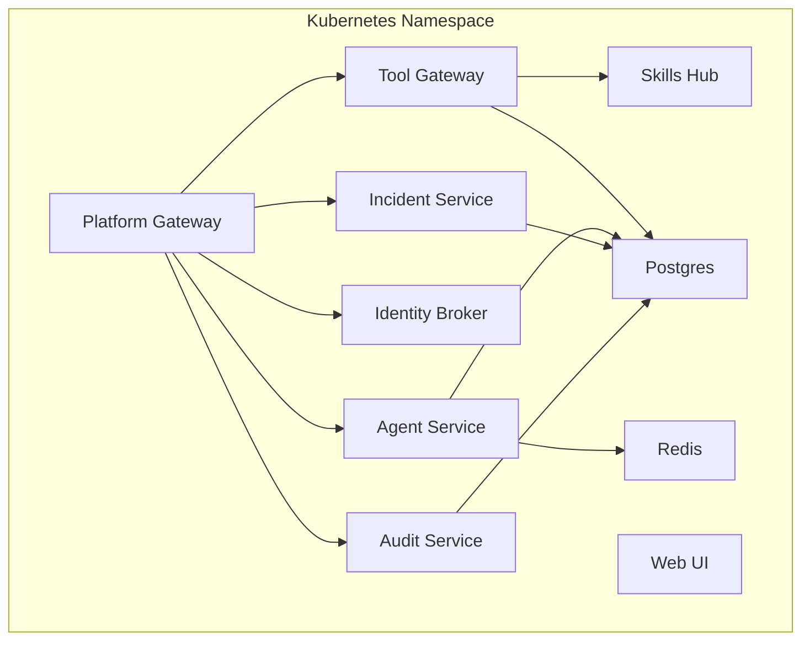
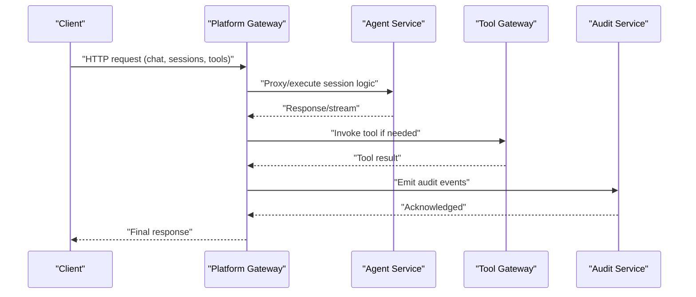
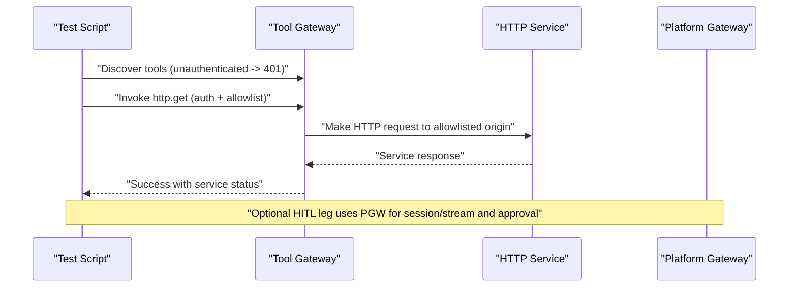
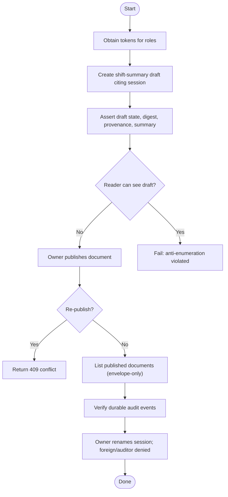
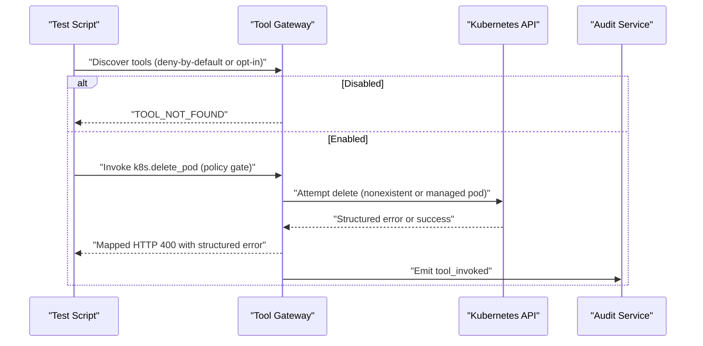
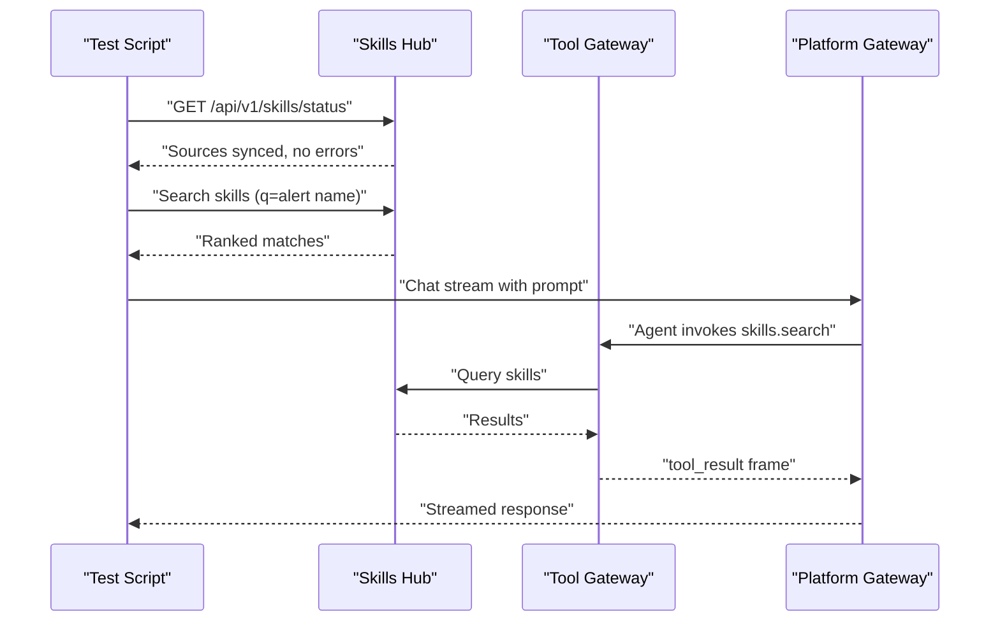
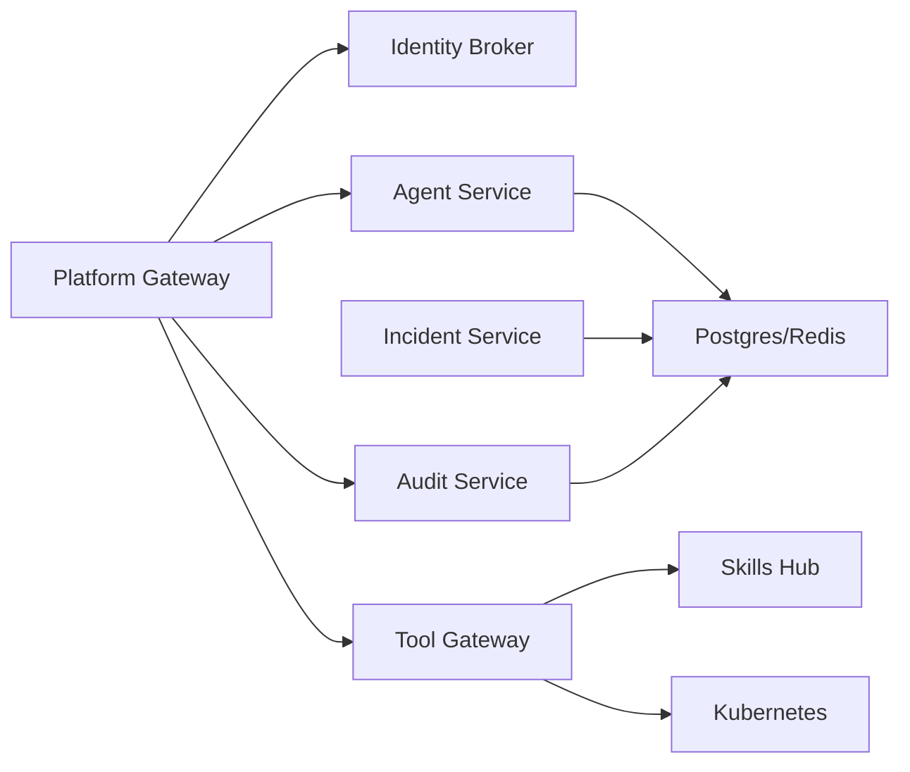

# Deployment Verification

<cite>
**Referenced Files in This Document**
- [README.md](file://README.md)
- [http-check-demo.sh](file://shared/platform-ops/e2e/http-check-demo.sh)
- [documents-demo.sh](file://shared/platform-ops/e2e/documents-demo.sh)
- [incident-demo.sh](file://shared/platform-ops/e2e/incident-demo.sh)
- [mutating-demo.sh](file://shared/platform-ops/e2e/mutating-demo.sh)
- [skills-demo.sh](file://shared/platform-ops/e2e/skills-demo.sh)
- [SPEC-061 spec](file://docs/specs/SPEC-061-retire-browser-check-target/spec.md)
- [platform-gateway health routes](file://products/platform-gateway/src/platform_gateway/api/routes/health.py)
- [tool-gateway health routes](file://products/tool-gateway/src/tool_gateway/api/routes/health.py)
- [execution-runtime health routes](file://products/execution-runtime/src/execution_runtime/api/routes/health.py)
- [agent-service deployment](file://shared/platform-ops/gitops/dev-k8s/base/agent-platform/agent-service-deployment.yaml)
- [platform-gateway deployment](file://shared/platform-ops/gitops/dev-k8s/base/platform-gateway/platform-gateway-deployment.yaml)
- [tool-gateway deployment](file://shared/platform-ops/gitops/dev-k8s/base/tool-gateway/tool-gateway-deployment.yaml)
- [audit-service deployment](file://shared/platform-ops/gitops/dev-k8s/base/audit-service/audit-service-deployment.yaml)
- [incident-service deployment](file://shared/platform-ops/gitops/dev-k8s/base/incident-service/incident-service-deployment.yaml)
- [identity-service service](file://shared/platform-ops/gitops/dev-k8s/base/identity-broker/identity-service-service.yaml)
- [web-ui service](file://shared/platform-ops/gitops/dev-k8s/base/operator-portal/web-ui-service.yaml)
- [redis service](file://shared/platform-ops/gitops/dev-k8s/base/infra/redis-service.yaml)
- [Debug Services runbook](file://shared/platform-ops/skills/platform-runbooks/guides/DebugServices.md)
</cite>

## Update Summary
**Changes Made**
- Removed references to deleted `browser-check-demo.sh` script
- Updated Browser Checks Flow section to reflect current testing procedures using HTTP checks instead
- Updated End-to-End Test Suite Overview to reflect current available e2e scripts
- Added reference to SPEC-061 retirement specification
- Updated browser-related testing guidance to use HTTP service checks

## Table of Contents
1. [Introduction](#introduction)
2. [Project Structure](#project-structure)
3. [Core Components](#core-components)
4. [Architecture Overview](#architecture-overview)
5. [Detailed Component Analysis](#detailed-component-analysis)
6. [Dependency Analysis](#dependency-analysis)
7. [Performance Considerations](#performance-considerations)
8. [Troubleshooting Guide](#troubleshooting-guide)
9. [Conclusion](#conclusion)
10. [Appendices](#appendices)

## Introduction
This document explains how to verify a successful deployment of the Luban AIOPS platform on Kubernetes. It covers:
- Health check endpoints for each service and how to validate them with kubectl.
- Expected pod states and readiness signals.
- How to run the end-to-end test suite under shared/platform-ops/e2e to validate core platform functionality, including HTTP service checks, documents operations, incidents, mutating operations, and skills workflows.
- How to interpret results, troubleshoot common issues, and validate service connectivity.
- Monitoring setup via Prometheus annotations and log aggregation using the durable audit trail.
- Procedures for rolling back deployments, scaling components, and performing maintenance while preserving stability.

## Project Structure
The platform is composed of product services deployed into a Kubernetes namespace (default dev-luban-aiops). Each service exposes HTTP APIs and exposes /metrics for Prometheus scraping. Health probes are configured for critical services to ensure readiness and liveness.

**Diagram sources**
- [platform-gateway deployment](file://shared/platform-ops/gitops/dev-k8s/base/platform-gateway/platform-gateway-deployment.yaml:1-49)
- [tool-gateway deployment](file://shared/platform-ops/gitops/dev-k8s/base/tool-gateway/tool-gateway-deployment.yaml:1-49)
- [agent-service deployment](file://shared/platform-ops/gitops/dev-k8s/base/agent-platform/agent-service-deployment.yaml:1-69)
- [identity-service service](file://shared/platform-ops/gitops/dev-k8s/base/identity-broker/identity-service-service.yaml:1-11)
- [audit-service deployment](file://shared/platform-ops/gitops/dev-k8s/base/audit-service/audit-service-deployment.yaml:1-57)
- [incident-service deployment](file://shared/platform-ops/gitops/dev-k8s/base/incident-service/incident-service-deployment.yaml:1-57)
- [redis service](file://shared/platform-ops/gitops/dev-k8s/base/infra/redis-service.yaml:1-11)

**Section sources**
- [README.md:15-55](file://README.md#L15-L55)

## Core Components
- Platform Gateway: portal-facing edge that handles token verification, policy enforcement, chat/session proxying, and token delegation. Exposes /health/live and /health/ready.
- Tool Gateway: normalized tool and connector access surface. Exposes /health/live and /health/ready.
- Agent Service: agent runtime, orchestration, session handling, streaming. Exposed as a service; health endpoints follow the same pattern across services.
- Identity Broker: SSO, identity federation, group normalization, and identity propagation.
- Audit Service: durable audit trail ingestion and query API. Exposes /health/live and /health/ready.
- Incident Service: incident intake, triage, collaboration dispatch. Exposes /health/live and /health/ready.
- Skills Hub: skill ingestion, validation, indexing, retrieval.
- Web UI: operator portal frontend.

Health endpoints are unauthenticated and readiness-first. Prometheus metrics are exposed at /metrics on port 8000 for all Python services.

**Section sources**
- [platform-gateway health routes](file://products/platform-gateway/src/platform_gateway/api/routes/health.py:1-16)
- [tool-gateway health routes](file://products/tool-gateway/src/tool_gateway/api/routes/health.py:1-16)
- [execution-runtime health routes](file://products/execution-runtime/src/execution_runtime/api/routes/health.py:1-26)
- [agent-service deployment](file://shared/platform-ops/gitops/dev-k8s/base/agent-platform/agent-service-deployment.yaml:1-69)
- [platform-gateway deployment](file://shared/platform-ops/gitops/dev-k8s/base/platform-gateway/platform-gateway-deployment.yaml:1-49)
- [tool-gateway deployment](file://shared/platform-ops/gitops/dev-k8s/base/tool-gateway/tool-gateway-deployment.yaml:1-49)
- [audit-service deployment](file://shared/platform-ops/gitops/dev-k8s/base/audit-service/audit-service-deployment.yaml:1-57)
- [incident-service deployment](file://shared/platform-ops/gitops/dev-k8s/base/incident-service/incident-service-deployment.yaml:1-57)

## Architecture Overview
The typical request flow for user or automation interactions goes through the Platform Gateway, which delegates to internal services as needed. Tool calls go through Tool Gateway, which may invoke connectors (e.g., Kubernetes, HTTP services, external systems). The Audit Service records durable events from multiple producers.

**Diagram sources**
- [platform-gateway health routes](file://products/platform-gateway/src/platform_gateway/api/routes/health.py:1-16)
- [tool-gateway health routes](file://products/tool-gateway/src/tool_gateway/api/routes/health.py:1-16)

## Detailed Component Analysis

### Health Checks and Readiness Validation
Each service exposes standard health endpoints:
- /health/live: process-level liveness.
- /health/ready: dependency-aware readiness (e.g., store backend status, configuration presence).

Validation steps:
- Check pod readiness and liveness probes by inspecting deployment probe paths and ports.
- Use kubectl exec to call /health/live and /health/ready inside service pods.
- Confirm /metrics is reachable for Prometheus scraping.

Example commands (run from a machine with kubectl access to the cluster):
- List pods and confirm Running/Ready:
  - kubectl get pods -n dev-luban-aiops
- Call readiness endpoint inside a pod:
  - kubectl exec -n dev-luban-aiops deployment/<service> -- curl -fsS http://localhost:8000/health/ready
- Call liveness endpoint inside a pod:
  - kubectl exec -n dev-luban-aiops deployment/<service> -- curl -fsS http://localhost:8000/health/live
- Verify metrics endpoint:
  - kubectl exec -n dev-luban-aiops deployment/<service> -- curl -fsS http://localhost:8000/metrics

Expected outcomes:
- /health/ready returns an ok status with optional backend details (for execution-runtime, includes store backend and configuration flags).
- /health/live returns a simple ok status.
- /metrics returns Prometheus-formatted metrics.

**Section sources**
- [platform-gateway health routes](file://products/platform-gateway/src/platform_gateway/api/routes/health.py:1-16)
- [tool-gateway health routes](file://products/tool-gateway/src/tool_gateway/api/routes/health.py:1-16)
- [execution-runtime health routes](file://products/execution-runtime/src/execution_runtime/api/routes/health.py:1-26)
- [audit-service deployment](file://shared/platform-ops/gitops/dev-k8s/base/audit-service/audit-service-deployment.yaml:42-57)
- [incident-service deployment](file://shared/platform-ops/gitops/dev-k8s/base/incident-service/incident-service-deployment.yaml:42-57)

### End-to-End Test Suite Overview
The e2e scripts under shared/platform-ops/e2e provide deterministic smoke tests after deployment. They assert authentication, authorization, feature toggles, and functional flows across the platform.

Key scripts and what they validate:
- http-check-demo.sh: HTTP service-check tools discovery, origin allowlist, read/write tier separation, and optional HITL approval flow.
- documents-demo.sh: Operations document repository lifecycle (draft/publish), role-based access, summary/digest assertions, and durable audit events.
- incident-demo.sh: Alertmanager webhook intake, dedupe/resolution, visibility via query API, operator-initiated triage, and audit event dispatch.
- mutating-demo.sh: Bounded mutating capability (k8s.delete_pod) with deny-by-default vs opt-in, policy gates, RBAC checks, and optional HITL approval flow with signed execution receipts.
- skills-demo.sh: Skills hub status, search ranking, and agent invocation of skills.search during chat.

**Updated**: The browser-check-demo.sh script was removed as part of SPEC-061 retirement. Browser functionality is now validated through the HTTP service checks and the acme-admin sample application suite.

How to run:
- Ensure kubectl context points at the dev cluster.
- Port-forward required services per script prerequisites (identity broker and platform gateway when needed).
- Execute scripts directly; they use environment variables to configure URLs, users, and optional legs.

Interpretation:
- Scripts exit non-zero on failure and print step-by-step results.
- Success indicates the corresponding feature set is functioning end-to-end in the current deployment posture.

**Section sources**
- [http-check-demo.sh:1-354](file://shared/platform-ops/e2e/http-check-demo.sh#L1-L354)
- [documents-demo.sh:1-235](file://shared/platform-ops/e2e/documents-demo.sh#L1-L235)
- [incident-demo.sh:1-195](file://shared/platform-ops/e2e/incident-demo.sh#L1-L195)
- [mutating-demo.sh:1-512](file://shared/platform-ops/e2e/mutating-demo.sh#L1-L512)
- [skills-demo.sh:1-125](file://shared/platform-ops/e2e/skills-demo.sh#L1-L125)
- [SPEC-061 spec:159-175](file://docs/specs/SPEC-061-retire-browser-check-target/spec.md#L159-L175)

### HTTP Service Checks Flow

**Diagram sources**
- [http-check-demo.sh:86-248](file://shared/platform-ops/e2e/http-check-demo.sh#L86-L248)

**Section sources**
- [http-check-demo.sh:1-354](file://shared/platform-ops/e2e/http-check-demo.sh#L1-L354)

### Documents Operations Flow

**Diagram sources**
- [documents-demo.sh:88-235](file://shared/platform-ops/e2e/documents-demo.sh#L88-L235)

**Section sources**
- [documents-demo.sh:1-235](file://shared/platform-ops/e2e/documents-demo.sh#L1-L235)

### Mutating Tools Flow

**Diagram sources**
- [mutating-demo.sh:100-244](file://shared/platform-ops/e2e/mutating-demo.sh#L100-L244)

**Section sources**
- [mutating-demo.sh:1-512](file://shared/platform-ops/e2e/mutating-demo.sh#L1-L512)

### Skills Workflow Flow

**Diagram sources**
- [skills-demo.sh:40-125](file://shared/platform-ops/e2e/skills-demo.sh#L40-L125)

**Section sources**
- [skills-demo.sh:1-125](file://shared/platform-ops/e2e/skills-demo.sh#L1-L125)

## Dependency Analysis
Service dependencies and integration points:
- Platform Gateway depends on Identity Broker for token issuance/validation and proxies to Agent Service, Tool Gateway, and Audit Service.
- Tool Gateway depends on Skill sources via Skills Hub and may interact with Kubernetes and other connectors.
- Agent Service depends on storage backends (Redis/Postgres) and Execution Runtime for bounded actions.
- Audit Service persists events and serves queries gated by credentials.
- Incident Service integrates with Alertmanager webhooks and dispatches to connectors (including audit).

**Diagram sources**
- [platform-gateway deployment](file://shared/platform-ops/gitops/dev-k8s/base/platform-gateway/platform-gateway-deployment.yaml:1-49)
- [tool-gateway deployment](file://shared/platform-ops/gitops/dev-k8s/base/tool-gateway/tool-gateway-deployment.yaml:1-49)
- [agent-service deployment](file://shared/platform-ops/gitops/dev-k8s/base/agent-platform/agent-service-deployment.yaml:1-69)
- [incident-service deployment](file://shared/platform-ops/gitops/dev-k8s/base/incident-service/incident-service-deployment.yaml:1-57)
- [audit-service deployment](file://shared/platform-ops/gitops/dev-k8s/base/audit-service/audit-service-deployment.yaml:1-57)

**Section sources**
- [README.md:24-46](file://README.md#L24-L46)

## Performance Considerations
- All services expose /metrics on port 8000 with Prometheus scrape annotations enabled in their deployments.
- Health probes are tuned to avoid unnecessary restarts; readiness probes depend on backend availability.
- Avoid enabling mutating tools unless necessary; default posture is deny-by-default to reduce risk and load.
- Keep e2e scripts lightweight; they perform targeted assertions rather than full load tests.

## Troubleshooting Guide
Common issues and remediation:
- Service unreachable:
  - Verify Service exists with correct spec and selector.
  - Check endpoints to ensure selector matches ready pods.
  - Validate DNS resolution from within the cluster.
  - Test direct reachability to ClusterIP or pod IP.
- Pod not Ready:
  - Inspect pod events for scheduling/image pull/probe failures.
  - Review container states (waiting reasons like CrashLoopBackOff, ImagePullBackOff).
  - Check readiness probe configuration against application endpoints.
  - Review recent logs including previous containers.
- Authentication/Authorization failures:
  - Ensure identity broker port-forward is active and tokens are issued correctly.
  - Confirm delegated tokens for tool-gateway audience are obtained via exchange.
  - Validate role grants (e.g., tools:mutate for mutating tools).
- Feature toggles:
  - GATEWAY_HTTP_ENABLED controls HTTP tool exposure.
  - GATEWAY_MUTATING_TOOLS_ENABLED controls write-tier tool exposure.
  - AGENT_HITL_CONFIRM_TIMEOUT must be non-zero for HITL bridging.

Useful commands:
- Debug service reachability:
  - kubectl get svc <service> -n dev-luban-aiops -o yaml
  - kubectl get endpoints <service> -n dev-luban-aiops
  - kubectl exec -it <probe-pod> -n dev-luban-aiops -- nslookup <service>.dev-luban-aiops.svc.cluster.local
  - kubectl exec -it <probe-pod> -n dev-luban-aiops -- wget -qO- http://<pod-ip>:<targetPort>/healthz
- Inspect readiness/liveness:
  - kubectl describe pod <pod> -n dev-luban-aiops
  - kubectl logs <pod> -n dev-luban-aiops --previous

**Section sources**
- [Debug Services runbook](file://shared/platform-ops/skills/platform-runbooks/guides/DebugServices.md:1-60)
- [mutating-demo.sh:246-252](file://shared/platform-ops/e2e/mutating-demo.sh#L246-L252)

## Conclusion
To verify a successful deployment:
- Confirm all pods are Running and Ready, and health endpoints respond appropriately.
- Run the e2e scripts to validate core platform functionality across HTTP service checks, documents, incidents, mutating operations, and skills.
- Use Prometheus metrics and the durable audit trail for monitoring and observability.
- Follow troubleshooting steps for networking, readiness, and authorization issues.
- Apply rollback, scaling, and maintenance procedures carefully to maintain platform stability.

## Appendices

### Rolling Back Deployments
- Roll back a deployment:
  - kubectl rollout undo deployment/<deployment-name> -n dev-luban-aiops
- Check rollout status:
  - kubectl rollout status deployment/<deployment-name> -n dev-luban-aiops
- Revert to a previous revision:
  - kubectl rollout undo deployment/<deployment-name> --to-revision=<revision> -n dev-luban-aiops

### Scaling Components
- Scale a deployment:
  - kubectl scale deployment/<deployment-name> -n dev-luban-aiops --replicas=<N>
- Verify scaling:
  - kubectl get pods -n dev-luban-aiops -l app=<app-label>
  - kubectl top pods -n dev-luban-aiops

### Maintenance Operations
- Restart a service:
  - kubectl rollout restart deployment/<deployment-name> -n dev-luban-aiops
- Drain a node safely:
  - kubectl drain <node> --ignore-daemonsets --delete-emptydir-data
- Update secrets/configmaps:
  - kubectl apply -f <secret-or-configmap-file> -n dev-luban-aiops
  - kubectl rollout restart deployment/<affected-deployment> -n dev-luban-aiops