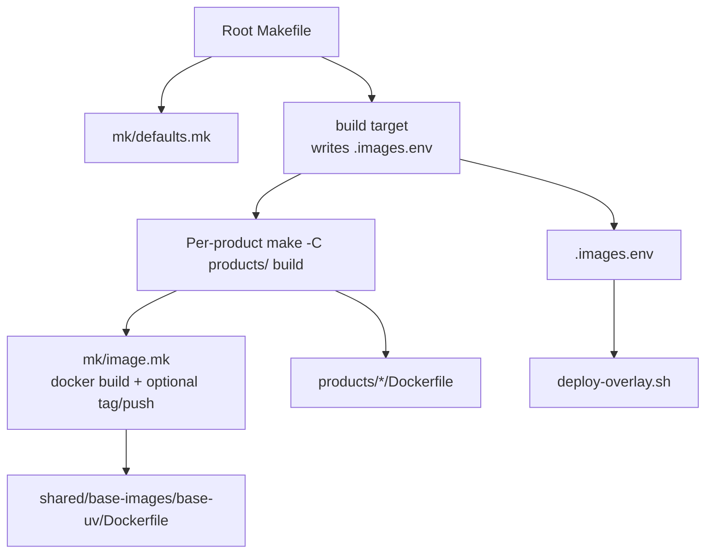
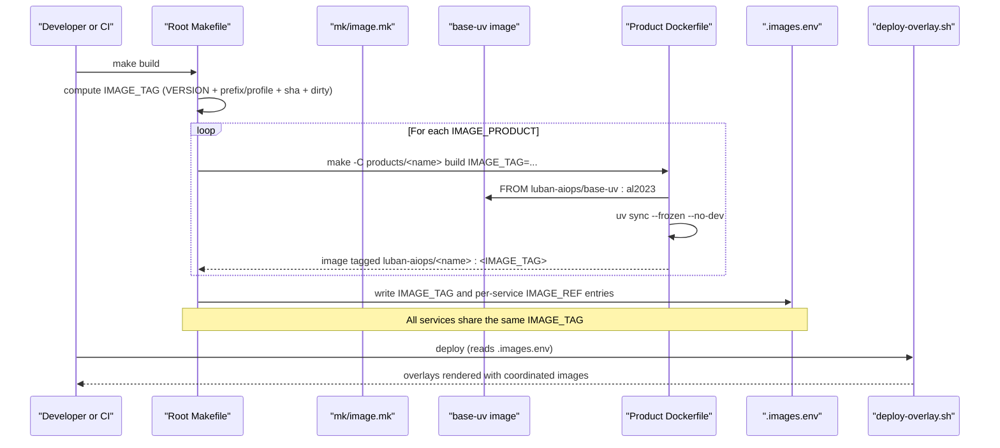
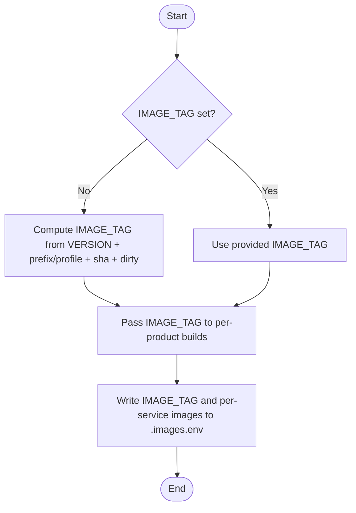
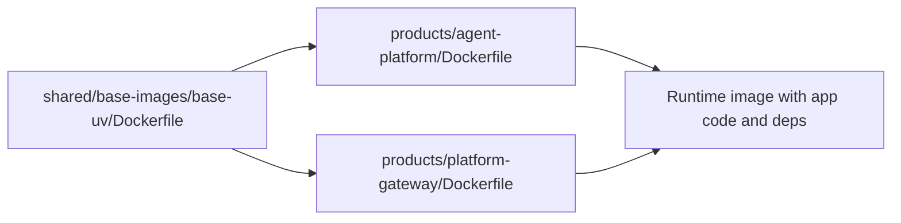
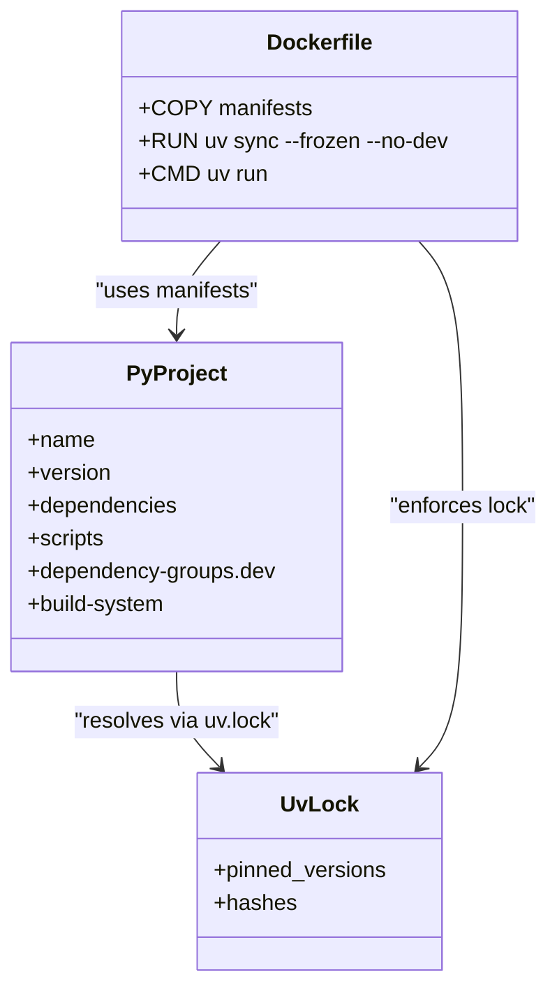
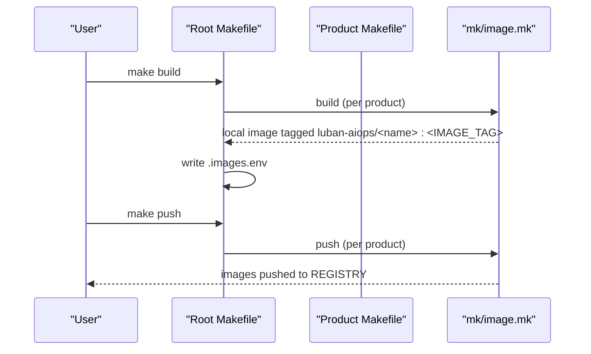
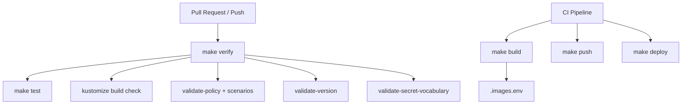
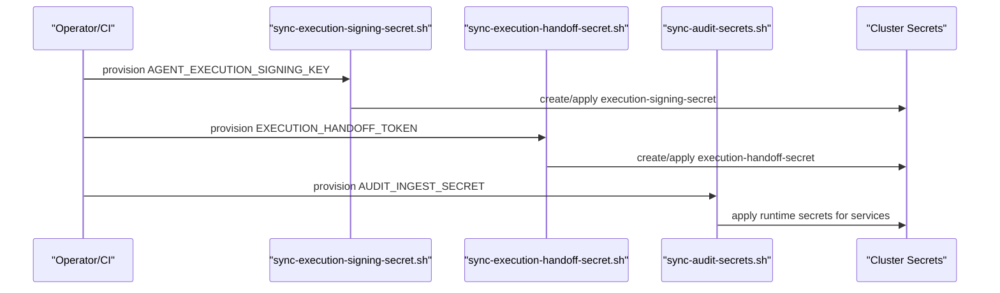
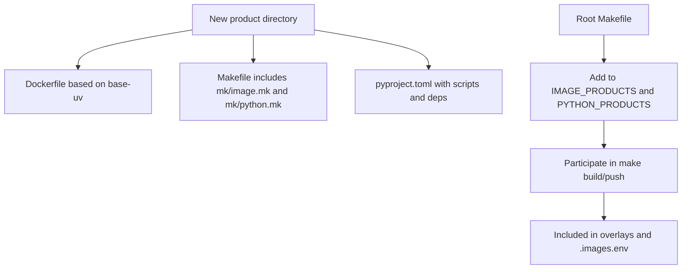
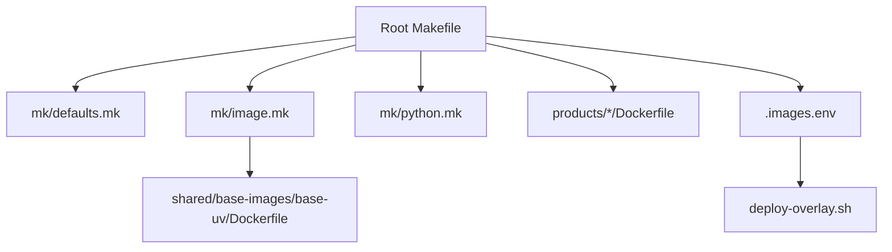

# Image Management

<cite>
**Referenced Files in This Document**
- [Makefile](file://Makefile)
- [mk/defaults.mk](file://mk/defaults.mk)
- [mk/image.mk](file://mk/image.mk)
- [mk/python.mk](file://mk/python.mk)
- [shared/base-images/base-uv/Dockerfile](file://shared/base-images/base-uv/Dockerfile)
- [products/platform-gateway/Dockerfile](file://products/platform-gateway/Dockerfile)
- [products/platform-gateway/Makefile](file://products/platform-gateway/Makefile)
- [products/agent-platform/Dockerfile](file://products/agent-platform/Dockerfile)
- [products/agent-platform/pyproject.toml](file://products/agent-platform/pyproject.toml)
- [shared/platform-ops/gitops/deploy-overlay.sh](file://shared/platform-ops/gitops/deploy-overlay.sh)
- [shared/platform-ops/gitops/sync-execution-signing-secret.sh](file://shared/platform-ops/gitops/sync-execution-signing-secret.sh)
- [shared/platform-ops/gitops/sync-execution-handoff-secret.sh](file://shared/platform-ops/gitops/sync-execution-handoff-secret.sh)
- [shared/platform-ops/gitops/sync-audit-secrets.sh](file://shared/platform-ops/gitops/sync-audit-secrets.sh)
</cite>

## Table of Contents
1. [Introduction](#introduction)
2. [Project Structure](#project-structure)
3. [Core Components](#core-components)
4. [Architecture Overview](#architecture-overview)
5. [Detailed Component Analysis](#detailed-component-analysis)
6. [Dependency Analysis](#dependency-analysis)
7. [Performance Considerations](#performance-considerations)
8. [Troubleshooting Guide](#troubleshooting-guide)
9. [Conclusion](#conclusion)
10. [Appendices](#appendices)

## Introduction
This document explains the multi-stage Docker image building system used across all platform services. It covers how coordinated IMAGE_TAG generation ensures version consistency, how Python dependencies are managed with uv and pyproject.toml, the Makefile targets for building/tagging/pushing images, CI/CD integration points, secret management during builds and deployments, and guidance for adding new services and maintaining security best practices.

## Project Structure
The build system is composed of:
- A root Makefile that orchestrates coordinated builds and writes a shared state file consumed by deployment.
- Shared Makefile fragments under mk/ that define defaults, image build/push/lint targets, and Python (uv) helpers.
- A shared base image built once and reused by every service to minimize duplication and improve cache efficiency.
- Per-product Dockerfiles that use the shared base image and install only runtime dependencies via uv.
- GitOps scripts that provision secrets into the cluster and drive overlay rendering using the coordinated image tag.

**Diagram sources**
- [Makefile:96-124](file://Makefile#L96-L124)
- [mk/image.mk:38-48](file://mk/image.mk#L38-L48)
- [shared/base-images/base-uv/Dockerfile:1-40](file://shared/base-images/base-uv/Dockerfile#L1-L40)
- [shared/platform-ops/gitops/deploy-overlay.sh:25-44](file://shared/platform-ops/gitops/deploy-overlay.sh#L25-L44)

**Section sources**
- [Makefile:14-17](file://Makefile#L14-L17)
- [Makefile:96-124](file://Makefile#L96-L124)
- [mk/defaults.mk:20-50](file://mk/defaults.mk#L20-L50)
- [mk/image.mk:1-58](file://mk/image.mk#L1-L58)
- [shared/base-images/base-uv/Dockerfile:1-40](file://shared/base-images/base-uv/Dockerfile#L1-L40)

## Core Components
- Coordinated IMAGE_TAG computation: The root Makefile computes a single IMAGE_TAG from VERSION, IMAGE_TAG_PREFIX, IMAGE_TAG_PROFILE, git short SHA, and dirty-state timestamp. This tag is passed to every product build so all images share one immutable identifier per commit.
- Shared base image: A minimal Amazon Linux 2023 image with a pinned uv and non-root user; all services inherit this to ensure consistent runtime behavior and smaller images.
- Per-product Dockerfiles: Copy only necessary files, run uv sync --frozen --no-dev to install runtime-only dependencies, and execute via uv run.
- Makefile fragments: Centralize image build/push/lint and Python test/sync targets to keep each product’s Makefile minimal.

Key responsibilities:
- Root Makefile: Compute IMAGE_TAG, build all images, write .images.env, optionally load into kind, push all images.
- mk/image.mk: Provide build/push/lint targets and default registry tagging logic.
- mk/defaults.mk: Define overridable defaults such as IMAGE_PLATFORM, BASE_UV_* versions, and tag prefixes/profiles.
- mk/python.mk: Provide sync/test targets using uv with frozen lockfiles.

**Section sources**
- [Makefile:48-64](file://Makefile#L48-L64)
- [Makefile:96-124](file://Makefile#L96-L124)
- [mk/image.mk:22-48](file://mk/image.mk#L22-L48)
- [mk/defaults.mk:20-50](file://mk/defaults.mk#L20-L50)
- [mk/python.mk:1-20](file://mk/python.mk#L1-L20)
- [products/platform-gateway/Dockerfile:1-13](file://products/platform-gateway/Dockerfile#L1-L13)
- [products/agent-platform/Dockerfile:1-13](file://products/agent-platform/Dockerfile#L1-L13)

## Architecture Overview
The coordinated build pipeline ensures that all microservices are built with the same IMAGE_TAG derived from repository state. The root Makefile drives the process, delegates to per-product builds, and persists the resulting tags in a state file consumed by deployment.

**Diagram sources**
- [Makefile:48-64](file://Makefile#L48-L64)
- [Makefile:96-124](file://Makefile#L96-L124)
- [mk/image.mk:38-48](file://mk/image.mk#L38-L48)
- [shared/base-images/base-uv/Dockerfile:1-40](file://shared/base-images/base-uv/Dockerfile#L1-L40)
- [shared/platform-ops/gitops/deploy-overlay.sh:25-44](file://shared/platform-ops/gitops/deploy-overlay.sh#L25-L44)

## Detailed Component Analysis

### Coordinated IMAGE_TAG Generation
- Computation: If IMAGE_TAG is not provided, it is computed from PLATFORM_VERSION (from VERSION), IMAGE_TAG_PREFIX, optional IMAGE_TAG_PROFILE, git short SHA, and a dirty timestamp when uncommitted changes exist.
- Propagation: The computed IMAGE_TAG is passed to every product build, ensuring all images share the same tag.
- Persistence: After building, the root Makefile writes IMAGE_TAG and per-service image references into .images.env, which deployment scripts consume.

**Diagram sources**
- [Makefile:48-64](file://Makefile#L48-L64)
- [Makefile:96-109](file://Makefile#L96-L109)

**Section sources**
- [Makefile:48-64](file://Makefile#L48-L64)
- [Makefile:96-109](file://Makefile#L96-L109)

### Multi-Stage Build Process and Image Size Optimization
- Base image strategy: A shared base image installs a pinned uv and sets environment variables for deterministic Python resolution and caching. It runs as a non-root user and cleans package manager caches.
- Service images: Each product Dockerfile copies only essential files (.python-version, pyproject.toml, uv.lock, README, src), then runs uv sync --frozen --no-dev to install only runtime dependencies. This avoids dev dependencies and reduces image size.
- Caching: By copying dependency manifests first and running uv sync before copying source code, Docker layers can be cached effectively when dependencies do not change.

**Diagram sources**
- [shared/base-images/base-uv/Dockerfile:1-40](file://shared/base-images/base-uv/Dockerfile#L1-L40)
- [products/agent-platform/Dockerfile:1-13](file://products/agent-platform/Dockerfile#L1-L13)
- [products/platform-gateway/Dockerfile:1-13](file://products/platform-gateway/Dockerfile#L1-L13)

**Section sources**
- [shared/base-images/base-uv/Dockerfile:1-40](file://shared/base-images/base-uv/Dockerfile#L1-L40)
- [products/agent-platform/Dockerfile:1-13](file://products/agent-platform/Dockerfile#L1-L13)
- [products/platform-gateway/Dockerfile:1-13](file://products/platform-gateway/Dockerfile#L1-L13)

### Python Dependency Management with uv and pyproject.toml
- Lockfiles: Each product uses uv.lock to pin exact dependency versions. Sync targets use --frozen to enforce lockfile fidelity.
- Runtime vs dev: Production images install only runtime dependencies (--no-dev). Development and tests use separate groups and run via uv run pytest.
- Entrypoints: Services expose CLI entrypoints defined in pyproject.toml and executed via uv run.

**Diagram sources**
- [products/agent-platform/pyproject.toml:1-38](file://products/agent-platform/pyproject.toml#L1-L38)
- [products/platform-gateway/Dockerfile:1-13](file://products/platform-gateway/Dockerfile#L1-L13)
- [mk/python.mk:11-19](file://mk/python.mk#L11-L19)

**Section sources**
- [products/agent-platform/pyproject.toml:1-38](file://products/agent-platform/pyproject.toml#L1-L38)
- [mk/python.mk:11-19](file://mk/python.mk#L11-L19)
- [products/platform-gateway/Dockerfile:1-13](file://products/platform-gateway/Dockerfile#L1-L13)

### Makefile Targets for Building, Tagging, and Pushing Images
- Root build: Builds base image, iterates IMAGE_PRODUCTS, passes coordinated IMAGE_TAG, writes .images.env, and optionally loads images into a kind cluster.
- Per-product build: Uses mk/image.mk to docker build with IMAGE_PLATFORM and tag locally; if REGISTRY is set, re-tags to registry path.
- Push: Re-tags to registry path if REGISTRY is set and pushes the image.
- Lint: Runs hadolint on Dockerfiles, with a docker-run fallback.

**Diagram sources**
- [Makefile:96-128](file://Makefile#L96-L128)
- [mk/image.mk:38-57](file://mk/image.mk#L38-L57)

**Section sources**
- [Makefile:96-128](file://Makefile#L96-L128)
- [mk/image.mk:38-57](file://mk/image.mk#L38-L57)

### CI/CD Integration Points
- Verification gate: The verify target runs tests, overlay checks, policy validation, scenario validation, version validation, and secret vocabulary validation. This is suitable for pre-commit/pre-push and CI pipelines.
- Overlay rendering: The overlays target validates Kustomize overlays used for deployment.
- Deployment: The deploy target wraps the overlay deploy script, which reads .images.env to render manifests with coordinated images.

**Diagram sources**
- [Makefile:171-183](file://Makefile#L171-L183)
- [shared/platform-ops/gitops/deploy-overlay.sh:25-44](file://shared/platform-ops/gitops/deploy-overlay.sh#L25-L44)

**Section sources**
- [Makefile:171-183](file://Makefile#L171-L183)
- [shared/platform-ops/gitops/deploy-overlay.sh:25-44](file://shared/platform-ops/gitops/deploy-overlay.sh#L25-L44)

### Secret Management During Builds and Deployments
- Execution signing secret: Provisioned into the cluster namespace; agent-service uses it to sign execution envelopes. The script reuses an existing key if present or generates a new one, applies the secret, and restarts agent-service.
- Execution handoff secret: A static token shared between agent-service and execution-runtime for authenticated internal handoff. The script provisions both sides and restarts deployments.
- Audit client secrets: Synchronized into multiple services’ runtime secrets to enable audit ingestion.

**Diagram sources**
- [shared/platform-ops/gitops/sync-execution-signing-secret.sh:37-71](file://shared/platform-ops/gitops/sync-execution-signing-secret.sh#L37-L71)
- [shared/platform-ops/gitops/sync-execution-handoff-secret.sh:38-75](file://shared/platform-ops/gitops/sync-execution-handoff-secret.sh#L38-L75)
- [shared/platform-ops/gitops/sync-audit-secrets.sh:98-116](file://shared/platform-ops/gitops/sync-audit-secrets.sh#L98-L116)

**Section sources**
- [shared/platform-ops/gitops/sync-execution-signing-secret.sh:37-71](file://shared/platform-ops/gitops/sync-execution-signing-secret.sh#L37-L71)
- [shared/platform-ops/gitops/sync-execution-handoff-secret.sh:38-75](file://shared/platform-ops/gitops/sync-execution-handoff-secret.sh#L38-L75)
- [shared/platform-ops/gitops/sync-audit-secrets.sh:98-116](file://shared/platform-ops/gitops/sync-audit-secrets.sh#L98-L116)

### Adding New Services to the Build System
To add a new Python-based service:
- Create a product directory under products/<name> with:
  - Dockerfile based on luban-aiops/base-uv:al2023, copying manifests and src, running uv sync --frozen --no-dev, and CMD uv run <entrypoint>.
  - Makefile setting IMAGE_NAME and including mk/image.mk and mk/python.mk.
  - pyproject.toml defining name, version, dependencies, scripts, and dependency-groups.dev.
- Add the product to IMAGE_PRODUCTS and PYTHON_PRODUCTS in the root Makefile so it participates in coordinated builds and verification.
- Ensure the service has a corresponding deployment manifest in the GitOps overlay and any required secrets are provisioned by existing or new sync scripts.

**Diagram sources**
- [products/platform-gateway/Makefile:1-10](file://products/platform-gateway/Makefile#L1-L10)
- [Makefile:14-17](file://Makefile#L14-L17)
- [Makefile:96-109](file://Makefile#L96-L109)

**Section sources**
- [products/platform-gateway/Makefile:1-10](file://products/platform-gateway/Makefile#L1-L10)
- [Makefile:14-17](file://Makefile#L14-L17)
- [Makefile:96-109](file://Makefile#L96-L109)

### Security Best Practices for Images and Builds
- Non-root execution: Base image creates and switches to a non-root user; services inherit this posture.
- Minimal attack surface: Only runtime dependencies installed in production images; dev dependencies excluded via --no-dev.
- Deterministic builds: uv.lock enforces exact dependency versions; base image pins uv and Python versions.
- Secret handling: Secrets are provisioned into Kubernetes secrets and never baked into images; scripts reuse existing values where possible to avoid accidental rotation.
- Linting: Dockerfiles linted via hadolint to catch misconfigurations early.

**Section sources**
- [shared/base-images/base-uv/Dockerfile:19-39](file://shared/base-images/base-uv/Dockerfile#L19-L39)
- [products/platform-gateway/Dockerfile:5-8](file://products/platform-gateway/Dockerfile#L5-L8)
- [mk/image.mk:50-57](file://mk/image.mk#L50-L57)
- [shared/platform-ops/gitops/sync-execution-signing-secret.sh:37-71](file://shared/platform-ops/gitops/sync-execution-signing-secret.sh#L37-L71)
- [shared/platform-ops/gitops/sync-execution-handoff-secret.sh:38-75](file://shared/platform-ops/gitops/sync-execution-handoff-secret.sh#L38-L75)

## Dependency Analysis
The build system exhibits clear separation of concerns:
- Root Makefile owns orchestration and state persistence.
- mk/ fragments provide reusable targets and defaults.
- Per-product Dockerfiles encapsulate service-specific packaging.
- GitOps scripts manage secrets and overlay rendering using coordinated images.

**Diagram sources**
- [Makefile:96-124](file://Makefile#L96-L124)
- [mk/defaults.mk:20-50](file://mk/defaults.mk#L20-L50)
- [mk/image.mk:38-48](file://mk/image.mk#L38-L48)
- [shared/platform-ops/gitops/deploy-overlay.sh:25-44](file://shared/platform-ops/gitops/deploy-overlay.sh#L25-L44)

**Section sources**
- [Makefile:96-124](file://Makefile#L96-L124)
- [mk/defaults.mk:20-50](file://mk/defaults.mk#L20-L50)
- [mk/image.mk:38-48](file://mk/image.mk#L38-L48)
- [shared/platform-ops/gitops/deploy-overlay.sh:25-44](file://shared/platform-ops/gitops/deploy-overlay.sh#L25-L44)

## Performance Considerations
- Cache layering: Copy dependency manifests first and run uv sync before copying source to maximize Docker layer caching.
- Frozen installs: Using uv sync --frozen ensures reproducible builds and avoids network variability.
- Base image reuse: A single shared base image reduces duplicate layers across services.
- Platform flags: IMAGE_PLATFORM allows cross-compilation for different architectures without rebuilding base images unnecessarily.
- Optional kind loading: AUTO_LOAD_KIND speeds local iteration by loading images directly into a kind cluster after build.

[No sources needed since this section provides general guidance]

## Troubleshooting Guide
Common issues and resolutions:
- Missing IMAGE_TAG: If deploy fails due to missing IMAGE_TAG, run make build first to generate .images.env or export IMAGE_TAG explicitly.
- Registry push failures: Ensure REGISTRY is set; the push target re-tags and pushes only when REGISTRY is configured.
- Hadolint errors: Install hadolint locally or rely on the docker-run fallback; fix Dockerfile issues reported by the linter.
- Secret provisioning failures: For execution signing or handoff, ensure the respective sync scripts have permissions to create/apply secrets and that existing secrets are readable; scripts will reuse existing values when present.
- Overlay rendering failures: Run make overlays to validate Kustomize overlays; fix configuration errors indicated by kustomize.

**Section sources**
- [shared/platform-ops/gitops/deploy-overlay.sh:25-44](file://shared/platform-ops/gitops/deploy-overlay.sh#L25-L44)
- [mk/image.mk:44-57](file://mk/image.mk#L44-L57)
- [shared/platform-ops/gitops/sync-execution-signing-secret.sh:37-71](file://shared/platform-ops/gitops/sync-execution-signing-secret.sh#L37-L71)
- [shared/platform-ops/gitops/sync-execution-handoff-secret.sh:38-75](file://shared/platform-ops/gitops/sync-execution-handoff-secret.sh#L38-L75)
- [Makefile:171-176](file://Makefile#L171-L176)

## Conclusion
The platform’s image management system centralizes version coordination through a single IMAGE_TAG, leverages a shared base image for consistency and efficiency, and uses uv with locked dependencies to ensure reproducible builds. Makefile targets standardize building, tagging, pushing, and linting, while GitOps scripts handle secret provisioning and overlay rendering. Following the guidance here enables secure, fast, and maintainable builds for new and existing services.

[No sources needed since this section summarizes without analyzing specific files]

## Appendices

### Quick Reference: Key Targets and Variables
- Root targets:
  - make build: Build base image, build all services with coordinated IMAGE_TAG, write .images.env, optionally load into kind.
  - make push: Push all services to REGISTRY when set.
  - make verify: Run tests, overlays, policy validations, version and secret vocabulary checks.
  - make overlays: Validate Kustomize overlays.
  - make deploy: Deploy using .images.env.
- Per-product targets:
  - make build: Build service image with IMAGE_PLATFORM and IMAGE_TAG.
  - make push: Push service image to REGISTRY when set.
  - make lint: Lint Dockerfile with hadolint.
  - make sync: Install/refresh dependencies using uv sync --frozen.
  - make test: Run tests with uv run pytest and disabled OTLP exporters.
- Important variables:
  - IMAGE_PLATFORM: Target architecture for builds.
  - IMAGE_TAG_PREFIX / IMAGE_TAG_PROFILE: Customize coordinated tag composition.
  - REGISTRY: Destination registry for re-tagging and pushing.
  - BASE_UV_IMAGE / BASE_UV_TAG / BASE_UV_UV_VERSION / BASE_UV_PYTHON_VERSION: Base image configuration.

**Section sources**
- [Makefile:96-183](file://Makefile#L96-L183)
- [mk/defaults.mk:20-50](file://mk/defaults.mk#L20-L50)
- [mk/image.mk:38-57](file://mk/image.mk#L38-L57)
- [mk/python.mk:11-19](file://mk/python.mk#L11-L19)