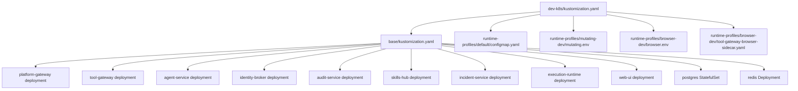
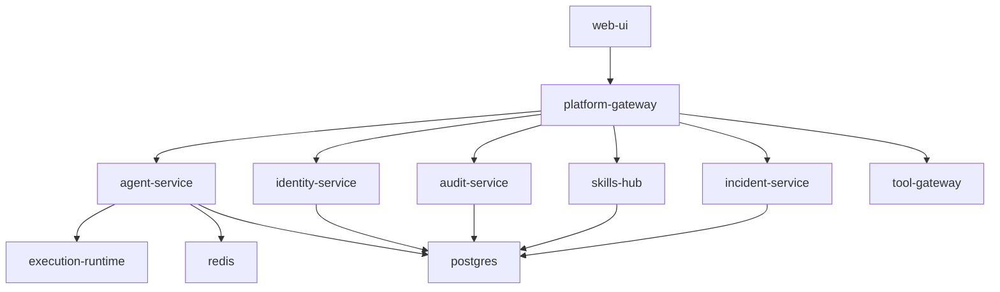
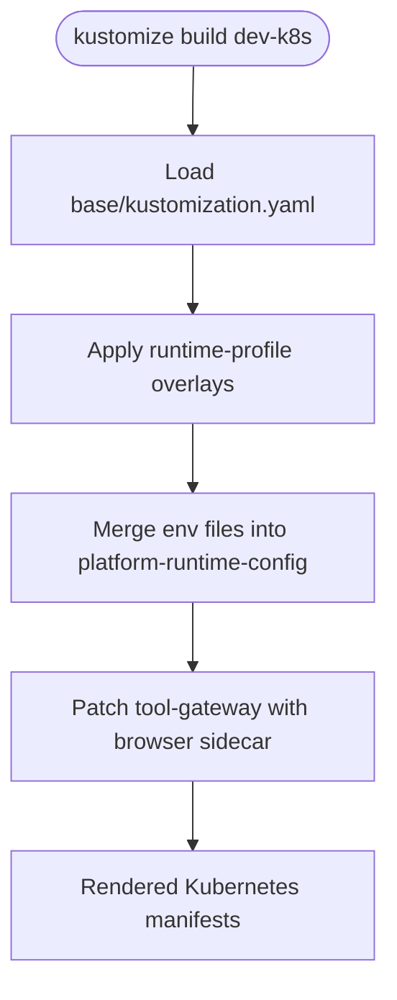
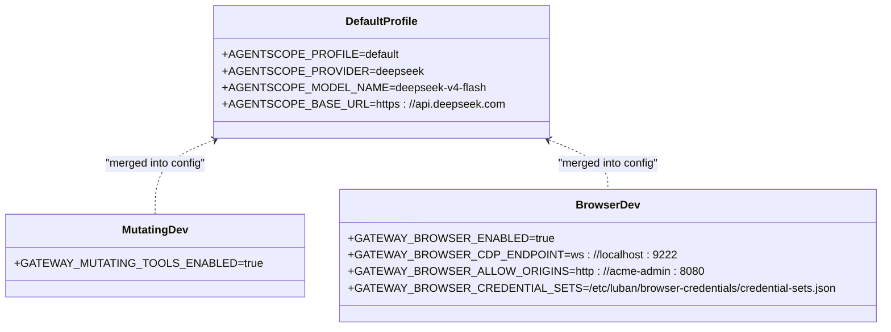
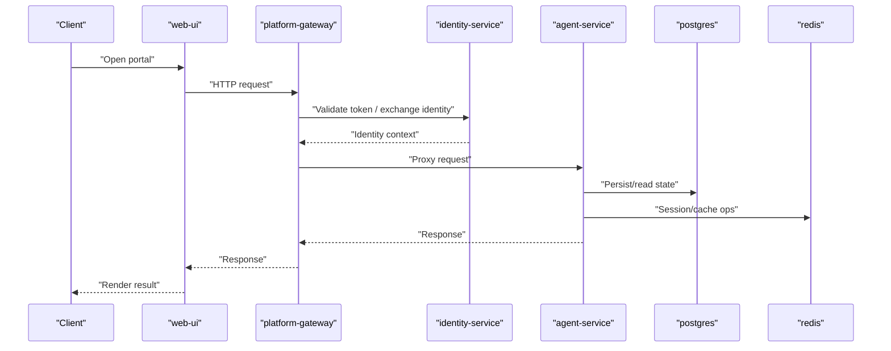
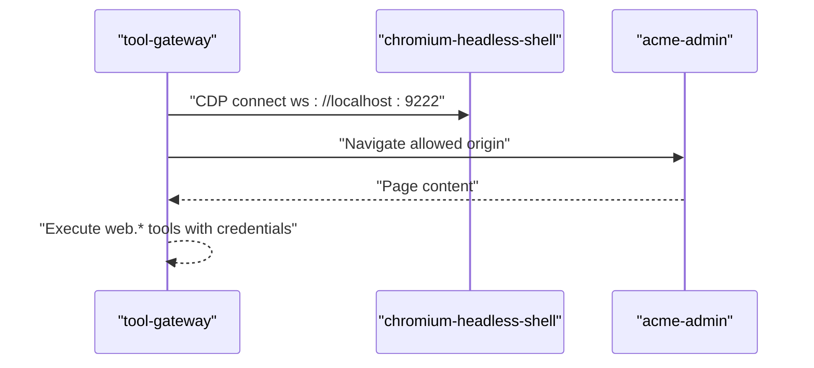
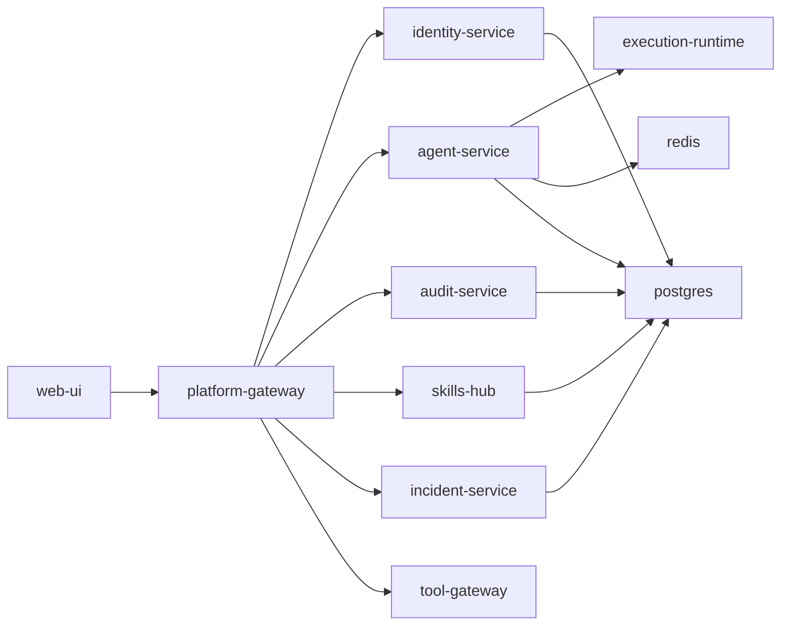

# Kubernetes Deployment

<cite>
**Referenced Files in This Document**
- [shared/platform-ops/gitops/dev-k8s/kustomization.yaml](file://shared/platform-ops/gitops/dev-k8s/kustomization.yaml)
- [shared/platform-ops/gitops/dev-k8s/base/kustomization.yaml](file://shared/platform-ops/gitops/dev-k8s/base/kustomization.yaml)
- [shared/platform-ops/gitops/dev-k8s/base/shared/runtime.env](file://shared/platform-ops/gitops/dev-k8s/base/shared/runtime.env)
- [shared/platform-ops/gitops/runtime-profiles/README.md](file://shared/platform-ops/gitops/runtime-profiles/README.md)
- [shared/platform-ops/gitops/runtime-profiles/default/configmap.yaml](file://shared/platform-ops/gitops/runtime-profiles/default/configmap.yaml)
- [shared/platform-ops/gitops/runtime-profiles/mutating-dev/mutating.env](file://shared/platform-ops/gitops/runtime-profiles/mutating-dev/mutating.env)
- [shared/platform-ops/gitops/runtime-profiles/browser-dev/browser.env](file://shared/platform-ops/gitops/runtime-profiles/browser-dev/browser.env)
- [shared/platform-ops/gitops/runtime-profiles/browser-dev/tool-gateway-browser-sidecar.yaml](file://shared/platform-ops/gitops/runtime-profiles/browser-dev/tool-gateway-browser-sidecar.yaml)
- [shared/platform-ops/gitops/dev-k8s/base/platform-gateway/platform-gateway-deployment.yaml](file://shared/platform-ops/gitops/dev-k8s/base/platform-gateway/platform-gateway-deployment.yaml)
- [shared/platform-ops/gitops/dev-k8s/base/tool-gateway/tool-gateway-deployment.yaml](file://shared/platform-ops/gitops/dev-k8s/base/tool-gateway/tool-gateway-deployment.yaml)
- [shared/platform-ops/gitops/dev-k8s/base/agent-platform/agent-service-deployment.yaml](file://shared/platform-ops/gitops/dev-k8s/base/agent-platform/agent-service-deployment.yaml)
- [shared/platform-ops/gitops/dev-k8s/base/infra/postgres-statefulset.yaml](file://shared/platform-ops/gitops/dev-k8s/base/infra/postgres-statefulset.yaml)
- [shared/platform-ops/gitops/dev-k8s/base/infra/redis-deployment.yaml](file://shared/platform-ops/gitops/dev-k8s/base/infra/redis-deployment.yaml)
- [shared/platform-ops/gitops/dev-k8s/base/operator-portal/web-ui-deployment.yaml](file://shared/platform-ops/gitops/dev-k8s/base/operator-portal/web-ui-deployment.yaml)
</cite>

## Update Summary
**Changes Made**
- Updated Browser Sidecar Integration section to reflect retirement of browser-check-target application
- Clarified that browser-dev profile now only configures posture without shipping a target app
- Updated references to point to acme-admin sample application as the sole allowed origin
- Enhanced troubleshooting guidance for browser automation scenarios

## Table of Contents
1. [Introduction](#introduction)
2. [Project Structure](#project-structure)
3. [Core Components](#core-components)
4. [Architecture Overview](#architecture-overview)
5. [Detailed Component Analysis](#detailed-component-analysis)
6. [Dependency Analysis](#dependency-analysis)
7. [Performance Considerations](#performance-considerations)
8. [Troubleshooting Guide](#troubleshooting-guide)
9. [Conclusion](#conclusion)

## Introduction
This document explains how to deploy the Luban AIOPS platform on Kubernetes using a GitOps approach with Kustomize overlays. It focuses on the dev-k8s overlay, which deploys all platform services and infrastructure components into a single namespace. It also documents the runtime profiles system that customizes behavior for different scenarios such as browser development, mutating operations, and default deployments. Finally, it covers image building practices, service discovery patterns, environment variable management through ConfigMaps and Secrets, expected request paths between services, rollout verification, and troubleshooting guidance.

## Project Structure
The deployment is organized under shared/platform-ops/gitops:
- dev-k8s: The primary overlay used for local development. It composes base resources and merges runtime profile overlays.
- runtime-profiles: Composed overlays that customize runtime behavior without changing base manifests.
- base: Contains all service and infrastructure manifests (Deployments, Services, StatefulSets, ConfigMaps, RBAC).

**Diagram sources**
- [shared/platform-ops/gitops/dev-k8s/kustomization.yaml:1-22](file://shared/platform-ops/gitops/dev-k8s/kustomization.yaml#L1-L22)
- [shared/platform-ops/gitops/dev-k8s/base/kustomization.yaml:1-72](file://shared/platform-ops/gitops/dev-k8s/base/kustomization.yaml#L1-L72)

**Section sources**
- [shared/platform-ops/gitops/dev-k8s/kustomization.yaml:1-22](file://shared/platform-ops/gitops/dev-k8s/kustomization.yaml#L1-L22)
- [shared/platform-ops/gitops/dev-k8s/base/kustomization.yaml:1-72](file://shared/platform-ops/gitops/dev-k8s/base/kustomization.yaml#L1-L72)

## Core Components
The dev-k8s overlay deploys the following services and infrastructure:
- web-ui (operator portal)
- platform-gateway
- tool-gateway
- agent-service
- execution-runtime
- identity-service (identity-broker)
- audit-service
- skills-hub
- incident-service
- redis
- postgres

All are deployed into the dev-luban-aiops namespace. The base Kustomization generates a unified ConfigMap named platform-runtime-config from per-service runtime env files and includes policy and skill content via additional ConfigMaps. Infrastructure components include Postgres (StatefulSet) and Redis (Deployment), both exposed via Services within the namespace.

Key behaviors:
- Service discovery uses DNS names; service links are disabled to avoid collisions with *_PORT/_HOST variables.
- Each service mounts the shared platform-policy ConfigMap for policy enforcement.
- Secrets are referenced optionally where appropriate and provisioned by helper scripts.

**Section sources**
- [shared/platform-ops/gitops/dev-k8s/base/kustomization.yaml:1-72](file://shared/platform-ops/gitops/dev-k8s/base/kustomization.yaml#L1-L72)
- [shared/platform-ops/gitops/dev-k8s/base/platform-gateway/platform-gateway-deployment.yaml:1-49](file://shared/platform-ops/gitops/dev-k8s/base/platform-gateway/platform-gateway-deployment.yaml#L1-L49)
- [shared/platform-ops/gitops/dev-k8s/base/tool-gateway/tool-gateway-deployment.yaml:1-49](file://shared/platform-ops/gitops/dev-k8s/base/tool-gateway/tool-gateway-deployment.yaml#L1-L49)
- [shared/platform-ops/gitops/dev-k8s/base/agent-platform/agent-service-deployment.yaml:1-69](file://shared/platform-ops/gitops/dev-k8s/base/agent-platform/agent-service-deployment.yaml#L1-L69)
- [shared/platform-ops/gitops/dev-k8s/base/infra/postgres-statefulset.yaml:1-63](file://shared/platform-ops/gitops/dev-k8s/base/infra/postgres-statefulset.yaml#L1-L63)
- [shared/platform-ops/gitops/dev-k8s/base/infra/redis-deployment.yaml:1-30](file://shared/platform-ops/gitops/dev-k8s/base/infra/redis-deployment.yaml#L1-L30)
- [shared/platform-ops/gitops/dev-k8s/base/operator-portal/web-ui-deployment.yaml:1-30](file://shared/platform-ops/gitops/dev-k8s/base/operator-portal/web-ui-deployment.yaml#L1-L30)

## Architecture Overview
The platform follows a gateway-driven architecture:
- web-ui serves the operator portal and communicates with platform-gateway.
- platform-gateway authenticates requests, enforces policies, and proxies to backend services (agent-service, identity-service, audit-service, skills-hub, incident-service).
- tool-gateway provides access to tools (including optional browser automation) and integrates with identity and policy systems.
- agent-service orchestrates sessions and may delegate execution to execution-runtime.
- identity-service issues tokens and validates identities across services.
- audit-service persists audit events.
- skills-hub stores and serves skills.
- incident-service manages incidents.
- redis and postgres provide session/state and persistent storage respectively.

**Diagram sources**
- [shared/platform-ops/gitops/dev-k8s/base/kustomization.yaml:45-71](file://shared/platform-ops/gitops/dev-k8s/base/kustomization.yaml#L45-L71)
- [shared/platform-ops/gitops/dev-k8s/base/platform-gateway/platform-gateway-deployment.yaml:1-49](file://shared/platform-ops/gitops/dev-k8s/base/platform-gateway/platform-gateway-deployment.yaml#L1-L49)
- [shared/platform-ops/gitops/dev-k8s/base/tool-gateway/tool-gateway-deployment.yaml:1-49](file://shared/platform-ops/gitops/dev-k8s/base/tool-gateway/tool-gateway-deployment.yaml#L1-L49)
- [shared/platform-ops/gitops/dev-k8s/base/agent-platform/agent-service-deployment.yaml:1-69](file://shared/platform-ops/gitops/dev-k8s/base/agent-platform/agent-service-deployment.yaml#L1-L69)
- [shared/platform-ops/gitops/dev-k8s/base/infra/postgres-statefulset.yaml:1-63](file://shared/platform-ops/gitops/dev-k8s/base/infra/postgres-statefulset.yaml#L1-L63)
- [shared/platform-ops/gitops/dev-k8s/base/infra/redis-deployment.yaml:1-30](file://shared/platform-ops/gitops/dev-k8s/base/infra/redis-deployment.yaml#L1-L30)

## Detailed Component Analysis

### Dev-Kustomize Overlay Composition
The dev-k8s overlay composes:
- base resources (all services and infra)
- runtime-profiles/default (ConfigMap defining the active LLM profile)
- runtime-profiles/mutating-dev (env enabling mutating tools)
- runtime-profiles/browser-dev (env enabling browser tools and sidecar patch)

It merges environment files into a single platform-runtime-config ConfigMap and applies strategic patches to add the browser sidecar to tool-gateway.

**Diagram sources**
- [shared/platform-ops/gitops/dev-k8s/kustomization.yaml:1-22](file://shared/platform-ops/gitops/dev-k8s/kustomization.yaml#L1-L22)
- [shared/platform-ops/gitops/dev-k8s/base/kustomization.yaml:1-72](file://shared/platform-ops/gitops/dev-k8s/base/kustomization.yaml#L1-L72)

**Section sources**
- [shared/platform-ops/gitops/dev-k8s/kustomization.yaml:1-22](file://shared/platform-ops/gitops/dev-k8s/kustomization.yaml#L1-L22)

### Runtime Profiles System
Runtime profiles customize behavior without modifying base manifests:
- default: Sets AGENTSCOPE_PROFILE, provider, model name, and base URL for agent-service.
- mutating-dev: Enables mutating tools via GATEWAY_MUTATING_TOOLS_ENABLED=true and grants pod-delete RBAC for bounded mutating tooling.
- browser-dev: Enables browser tools via GATEWAY_BROWSER_ENABLED=true, sets CDP endpoint and allowlist, mounts credential sets, and patches tool-gateway with a headless browser sidecar.

These profiles are merged into platform-runtime-config or applied as patches. The dev-k8s overlay permanently includes mutating-dev and browser-dev postures alongside the selected LLM profile.

**Diagram sources**
- [shared/platform-ops/gitops/runtime-profiles/default/configmap.yaml:1-11](file://shared/platform-ops/gitops/runtime-profiles/default/configmap.yaml#L1-L11)
- [shared/platform-ops/gitops/runtime-profiles/mutating-dev/mutating.env:1-4](file://shared/platform-ops/gitops/runtime-profiles/mutating-dev/mutating.env#L1-L4)
- [shared/platform-ops/gitops/runtime-profiles/browser-dev/browser.env:1-11](file://shared/platform-ops/gitops/runtime-profiles/browser-dev/browser.env#L1-L11)

**Section sources**
- [shared/platform-ops/gitops/runtime-profiles/README.md:1-60](file://shared/platform-ops/gitops/runtime-profiles/README.md#L1-L60)
- [shared/platform-ops/gitops/runtime-profiles/default/configmap.yaml:1-11](file://shared/platform-ops/gitops/runtime-profiles/default/configmap.yaml#L1-L11)
- [shared/platform-ops/gitops/runtime-profiles/mutating-dev/mutating.env:1-4](file://shared/platform-ops/gitops/runtime-profiles/mutating-dev/mutating.env#L1-L4)
- [shared/platform-ops/gitops/runtime-profiles/browser-dev/browser.env:1-26](file://shared/platform-ops/gitops/runtime-profiles/browser-dev/browser.env#L1-L26)

### Image Building and IMAGE_TAG Coordination
- Images are tagged consistently using a coordinated IMAGE_TAG generated during builds.
- Multi-stage Dockerfiles are used per product to optimize build times and reduce final image size.
- The dev-k8s overlay references images with tags like luban-aiops/<service>:dev-local; ensure your CI pipeline produces these tags and pushes them before applying the overlay.
- To switch runtime profiles, update the runtime-profiles/default ConfigMap (provider/model) and reapply overlays; do not change base manifests.

[No sources needed since this section provides general guidance]

### Environment Variable Management and Service Discovery
- All services receive configuration via the platform-runtime-config ConfigMap, built from shared and per-service runtime env files.
- Shared settings include OTel enablement and exporter endpoints, plus the identity service URL used by gateways.
- Service discovery uses DNS names (e.g., http://identity-service:8000); service links are disabled to prevent collisions with *_PORT/_HOST variables.
- Secrets are mounted via secretRef entries and can be optional where fail-closed behavior is enforced at runtime.

**Diagram sources**
- [shared/platform-ops/gitops/dev-k8s/base/shared/runtime.env:1-12](file://shared/platform-ops/gitops/dev-k8s/base/shared/runtime.env#L1-L12)
- [shared/platform-ops/gitops/dev-k8s/base/platform-gateway/platform-gateway-deployment.yaml:1-49](file://shared/platform-ops/gitops/dev-k8s/base/platform-gateway/platform-gateway-deployment.yaml#L1-L49)
- [shared/platform-ops/gitops/dev-k8s/base/agent-platform/agent-service-deployment.yaml:1-69](file://shared/platform-ops/gitops/dev-k8s/base/agent-platform/agent-service-deployment.yaml#L1-L69)
- [shared/platform-ops/gitops/dev-k8s/base/infra/postgres-statefulset.yaml:1-63](file://shared/platform-ops/gitops/dev-k8s/base/infra/postgres-statefulset.yaml#L1-L63)
- [shared/platform-ops/gitops/dev-k8s/base/infra/redis-deployment.yaml:1-30](file://shared/platform-ops/gitops/dev-k8s/base/infra/redis-deployment.yaml#L1-L30)

**Section sources**
- [shared/platform-ops/gitops/dev-k8s/base/shared/runtime.env:1-12](file://shared/platform-ops/gitops/dev-k8s/base/shared/runtime.env#L1-L12)
- [shared/platform-ops/gitops/dev-k8s/base/platform-gateway/platform-gateway-deployment.yaml:1-49](file://shared/platform-ops/gitops/dev-k8s/base/platform-gateway/platform-gateway-deployment.yaml#L1-L49)
- [shared/platform-ops/gitops/dev-k8s/base/tool-gateway/tool-gateway-deployment.yaml:1-49](file://shared/platform-ops/gitops/dev-k8s/base/tool-gateway/tool-gateway-deployment.yaml#L1-L49)
- [shared/platform-ops/gitops/dev-k8s/base/agent-platform/agent-service-deployment.yaml:1-69](file://shared/platform-ops/gitops/dev-k8s/base/agent-platform/agent-service-deployment.yaml#L1-L69)

### Browser Sidecar Integration (browser-dev)
**Updated** The browser-dev profile now functions purely as a posture configuration without shipping a target application. Following SPEC-061, the static `browser-check-target` mock has been retired, leaving the profile to configure browser automation capabilities only.

When the browser-dev profile is active:
- A chromium-headless-shell sidecar runs inside the tool-gateway pod, bound to loopback on port 9222.
- The tool-gateway connects over CDP to ws://localhost:9222.
- Credential sets are mounted read-only for web.fill_credential usage.
- Allowlist restricts origins to the acme-admin sample application only.

The browser-dev profile now permits exactly one origin (`http://acme-admin:8080`) after retiring the static `browser-check-target` mock. The acme-admin sample application must be deployed out-of-band using `make deploy-sample-app` to provide a real target for browser automation testing.

**Diagram sources**
- [shared/platform-ops/gitops/runtime-profiles/browser-dev/tool-gateway-browser-sidecar.yaml:1-67](file://shared/platform-ops/gitops/runtime-profiles/browser-dev/tool-gateway-browser-sidecar.yaml#L1-L67)
- [shared/platform-ops/gitops/runtime-profiles/browser-dev/browser.env:1-26](file://shared/platform-ops/gitops/runtime-profiles/browser-dev/browser.env#L1-L26)

**Section sources**
- [shared/platform-ops/gitops/runtime-profiles/browser-dev/tool-gateway-browser-sidecar.yaml:1-67](file://shared/platform-ops/gitops/runtime-profiles/browser-dev/tool-gateway-browser-sidecar.yaml#L1-L67)
- [shared/platform-ops/gitops/runtime-profiles/browser-dev/browser.env:1-26](file://shared/platform-ops/gitops/runtime-profiles/browser-dev/browser.env#L1-L26)
- [shared/platform-ops/gitops/runtime-profiles/README.md:41-60](file://shared/platform-ops/gitops/runtime-profiles/README.md#L41-L60)

### Execution Signing and Handoff Security
- agent-service signs approved execution requests when resuming and verifies signatures at invocation boundaries.
- agent-service authenticates handoffs to execution-runtime using a token; absent secrets fail closed.
- These mechanisms ensure mutating executions are never degraded to unsigned flows.

**Section sources**
- [shared/platform-ops/gitops/dev-k8s/base/agent-platform/agent-service-deployment.yaml:32-60](file://shared/platform-ops/gitops/dev-k8s/base/agent-platform/agent-service-deployment.yaml#L32-L60)

## Dependency Analysis
- platform-gateway depends on identity-service for authentication and policy enforcement; it proxies to agent-service, audit-service, skills-hub, incident-service, and tool-gateway.
- agent-service depends on execution-runtime for isolated execution, redis for session/state, and postgres for persistence.
- identity-service, audit-service, skills-hub, and incident-service depend on postgres for data persistence.
- web-ui depends on platform-gateway for API access.
- tool-gateway may depend on identity-service and policy enforcement; in browser-dev posture, it also depends on the browser sidecar.

**Diagram sources**
- [shared/platform-ops/gitops/dev-k8s/base/kustomization.yaml:45-71](file://shared/platform-ops/gitops/dev-k8s/base/kustomization.yaml#L45-L71)

**Section sources**
- [shared/platform-ops/gitops/dev-k8s/base/kustomization.yaml:45-71](file://shared/platform-ops/gitops/dev-k8s/base/kustomization.yaml#L45-L71)

## Performance Considerations
- Use multi-stage Docker builds per product to minimize image sizes and speed up deployments.
- Coordinate IMAGE_TAG generation across services to ensure consistent rollouts and easy rollback.
- Prefer DNS-based service discovery and disable service links to avoid unnecessary environment pollution.
- Keep replicas minimal in dev (as configured) and scale out in production based on load tests.
- Enable Prometheus scraping annotations already present on key services for observability.

[No sources needed since this section provides general guidance]

## Troubleshooting Guide
Common issues and resolutions:
- Identity connectivity failures: Verify IDENTITIY_SERVICE_URL in platform-runtime-config and that identity-service is reachable via DNS. Check OTel headers if OpenObserve integration is enabled.
- Missing secrets: Ensure runtime-secrets Secrets exist for each service; some are optional but required for full functionality (e.g., execution-signing-secret, execution-handoff-secret, otel headers).
- **Browser automation not working**: Confirm browser-dev profile is active, tool-gateway has the sidecar, CDP endpoint matches ws://localhost:9222, and credentials secret is mounted. **Important**: After SPEC-061, the browser-dev profile no longer ships a target application. You must deploy the acme-admin sample application separately using `make deploy-sample-app` to provide a valid target for browser automation. The allowlist now permits only `http://acme-admin:8080`.
- Mutating tools blocked: Ensure GATEWAY_MUTATING_TOOLS_ENABLED=true is present in platform-runtime-config and RBAC for pod deletion is applied.
- Database initialization: On fresh clusters, Postgres init scripts create required databases; otherwise use sync scripts to seed schemas.

Rollout verification steps:
- Apply the overlay and wait for Deployments/StatefulSets to become ready.
- Check pods in the dev-luban-aiops namespace for Running status and no restart loops.
- Validate services are exposed and reachable within the namespace.
- Confirm ConfigMaps and Secrets are mounted correctly in each pod.
- Test end-to-end flows: open web-ui, authenticate via identity-service, invoke agent-service, and verify audit events in audit-service.
- **For browser automation**: Verify acme-admin sample application is deployed and accessible, then test browser tools against the allowed origin.

Validation checklist:
- web-ui responds on its HTTPRoute/Service.
- platform-gateway proxies requests successfully.
- tool-gateway responds and, in browser-dev mode, connects to the sidecar.
- agent-service starts and can reach execution-runtime, redis, and postgres.
- identity-service issues tokens and validates contexts.
- audit-service persists events.
- skills-hub and incident-service serve their APIs.
- Postgres readiness probe passes and databases exist.
- Redis is accessible and writable.
- **Browser automation**: acme-admin sample application is deployed and responding, browser sidecar is running, and CDP connection succeeds.

**Section sources**
- [shared/platform-ops/gitops/dev-k8s/base/shared/runtime.env:1-12](file://shared/platform-ops/gitops/dev-k8s/base/shared/runtime.env#L1-L12)
- [shared/platform-ops/gitops/dev-k8s/base/agent-platform/agent-service-deployment.yaml:32-60](file://shared/platform-ops/gitops/dev-k8s/base/agent-platform/agent-service-deployment.yaml#L32-L60)
- [shared/platform-ops/gitops/runtime-profiles/browser-dev/tool-gateway-browser-sidecar.yaml:1-67](file://shared/platform-ops/gitops/runtime-profiles/browser-dev/tool-gateway-browser-sidecar.yaml#L1-L67)
- [shared/platform-ops/gitops/runtime-profiles/mutating-dev/mutating.env:1-4](file://shared/platform-ops/gitops/runtime-profiles/mutating-dev/mutating.env#L1-L4)
- [shared/platform-ops/gitops/dev-k8s/base/infra/postgres-statefulset.yaml:31-49](file://shared/platform-ops/gitops/dev-k8s/base/infra/postgres-statefulset.yaml#L31-L49)
- [shared/platform-ops/gitops/runtime-profiles/README.md:41-60](file://shared/platform-ops/gitops/runtime-profiles/README.md#L41-L60)

## Conclusion
The Luban AIOPS platform uses a robust GitOps workflow with Kustomize overlays to deploy a comprehensive set of services and infrastructure into a single namespace. Runtime profiles enable safe customization for different operational modes without altering base manifests. Environment variables are centralized via ConfigMaps, while sensitive values are managed through Secrets. Service discovery relies on DNS, and security-sensitive flows enforce signing and token-based handoffs. With clear rollout verification and troubleshooting steps, operators can confidently deploy, validate, and maintain the platform in development and beyond.

Following SPEC-061, the browser-dev profile now functions purely as a posture configuration, providing browser automation capabilities without shipping a target application. Operators must deploy the acme-admin sample application separately to provide a valid target for browser automation testing, ensuring a cleaner separation between platform capabilities and sample applications.