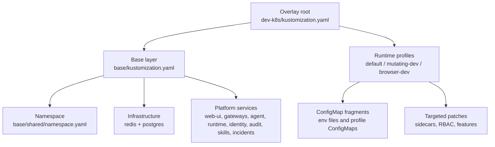
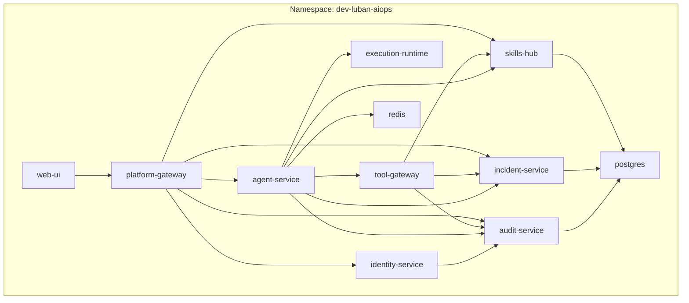
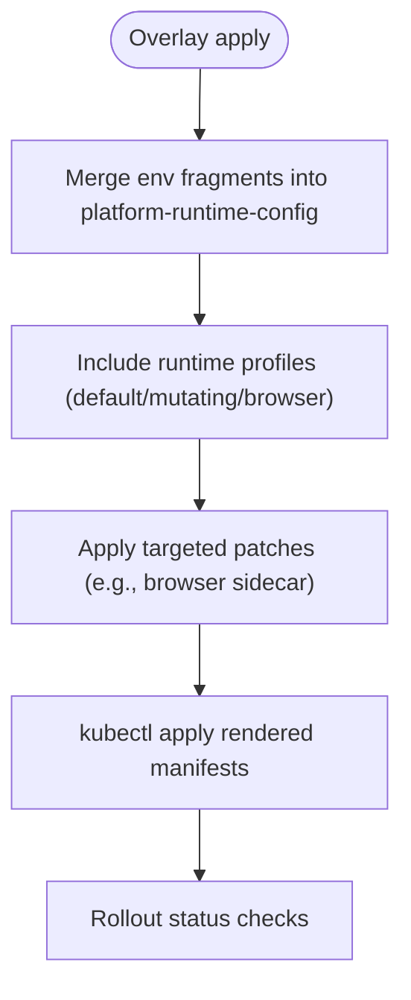
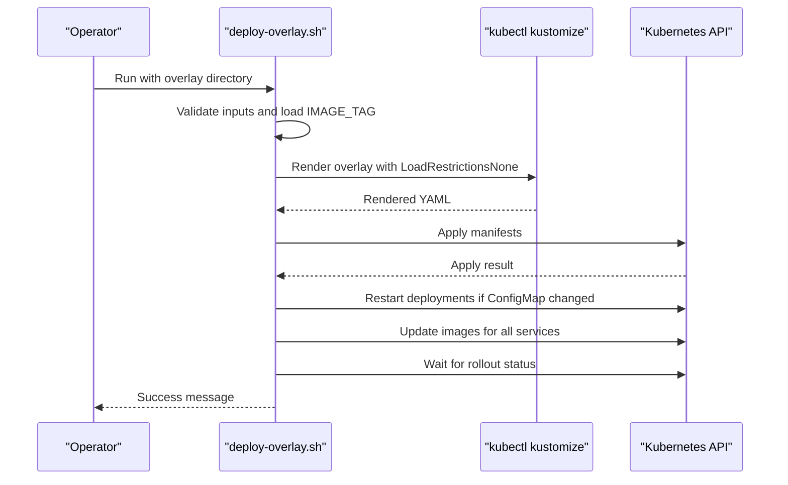
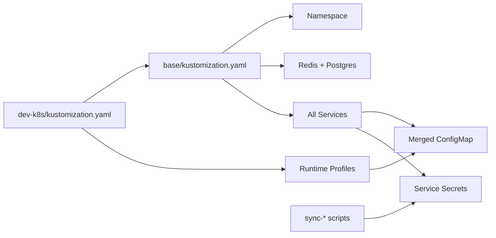

# Overlay Configuration

<cite>
**Referenced Files in This Document**
- [deploy-overlay.sh](file://shared/platform-ops/gitops/deploy-overlay.sh)
- [dev-k8s/kustomization.yaml](file://shared/platform-ops/gitops/dev-k8s/kustomization.yaml)
- [dev-k8s/base/kustomization.yaml](file://shared/platform-ops/gitops/dev-k8s/base/kustomization.yaml)
- [dev-k8s/README.md](file://shared/platform-ops/gitops/dev-k8s/README.md)
- [dev-k8s/deploy.sh](file://shared/platform-ops/gitops/dev-k8s/deploy.sh)
- [base/shared/runtime.env](file://shared/platform-ops/gitops/dev-k8s/base/shared/runtime.env)
- [base/agent-platform/runtime-config.env](file://shared/platform-ops/gitops/dev-k8s/base/agent-platform/runtime-config.env)
- [runtime-profiles/default/configmap.yaml](file://shared/platform-ops/gitops/runtime-profiles/default/configmap.yaml)
- [runtime-profiles/default/kustomization.yaml](file://shared/platform-ops/gitops/runtime-profiles/default/kustomization.yaml)
- [base/infra/postgres-statefulset.yaml](file://shared/platform-ops/gitops/dev-k8s/base/infra/postgres-statefulset.yaml)
- [base/operator-portal/web-ui-deployment.yaml](file://shared/platform-ops/gitops/dev-k8s/base/operator-portal/web-ui-deployment.yaml)
</cite>

## Table of Contents
1. [Introduction](#introduction)
2. [Project Structure](#project-structure)
3. [Core Components](#core-components)
4. [Architecture Overview](#architecture-overview)
5. [Detailed Component Analysis](#detailed-component-analysis)
6. [Dependency Analysis](#dependency-analysis)
7. [Performance Considerations](#performance-considerations)
8. [Troubleshooting Guide](#troubleshooting-guide)
9. [Conclusion](#conclusion)
10. [Appendices](#appendices)

## Introduction
This document explains the Kustomize overlay configuration system used to deploy the Luban AIOPS platform on Kubernetes. It focuses on the dev-k8s overlay, which composes all platform services: web-ui, platform-gateway, tool-gateway, agent-service, execution-runtime, identity-service, audit-service, skills-hub, incident-service, redis, and postgres. It covers how base manifests are composed with overlays, environment variable injection via ConfigMaps, service discovery patterns, namespace isolation, resource posture, and how the deploy-overlay.sh script orchestrates deployment. It also provides guidance for extending the overlay for custom deployments and common customization scenarios.

## Project Structure
The dev-k8s overlay is organized into a layered Kustomize structure:
- Base layer: defines the namespace, shared runtime configuration, infrastructure (redis, postgres), and all application Deployments and Services.
- Overlay layer: sets the target namespace, includes base resources, merges runtime profiles, generates a unified runtime ConfigMap, and applies targeted patches.
- Runtime profiles: optional feature postures (default LLM profile, mutating-dev posture, browser-dev posture) that add or modify behavior without changing base manifests.

**Diagram sources**
- [dev-k8s/kustomization.yaml:1-22](file://shared/platform-ops/gitops/dev-k8s/kustomization.yaml#L1-L22)
- [dev-k8s/base/kustomization.yaml:1-72](file://shared/platform-ops/gitops/dev-k8s/base/kustomization.yaml#L1-L72)
- [runtime-profiles/default/kustomization.yaml:1-5](file://shared/platform-ops/gitops/runtime-profiles/default/kustomization.yaml#L1-L5)

**Section sources**
- [dev-k8s/kustomization.yaml:1-22](file://shared/platform-ops/gitops/dev-k8s/kustomization.yaml#L1-L22)
- [dev-k8s/base/kustomization.yaml:1-72](file://shared/platform-ops/gitops/dev-k8s/base/kustomization.yaml#L1-L72)
- [dev-k8s/README.md:1-762](file://shared/platform-ops/gitops/dev-k8s/README.md#L1-L762)

## Core Components
- Namespace isolation: The overlay targets a dedicated namespace for all platform components, ensuring isolation from other workloads.
- Unified runtime configuration: A single ConfigMap named platform-runtime-config aggregates non-secret environment variables from multiple env fragments across services.
- Infrastructure services: In-cluster Redis for AgentScope coordination and PostgreSQL for durable stores (audit trail, skills, incidents, sessions, agent state).
- Application services: web-ui, platform-gateway, tool-gateway, agent-service, execution-runtime, identity-service, audit-service, skills-hub, incident-service.
- Feature postures: default LLM provider profile, mutating-dev posture enabling bounded mutating tools, and browser-dev posture enabling browser checks with a sidecar.

Key responsibilities by component:
- web-ui: Serves the portal SPA and proxies API calls to platform-gateway.
- platform-gateway: Central entrypoint for portal flows; integrates identity, policy, audit, incidents, and skills.
- tool-gateway: Tool execution surface with redaction, policies, and optional browser capabilities.
- agent-service: Orchestrates agents, sessions, state, and coordinates with tool-gateway and execution-runtime.
- execution-runtime: Isolated worker for approved mutating actions.
- identity-service: Handles OIDC flows and token exchange.
- audit-service: Persistent audit store backed by PostgreSQL.
- skills-hub: Skills federation and search, backed by PostgreSQL.
- incident-service: Incident intake, triage, and reporting, backed by PostgreSQL.
- redis: In-memory coordination store for AgentScope.
- postgres: Durable storage for audit, skills, incidents, sessions, and agent state.

**Section sources**
- [dev-k8s/base/kustomization.yaml:45-72](file://shared/platform-ops/gitops/dev-k8s/base/kustomization.yaml#L45-L72)
- [dev-k8s/base/shared/runtime.env:1-12](file://shared/platform-ops/gitops/dev-k8s/base/shared/runtime.env#L1-L12)
- [dev-k8s/base/agent-platform/runtime-config.env:1-50](file://shared/platform-ops/gitops/dev-k8s/base/agent-platform/runtime-config.env#L1-L50)
- [dev-k8s/README.md:1-762](file://shared/platform-ops/gitops/dev-k8s/README.md#L1-L762)

## Architecture Overview
The overlay composes a cohesive platform where each service discovers others via DNS within the namespace. Environment variables injected through the unified runtime ConfigMap define endpoints and client identities. Secrets are provisioned separately and mounted into pods as needed.

**Diagram sources**
- [dev-k8s/base/kustomization.yaml:45-72](file://shared/platform-ops/gitops/dev-k8s/base/kustomization.yaml#L45-L72)
- [base/shared/runtime.env:1-12](file://shared/platform-ops/gitops/dev-k8s/base/shared/runtime.env#L1-L12)
- [base/agent-platform/runtime-config.env:1-50](file://shared/platform-ops/gitops/dev-k8s/base/agent-platform/runtime-config.env#L1-L50)

## Detailed Component Analysis

### Kustomization Composition and Environment Injection
- The overlay root declares the namespace and includes base resources plus runtime profiles. It generates a merged platform-runtime-config ConfigMap using env files from base and profile layers.
- Base kustomization defines the namespace, infrastructure, and all service Deployments/Services. It also creates additional ConfigMaps for policy, skill content, and Postgres init scripts.
- Environment variables are split across env fragments per service and merged into one ConfigMap. Each key must be unique across fragments. Shared keys like identity service URL live in the shared fragment.

**Diagram sources**
- [dev-k8s/kustomization.yaml:1-22](file://shared/platform-ops/gitops/dev-k8s/kustomization.yaml#L1-L22)
- [dev-k8s/base/kustomization.yaml:1-72](file://shared/platform-ops/gitops/dev-k8s/base/kustomization.yaml#L1-L72)

**Section sources**
- [dev-k8s/kustomization.yaml:1-22](file://shared/platform-ops/gitops/dev-k8s/kustomization.yaml#L1-L22)
- [dev-k8s/base/kustomization.yaml:1-72](file://shared/platform-ops/gitops/dev-k8s/base/kustomization.yaml#L1-L72)
- [dev-k8s/README.md:56-72](file://shared/platform-ops/gitops/dev-k8s/README.md#L56-L72)

### Service Discovery Patterns
- All services use DNS-based discovery within the namespace (for example, http://agent-service:8000, http://tool-gateway:8000, http://identity-service:8000).
- Legacy service-link environment variables are disabled to avoid collisions; only explicit DNS names are used.
- The unified runtime ConfigMap centralizes endpoint configuration so services can be reconfigured without changing code.

**Section sources**
- [dev-k8s/base/shared/runtime.env:1-12](file://shared/platform-ops/gitops/dev-k8s/base/shared/runtime.env#L1-L12)
- [dev-k8s/base/agent-platform/runtime-config.env:1-50](file://shared/platform-ops/gitops/dev-k8s/base/agent-platform/runtime-config.env#L1-L50)
- [dev-k8s/README.md:196-199](file://shared/platform-ops/gitops/dev-k8s/README.md#L196-L199)

### Namespace Isolation and Resources
- The overlay targets a dedicated namespace for all platform components.
- Resource quotas are not defined in the base; this is a development baseline without production hardening.
- Security posture includes running containers as non-root and disabling privilege escalation for the web-ui.

**Section sources**
- [dev-k8s/base/kustomization.yaml:1-10](file://shared/platform-ops/gitops/dev-k8s/base/kustomization.yaml#L1-L10)
- [base/operator-portal/web-ui-deployment.yaml:1-30](file://shared/platform-ops/gitops/dev-k8s/base/operator-portal/web-ui-deployment.yaml#L1-L30)
- [dev-k8s/README.md:19-37](file://shared/platform-ops/gitops/dev-k8s/README.md#L19-L37)

### Postgres and Redis Infrastructure
- Redis is deployed with ephemeral storage suitable for development.
- PostgreSQL is deployed as a StatefulSet with persistent volume claims and init scripts to create required databases.
- Init scripts are provided via a ConfigMap mounted at the standard initialization path.

**Section sources**
- [dev-k8s/base/kustomization.yaml:45-50](file://shared/platform-ops/gitops/dev-k8s/base/kustomization.yaml#L45-L50)
- [base/infra/postgres-statefulset.yaml:1-63](file://shared/platform-ops/gitops/dev-k8s/base/infra/postgres-statefulset.yaml#L1-L63)
- [dev-k8s/README.md:196-199](file://shared/platform-ops/gitops/dev-k8s/README.md#L196-L199)

### Runtime Profiles and Feature Postures
- Default profile configures the active LLM provider settings via a ConfigMap consumed by agent-service.
- Mutating-dev posture enables bounded mutating tools and grants minimal RBAC for pod deletion in the namespace.
- Browser-dev posture enables browser checks by merging environment flags and patching the tool-gateway Deployment to include a sidecar and credential mounts.

**Section sources**
- [runtime-profiles/default/configmap.yaml:1-11](file://shared/platform-ops/gitops/runtime-profiles/default/configmap.yaml#L1-L11)
- [runtime-profiles/default/kustomization.yaml:1-5](file://shared/platform-ops/gitops/runtime-profiles/default/kustomization.yaml#L1-L5)
- [dev-k8s/kustomization.yaml:15-22](file://shared/platform-ops/gitops/dev-k8s/kustomization.yaml#L15-L22)
- [dev-k8s/README.md:601-674](file://shared/platform-ops/gitops/dev-k8s/README.md#L601-L674)

### Secret Provisioning and Reconciliation
- Secrets for delegation, audit ingestion, execution signing/handoff, skills query, incidents webhook/query, browser credentials, and OTel ingest are provisioned by helper scripts invoked during deployment.
- These scripts create or update secrets idempotently and can be skipped when external systems inject secrets.
- Keycloak realm and portal client reconciliation are optional and controlled by an environment flag.

**Section sources**
- [dev-k8s/deploy.sh:1-62](file://shared/platform-ops/gitops/dev-k8s/deploy.sh#L1-L62)
- [dev-k8s/README.md:200-310](file://shared/platform-ops/gitops/dev-k8s/README.md#L200-L310)
- [dev-k8s/README.md:340-414](file://shared/platform-ops/gitops/dev-k8s/README.md#L340-L414)
- [dev-k8s/README.md:425-489](file://shared/platform-ops/gitops/dev-k8s/README.md#L425-L489)
- [dev-k8s/README.md:491-561](file://shared/platform-ops/gitops/dev-k8s/README.md#L491-L561)
- [dev-k8s/README.md:663-681](file://shared/platform-ops/gitops/dev-k8s/README.md#L663-L681)

### Deployment Orchestration with deploy-overlay.sh
- The script validates inputs, loads image tags, renders the overlay with Kustomize, applies manifests, detects ConfigMap changes, restarts affected deployments, updates images explicitly, and waits for rollout completion.
- It supports absolute or relative overlay paths and defaults to a specific namespace.

**Diagram sources**
- [deploy-overlay.sh:1-108](file://shared/platform-ops/gitops/deploy-overlay.sh#L1-L108)

**Section sources**
- [deploy-overlay.sh:1-108](file://shared/platform-ops/gitops/deploy-overlay.sh#L1-L108)

## Dependency Analysis
- The base layer declares all resources including infrastructure and services.
- The overlay layer composes base resources and adds runtime profiles and patches.
- Environment dependencies are centralized in the unified runtime ConfigMap, reducing coupling between services and making endpoint changes declarative.
- Secrets are decoupled from manifests and provisioned by scripts, allowing flexible secret management strategies.

**Diagram sources**
- [dev-k8s/base/kustomization.yaml:1-72](file://shared/platform-ops/gitops/dev-k8s/base/kustomization.yaml#L1-L72)
- [dev-k8s/kustomization.yaml:1-22](file://shared/platform-ops/gitops/dev-k8s/kustomization.yaml#L1-L22)
- [dev-k8s/deploy.sh:1-62](file://shared/platform-ops/gitops/dev-k8s/deploy.sh#L1-L62)

**Section sources**
- [dev-k8s/base/kustomization.yaml:1-72](file://shared/platform-ops/gitops/dev-k8s/base/kustomization.yaml#L1-L72)
- [dev-k8s/kustomization.yaml:1-22](file://shared/platform-ops/gitops/dev-k8s/kustomization.yaml#L1-L22)
- [dev-k8s/deploy.sh:1-62](file://shared/platform-ops/gitops/dev-k8s/deploy.sh#L1-L62)

## Performance Considerations
- Use the overlay’s unified ConfigMap to minimize environment drift and reduce redeploy churn.
- Prefer targeted restarts after ConfigMap-only changes rather than full rebuilds.
- Keep Redis ephemeral in development; plan for durable storage in production.
- Avoid enabling mutating tools or browser capabilities outside intended postures to reduce risk and overhead.

[No sources needed since this section provides general guidance]

## Troubleshooting Guide
- If services cannot discover each other, verify DNS names and that enableServiceLinks is disabled to prevent legacy env collisions.
- If environment changes do not take effect, check whether the platform-runtime-config ConfigMap was updated and whether affected deployments were restarted.
- If secrets are missing, run the corresponding sync script or skip provisioning when secrets are injected externally.
- If Postgres-dependent services fail, ensure init scripts created required databases and that the StatefulSet is ready.

**Section sources**
- [dev-k8s/README.md:196-199](file://shared/platform-ops/gitops/dev-k8s/README.md#L196-L199)
- [deploy-overlay.sh:63-76](file://shared/platform-ops/gitops/deploy-overlay.sh#L63-L76)
- [dev-k8s/deploy.sh:11-52](file://shared/platform-ops/gitops/dev-k8s/deploy.sh#L11-L52)
- [base/infra/postgres-statefulset.yaml:41-54](file://shared/platform-ops/gitops/dev-k8s/base/infra/postgres-statefulset.yaml#L41-L54)

## Conclusion
The dev-k8s overlay provides a composable, GitOps-friendly way to deploy the Luban AIOPS platform. By separating base manifests from overlays and runtime profiles, it enables safe customization, consistent environment injection, and clear separation of concerns. The orchestration script ensures deterministic rollouts and reconciles necessary secrets and configurations. Operators can extend the overlay by adding new services, adjusting resource limits, integrating cluster infrastructure, and adopting appropriate runtime postures.

[No sources needed since this section summarizes without analyzing specific files]

## Appendices

### How to Extend the Overlay for Custom Deployments
- Add a new service:
  - Create a new folder under base/<service-name> with Deployment and Service manifests.
  - Add env keys to a new runtime-config.env fragment and include it in the base kustomization generator.
  - Reference the service via DNS in other services’ env fragments.
  - Include the new resources in base/kustomization.yaml resources list.
- Modify resource limits:
  - Edit the relevant Deployment manifest under base/<service-name>.
  - For posture-specific changes, add a strategic merge patch in a runtime profile and reference it from the overlay root.
- Integrate with existing cluster infrastructure:
  - Replace in-cluster dependencies with external endpoints in env fragments.
  - Provide secrets via sync scripts or external secret managers and mount them into pods.
  - Ensure network policies allow communication between services and external endpoints.

**Section sources**
- [dev-k8s/base/kustomization.yaml:6-20](file://shared/platform-ops/gitops/dev-k8s/base/kustomization.yaml#L6-L20)
- [dev-k8s/base/kustomization.yaml:45-72](file://shared/platform-ops/gitops/dev-k8s/base/kustomization.yaml#L45-L72)
- [dev-k8s/kustomization.yaml:15-22](file://shared/platform-ops/gitops/dev-k8s/kustomization.yaml#L15-L22)
- [dev-k8s/README.md:56-72](file://shared/platform-ops/gitops/dev-k8s/README.md#L56-L72)

### Common Customization Scenarios
- Adding a new service:
  - Define Deployment and Service under base/<service-name>.
  - Add env keys to a new env fragment and include it in the base generator.
  - Wire up dependencies via DNS and secrets.
  - Include resources in base/kustomization.yaml.
- Modifying resource limits:
  - Adjust requests/limits in the Deployment manifest.
  - Optionally create a profile patch for posture-specific limits.
- Integrating with cluster infrastructure:
  - Update env fragments to point to external services.
  - Provision secrets via sync scripts or external systems.
  - Ensure network connectivity and authentication are configured.

**Section sources**
- [dev-k8s/base/kustomization.yaml:6-20](file://shared/platform-ops/gitops/dev-k8s/base/kustomization.yaml#L6-L20)
- [dev-k8s/base/kustomization.yaml:45-72](file://shared/platform-ops/gitops/dev-k8s/base/kustomization.yaml#L45-L72)
- [dev-k8s/kustomization.yaml:15-22](file://shared/platform-ops/gitops/dev-k8s/kustomization.yaml#L15-L22)
- [dev-k8s/README.md:56-72](file://shared/platform-ops/gitops/dev-k8s/README.md#L56-L72)