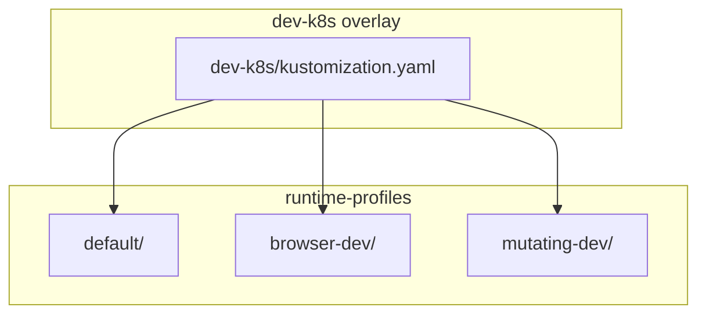
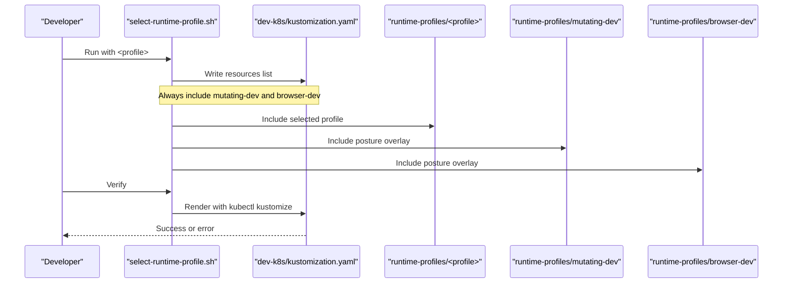
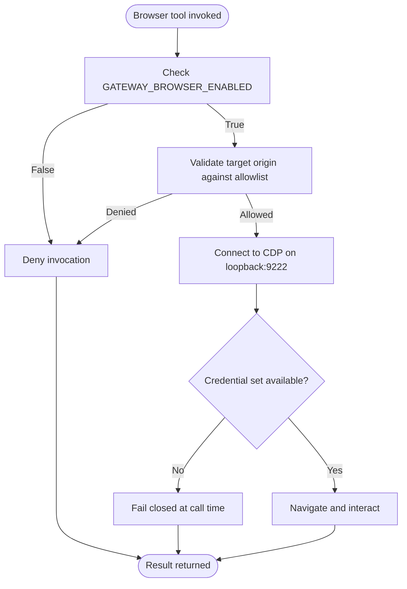
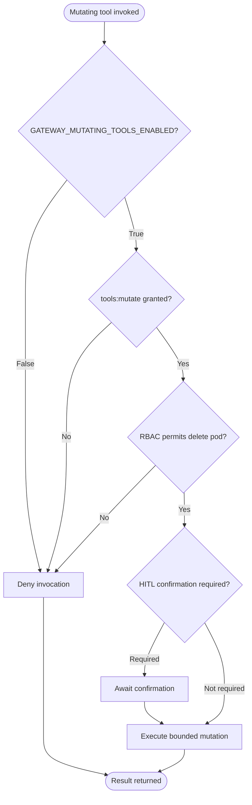
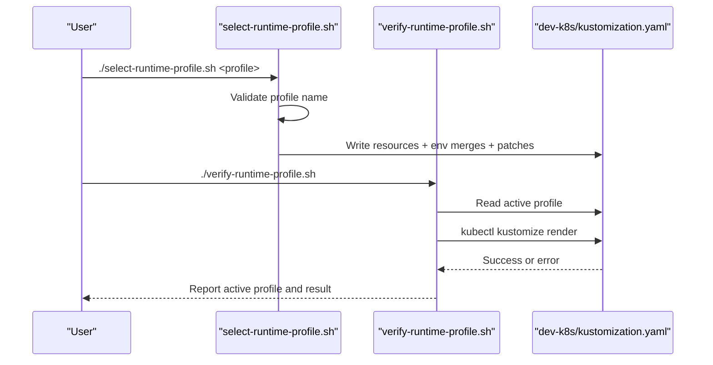
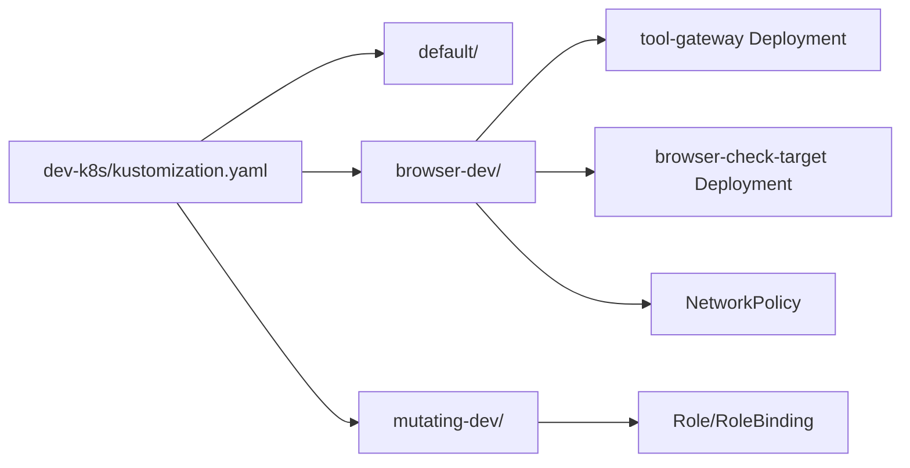

# Runtime Profiles

<cite>
**Referenced Files in This Document**
- [README.md](file://shared/platform-ops/gitops/runtime-profiles/README.md)
- [select-runtime-profile.sh](file://shared/platform-ops/gitops/select-runtime-profile.sh)
- [verify-runtime-profile.sh](file://shared/platform-ops/gitops/verify-runtime-profile.sh)
- [kustomization.yaml (default)](file://shared/platform-ops/gitops/runtime-profiles/default/kustomization.yaml)
- [configmap.yaml (default)](file://shared/platform-ops/gitops/runtime-profiles/default/configmap.yaml)
- [kustomization.yaml (browser-dev)](file://shared/platform-ops/gitops/runtime-profiles/browser-dev/kustomization.yaml)
- [browser.env (browser-dev)](file://shared/platform-ops/gitops/runtime-profiles/browser-dev/browser.env)
- [tool-gateway-browser-sidecar.yaml](file://shared/platform-ops/gitops/runtime-profiles/browser-dev/tool-gateway-browser-sidecar.yaml)
- [browser-check-target-deployment.yaml](file://shared/platform-ops/gitops/runtime-profiles/browser-dev/browser-check-target-deployment.yaml)
- [browser-sidecar-network-policy.yaml](file://shared/platform-ops/gitops/runtime-profiles/browser-dev/browser-sidecar-network-policy.yaml)
- [kustomization.yaml (mutating-dev)](file://shared/platform-ops/gitops/runtime-profiles/mutating-dev/kustomization.yaml)
- [mutating.env (mutating-dev)](file://shared/platform-ops/gitops/runtime-profiles/mutating-dev/mutating.env)
- [tool-gateway-pod-delete.yaml](file://shared/platform-ops/gitops/runtime-profiles/mutating-dev/tool-gateway-pod-delete.yaml)
</cite>

## Table of Contents
1. [Introduction](#introduction)
2. [Project Structure](#project-structure)
3. [Core Components](#core-components)
4. [Architecture Overview](#architecture-overview)
5. [Detailed Component Analysis](#detailed-component-analysis)
6. [Dependency Analysis](#dependency-analysis)
7. [Performance Considerations](#performance-considerations)
8. [Troubleshooting Guide](#troubleshooting-guide)
9. [Conclusion](#conclusion)
10. [Appendices](#appendices)

## Introduction
This document explains the runtime profiles system that customizes platform behavior for different operational scenarios. It covers:
- The default profile for standard deployments, which sets a generic agent profile and provider configuration.
- The browser-dev profile for web automation testing with a Playwright-compatible sidecar and a sample browser check target.
- The mutating-dev profile for testing write operations with elevated permissions scoped to bounded actions.

It also documents how each profile configures security policies, network policies, resource allocations, and service integrations; how tool execution policies and approval workflows are affected; and how to use the select and verify scripts to switch and validate profiles. Finally, it provides guidance for creating custom profiles and understanding their security implications.

## Project Structure
Runtime profiles are implemented as Kustomize overlays under shared/platform-ops/gitops/runtime-profiles. Each profile directory contributes resources and environment variables that the dev-k8s overlay merges into the running platform. Two “posture” profiles (mutating-dev and browser-dev) are always wired into dev-k8s alongside the active LLM provider profile. A third profile (default) is the current LLM provider profile used by dev-k8s.

**Diagram sources**
- [select-runtime-profile.sh:30-52](file://shared/platform-ops/gitops/select-runtime-profile.sh#L30-L52)
- [kustomization.yaml (browser-dev):22-28](file://shared/platform-ops/gitops/runtime-profiles/browser-dev/kustomization.yaml#L22-L28)
- [kustomization.yaml (mutating-dev):18-21](file://shared/platform-ops/gitops/runtime-profiles/mutating-dev/kustomization.yaml#L18-L21)
- [kustomization.yaml (default):1-5](file://shared/platform-ops/gitops/runtime-profiles/default/kustomization.yaml#L1-L5)

**Section sources**
- [README.md:1-18](file://shared/platform-ops/gitops/runtime-profiles/README.md#L1-L18)
- [select-runtime-profile.sh:14-55](file://shared/platform-ops/gitops/select-runtime-profile.sh#L14-L55)

## Core Components
- Default profile: Provides a ConfigMap that labels the deployment with a generic profile and selects an LLM provider and model.
- Browser-dev posture: Adds a headless browser sidecar to the tool-gateway Deployment, mounts credential sets, exposes a sample browser-check target app, and restricts network access to the CDP port.
- Mutating-dev posture: Grants a minimal RBAC Role/RoleBinding for deleting pods in the dev namespace and enables mutating tools via a ConfigMap flag.

These components affect:
- Security policies: Deny-by-default posture unless explicitly enabled by a profile.
- Network policies: Restrict cross-pod access to the browser’s debugging port.
- Resource allocations: Sidecar CPU/memory requests and limits.
- Service integrations: Tool-gateway integration with the browser sidecar and optional credentials.

**Section sources**
- [configmap.yaml (default):1-11](file://shared/platform-ops/gitops/runtime-profiles/default/configmap.yaml#L1-L11)
- [browser.env (browser-dev):1-11](file://shared/platform-ops/gitops/runtime-profiles/browser-dev/browser.env#L1-L11)
- [tool-gateway-browser-sidecar.yaml:1-67](file://shared/platform-ops/gitops/runtime-profiles/browser-dev/tool-gateway-browser-sidecar.yaml#L1-L67)
- [browser-check-target-deployment.yaml:1-70](file://shared/platform-ops/gitops/runtime-profiles/browser-dev/browser-check-target-deployment.yaml#L1-L70)
- [browser-sidecar-network-policy.yaml:1-31](file://shared/platform-ops/gitops/runtime-profiles/browser-dev/browser-sidecar-network-policy.yaml#L1-L31)
- [mutating.env (mutating-dev):1-4](file://shared/platform-ops/gitops/runtime-profiles/mutating-dev/mutating.env#L1-L4)
- [tool-gateway-pod-delete.yaml:1-48](file://shared/platform-ops/gitops/runtime-profiles/mutating-dev/tool-gateway-pod-delete.yaml#L1-L48)

## Architecture Overview
The dev-k8s overlay composes three layers at build time:
- Base platform manifests.
- One active LLM provider profile (currently default).
- Always-on posture overlays: mutating-dev and browser-dev.

The select script writes a new dev-k8s/kustomization.yaml that includes the chosen profile while preserving the posture overlays. The verify script reports the active profile and validates that kustomize can render the overlay without errors.

**Diagram sources**
- [select-runtime-profile.sh:30-52](file://shared/platform-ops/gitops/select-runtime-profile.sh#L30-L52)
- [verify-runtime-profile.sh:8-23](file://shared/platform-ops/gitops/verify-runtime-profile.sh#L8-L23)

**Section sources**
- [select-runtime-profile.sh:14-55](file://shared/platform-ops/gitops/select-runtime-profile.sh#L14-L55)
- [verify-runtime-profile.sh:1-24](file://shared/platform-ops/gitops/verify-runtime-profile.sh#L1-L24)

## Detailed Component Analysis

### Default Profile
Purpose:
- Declares a generic deploy-time profile label and selects an LLM provider and model through a ConfigMap consumed by the agent platform.

Configuration highlights:
- Sets AGENTSCOPE_PROFILE, AGENTSCOPE_PROVIDER, AGENTSCOPE_MODEL_NAME, and base URL.
- Is included as one of exactly one LLM provider profile at a time in dev-k8s.

Security and policy impact:
- Does not enable mutating tools or browser features by itself.
- Provider selection is decoupled from the profile label, allowing any provider mix within the same profile.

**Section sources**
- [README.md:5-18](file://shared/platform-ops/gitops/runtime-profiles/README.md#L5-L18)
- [configmap.yaml (default):1-11](file://shared/platform-ops/gitops/runtime-profiles/default/configmap.yaml#L1-L11)
- [kustomization.yaml (default):1-5](file://shared/platform-ops/gitops/runtime-profiles/default/kustomization.yaml#L1-L5)

### Browser-Dev Profile (Web Automation Testing)
Purpose:
- Enables browser-based web checks in dev by adding a headless browser sidecar to the tool-gateway pod and providing a sample target application.

Key configurations:
- Environment variables merged into platform-runtime-config:
  - Enable browser connector.
  - Define CDP endpoint on loopback.
  - Allow only the sample target origin.
  - Mount named credential sets for web logins.
- Strategic merge patch adds:
  - Chromium headless sidecar bound to loopback on a fixed port.
  - Credential secret volume mount on the gateway container.
  - Resource requests/limits for the sidecar.
- Sample target:
  - Unprivileged nginx serving static pages.
  - Read-only ConfigMap-backed pages.
- Network policy:
  - Explicitly allows HTTP ingress to the gateway.
  - Denies ingress to the CDP port from other pods (defense-in-depth).

Tool execution and approvals:
- Browser tools are gated by feature enablement and allowlist.
- Named credential sets are mounted but optional; missing credentials fail closed at call time.

Security boundaries:
- CDP is bound to loopback and protected by a NetworkPolicy.
- Only configured origins are allowed for navigation.

**Diagram sources**
- [browser.env (browser-dev):1-11](file://shared/platform-ops/gitops/runtime-profiles/browser-dev/browser.env#L1-L11)
- [tool-gateway-browser-sidecar.yaml:1-67](file://shared/platform-ops/gitops/runtime-profiles/browser-dev/tool-gateway-browser-sidecar.yaml#L1-L67)
- [browser-sidecar-network-policy.yaml:1-31](file://shared/platform-ops/gitops/runtime-profiles/browser-dev/browser-sidecar-network-policy.yaml#L1-L31)

**Section sources**
- [README.md:41-56](file://shared/platform-ops/gitops/runtime-profiles/README.md#L41-L56)
- [kustomization.yaml (browser-dev):1-29](file://shared/platform-ops/gitops/runtime-profiles/browser-dev/kustomization.yaml#L1-L29)
- [browser.env (browser-dev):1-11](file://shared/platform-ops/gitops/runtime-profiles/browser-dev/browser.env#L1-L11)
- [tool-gateway-browser-sidecar.yaml:1-67](file://shared/platform-ops/gitops/runtime-profiles/browser-dev/tool-gateway-browser-sidecar.yaml#L1-L67)
- [browser-check-target-deployment.yaml:1-70](file://shared/platform-ops/gitops/runtime-profiles/browser-dev/browser-check-target-deployment.yaml#L1-L70)
- [browser-sidecar-network-policy.yaml:1-31](file://shared/platform-ops/gitops/runtime-profiles/browser-dev/browser-sidecar-network-policy.yaml#L1-L31)

### Mutating-Dev Profile (Write Operations)
Purpose:
- Enables bounded mutating tools in dev by granting minimal RBAC and enabling the mutating tools flag.

Key configurations:
- Environment variable merged into platform-runtime-config to enable mutating tools.
- Role/RoleBinding limited to delete verb on pods in the dev namespace, scoped to the tool-gateway ServiceAccount.

Tool execution and approvals:
- Mutating invokes remain triple-gated: risk-tier admission, policy grant, and HITL confirmation.
- Activation requires the profile’s environment variable, policy grants, RBAC applied, and HITL timeout configured.

Security boundaries:
- Minimal surface: only delete on pods in the dev namespace.
- No create/update/patch or access to other resources/namespaces.

**Diagram sources**
- [mutating.env (mutating-dev):1-4](file://shared/platform-ops/gitops/runtime-profiles/mutating-dev/mutating.env#L1-L4)
- [tool-gateway-pod-delete.yaml:1-48](file://shared/platform-ops/gitops/runtime-profiles/mutating-dev/tool-gateway-pod-delete.yaml#L1-L48)
- [kustomization.yaml (mutating-dev):1-22](file://shared/platform-ops/gitops/runtime-profiles/mutating-dev/kustomization.yaml#L1-L22)

**Section sources**
- [README.md:29-39](file://shared/platform-ops/gitops/runtime-profiles/README.md#L29-L39)
- [kustomization.yaml (mutating-dev):1-22](file://shared/platform-ops/gitops/runtime-profiles/mutating-dev/kustomization.yaml#L1-L22)
- [mutating.env (mutating-dev):1-4](file://shared/platform-ops/gitops/runtime-profiles/mutating-dev/mutating.env#L1-L4)
- [tool-gateway-pod-delete.yaml:1-48](file://shared/platform-ops/gitops/runtime-profiles/mutating-dev/tool-gateway-pod-delete.yaml#L1-L48)

### Select and Verify Scripts
- select-runtime-profile.sh:
  - Validates input and rejects mutating-dev and browser-dev as switchable LLM profiles.
  - Writes dev-k8s/kustomization.yaml to include the selected profile plus both posture overlays.
  - Merges environment files from both posture overlays into the runtime ConfigMap.
  - Applies the browser sidecar strategic merge patch to the tool-gateway Deployment.
- verify-runtime-profile.sh:
  - Extracts the currently active LLM profile from dev-k8s/kustomization.yaml.
  - Renders the overlay with kustomize to validate integrity.

**Diagram sources**
- [select-runtime-profile.sh:1-55](file://shared/platform-ops/gitops/select-runtime-profile.sh#L1-L55)
- [verify-runtime-profile.sh:1-24](file://shared/platform-ops/gitops/verify-runtime-profile.sh#L1-L24)

**Section sources**
- [select-runtime-profile.sh:1-55](file://shared/platform-ops/gitops/select-runtime-profile.sh#L1-L55)
- [verify-runtime-profile.sh:1-24](file://shared/platform-ops/gitops/verify-runtime-profile.sh#L1-L24)

## Dependency Analysis
Profiles compose through Kustomize:
- dev-k8s includes the active LLM profile and both posture overlays.
- browser-dev depends on:
  - tool-gateway Deployment (patched by dev-k8s).
  - browser-check target Deployment and Service.
  - NetworkPolicy restricting CDP ingress.
- mutating-dev depends on:
  - tool-gateway ServiceAccount in the dev namespace.
  - RBAC Role/RoleBinding for bounded pod deletion.

**Diagram sources**
- [select-runtime-profile.sh:30-52](file://shared/platform-ops/gitops/select-runtime-profile.sh#L30-L52)
- [kustomization.yaml (browser-dev):22-28](file://shared/platform-ops/gitops/runtime-profiles/browser-dev/kustomization.yaml#L22-L28)
- [kustomization.yaml (mutating-dev):18-21](file://shared/platform-ops/gitops/runtime-profiles/mutating-dev/kustomization.yaml#L18-L21)
- [tool-gateway-browser-sidecar.yaml:1-67](file://shared/platform-ops/gitops/runtime-profiles/browser-dev/tool-gateway-browser-sidecar.yaml#L1-L67)
- [browser-check-target-deployment.yaml:1-70](file://shared/platform-ops/gitops/runtime-profiles/browser-dev/browser-check-target-deployment.yaml#L1-L70)
- [browser-sidecar-network-policy.yaml:1-31](file://shared/platform-ops/gitops/runtime-profiles/browser-dev/browser-sidecar-network-policy.yaml#L1-L31)
- [tool-gateway-pod-delete.yaml:1-48](file://shared/platform-ops/gitops/runtime-profiles/mutating-dev/tool-gateway-pod-delete.yaml#L1-L48)

**Section sources**
- [select-runtime-profile.sh:30-52](file://shared/platform-ops/gitops/select-runtime-profile.sh#L30-L52)
- [kustomization.yaml (browser-dev):1-29](file://shared/platform-ops/gitops/runtime-profiles/browser-dev/kustomization.yaml#L1-L29)
- [kustomization.yaml (mutating-dev):1-22](file://shared/platform-ops/gitops/runtime-profiles/mutating-dev/kustomization.yaml#L1-L22)

## Performance Considerations
- Browser sidecar resources:
  - Requests and limits are defined to prevent unbounded CPU/memory usage.
  - Shared memory volume is mounted for browser stability.
- Network policy:
  - Limits exposure of the CDP port to loopback and denies cross-pod access.
- Mutating tools:
  - Keep scope minimal (delete pods only in dev namespace) to reduce blast radius.

[No sources needed since this section provides general guidance derived from the referenced files]

## Troubleshooting Guide
Common issues and resolutions:
- Wrong profile selected:
  - Use verify-runtime-profile.sh to confirm the active LLM profile and ensure kustomize renders successfully.
- Browser tools failing:
  - Ensure GATEWAY_BROWSER_ENABLED is true and the allowlist includes the target origin.
  - Confirm the sidecar is running and reachable on loopback.
  - Check that credential sets are synced to the expected secret and mounted.
- Mutating tools denied:
  - Verify GATEWAY_MUTATING_TOOLS_ENABLED is true.
  - Confirm RBAC Role/RoleBinding exists and matches the tool-gateway ServiceAccount.
  - Ensure policy grants and HITL configuration are in place.

Operational steps:
- Re-run select-runtime-profile.sh with the desired profile.
- Re-run verify-runtime-profile.sh to validate overlay rendering.
- Inspect logs of tool-gateway and browser sidecar if connectivity issues persist.

**Section sources**
- [verify-runtime-profile.sh:8-23](file://shared/platform-ops/gitops/verify-runtime-profile.sh#L8-L23)
- [browser.env (browser-dev):1-11](file://shared/platform-ops/gitops/runtime-profiles/browser-dev/browser.env#L1-L11)
- [tool-gateway-browser-sidecar.yaml:1-67](file://shared/platform-ops/gitops/runtime-profiles/browser-dev/tool-gateway-browser-sidecar.yaml#L1-L67)
- [mutating.env (mutating-dev):1-4](file://shared/platform-ops/gitops/runtime-profiles/mutating-dev/mutating.env#L1-L4)
- [tool-gateway-pod-delete.yaml:1-48](file://shared/platform-ops/gitops/runtime-profiles/mutating-dev/tool-gateway-pod-delete.yaml#L1-L48)

## Conclusion
Runtime profiles provide a layered, deny-by-default approach to configuring platform behavior:
- The default profile sets a generic agent profile and provider selection.
- The browser-dev posture enables safe, scoped browser automation with strict network and credential controls.
- The mutating-dev posture enables bounded write operations with minimal RBAC and enforced approvals.

Use the select script to switch the active LLM profile while keeping posture overlays permanently enabled. Use the verify script to validate the overlay before deploying. Follow the security boundaries and approval workflows described above to maintain safe operations across environments.

[No sources needed since this section summarizes without analyzing specific files]

## Appendices

### Creating Custom Profiles
Guidance:
- Create a new directory under runtime-profiles with a kustomization.yaml listing resources to include.
- If you need environment variables, add an env file and merge it via the dev-k8s overlay’s configMapGenerator.
- For posture-like features (sidecars, network policies, RBAC), follow the patterns in browser-dev and mutating-dev.
- Keep defaults deny-by-default; only enable capabilities explicitly through your profile.
- Update dev-k8s to include your profile if it replaces the active LLM profile, or keep it as an additional posture overlay if appropriate.

Security considerations:
- Scope RBAC to the minimum necessary resources and verbs.
- Bind sensitive services (like CDP) to loopback and protect with NetworkPolicy.
- Use allowlists for external access (origins, endpoints).
- Ensure secrets are provisioned out-of-band and mounted as optional where possible to avoid blocking startup.

[No sources needed since this section provides general guidance]