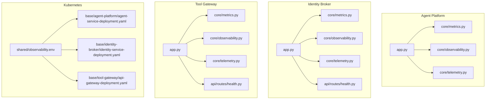
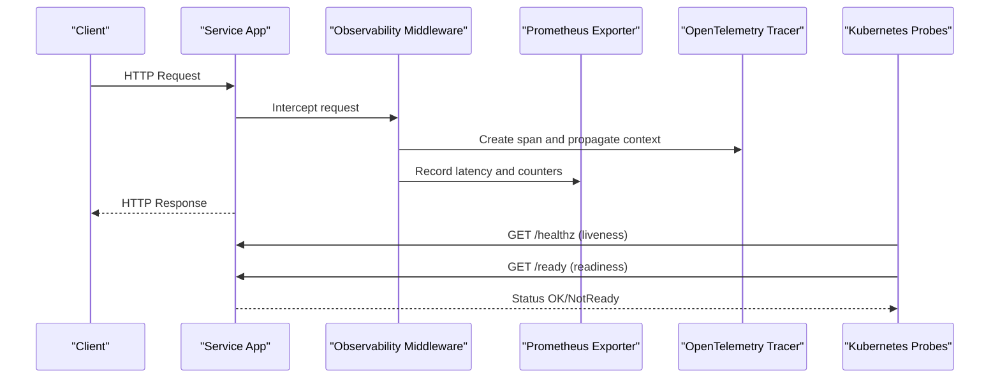
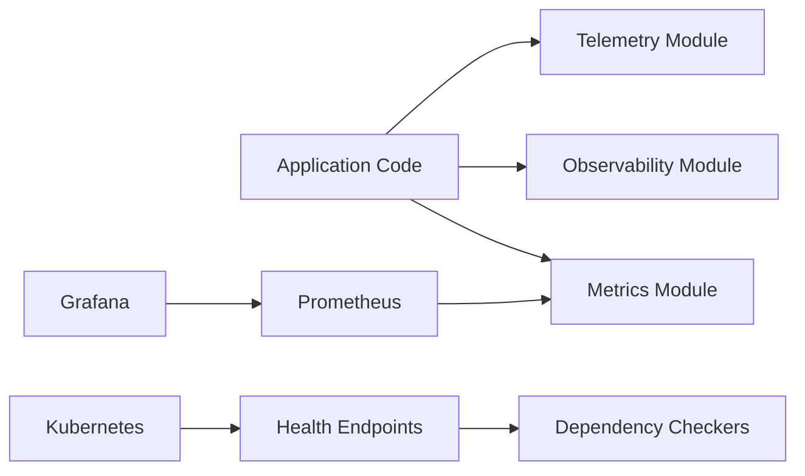

# Monitoring and Observability

<cite>
**Referenced Files in This Document**
- [observability-conventions.md](file://shared/shared-contracts/observability-conventions.md)
- [SPEC-005-observability-baseline/spec.md](file://docs/specs/SPEC-005-observability-baseline/spec.md)
- [agent-platform core metrics.py](file://products/agent-platform/src/agent_service/core/metrics.py)
- [agent-platform core observability.py](file://products/agent-platform/src/agent_service/core/observability.py)
- [agent-platform core telemetry.py](file://products/agent-platform/src/agent_service/core/telemetry.py)
- [agent-platform app.py](file://products/agent-platform/src/agent_service/app.py)
- [identity-broker core metrics.py](file://products/identity-broker/src/identity_service/core/metrics.py)
- [identity-broker core observability.py](file://products/identity-broker/src/identity_service/core/observability.py)
- [identity-broker core telemetry.py](file://products/identity-broker/src/identity_service/core/telemetry.py)
- [identity-broker api routes health.py](file://products/identity-broker/src/identity_service/api/routes/health.py)
- [tool-gateway core metrics.py](file://products/tool-gateway/src/api_gateway/core/metrics.py)
- [tool-gateway core observability.py](file://products/tool-gateway/src/api_gateway/core/observability.py)
- [tool-gateway core telemetry.py](file://products/tool-gateway/src/api_gateway/core/telemetry.py)
- [tool-gateway api routes health.py](file://products/tool-gateway/src/api_gateway/api/routes/health.py)
- [dev-k8s shared observability.env](file://shared/platform-ops/gitops/dev-k8s/base/shared/observability.env)
- [dev-k8s agent platform deployment.yaml](file://shared/platform-ops/gitops/dev-k8s/base/agent-platform/agent-service-deployment.yaml)
- [dev-k8s identity broker deployment.yaml](file://shared/platform-ops/gitops/dev-k8s/base/identity-broker/identity-service-deployment.yaml)
- [dev-k8s tool gateway deployment.yaml](file://shared/platform-ops/gitops/dev-k8s/base/tool-gateway/api-gateway-deployment.yaml)
</cite>

## Table of Contents
1. [Introduction](#introduction)
2. [Project Structure](#project-structure)
3. [Core Components](#core-components)
4. [Architecture Overview](#architecture-overview)
5. [Detailed Component Analysis](#detailed-component-analysis)
6. [Dependency Analysis](#dependency-analysis)
7. [Performance Considerations](#performance-considerations)
8. [Troubleshooting Guide](#troubleshooting-guide)
9. [Conclusion](#conclusion)
10. [Appendices](#appendices)

## Introduction
This document provides comprehensive monitoring and observability guidance for the Luban AIOps Platform. It covers Prometheus metrics collection, structured logging conventions, distributed tracing setup, health check endpoints, readiness and liveness probes, dashboarding with Grafana, alerting rules, and performance monitoring. It also includes troubleshooting techniques using logs, metrics, and traces to diagnose operational issues across services such as Agent Platform, Identity Broker, and Tool Gateway.

## Project Structure
Observability is implemented consistently across services via a common set of modules:
- Core observability modules (metrics, observability, telemetry)
- API routes exposing health endpoints
- Kubernetes deployments configuring probes and environment variables
- Shared observability conventions and specifications

**Diagram sources**
- [agent-platform app.py](file://products/agent-platform/src/agent_service/app.py)
- [agent-platform core metrics.py](file://products/agent-platform/src/agent_service/core/metrics.py)
- [agent-platform core observability.py](file://products/agent-platform/src/agent_service/core/observability.py)
- [agent-platform core telemetry.py](file://products/agent-platform/src/agent_service/core/telemetry.py)
- [identity-broker core metrics.py](file://products/identity-broker/src/identity_service/core/metrics.py)
- [identity-broker core observability.py](file://products/identity-broker/src/identity_service/core/observability.py)
- [identity-broker core telemetry.py](file://products/identity-broker/src/identity_service/core/telemetry.py)
- [identity-broker api routes health.py](file://products/identity-broker/src/identity_service/api/routes/health.py)
- [tool-gateway core metrics.py](file://products/tool-gateway/src/api_gateway/core/metrics.py)
- [tool-gateway core observability.py](file://products/tool-gateway/src/api_gateway/core/observability.py)
- [tool-gateway core telemetry.py](file://products/tool-gateway/src/api_gateway/core/telemetry.py)
- [tool-gateway api routes health.py](file://products/tool-gateway/src/api_gateway/api/routes/health.py)
- [dev-k8s shared observability.env](file://shared/platform-ops/gitops/dev-k8s/base/shared/observability.env)
- [dev-k8s agent platform deployment.yaml](file://shared/platform-ops/gitops/dev-k8s/base/agent-platform/agent-service-deployment.yaml)
- [dev-k8s identity broker deployment.yaml](file://shared/platform-ops/gitops/dev-k8s/base/identity-broker/identity-service-deployment.yaml)
- [dev-k8s tool gateway deployment.yaml](file://shared/platform-ops/gitops/dev-k8s/base/tool-gateway/api-gateway-deployment.yaml)

**Section sources**
- [agent-platform app.py](file://products/agent-platform/src/agent_service/app.py)
- [identity-broker api routes health.py](file://products/identity-broker/src/identity_service/api/routes/health.py)
- [tool-gateway api routes health.py](file://products/tool-gateway/src/api_gateway/api/routes/health.py)
- [dev-k8s shared observability.env](file://shared/platform-ops/gitops/dev-k8s/base/shared/observability.env)
- [dev-k8s agent platform deployment.yaml](file://shared/platform-ops/gitops/dev-k8s/base/agent-platform/agent-service-deployment.yaml)
- [dev-k8s identity broker deployment.yaml](file://shared/platform-ops/gitops/dev-k8s/base/identity-broker/identity-service-deployment.yaml)
- [dev-k8s tool gateway deployment.yaml](file://shared/platform-ops/gitops/dev-k8s/base/tool-gateway/api-gateway-deployment.yaml)

## Core Components
Each service implements a consistent observability stack:
- Metrics: Prometheus-compatible counters, histograms, and gauges exposed on a standard endpoint
- Structured Logging: JSON-formatted logs with correlation IDs and contextual fields
- Distributed Tracing: OpenTelemetry-based spans propagated across requests
- Health Endpoints: Readiness and liveness checks for Kubernetes probes
- Telemetry Initialization: Centralized setup for exporters and context propagation

Key implementation points:
- Metrics are registered and exported via a dedicated module per service
- Observability middleware injects trace context and request metadata into logs
- Telemetry module configures OpenTelemetry providers and propagators
- Health routes expose readiness and liveness endpoints consumed by Kubernetes

**Section sources**
- [agent-platform core metrics.py](file://products/agent-platform/src/agent_service/core/metrics.py)
- [agent-platform core observability.py](file://products/agent-platform/src/agent_service/core/observability.py)
- [agent-platform core telemetry.py](file://products/agent-platform/src/agent_service/core/telemetry.py)
- [identity-broker core metrics.py](file://products/identity-broker/src/identity_service/core/metrics.py)
- [identity-broker core observability.py](file://products/identity-broker/src/identity_service/core/observability.py)
- [identity-broker core telemetry.py](file://products/identity-broker/src/identity_service/core/telemetry.py)
- [tool-gateway core metrics.py](file://products/tool-gateway/src/api_gateway/core/metrics.py)
- [tool-gateway core observability.py](file://products/tool-gateway/src/api_gateway/core/observability.py)
- [tool-gateway core telemetry.py](file://products/tool-gateway/src/api_gateway/core/telemetry.py)

## Architecture Overview
The observability architecture follows a standardized pattern across services:
- Application layer initializes telemetry and registers metrics
- HTTP middleware captures request/response metrics and emits spans
- Health endpoints provide readiness/liveness status
- Kubernetes probes call health endpoints to manage lifecycle
- Prometheus scrapes metrics endpoints; Grafana visualizes dashboards; Alertmanager triggers alerts

**Diagram sources**
- [agent-platform app.py](file://products/agent-platform/src/agent_service/app.py)
- [agent-platform core observability.py](file://products/agent-platform/src/agent_service/core/observability.py)
- [agent-platform core metrics.py](file://products/agent-platform/src/agent_service/core/metrics.py)
- [agent-platform core telemetry.py](file://products/agent-platform/src/agent_service/core/telemetry.py)
- [identity-broker api routes health.py](file://products/identity-broker/src/identity_service/api/routes/health.py)
- [tool-gateway api routes health.py](file://products/tool-gateway/src/api_gateway/api/routes/health.py)

## Detailed Component Analysis

### Metrics Collection (Prometheus)
- Each service exposes a metrics endpoint compatible with Prometheus scraping
- Metrics include request counts, error rates, latency histograms, and business-specific counters
- Naming follows shared conventions for consistency across services

Implementation highlights:
- Metrics registration occurs at startup
- Histograms capture request durations
- Counters track successful and failed operations
- Gauges reflect resource utilization where applicable

**Section sources**
- [agent-platform core metrics.py](file://products/agent-platform/src/agent_service/core/metrics.py)
- [identity-broker core metrics.py](file://products/identity-broker/src/identity_service/core/metrics.py)
- [tool-gateway core metrics.py](file://products/tool-gateway/src/api_gateway/core/metrics.py)
- [observability-conventions.md](file://shared/shared-contracts/observability-conventions.md)

### Structured Logging
- Logs are emitted in JSON format with consistent fields
- Correlation IDs enable cross-service request tracing
- Log levels follow standard conventions (DEBUG, INFO, WARN, ERROR)
- Sensitive data is excluded from logs

Implementation highlights:
- Logger initialization sets default fields (service name, version, instance ID)
- Contextual fields injected per request (trace ID, user ID, session ID)
- Error logs include stack traces and relevant payloads

**Section sources**
- [agent-platform core observability.py](file://products/agent-platform/src/agent_service/core/observability.py)
- [identity-broker core observability.py](file://products/identity-broker/src/identity_service/core/observability.py)
- [tool-gateway core observability.py](file://products/tool-gateway/src/api_gateway/core/observability.py)

### Distributed Tracing (OpenTelemetry)
- Traces are initialized with OpenTelemetry SDK
- Spans are created for HTTP requests, database calls, and external API invocations
- Trace context is propagated via headers (W3C TraceContext)
- Sampling strategies balance visibility and overhead

Implementation highlights:
- Tracer provider configured with exporters (e.g., OTLP)
- Instrumentation libraries auto-instrument HTTP clients/servers
- Custom spans added for critical business logic

**Section sources**
- [agent-platform core telemetry.py](file://products/agent-platform/src/agent_service/core/telemetry.py)
- [identity-broker core telemetry.py](file://products/identity-broker/src/identity_service/core/telemetry.py)
- [tool-gateway core telemetry.py](file://products/tool-gateway/src/api_gateway/core/telemetry.py)

### Health Check Endpoints
- Liveness probe: Validates service is running and responsive
- Readiness probe: Validates dependencies (database, cache, external APIs) are available
- Health endpoints return standard HTTP status codes (200 OK, 503 Service Unavailable)

Implementation highlights:
- Dedicated routes for /healthz and /ready
- Dependency checks performed asynchronously
- Graceful degradation when non-critical dependencies fail

**Section sources**
- [identity-broker api routes health.py](file://products/identity-broker/src/identity_service/api/routes/health.py)
- [tool-gateway api routes health.py](file://products/tool-gateway/src/api_gateway/api/routes/health.py)

### Kubernetes Probes Configuration
- Liveness and readiness probes configured in deployment manifests
- Probe intervals tuned for fast failure detection without excessive load
- Startup probes allow slow-starting services to initialize properly

Implementation highlights:
- HTTP probes call health endpoints
- TCP probes used for port availability checks
- Failure thresholds prevent premature restarts

**Section sources**
- [dev-k8s agent platform deployment.yaml](file://shared/platform-ops/gitops/dev-k8s/base/agent-platform/agent-service-deployment.yaml)
- [dev-k8s identity broker deployment.yaml](file://shared/platform-ops/gitops/dev-k8s/base/identity-broker/identity-service-deployment.yaml)
- [dev-k8s tool gateway deployment.yaml](file://shared/platform-ops/gitops/dev-k8s/base/tool-gateway/api-gateway-deployment.yaml)

### Environment Configuration
- Observability settings centralized in environment files
- Common variables include log level, tracing endpoints, and metric export settings
- Secrets managed separately for sensitive configuration

Implementation highlights:
- Environment variables override defaults
- Feature flags control optional observability features
- Validation ensures required variables are present

**Section sources**
- [dev-k8s shared observability.env](file://shared/platform-ops/gitops/dev-k8s/base/shared/observability.env)

## Dependency Analysis
Observability components have clear dependency relationships:
- Application code depends on metrics, observability, and telemetry modules
- Health endpoints depend on dependency checkers
- Kubernetes probes depend on health endpoints
- Prometheus scrapes metrics endpoints
- Grafana queries Prometheus for visualization

**Diagram sources**
- [agent-platform app.py](file://products/agent-platform/src/agent_service/app.py)
- [agent-platform core metrics.py](file://products/agent-platform/src/agent_service/core/metrics.py)
- [agent-platform core observability.py](file://products/agent-platform/src/agent_service/core/observability.py)
- [agent-platform core telemetry.py](file://products/agent-platform/src/agent_service/core/telemetry.py)
- [identity-broker api routes health.py](file://products/identity-broker/src/identity_service/api/routes/health.py)
- [tool-gateway api routes health.py](file://products/tool-gateway/src/api_gateway/api/routes/health.py)

**Section sources**
- [agent-platform app.py](file://products/agent-platform/src/agent_service/app.py)
- [identity-broker api routes health.py](file://products/identity-broker/src/identity_service/api/routes/health.py)
- [tool-gateway api routes health.py](file://products/tool-gateway/src/api_gateway/api/routes/health.py)

## Performance Considerations
- Metrics sampling: Use appropriate histogram buckets to avoid cardinality explosion
- Log rotation: Implement log rotation to prevent disk space exhaustion
- Tracing overhead: Configure sampling rates based on traffic volume
- Health check frequency: Tune probe intervals to balance responsiveness and resource usage
- Memory usage: Monitor memory consumption of observability components

[No sources needed since this section provides general guidance]

## Troubleshooting Guide
Common diagnostic techniques:
- **Logs**: Search for error patterns, correlation IDs, and stack traces
- **Metrics**: Analyze error rates, latency percentiles, and resource utilization
- **Traces**: Follow request flows across services to identify bottlenecks
- **Health Checks**: Verify service status and dependency health
- **Probes**: Investigate why pods are restarting or failing readiness checks

Step-by-step approach:
1. Check pod status and events
2. Review application logs for errors
3. Examine metrics for anomalies
4. Analyze traces for slow operations
5. Validate health endpoints manually
6. Inspect Kubernetes probe configurations

**Section sources**
- [agent-platform core observability.py](file://products/agent-platform/src/agent_service/core/observability.py)
- [identity-broker core observability.py](file://products/identity-broker/src/identity_service/core/observability.py)
- [tool-gateway core observability.py](file://products/tool-gateway/src/api_gateway/core/observability.py)

## Conclusion
The Luban AIOps Platform implements comprehensive observability through standardized metrics, structured logging, distributed tracing, and health checks. Consistent conventions ensure interoperability across services, while Kubernetes integration enables automated monitoring and self-healing. The documented practices provide a foundation for effective operational monitoring and troubleshooting.

[No sources needed since this section summarizes without analyzing specific files]

## Appendices

### Observability Conventions
- Metric naming follows hierarchical structure with units and labels
- Log formats include mandatory fields for correlation and context
- Trace propagation uses W3C TraceContext standard
- Health endpoints use standard paths and response formats

**Section sources**
- [observability-conventions.md](file://shared/shared-contracts/observability-conventions.md)
- [SPEC-005-observability-baseline/spec.md](file://docs/specs/SPEC-005-observability-baseline/spec.md)

### Dashboard Setup (Grafana)
Recommended dashboard panels:
- Service overview with request rate and error rate
- Latency distribution with percentile calculations
- Resource utilization (CPU, memory, disk)
- Dependency health status
- Custom business metrics

Alerting rules:
- High error rate thresholds
- Latency SLI violations
- Resource exhaustion warnings
- Service unavailability alerts

[No sources needed since this section provides general guidance]