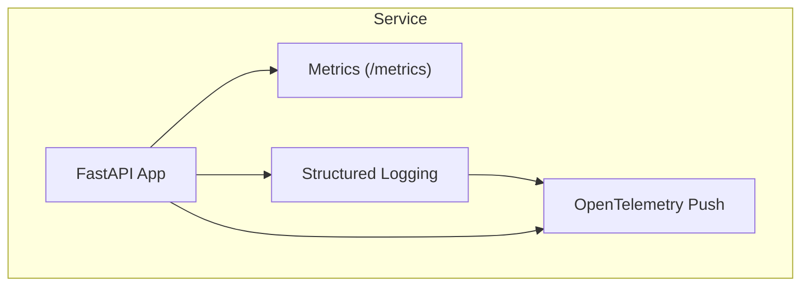
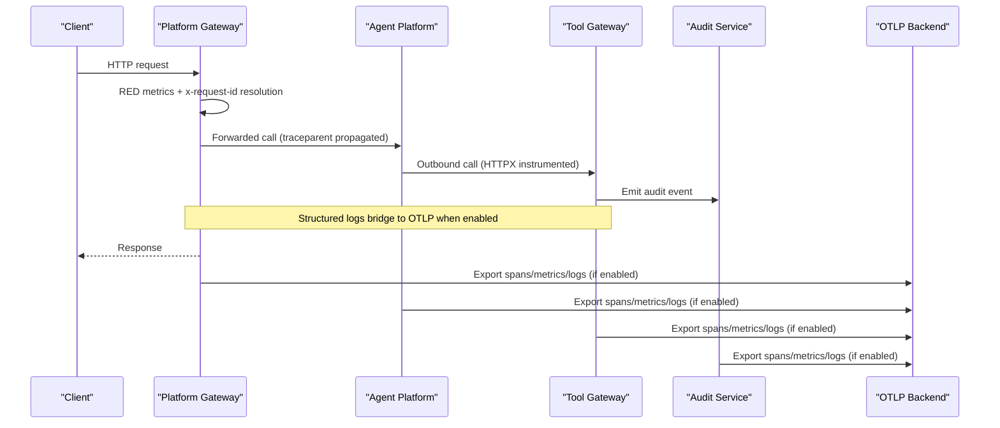
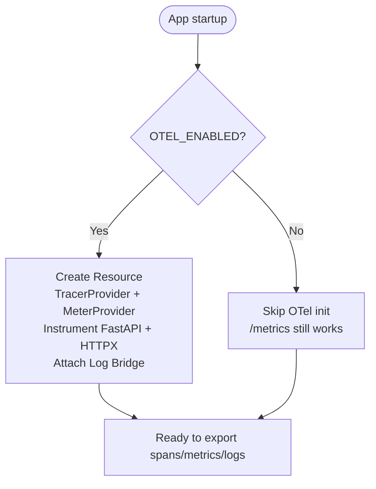
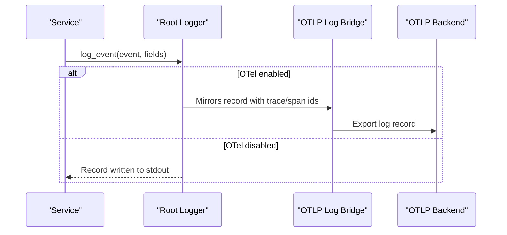
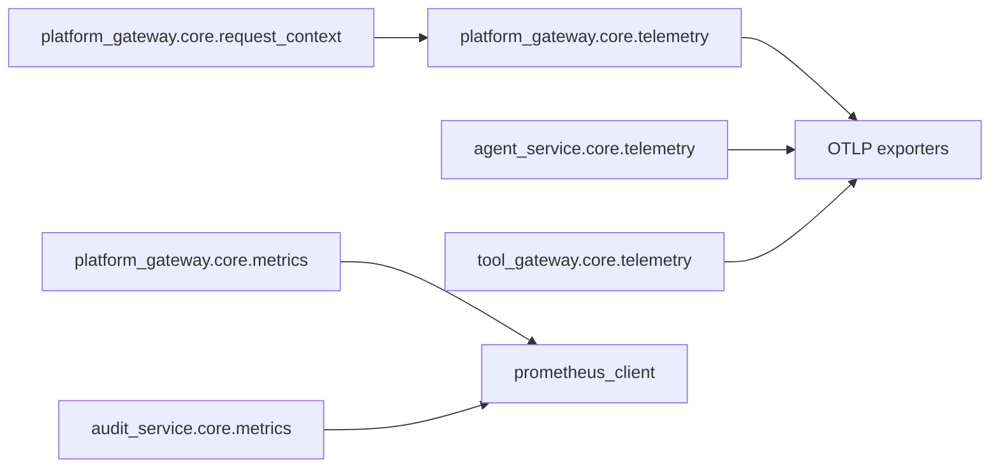

# Monitoring and Observability

<cite>
**Referenced Files in This Document**
- [observability-conventions.md](file://shared/shared-contracts/observability-conventions.md)
- [telemetry.py (platform-gateway)](file://products/platform-gateway/src/platform_gateway/core/telemetry.py)
- [observability.py (platform-gateway)](file://products/platform-gateway/src/platform_gateway/core/observability.py)
- [metrics.py (platform-gateway)](file://products/platform-gateway/src/platform_gateway/core/metrics.py)
- [request_context.py (platform-gateway)](file://products/platform-gateway/src/platform_gateway/core/request_context.py)
- [telemetry.py (agent-platform)](file://products/agent-platform/src/agent_service/core/telemetry.py)
- [observability.py (agent-platform)](file://products/agent-platform/src/agent_service/core/observability.py)
- [metrics.py (audit-service)](file://products/audit-service/src/audit_service/core/metrics.py)
- [telemetry.py (tool-gateway)](file://products/tool-gateway/src/tool_gateway/core/telemetry.py)
</cite>

## Table of Contents
1. [Introduction](#introduction)
2. [Project Structure](#project-structure)
3. [Core Components](#core-components)
4. [Architecture Overview](#architecture-overview)
5. [Detailed Component Analysis](#detailed-component-analysis)
6. [Dependency Analysis](#dependency-analysis)
7. [Performance Considerations](#performance-considerations)
8. [Troubleshooting Guide](#troubleshooting-guide)
9. [Conclusion](#conclusion)
10. [Appendices](#appendices)

## Introduction
This document describes the monitoring and observability model for the Luban AIOPS platform. It explains how OpenTelemetry is integrated across services, how metrics are exposed via a local Prometheus endpoint, how distributed tracing and structured logging are implemented consistently, and how to operate dashboards and alerting on top of these signals. It also documents conventions for metric naming, trace context propagation, log correlation, and health checks.

The platform follows a two-surface design:
- A pull-based /metrics endpoint that is always enabled and collector-independent.
- An opt-in OpenTelemetry push pipeline that exports traces, metrics, and mirrored logs over OTLP HTTP/protobuf to a configured backend.

These surfaces are independent; disabling OTel push does not affect /metrics.

**Section sources**
- [observability-conventions.md:9-16](file://shared/shared-contracts/observability-conventions.md#L9-L16)

## Project Structure
Each service exposes a consistent observability surface through three modules:
- telemetry: optional OpenTelemetry initialization and bridge
- observability: structured logging configuration and helper
- metrics: always-on Prometheus RED metrics and /metrics endpoint

[No sources needed since this diagram shows conceptual workflow, not actual code structure]

## Core Components
- Telemetry module: initializes TracerProvider, MeterProvider, FastAPI instrumentation, HTTP client instrumentation, and an OTLP log bridge when OTEL_ENABLED is true. It fails open if setup errors occur.
- Observability module: configures root logger level to INFO by default so structured audit events are emitted, and provides a structured log_event helper.
- Metrics module: registers a RED middleware and GET /metrics endpoint using prometheus_client with bounded labels.

Key environment variables:
- OTEL_ENABLED: master switch for OTel push
- OTEL_EXPORTER_OTLP_ENDPOINT: OTLP HTTP base URL
- OTEL_EXPORTER_OTLP_HEADERS: authentication headers for the backend
- OTEL_SERVICE_NAME: resource service name
- LOG_LEVEL: overrides root logger level

**Section sources**
- [telemetry.py (platform-gateway):1-133](file://products/platform-gateway/src/platform_gateway/core/telemetry.py#L1-L133)
- [observability.py (platform-gateway):9-24](file://products/platform-gateway/src/platform_gateway/core/observability.py#L9-L24)
- [metrics.py (platform-gateway):1-117](file://products/platform-gateway/src/platform_gateway/core/metrics.py#L1-L117)
- [observability-conventions.md:47-69](file://shared/shared-contracts/observability-conventions.md#L47-L69)

## Architecture Overview
The platform standardizes how each service emits signals and correlates them across boundaries.

**Diagram sources**
- [telemetry.py (platform-gateway):69-117](file://products/platform-gateway/src/platform_gateway/core/telemetry.py#L69-L117)
- [telemetry.py (agent-platform):69-117](file://products/agent-platform/src/agent_service/core/telemetry.py#L69-L117)
- [telemetry.py (tool-gateway):69-117](file://products/tool-gateway/src/tool_gateway/core/telemetry.py#L69-L117)
- [metrics.py (platform-gateway):74-95](file://products/platform-gateway/src/platform_gateway/core/metrics.py#L74-L95)
- [metrics.py (audit-service):85-106](file://products/audit-service/src/audit_service/core/metrics.py#L85-L106)

## Detailed Component Analysis

### OpenTelemetry Integration Pattern
All services implement the same opt-in OTel pipeline:
- Gated by OTEL_ENABLED; disabled means zero overhead and no providers initialized.
- Initializes TracerProvider and MeterProvider once per process with Resource containing service.name.
- Instruments FastAPI and HTTPX clients automatically.
- Attaches an OTLP log bridge to mirror structured logs to the backend while keeping stdout JSON as source of truth.
- current_trace_id() returns the active span’s W3C trace_id when tracing is active.

**Diagram sources**
- [telemetry.py (platform-gateway):28-35](file://products/platform-gateway/src/platform_gateway/core/telemetry.py#L28-L35)
- [telemetry.py (platform-gateway):69-117](file://products/platform-gateway/src/platform_gateway/core/telemetry.py#L69-L117)
- [telemetry.py (agent-platform):69-117](file://products/agent-platform/src/agent_service/core/telemetry.py#L69-L117)
- [telemetry.py (tool-gateway):69-117](file://products/tool-gateway/src/tool_gateway/core/telemetry.py#L69-L117)

**Section sources**
- [telemetry.py (platform-gateway):1-133](file://products/platform-gateway/src/platform_gateway/core/telemetry.py#L1-L133)
- [telemetry.py (agent-platform):1-133](file://products/agent-platform/src/agent_service/core/telemetry.py#L1-L133)
- [telemetry.py (tool-gateway):1-133](file://products/tool-gateway/src/tool_gateway/core/telemetry.py#L1-L133)

### Structured Logging and Log Correlation
- configure_logging sets root logger to INFO by default so audit events are never silently dropped; can be overridden via LOG_LEVEL.
- log_event emits single-line JSON records at INFO level.
- When OTel is enabled, a LoggingHandler bridges these records to OTLP logs, associating them with active spans via trace_id/span_id.
- Request correlation: x-request-id is resolved from inbound header, bridged to active trace_id when tracing is active, or generated as req-uuid4 otherwise.

**Diagram sources**
- [observability.py (platform-gateway):9-24](file://products/platform-gateway/src/platform_gateway/core/observability.py#L9-L24)
- [telemetry.py (platform-gateway):37-66](file://products/platform-gateway/src/platform_gateway/core/telemetry.py#L37-L66)
- [observability-conventions.md:58-69](file://shared/shared-contracts/observability-conventions.md#L58-L69)

**Section sources**
- [observability.py (platform-gateway):9-24](file://products/platform-gateway/src/platform_gateway/core/observability.py#L9-L24)
- [observability.py (agent-platform):9-24](file://products/agent-platform/src/agent_service/core/observability.py#L9-L24)
- [observability-conventions.md:58-76](file://shared/shared-contracts/observability-conventions.md#L58-L76)
- [request_context.py (platform-gateway):8-19](file://products/platform-gateway/src/platform_gateway/core/request_context.py#L8-L19)

### Prometheus Metrics Surface
Every service implements a minimal RED middleware and exposes GET /metrics:
- Counters: http_requests_total with method, handler, status labels
- Histograms: http_request_duration_seconds with method, handler labels
- Domain-specific counters/gauges per service (e.g., policy decisions, token verification, audit ingestion)

Cardinality rules:
- Use templated route path for handler label, never raw URLs
- Use bounded enum labels only (no user/session IDs)

Example service metrics:
- Platform gateway: policy decisions, token verification, delegation exchange/cache, audit emit outcomes
- Audit service: ingest accepted/rejected, queries, summaries, exports, evictions, store errors, store size gauge

**Section sources**
- [metrics.py (platform-gateway):25-65](file://products/platform-gateway/src/platform_gateway/core/metrics.py#L25-L65)
- [metrics.py (platform-gateway):74-117](file://products/platform-gateway/src/platform_gateway/core/metrics.py#L74-L117)
- [metrics.py (audit-service):23-76](file://products/audit-service/src/audit_service/core/metrics.py#L23-L76)
- [metrics.py (audit-service):85-147](file://products/audit-service/src/audit_service/core/metrics.py#L85-L147)
- [observability-conventions.md:18-45](file://shared/shared-contracts/observability-conventions.md#L18-L45)

### Trace Context Propagation and Health Checks
- traceparent (W3C Trace Context) is managed automatically by OpenTelemetry instrumentation across service hops.
- x-request-id is the log- and portal-facing correlation key; bridged to active trace_id when tracing is active, otherwise generated.
- Health endpoints are part of the application surface; /metrics is always available for basic health and debugging.

**Section sources**
- [observability-conventions.md:71-76](file://shared/shared-contracts/observability-conventions.md#L71-L76)
- [request_context.py (platform-gateway):8-19](file://products/platform-gateway/src/platform_gateway/core/request_context.py#L8-L19)
- [metrics.py (platform-gateway):93-95](file://products/platform-gateway/src/platform_gateway/core/metrics.py#L93-L95)

## Dependency Analysis
Services depend on shared conventions and standardized modules:
- All services import their own core/telemetry, core/observability, and core/metrics modules.
- The platform gateway uses its request_context to resolve x-request-id and bridge to trace_id.
- HTTP client calls are instrumented via HTTPX instrumentation to propagate trace context outbound.

**Diagram sources**
- [telemetry.py (platform-gateway):69-117](file://products/platform-gateway/src/platform_gateway/core/telemetry.py#L69-L117)
- [telemetry.py (agent-platform):69-117](file://products/agent-platform/src/agent_service/core/telemetry.py#L69-L117)
- [telemetry.py (tool-gateway):69-117](file://products/tool-gateway/src/tool_gateway/core/telemetry.py#L69-L117)
- [metrics.py (platform-gateway):1-23](file://products/platform-gateway/src/platform_gateway/core/metrics.py#L1-L23)
- [metrics.py (audit-service):1-21](file://products/audit-service/src/audit_service/core/metrics.py#L1-L21)
- [request_context.py (platform-gateway):1-19](file://products/platform-gateway/src/platform_gateway/core/request_context.py#L1-L19)

**Section sources**
- [observability-conventions.md:47-69](file://shared/shared-contracts/observability-conventions.md#L47-L69)
- [telemetry.py (platform-gateway):69-117](file://products/platform-gateway/src/platform_gateway/core/telemetry.py#L69-L117)
- [metrics.py (platform-gateway):74-95](file://products/platform-gateway/src/platform_gateway/core/metrics.py#L74-L95)

## Performance Considerations
- OTel push is off by default; enabling it adds batched export overhead but remains fail-open.
- RED metrics use bounded labels to avoid cardinality explosion.
- Log bridge attaches once per process and detaches OTel internal loggers to prevent recursion.
- Avoid labeling on unbounded values such as raw URLs, user IDs, session IDs, or request IDs.

[No sources needed since this section provides general guidance]

## Troubleshooting Guide
Common issues and resolutions:
- OTel push disabled: verify OTEL_ENABLED is set to a truthy value; check OTEL_EXPORTER_OTLP_ENDPOINT and headers; confirm backend availability.
- Missing correlation: ensure x-request-id is present or tracing is active so it bridges to trace_id; confirm HTTPX instrumentation is enabled for outbound calls.
- No metrics: confirm /metrics endpoint is reachable and not filtered by middleware; validate prometheus scraping configuration.
- High cardinality alerts: review custom metrics for unbounded labels; replace with bounded enums or templated handlers.

Operational checks:
- Confirm root logger level is INFO unless explicitly overridden by LOG_LEVEL.
- Validate that services log “otel telemetry enabled” with service_name and endpoint when OTel is active.

**Section sources**
- [observability-conventions.md:47-69](file://shared/shared-contracts/observability-conventions.md#L47-L69)
- [telemetry.py (platform-gateway):109-117](file://products/platform-gateway/src/platform_gateway/core/telemetry.py#L109-L117)
- [observability.py (platform-gateway):9-19](file://products/platform-gateway/src/platform_gateway/core/observability.py#L9-L19)

## Conclusion
The Luban AIOPS platform standardizes observability across all services with a consistent, opt-in OpenTelemetry push pipeline and an always-on Prometheus /metrics surface. Structured logging is unified and correlated via x-request-id and W3C trace context. By following the documented conventions for metric naming, labels, and correlation, operators can build reliable dashboards and alerting for platform health, performance, business events, and error rates.

[No sources needed since this section summarizes without analyzing specific files]

## Appendices

### Configuration Reference
- OTEL_ENABLED: enable/disable OTel push
- OTEL_EXPORTER_OTLP_ENDPOINT: OTLP HTTP base URL
- OTEL_EXPORTER_OTLP_HEADERS: authentication headers for backend
- OTEL_SERVICE_NAME: resource service name
- LOG_LEVEL: root logger level override

**Section sources**
- [observability-conventions.md:47-55](file://shared/shared-contracts/observability-conventions.md#L47-L55)

### Example Queries and Alert Rules
- HTTP error rate: increase in http_requests_total with status >= 500 grouped by method and handler
- Latency SLO: p95/http_request_duration_seconds by handler exceeds threshold
- Policy enforcement: spike in gateway_policy_decisions_total with decision=deny
- Token verification failures: increase in gateway_token_verification_total{result="invalid"}
- Audit ingestion backlog: audit_events_ingested_total vs audit_query_total growth mismatch
- Store pressure: audit_store_errors_total increases or audit_evicted_total spikes

[No sources needed since this section provides general guidance]