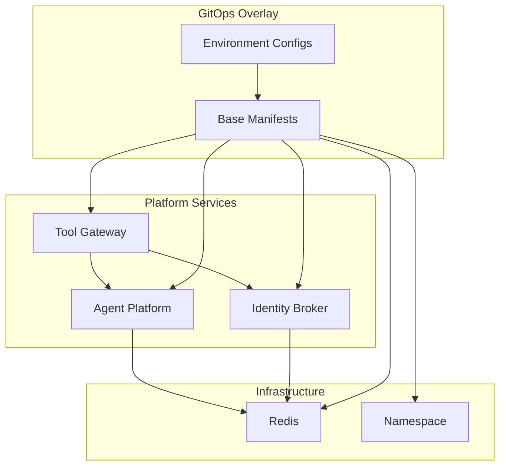
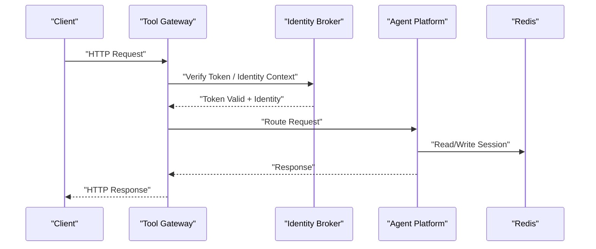
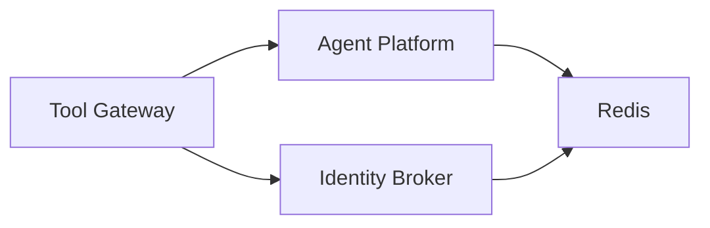

# Operational Procedures

<cite>
**Referenced Files in This Document**
- [README.md](file://README.md)
- [Makefile](file://Makefile)
- [deploy.sh](file://shared/platform-ops/gitops/dev-k8s/deploy.sh)
- [kustomization.yaml](file://shared/platform-ops/gitops/dev-k8s/kustomization.yaml)
- [agent-service-deployment.yaml](file://shared/platform-ops/gitops/dev-k8s/base/agent-platform/agent-service-deployment.yaml)
- [identity-service-deployment.yaml](file://shared/platform-ops/gitops/dev-k8s/base/identity-broker/identity-service-deployment.yaml)
- [api-gateway-deployment.yaml](file://shared/platform-ops/gitops/dev-k8s/base/tool-gateway/api-gateway-deployment.yaml)
- [redis-deployment.yaml](file://shared/platform-ops/gitops/dev-k8s/base/infra/redis-deployment.yaml)
- [runtime-config.env](file://shared/platform-ops/gitops/dev-k8s/base/agent-platform/runtime-config.env)
- [runtime-config.env](file://shared/platform-ops/gitops/dev-k8s/base/identity-broker/runtime-config.env)
- [runtime-config.env](file://shared/platform-ops/gitops/dev-k8s/base/tool-gateway/runtime-config.env)
- [policy.yaml](file://shared/platform-ops/gitops/dev-k8s/base/tool-gateway/policy.yaml)
- [rbac.yaml](file://shared/platform-ops/gitops/dev-k8s/base/tool-gateway/rbac.yaml)
- [namespace.yaml](file://shared/platform-ops/gitops/dev-k8s/base/shared/namespace.yaml)
- [observability.env](file://shared/platform-ops/gitops/dev-k8s/base/shared/observability.env)
- [release-notes/2026-07-26-release-0-runtime-and-dev-k8s-overlays.md](file://docs/agentic-aiops-platform/release-notes/2026-07-26-release-0-runtime-and-dev-k8s-overlays.md)
- [README.md](file://docs/agentic-aiops-platform/release-notes/README.md)
- [agent-platform-runtime-options.md](file://docs/agentic-aiops-platform/agent-platform-runtime-options.md)
- [authorization-matrix.md](file://docs/agentic-aiops-platform/authorization-matrix.md)
- [delivery-roadmap.md](file://docs/agentic-aiops-platform/delivery-roadmap.md)
- [part-2-reference-architecture.md](file://docs/agentic-aiops-platform/part-2-reference-architecture.md)
- [SPEC-005-observability-baseline/spec.md](file://docs/specs/SPEC-005-observability-baseline/spec.md)
- [SPEC-006-session-durability/spec.md](file://docs/specs/SPEC-006-session-durability/spec.md)
- [SPEC-007-tool-execution-framework/spec.md](file://docs/specs/SPEC-007-tool-execution-framework/spec.md)
- [SPEC-008-service-to-service-identity/spec.md](file://docs/specs/SPEC-008-service-to-service-identity/spec.md)
- [app.py](file://products/agent-platform/src/agent_platform/app.py)
- [main.py](file://products/agent-platform/src/agent_platform/main.py)
- [config.py](file://products/agent-platform/src/agent_platform/core/config.py)
- [metrics.py](file://products/agent-platform/src/agent_platform/core/metrics.py)
- [observability.py](file://products/agent-platform/src/agent_platform/core/observability.py)
- [telemetry.py](file://products/agent-platform/src/agent_platform/core/telemetry.py)
- [runtime_service.py](file://products/agent-platform/src/agent_platform/services/runtime_service.py)
- [session_service.py](file://products/agent-platform/src/agent_platform/services/session_service.py)
- [session_store.py](file://products/agent-platform/src/agent_platform/services/session_store.py)
- [routes.py](file://products/agent-platform/src/agent_platform/api/v2/routes.py)
- [app.py](file://products/identity-broker/src/identity_service/app.py)
- [main.py](file://products/identity-broker/src/identity_service/main.py)
- [config.py](file://products/identity-broker/src/identity_service/core/config.py)
- [metrics.py](file://products/identity-broker/src/identity_service/core/metrics.py)
- [observability.py](file://products/identity-broker/src/identity_service/core/observability.py)
- [telemetry.py](file://products/identity-broker/src/identity_service/core/telemetry.py)
- [identity_service.py](file://products/identity-broker/src/identity_service/services/identity_service.py)
- [token_service.py](file://products/identity-broker/src/identity_service/services/token_service.py)
- [auth.py](file://products/identity-broker/src/identity_service/api/routes/auth.py)
- [health.py](file://products/identity-broker/src/identity_service/api/routes/health.py)
- [identity.py](file://products/identity-broker/src/identity_service/api/routes/identity.py)
- [app.py](file://products/tool-gateway/src/api_gateway/app.py)
- [main.py](file://products/tool-gateway/src/api_gateway/main.py)
- [config.py](file://products/tool-gateway/src/api_gateway/core/config.py)
- [metrics.py](file://products/tool-gateway/src/api_gateway/core/metrics.py)
- [observability.py](file://products/tool-gateway/src/api_gateway/core/observability.py)
- [telemetry.py](file://products/tool-gateway/src/api_gateway/core/telemetry.py)
- [gateway_service.py](file://products/tool-gateway/src/api_gateway/services/gateway_service.py)
- [policy_engine.py](file://products/tool-gateway/src/api_gateway/services/policy_engine.py)
- [token_verifier.py](file://products/tool-gateway/src/api_gateway/services/token_verifier.py)
- [agent_client.py](file://products/tool-gateway/src/api_gateway/services/agent_client.py)
- [auth.py](file://products/tool-gateway/src/api_gateway/api/routes/auth.py)
- [chat.py](file://products/tool-gateway/src/api_gateway/api/routes/chat.py)
- [health.py](file://products/tool-gateway/src/api_gateway/api/routes/health.py)
- [identity.py](file://products/tool-gateway/src/api_gateway/api/routes/identity.py)
- [runtime.py](file://products/tool-gateway/src/api_gateway/api/routes/runtime.py)
- [sessions.py](file://products/tool-gateway/src/api_gateway/api/routes/sessions.py)
- [tools.py](file://products/tool-gateway/src/api_gateway/api/routes/tools.py)
</cite>

## Table of Contents
1. [Introduction](#introduction)
2. [Project Structure](#project-structure)
3. [Core Components](#core-components)
4. [Architecture Overview](#architecture-overview)
5. [Detailed Component Analysis](#detailed-component-analysis)
6. [Dependency Analysis](#dependency-analysis)
7. [Performance Considerations](#performance-considerations)
8. [Troubleshooting Guide](#troubleshooting-guide)
9. [Conclusion](#conclusion)
10. [Appendices](#appendices)

## Introduction
This document provides operational procedures for the Luban AIOps Platform, focusing on day-2 operations: service updates, rolling deployments, rollbacks, capacity planning, scaling, resource optimization, disaster recovery, backups, data migration, maintenance windows, upgrades, emergency response, and runbooks for common scenarios such as restarts, configuration changes, and incident response. It is intended for platform operators, SREs, and DevOps engineers who manage the platform in Kubernetes environments using GitOps overlays.

## Project Structure
The platform is organized into product services (Agent Platform, Identity Broker, Tool Gateway), shared infrastructure definitions (Kubernetes manifests via Kustomize), and operational scripts. The GitOps overlay under shared/platform-ops/gitops/dev-k8s defines base resources and environment-specific configurations. Services expose health endpoints and are instrumented with metrics and observability hooks.

**Diagram sources**
- [agent-service-deployment.yaml](file://shared/platform-ops/gitops/dev-k8s/base/agent-platform/agent-service-deployment.yaml)
- [identity-service-deployment.yaml](file://shared/platform-ops/gitops/dev-k8s/base/identity-broker/identity-service-deployment.yaml)
- [api-gateway-deployment.yaml](file://shared/platform-ops/gitops/dev-k8s/base/tool-gateway/api-gateway-deployment.yaml)
- [redis-deployment.yaml](file://shared/platform-ops/gitops/dev-k8s/base/infra/redis-deployment.yaml)
- [namespace.yaml](file://shared/platform-ops/gitops/dev-k8s/base/shared/namespace.yaml)
- [kustomization.yaml](file://shared/platform-ops/gitops/dev-k8s/kustomization.yaml)

**Section sources**
- [README.md](file://README.md)
- [kustomization.yaml](file://shared/platform-ops/gitops/dev-k8s/kustomization.yaml)
- [deploy.sh](file://shared/platform-ops/gitops/dev-k8s/deploy.sh)

## Core Components
- Agent Platform: Provides runtime orchestration, session management, and agent execution. Exposes API routes and integrates with providers.
- Identity Broker: Handles authentication, identity context, and token issuance/validation.
- Tool Gateway: Central API gateway enforcing policies, verifying tokens, and routing requests to agents and tools.
- Shared Infrastructure: Redis for sessions/state, namespace scoping, and observability configuration.

Operational implications:
- Each service exposes health endpoints for readiness/liveness checks.
- Configuration is externalized via environment files and config modules.
- Observability and metrics are enabled by default across services.

**Section sources**
- [app.py](file://products/agent-platform/src/agent_platform/app.py)
- [main.py](file://products/agent-platform/src/agent_platform/main.py)
- [config.py](file://products/agent-platform/src/agent_platform/core/config.py)
- [metrics.py](file://products/agent-platform/src/agent_platform/core/metrics.py)
- [observability.py](file://products/agent-platform/src/agent_platform/core/observability.py)
- [telemetry.py](file://products/agent-platform/src/agent_platform/core/telemetry.py)
- [runtime_service.py](file://products/agent-platform/src/agent_platform/services/runtime_service.py)
- [session_service.py](file://products/agent-platform/src/agent_platform/services/session_service.py)
- [session_store.py](file://products/agent-platform/src/agent_platform/services/session_store.py)
- [routes.py](file://products/agent-platform/src/agent_platform/api/v2/routes.py)
- [app.py](file://products/identity-broker/src/identity_service/app.py)
- [main.py](file://products/identity-broker/src/identity_service/main.py)
- [config.py](file://products/identity-broker/src/identity_service/core/config.py)
- [metrics.py](file://products/identity-broker/src/identity_service/core/metrics.py)
- [observability.py](file://products/identity-broker/src/identity_service/core/observability.py)
- [telemetry.py](file://products/identity-broker/src/identity_service/core/telemetry.py)
- [identity_service.py](file://products/identity-broker/src/identity_service/services/identity_service.py)
- [token_service.py](file://products/identity-broker/src/identity_service/services/token_service.py)
- [auth.py](file://products/identity-broker/src/identity_service/api/routes/auth.py)
- [health.py](file://products/identity-broker/src/identity_service/api/routes/health.py)
- [identity.py](file://products/identity-broker/src/identity_service/api/routes/identity.py)
- [app.py](file://products/tool-gateway/src/api_gateway/app.py)
- [main.py](file://products/tool-gateway/src/api_gateway/main.py)
- [config.py](file://products/tool-gateway/src/api_gateway/core/config.py)
- [metrics.py](file://products/tool-gateway/src/api_gateway/core/metrics.py)
- [observability.py](file://products/tool-gateway/src/api_gateway/core/observability.py)
- [telemetry.py](file://products/tool-gateway/src/api_gateway/core/telemetry.py)
- [gateway_service.py](file://products/tool-gateway/src/api_gateway/services/gateway_service.py)
- [policy_engine.py](file://products/tool-gateway/src/api_gateway/services/policy_engine.py)
- [token_verifier.py](file://products/tool-gateway/src/api_gateway/services/token_verifier.py)
- [agent_client.py](file://products/tool-gateway/src/api_gateway/services/agent_client.py)
- [auth.py](file://products/tool-gateway/src/api_gateway/api/routes/auth.py)
- [chat.py](file://products/tool-gateway/src/api_gateway/api/routes/chat.py)
- [health.py](file://products/tool-gateway/src/api_gateway/api/routes/health.py)
- [identity.py](file://products/tool-gateway/src/api_gateway/api/routes/identity.py)
- [runtime.py](file://products/tool-gateway/src/api_gateway/api/routes/runtime.py)
- [sessions.py](file://products/tool-gateway/src/api_gateway/api/routes/sessions.py)
- [tools.py](file://products/tool-gateway/src/api_gateway/api/routes/tools.py)

## Architecture Overview
The platform follows a layered architecture:
- Tool Gateway: Ingress point, policy enforcement, token verification, and request routing.
- Identity Broker: Authentication and identity token lifecycle.
- Agent Platform: Runtime orchestration, session persistence, and tool execution.
- Redis: Stateful store for sessions and transient state.

**Diagram sources**
- [api-gateway-deployment.yaml](file://shared/platform-ops/gitops/dev-k8s/base/tool-gateway/api-gateway-deployment.yaml)
- [identity-service-deployment.yaml](file://shared/platform-ops/gitops/dev-k8s/base/identity-broker/identity-service-deployment.yaml)
- [agent-service-deployment.yaml](file://shared/platform-ops/gitops/dev-k8s/base/agent-platform/agent-service-deployment.yaml)
- [redis-deployment.yaml](file://shared/platform-ops/gitops/dev-k8s/base/infra/redis-deployment.yaml)

## Detailed Component Analysis

### Service Updates and Rolling Deployments
- Update container images or configuration in the GitOps overlay manifests.
- Apply changes through the deployment script which reconciles Kustomize overlays.
- Use rolling update strategies defined in deployment manifests to ensure zero downtime.

Recommended steps:
1. Modify image tags or environment variables in the relevant deployment YAMLs.
2. Validate changes with the verify script if available.
3. Run the deploy script to apply changes.
4. Monitor rollout status and health endpoints.

Rollback procedure:
- Revert manifest changes to the previous known-good version.
- Re-run the deploy script to reconcile back to the prior state.
- Verify service health and error rates.

**Section sources**
- [deploy.sh](file://shared/platform-ops/gitops/dev-k8s/deploy.sh)
- [agent-service-deployment.yaml](file://shared/platform-ops/gitops/dev-k8s/base/agent-platform/agent-service-deployment.yaml)
- [identity-service-deployment.yaml](file://shared/platform-ops/gitops/dev-k8s/base/identity-broker/identity-service-deployment.yaml)
- [api-gateway-deployment.yaml](file://shared/platform-ops/gitops/dev-k8s/base/tool-gateway/api-gateway-deployment.yaml)

### Capacity Planning and Scaling Operations
- Review current resource requests/limits in deployment manifests.
- Adjust replica counts based on traffic patterns and performance metrics.
- Scale horizontally by increasing replicas; scale vertically by adjusting CPU/memory limits.
- Ensure Redis has sufficient resources and persistence configured for session durability.

Scaling checklist:
- Confirm autoscaling policies (if any) align with workload characteristics.
- Validate that downstream dependencies (Redis, identity broker) can handle increased load.
- Monitor latency and error rates post-scale.

**Section sources**
- [agent-service-deployment.yaml](file://shared/platform-ops/gitops/dev-k8s/base/agent-platform/agent-service-deployment.yaml)
- [identity-service-deployment.yaml](file://shared/platform-ops/gitops/dev-k8s/base/identity-broker/identity-service-deployment.yaml)
- [api-gateway-deployment.yaml](file://shared/platform-ops/gitops/dev-k8s/base/tool-gateway/api-gateway-deployment.yaml)
- [redis-deployment.yaml](file://shared/platform-ops/gitops/dev-k8s/base/infra/redis-deployment.yaml)

### Resource Optimization Techniques
- Tune CPU and memory requests/limits to reduce over-provisioning while maintaining headroom.
- Enable connection pooling where applicable (e.g., Redis clients).
- Use readiness probes to prevent traffic to unhealthy pods during startup.
- Leverage observability metrics to identify bottlenecks and optimize accordingly.

**Section sources**
- [metrics.py](file://products/agent-platform/src/agent_platform/core/metrics.py)
- [observability.py](file://products/agent-platform/src/agent_platform/core/observability.py)
- [telemetry.py](file://products/agent-platform/src/agent_platform/core/telemetry.py)
- [metrics.py](file://products/identity-broker/src/identity_service/core/metrics.py)
- [observability.py](file://products/identity-broker/src/identity_service/core/observability.py)
- [telemetry.py](file://products/identity-broker/src/identity_service/core/telemetry.py)
- [metrics.py](file://products/tool-gateway/src/api_gateway/core/metrics.py)
- [observability.py](file://products/tool-gateway/src/api_gateway/core/observability.py)
- [telemetry.py](file://products/tool-gateway/src/api_gateway/core/telemetry.py)

### Disaster Recovery and Backup Strategies
- Back up Redis data regularly using persistence mechanisms and snapshotting.
- Maintain immutable versions of GitOps manifests to enable rapid restoration.
- Document restore procedures for each service’s configuration and state.
- Test disaster recovery drills periodically to validate RTO/RPO targets.

Backup checklist:
- Schedule automated snapshots for Redis.
- Version control all configuration and deployment manifests.
- Store backups in secure, geographically separate locations.

**Section sources**
- [redis-deployment.yaml](file://shared/platform-ops/gitops/dev-k8s/base/infra/redis-deployment.yaml)
- [kustomization.yaml](file://shared/platform-ops/gitops/dev-k8s/kustomization.yaml)

### Data Migration Processes
- For schema changes in session stores or configuration, implement backward-compatible migrations.
- Use feature flags to gradually roll out changes.
- Validate data integrity post-migration with checksums or consistency checks.
- Rollback plan includes reverting schema changes and restoring from backup.

**Section sources**
- [session_store.py](file://products/agent-platform/src/agent_platform/services/session_store.py)
- [session_service.py](file://products/agent-platform/src/agent_platform/services/session_service.py)

### Maintenance Windows and Upgrade Procedures
- Schedule maintenance during low-traffic periods.
- Notify stakeholders in advance.
- Perform incremental upgrades with validation at each step.
- Have rollback procedures ready in case of issues.

Upgrade checklist:
- Pre-flight checks for dependencies.
- Apply changes in stages (e.g., dev, staging, prod).
- Post-upgrade validation with health checks and metrics.

**Section sources**
- [deploy.sh](file://shared/platform-ops/gitops/dev-k8s/deploy.sh)
- [release-notes/2026-07-26-release-0-runtime-and-dev-k8s-overlays.md](file://docs/agentic-aiops-platform/release-notes/2026-07-26-release-0-runtime-and-dev-k8s-overlays.md)

### Emergency Response Protocols
- Define clear escalation paths and communication channels.
- Implement automated alerts for critical failures.
- Use runbooks to guide responders through common incidents.
- Conduct post-mortems to improve resilience.

**Section sources**
- [health.py](file://products/identity-broker/src/identity_service/api/routes/health.py)
- [health.py](file://products/tool-gateway/src/api_gateway/api/routes/health.py)

### Operational Runbooks

#### Service Restarts
- Identify the failing service and pod.
- Restart the pod or deployment using Kubernetes commands.
- Verify health endpoints and logs.

Steps:
1. Check pod status and events.
2. Restart affected pods.
3. Monitor for stability.

**Section sources**
- [agent-service-deployment.yaml](file://shared/platform-ops/gitops/dev-k8s/base/agent-platform/agent-service-deployment.yaml)
- [identity-service-deployment.yaml](file://shared/platform-ops/gitops/dev-k8s/base/identity-broker/identity-service-deployment.yaml)
- [api-gateway-deployment.yaml](file://shared/platform-ops/gitops/dev-k8s/base/tool-gateway/api-gateway-deployment.yaml)

#### Configuration Changes
- Update environment variables or config files in GitOps overlays.
- Apply changes and validate configuration loading.
- Monitor for errors and revert if necessary.

Steps:
1. Edit runtime-config.env or config modules.
2. Apply changes via deploy script.
3. Validate service behavior.

**Section sources**
- [runtime-config.env](file://shared/platform-ops/gitops/dev-k8s/base/agent-platform/runtime-config.env)
- [runtime-config.env](file://shared/platform-ops/gitops/dev-k8s/base/identity-broker/runtime-config.env)
- [runtime-config.env](file://shared/platform-ops/gitops/dev-k8s/base/tool-gateway/runtime-config.env)
- [config.py](file://products/agent-platform/src/agent_platform/core/config.py)
- [config.py](file://products/identity-broker/src/identity_service/core/config.py)
- [config.py](file://products/tool-gateway/src/api_gateway/core/config.py)

#### Incident Response Procedures
- Detect anomalies via monitoring and alerts.
- Triage and isolate affected components.
- Execute remediation steps from runbooks.
- Communicate status updates to stakeholders.

**Section sources**
- [metrics.py](file://products/tool-gateway/src/api_gateway/core/metrics.py)
- [observability.py](file://products/tool-gateway/src/api_gateway/core/observability.py)
- [telemetry.py](file://products/tool-gateway/src/api_gateway/core/telemetry.py)

## Dependency Analysis
Services depend on shared infrastructure and each other:
- Tool Gateway depends on Identity Broker and Agent Platform.
- Agent Platform and Identity Broker depend on Redis.
- All services share common observability and configuration patterns.

**Diagram sources**
- [api-gateway-deployment.yaml](file://shared/platform-ops/gitops/dev-k8s/base/tool-gateway/api-gateway-deployment.yaml)
- [identity-service-deployment.yaml](file://shared/platform-ops/gitops/dev-k8s/base/identity-broker/identity-service-deployment.yaml)
- [agent-service-deployment.yaml](file://shared/platform-ops/gitops/dev-k8s/base/agent-platform/agent-service-deployment.yaml)
- [redis-deployment.yaml](file://shared/platform-ops/gitops/dev-k8s/base/infra/redis-deployment.yaml)

**Section sources**
- [kustomization.yaml](file://shared/platform-ops/gitops/dev-k8s/kustomization.yaml)

## Performance Considerations
- Monitor key metrics: latency, throughput, error rates, resource utilization.
- Optimize database connections and caching strategies.
- Use profiling tools to identify hotspots.
- Implement rate limiting and circuit breakers where appropriate.

[No sources needed since this section provides general guidance]

## Troubleshooting Guide
Common issues and resolutions:
- Health endpoint failures: Check service logs and dependencies.
- High latency: Investigate downstream calls and resource constraints.
- Authentication errors: Validate token issuance and verification flows.
- Session loss: Ensure Redis persistence and connectivity.

Diagnostic steps:
- Inspect pod logs and events.
- Verify network policies and RBAC.
- Check configuration correctness and secrets.

**Section sources**
- [health.py](file://products/identity-broker/src/identity_service/api/routes/health.py)
- [health.py](file://products/tool-gateway/src/api_gateway/api/routes/health.py)
- [token_verifier.py](file://products/tool-gateway/src/api_gateway/services/token_verifier.py)
- [session_store.py](file://products/agent-platform/src/agent_platform/services/session_store.py)

## Conclusion
This document outlines comprehensive operational procedures for managing the Luban AIOps Platform. By following these guidelines, operators can ensure reliable deployments, efficient scaling, robust disaster recovery, and effective incident response. Continuous monitoring and iterative improvements are essential for maintaining platform stability and performance.

[No sources needed since this section summarizes without analyzing specific files]

## Appendices

### Reference Architecture and Specifications
- Reference architecture overview and design decisions.
- Observability baseline and telemetry conventions.
- Session durability and policy enforcement specifications.

**Section sources**
- [part-2-reference-architecture.md](file://docs/agentic-aiops-platform/part-2-reference-architecture.md)
- [SPEC-005-observability-baseline/spec.md](file://docs/specs/SPEC-005-observability-baseline/spec.md)
- [SPEC-006-session-durability/spec.md](file://docs/specs/SPEC-006-session-durability/spec.md)
- [SPEC-007-tool-execution-framework/spec.md](file://docs/specs/SPEC-007-tool-execution-framework/spec.md)
- [SPEC-008-service-to-service-identity/spec.md](file://docs/specs/SPEC-008-service-to-service-identity/spec.md)

### Authorization and Policy Enforcement
- Authorization matrix and policy rules.
- RBAC configurations for tool gateway access.

**Section sources**
- [authorization-matrix.md](file://docs/agentic-aiops-platform/authorization-matrix.md)
- [policy.yaml](file://shared/platform-ops/gitops/dev-k8s/base/tool-gateway/policy.yaml)
- [rbac.yaml](file://shared/platform-ops/gitops/dev-k8s/base/tool-gateway/rbac.yaml)

### Release Notes and Roadmap
- Recent release notes and future delivery plans.

**Section sources**
- [release-notes/2026-07-26-release-0-runtime-and-dev-k8s-overlays.md](file://docs/agentic-aiops-platform/release-notes/2026-07-26-release-0-runtime-and-dev-k8s-overlays.md)
- [README.md](file://docs/agentic-aiops-platform/release-notes/README.md)
- [delivery-roadmap.md](file://docs/agentic-aiops-platform/delivery-roadmap.md)