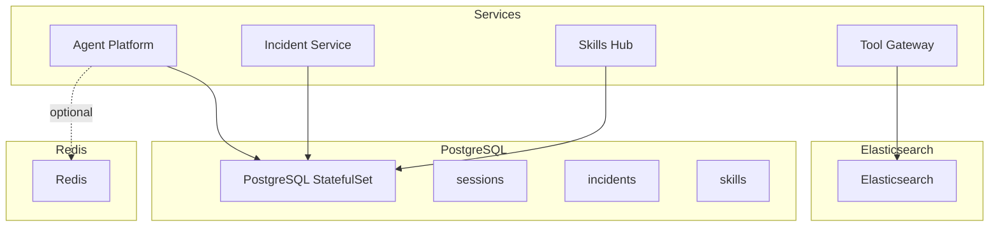
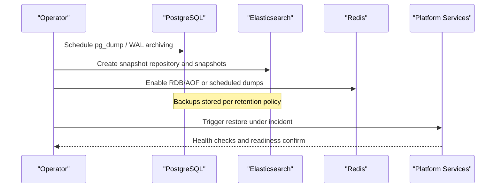
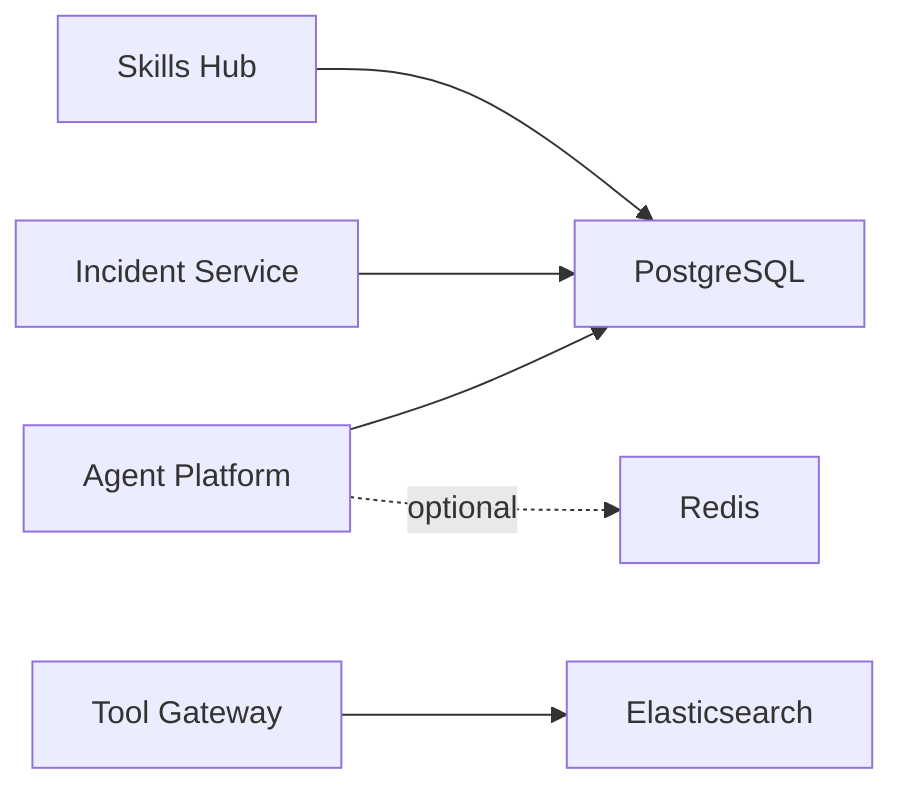

# Backup and Recovery

<cite>
**Referenced Files in This Document**
- [postgres-statefulset.yaml](file://shared/platform-ops/gitops/dev-k8s/base/infra/postgres-statefulset.yaml)
- [create-sessions-db.sql](file://shared/platform-ops/gitops/dev-k8s/base/infra/create-sessions-db.sql)
- [create-incidents-db.sql](file://shared/platform-ops/gitops/dev-k8s/base/infra/create-incidents-db.sql)
- [create-skills-db.sql](file://shared/platform-ops/gitops/dev-k8s/base/infra/create-skills-db.sql)
- [sync-sessions-db.sh](file://shared/platform-ops/gitops/sync-sessions-db.sh)
- [session_store.py](file://products/agent-platform/src/agent_service/services/session_store.py)
- [incident_store.py](file://products/incident-service/src/incident_service/services/incident_store.py)
- [skill_store.py](file://products/skills-hub/src/skills_hub/services/skill_store.py)
- [elastic_connector.py](file://products/tool-gateway/src/tool_gateway/tools/elastic_connector.py)
- [retention.py](file://products/audit-service/src/audit_service/services/retention.py)
- [test_retention.py](file://products/audit-service/tests/test_retention.py)
- [SPEC-016-session-store-postgres-separation/spec.md](file://docs/specs/SPEC-016-session-store-postgres-separation/spec.md)
- [SPEC-013-durable-audit-trail/spec.md](file://docs/specs/SPEC-013-durable-audit-trail/spec.md)
</cite>

## Table of Contents
1. [Introduction](#introduction)
2. [Project Structure](#project-structure)
3. [Core Components](#core-components)
4. [Architecture Overview](#architecture-overview)
5. [Detailed Component Analysis](#detailed-component-analysis)
6. [Dependency Analysis](#dependency-analysis)
7. [Performance Considerations](#performance-considerations)
8. [Troubleshooting Guide](#troubleshooting-guide)
9. [Conclusion](#conclusion)
10. [Appendices](#appendices)

## Introduction
This document defines backup and recovery procedures for the Luban AIOPS platform data stores: PostgreSQL (sessions, incidents, skills), Elasticsearch (audit logs and search indices), and Redis cache. It covers full and incremental backups, point-in-time recovery (PITR), scheduling, retention, storage locations, recovery runbooks for common failure scenarios, validation procedures, and RPO/RTO targets.

## Project Structure
The platform uses:
- PostgreSQL for durable state: sessions (agent-platform), incidents (incident-service), and skills (skills-hub).
- Elasticsearch via tool-gateway for audit log search and service health queries.
- Redis for session caching and kernel state; sessions can also persist to Postgres when configured.

**Diagram sources**
- [postgres-statefulset.yaml:1-63](file://shared/platform-ops/gitops/dev-k8s/base/infra/postgres-statefulset.yaml#L1-L63)
- [session_store.py:949-1027](file://products/agent-platform/src/agent_service/services/session_store.py#L949-L1027)
- [incident_store.py:508-516](file://products/incident-service/src/incident_service/services/incident_store.py#L508-L516)
- [skill_store.py:251-284](file://products/skills-hub/src/skills_hub/services/skill_store.py#L251-L284)
- [elastic_connector.py:40-96](file://products/tool-gateway/src/tool_gateway/tools/elastic_connector.py#L40-L96)

**Section sources**
- [postgres-statefulset.yaml:1-63](file://shared/platform-ops/gitops/dev-k8s/base/infra/postgres-statefulset.yaml#L1-L63)
- [create-sessions-db.sql:1-6](file://shared/platform-ops/gitops/dev-k8s/base/infra/create-sessions-db.sql#L1-L6)
- [create-incidents-db.sql:1-5](file://shared/platform-ops/gitops/dev-k8s/base/infra/create-incidents-db.sql#L1-L5)
- [create-skills-db.sql:1-5](file://shared/platform-ops/gitops/dev-k8s/base/infra/create-skills-db.sql#L1-L5)

## Core Components
- PostgreSQL is deployed as a StatefulSet with persistent volumes for all three databases. Databases are created on fresh clusters via init scripts and idempotently provisioned for existing clusters.
- Agent Platform selects session store backend at runtime (memory, redis, postgres) and falls back to memory if Postgres or Redis is unreachable.
- Incident Service and Skills Hub select Postgres backends based on settings and initialize schema on startup.
- Tool Gateway connects to Elasticsearch lazily and exposes read-only tools for searching logs and retrieving service health.
- Audit Service enforces retention by evicting old events on a bounded schedule.

**Section sources**
- [session_store.py:949-1027](file://products/agent-platform/src/agent_service/services/session_store.py#L949-L1027)
- [incident_store.py:308-322](file://products/incident-service/src/incident_service/services/incident_store.py#L308-L322)
- [skill_store.py:251-284](file://products/skills-hub/src/skills_hub/services/skill_store.py#L251-L284)
- [elastic_connector.py:61-96](file://products/tool-gateway/src/tool_gateway/tools/elastic_connector.py#L61-L96)
- [retention.py:27-75](file://products/audit-service/src/audit_service/services/retention.py#L27-L75)

## Architecture Overview
Backup and recovery touch multiple layers:
- PostgreSQL: use native logical backups (pg_dump/pg_dumpall) and WAL-based PITR where supported.
- Elasticsearch: snapshot-and-restore using repository-backed snapshots.
- Redis: RDB/AOF persistence and/or periodic dumps depending on deployment.

[No sources needed since this diagram shows conceptual workflow, not actual code structure]

## Detailed Component Analysis

### PostgreSQL Backup and Recovery
- Data stores:
  - Sessions database used by agent-platform session store.
  - Incidents database used by incident-service.
  - Skills database used by skills-hub.
- Storage:
  - Persistent volume mounted at the Postgres data directory.
  - Init scripts create databases on fresh clusters; existing clusters are provisioned idempotently.

Operational guidance:
- Full backups:
  - Use pg_dump or pg_dumpall against each database (sessions, incidents, skills) on a regular cadence aligned with your RPO.
  - Store backups off-cluster with integrity verification (checksums) and retention per policy.
- Incremental backups and PITR:
  - If your Postgres deployment supports WAL archiving, enable continuous WAL shipping and configure a recovery target timeline.
  - For point-in-time recovery, restore from the latest full backup and replay WAL up to the desired timestamp.
- Scheduling and retention:
  - Schedule full backups at intervals that meet RPO.
  - Retain backups according to compliance needs; keep at least one recent full backup plus enough WAL segments to reach RPO.
- Storage location management:
  - On-premises: write backups to a secure, replicated storage system with access controls.
  - Cloud: use object storage with versioning and lifecycle policies for retention.

Recovery procedures:
- Accidental deletion:
  - Restore the affected database from the most recent full backup consistent with RPO.
  - If WAL archives exist, replay to the moment before deletion.
- Corruption recovery:
  - Restore from the last known good full backup.
  - Replay WAL forward to minimize data loss.
- Disaster recovery across clusters:
  - Restore to a new cluster, reinitialize schemas (idempotent on startup), and verify connectivity.
  - Reconfigure services to point to the restored database.

Validation:
- Verify database integrity after restore (e.g., count rows, spot-check critical tables).
- Run service health checks to ensure connections succeed.

**Section sources**
- [postgres-statefulset.yaml:16-63](file://shared/platform-ops/gitops/dev-k8s/base/infra/postgres-statefulset.yaml#L16-L63)
- [create-sessions-db.sql:1-6](file://shared/platform-ops/gitops/dev-k8s/base/infra/create-sessions-db.sql#L1-L6)
- [create-incidents-db.sql:1-5](file://shared/platform-ops/gitops/dev-k8s/base/infra/create-incidents-db.sql#L1-L5)
- [create-skills-db.sql:1-5](file://shared/platform-ops/gitops/dev-k8s/base/infra/create-skills-db.sql#L1-L5)
- [sync-sessions-db.sh:23-46](file://shared/platform-ops/gitops/sync-sessions-db.sh#L23-L46)

### PostgreSQL Session Store Specifics
- The agent-platform session store can be backed by Postgres, Redis, or memory. When Postgres is selected, it requires a DSN and initializes schema on startup. Fail-open behavior falls back to in-memory if Postgres is unreachable.
- Sessions are ephemeral working state with TTL-based expiry; long-term durability is less critical than availability.

Operational notes:
- Ensure SESSION_DB_URL is set when using Postgres backend.
- Monitor fallback metrics to detect Postgres outages.

**Section sources**
- [session_store.py:936-946](file://products/agent-platform/src/agent_service/services/session_store.py#L936-L946)
- [session_store.py:949-1027](file://products/agent-platform/src/agent_service/services/session_store.py#L949-L1027)
- [SPEC-016-session-store-postgres-separation/spec.md:73-118](file://docs/specs/SPEC-016-session-store-postgres-separation/spec.md#L73-L118)

### PostgreSQL Incidents and Skills Stores
- Incident Service and Skills Hub select Postgres backends based on settings and initialize schema idempotently on startup.
- Both rely on Postgres for durable state and should be included in full and incremental backups.

Operational notes:
- Confirm DATABASE_URL configuration points to the correct databases.
- Validate schema initialization on first run.

**Section sources**
- [incident_store.py:308-322](file://products/incident-service/src/incident_service/services/incident_store.py#L308-L322)
- [incident_store.py:508-516](file://products/incident-service/src/incident_service/services/incident_store.py#L508-L516)
- [skill_store.py:251-284](file://products/skills-hub/src/skills_hub/services/skill_store.py#L251-L284)

### Elasticsearch Backup and Restore
- Tool Gateway connects lazily to Elasticsearch and provides read-only tools for searching logs and retrieving service health.
- Backups should use Elasticsearch snapshot-and-restore with a managed repository.

Operational guidance:
- Configure a snapshot repository (local or cloud-managed).
- Schedule periodic snapshots aligned with audit retention and RPO.
- Restore indices by registering the repository and restoring from a snapshot.

Validation:
- After restore, verify index metadata and sample documents.
- Confirm Tool Gateway can connect and execute read-only tools successfully.

**Section sources**
- [elastic_connector.py:61-96](file://products/tool-gateway/src/tool_gateway/tools/elastic_connector.py#L61-L96)
- [elastic_connector.py:106-149](file://products/tool-gateway/src/tool_gateway/tools/elastic_connector.py#L106-L149)
- [elastic_connector.py:328-379](file://products/tool-gateway/src/tool_gateway/tools/elastic_connector.py#L328-L379)

### Redis Cache Backup Considerations
- Redis may hold transient session or kernel state. Depending on deployment, enable RDB/AOF persistence or scheduled dumps.
- For cold start recovery, ensure Redis is restored or rebuilt so services can reconnect without data loss beyond acceptable RPO.

Operational notes:
- Treat Redis as recoverable cache; do not rely on it for durable state unless explicitly configured otherwise.
- Validate connectivity after restore and monitor for fallback behaviors in services.

[No sources needed since this section provides general guidance]

### Audit Retention and Bounded Growth
- Audit Service runs a retention task that evicts events older than a configurable window and enforces a hard cap on total events.
- This limits growth and reduces backup size while preserving recent audit history.

Operational notes:
- Tune retention days and max events to balance compliance and storage costs.
- Monitor eviction metrics and logs.

**Section sources**
- [retention.py:27-75](file://products/audit-service/src/audit_service/services/retention.py#L27-L75)
- [SPEC-013-durable-audit-trail/spec.md:86-95](file://docs/specs/SPEC-013-durable-audit-trail/spec.md#L86-L95)
- [test_retention.py:32-76](file://products/audit-service/tests/test_retention.py#L32-L76)

## Dependency Analysis
- Services depend on Postgres for durable state; Postgres is load-bearing.
- Tool Gateway depends on Elasticsearch for log search and health queries.
- Agent Platform can fall back to in-memory session store if Postgres or Redis is unavailable.

**Diagram sources**
- [session_store.py:949-1027](file://products/agent-platform/src/agent_service/services/session_store.py#L949-L1027)
- [incident_store.py:508-516](file://products/incident-service/src/incident_service/services/incident_store.py#L508-L516)
- [skill_store.py:251-284](file://products/skills-hub/src/skills_hub/services/skill_store.py#L251-L284)
- [elastic_connector.py:61-96](file://products/tool-gateway/src/tool_gateway/tools/elastic_connector.py#L61-L96)

**Section sources**
- [session_store.py:949-1027](file://products/agent-platform/src/agent_service/services/session_store.py#L949-L1027)
- [elastic_connector.py:61-96](file://products/tool-gateway/src/tool_gateway/tools/elastic_connector.py#L61-L96)

## Performance Considerations
- Prefer logical backups during low-traffic windows to reduce impact.
- Use PITR to minimize RPO without frequent full backups.
- Keep Elasticsearch snapshots small and frequent; restore only required indices.
- Avoid long-running scans during peak hours; batch operations where possible.

[No sources needed since this section provides general guidance]

## Troubleshooting Guide
Common issues and mitigations:
- Postgres unreachable:
  - Agent Platform falls back to in-memory session store; verify fallback metrics and logs.
  - Restore Postgres promptly and restart services to reconnect.
- Elasticsearch not configured or unreachable:
  - Tool Gateway returns error results for read-only tools; verify connector configuration and network.
- Audit retention failures:
  - Retention task logs errors but continues; check metrics and adjust settings if necessary.

Validation steps:
- Check service health endpoints and readiness probes.
- Confirm database connectivity and schema presence.
- Verify Elasticsearch snapshot repository and index availability.

**Section sources**
- [session_store.py:977-985](file://products/agent-platform/src/agent_service/services/session_store.py#L977-L985)
- [elastic_connector.py:328-379](file://products/tool-gateway/src/tool_gateway/tools/elastic_connector.py#L328-L379)
- [retention.py:45-75](file://products/audit-service/src/audit_service/services/retention.py#L45-L75)

## Conclusion
Implement robust PostgreSQL backups with PITR, Elasticsearch snapshots, and Redis persistence strategies aligned with RPO/RTO targets. Automate scheduling and retention, validate backups regularly, and maintain clear runbooks for recovery under pressure. Monitor fallback behaviors and retention tasks to ensure resilience.

[No sources needed since this section summarizes without analyzing specific files]

## Appendices

### RPO and RTO Targets
- PostgreSQL:
  - RPO: Align with backup frequency and WAL replay capability.
  - RTO: Time to restore and replay WAL to target time.
- Elasticsearch:
  - RPO: Snapshot interval.
  - RTO: Time to register repository and restore indices.
- Redis:
  - RPO: Last RDB/AOF dump or sync interval.
  - RTO: Time to restore and reconnect services.

[No sources needed since this section provides general guidance]

### Validation Procedures
- Postgres:
  - Restore to a staging environment, verify counts and key records, run service health checks.
- Elasticsearch:
  - Restore indices, verify mappings and sample documents, test read-only tools.
- Redis:
  - Restore data, confirm connectivity, observe service behavior and fallbacks.

[No sources needed since this section provides general guidance]

### Runbooks Under Time Pressure
- Accidental data deletion (Postgres):
  - Identify affected database, restore from latest full backup, replay WAL to pre-deletion time, validate, restart services.
- Corruption (Postgres):
  - Restore from last known good backup, replay WAL forward, validate, restart services.
- Cluster disaster (Postgres):
  - Provision new cluster, initialize databases, restore backups, reconfigure services, validate health.
- Elasticsearch index loss:
  - Register snapshot repository, restore indices, verify connectivity and tool functionality.
- Redis cold start:
  - Restore persistence files, start Redis, verify service connectivity and fallback behavior.

[No sources needed since this section provides general guidance]