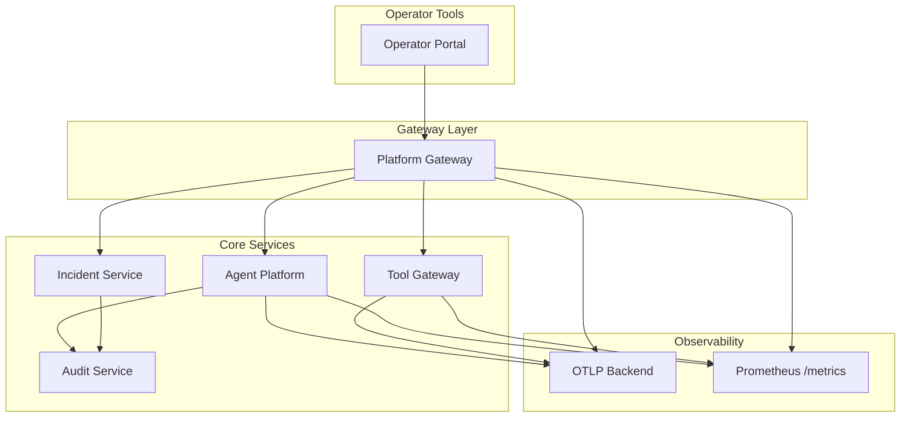
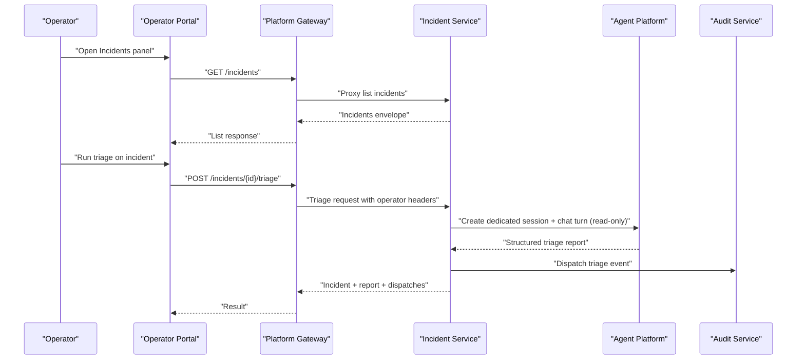
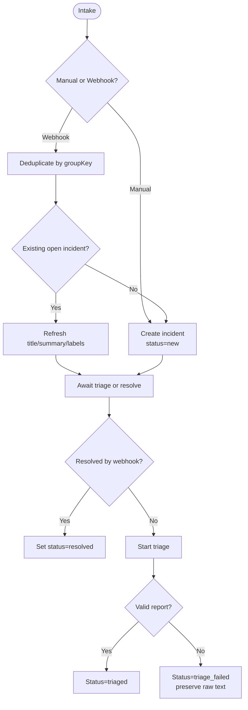
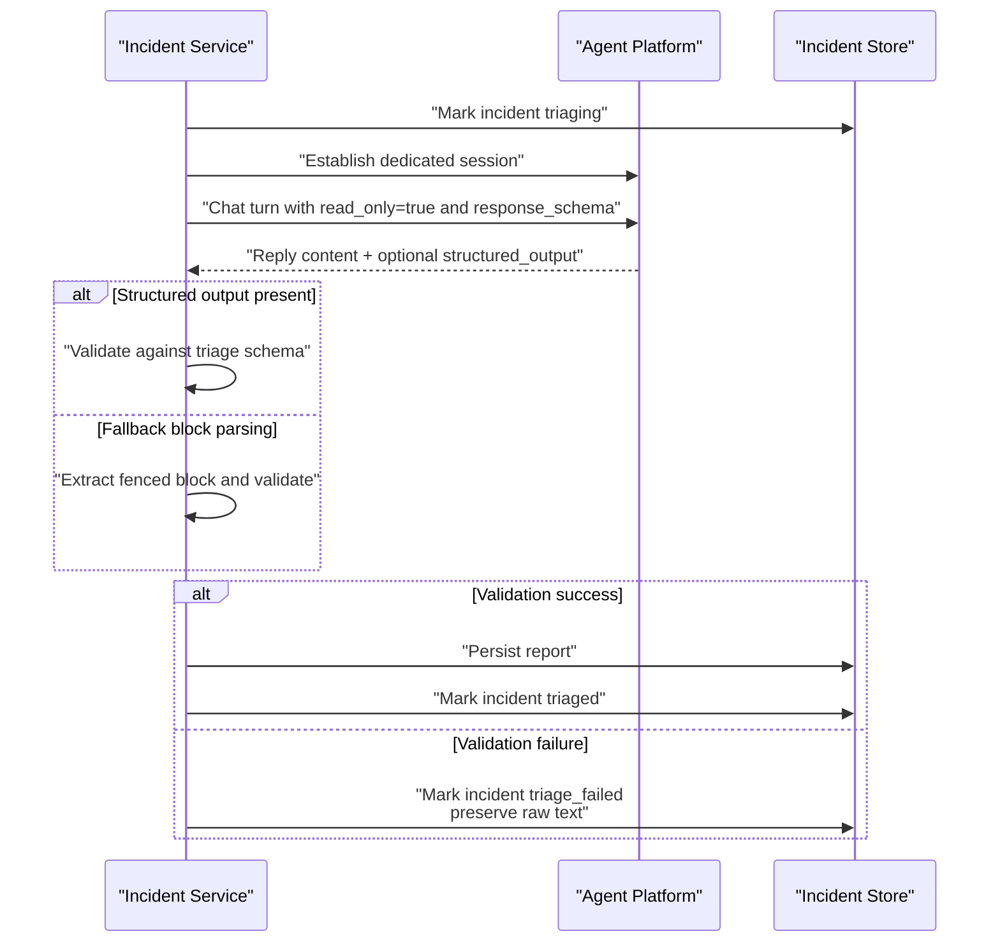
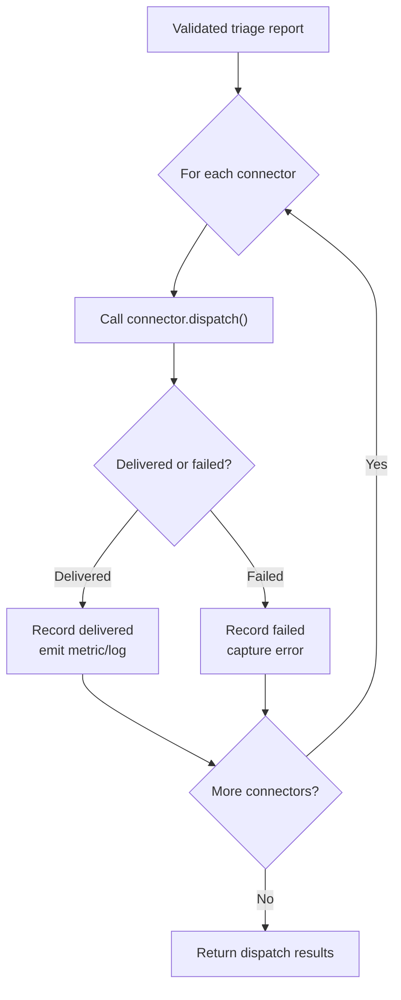
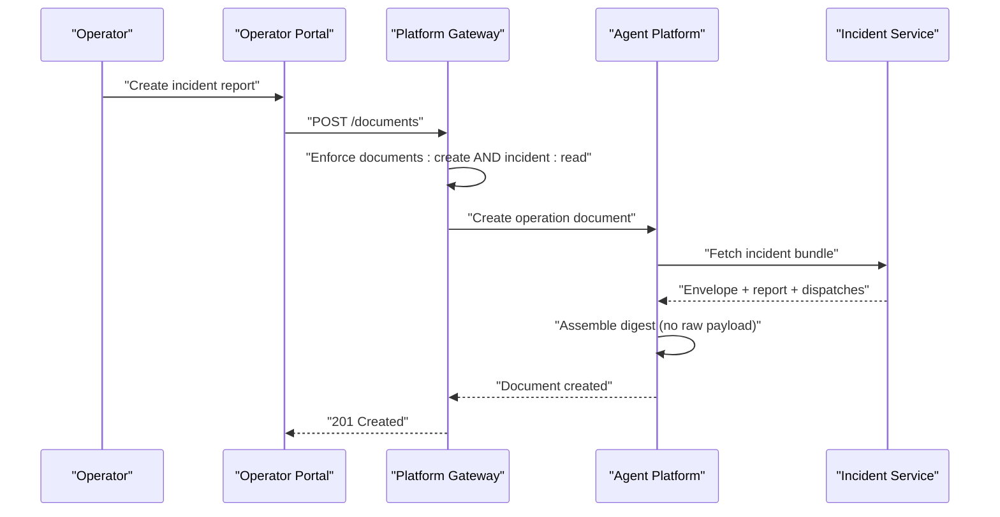
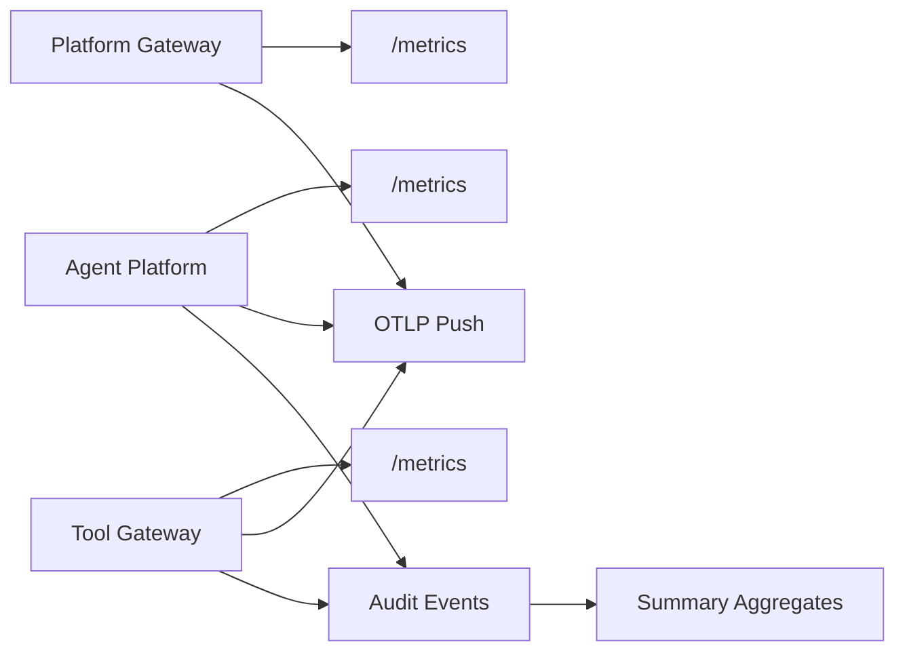
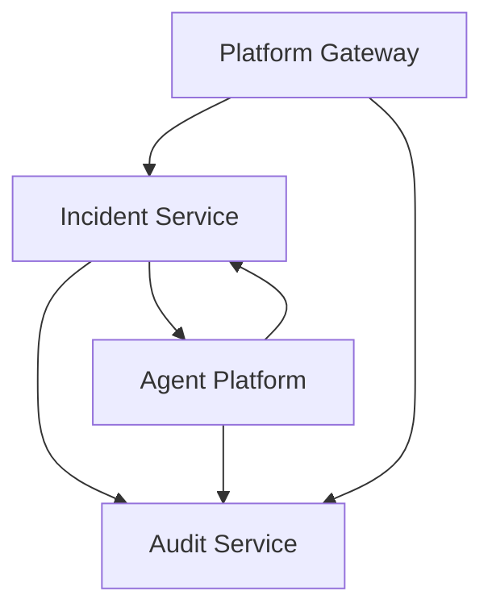

# Incident Response

<cite>
**Referenced Files in This Document**
- [incident-guide.md](file://docs/guides/incident-guide.md)
- [SPEC-015 plan.md](file://docs/specs/SPEC-015-incident-triage-and-collaboration/plan.md)
- [SPEC-043 plan.md](file://docs/specs/SPEC-043-incident-report-document-type/plan.md)
- [SPEC-039 plan.md](file://docs/specs/SPEC-039-operations-document-repository/plan.md)
- [observability-conventions.md](file://shared/shared-contracts/observability-conventions.md)
- [telemetry.py (agent-platform)](file://products/agent-platform/src/agent_service/core/telemetry.py)
- [telemetry.py (platform-gateway)](file://products/platform-gateway/src/platform_gateway/core/telemetry.py)
- [telemetry.py (audit-service)](file://products/audit-service/src/audit_service/core/telemetry.py)
- [telemetry.py (execution-runtime)](file://products/execution-runtime/src/execution_runtime/core/telemetry.py)
- [telemetry.py (identity-broker)](file://products/identity-broker/src/identity_service/core/telemetry.py)
- [telemetry.py (tool-gateway)](file://products/tool-gateway/src/tool_gateway/core/telemetry.py)
- [telemetry.py (skills-hub)](file://products/skills-hub/src/skills_hub/core/telemetry.py)
- [routes.incidents.py](file://products/incident-service/src/incident_service/api/routes/incidents.py)
- [triage.py](file://products/incident-service/src/incident_service/services/triage.py)
- [connectors.py](file://products/incident-service/src/incident_service/services/connectors.py)
- [incident_client.py](file://products/platform-gateway/src/platform_gateway/services/incident_client.py)
- [routes.py (agent-platform v2)](file://products/agent-platform/src/agent_service/api/v2/routes.py)
- [test_documents_repository.py](file://products/platform-gateway/tests/test_documents_repository.py)
- [test_document_prose.py](file://products/agent-platform/tests/test_document_prose.py)
- [test_audit_store.py](file://products/audit-service/tests/test_audit_store.py)
- [summary.py](file://products/audit-service/src/audit_service/api/routes/summary.py)
- [metrics.py (tool-gateway)](file://products/tool-gateway/src/tool_gateway/core/metrics.py)
- [CrashLoopsAndOOM.md](file://shared/platform-ops/skills/platform-runbooks/guides/CrashLoopsAndOOM.md)
- [DebugServices.md](file://shared/platform-ops/skills/platform-runbooks/guides/DebugServices.md)
- [README.md (platform-runbooks)](file://shared/platform-ops/skills/platform-runbooks/README.md)
</cite>

## Table of Contents
1. Introduction
2. Project Structure
3. Core Components
4. Architecture Overview
5. Detailed Component Analysis
6. Dependency Analysis
7. Performance Considerations
8. Troubleshooting Guide
9. Conclusion
10. Appendices

## Introduction
This document defines incident response procedures for the Luban AIOps platform, covering outages, performance degradation, and security incidents. It specifies escalation by severity, investigation using audit trails, distributed tracing, and log aggregation, containment strategies to isolate affected components while preserving availability, communication procedures for stakeholder updates, and post-incident analysis with blameless postmortems and preventive measures. It also includes runbooks for common scenarios and templates for incident reports and lessons learned.

## Project Structure
The platform implements incident handling across several products:
- Incident intake, triage, and collaboration via the incident-service product.
- Operator-facing workflows and documents via agent-platform and operator-portal.
- Secure proxying and policy enforcement via platform-gateway.
- Durable audit trail and reporting via audit-service.
- Distributed observability via OpenTelemetry push and Prometheus metrics across all services.
- Platform runbooks as skills consumed by agents during triage and remediation.

**Diagram sources**
- [incident-guide.md:12-16](file://docs/guides/incident-guide.md#L12-L16)
- [observability-conventions.md:9-16](file://shared/shared-contracts/observability-conventions.md#L9-L16)
- [telemetry.py (agent-platform):1-38](file://products/agent-platform/src/agent_service/core/telemetry.py#L1-L38)
- [telemetry.py (platform-gateway):1-38](file://products/platform-gateway/src/platform_gateway/core/telemetry.py#L1-L38)
- [telemetry.py (audit-service):1-38](file://products/audit-service/src/audit_service/core/telemetry.py#L1-L38)
- [telemetry.py (tool-gateway):1-38](file://products/tool-gateway/src/tool_gateway/core/telemetry.py#L1-L38)

**Section sources**
- [incident-guide.md:12-16](file://docs/guides/incident-guide.md#L12-L16)
- [observability-conventions.md:9-16](file://shared/shared-contracts/observability-conventions.md#L9-L16)

## Core Components
- Incident intake and lifecycle management: manual creation, webhook ingestion, status transitions, and resolution semantics are implemented in the incident-service routes and triage service.
- Triage automation: a read-only agent turn runs in a dedicated session per incident, producing a validated triage report; failures preserve raw output and mark the incident appropriately.
- Collaboration connectors: validated triage reports are dispatched to configured sinks (e.g., audit), with isolated failure handling so connector issues do not abort triage.
- Documents workspace: incident reports can be captured as immutable operations documents, gated by dual permissions and backed by a typed store with digest assembly and prose generation constraints.
- Observability: every service exposes Prometheus metrics and optional OpenTelemetry push for traces, metrics, and logs, enabling correlation across components.

**Section sources**
- [routes.incidents.py:74-128](file://products/incident-service/src/incident_service/api/routes/incidents.py#L74-L128)
- [triage.py:1-14](file://products/incident-service/src/incident_service/services/triage.py#L1-L14)
- [connectors.py:1-10](file://products/incident-service/src/incident_service/services/connectors.py#L1-L10)
- [SPEC-043 plan.md:1-15](file://docs/specs/SPEC-043-incident-report-document-type/plan.md#L1-L15)
- [SPEC-039 plan.md:1-16](file://docs/specs/SPEC-039-operations-document-repository/plan.md#L1-L16)
- [observability-conventions.md:9-16](file://shared/shared-contracts/observability-conventions.md#L9-L16)

## Architecture Overview
The incident workflow spans multiple layers:
- Operators interact through the portal or APIs behind the gateway.
- The gateway enforces identity and policy, proxies requests to agent-platform and incident-service, and returns structured errors when dependencies are unavailable.
- Incident-service manages intake, triage, and dispatch; it calls agent-platform for read-only triage turns and persists outcomes.
- Audit-service records durable events and provides summaries for investigations.
- All services emit metrics and optional OTLP signals for cross-cutting observability.

**Diagram sources**
- [routes.incidents.py:235-283](file://products/incident-service/src/incident_service/api/routes/incidents.py#L235-L283)
- [triage.py:189-276](file://products/incident-service/src/incident_service/services/triage.py#L189-L276)
- [connectors.py:87-127](file://products/incident-service/src/incident_service/services/connectors.py#L87-L127)
- [incident_client.py:65-107](file://products/platform-gateway/src/platform_gateway/services/incident_client.py#L65-L107)

## Detailed Component Analysis

### Incident Intake and Lifecycle
- Manual intake creates an incident with a unique fingerprint and sets initial status to new.
- Webhook intake supports Alertmanager fire/resolve flows with deduplication based on groupKey.
- Status transitions include new → triaging → triaged or triage_failed; resolved is set when alert groups resolve.
- Query endpoints support filtering by status, severity, and source with bounded pagination.

**Diagram sources**
- [routes.incidents.py:74-128](file://products/incident-service/src/incident_service/api/routes/incidents.py#L74-L128)
- [incident-guide.md:18-28](file://docs/guides/incident-guide.md#L18-L28)

**Section sources**
- [routes.incidents.py:74-128](file://products/incident-service/src/incident_service/api/routes/incidents.py#L74-L128)
- [incident-guide.md:18-28](file://docs/guides/incident-guide.md#L18-L28)

### Triage Automation
- Triage runs one agent turn in a dedicated session named after the incident ID, falling back to a per-operator session if ownership differs.
- The prompt instructs the agent to use read-only tools and produce a schema-validated triage report; structured output from the kernel is preferred, with a fenced-block fallback.
- On success, the report is persisted and the incident moves to triaged; on failure, the incident is marked triage_failed with preserved raw output.

**Diagram sources**
- [triage.py:122-186](file://products/incident-service/src/incident_service/services/triage.py#L122-L186)
- [triage.py:189-276](file://products/incident-service/src/incident_service/services/triage.py#L189-L276)
- [triage.py:290-371](file://products/incident-service/src/incident_service/services/triage.py#L290-L371)

**Section sources**
- [triage.py:122-186](file://products/incident-service/src/incident_service/services/triage.py#L122-L186)
- [triage.py:189-276](file://products/incident-service/src/incident_service/services/triage.py#L189-L276)
- [triage.py:290-371](file://products/incident-service/src/incident_service/services/triage.py#L290-L371)

### Collaboration Connectors
- After successful triage, reports are dispatched to configured connectors; each connector is isolated so failures do not abort remaining connectors or the triage path.
- Outcomes are recorded with status, reference, and error details, and emitted as metrics and structured logs.

**Diagram sources**
- [connectors.py:87-127](file://products/incident-service/src/incident_service/services/connectors.py#L87-L127)

**Section sources**
- [connectors.py:1-10](file://products/incident-service/src/incident_service/services/connectors.py#L1-L10)
- [connectors.py:87-127](file://products/incident-service/src/incident_service/services/connectors.py#L87-L127)

### Incident Reports as Operations Documents
- Incident reports are created as immutable operations documents, requiring both document creation and incident read permissions.
- The digest copies the incident envelope, validated triage report (or a not_triaged marker), and connector dispatch outcomes; raw alert payloads never enter the digest.
- Creation degrades gracefully: missing configuration yields 503, unreachable incident-service yields 502, unknown incident id yields 404.

**Diagram sources**
- [test_documents_repository.py:264-286](file://products/platform-gateway/tests/test_documents_repository.py#L264-L286)
- [routes.py (agent-platform v2):1594-1622](file://products/agent-platform/src/agent_service/api/v2/routes.py#L1594-L1622)
- [test_document_prose.py:87-117](file://products/agent-platform/tests/test_document_prose.py#L87-L117)
- [incident-guide.md:123-145](file://docs/guides/incident-guide.md#L123-L145)

**Section sources**
- [test_documents_repository.py:264-286](file://products/platform-gateway/tests/test_documents_repository.py#L264-L286)
- [routes.py (agent-platform v2):1594-1622](file://products/agent-platform/src/agent_service/api/v2/routes.py#L1594-L1622)
- [test_document_prose.py:87-117](file://products/agent-platform/tests/test_document_prose.py#L87-L117)
- [incident-guide.md:123-145](file://docs/guides/incident-guide.md#L123-L145)

### Observability and Investigation
- Each service exposes a pull-based Prometheus metrics endpoint and an opt-in OpenTelemetry push pipeline for traces, metrics, and mirrored logs.
- Standardized metric naming and labels enable consistent dashboards and alerts across services.
- Audit-service provides deterministic aggregates over stored events, including decision-chain projections useful for root cause analysis.

**Diagram sources**
- [observability-conventions.md:9-16](file://shared/shared-contracts/observability-conventions.md#L9-L16)
- [telemetry.py (agent-platform):1-38](file://products/agent-platform/src/agent_service/core/telemetry.py#L1-L38)
- [telemetry.py (platform-gateway):1-38](file://products/platform-gateway/src/platform_gateway/core/telemetry.py#L1-L38)
- [telemetry.py (tool-gateway):1-38](file://products/tool-gateway/src/tool_gateway/core/telemetry.py#L1-L38)
- [summary.py:1-9](file://products/audit-service/src/audit_service/api/routes/summary.py#L1-L9)
- [test_audit_store.py:467-496](file://products/audit-service/tests/test_audit_store.py#L467-L496)

**Section sources**
- [observability-conventions.md:9-16](file://shared/shared-contracts/observability-conventions.md#L9-L16)
- [summary.py:1-9](file://products/audit-service/src/audit_service/api/routes/summary.py#L1-L9)
- [test_audit_store.py:467-496](file://products/audit-service/tests/test_audit_store.py#L467-L496)

## Dependency Analysis
- Platform-gateway depends on incident-service for incident data; failures return 502 with a clear detail message.
- Agent-platform depends on incident-service for incident bundles; dependency postures map to 503 (not configured), 502 (unreachable), and 404 (unknown id).
- Incident-service depends on agent-platform for triage sessions and chat turns; session ownership differences are handled by trying per-operator fallback sessions.
- Audit-service aggregates events independently and does not block triage or document creation paths.

**Diagram sources**
- [incident_client.py:65-107](file://products/platform-gateway/src/platform_gateway/services/incident_client.py#L65-L107)
- [routes.py (agent-platform v2):1594-1622](file://products/agent-platform/src/agent_service/api/v2/routes.py#L1594-L1622)
- [triage.py:189-276](file://products/incident-service/src/incident_service/services/triage.py#L189-L276)
- [connectors.py:87-127](file://products/incident-service/src/incident_service/services/connectors.py#L87-L127)

**Section sources**
- [incident_client.py:65-107](file://products/platform-gateway/src/platform_gateway/services/incident_client.py#L65-L107)
- [routes.py (agent-platform v2):1594-1622](file://products/agent-platform/src/agent_service/api/v2/routes.py#L1594-L1622)
- [triage.py:189-276](file://products/incident-service/src/incident_service/services/triage.py#L189-L276)
- [connectors.py:87-127](file://products/incident-service/src/incident_service/services/connectors.py#L87-L127)

## Performance Considerations
- Use bounded pagination and limits for incident listing to avoid large responses.
- Prefer structured output from the agent kernel to reduce parsing overhead and improve reliability.
- Keep connector dispatch isolated and asynchronous where possible to prevent tail-latency spikes from affecting triage latency.
- Enable OTLP push only when needed; keep /metrics always available for quick debugging without external dependencies.

[No sources needed since this section provides general guidance]

## Troubleshooting Guide
- Webhook authentication failures return 401 or 503 depending on configuration; these are retried by Alertmanager.
- Triage failures mark the incident triage_failed and preserve raw output for inspection; re-run triage after fixing underlying issues.
- If incident-service is unreachable, platform-gateway returns 502; if not configured, agent-platform returns 503 for document creation.
- Use audit summary aggregates to identify top actors, event type distributions, and decision chains during investigations.

**Section sources**
- [incident-guide.md:64-74](file://docs/guides/incident-guide.md#L64-L74)
- [incident-guide.md:185-192](file://docs/guides/incident-guide.md#L185-L192)
- [incident_client.py:65-107](file://products/platform-gateway/src/platform_gateway/services/incident_client.py#L65-L107)
- [routes.py (agent-platform v2):1594-1622](file://products/agent-platform/src/agent_service/api/v2/routes.py#L1594-L1622)
- [test_audit_store.py:467-496](file://products/audit-service/tests/test_audit_store.py#L467-L496)

## Conclusion
The platform provides a robust incident response workflow with automated triage, durable audit trails, and strong observability. By following the procedures outlined here—escalation by severity, investigation using audit and telemetry, containment via isolation and graceful degradation, clear communication, and blameless postmortems—operators can maintain platform availability and continuously improve resilience.

[No sources needed since this section summarizes without analyzing specific files]

## Appendices

### Escalation Procedures by Severity
- Critical (service unavailability):
  - Immediate triage run; if triage fails, escalate to on-call with preserved raw output.
  - Check connectivity to incident-service and agent-platform; if unreachable, switch to manual triage and notify stakeholders.
  - Activate runbooks for crash loops/OOM and service debugging.
- Warning (degraded performance):
  - Run triage; review evidence and hypotheses; prioritize next steps by priority field.
  - Inspect metrics and traces; correlate with recent changes using audit summaries.
- Info (non-blocking issues):
  - Log into incident record; schedule triage during next shift; capture lessons learned.

[No sources needed since this section provides general guidance]

### Investigation Procedures
- Use audit-service summary endpoints to analyze event types, outcomes, services, and top actors within the incident window.
- Correlate traces via OpenTelemetry to identify slow spans and failures across gateway, agent-platform, and tool-gateway.
- Review agent-platform chat transcripts linked to the incident’s triage session for context and decisions.

**Section sources**
- [summary.py:1-9](file://products/audit-service/src/audit_service/api/routes/summary.py#L1-L9)
- [test_audit_store.py:467-496](file://products/audit-service/tests/test_audit_store.py#L467-L496)
- [triage.py:189-276](file://products/incident-service/src/incident_service/services/triage.py#L189-L276)

### Containment Strategies
- Isolate affected components by disabling non-essential features (e.g., disable optional OTLP push if backend is down).
- Use read-only triage mode to prevent accidental mutations during investigation.
- Fall back to memory-backed stores at startup if Postgres is unavailable, preserving chat functionality temporarily.

**Section sources**
- [triage.py:219-276](file://products/incident-service/src/incident_service/services/triage.py#L219-L276)
- [SPEC-016 spec.md:144-157](file://docs/specs/SPEC-016-session-store-postgres-separation/spec.md#L144-L157)

### Communication Procedures
- Maintain a single source of truth in the incident record; update status and notes as triage progresses.
- Publish incident reports as operations documents for immutable, auditable sharing.
- Use portal Incidents panel to list, filter, and view details; leverage “Continue in chat” for collaborative follow-up.

**Section sources**
- [incident-guide.md:75-116](file://docs/guides/incident-guide.md#L75-L116)
- [incident-guide.md:123-145](file://docs/guides/incident-guide.md#L123-L145)

### Post-Incident Analysis
- Conduct blameless postmortems focusing on system behavior and process improvements.
- Track action items derived from triage next steps and evidence findings.
- Implement preventive measures such as better sizing, improved health checks, and enhanced observability.

[No sources needed since this section provides general guidance]

### Runbooks for Common Scenarios
- Database connectivity issues:
  - Verify Postgres readiness and connection strings; check session store fallback behavior.
  - Use audit summaries to detect spikes in failed events and correlate with database load.
- External API failures:
  - Inspect tool-gateway metrics for redacted spans and audit emits; check OTLP export headers and endpoint reachability.
  - Use DebugServices guide to validate service reachability and DNS resolution.
- Memory leaks:
  - Follow CrashLoopsAndOOM guide to interpret exit codes and container resource usage; adjust limits and investigate heap dumps on staging replicas.
- Disk space exhaustion:
  - Monitor disk usage via Kubernetes node metrics; clean up old artifacts and adjust retention policies for execution records and audit events.
- Network partitions:
  - Validate service endpoints and selectors; test direct reachability to pod IPs; check CoreDNS health and kube-proxy behavior.

**Section sources**
- [CrashLoopsAndOOM.md:9-46](file://shared/platform-ops/skills/platform-runbooks/guides/CrashLoopsAndOOM.md#L9-L46)
- [DebugServices.md:9-60](file://shared/platform-ops/skills/platform-runbooks/guides/DebugServices.md#L9-L60)
- [metrics.py (tool-gateway):92-107](file://products/tool-gateway/src/tool_gateway/core/metrics.py#L92-L107)
- [telemetry.py (tool-gateway):1-38](file://products/tool-gateway/src/tool_gateway/core/telemetry.py#L1-L38)

### Templates for Incident Reports and Lessons Learned
- Incident report template fields:
  - Incident ID, title, severity, status, summary, labels, triage report (severity assessment, evidence, hypotheses, next steps), connector dispatch outcomes, session coverage tier.
- Lessons learned template fields:
  - Timeline of detection, triage, containment, resolution; root cause analysis; impact assessment; corrective actions; preventive measures; verification steps.

[No sources needed since this section provides general guidance]