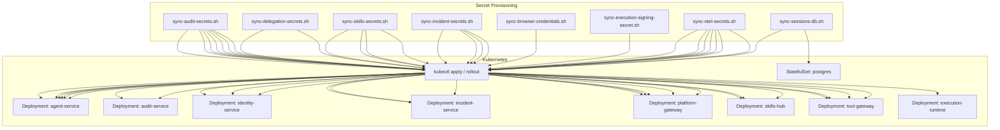
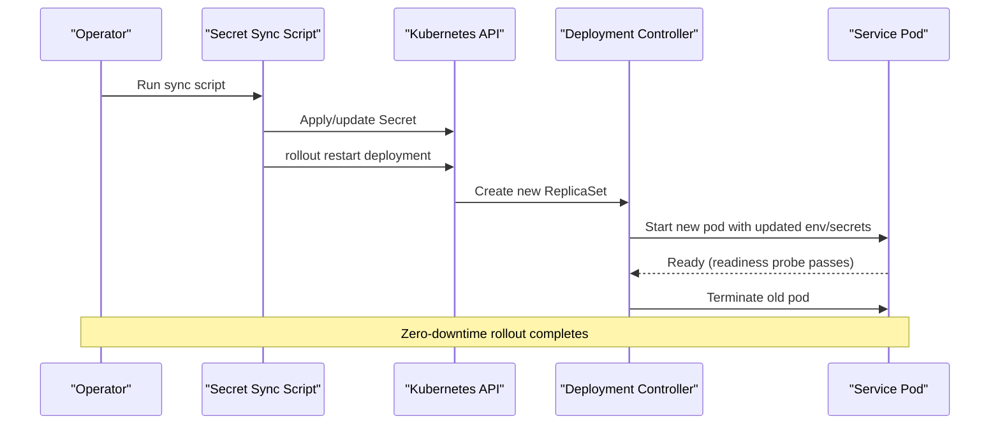
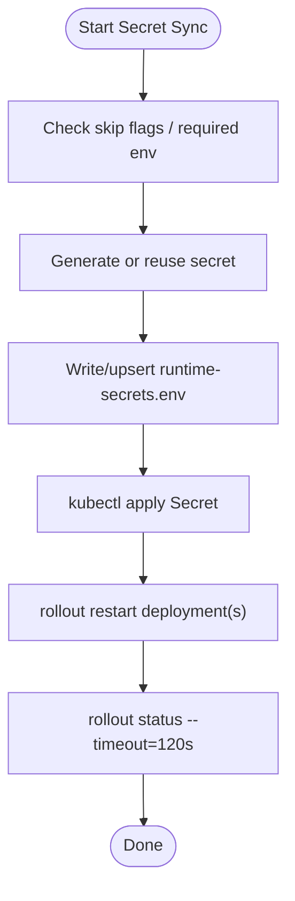
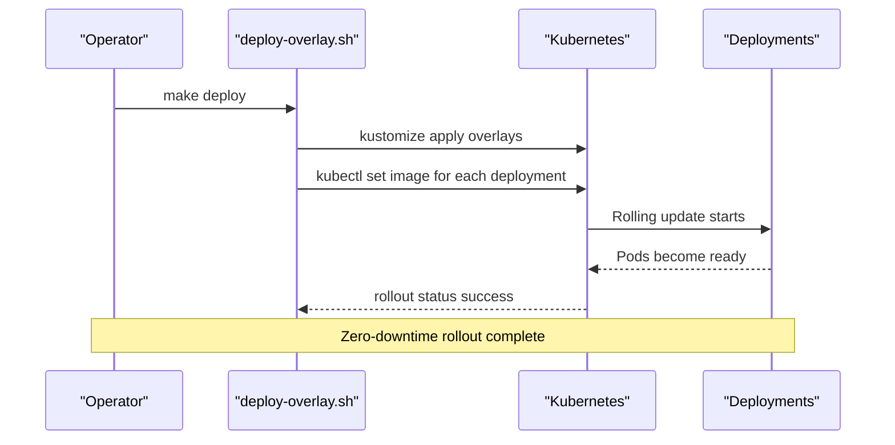
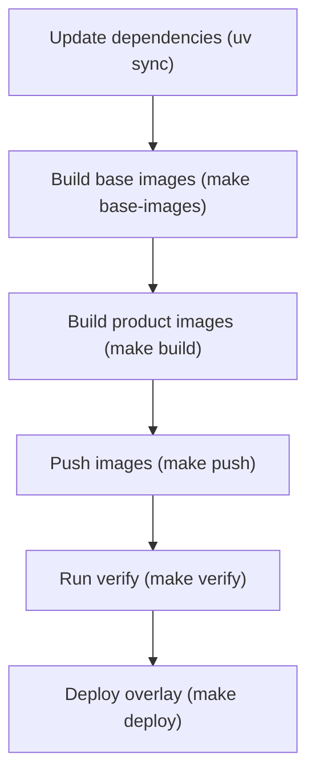
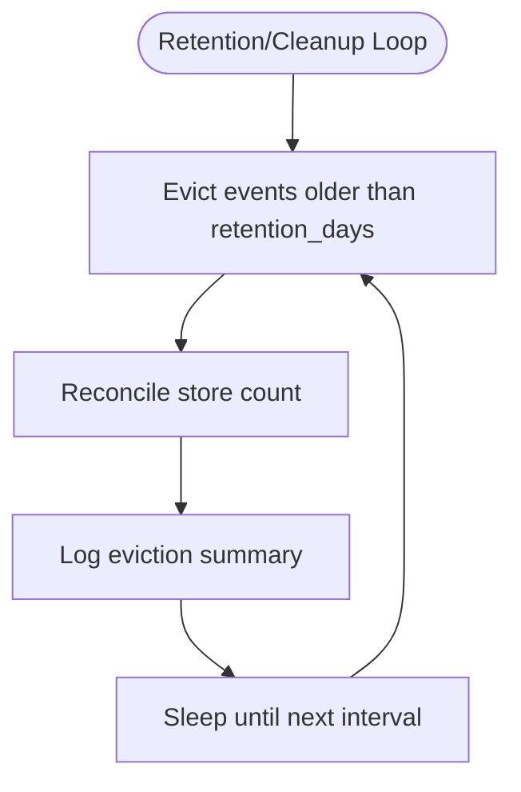
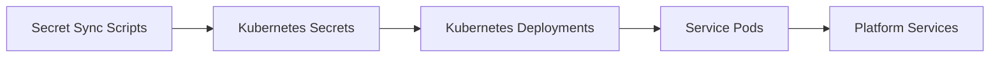

# Maintenance Procedures

<cite>
**Referenced Files in This Document**
- [sync-audit-secrets.sh](file://shared/platform-ops/gitops/sync-audit-secrets.sh)
- [sync-delegation-secrets.sh](file://shared/platform-ops/gitops/sync-delegation-secrets.sh)
- [sync-skills-secrets.sh](file://shared/platform-ops/gitops/sync-skills-secrets.sh)
- [sync-incident-secrets.sh](file://shared/platform-ops/gitops/sync-incident-secrets.sh)
- [sync-browser-credentials.sh](file://shared/platform-ops/gitops/sync-browser-credentials.sh)
- [sync-execution-signing-secret.sh](file://shared/platform-ops/gitops/sync-execution-signing-secret.sh)
- [sync-otel-secrets.sh](file://shared/platform-ops/gitops/sync-otel-secrets.sh)
- [sync-sessions-db.sh](file://shared/platform-ops/gitops/sync-sessions-db.sh)
- [deploy-overlay.sh](file://shared/platform-ops/gitops/deploy-overlay.sh)
- [Makefile](file://Makefile)
- [agent-service-deployment.yaml](file://shared/platform-ops/gitops/dev-k8s/base/agent-platform/agent-service-deployment.yaml)
- [audit-service-deployment.yaml](file://shared/platform-ops/gitops/dev-k8s/base/audit-service/audit-service-deployment.yaml)
- [postgres-statefulset.yaml](file://shared/platform-ops/gitops/dev-k8s/base/infra/postgres-statefulset.yaml)
- [retention.py](file://products/audit-service/src/audit_service/services/retention.py)
- [authoring_trace.py](file://products/agent-platform/src/agent_service/services/authoring_trace.py)
- [operation_documents.py](file://products/agent-platform/src/agent_service/services/operation_documents.py)
- [test_execution_records.py](file://products/agent-platform/tests/test_execution_records.py)
- [python-container-strategy.md](file://docs/workspace/python-container-strategy.md)
</cite>

## Table of Contents
1. [Introduction](#introduction)
2. [Project Structure](#project-structure)
3. [Core Components](#core-components)
4. [Architecture Overview](#architecture-overview)
5. [Detailed Component Analysis](#detailed-component-analysis)
6. [Dependency Analysis](#dependency-analysis)
7. [Performance Considerations](#performance-considerations)
8. [Troubleshooting Guide](#troubleshooting-guide)
9. [Conclusion](#conclusion)
10. [Appendices](#appendices)

## Introduction
This document provides production maintenance procedures for the Luban AIOps platform. It covers secret synchronization, rolling updates with zero-downtime strategies, certificate rotation, dependency upgrades, data cleanup, and PostgreSQL maintenance tasks. The guidance is grounded in the repository’s GitOps scripts, Kubernetes manifests, service code, and build system.

## Project Structure
The platform uses a GitOps overlay model under shared/platform-ops/gitops. Secret provisioning is performed by dedicated shell scripts that update environment files, apply Kubernetes Secrets via kubectl, and restart deployments using rollout commands. Services are deployed as Kubernetes Deployments (and a StatefulSet for Postgres). The root Makefile orchestrates builds, pushes, and deployment through deploy-overlay.sh.

**Diagram sources**
- [sync-audit-secrets.sh:65-168](file://shared/platform-ops/gitops/sync-audit-secrets.sh#L65-L168)
- [sync-delegation-secrets.sh:43-92](file://shared/platform-ops/gitops/sync-delegation-secrets.sh#L43-L92)
- [sync-skills-secrets.sh:51-196](file://shared/platform-ops/gitops/sync-skills-secrets.sh#L51-L196)
- [sync-incident-secrets.sh:47-175](file://shared/platform-ops/gitops/sync-incident-secrets.sh#L47-L175)
- [sync-browser-credentials.sh:67-80](file://shared/platform-ops/gitops/sync-browser-credentials.sh#L67-L80)
- [sync-execution-signing-secret.sh:52-71](file://shared/platform-ops/gitops/sync-execution-signing-secret.sh#L52-L71)
- [sync-otel-secrets.sh:73-161](file://shared/platform-ops/gitops/sync-otel-secrets.sh#L73-L161)
- [sync-sessions-db.sh:23-45](file://shared/platform-ops/gitops/sync-sessions-db.sh#L23-L45)
- [agent-service-deployment.yaml:22-69](file://shared/platform-ops/gitops/dev-k8s/base/agent-platform/agent-service-deployment.yaml#L22-L69)
- [audit-service-deployment.yaml:18-58](file://shared/platform-ops/gitops/dev-k8s/base/audit-service/audit-service-deployment.yaml#L18-L58)
- [postgres-statefulset.yaml:16-63](file://shared/platform-ops/gitops/dev-k8s/base/infra/postgres-statefulset.yaml#L16-L63)

**Section sources**
- [deploy-overlay.sh:1-108](file://shared/platform-ops/gitops/deploy-overlay.sh#L1-L108)
- [Makefile:77-183](file://Makefile#L77-L183)

## Core Components
- Secret synchronization scripts manage critical secrets across services and ensure affected workloads roll out with updated configuration.
- Rolling updates are executed via kubectl rollout restart/status or kubectl set image, ensuring zero downtime by leveraging Kubernetes Deployment controllers.
- Data retention and cleanup are implemented within services and enforced at startup or on schedule.
- PostgreSQL databases are provisioned idempotently; additional maintenance tasks can be run against the running instance.

**Section sources**
- [sync-audit-secrets.sh:65-168](file://shared/platform-ops/gitops/sync-audit-secrets.sh#L65-L168)
- [sync-delegation-secrets.sh:43-92](file://shared/platform-ops/gitops/sync-delegation-secrets.sh#L43-L92)
- [sync-skills-secrets.sh:51-196](file://shared/platform-ops/gitops/sync-skills-secrets.sh#L51-L196)
- [sync-incident-secrets.sh:47-175](file://shared/platform-ops/gitops/sync-incident-secrets.sh#L47-L175)
- [sync-browser-credentials.sh:67-80](file://shared/platform-ops/gitops/sync-browser-credentials.sh#L67-L80)
- [sync-execution-signing-secret.sh:52-71](file://shared/platform-ops/gitops/sync-execution-signing-secret.sh#L52-L71)
- [sync-otel-secrets.sh:73-161](file://shared/platform-ops/gitops/sync-otel-secrets.sh#L73-L161)
- [sync-sessions-db.sh:23-45](file://shared/platform-ops/gitops/sync-sessions-db.sh#L23-L45)
- [deploy-overlay.sh:63-107](file://shared/platform-ops/gitops/deploy-overlay.sh#L63-L107)

## Architecture Overview
Secrets flow from operator scripts into Kubernetes Secrets and ConfigMaps, then into pods via envFrom/env. Services read these values at startup or reload them where supported. Rollouts are coordinated to minimize disruption and ensure consistent state across dependent services.

**Diagram sources**
- [sync-audit-secrets.sh:134-168](file://shared/platform-ops/gitops/sync-audit-secrets.sh#L134-L168)
- [sync-delegation-secrets.sh:84-92](file://shared/platform-ops/gitops/sync-delegation-secrets.sh#L84-L92)
- [sync-skills-secrets.sh:180-196](file://shared/platform-ops/gitops/sync-skills-secrets.sh#L180-L196)
- [sync-incident-secrets.sh:158-175](file://shared/platform-ops/gitops/sync-incident-secrets.sh#L158-L175)
- [sync-otel-secrets.sh:143-161](file://shared/platform-ops/gitops/sync-otel-secrets.sh#L143-L161)
- [deploy-overlay.sh:78-107](file://shared/platform-ops/gitops/deploy-overlay.sh#L78-L107)

## Detailed Component Analysis

### Secret Synchronization Procedures
- Audit ingestion tokens:
  - Generates or reuses a single ingest secret and writes it into the audit-service client registry and each emitter’s runtime secret. Applies the secrets and restarts audit-service first, then emitters, waiting for rollout status.
- Token delegation credentials:
  - Creates a shared client secret for platform-gateway and identity-broker, applies both secrets, and restarts both deployments.
- Skills query authentication:
  - Ensures the skills database exists, generates a shared query secret, updates the skills-hub registry and callers’ secrets, and restarts affected deployments. Also merges optional git-source tokens into the cluster Secret.
- Incident webhook tokens and query credentials:
  - Ensures the incidents database exists, provisions a webhook token and a shared query secret, updates registries and caller secrets, and restarts affected deployments.
- Browser automation credentials:
  - Mounts a JSON credential sets file into tool-gateway via a Secret and restarts tool-gateway so the mounted file is picked up.
- Execution signing keys:
  - Reuses an existing key if present or generates a new one, applies the execution-signing-secret, and restarts agent-service.
- OpenTelemetry configuration:
  - Computes Basic auth header from OpenObserve credentials and merges OTEL_EXPORTER_OTLP_HEADERS into every service’s runtime Secret without wiping other keys. Mirrors best-effort into local env files and restarts all seven workloads.
- Session database connections:
  - Ensures the sessions database exists on Postgres and restarts agent-service so the persistent session store connects.

**Diagram sources**
- [sync-audit-secrets.sh:44-168](file://shared/platform-ops/gitops/sync-audit-secrets.sh#L44-L168)
- [sync-delegation-secrets.sh:36-92](file://shared/platform-ops/gitops/sync-delegation-secrets.sh#L36-L92)
- [sync-skills-secrets.sh:51-196](file://shared/platform-ops/gitops/sync-skills-secrets.sh#L51-L196)
- [sync-incident-secrets.sh:47-175](file://shared/platform-ops/gitops/sync-incident-secrets.sh#L47-L175)
- [sync-browser-credentials.sh:36-80](file://shared/platform-ops/gitops/sync-browser-credentials.sh#L36-L80)
- [sync-execution-signing-secret.sh:37-71](file://shared/platform-ops/gitops/sync-execution-signing-secret.sh#L37-L71)
- [sync-otel-secrets.sh:47-161](file://shared/platform-ops/gitops/sync-otel-secrets.sh#L47-L161)
- [sync-sessions-db.sh:23-45](file://shared/platform-ops/gitops/sync-sessions-db.sh#L23-L45)

**Section sources**
- [sync-audit-secrets.sh:65-168](file://shared/platform-ops/gitops/sync-audit-secrets.sh#L65-L168)
- [sync-delegation-secrets.sh:43-92](file://shared/platform-ops/gitops/sync-delegation-secrets.sh#L43-L92)
- [sync-skills-secrets.sh:51-196](file://shared/platform-ops/gitops/sync-skills-secrets.sh#L51-L196)
- [sync-incident-secrets.sh:47-175](file://shared/platform-ops/gitops/sync-incident-secrets.sh#L47-L175)
- [sync-browser-credentials.sh:67-80](file://shared/platform-ops/gitops/sync-browser-credentials.sh#L67-L80)
- [sync-execution-signing-secret.sh:52-71](file://shared/platform-ops/gitops/sync-execution-signing-secret.sh#L52-L71)
- [sync-otel-secrets.sh:73-161](file://shared/platform-ops/gitops/sync-otel-secrets.sh#L73-L161)
- [sync-sessions-db.sh:23-45](file://shared/platform-ops/gitops/sync-sessions-db.sh#L23-L45)

### Rolling Update Procedures (Zero-Downtime)
- Use kubectl rollout restart after applying secrets to trigger a rolling update. Scripts wait for rollout status with timeouts to confirm readiness before proceeding.
- For application images, use kubectl set image per deployment followed by rollout status checks.
- When environment or policy ConfigMaps change, the deploy script explicitly restarts app deployments to pick up new values.

**Diagram sources**
- [deploy-overlay.sh:63-107](file://shared/platform-ops/gitops/deploy-overlay.sh#L63-L107)
- [Makefile:181-183](file://Makefile#L181-L183)

**Section sources**
- [deploy-overlay.sh:63-107](file://shared/platform-ops/gitops/deploy-overlay.sh#L63-L107)
- [Makefile:181-183](file://Makefile#L181-L183)

### Certificate Rotation Processes
- TLS termination for external endpoints is not defined in the examined manifests; internal service-to-service communication relies on static client secrets rather than mTLS. Rotate secrets using the relevant sync scripts listed above.
- For projected workload tokens used by platform-gateway when exchanging delegated tokens, the client re-reads the token file per exchange, enabling seamless rotation without restarts.

**Section sources**
- [sync-delegation-secrets.sh:43-92](file://shared/platform-ops/gitops/sync-delegation-secrets.sh#L43-L92)
- [sync-audit-secrets.sh:65-168](file://shared/platform-ops/gitops/sync-audit-secrets.sh#L65-L168)
- [sync-otel-secrets.sh:73-161](file://shared/platform-ops/gitops/sync-otel-secrets.sh#L73-L161)

### Dependency Upgrade Procedures
- Python packages:
  - Each product uses uv with a lockfile. Run per-product dependency sync targets to refresh dependencies deterministically.
- Base image refreshes:
  - Build shared base images via the Makefile target, then rebuild product images with a coordinated tag and push to the registry.
- Third-party library upgrades:
  - Update product-level dependencies and run verification targets (tests, overlays, policy validation, version checks) before deploying.

**Diagram sources**
- [Makefile:77-128](file://Makefile#L77-L128)
- [Makefile:178-183](file://Makefile#L178-L183)
- [python-container-strategy.md:19-53](file://docs/workspace/python-container-strategy.md#L19-L53)

**Section sources**
- [Makefile:77-128](file://Makefile#L77-L128)
- [Makefile:178-183](file://Makefile#L178-L183)
- [python-container-strategy.md:19-53](file://docs/workspace/python-container-strategy.md#L19-L53)

### Cleanup Procedures for Expired Data
- Audit log retention enforcement:
  - A background loop periodically evicts events past the configured retention window and reconciles store size metrics.
- Session cleanup:
  - Authoring trace sweep reclaims idle draft traces and orphaned target declarations based on configured idle days.
- Evidence store pruning:
  - Operation documents backend sweeps expired entries during initialization and maintains caps per owner.
- Temporary file removal:
  - Scripts create temporary files during secret provisioning and remove them immediately after use.

**Diagram sources**
- [retention.py:45-75](file://products/audit-service/src/audit_service/services/retention.py#L45-L75)

**Section sources**
- [retention.py:45-75](file://products/audit-service/src/audit_service/services/retention.py#L45-L75)
- [authoring_trace.py:912-941](file://products/agent-platform/src/agent_service/services/authoring_trace.py#L912-L941)
- [operation_documents.py:196-210](file://products/agent-platform/src/agent_service/services/operation_documents.py#L196-L210)
- [operation_documents.py:409-423](file://products/agent-platform/src/agent_service/services/operation_documents.py#L409-L423)
- [test_execution_records.py:185-202](file://products/agent-platform/tests/test_execution_records.py#L185-L202)

### Database Maintenance Tasks (PostgreSQL)
- Database provisioning:
  - Scripts ensure required databases exist (skills, incidents, sessions) on the running Postgres instance.
- Index rebuilding, statistics updates, vacuum operations:
  - Not defined in the examined manifests or scripts. These tasks should be executed directly against the Postgres pod using psql and standard PostgreSQL maintenance utilities when needed.

**Section sources**
- [sync-skills-secrets.sh:51-62](file://shared/platform-ops/gitops/sync-skills-secrets.sh#L51-L62)
- [sync-incident-secrets.sh:47-58](file://shared/platform-ops/gitops/sync-incident-secrets.sh#L47-L58)
- [sync-sessions-db.sh:23-34](file://shared/platform-ops/gitops/sync-sessions-db.sh#L23-L34)
- [postgres-statefulset.yaml:16-63](file://shared/platform-ops/gitops/dev-k8s/base/infra/postgres-statefulset.yaml#L16-L63)

## Dependency Analysis
- Secret sync scripts depend on kubectl and the dev-k8s overlay structure. They write local runtime-secrets.env files and apply corresponding Kubernetes Secrets.
- Deployments consume secrets via envFrom or secretKeyRef, ensuring changes take effect on restart.
- The deploy pipeline coordinates image updates and rollout status checks across all services.

**Diagram sources**
- [sync-audit-secrets.sh:65-168](file://shared/platform-ops/gitops/sync-audit-secrets.sh#L65-L168)
- [agent-service-deployment.yaml:32-60](file://shared/platform-ops/gitops/dev-k8s/base/agent-platform/agent-service-deployment.yaml#L32-L60)
- [audit-service-deployment.yaml:32-37](file://shared/platform-ops/gitops/dev-k8s/base/audit-service/audit-service-deployment.yaml#L32-L37)

**Section sources**
- [sync-audit-secrets.sh:65-168](file://shared/platform-ops/gitops/sync-audit-secrets.sh#L65-L168)
- [agent-service-deployment.yaml:32-60](file://shared/platform-ops/gitops/dev-k8s/base/agent-platform/agent-service-deployment.yaml#L32-L60)
- [audit-service-deployment.yaml:32-37](file://shared/platform-ops/gitops/dev-k8s/base/audit-service/audit-service-deployment.yaml#L32-L37)

## Performance Considerations
- Probes:
  - audit-service defines readiness and liveness probes with tuned delays to avoid false positives under load.
- Rollout timeouts:
  - Scripts use rollout status with timeouts to prevent indefinite waits.
- Retention loops:
  - Audit retention runs on intervals and batches deletions to limit impact.

**Section sources**
- [audit-service-deployment.yaml:40-58](file://shared/platform-ops/gitops/dev-k8s/base/audit-service/audit-service-deployment.yaml#L40-L58)
- [sync-audit-secrets.sh:141-168](file://shared/platform-ops/gitops/sync-audit-secrets.sh#L141-L168)
- [retention.py:45-75](file://products/audit-service/src/audit_service/services/retention.py#L45-L75)

## Troubleshooting Guide
- Secret sync failures:
  - Verify namespace, kubectl context, and that required environment variables are exported. Scripts print clear messages when skipping due to missing inputs.
- Rollout stalls:
  - Check rollout status output and pod logs. Ensure readiness probes pass and secrets are correctly mounted.
- OTel push failures:
  - If OpenObserve credentials are not provided, OTLP push authenticates anonymously and may fail open; provision headers via sync-otel-secrets.sh.
- Database not found:
  - Ensure the overlay is deployed first so Postgres is available; scripts will error if no Postgres pod is found.

**Section sources**
- [sync-audit-secrets.sh:39-49](file://shared/platform-ops/gitops/sync-audit-secrets.sh#L39-L49)
- [sync-delegation-secrets.sh:31-41](file://shared/platform-ops/gitops/sync-delegation-secrets.sh#L31-L41)
- [sync-skills-secrets.sh:46-62](file://shared/platform-ops/gitops/sync-skills-secrets.sh#L46-L62)
- [sync-incident-secrets.sh:42-58](file://shared/platform-ops/gitops/sync-incident-secrets.sh#L42-L58)
- [sync-otel-secrets.sh:42-52](file://shared/platform-ops/gitops/sync-otel-secrets.sh#L42-L52)
- [sync-sessions-db.sh:25-34](file://shared/platform-ops/gitops/sync-sessions-db.sh#L25-L34)

## Conclusion
The platform’s maintenance procedures are centered around deterministic secret synchronization, controlled rolling updates, and built-in data retention. Operators should rely on the provided scripts for secret management, use the Makefile and deploy-overlay.sh for coordinated releases, and perform database maintenance tasks directly against Postgres as needed.

## Appendices

### Quick Reference: Secret Sync Commands
- Audit ingestion tokens: run the audit secret sync script for the target namespace.
- Token delegation credentials: run the delegation secret sync script for the target namespace.
- Skills query authentication: run the skills secret sync script for the target namespace.
- Incident webhook tokens and query credentials: run the incident secret sync script for the target namespace.
- Browser automation credentials: run the browser credentials sync script for the target namespace.
- Execution signing keys: run the execution signing secret sync script for the target namespace.
- OpenTelemetry configuration: run the OTel secret sync script for the target namespace.
- Session database connections: run the sessions DB sync script for the target namespace.

**Section sources**
- [sync-audit-secrets.sh:25-33](file://shared/platform-ops/gitops/sync-audit-secrets.sh#L25-L33)
- [sync-delegation-secrets.sh:17-24](file://shared/platform-ops/gitops/sync-delegation-secrets.sh#L17-L24)
- [sync-skills-secrets.sh:24-39](file://shared/platform-ops/gitops/sync-skills-secrets.sh#L24-L39)
- [sync-incident-secrets.sh:27-35](file://shared/platform-ops/gitops/sync-incident-secrets.sh#L27-L35)
- [sync-browser-credentials.sh:17-25](file://shared/platform-ops/gitops/sync-browser-credentials.sh#L17-L25)
- [sync-execution-signing-secret.sh:19-26](file://shared/platform-ops/gitops/sync-execution-signing-secret.sh#L19-L26)
- [sync-otel-secrets.sh:22-35](file://shared/platform-ops/gitops/sync-otel-secrets.sh#L22-L35)
- [sync-sessions-db.sh:15-17](file://shared/platform-ops/gitops/sync-sessions-db.sh#L15-L17)