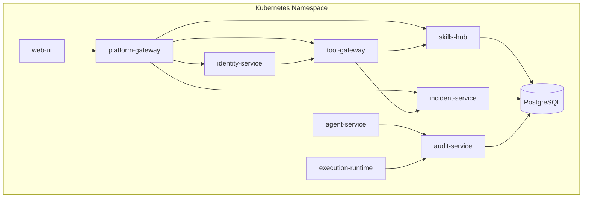
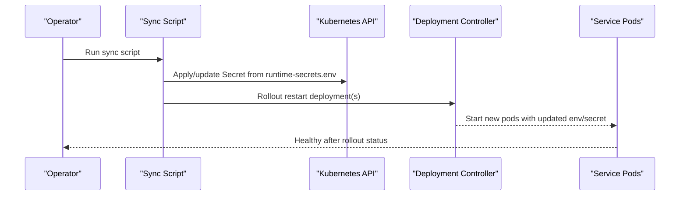
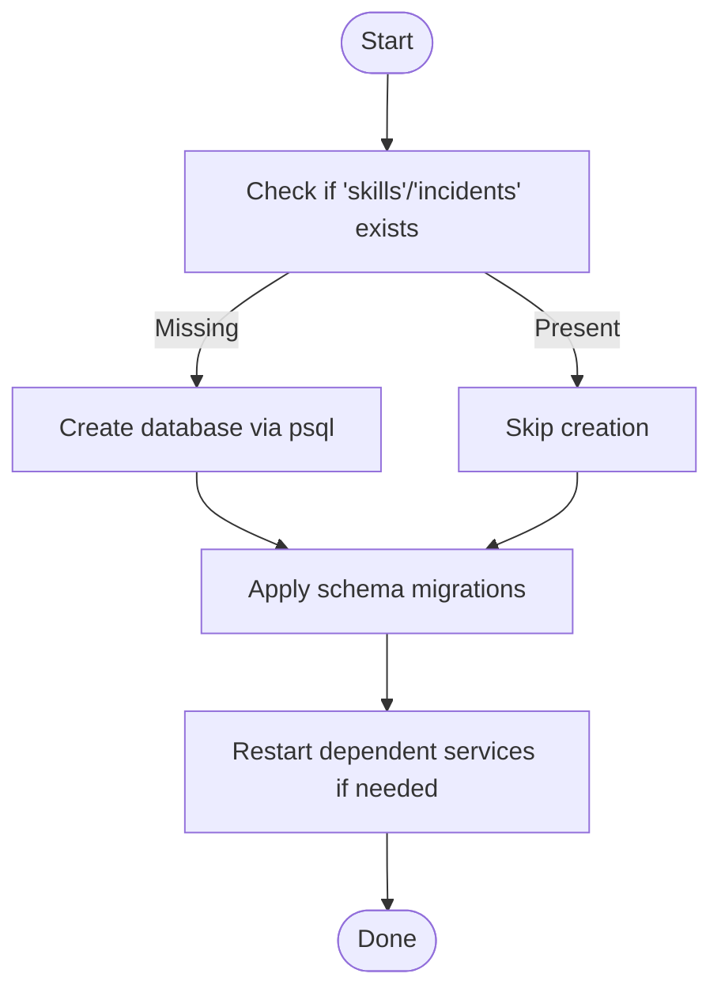
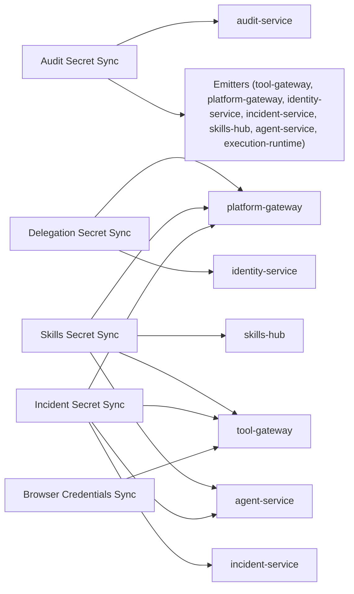

# Operational Procedures

<cite>
**Referenced Files in This Document**
- [sync-audit-secrets.sh](file://shared/platform-ops/gitops/sync-audit-secrets.sh)
- [sync-delegation-secrets.sh](file://shared/platform-ops/gitops/sync-delegation-secrets.sh)
- [sync-skills-secrets.sh](file://shared/platform-ops/gitops/sync-skills-secrets.sh)
- [sync-browser-credentials.sh](file://shared/platform-ops/gitops/sync-browser-credentials.sh)
- [sync-incident-secrets.sh](file://shared/platform-ops/gitops/sync-incident-secrets.sh)
- [deploy-overlay.sh](file://shared/platform-ops/gitops/deploy-overlay.sh)
- [kustomization.yaml](file://shared/platform-ops/gitops/dev-k8s/base/kustomization.yaml)
- [postgres-statefulset.yaml](file://shared/platform-ops/gitops/dev-k8s/base/infra/postgres-statefulset.yaml)
</cite>

## Table of Contents
1. Introduction
2. Project Structure
3. Core Components
4. Architecture Overview
5. Detailed Component Analysis
6. Dependency Analysis
7. Performance Considerations
8. Troubleshooting Guide
9. Conclusion
10. Appendices

## Introduction
This document provides operational procedures for day-to-day management of the Luban AIOPS platform in production. It covers scaling, database migrations, backups and recovery, disaster recovery, secret synchronization, capacity planning, maintenance (rolling updates, certificate rotation, dependency upgrades, data cleanup), runbooks for common scenarios, and rollback/recovery from failed deployments or configuration errors.

## Project Structure
The platform is deployed via Kustomize overlays under shared/platform-ops/gitops. The base overlay defines all services, stateful sets, and ConfigMaps. A deploy script applies overlays, sets images, and restarts workloads when configuration changes occur. Secrets are provisioned by dedicated sync scripts that update runtime-secrets.env files and apply Kubernetes Secrets.

**Diagram sources**
- [kustomization.yaml:45-71](file://shared/platform-ops/gitops/dev-k8s/base/kustomization.yaml#L45-L71)
- [postgres-statefulset.yaml:1-63](file://shared/platform-ops/gitops/dev-k8s/base/infra/postgres-statefulset.yaml#L1-L63)

**Section sources**
- [kustomization.yaml:1-72](file://shared/platform-ops/gitops/dev-k8s/base/kustomization.yaml#L1-L72)
- [deploy-overlay.sh:1-108](file://shared/platform-ops/gitops/deploy-overlay.sh#L1-L108)

## Core Components
- Secret provisioning scripts manage cross-service authentication and credentials:
  - Audit ingestion secrets synchronize a shared ingest secret across emitters and the audit-service registry.
  - Token delegation secrets configure platform-gateway to identity-broker token exchange.
  - Skills query secrets configure skills-hub client registry and caller credentials.
  - Incident secrets configure Alertmanager webhook token and incident query clients.
  - Browser credentials mount credential sets into tool-gateway.
- Deployment automation:
  - Overlay application and image rollout via deploy-overlay.sh.
  - ConfigMap-driven configuration with automatic rollout on config changes.
- Data stores:
  - PostgreSQL StatefulSet with initdb scripts and persistent storage.

**Section sources**
- [sync-audit-secrets.sh:1-169](file://shared/platform-ops/gitops/sync-audit-secrets.sh#L1-L169)
- [sync-delegation-secrets.sh:1-97](file://shared/platform-ops/gitops/sync-delegation-secrets.sh#L1-L97)
- [sync-skills-secrets.sh:1-197](file://shared/platform-ops/gitops/sync-skills-secrets.sh#L1-L197)
- [sync-incident-secrets.sh:1-176](file://shared/platform-ops/gitops/sync-incident-secrets.sh#L1-L176)
- [sync-browser-credentials.sh:1-81](file://shared/platform-ops/gitops/sync-browser-credentials.sh#L1-L81)
- [deploy-overlay.sh:1-108](file://shared/platform-ops/gitops/deploy-overlay.sh#L1-L108)
- [postgres-statefulset.yaml:1-63](file://shared/platform-ops/gitops/dev-k8s/base/infra/postgres-statefulset.yaml#L1-L63)

## Architecture Overview
Secret synchronization follows a consistent pattern: generate or reuse a shared secret, write/update runtime-secrets.env files, apply Kubernetes Secrets, then restart affected deployments. Some scripts also ensure required databases exist before applying secrets.

**Diagram sources**
- [sync-audit-secrets.sh:65-169](file://shared/platform-ops/gitops/sync-audit-secrets.sh#L65-L169)
- [sync-delegation-secrets.sh:43-97](file://shared/platform-ops/gitops/sync-delegation-secrets.sh#L43-L97)
- [sync-skills-secrets.sh:51-197](file://shared/platform-ops/gitops/sync-skills-secrets.sh#L51-L197)
- [sync-incident-secrets.sh:47-176](file://shared/platform-ops/gitops/sync-incident-secrets.sh#L47-L176)
- [sync-browser-credentials.sh:36-81](file://shared/platform-ops/gitops/sync-browser-credentials.sh#L36-L81)

## Detailed Component Analysis

### Scaling Services Horizontally
- Use kubectl to scale deployments based on observed load:
  - Scale web-facing components first (platform-gateway, tool-gateway, web-ui).
  - Scale compute-heavy components next (agent-service, execution-runtime).
  - Keep stateless service replicas balanced; monitor queueing and latency.
- Validate scaling:
  - Check rollout status and readiness probes.
  - Verify metrics and logs for improved throughput and reduced error rates.
- Notes:
  - Configuration changes in ConfigMaps trigger rollouts automatically via deploy-overlay.sh logic.

**Section sources**
- [deploy-overlay.sh:63-76](file://shared/platform-ops/gitops/deploy-overlay.sh#L63-L76)

### Managing Database Migrations for PostgreSQL-backed Services
- Databases created:
  - audit (default), skills, incidents.
- Fresh clusters:
  - Init scripts create skills and incidents databases via mounted initdb directory.
- Existing clusters:
  - Scripts ensure databases exist idempotently before applying secrets.
- Migration steps:
  - Ensure Postgres pod is running.
  - Run relevant sync scripts to create databases if missing.
  - Apply schema changes using your migration tool against the appropriate database.
  - Restart dependent services only if they require schema changes at boot.

**Diagram sources**
- [sync-skills-secrets.sh:51-63](file://shared/platform-ops/gitops/sync-skills-secrets.sh#L51-L63)
- [sync-incident-secrets.sh:47-58](file://shared/platform-ops/gitops/sync-incident-secrets.sh#L47-L58)
- [postgres-statefulset.yaml:41-50](file://shared/platform-ops/gitops/dev-k8s/base/infra/postgres-statefulset.yaml#L41-L50)

**Section sources**
- [postgres-statefulset.yaml:21-50](file://shared/platform-ops/gitops/dev-k8s/base/infra/postgres-statefulset.yaml#L21-L50)
- [sync-skills-secrets.sh:51-63](file://shared/platform-ops/gitops/sync-skills-secrets.sh#L51-L63)
- [sync-incident-secrets.sh:47-58](file://shared/platform-ops/gitops/sync-incident-secrets.sh#L47-L58)

### Backups and Recovery Procedures
- Backups:
  - Use your preferred PostgreSQL backup strategy (e.g., pg_dump or cluster-level snapshots) targeting the Postgres PersistentVolume.
  - Include both data and any custom schemas/migrations stored outside the database.
- Recovery:
  - Restore from backup to a temporary instance first to validate integrity.
  - Stop dependent services during restore to avoid writes.
  - Restore to production, verify connectivity, and restart services.
- Validation:
  - Confirm database sizes, row counts, and critical tables post-restore.
  - Re-run key queries and smoke tests for each service.

[No sources needed since this section provides general guidance]

### Disaster Recovery Plan
- Objectives:
  - Minimize downtime and data loss.
  - Restore full platform functionality including secrets and configurations.
- Steps:
  - Provision a new cluster or namespace.
  - Apply base overlay and target overlay via deploy-overlay.sh.
  - Re-provision secrets using sync scripts.
  - Restore PostgreSQL data from latest known-good backup.
  - Validate services and perform smoke tests.
- Communication:
  - Notify stakeholders, track progress, and document actions taken.

[No sources needed since this section provides general guidance]

### Secret Synchronization Procedures

#### Audit Ingestion Secrets
- Purpose:
  - Authenticate all audit event emitters to audit-service using a shared ingest secret.
- Procedure:
  - Run the audit secret sync script to generate or reuse AUDIT_INGEST_SECRET.
  - The script updates audit-service registry and emitter secrets, then restarts audit-service followed by emitters.
- Verification:
  - Confirm audit-service rollout completed and emitters restarted successfully.
  - Test emitting an audit event and querying events.

**Section sources**
- [sync-audit-secrets.sh:1-169](file://shared/platform-ops/gitops/sync-audit-secrets.sh#L1-L169)

#### Token Delegation Secrets
- Purpose:
  - Allow platform-gateway to exchange user portal JWTs for short-lived delegated tokens at identity-broker.
- Procedure:
  - Run the delegation secret sync script to set matching client secrets on platform-gateway and identity-broker.
  - The script applies secrets and restarts both deployments.
- Verification:
  - Confirm rollout status and test token exchange flow through the gateway.

**Section sources**
- [sync-delegation-secrets.sh:1-97](file://shared/platform-ops/gitops/sync-delegation-secrets.sh#L1-L97)

#### Skills Query Authentication Secrets
- Purpose:
  - Authenticate callers (tool-gateway, platform-gateway, agent-service) to skills-hub.
- Procedure:
  - Run the skills secret sync script to set SKILLS_QUERY_CLIENTS and per-caller secrets.
  - Ensures the skills database exists, then applies secrets and restarts services.
- Optional:
  - Provide a Git PAT via environment variable to enable git-based skill sources.
- Verification:
  - Confirm skills retrieval works via tools or direct API calls.

**Section sources**
- [sync-skills-secrets.sh:1-197](file://shared/platform-ops/gitops/sync-skills-secrets.sh#L1-L197)

#### Incident Webhook Tokens and Query Secrets
- Purpose:
  - Secure Alertmanager webhook intake and platform query access to incident-service.
- Procedure:
  - Run the incident secret sync script to set INCIDENT_WEBHOOK_TOKEN and INCIDENT_QUERY_CLIENTS.
  - Ensures the incidents database exists, applies secrets, and restarts services.
- Verification:
  - Send a test alert to the webhook endpoint and confirm incident creation.

**Section sources**
- [sync-incident-secrets.sh:1-176](file://shared/platform-ops/gitops/sync-incident-secrets.sh#L1-L176)

#### Browser Credentials
- Purpose:
  - Mount named credential sets into tool-gateway for web.fill_credential usage.
- Procedure:
  - Run the browser credentials sync script with optional input file or generate dev defaults.
  - Applies the secret and restarts tool-gateway.
- Verification:
  - Confirm tool-gateway can resolve credential sets and perform login flows.

**Section sources**
- [sync-browser-credentials.sh:1-81](file://shared/platform-ops/gitops/sync-browser-credentials.sh#L1-L81)

### Capacity Planning and Resource Allocation
- Guidelines:
  - Size CPU/memory requests/limits per workload type:
    - Gateway services: moderate CPU, low memory.
    - Agent and execution services: higher CPU for processing, tune memory for concurrency.
    - PostgreSQL: allocate sufficient CPU and memory for concurrent connections and I/O.
  - Set horizontal pod autoscaling targets based on request rate and latency SLOs.
  - Monitor resource utilization and adjust limits to prevent throttling or OOM kills.
- Storage:
  - Ensure PersistentVolume claims have adequate size and IOPS for PostgreSQL.
  - Plan retention policies for audit, skills, and incident data.

[No sources needed since this section provides general guidance]

### Performance Tuning Guidelines
- Application-level:
  - Tune connection pools for PostgreSQL and Redis where applicable.
  - Adjust concurrency settings for agent and execution workers based on CPU and memory headroom.
- Infrastructure-level:
  - Use node affinity/anti-affinity to spread pods across nodes.
  - Enable resource quotas and limit ranges to protect multi-tenant namespaces.
- Observability:
  - Track latency percentiles, error rates, and saturation metrics.
  - Correlate performance regressions with recent config or secret changes.

[No sources needed since this section provides general guidance]

### Maintenance Procedures

#### Rolling Updates
- Process:
  - Build images and set IMAGE_TAG.
  - Apply overlay via deploy-overlay.sh to update images and restart deployments.
  - Watch rollout status for each deployment.
- Safety:
  - Perform updates one component at a time if dependencies are sensitive.
  - Keep a previous image tag available for quick rollback.

**Section sources**
- [deploy-overlay.sh:41-108](file://shared/platform-ops/gitops/deploy-overlay.sh#L41-L108)

#### Certificate Rotation
- General approach:
  - Replace TLS certificates in ingress or service mesh configuration.
  - Trigger rolling restarts to pick up new certs.
  - Validate HTTPS endpoints and certificate chains.
- Notes:
  - Coordinate with network/security teams for CA trust updates.

[No sources needed since this section provides general guidance]

#### Dependency Upgrades
- Process:
  - Upgrade base images and dependencies incrementally.
  - Rebuild images and redeploy via deploy-overlay.sh.
  - Validate compatibility with existing secrets and configs.
- Risk mitigation:
  - Test in a staging overlay before production.
  - Prepare rollback plan to previous image tags.

[No sources needed since this section provides general guidance]

#### Cleanup of Expired Data
- Strategy:
  - Implement retention policies for audit, incident, and session data.
  - Schedule periodic jobs to archive and purge expired records.
  - Monitor storage growth and adjust retention thresholds.

[No sources needed since this section provides general guidance]

### Runbooks for Common Operational Scenarios

#### Handling Service Outages
- Immediate actions:
  - Check deployment rollout status and pod health.
  - Review recent secret or config changes that may have triggered failures.
  - Restart affected deployments if necessary.
- Escalation:
  - If database-related, check PostgreSQL availability and disk space.
  - Engage infrastructure team for node or network issues.

**Section sources**
- [deploy-overlay.sh:63-76](file://shared/platform-ops/gitops/deploy-overlay.sh#L63-L76)

#### Investigating Performance Issues
- Steps:
  - Identify high-latency endpoints and correlate with resource utilization.
  - Check for misconfigured secrets causing retries or auth failures.
  - Review autoscaling behavior and adjust thresholds if needed.
- Tools:
  - Use logs, metrics, and tracing to pinpoint bottlenecks.

[No sources needed since this section provides general guidance]

#### Managing Storage Growth
- Actions:
  - Inspect PostgreSQL volume usage and identify large tables.
  - Apply retention policies and archive old data.
  - Expand PersistentVolume claims if necessary.

[No sources needed since this section provides general guidance]

#### Responding to Security Incidents
- Containment:
  - Rotate compromised secrets immediately using relevant sync scripts.
  - Restrict access to affected services and databases.
- Investigation:
  - Review audit logs and incident reports for indicators of compromise.
  - Preserve evidence and notify security team.
- Recovery:
  - Re-provision clean secrets and validate service functionality.

**Section sources**
- [sync-audit-secrets.sh:1-169](file://shared/platform-ops/gitops/sync-audit-secrets.sh#L1-L169)
- [sync-delegation-secrets.sh:1-97](file://shared/platform-ops/gitops/sync-delegation-secrets.sh#L1-L97)
- [sync-skills-secrets.sh:1-197](file://shared/platform-ops/gitops/sync-skills-secrets.sh#L1-L197)
- [sync-incident-secrets.sh:1-176](file://shared/platform-ops/gitops/sync-incident-secrets.sh#L1-L176)
- [sync-browser-credentials.sh:1-81](file://shared/platform-ops/gitops/sync-browser-credentials.sh#L1-L81)

### Rollback Procedures for Failed Deployments
- Image rollback:
  - Reapply overlay with previous IMAGE_TAG to revert images.
  - Confirm rollout status and service health.
- Configuration rollback:
  - Revert ConfigMap changes and trigger rollout restart.
- Secret rollback:
  - Re-run sync scripts with previous secret values if needed.

**Section sources**
- [deploy-overlay.sh:41-108](file://shared/platform-ops/gitops/deploy-overlay.sh#L41-L108)

### Recovery from Configuration Errors
- Symptoms:
  - Services fail to start or report invalid configuration.
- Resolution:
  - Revert ConfigMap changes and restart affected deployments.
  - Validate environment variables and policy files.
  - Use deploy-overlay.sh to reapply corrected configuration.

**Section sources**
- [deploy-overlay.sh:63-76](file://shared/platform-ops/gitops/deploy-overlay.sh#L63-L76)

## Dependency Analysis
Secret synchronization creates tight coupling between services and their credentials. Misconfiguration in one script can cascade to multiple services.

**Diagram sources**
- [sync-audit-secrets.sh:65-169](file://shared/platform-ops/gitops/sync-audit-secrets.sh#L65-L169)
- [sync-delegation-secrets.sh:43-97](file://shared/platform-ops/gitops/sync-delegation-secrets.sh#L43-L97)
- [sync-skills-secrets.sh:116-197](file://shared/platform-ops/gitops/sync-skills-secrets.sh#L116-L197)
- [sync-incident-secrets.sh:116-176](file://shared/platform-ops/gitops/sync-incident-secrets.sh#L116-L176)
- [sync-browser-credentials.sh:36-81](file://shared/platform-ops/gitops/sync-browser-credentials.sh#L36-L81)

**Section sources**
- [sync-audit-secrets.sh:1-169](file://shared/platform-ops/gitops/sync-audit-secrets.sh#L1-L169)
- [sync-delegation-secrets.sh:1-97](file://shared/platform-ops/gitops/sync-delegation-secrets.sh#L1-L97)
- [sync-skills-secrets.sh:1-197](file://shared/platform-ops/gitops/sync-skills-secrets.sh#L1-L197)
- [sync-incident-secrets.sh:1-176](file://shared/platform-ops/gitops/sync-incident-secrets.sh#L1-L176)
- [sync-browser-credentials.sh:1-81](file://shared/platform-ops/gitops/sync-browser-credentials.sh#L1-L81)

## Performance Considerations
- Monitor latency and error rates across gateways and services.
- Tune concurrency and connection pools based on observed load.
- Ensure PostgreSQL has sufficient IOPS and memory for peak workloads.
- Use autoscaling to handle traffic spikes while maintaining SLOs.

[No sources needed since this section provides general guidance]

## Troubleshooting Guide
- Secret sync failures:
  - Verify namespace and permissions for kubectl operations.
  - Check runtime-secrets.env content and ensure no syntax errors.
  - Confirm rollout status after applying secrets.
- Database issues:
  - Ensure Postgres pod is healthy and reachable.
  - Verify required databases exist and schemas are applied.
- Service connectivity:
  - Validate DNS and network policies between services.
  - Check for misconfigured client secrets causing authentication failures.

**Section sources**
- [sync-audit-secrets.sh:65-169](file://shared/platform-ops/gitops/sync-audit-secrets.sh#L65-L169)
- [sync-delegation-secrets.sh:43-97](file://shared/platform-ops/gitops/sync-delegation-secrets.sh#L43-L97)
- [sync-skills-secrets.sh:51-197](file://shared/platform-ops/gitops/sync-skills-secrets.sh#L51-L197)
- [sync-incident-secrets.sh:47-176](file://shared/platform-ops/gitops/sync-incident-secrets.sh#L47-L176)
- [sync-browser-credentials.sh:36-81](file://shared/platform-ops/gitops/sync-browser-credentials.sh#L36-L81)

## Conclusion
This document outlines operational procedures for managing the Luban AIOPS platform, focusing on secret synchronization, database management, scaling, maintenance, and troubleshooting. Following these procedures ensures reliable operation, rapid recovery, and controlled evolution of the platform in production environments.

## Appendices

### Quick Reference: Secret Sync Commands
- Audit ingestion:
  - Run audit secret sync script to provision and restart services.
- Token delegation:
  - Run delegation secret sync script to configure platform-gateway and identity-broker.
- Skills query:
  - Run skills secret sync script to configure skills-hub and callers.
- Incident intake/query:
  - Run incident secret sync script to configure webhook and query clients.
- Browser credentials:
  - Run browser credentials sync script to mount credential sets.

**Section sources**
- [sync-audit-secrets.sh:1-169](file://shared/platform-ops/gitops/sync-audit-secrets.sh#L1-L169)
- [sync-delegation-secrets.sh:1-97](file://shared/platform-ops/gitops/sync-delegation-secrets.sh#L1-L97)
- [sync-skills-secrets.sh:1-197](file://shared/platform-ops/gitops/sync-skills-secrets.sh#L1-L197)
- [sync-incident-secrets.sh:1-176](file://shared/platform-ops/gitops/sync-incident-secrets.sh#L1-L176)
- [sync-browser-credentials.sh:1-81](file://shared/platform-ops/gitops/sync-browser-credentials.sh#L1-L81)