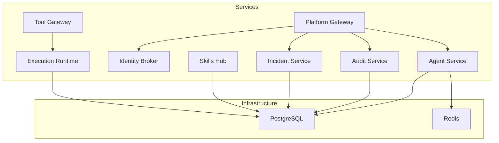
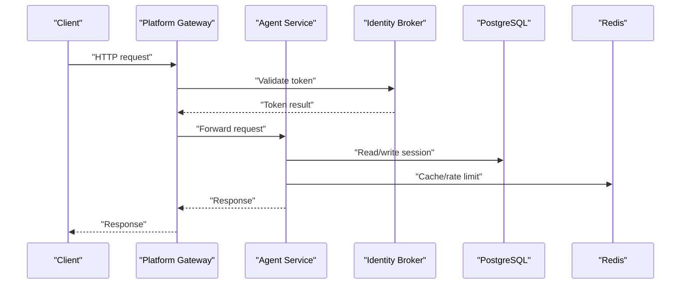
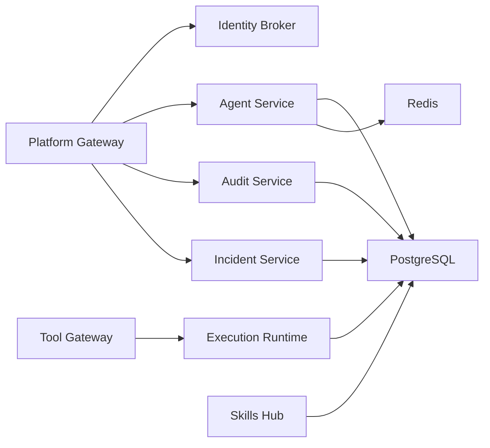

# Scaling and Capacity Planning

<cite>
**Referenced Files in This Document**
- [agent-service-deployment.yaml](file://shared/platform-ops/gitops/dev-k8s/base/agent-platform/agent-service-deployment.yaml)
- [platform-gateway-deployment.yaml](file://shared/platform-ops/gitops/dev-k8s/base/platform-gateway/platform-gateway-deployment.yaml)
- [tool-gateway-deployment.yaml](file://shared/platform-ops/gitops/dev-k8s/base/tool-gateway/tool-gateway-deployment.yaml)
- [identity-service-deployment.yaml](file://shared/platform-ops/gitops/dev-k8s/base/identity-broker/identity-service-deployment.yaml)
- [audit-service-deployment.yaml](file://shared/platform-ops/gitops/dev-k8s/base/audit-service/audit-service-deployment.yaml)
- [incident-service-deployment.yaml](file://shared/platform-ops/gitops/dev-k8s/base/incident-service/incident-service-deployment.yaml)
- [skills-hub-deployment.yaml](file://shared/platform-ops/gitops/dev-k8s/base/skills-hub/skills-hub-deployment.yaml)
- [execution-runtime-deployment.yaml](file://shared/platform-ops/gitops/dev-k8s/base/execution-runtime/execution-runtime-deployment.yaml)
- [postgres-statefulset.yaml](file://shared/platform-ops/gitops/dev-k8s/base/infra/postgres-statefulset.yaml)
- [redis-deployment.yaml](file://shared/platform-ops/gitops/dev-k8s/base/infra/redis-deployment.yaml)
</cite>

## Table of Contents
1. Introduction
2. Project Structure
3. Core Components
4. Architecture Overview
5. Detailed Component Analysis
6. Dependency Analysis
7. Performance Considerations
8. Troubleshooting Guide
9. Conclusion
10. Appendices

## Introduction
This document provides scaling and capacity planning guidance for the Luban AIOPS platform. It focuses on horizontal scaling strategies for each microservice, resource allocation recommendations by workload pattern, Kubernetes deployment configuration for replicas, CPU/memory limits, and autoscaling policies. It also covers database scaling considerations for PostgreSQL-backed services (connection pooling, read replicas, partitioning), Redis caching layer scaling for session storage and rate limiting, capacity planning formulas based on concurrent users, message throughput, and storage growth projections, performance tuning parameters per service type, and monitoring metrics to track utilization and identify scaling triggers.

## Project Structure
The platform deploys a set of stateless microservices behind gateways, with shared infrastructure for persistence (PostgreSQL) and caching (Redis). Each service exposes Prometheus metrics at /metrics on port 8000 and uses readiness/liveness probes where applicable. The base Kubernetes manifests define default replica counts and environment wiring via ConfigMaps and Secrets.

**Diagram sources**
- [platform-gateway-deployment.yaml:1-49](file://shared/platform-ops/gitops/dev-k8s/base/platform-gateway/platform-gateway-deployment.yaml#L1-L49)
- [tool-gateway-deployment.yaml:1-49](file://shared/platform-ops/gitops/dev-k8s/base/tool-gateway/tool-gateway-deployment.yaml#L1-L49)
- [agent-service-deployment.yaml:1-69](file://shared/platform-ops/gitops/dev-k8s/base/agent-platform/agent-service-deployment.yaml#L1-L69)
- [identity-service-deployment.yaml:1-40](file://shared/platform-ops/gitops/dev-k8s/base/identity-broker/identity-service-deployment.yaml#L1-L40)
- [audit-service-deployment.yaml:1-58](file://shared/platform-ops/gitops/dev-k8s/base/audit-service/audit-service-deployment.yaml#L1-L58)
- [incident-service-deployment.yaml:1-58](file://shared/platform-ops/gitops/dev-k8s/base/incident-service/incident-service-deployment.yaml#L1-L58)
- [skills-hub-deployment.yaml:1-122](file://shared/platform-ops/gitops/dev-k8s/base/skills-hub/skills-hub-deployment.yaml#L1-L122)
- [execution-runtime-deployment.yaml:1-80](file://shared/platform-ops/gitops/dev-k8s/base/execution-runtime/execution-runtime-deployment.yaml#L1-L80)
- [postgres-statefulset.yaml:1-63](file://shared/platform-ops/gitops/dev-k8s/base/infra/postgres-statefulset.yaml#L1-L63)
- [redis-deployment.yaml:1-30](file://shared/platform-ops/gitops/dev-k8s/base/infra/redis-deployment.yaml#L1-L30)

**Section sources**
- [platform-gateway-deployment.yaml:1-49](file://shared/platform-ops/gitops/dev-k8s/base/platform-gateway/platform-gateway-deployment.yaml#L1-L49)
- [tool-gateway-deployment.yaml:1-49](file://shared/platform-ops/gitops/dev-k8s/base/tool-gateway/tool-gateway-deployment.yaml#L1-L49)
- [agent-service-deployment.yaml:1-69](file://shared/platform-ops/gitops/dev-k8s/base/agent-platform/agent-service-deployment.yaml#L1-L69)
- [identity-service-deployment.yaml:1-40](file://shared/platform-ops/gitops/dev-k8s/base/identity-broker/identity-service-deployment.yaml#L1-L40)
- [audit-service-deployment.yaml:1-58](file://shared/platform-ops/gitops/dev-k8s/base/audit-service/audit-service-deployment.yaml#L1-L58)
- [incident-service-deployment.yaml:1-58](file://shared/platform-ops/gitops/dev-k8s/base/incident-service/incident-service-deployment.yaml#L1-L58)
- [skills-hub-deployment.yaml:1-122](file://shared/platform-ops/gitops/dev-k8s/base/skills-hub/skills-hub-deployment.yaml#L1-L122)
- [execution-runtime-deployment.yaml:1-80](file://shared/platform-ops/gitops/dev-k8s/base/execution-runtime/execution-runtime-deployment.yaml#L1-L80)
- [postgres-statefulset.yaml:1-63](file://shared/platform-ops/gitops/dev-k8s/base/infra/postgres-statefulset.yaml#L1-L63)
- [redis-deployment.yaml:1-30](file://shared/platform-ops/gitops/dev-k8s/base/infra/redis-deployment.yaml#L1-L30)

## Core Components
- Platform Gateway: Ingress control plane for chat and policy enforcement; stateless HTTP proxy with policy mounts.
- Tool Gateway: External tool invocation boundary; stateless HTTP API.
- Agent Service: Orchestrates agent sessions, model calls, approvals, and execution handoff; writes sessions to PostgreSQL and caches ephemeral state in Redis.
- Identity Broker: Issues and validates tokens for service-to-service identity.
- Audit Service: High-throughput ingestion and query of audit events; persists to PostgreSQL.
- Incident Service: Stores and queries incident data; persists to PostgreSQL.
- Skills Hub: Ingests and serves skills content; reads/writes to PostgreSQL and uses local scratch space.
- Execution Runtime: Executes tools under signed requests with single-flight idempotency; pinned to one replica due to in-process registry.

Horizontal scaling strategy overview:
- Stateless services (platform-gateway, tool-gateway, identity-broker, audit-service, incident-service, skills-hub) scale horizontally by increasing replicas.
- Agent service scales horizontally with care for session affinity or externalized session store; currently uses PostgreSQL for sessions and Redis for cache.
- Execution runtime is intentionally single-replica until durable flight registry is implemented.

Resource allocation recommendations by workload pattern:
- Chat sessions (agent-service): CPU-bound streaming responses; prefer moderate CPU with burst capability; memory sized for concurrent sessions and model buffers.
- Tool executions (tool-gateway + execution-runtime): I/O-bound to external systems; increase replicas to parallelize; ensure network bandwidth and egress quotas.
- Policy evaluations (platform-gateway, tool-gateway): Low-latency decision checks; small CPU footprint; scale out under high concurrency.
- Audit ingestion (audit-service): Write-heavy; scale out ingestion workers; tune DB write throughput and WAL settings.

Kubernetes deployment configuration notes:
- All services expose metrics at /metrics on port 8000.
- Default replicas are 1 across all deployments; adjust per load profile.
- Readiness and liveness probes are configured for several services with generous timeouts to avoid restart loops under transient load.

**Section sources**
- [platform-gateway-deployment.yaml:1-49](file://shared/platform-ops/gitops/dev-k8s/base/platform-gateway/platform-gateway-deployment.yaml#L1-L49)
- [tool-gateway-deployment.yaml:1-49](file://shared/platform-ops/gitops/dev-k8s/base/tool-gateway/tool-gateway-deployment.yaml#L1-L49)
- [agent-service-deployment.yaml:1-69](file://shared/platform-ops/gitops/dev-k8s/base/agent-platform/agent-service-deployment.yaml#L1-L69)
- [identity-service-deployment.yaml:1-40](file://shared/platform-ops/gitops/dev-k8s/base/identity-broker/identity-service-deployment.yaml#L1-L40)
- [audit-service-deployment.yaml:1-58](file://shared/platform-ops/gitops/dev-k8s/base/audit-service/audit-service-deployment.yaml#L1-L58)
- [incident-service-deployment.yaml:1-58](file://shared/platform-ops/gitops/dev-k8s/base/incident-service/incident-service-deployment.yaml#L1-L58)
- [skills-hub-deployment.yaml:1-122](file://shared/platform-ops/gitops/dev-k8s/base/skills-hub/skills-hub-deployment.yaml#L1-L122)
- [execution-runtime-deployment.yaml:1-80](file://shared/platform-ops/gitops/dev-k8s/base/execution-runtime/execution-runtime-deployment.yaml#L1-L80)

## Architecture Overview
The request path typically flows through gateways into backend services, which persist state to PostgreSQL and use Redis for caching and rate limiting.

**Diagram sources**
- [platform-gateway-deployment.yaml:1-49](file://shared/platform-ops/gitops/dev-k8s/base/platform-gateway/platform-gateway-deployment.yaml#L1-L49)
- [agent-service-deployment.yaml:1-69](file://shared/platform-ops/gitops/dev-k8s/base/agent-platform/agent-service-deployment.yaml#L1-L69)
- [identity-service-deployment.yaml:1-40](file://shared/platform-ops/gitops/dev-k8s/base/identity-broker/identity-service-deployment.yaml#L1-L40)
- [postgres-statefulset.yaml:1-63](file://shared/platform-ops/gitops/dev-k8s/base/infra/postgres-statefulset.yaml#L1-L63)
- [redis-deployment.yaml:1-30](file://shared/platform-ops/gitops/dev-k8s/base/infra/redis-deployment.yaml#L1-L30)

## Detailed Component Analysis

### Platform Gateway
- Role: Central ingress for chat and policy enforcement; mounts policy files from ConfigMap.
- Horizontal scaling: Scale replicas based on concurrent HTTP connections and policy evaluation throughput.
- Resource allocation: Small CPU per replica; memory modest; focus on network throughput.
- Autoscaling: HPA targets CPU utilization and/or custom metrics like requests per second and latency percentiles.
- Probes: Readiness/liveness endpoints exposed; ensure sufficient headroom during startup spikes.

Capacity planning tips:
- Estimate replicas = ceil(peak_rps / rps_per_replica).
- Monitor p95/p99 latency; scale when latency exceeds SLO.

**Section sources**
- [platform-gateway-deployment.yaml:1-49](file://shared/platform-ops/gitops/dev-k8s/base/platform-gateway/platform-gateway-deployment.yaml#L1-L49)

### Tool Gateway
- Role: Boundary for invoking external tools; enforces policies and redaction.
- Horizontal scaling: Scale out to parallelize tool invocations; consider connection limits to downstream systems.
- Resource allocation: Moderate CPU; memory depends on payload sizes and buffering.
- Autoscaling: HPA based on CPU and queue depth if backpressure is observed.

Capacity planning tips:
- Measure average tool call duration; target concurrency per replica such that tail latencies remain within SLO.
- Use circuit breakers and retries with backoff to protect downstream systems.

**Section sources**
- [tool-gateway-deployment.yaml:1-49](file://shared/platform-ops/gitops/dev-k8s/base/tool-gateway/tool-gateway-deployment.yaml#L1-L49)

### Agent Service
- Role: Manages agent sessions, model interactions, approvals, and execution handoff; persists sessions to PostgreSQL and uses Redis for cache.
- Horizontal scaling: Increase replicas; ensure session affinity or externalized session store to avoid hotspots.
- Resource allocation: CPU for streaming responses; memory for concurrent sessions and buffers.
- Autoscaling: HPA targeting CPU and custom metrics like active sessions and response latency.
- Probes: Metrics endpoint enabled; readiness/liveness tuned elsewhere for similar services.

Capacity planning tips:
- Track concurrent sessions per replica; scale when saturation approaches thresholds.
- Tune DB connection pool size relative to replicas to avoid contention.

**Section sources**
- [agent-service-deployment.yaml:1-69](file://shared/platform-ops/gitops/dev-k8s/base/agent-platform/agent-service-deployment.yaml#L1-L69)

### Identity Broker
- Role: Issues and validates tokens for service-to-service identity.
- Horizontal scaling: Scale replicas for token validation throughput.
- Resource allocation: Low CPU; minimal memory; focus on low latency.
- Autoscaling: HPA based on CPU and request rate.

Capacity planning tips:
- Cache token validations where appropriate; monitor cache hit rates.
- Ensure TLS termination and certificate rotation do not block scaling events.

**Section sources**
- [identity-service-deployment.yaml:1-40](file://shared/platform-ops/gitops/dev-k8s/base/identity-broker/identity-service-deployment.yaml#L1-L40)

### Audit Service
- Role: High-throughput ingestion and querying of audit events; persists to PostgreSQL.
- Horizontal scaling: Scale ingestion workers; shard or partition tables for large volumes.
- Resource allocation: CPU for parsing and indexing; memory for batching; disk I/O for WAL and indexes.
- Autoscaling: HPA based on ingestion rate and queue backlog; consider separate consumer pods.

Capacity planning tips:
- Batch writes and tune bulk insert sizes.
- Partition by time and enforce retention policies to manage storage growth.

**Section sources**
- [audit-service-deployment.yaml:1-58](file://shared/platform-ops/gitops/dev-k8s/base/audit-service/audit-service-deployment.yaml#L1-L58)

### Incident Service
- Role: Stores and queries incident data; persists to PostgreSQL.
- Horizontal scaling: Scale replicas for query throughput; consider read replicas for heavy reporting.
- Resource allocation: Moderate CPU; memory for query processing; disk for indexes.
- Autoscaling: HPA based on CPU and query latency.

Capacity planning tips:
- Index frequently queried fields; archive old incidents to reduce table size.
- Use read replicas for dashboards and exports.

**Section sources**
- [incident-service-deployment.yaml:1-58](file://shared/platform-ops/gitops/dev-k8s/base/incident-service/incident-service-deployment.yaml#L1-L58)

### Skills Hub
- Role: Ingests and serves skills content; uses PostgreSQL and local scratch space for checkouts.
- Horizontal scaling: Scale replicas; ensure consistent content availability via shared storage or replication.
- Resource allocation: CPU for parsing and scoring; memory for content loading; disk for temporary checkouts.
- Autoscaling: HPA based on CPU and ingestion rate.

Capacity planning tips:
- Use read replicas for serving content; keep ingestion isolated.
- Manage TTLs for temporary checkouts to prevent disk pressure.

**Section sources**
- [skills-hub-deployment.yaml:1-122](file://shared/platform-ops/gitops/dev-k8s/base/skills-hub/skills-hub-deployment.yaml#L1-L122)

### Execution Runtime
- Role: Executes tools under signed requests with single-flight idempotency; pinned to one replica due to in-process registry.
- Horizontal scaling: Currently fixed to one replica; requires durable flight registry before scaling.
- Resource allocation: CPU for execution orchestration; memory for payloads; network bandwidth for tool calls.
- Autoscaling: Not applicable until durable registry is implemented.

Capacity planning tips:
- Profile tool execution durations; optimize retries and timeouts.
- Plan for future sharding of execution workloads once durable registry exists.

**Section sources**
- [execution-runtime-deployment.yaml:1-80](file://shared/platform-ops/gitops/dev-k8s/base/execution-runtime/execution-runtime-deployment.yaml#L1-L80)

## Dependency Analysis
Service dependencies and scaling implications:
- Gateways depend on identity broker and backend services; scale gateways independently.
- Agent service depends on PostgreSQL and Redis; tune connection pools and cache eviction policies.
- Audit, incident, and skills services depend on PostgreSQL; plan read replicas and partitioning.
- Execution runtime depends on signing keys and tokens; ensure secret distribution does not block scaling.

**Diagram sources**
- [platform-gateway-deployment.yaml:1-49](file://shared/platform-ops/gitops/dev-k8s/base/platform-gateway/platform-gateway-deployment.yaml#L1-L49)
- [tool-gateway-deployment.yaml:1-49](file://shared/platform-ops/gitops/dev-k8s/base/tool-gateway/tool-gateway-deployment.yaml#L1-L49)
- [agent-service-deployment.yaml:1-69](file://shared/platform-ops/gitops/dev-k8s/base/agent-platform/agent-service-deployment.yaml#L1-L69)
- [identity-service-deployment.yaml:1-40](file://shared/platform-ops/gitops/dev-k8s/base/identity-broker/identity-service-deployment.yaml#L1-L40)
- [audit-service-deployment.yaml:1-58](file://shared/platform-ops/gitops/dev-k8s/base/audit-service/audit-service-deployment.yaml#L1-L58)
- [incident-service-deployment.yaml:1-58](file://shared/platform-ops/gitops/dev-k8s/base/incident-service/incident-service-deployment.yaml#L1-L58)
- [skills-hub-deployment.yaml:1-122](file://shared/platform-ops/gitops/dev-k8s/base/skills-hub/skills-hub-deployment.yaml#L1-L122)
- [execution-runtime-deployment.yaml:1-80](file://shared/platform-ops/gitops/dev-k8s/base/execution-runtime/execution-runtime-deployment.yaml#L1-L80)
- [postgres-statefulset.yaml:1-63](file://shared/platform-ops/gitops/dev-k8s/base/infra/postgres-statefulset.yaml#L1-L63)
- [redis-deployment.yaml:1-30](file://shared/platform-ops/gitops/dev-k8s/base/infra/redis-deployment.yaml#L1-L30)

**Section sources**
- [platform-gateway-deployment.yaml:1-49](file://shared/platform-ops/gitops/dev-k8s/base/platform-gateway/platform-gateway-deployment.yaml#L1-L49)
- [tool-gateway-deployment.yaml:1-49](file://shared/platform-ops/gitops/dev-k8s/base/tool-gateway/tool-gateway-deployment.yaml#L1-L49)
- [agent-service-deployment.yaml:1-69](file://shared/platform-ops/gitops/dev-k8s/base/agent-platform/agent-service-deployment.yaml#L1-L69)
- [identity-service-deployment.yaml:1-40](file://shared/platform-ops/gitops/dev-k8s/base/identity-broker/identity-service-deployment.yaml#L1-L40)
- [audit-service-deployment.yaml:1-58](file://shared/platform-ops/gitops/dev-k8s/base/audit-service/audit-service-deployment.yaml#L1-L58)
- [incident-service-deployment.yaml:1-58](file://shared/platform-ops/gitops/dev-k8s/base/incident-service/incident-service-deployment.yaml#L1-L58)
- [skills-hub-deployment.yaml:1-122](file://shared/platform-ops/gitops/dev-k8s/base/skills-hub/skills-hub-deployment.yaml#L1-L122)
- [execution-runtime-deployment.yaml:1-80](file://shared/platform-ops/gitops/dev-k8s/base/execution-runtime/execution-runtime-deployment.yaml#L1-L80)
- [postgres-statefulset.yaml:1-63](file://shared/platform-ops/gitops/dev-k8s/base/infra/postgres-statefulset.yaml#L1-L63)
- [redis-deployment.yaml:1-30](file://shared/platform-ops/gitops/dev-k8s/base/infra/redis-deployment.yaml#L1-L30)

## Performance Considerations
- Connection pooling: Size PostgreSQL connection pools per service replica to avoid saturation; monitor wait times and idle connections.
- Read replicas: Offload read-heavy workloads (dashboards, exports) to read replicas; route queries accordingly.
- Partitioning: Partition audit and incident tables by time; enforce retention to control storage growth.
- Redis scaling: For session storage and rate limiting, consider Redis Cluster or Sentinel for HA; tune maxmemory and eviction policies.
- Autoscaling policies: Use HPA with CPU and custom metrics (latency, RPS, queue depth); set min/max replicas and stabilization windows.
- Probes and headroom: Ensure readiness/liveness timeouts accommodate cold starts and transient load spikes.

[No sources needed since this section provides general guidance]

## Troubleshooting Guide
Common issues and mitigations:
- Liveness probe failures under load: Increase initialDelaySeconds and failureThreshold to avoid restart loops during transient slowdowns.
- Session affinity problems: If agent-service replicas share sessions via Redis, ensure consistent key namespaces and TTLs; verify cache connectivity.
- Database connection exhaustion: Reduce pool size or increase DB resources; monitor connection usage and long-running transactions.
- Audit ingestion backlogs: Scale ingestion workers; batch writes; check WAL and disk I/O bottlenecks.
- Tool execution timeouts: Tune timeouts and retries; monitor downstream service health; implement circuit breakers.

**Section sources**
- [audit-service-deployment.yaml:40-58](file://shared/platform-ops/gitops/dev-k8s/base/audit-service/audit-service-deployment.yaml#L40-L58)
- [incident-service-deployment.yaml:40-58](file://shared/platform-ops/gitops/dev-k8s/base/incident-service/incident-service-deployment.yaml#L40-L58)
- [execution-runtime-deployment.yaml:62-80](file://shared/platform-ops/gitops/dev-k8s/base/execution-runtime/execution-runtime-deployment.yaml#L62-L80)

## Conclusion
Scale stateless services horizontally using HPA based on CPU and custom metrics; pin execution-runtime to one replica until durable flight registry is implemented. Size PostgreSQL and Redis appropriately, use read replicas and partitioning for write-heavy and large datasets, and tune connection pools and cache policies. Monitor latency, throughput, and resource utilization to trigger scaling actions and maintain SLOs.

[No sources needed since this section summarizes without analyzing specific files]

## Appendices

### Capacity Planning Formulas
- Replicas estimation:
  - replicas = ceil(peak_rps / rps_per_replica)
  - rps_per_replica ≈ 1 / avg_response_time_seconds * cpu_utilization_target
- Storage growth projection:
  - monthly_growth = daily_ingest_rate_bytes * days_in_month
  - retention_days = policy-defined; archive older partitions
- Connection pool sizing:
  - pool_size ≈ max_concurrent_connections_per_service / max_pool_factor
  - monitor wait_time and idle_connections to adjust

[No sources needed since this section provides general guidance]

### Monitoring Metrics and Triggers
- Services: CPU utilization, memory usage, request rate, error rate, p95/p99 latency, active sessions, queue depth.
- PostgreSQL: Connections, transaction rate, lock waits, checkpoint frequency, disk usage, WAL volume.
- Redis: Memory usage, hit/miss ratio, evictions, connected clients, command latency.
- Triggers: Scale up when latency exceeds SLO or CPU > threshold; scale down when utilization < threshold for sustained period.

[No sources needed since this section provides general guidance]