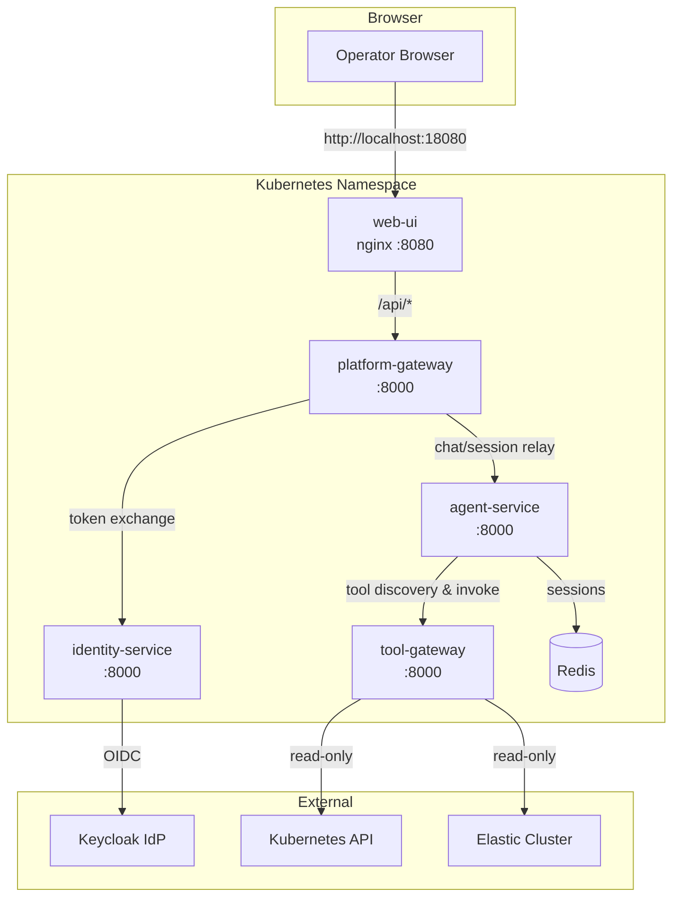
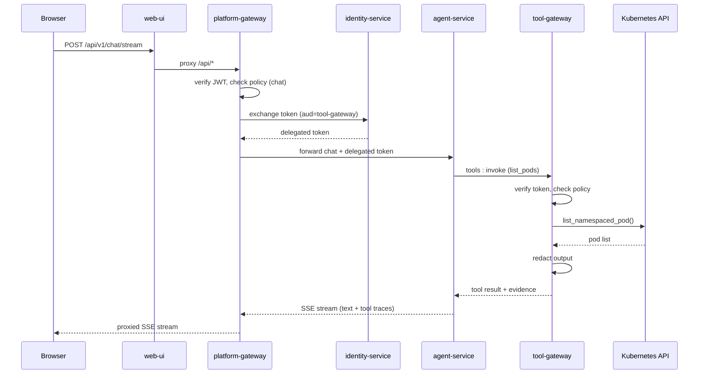
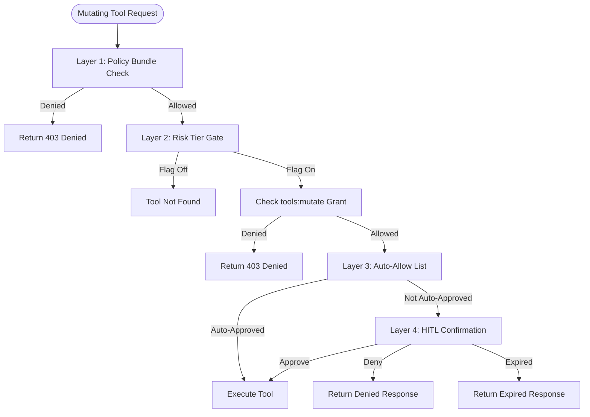
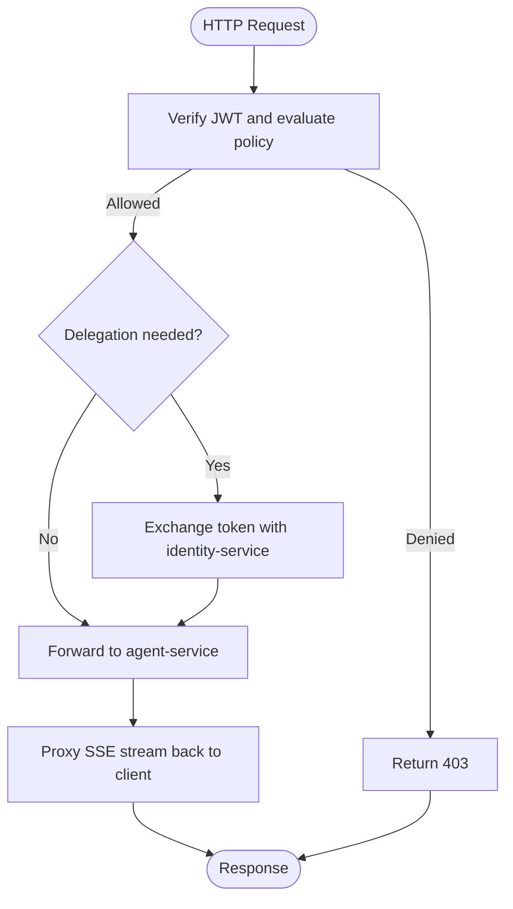
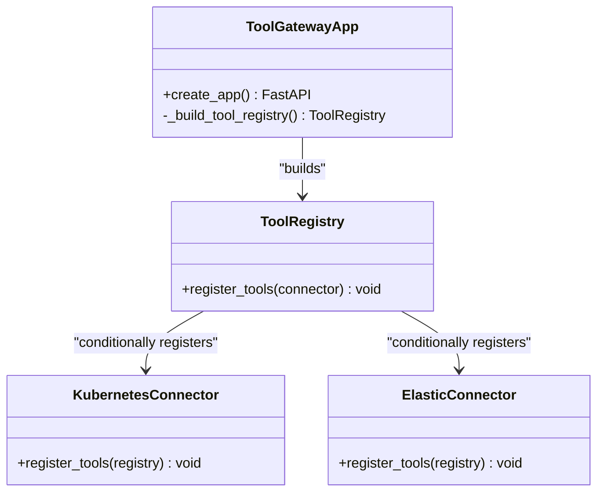
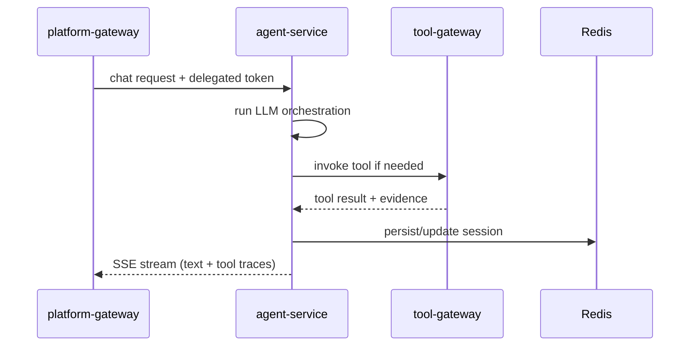
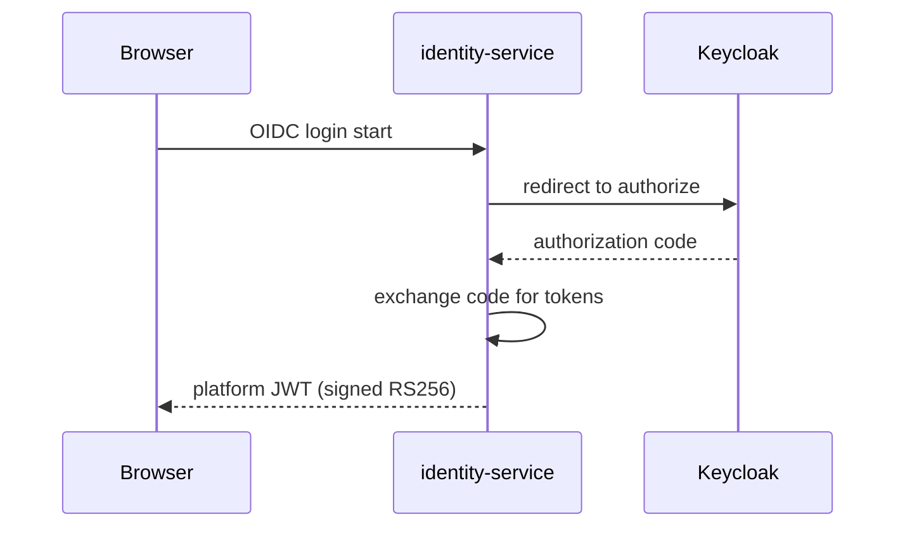
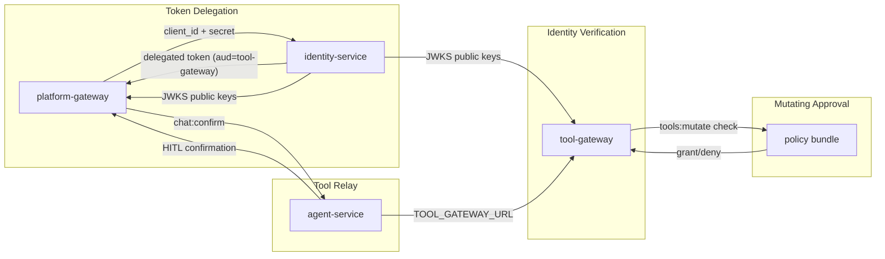

# Operator Guide Suite

<cite>
**Referenced Files in This Document**
- [README.md](file://README.md)
- [Makefile](file://Makefile)
- [docs/guides/README.md](file://docs/guides/README.md)
- [docs/guides/getting-started.md](file://docs/guides/getting-started.md)
- [docs/guides/architecture-overview.md](file://docs/guides/architecture-overview.md)
- [docs/guides/configuration-reference.md](file://docs/guides/configuration-reference.md)
- [docs/guides/troubleshooting.md](file://docs/guides/troubleshooting.md)
- [docs/guides/approval-and-hitl.md](file://docs/guides/approval-and-hitl.md)
- [docs/guides/tool-configuration.md](file://docs/guides/tool-configuration.md)
- [products/operator-portal/README.md](file://products/operator-portal/README.md)
- [shared/platform-ops/gitops/dev-k8s/README.md](file://shared/platform-ops/gitops/dev-k8s/README.md)
- [products/platform-gateway/src/platform_gateway/app.py](file://products/platform-gateway/src/platform_gateway/app.py)
- [products/tool-gateway/src/tool_gateway/app.py](file://products/tool-gateway/src/tool_gateway/app.py)
- [products/agent-platform/src/agent_service/app.py](file://products/agent-platform/src/agent_service/app.py)
- [products/identity-broker/src/identity_service/app.py](file://products/identity-broker/src/identity_service/app.py)
- [shared/shared-contracts/policies/policy-default.yaml](file://shared/shared-contracts/policies/policy-default.yaml)
- [docs/specs/SPEC-021-bounded-mutating-actions/spec.md](file://docs/specs/SPEC-021-bounded-mutating-actions/spec.md)
- [docs/specs/SPEC-020-hitl-confirmation-bridging/spec.md](file://docs/specs/SPEC-020-hitl-confirmation-bridging/spec.md)
- [shared/platform-ops/e2e/mutating-demo.sh](file://shared/platform-ops/e2e/mutating-demo.sh)
</cite>

## Update Summary
**Changes Made**
- Added comprehensive coverage of the four-layer approval model for mutating tools
- Updated architecture diagrams to reflect the new approval workflow
- Enhanced configuration reference with mutating tool activation chain
- Added troubleshooting guidance for mutating tool scenarios
- Integrated HITL confirmation bridging into operational procedures
- Updated role guidance and authorization matrix references

## Table of Contents
1. [Introduction](#introduction)
2. [Project Structure](#project-structure)
3. [Core Components](#core-components)
4. [Architecture Overview](#architecture-overview)
5. [Four-Layer Approval Model](#four-layer-approval-model)
6. [Detailed Component Analysis](#detailed-component-analysis)
7. [Dependency Analysis](#dependency-analysis)
8. [Performance Considerations](#performance-considerations)
9. [Troubleshooting Guide](#troubleshooting-guide)
10. [Conclusion](#conclusion)
11. [Appendices](#appendices)

## Introduction
This Operator Guide Suite consolidates the operational knowledge required to deploy, configure, verify, and troubleshoot the Luban AIOps platform. It focuses on the operator portal, platform gateway, agent runtime, tool execution framework, identity broker, and shared GitOps overlays used for development deployments. The guide is designed for operators who need to understand service topology, trust flows, configuration contracts, and day-to-day operational tasks.

The platform is modular and product-oriented, with clear boundaries between identity, policy, execution, and portal concerns. Operators interact primarily through the web portal, which proxies requests to the platform gateway, which in turn coordinates with the agent service and tool gateway while delegating identity and authorization via the identity broker.

**Updated** Added comprehensive coverage of the four-layer approval model that governs mutating tool execution, including risk-tier admission gates, auto-allow list management, and human-in-the-loop confirmation workflows.

**Section sources**
- [README.md:15-42](file://README.md#L15-L42)
- [docs/guides/README.md:1-30](file://docs/guides/README.md#L1-L30)

## Project Structure
At a high level, the repository organizes products under `products/`, shared contracts and operations under `shared/`, and documentation under `docs/`. The operator-facing surface includes:
- Operator portal (static UI served by nginx, proxied to platform gateway)
- Platform gateway (JWT verification, policy enforcement, chat/session proxying, token delegation)
- Agent service (LLM orchestration, session management, streaming responses)
- Tool gateway (tool discovery and invocation, connector dispatch, output redaction)
- Identity broker (OIDC login, JWT issuance, token exchange)
- Redis (session store and coordination in dev)

**Diagram sources**
- [docs/guides/architecture-overview.md:23-53](file://docs/guides/architecture-overview.md#L23-L53)

**Section sources**
- [README.md:15-42](file://README.md#L15-L42)
- [shared/platform-ops/gitops/dev-k8s/README.md:1-23](file://shared/platform-ops/gitops/dev-k8s/README.md#L1-L23)

## Core Components
- Operator Portal: Static web shell with OIDC login, chat UX, evidence panel, approval queue views, and audit visibility. It proxies `/api/` calls to the platform gateway.
- Platform Gateway: Edge service that verifies portal JWTs, enforces action policies, proxies chat/session requests to the agent service, and exchanges user tokens for delegated tokens via the identity broker.
- Agent Service: Runs the AgentScope runtime kernel, orchestrates LLM interactions, manages sessions, emits tool traces, and streams responses back through the gateway.
- Tool Gateway: Provides normalized tool access, enforces tool policies, dispatches to connectors (Kubernetes, Elastic), redacts sensitive outputs, and returns results with evidence metadata.
- Identity Broker: Handles OIDC login flow, issues platform JWTs, and performs broker-mediated token exchange for tool invocation.
- Redis: In-cluster session store and coordination component for the agent runtime in development.

**Updated** The tool gateway now implements risk-tier admission gates that enforce the `tools:mutate` policy action for write/admin tools, providing the first layer of protection against unauthorized mutations.

Operational entry points:
- Build images with coordinated tags and write image state for deployment.
- Deploy using the dev-k8s overlay, which applies manifests, patches images, waits for rollout, provisions delegation secrets, and reconciles OIDC client settings.

**Section sources**
- [products/operator-portal/README.md:1-64](file://products/operator-portal/README.md#L1-L64)
- [docs/guides/architecture-overview.md:55-105](file://docs/guides/architecture-overview.md#L55-L105)
- [Makefile:73-100](file://Makefile#L73-L100)
- [shared/platform-ops/gitops/dev-k8s/README.md:226-324](file://shared/platform-ops/gitops/dev-k8s/README.md#L226-L324)

## Architecture Overview
The platform implements a progressive trust model: identity → policy → audit. Requests traverse a linear chain from browser to external systems, with each hop enforcing authentication and authorization.

**Updated** The architecture now includes explicit approval layers for mutating tools, with risk-tier enforcement at the tool gateway and human-in-the-loop confirmation through the agent service.

Trust and authorization highlights:
- Identity flow: OIDC login via Keycloak, platform JWT issued by identity-service, verified locally by gateways using JWKS.
- Token delegation: platform-gateway exchanges user JWT for a short-lived delegated token (audience = tool-gateway) via identity-service; cached per-user with TTL.
- RBAC model: roles mapped from OIDC groups; deny-by-default policy enforced at platform-gateway and tool-gateway.
- **New**: Four-layer approval model for mutating tools with risk-tier admission, auto-allow list management, and HITL confirmation.

Observability:
- Health endpoints: `/health/live`, `/health/ready`
- Metrics: `/metrics` (Prometheus)
- Structured JSON logging with correlation headers; OpenTelemetry push opt-in

**Diagram sources**
- [docs/guides/architecture-overview.md:81-105](file://docs/guides/architecture-overview.md#L81-L105)

**Section sources**
- [docs/guides/architecture-overview.md:107-224](file://docs/guides/architecture-overview.md#L107-L224)

## Four-Layer Approval Model

**New Section** The platform implements a comprehensive four-layer approval model for mutating tools that ensures no mutation can execute without proper authorization and human oversight.

### Layer 1 — Deny-by-default policy bundle actions
- **Enforcement point:** policy engines in platform-gateway and tool-gateway, evaluating the shared bundle (`shared/shared-contracts/policies/policy-default.yaml`) on every request.
- **Configuration surface:** the policy bundle YAML, deployed as a ConfigMap.
- **What it does:** grants named actions (`chat`, `tools:invoke`, `tools:mutate`, `chat:confirm`, …) to named roles. No matching rule ⇒ `deny`.
- **What it does NOT protect against:** it authorizes *who may do what class of thing* — it does not see individual tool calls, does not pause execution for a human, and cannot distinguish one pod from another.

### Layer 2 — Tool risk tiers and the `tools:mutate` admission gate
- **Enforcement point:** tool-gateway registry (startup) and invoke path (every call).
- **Configuration surface:** `GATEWAY_MUTATING_TOOLS_ENABLED` (default `false`) plus the `tools:mutate` grants in the policy bundle.
- **What it does:** every tool declares `risk_level` (`read` | `write` | `admin`). With the flag off, write/admin tools are never registered — they are absent from discovery and invoke answers `TOOL_NOT_FOUND`. With the flag on, invoking a non-read tool additionally requires `tools:mutate` (granted by default only to `platform-admin` and `operator`); read tools keep requiring only `tools:invoke`.
- **What it does NOT protect against:** it gates the execution boundary, not the agent's behavior — an agent can still *propose* a tool the caller cannot run, and the gateway gate does not itself pause for a human.

### Layer 3 — The agent auto-allow list
- **Enforcement point:** agent-platform permission middleware, before any tool call leaves the kernel.
- **Configuration surface:** `AGENT_GATEWAY_TOOL_AUTO_ALLOW` (comma-separated dotted tool names; unset = built-in vetted read-only list; empty string = auto-approve nothing).
- **What it does:** decides which read-only tools run without asking the operator. Anything not auto-approved parks for confirmation (Layer 4).
- **What it does NOT protect against:** it is a kernel-local convenience for read diagnostics. It is **read-only by construction**: naming a mutating tool in the list cannot grant auto-execution — the middleware only auto-approves tools that are both listed *and* `is_read_only`, and such an entry is logged as a misconfiguration at toolkit construction.

### Layer 4 — HITL confirmation
- **Enforcement point:** agent-platform runtime kernel bridging AgentScope's ASK permission decision to the operator portal, confirmed through platform-gateway's `POST /api/v1/chat/confirm`.
- **Configuration surface:** `AGENT_HITL_CONFIRM_TIMEOUT` (seconds; `0` disables bridging) and the `chat:confirm` policy grants.
- **What it does:** a non-auto-approved tool call parks the reply, surfaces a confirmation card (with a visible `mutating` badge when any parked call is non-read), and executes only after an explicit approve. Deny and expiry feed a refusal/interrupt back to the agent; nothing runs silently.
- **What it does NOT protect against:** it confirms the *session owner's* intent — see the v1 caveat below. It also does not replace the gateway gates: an approved call is still checked against `tools:mutate` and RBAC when it reaches the tool-gateway.

**Diagram sources**
- [docs/guides/approval-and-hitl.md:13-21](file://docs/guides/approval-and-hitl.md#L13-L21)
- [docs/guides/approval-and-hitl.md:27-84](file://docs/guides/approval-and-hitl.md#L27-L84)

**Section sources**
- [docs/guides/approval-and-hitl.md:27-84](file://docs/guides/approval-and-hitl.md#L27-L84)
- [docs/specs/SPEC-021-bounded-mutating-actions/spec.md:26-57](file://docs/specs/SPEC-021-bounded-mutating-actions/spec.md#L26-L57)

## Detailed Component Analysis

### Platform Gateway
Responsibilities:
- Verify portal JWT and enforce action policy for chat and session routes
- Proxy chat/session requests to agent-service
- Exchange user tokens for delegated tokens via identity-service
- Expose health, metrics, and telemetry endpoints

Implementation notes:
- FastAPI application with request logging middleware capturing method, path, status code, duration, and request ID
- Includes routers, metrics setup, and telemetry configuration

**Diagram sources**
- [products/platform-gateway/src/platform_gateway/app.py:16-44](file://products/platform-gateway/src/platform_gateway/app.py#L16-L44)
- [docs/guides/architecture-overview.md:55-105](file://docs/guides/architecture-overview.md#L55-L105)

**Section sources**
- [products/platform-gateway/src/platform_gateway/app.py:1-45](file://products/platform-gateway/src/platform_gateway/app.py#L1-L45)
- [docs/guides/architecture-overview.md:55-105](file://docs/guides/architecture-overview.md#L55-L105)

### Tool Gateway
Responsibilities:
- Provide tool discovery and invocation endpoints
- Enforce tool-level policies (`tools:list`, `tools:invoke`)
- Dispatch to connectors (Kubernetes, Elastic) based on enabled features
- Redact sensitive output spans before returning results

**Updated** Now implements risk-tier admission gates that enforce the `tools:mutate` policy action for write/admin tools, providing critical security boundaries for mutating operations.

Implementation notes:
- FastAPI application with dynamic connector registration based on environment flags
- Request logging middleware captures request details and durations
- Tool registry built at startup with conditional connector initialization
- **New**: Risk-tier gating that checks `tools:mutate` policy for non-read tools

**Diagram sources**
- [products/tool-gateway/src/tool_gateway/app.py:18-46](file://products/tool-gateway/src/tool_gateway/app.py#L18-L46)
- [products/tool-gateway/src/tool_gateway/app.py:49-79](file://products/tool-gateway/src/tool_gateway/app.py#L49-L79)

**Section sources**
- [products/tool-gateway/src/tool_gateway/app.py:1-79](file://products/tool-gateway/src/tool_gateway/app.py#L1-L79)

### Agent Service
Responsibilities:
- Run AgentScope runtime kernel for LLM orchestration
- Manage sessions and emit tool traces
- Stream text deltas and tool-trace events back through the platform gateway

**Updated** Now implements the HITL confirmation bridge that maps kernel ASK permission decisions to portal approval cards, enabling human oversight for mutating tool execution.

Implementation notes:
- FastAPI application exposing v2 routes
- Request logging middleware with structured event emission
- Integrates with Redis for session storage and coordination
- **New**: Confirmation request/response handling with timeout management

**Diagram sources**
- [docs/guides/architecture-overview.md:55-105](file://docs/guides/architecture-overview.md#L55-L105)
- [products/agent-platform/src/agent_service/app.py:16-44](file://products/agent-platform/src/agent_service/app.py#L16-L44)

**Section sources**
- [products/agent-platform/src/agent_service/app.py:1-45](file://products/agent-platform/src/agent_service/app.py#L1-L45)
- [docs/guides/architecture-overview.md:55-105](file://docs/guides/architecture-overview.md#L55-L105)

### Identity Broker
Responsibilities:
- Handle OIDC login flow with Keycloak
- Issue platform JWTs with subject, username, email, roles, groups, and audience claims
- Perform broker-mediated token exchange for tool invocation

Implementation notes:
- FastAPI application with request logging middleware
- Supports both static client secrets and projected workload tokens for service identity

**Diagram sources**
- [docs/guides/architecture-overview.md:111-124](file://docs/guides/architecture-overview.md#L111-L124)
- [products/identity-broker/src/identity_service/app.py:16-48](file://products/identity-broker/src/identity_service/app.py#L16-L48)

**Section sources**
- [products/identity-broker/src/identity_service/app.py:1-49](file://products/identity-broker/src/identity_service/app.py#L1-L49)
- [docs/guides/architecture-overview.md:111-124](file://docs/guides/architecture-overview.md#L111-L124)

## Dependency Analysis
Cross-service dependencies are critical for platform operation:

**Updated** Added the mutating action approval chain that coordinates tool-gateway risk-tier gates, agent-platform auto-allow invariants, HITL confirmation, and policy bundle grants.

- Token Delegation Chain: platform-gateway and identity-service must share matching client credentials; delegated tokens have audience set to tool-gateway
- Identity Verification Chain: identity-service issuer and audience must match gateway expectations; JWKS endpoint provides public keys for local verification
- Tool Relay Chain: agent-service must know tool-gateway URL; tool-gateway listens on port 8000 and validates delegated tokens
- **New**: Mutating Action Approval Chain: coordinated enforcement across tool-gateway, agent-service, and policy bundle

**Diagram sources**
- [docs/guides/configuration-reference.md:25-80](file://docs/guides/configuration-reference.md#L25-L80)
- [docs/guides/configuration-reference.md:86-110](file://docs/guides/configuration-reference.md#L86-L110)

**Section sources**
- [docs/guides/configuration-reference.md:25-80](file://docs/guides/configuration-reference.md#L25-L80)
- [docs/guides/configuration-reference.md:86-110](file://docs/guides/configuration-reference.md#L86-L110)

## Performance Considerations
- Token delegation caching: platform-gateway caches delegated tokens per-user with TTL to reduce identity-service load
- Policy evaluation: deny-by-default policy engine operates locally without network calls for performance
- Output redaction: tool-gateway redacts sensitive spans with fail-closed behavior when thresholds exceeded
- Observability: metrics endpoint always available; OpenTelemetry push is opt-in and independent of core functionality
- Session storage: Redis used for sessions and coordination in development; not durable beyond pod lifecycle

**Updated** Added considerations for approval workflow performance:
- Risk-tier admission checks are lightweight policy evaluations that add minimal latency
- HITL confirmation timeouts prevent resource leaks from abandoned confirmation cards
- Auto-allow list evaluation occurs once per tool call and is optimized for read-only tools

[No sources needed since this section provides general guidance]

## Troubleshooting Guide
Common symptoms and resolutions:

**Updated** Added comprehensive troubleshooting guidance for mutating tool scenarios and approval workflow issues.

- Agent says access not granted or no tools available: Check token delegation secrets and metrics for successful exchanges
- Agent has no tools or tool list empty: Verify TOOL_GATEWAY_URL, tool-gateway readiness, and Kubernetes connector configuration
- Portal login fails: Check Keycloak reachability, OIDC configuration, and callback URI reconciliation
- Stream never completes or empty response: Validate LLM provider configuration, API key, and runtime metadata
- Tool returns denied by policy: Review user roles, OIDC group mapping, and policy bundle contents
- Tool returns ELASTIC_NOT_CONFIGURED: Enable and configure Elastic connector with proper authentication
- Pods fail with ErrImagePull: Use make deploy instead of raw kubectl apply to ensure correct image tags
- Policy bundle fails to load: Validate canonical policy file, sync to all locations, and reapply overlay
- Stream never completes with token expiry errors: Adjust delegated token TTL or investigate long-running tool invocations

**New Mutating Tool Symptoms:**
- **Mutating tool absent from discovery**: Check `GATEWAY_MUTATING_TOOLS_ENABLED` flag and `GATEWAY_K8S_ENABLED` setting
- **403 on mutating tool invocation**: Verify `tools:mutate` policy grant for user role and confirm RBAC permissions
- **Agent proposes action but no confirmation card appears**: Check `AGENT_HITL_CONFIRM_TIMEOUT` setting and HITL bridging configuration
- **Approval succeeds but tool execution fails with RBAC forbidden**: Verify tool-gateway service account has appropriate Kubernetes permissions
- **Confirmation card expires before decision**: Increase `AGENT_HITL_CONFIRM_TIMEOUT` value or investigate network connectivity issues

Diagnostic commands and resolution steps are provided in the troubleshooting guide for each symptom category.

**Section sources**
- [docs/guides/troubleshooting.md:32-295](file://docs/guides/troubleshooting.md#L32-L295)

## Conclusion
The Operator Guide Suite provides comprehensive operational knowledge for deploying and maintaining the Luban AIOps platform. By understanding the service topology, trust chain, configuration contracts, and troubleshooting procedures, operators can confidently manage the platform across development and production environments. The modular architecture ensures clear ownership boundaries and enables independent evolution of platform capabilities while maintaining explicit integration points.

**Updated** The addition of the four-layer approval model provides robust safeguards for mutating operations, ensuring that no destructive action can execute without proper authorization, risk assessment, and human oversight. This represents a significant enhancement to the platform's operational safety posture.

[No sources needed since this section summarizes without analyzing specific files]

## Appendices

### Quick Start Checklist
1. Clone repository and sync dependencies
2. Select runtime profile (deepseek, dashscope, openai)
3. Provision LLM API key secret
4. Build images with coordinated tags
5. Deploy using make deploy
6. Verify pods are running
7. Access portal via port-forward
8. Complete end-to-end verification checklist

**Section sources**
- [docs/guides/getting-started.md:20-144](file://docs/guides/getting-started.md#L20-L144)

### Configuration Management
- Policy bundle managed centrally and synced to all consumers
- Runtime profiles selected via Kustomize overlays
- Secrets provisioned through scripts and Kubernetes Secret objects
- Environment variables documented per service with defaults and sources

**Updated** Added mutating tool configuration management:
- `GATEWAY_MUTATING_TOOLS_ENABLED` controls risk-tier admission gate
- `AGENT_GATEWAY_TOOL_AUTO_ALLOW` manages auto-approval for read-only tools
- `AGENT_HITL_CONFIRM_TIMEOUT` configures HITL confirmation behavior
- Policy bundle changes require `make sync-policy` and `make validate-policy`

**Section sources**
- [docs/guides/configuration-reference.md:231-252](file://docs/guides/configuration-reference.md#L231-L252)
- [shared/platform-ops/gitops/dev-k8s/README.md:158-175](file://shared/platform-ops/gitops/dev-k8s/README.md#L158-L175)

### Deployment Commands
- `make build`: Build all images with coordinated tag
- `make deploy`: Apply overlay, patch images, wait for rollout, provision secrets
- `make verify`: Run tests, render overlays, validate policy
- `make sync-policy`: Sync policy bundle to all consumer locations
- `make validate-policy`: Validate policy against JSON schema

**Updated** Added mutating tool deployment commands:
- `make deploy` includes mutating tool capability verification
- `shared/platform-ops/e2e/mutating-demo.sh` runs end-to-end testing
- Policy validation includes new `tools:mutate` action rules

**Section sources**
- [Makefile:73-145](file://Makefile#L73-L145)

### Approval Workflow Reference
**New Section** Comprehensive reference for managing the four-layer approval model:

#### Role-Based Permissions
- `platform-admin`: Full execution capability with `tools:mutate` and `chat:confirm` grants
- `operator`: Execution role with `tools:mutate` and `chat:confirm` grants
- `approver`: Approve-only role with `chat:confirm` grant (no execution rights)
- `developer`: Can confirm cards but execution stays with operators
- `read-only-observer`: Observation only, no confirmation or execution rights
- `auditor`: Read the trail; `confirmation_decided` + `tool_invoked` events carry the full chain

#### Configuration Variables
- `GATEWAY_MUTATING_TOOLS_ENABLED`: Controls risk-tier admission gate (default: false)
- `AGENT_GATEWAY_TOOL_AUTO_ALLOW`: Comma-separated list of auto-approved read-only tools
- `AGENT_HITL_CONFIRM_TIMEOUT`: Seconds before confirmation expires (0 = disabled)
- Policy bundle actions: `tools:mutate`, `chat:confirm`, `tools:invoke`

#### Activation Checklist for `k8s.delete_pod`
- [ ] Set `GATEWAY_MUTATING_TOOLS_ENABLED=true` in tool-gateway runtime config
- [ ] Ensure `GATEWAY_K8S_ENABLED=true` for Kubernetes connector
- [ ] Apply opt-in pod-delete RBAC from dev-k8s overlay
- [ ] Configure `AGENT_HITL_CONFIRM_TIMEOUT > 0` for HITL bridging
- [ ] Review `tools:mutate` grants in policy bundle
- [ ] Verify `chat:confirm` grants for approvers

**Section sources**
- [docs/guides/approval-and-hitl.md:192-210](file://docs/guides/approval-and-hitl.md#L192-L210)
- [docs/guides/tool-configuration.md:54-70](file://docs/guides/tool-configuration.md#L54-L70)
- [shared/shared-contracts/policies/policy-default.yaml:72-86](file://shared/shared-contracts/policies/policy-default.yaml#L72-L86)