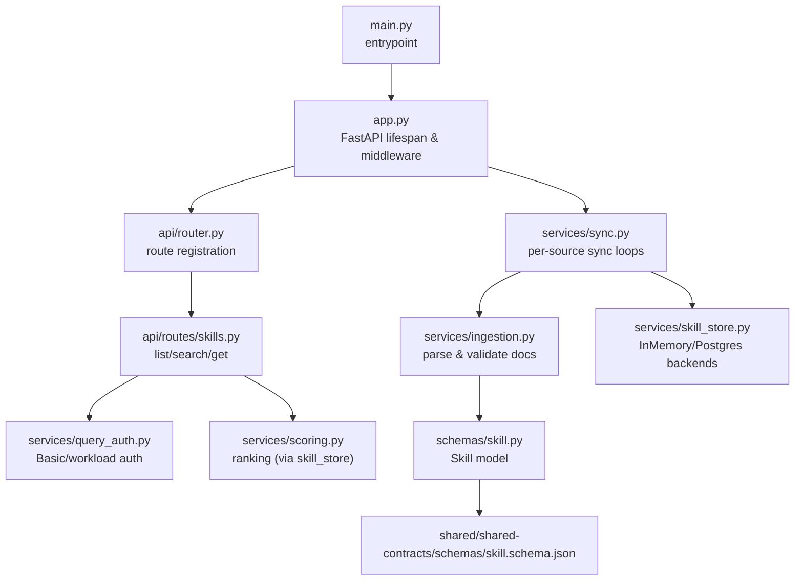
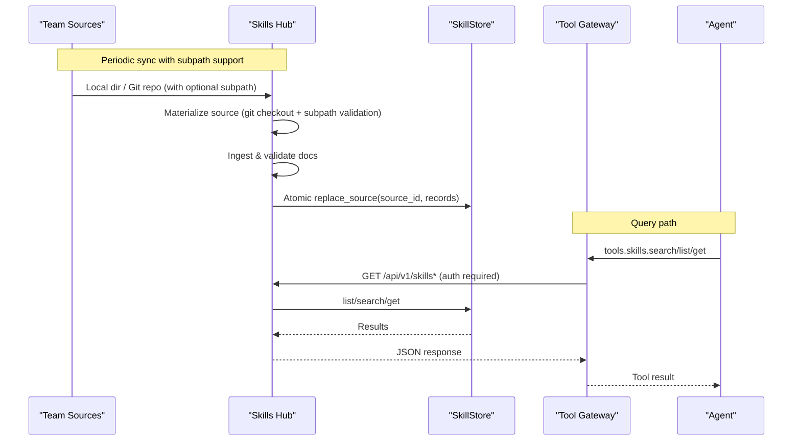
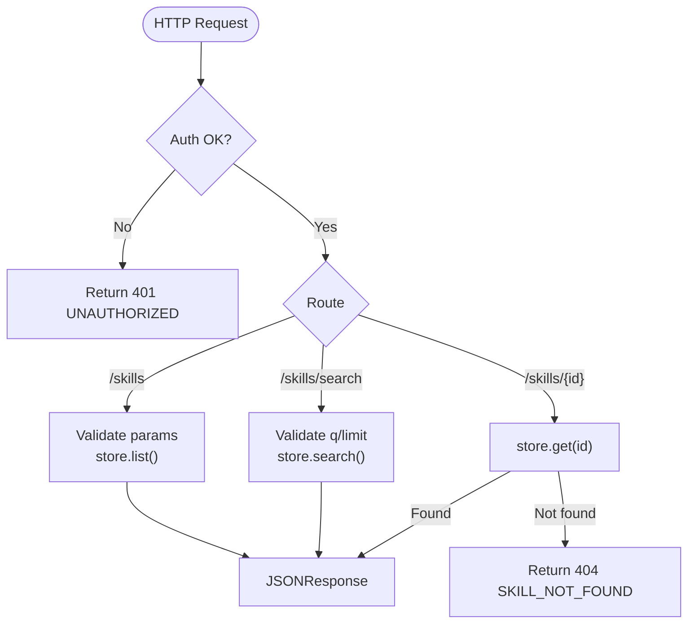
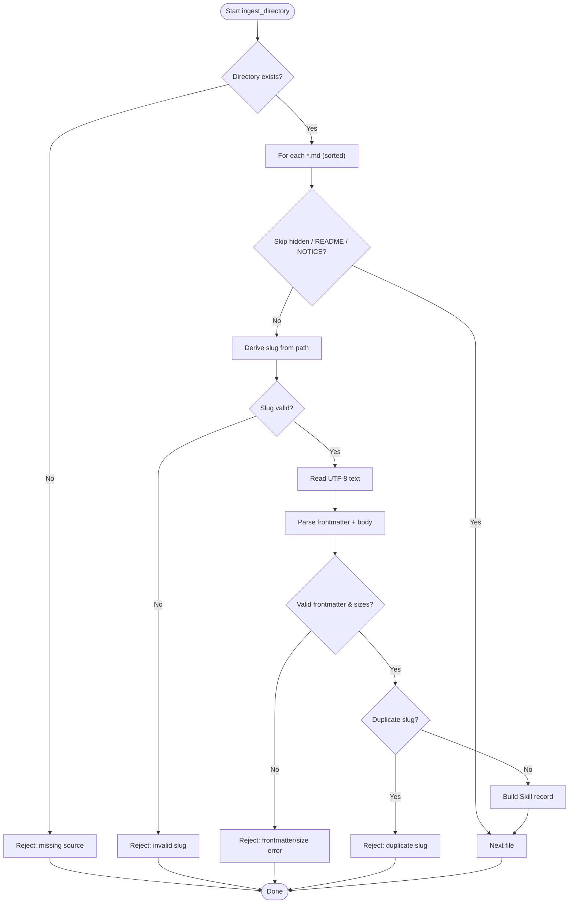
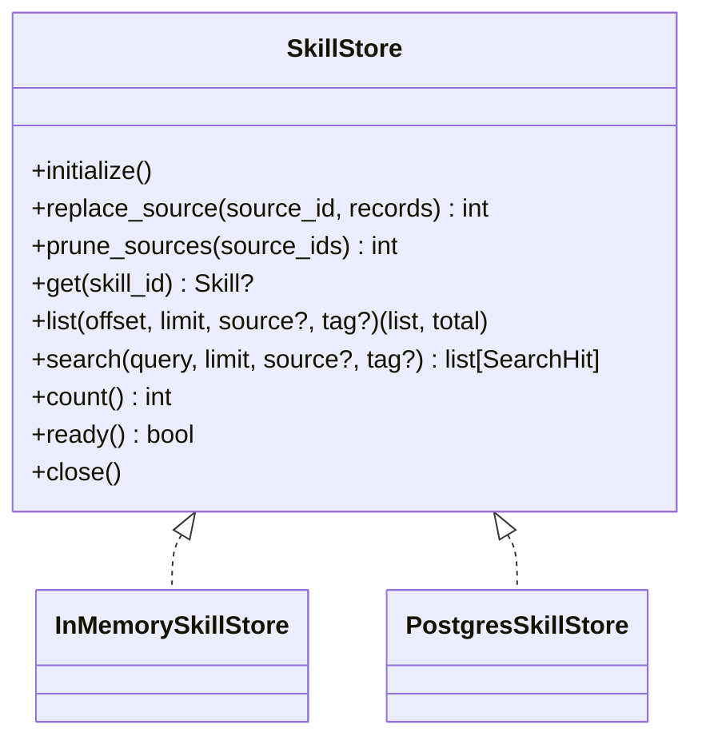
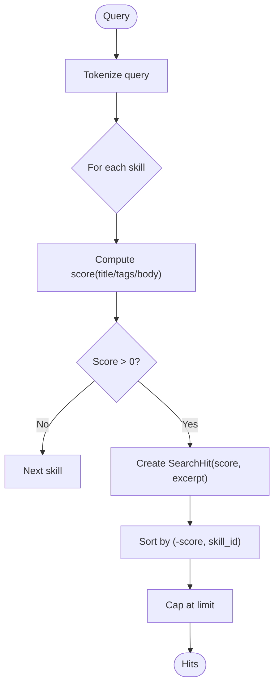
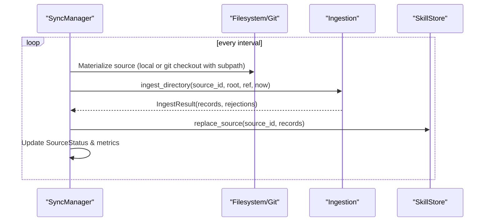
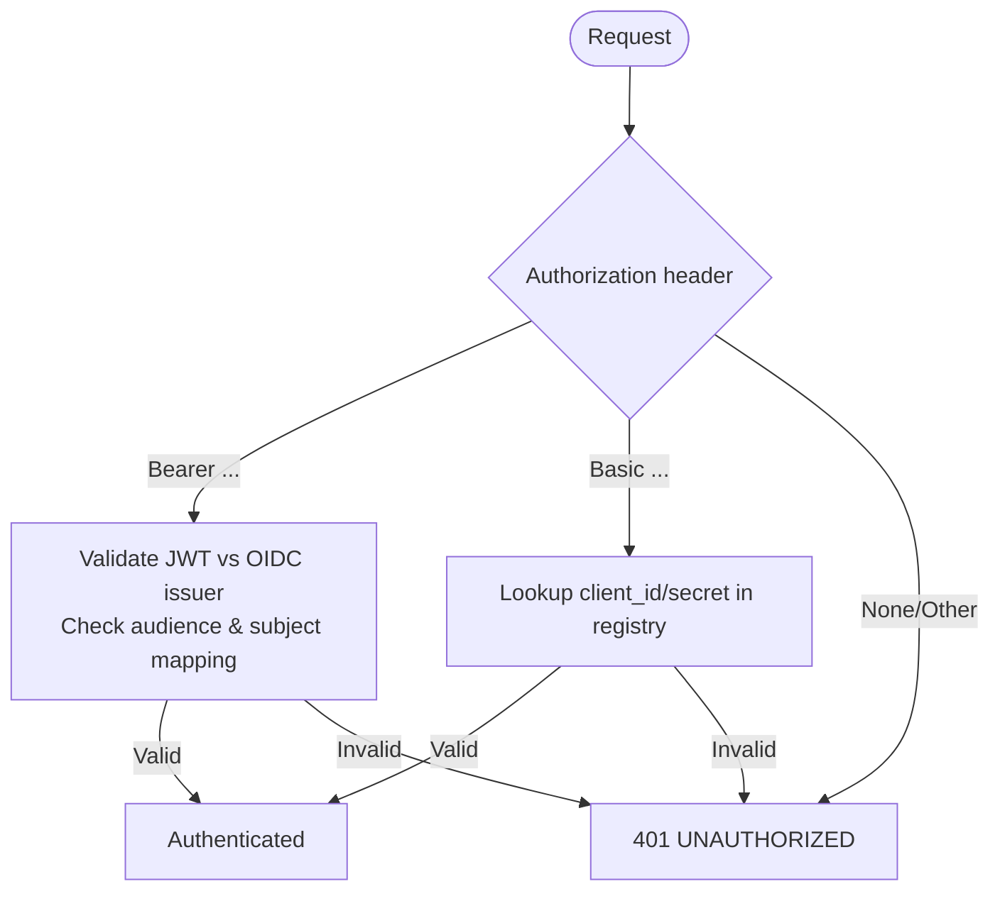
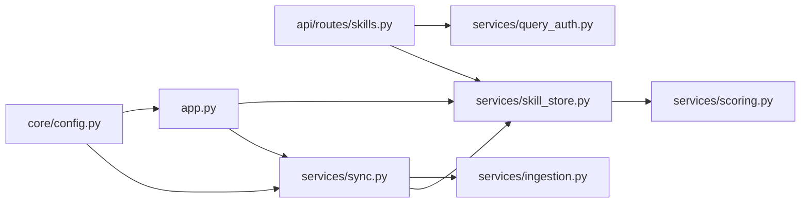
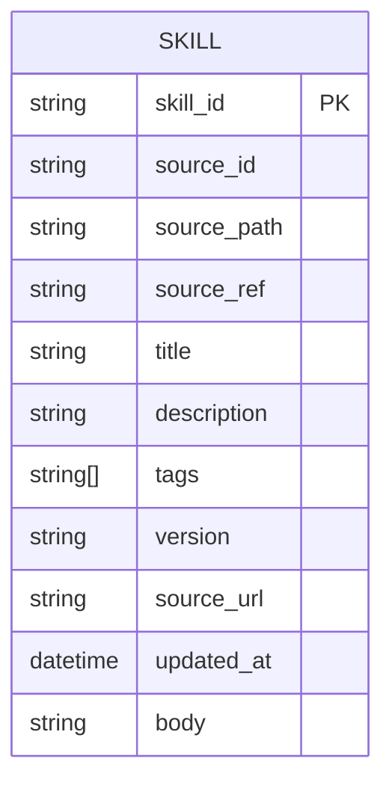

# Skills Hub Service

<cite>
**Referenced Files in This Document**
- [README.md](file://products/skills-hub/README.md)
- [main.py](file://products/skills-hub/src/skills_hub/main.py)
- [app.py](file://products/skills-hub/src/skills_hub/app.py)
- [router.py](file://products/skills-hub/src/skills_hub/api/router.py)
- [skills.py](file://products/skills-hub/src/skills_hub/api/routes/skills.py)
- [config.py](file://products/skills-hub/src/skills_hub/core/config.py)
- [runtime.py](file://products/skills-hub/src/skills_hub/core/runtime.py)
- [skill_store.py](file://products/skills-hub/src/skills_hub/services/skill_store.py)
- [ingestion.py](file://products/skills-hub/src/skills_hub/services/ingestion.py)
- [sync.py](file://products/skills-hub/src/skills_hub/services/sync.py)
- [query_auth.py](file://products/skills-hub/src/skills_hub/services/query_auth.py)
- [skill.py](file://products/skills-hub/src/skills_hub/schemas/skill.py)
- [skill.schema.json](file://shared/shared-contracts/schemas/skill.schema.json)
- [skills-guide.md](file://docs/guides/skills-guide.md)
</cite>

## Update Summary
**Changes Made**
- Enhanced git-federated source support with subpath specification for monorepo scenarios
- Added comprehensive security validation including path traversal protection and token injection
- Improved sync engine with better error handling and credential scrubbing
- Updated configuration parsing to support git source subpaths with security constraints
- Enhanced testing coverage for git source functionality and security features

## Table of Contents
1. [Introduction](#introduction)
2. [Project Structure](#project-structure)
3. [Core Components](#core-components)
4. [Architecture Overview](#architecture-overview)
5. [Detailed Component Analysis](#detailed-component-analysis)
6. [Dependency Analysis](#dependency-analysis)
7. [Performance Considerations](#performance-considerations)
8. [Troubleshooting Guide](#troubleshooting-guide)
9. [Conclusion](#conclusion)
10. [Appendices](#appendices)

## Introduction
The Skills Hub Service ingests team-owned Markdown skills from federated sources (local directories and Git repositories), validates and normalizes them, stores them in a durable or in-memory store, and serves deterministic ranked search and full-record retrieval APIs. It is the authoritative source of grounded guidance for agents via the tool-gateway.

Key responsibilities:
- Federated ingestion with per-source atomic sync supporting both local directories and Git repositories
- Subpath specification for Git sources enabling monorepo support with security validation
- Frontmatter validation and metadata normalization against a shared schema
- Deterministic ranking and provenance-aware search results
- Query authentication via static Basic credentials or projected workload tokens
- Operational status reporting and metrics

**Section sources**
- [README.md:3-15](file://products/skills-hub/README.md#L3-L15)
- [skills-guide.md:12-35](file://docs/guides/skills-guide.md#L12-L35)

## Project Structure
The service follows a layered FastAPI application structure:
- Entrypoint and runtime settings
- Application lifecycle and middleware
- API routing and request handlers
- Services for ingestion, storage, scoring, synchronization, and query authentication
- Schemas bound to the shared skill contract



**Diagram sources**
- [main.py:1-9](file://products/skills-hub/src/skills_hub/main.py#L1-L9)
- [app.py:20-86](file://products/skills-hub/src/skills_hub/app.py#LL20-L86)
- [router.py:1-11](file://products/skills-hub/src/skills_hub/api/router.py#L1-L11)
- [skills.py:1-119](file://products/skills-hub/src/skills_hub/api/routes/skills.py#L1-L119)
- [sync.py:118-238](file://products/skills-hub/src/skills_hub/services/sync.py#L118-L238)
- [ingestion.py:151-229](file://products/skills-hub/src/skills_hub/services/ingestion.py#L151-L229)
- [skill_store.py:30-67](file://products/skills-hub/src/skills_hub/services/skill_store.py#L30-L67)
- [skill.py:15-33](file://products/skills-hub/src/skills_hub/schemas/skill.py#L15-L33)
- [skill.schema.json:1-76](file://shared/shared-contracts/schemas/skill.schema.json#L1-L76)

**Section sources**
- [main.py:1-9](file://products/skills-hub/src/skills_hub/main.py#L1-L9)
- [app.py:20-86](file://products/skills-hub/src/skills_hub/app.py#L20-L86)
- [router.py:1-11](file://products/skills-hub/src/skills_hub/api/router.py#L1-L11)

## Core Components
- Entrypoint and runtime: loads host/port settings and starts the server.
- Application lifecycle: initializes the skill store, prunes unconfigured sources, starts sync manager, wires metrics/telemetry/logging.
- API routes: list, search, get endpoints with pagination, filtering, and auth.
- Ingestion: walks local directories, parses YAML frontmatter, enforces size/format limits, derives slugs, rejects duplicates within a source.
- Storage: strategy pattern with InMemory and Postgres backends; Postgres uses GIN full-text index and re-ranks via shared scorer.
- Scoring: deterministic keyword scoring with title/tag/body weights and capped body occurrences; stable tie-breaking by skill_id.
- Sync: per-source async loop materializing git or local sources with subpath support, ingesting, atomically replacing store slices, tracking status and metrics.
- Query auth: supports HTTP Basic against a static registry and projected workload tokens validated against cluster OIDC issuer JWKS.

**Updated** Enhanced sync engine now supports Git repository subpath specification for monorepo scenarios with comprehensive security validation.

**Section sources**
- [runtime.py:19-30](file://products/skills-hub/src/skills_hub/core/runtime.py#L19-L30)
- [app.py:20-86](file://products/skills-hub/src/skills_hub/app.py#L20-L86)
- [skills.py:34-119](file://products/skills-hub/src/skills_hub/api/routes/skills.py#L34-L119)
- [ingestion.py:151-229](file://products/skills-hub/src/skills_hub/services/ingestion.py#L151-L229)
- [skill_store.py:30-67](file://products/skills-hub/src/skills_hub/services/skill_store.py#L30-L67)
- [skill_store.py:247-432](file://products/skills-hub/src/skills_hub/services/skill_store.py#L247-L432)
- [scoring.py:28-97](file://products/skills-hub/src/skills_hub/services/scoring.py#L28-L97)
- [sync.py:118-238](file://products/skills-hub/src/skills_hub/services/sync.py#L118-L238)
- [query_auth.py:36-120](file://products/skills-hub/src/skills_hub/services/query_auth.py#L36-L120)

## Architecture Overview
High-level flow from content sources to agent consumption:



**Diagram sources**
- [sync.py:145-201](file://products/skills-hub/src/skills_hub/services/sync.py#L145-L201)
- [ingestion.py:151-229](file://products/skills-hub/src/skills_hub/services/ingestion.py#L151-L229)
- [skill_store.py:282-312](file://products/skills-hub/src/skills_hub/services/skill_store.py#L282-L312)
- [skills.py:34-119](file://products/skills-hub/src/skills_hub/api/routes/skills.py#L34-L119)

## Detailed Component Analysis

### API Layer
- Routes are registered under /api/v1 with explicit ordering so that /skills/search precedes /skills/{skill_id:path}.
- All query endpoints enforce caller authentication before accessing the store.
- List supports offset/limit/source/tag filters with bounded limits.
- Search requires a non-empty query and returns scored hits with excerpts and provenance.
- Get returns the full skill envelope when present.



**Diagram sources**
- [skills.py:34-119](file://products/skills-hub/src/skills_hub/api/routes/skills.py#L34-L119)

**Section sources**
- [router.py:1-11](file://products/skills-hub/src/skills_hub/api/router.py#L1-L11)
- [skills.py:1-119](file://products/skills-hub/src/skills_hub/api/routes/skills.py#L1-L11)

### Ingestion Pipeline
- Walks a source directory (supports Kubernetes projected volumes).
- Parses YAML frontmatter, enforces allowed keys and length constraints, validates body size.
- Derives deterministic slugs from file paths; rejects duplicate slugs within a source.
- Produces an IngestResult with accepted records and bounded rejection details.



**Diagram sources**
- [ingestion.py:151-229](file://products/skills-hub/src/skills_hub/services/ingestion.py#L151-L229)

**Section sources**
- [ingestion.py:1-229](file://products/skills-hub/src/skills_hub/services/ingestion.py#L1-L229)

### Storage Backends
- Strategy interface defines initialize, replace_source, prune_sources, get, list, search, count, ready, close.
- InMemory backend maintains per-source snapshots with atomic swap semantics.
- Postgres backend creates table/index on initialize, performs atomic per-source delete+insert, and uses GIN full-text search with candidate pre-filtering followed by shared scorer re-ranking.



**Diagram sources**
- [skill_store.py:30-67](file://products/skills-hub/src/skills_hub/services/skill_store.py#L30-L67)
- [skill_store.py:72-154](file://products/skills-hub/src/skills_hub/services/skill_store.py#L72-L154)
- [skill_store.py:247-432](file://products/skills-hub/src/skills_hub/services/skill_store.py#L247-L432)

**Section sources**
- [skill_store.py:30-67](file://products/skills-hub/src/skills_hub/services/skill_store.py#L30-L67)
- [skill_store.py:72-154](file://products/skills-hub/src/skills_hub/services/skill_store.py#L72-L154)
- [skill_store.py:247-432](file://products/skills-hub/src/skills_hub/services/skill_store.py#L247-L432)

### Scoring and Ranking
- Tokenization extracts lowercase alphanumeric tokens.
- Score weights: title=3, tags=2, body=1 with occurrence cap to prevent long bodies from dominating.
- Zero-score matches excluded; ties broken by skill_id ascending.
- Excerpt generation provides up to 400 characters around first match or falls back to description head.



**Diagram sources**
- [scoring.py:28-97](file://products/skills-hub/src/skills_hub/services/scoring.py#L28-L97)

**Section sources**
- [scoring.py:1-97](file://products/skills-hub/src/skills_hub/services/scoring.py#L1-L97)

### Synchronization Engine
- Per-source async tasks run independent loops with jittered intervals.
- Materialization: local directories or Git clone/fetch/reset with optional token injection into HTTPS URLs.
- **Enhanced**: Git sources now support subpath specification for monorepo scenarios with security validation.
- Ingest runs synchronously in a thread to avoid blocking the event loop.
- On success, atomically replaces the source slice in the store; on failure, retains previous snapshot and records error/metrics.
- Status report exposes last_sync_at, ref, accepted counts, and bounded rejections.

**Updated** The sync engine now includes comprehensive Git repository support with subpath specification, security validation, and improved error handling with credential scrubbing.



**Diagram sources**
- [sync.py:118-238](file://products/skills-hub/src/skills_hub/services/sync.py#L118-L238)
- [ingestion.py:151-229](file://products/skills-hub/src/skills_hub/services/ingestion.py#L151-L229)
- [skill_store.py:282-312](file://products/skills-hub/src/skills_hub/services/skill_store.py#L282-L312)

**Section sources**
- [sync.py:1-238](file://products/skills-hub/src/skills_hub/services/sync.py#L1-L238)

### Query Authentication
- Supports two paths:
  - Static Basic credentials against SKILLS_QUERY_CLIENTS registry.
  - Workload identity using projected service-account tokens validated against cluster OIDC issuer JWKS with audience and subject mapping checks.
- Requests without valid credentials receive 401.



**Diagram sources**
- [query_auth.py:36-120](file://products/skills-hub/src/skills_hub/services/query_auth.py#L36-L120)

**Section sources**
- [query_auth.py:1-120](file://products/skills-hub/src/skills_hub/services/query_auth.py#L1-L120)

### Configuration and Runtime
- Settings parsed from environment variables with fail-fast validation for malformed inputs.
- SourceSpec supports local and git types with required fields enforced.
- **Enhanced**: Git sources now support optional `path` field for subdirectory specification within monorepos.
- Security validation prevents path traversal attacks and ensures relative paths only.
- Query clients and workload clients parsed from comma-separated mappings.
- Run settings resolve host/port with safe defaults.

**Updated** Configuration now supports Git source subpath specification with comprehensive security validation to prevent path traversal attacks.

**Section sources**
- [config.py:1-203](file://products/skills-hub/src/skills_hub/core/config.py#L1-L203)
- [runtime.py:1-30](file://products/skills-hub/src/skills_hub/core/runtime.py#L1-L30)

## Dependency Analysis
- The API layer depends on query authentication and the skill store.
- The sync engine depends on ingestion and the skill store.
- Both backends depend on the shared scoring module to ensure identical ranking behavior.
- The application lifecycle wires configuration, store initialization, pruning, and sync management.



**Diagram sources**
- [skills.py:1-119](file://products/skills-hub/src/skills_hub/api/routes/skills.py#L1-L119)
- [query_auth.py:1-120](file://products/skills-hub/src/skills_hub/services/query_auth.py#L1-L120)
- [skill_store.py:30-67](file://products/skills-hub/src/skills_hub/services/skill_store.py#L30-L67)
- [scoring.py:1-97](file://products/skills-hub/src/skills_hub/services/scoring.py#L1-L97)
- [sync.py:1-238](file://products/skills-hub/src/skills_hub/services/sync.py#L1-L238)
- [ingestion.py:1-229](file://products/skills-hub/src/skills_hub/services/ingestion.py#L1-L229)
- [app.py:20-86](file://products/skills-hub/src/skills_hub/app.py#L20-L86)
- [config.py:1-203](file://products/skills-hub/src/skills_hub/core/config.py#L1-L203)

**Section sources**
- [app.py:20-86](file://products/skills-hub/src/skills_hub/app.py#L20-L86)
- [config.py:1-203](file://products/skills-hub/src/skills_hub/core/config.py#L1-L203)

## Performance Considerations
- Search performance:
  - Postgres uses a GIN index on title+body tsvector and pre-filters candidates before re-ranking in Python to maintain deterministic order.
  - Tokenized queries avoid operator injection and align with scorer units.
- Ingestion:
  - Directory walk is deterministic (sorted paths); duplicate-slug detection is O(n) per source with early rejection.
  - Body size caps prevent oversized payloads.
- Concurrency:
  - Per-source sync loops run independently with jitter to avoid stampedes.
  - Git operations run in threads to avoid blocking the event loop.
- Storage:
  - In-memory store offers fast reads/writes for dev/test; Postgres provides durability and scalable indexing.
- **Enhanced**: Git operations now include timeout protection and efficient shallow cloning for better performance.

## Troubleshooting Guide
Common operational issues and resolutions:
- New or revised skill not visible:
  - Wait for next sync interval or restart deployment to force re-sync; verify ConfigMap wiring for local sources.
- Source reports rejections:
  - Inspect /api/v1/skills/status for rejection reasons; fix frontmatter or size violations; use the pre-flight validator CLI.
- Source reports last_error:
  - Check unreachable Git URL, invalid token, or unreadable path; previous snapshot remains served until recovery.
- **New**: Git subpath errors:
  - Verify configured subpath exists in the Git repository; check for path traversal attempts being rejected.
- Search returns no matches:
  - Confirm skill exists via catalog endpoint; check status and ensure source synced successfully.
- kustomize build fails:
  - Align ConfigMap entries with actual files under skills directories.
- Agent claims no skills exist:
  - Verify tool-gateway connector configuration and query secret alignment.

Operational endpoints and metrics:
- Auth-exempt status: GET /api/v1/skills/status
- Metrics: /metrics exposing sync outcomes, rejected documents, store size, and search counts.

**Section sources**
- [skills-guide.md:222-256](file://docs/guides/skills-guide.md#L222-L256)
- [sync.py:214-238](file://products/skills-hub/src/skills_hub/services/sync.py#L214-L238)

## Conclusion
The Skills Hub Service provides a robust, deterministic, and secure foundation for serving grounded guidance to agents. Its design emphasizes fail-fast configuration, resilient per-source sync, deterministic ranking, and clear operational surfaces. Integration through the tool-gateway ensures consistent policy enforcement, auditability, and evidence presentation.

**Updated** The recent enhancements add comprehensive Git repository support with subpath specification for monorepo scenarios, robust security validation, and improved error handling with credential scrubbing, making it suitable for enterprise-scale federated skill management.

## Appendices

### Data Model: Skill Envelope
- Fields include identifiers, provenance, human-readable metadata, optional version/attribution, timestamps, and body.
- Constraints and formats are defined by the shared schema.



**Diagram sources**
- [skill.schema.json:1-76](file://shared/shared-contracts/schemas/skill.schema.json#L1-L76)
- [skill.py:15-33](file://products/skills-hub/src/skills_hub/schemas/skill.py#L15-L33)

**Section sources**
- [skill.schema.json:1-76](file://shared/shared-contracts/schemas/skill.schema.json#L1-L76)
- [skill.py:1-33](file://products/skills-hub/src/skills_hub/schemas/skill.py#L1-L33)

### Git Source Configuration Examples

#### Basic Git Source
```json
{
  "source_id": "team-skills",
  "type": "git",
  "url": "https://github.com/team/skills-repo.git",
  "ref": "main"
}
```

#### Git Source with Subpath (Monorepo Support)
```json
{
  "source_id": "platform-runbooks",
  "type": "git", 
  "url": "https://github.com/company/monorepo.git",
  "ref": "main",
  "path": "platform/runbooks"
}
```

#### Git Source with Authentication
```json
{
  "source_id": "private-skills",
  "type": "git",
  "url": "https://github.com/company/private-skills.git", 
  "ref": "v1.0"
}
```

With corresponding token configuration:
```json
{
  "private-skills": "your-access-token-here"
}
```

**Section sources**
- [config.py:50-116](file://products/skills-hub/src/skills_hub/core/config.py#L50-L116)
- [sync.py:87-112](file://products/skills-hub/src/skills_hub/services/sync.py#L87-L112)
- [test_sync.py:120-151](file://products/skills-hub/tests/test_sync.py#L120-L151)