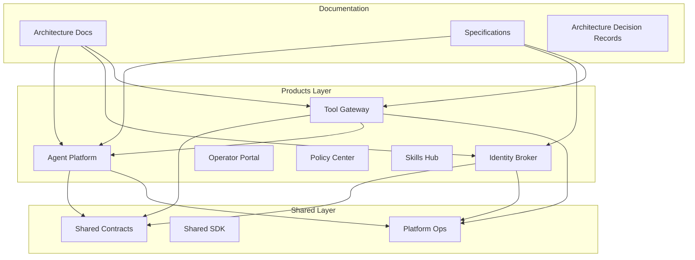
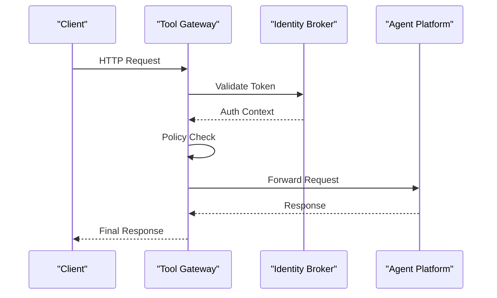
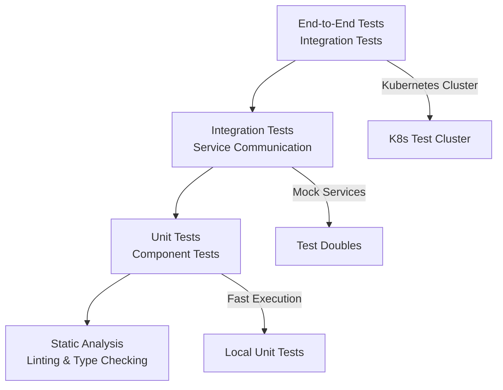
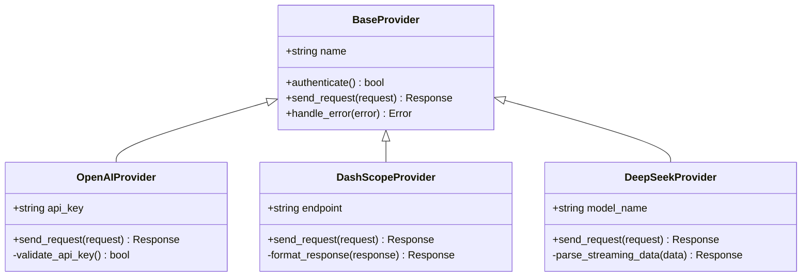

# Developer Guide

<cite>
**Referenced Files in This Document**
- [README.md](file://README.md)
- [CONTRIBUTING.md](file://CONTRIBUTING.md)
- [Makefile](file://Makefile)
- [backend-service-layout-convention.md](file://docs/workspace/backend-service-layout-convention.md)
- [python-container-strategy.md](file://docs/workspace/python-container-strategy.md)
- [agent-platform pyproject.toml](file://products/agent-platform/pyproject.toml)
- [identity-broker pyproject.toml](file://products/identity-broker/pyproject.toml)
- [tool-gateway pyproject.toml](file://products/tool-gateway/pyproject.toml)
- [agent-platform Dockerfile](file://products/agent-platform/Dockerfile)
- [identity-broker Dockerfile](file://products/identity-broker/Dockerfile)
- [tool-gateway Dockerfile](file://products/tool-gateway/Dockerfile)
- [agent-platform main.py](file://products/agent-platform/src/agent_service/main.py)
- [identity-broker main.py](file://products/identity-broker/src/identity_service/main.py)
- [tool-gateway main.py](file://products/tool-gateway/src/api_gateway/main.py)
- [agent-platform app.py](file://products/agent-platform/src/agent_service/app.py)
- [identity-broker app.py](file://products/identity-broker/src/identity_service/app.py)
- [tool-gateway app.py](file://products/tool-gateway/src/api_gateway/app.py)
- [agent-platform tests](file://products/agent-platform/tests/)
- [identity-broker tests](file://products/identity-broker/tests/)
- [tool-gateway tests](file://products/tool-gateway/tests/)
- [shared contracts README](file://shared/shared-contracts/README.md)
- [platform ops gitops](file://shared/platform-ops/gitops/)
- [github pull request template](file://.github/pull_request_template.md)
</cite>

## Table of Contents
1. [Introduction](#introduction)
2. [Project Structure](#project-structure)
3. [Development Environment Setup](#development-environment-setup)
4. [Code Standards and Conventions](#code-standards-and-conventions)
5. [Backend Service Architecture](#backend-service-architecture)
6. [Python Container Strategy](#python-container-strategy)
7. [Testing Strategy](#testing-strategy)
8. [Code Review and Pull Request Process](#code-review-and-pull-request-process)
9. [Release Procedures](#release-procedures)
10. [Debugging and Performance Optimization](#debugging-and-performance-optimization)
11. [Extension Points and Plugin Development](#extension-points-and-plugin-development)
12. [Troubleshooting Guide](#troubleshooting-guide)
13. [Conclusion](#conclusion)

## Introduction

The Luban AIOps Platform is a comprehensive AI-powered operations platform designed to provide intelligent automation, agent orchestration, and policy enforcement capabilities. The platform follows modern microservices architecture patterns with Python-based services, containerized deployment, and GitOps-driven operations.

This developer guide provides comprehensive documentation for contributing to the platform, covering development environment setup, code standards, architectural patterns, testing strategies, and operational procedures.

## Project Structure

The Luban AIOps Platform follows a product-based monorepo structure with clear separation of concerns:



**Diagram sources**
- [backend-service-layout-convention.md](file://docs/workspace/backend-service-layout-convention.md)
- [python-container-strategy.md](file://docs/workspace/python-container-strategy.md)

### Core Product Components

- **Agent Platform**: Core AI agent orchestration service with runtime kernel and provider abstractions
- **Identity Broker**: Authentication and authorization service with token management
- **Tool Gateway**: API gateway with policy enforcement and tool execution framework
- **Operator Portal**: Web-based UI for platform administration
- **Policy Center**: Policy definition and enforcement engine
- **Skills Hub**: Agent skill marketplace and management

### Shared Components

- **Shared Contracts**: JSON schemas and API specifications
- **Shared SDK**: Client libraries and utilities
- **Platform Ops**: GitOps configurations and deployment scripts

**Section sources**
- [backend-service-layout-convention.md](file://docs/workspace/backend-service-layout-convention.md)
- [python-container-strategy.md](file://docs/workspace/python-container-strategy.md)

## Development Environment Setup

### Prerequisites

Before starting development, ensure you have the following installed:

- **Python 3.11+** with pip package manager
- **Docker** (latest stable version)
- **Kubernetes** cluster (minikube or local dev cluster)
- **Git** for version control
- **Make** for build automation

### Local Development Setup

1. **Clone the Repository**
   ```bash
   git clone <repository-url>
   cd luban-aiops
   ```

2. **Install Dependencies**
   Each product has its own dependency management using `pyproject.toml` and `uv.lock`:
   ```bash
   cd products/<product-name>
   uv sync
   ```

3. **Environment Configuration**
   Set up environment variables for local development:
   ```bash
   export AGENT_PLATFORM_URL=http://localhost:8000
   export IDENTITY_BROKER_URL=http://localhost:8001
   export TOOL_GATEWAY_URL=http://localhost:8002
   ```

4. **Start Services Locally**
   Use the Makefile targets for each service:
   ```bash
   make dev-agent-platform
   make dev-identity-broker
   make dev-tool-gateway
   ```

### Docker Development

Each service includes a Dockerfile optimized for development:

```bash
# Build service image
make build-agent-platform

# Run service in container
make run-agent-platform

# Interactive debugging
make debug-agent-platform
```

**Section sources**
- [agent-platform pyproject.toml](file://products/agent-platform/pyproject.toml)
- [identity-broker pyproject.toml](file://products/identity-broker/pyproject.toml)
- [tool-gateway pyproject.toml](file://products/tool-gateway/pyproject.toml)

## Code Standards and Conventions

### Python Code Style

The platform follows PEP 8 guidelines with additional conventions:

- **Type Hints**: All functions must include type hints
- **Docstrings**: Google-style docstrings for all public methods
- **Error Handling**: Custom exception hierarchy with descriptive messages
- **Logging**: Structured logging with correlation IDs
- **Configuration**: Environment-based configuration with validation

### Module Organization

Each service follows the backend service layout convention:

```
src/<service_name>/
├── api/                    # HTTP routes and handlers
│   ├── routes/            # Route definitions
│   └── __init__.py
├── core/                  # Core business logic
│   ├── config.py          # Configuration management
│   ├── metrics.py         # Metrics collection
│   └── observability.py   # Observability setup
├── services/              # Business services
├── schemas/               # Pydantic models
├── providers/             # External service providers
├── tools/                 # Tool implementations
└── entrypoints/           # Application entry points
```

### Naming Conventions

- **Modules**: Lowercase with underscores
- **Classes**: PascalCase
- **Functions**: snake_case
- **Constants**: UPPER_SNAKE_CASE
- **Environment Variables**: UPPER_SNAKE_CASE with service prefix

**Section sources**
- [backend-service-layout-convention.md](file://docs/workspace/backend-service-layout-convention.md)

## Backend Service Architecture

### Service Communication Pattern

The platform uses a layered architecture with clear service boundaries:



**Diagram sources**
- [tool-gateway main.py](file://products/tool-gateway/src/api_gateway/main.py)
- [identity-broker main.py](file://products/identity-broker/src/identity_service/main.py)
- [agent-platform main.py](file://products/agent-platform/src/agent_service/main.py)

### Core Service Components

#### Agent Platform
- **Runtime Kernel**: Orchestrates agent lifecycle and execution
- **Provider Registry**: Manages different AI model providers
- **Session Management**: Persistent session state handling
- **Tool Framework**: Extensible tool execution system

#### Identity Broker
- **Authentication Service**: JWT token management and validation
- **Authorization Engine**: Role-based access control
- **Token Delegation**: Service-to-service authentication

#### Tool Gateway
- **API Router**: Request routing and middleware
- **Policy Engine**: Dynamic policy evaluation
- **Tool Registry**: Tool discovery and invocation
- **Rate Limiting**: Request throttling and quotas

**Section sources**
- [agent-platform app.py](file://products/agent-platform/src/agent_service/app.py)
- [identity-broker app.py](file://products/identity-broker/src/identity_service/app.py)
- [tool-gateway app.py](file://products/tool-gateway/src/api_gateway/app.py)

## Python Container Strategy

### Multi-Stage Build Process

Each service uses optimized multi-stage Docker builds:

```dockerfile
# Stage 1: Build dependencies
FROM python:3.11-slim AS builder
WORKDIR /app
COPY . .
RUN uv sync --frozen

# Stage 2: Runtime
FROM python:3.11-slim
WORKDIR /app
COPY --from=builder /app/.venv /app/.venv
COPY --from=builder /app/src /app/src
ENV PATH="/app/.venv/bin:$PATH"
CMD ["python", "-m", "agent_service.main"]
```

### Container Best Practices

- **Non-root User**: Services run as non-root users
- **Health Checks**: Built-in health check endpoints
- **Resource Limits**: CPU and memory constraints defined
- **Log Rotation**: Structured JSON logs with rotation
- **Graceful Shutdown**: Proper signal handling

### Development vs Production Images

- **Development**: Includes debugging tools and hot reload
- **Production**: Minimal base image with security hardening
- **Testing**: Isolated test environment with mock services

**Section sources**
- [python-container-strategy.md](file://docs/workspace/python-container-strategy.md)
- [agent-platform Dockerfile](file://products/agent-platform/Dockerfile)
- [identity-broker Dockerfile](file://products/identity-broker/Dockerfile)
- [tool-gateway Dockerfile](file://products/tool-gateway/Dockerfile)

## Testing Strategy

### Test Pyramid Implementation

The platform implements a comprehensive testing strategy following the test pyramid:



### Unit Testing

Each module includes comprehensive unit tests using pytest:

- **Model Validation**: Pydantic schema validation tests
- **Service Logic**: Business logic isolation tests
- **Provider Integration**: Mock external service calls
- **Error Scenarios**: Edge case and error handling tests

### Integration Testing

Integration tests verify service communication:

- **API Endpoints**: Full request/response cycle testing
- **Database Operations**: Data persistence and retrieval
- **Message Queues**: Asynchronous message processing
- **External Dependencies**: Mocked third-party services

### End-to-End Testing

E2E tests validate complete user workflows:

- **Deployment Pipeline**: Kubernetes deployment verification
- **Service Mesh**: Inter-service communication
- **Security Flows**: Authentication and authorization
- **Performance Baselines**: Load testing and benchmarks

### Test Execution

```bash
# Run all tests
make test-all

# Run specific test suite
make test-unit
make test-integration
make test-e2e

# Coverage reporting
make test-coverage
```

**Section sources**
- [agent-platform tests](file://products/agent-platform/tests/)
- [identity-broker tests](file://products/identity-broker/tests/)
- [tool-gateway tests](file://products/tool-gateway/tests/)

## Code Review and Pull Request Process

### Pull Request Workflow

All changes must go through the pull request process:

1. **Fork and Branch**: Create feature branch from `main`
2. **Implement Changes**: Follow coding standards and add tests
3. **Run Tests**: Ensure all tests pass locally
4. **Submit PR**: Create pull request with detailed description
5. **Code Review**: Address reviewer feedback
6. **Merge**: Squash merge after approval

### Review Checklist

- **Code Quality**: Follows style guidelines and best practices
- **Testing**: Adequate test coverage for changes
- **Documentation**: Updated docs and comments
- **Security**: No vulnerabilities or sensitive data
- **Performance**: No performance regressions
- **Compatibility**: Backward compatible changes

### Automated Checks

GitHub Actions pipeline validates:

- **Linting**: Ruff and Black formatting checks
- **Type Checking**: MyPy static type analysis
- **Security Scanning**: Dependency vulnerability checks
- **Build Verification**: Docker image build success
- **Test Execution**: All test suites pass

**Section sources**
- [github pull request template](file://.github/pull_request_template.md)

## Release Procedures

### Version Management

The platform uses semantic versioning (SemVer):

- **Major**: Breaking changes
- **Minor**: New features (backward compatible)
- **Patch**: Bug fixes and minor improvements

### Release Process

1. **Create Release Branch**: `release/vX.Y.Z`
2. **Update Changelog**: Document all changes
3. **Run Full Test Suite**: Ensure stability
4. **Build Artifacts**: Generate Docker images
5. **Tag Release**: Git tag with version number
6. **Publish**: Push to registry and release notes

### Deployment Strategy

- **Blue-Green Deployment**: Zero-downtime updates
- **Canary Releases**: Gradual rollout to subset of users
- **Rollback Plan**: Quick rollback capability
- **Health Monitoring**: Real-time service health checks

### GitOps Workflow

Kubernetes manifests are managed through GitOps:

```bash
# Update deployment version
make update-version VERSION=vX.Y.Z

# Apply changes to cluster
make deploy-dev
make deploy-staging
make deploy-production
```

**Section sources**
- [platform ops gitops](file://shared/platform-ops/gitops/)

## Debugging and Performance Optimization

### Debugging Techniques

#### Local Development Debugging

- **Hot Reload**: Automatic code reloading during development
- **Interactive Debugger**: Breakpoint support with VS Code
- **Log Level Control**: Dynamic log level adjustment
- **Request Tracing**: Distributed tracing with correlation IDs

#### Production Debugging

- **Structured Logging**: JSON logs with contextual information
- **Metrics Collection**: Prometheus metrics and dashboards
- **Error Tracking**: Centralized error monitoring
- **Performance Profiling**: APM integration

### Performance Optimization

#### Memory Optimization

- **Connection Pooling**: Database and HTTP connection reuse
- **Memory Mapping**: Efficient data structure usage
- **Garbage Collection Tuning**: Optimized GC settings
- **Memory Leak Detection**: Continuous monitoring

#### CPU Optimization

- **Async Processing**: Non-blocking I/O operations
- **Caching Strategies**: Multi-level caching implementation
- **Algorithm Optimization**: Efficient data processing
- **Parallel Processing**: Concurrent task execution

#### Network Optimization

- **HTTP/2 Support**: Multiplexed connections
- **Compression**: Request/response compression
- **Load Balancing**: Even traffic distribution
- **Connection Reuse**: Persistent connections

### Profiling Tools

- **cProfile**: Python function call profiling
- **memory_profiler**: Memory usage analysis
- **py-spy**: Sampling profiler for production
- **Prometheus**: Metrics collection and alerting

**Section sources**
- [agent-platform core/observability.py](file://products/agent-platform/src/agent_service/core/observability.py)
- [identity-broker core/telemetry.py](file://products/identity-broker/src/identity_service/core/telemetry.py)
- [tool-gateway core/metrics.py](file://products/tool-gateway/src/api_gateway/core/metrics.py)

## Extension Points and Plugin Development

### Provider Architecture

The platform supports extensible providers for different AI models:



**Diagram sources**
- [agent-platform providers/base.py](file://products/agent-platform/src/agent_service/providers/base.py)
- [agent-platform providers/openai.py](file://products/agent-platform/src/agent_service/providers/openai.py)
- [agent-platform providers/dashscope.py](file://products/agent-platform/src/agent_service/providers/dashscope.py)
- [agent-platform providers/deepseek.py](file://products/agent-platform/src/agent_service/providers/deepseek.py)

### Tool Framework

Extensible tool system for custom functionality:

- **Base Tool Class**: Common interface for all tools
- **Tool Registry**: Dynamic tool discovery and registration
- **Parameter Validation**: Input validation and sanitization
- **Result Formatting**: Standardized output format
- **Error Handling**: Consistent error reporting

### Policy Engine

Customizable policy enforcement:

- **Policy Language**: Declarative policy definitions
- **Rule Engine**: Dynamic rule evaluation
- **Context Awareness**: Request context evaluation
- **Audit Trail**: Policy decision logging

### Plugin Development Guidelines

1. **Follow Interface Contracts**: Implement required interfaces
2. **Handle Errors Gracefully**: Proper error propagation
3. **Add Comprehensive Tests**: Test plugin functionality
4. **Document Usage**: Clear usage examples and configuration
5. **Performance Considerations**: Optimize for production use

**Section sources**
- [agent-platform providers/registry.py](file://products/agent-platform/src/agent_service/providers/registry.py)
- [tool-gateway tools/base.py](file://products/tool-gateway/src/api_gateway/tools/base.py)
- [tool-gateway tools/registry.py](file://products/tool-gateway/src/api_gateway/tools/registry.py)

## Troubleshooting Guide

### Common Issues and Solutions

#### Service Startup Failures

- **Port Conflicts**: Check port availability and configuration
- **Dependency Missing**: Verify external service connectivity
- **Configuration Errors**: Validate environment variables
- **Permission Issues**: Check file and directory permissions

#### Connection Problems

- **Network Policies**: Verify Kubernetes network policies
- **DNS Resolution**: Check service discovery configuration
- **SSL/TLS Issues**: Validate certificates and encryption settings
- **Timeout Settings**: Adjust timeout configurations

#### Performance Issues

- **Resource Constraints**: Monitor CPU and memory usage
- **Database Connections**: Check connection pool utilization
- **External API Latency**: Monitor third-party service response times
- **Memory Leaks**: Use profiling tools to identify leaks

### Diagnostic Commands

```bash
# Check service health
kubectl get pods -n luban-platform

# View service logs
kubectl logs -f <service-name> -n luban-platform

# Debug connectivity
kubectl exec -it <pod-name> -- curl http://<service>:<port>/health

# Monitor resource usage
kubectl top pods -n luban-platform
```

### Log Analysis

- **Structured Logs**: Parse JSON logs for analysis
- **Correlation IDs**: Track requests across services
- **Error Patterns**: Identify recurring error patterns
- **Performance Metrics**: Analyze latency and throughput

**Section sources**
- [agent-platform core/config.py](file://products/agent-platform/src/agent_service/core/config.py)
- [identity-broker core/config.py](file://products/identity-broker/src/identity_service/core/config.py)
- [tool-gateway core/config.py](file://products/tool-gateway/src/api_gateway/core/config.py)

## Conclusion

The Luban AIOps Platform provides a robust foundation for AI-powered operations automation. This developer guide covers all essential aspects of contributing to the platform, from development environment setup to advanced extension patterns.

Key takeaways for contributors:

- **Follow Established Patterns**: Adhere to backend service layout conventions
- **Comprehensive Testing**: Implement thorough test coverage
- **Security First**: Prioritize security in all implementations
- **Performance Conscious**: Design for scalability and efficiency
- **Documentation Driven**: Maintain up-to-date documentation

By following these guidelines and leveraging the platform's extensible architecture, developers can contribute effectively to the Luban AIOps Platform while maintaining code quality and system reliability.