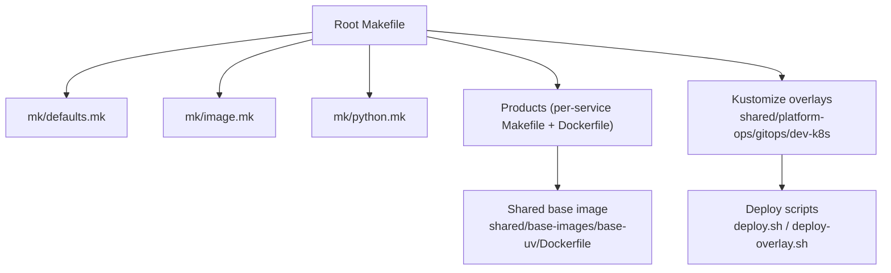
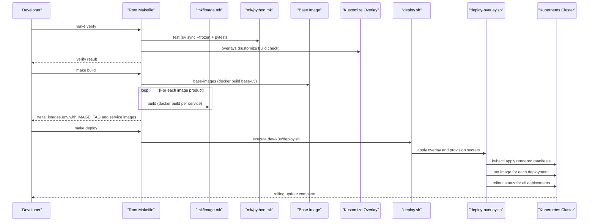

# Build System and Deployment Automation

<cite>
**Referenced Files in This Document**
- [Makefile](file://Makefile)
- [defaults.mk](file://mk/defaults.mk)
- [image.mk](file://mk/image.mk)
- [python.mk](file://mk/python.mk)
- [base-uv Dockerfile](file://shared/base-images/base-uv/Dockerfile)
- [agent-platform Makefile](file://products/agent-platform/Makefile)
- [agent-platform Dockerfile](file://products/agent-platform/Dockerfile)
- [dev-k8s kustomization.yaml](file://shared/platform-ops/gitops/dev-k8s/kustomization.yaml)
- [runtime-profiles default kustomization.yaml](file://shared/platform-ops/gitops/runtime-profiles/default/kustomization.yaml)
- [deploy.sh](file://shared/platform-ops/gitops/dev-k8s/deploy.sh)
- [deploy-overlay.sh](file://shared/platform-ops/gitops/deploy-overlay.sh)
</cite>

## Table of Contents
1. Introduction
2. Project Structure
3. Core Components
4. Architecture Overview
5. Detailed Component Analysis
6. Dependency Analysis
7. Performance Considerations
8. Troubleshooting Guide
9. Conclusion

## Introduction
This document explains the build system and deployment automation for the platform. It covers:
- The Makefile-based orchestration that builds, tests, validates, and deploys all services consistently.
- Docker image building with a shared base image, multi-stage considerations, and optimization techniques.
- GitOps deployment using Kustomize overlays under shared/platform-ops/gitops/, including development posture overlays.
- Dependency management with uv, lock-file-driven reproducible builds, and version promotion workflows.
- Container registry tagging strategies, automated rollout, rollback guidance, health checks, monitoring hooks, and troubleshooting steps.

## Project Structure
The repository uses a layered build system:
- Root Makefile orchestrates cross-cutting tasks (build, test, lint, verify, deploy).
- Shared fragments in mk/ define defaults and reusable targets for images and Python products.
- Each product has a small Makefile that includes shared fragments and sets IMAGE_NAME.
- Images are built from per-product Dockerfiles based on a shared base image.
- Kubernetes manifests are composed via Kustomize overlays under shared/platform-ops/gitops/.
- A coordinated deploy pipeline applies overlays, injects secrets, updates images, and waits for rollouts.

**Diagram sources**
- [Makefile:1-211](file://Makefile#L1-L211)
- [defaults.mk:1-53](file://mk/defaults.mk#L1-L53)
- [image.mk:1-58](file://mk/image.mk#L1-L58)
- [python.mk:1-20](file://mk/python.mk#L1-L20)
- [base-uv Dockerfile:1-40](file://shared/base-images/base-uv/Dockerfile#L1-L40)
- [dev-k8s kustomization.yaml:1-22](file://shared/platform-ops/gitops/dev-k8s/kustomization.yaml#L1-L22)
- [deploy.sh:1-62](file://shared/platform-ops/gitops/dev-k8s/deploy.sh#L1-L62)
- [deploy-overlay.sh:1-108](file://shared/platform-ops/gitops/deploy-overlay.sh#L1-L108)

**Section sources**
- [Makefile:1-211](file://Makefile#L1-L211)
- [defaults.mk:1-53](file://mk/defaults.mk#L1-L53)
- [image.mk:1-58](file://mk/image.mk#L1-L58)
- [python.mk:1-20](file://mk/python.mk#L1-L20)

## Core Components
- Root Makefile: Defines global variables, computes coordinated IMAGE_TAG, lists Python and image products, and exposes targets such as sync, test, lint, base-images, build, push, overlays, verify, deploy, e2e, clean.
- Shared defaults (mk/defaults.mk): Centralizes overridable settings like IMAGE_PLATFORM, IMAGE_TAG_PREFIX, REGISTRY, AUTO_LOAD_KIND, KIND_CLUSTER_NAME, and pinned base image versions.
- Image fragment (mk/image.mk): Provides build/push/lint targets used by each product; resolves IMAGE_REF based on REGISTRY; supports docker build with --platform and context overrides.
- Python fragment (mk/python.mk): Provides sync and test targets using uv with frozen lock files to ensure reproducibility.
- Base image (shared/base-images/base-uv/Dockerfile): Pinned Amazon Linux 2023 minimal image with pinned uv and Python interpreter resolution via .python-version; runs as non-root app user.
- Product Makefiles: Minimal wrappers setting IMAGE_NAME and including shared fragments (example: agent-platform).
- Product Dockerfiles: Use the base image, copy source and lock files, run uv sync --frozen --no-dev, expose port, and set CMD.
- Kustomize overlays: dev-k8s composes base resources plus runtime profiles (default, mutating-dev, browser-dev) and merges env/config via configMapGenerator and patches.
- Deploy scripts: deploy.sh orchestrates overlay application, secret provisioning, OIDC client reconciliation; deploy-overlay.sh applies Kustomize output, restarts deployments when ConfigMaps change, sets images, and waits for rollout status.

**Section sources**
- [Makefile:14-18](file://Makefile#L14-L18)
- [Makefile:48-64](file://Makefile#L48-L64)
- [Makefile:77-124](file://Makefile#L77-L124)
- [Makefile:171-183](file://Makefile#L171-L183)
- [defaults.mk:20-50](file://mk/defaults.mk#L20-L50)
- [image.mk:22-58](file://mk/image.mk#L22-L58)
- [python.mk:11-19](file://mk/python.mk#L11-L19)
- [base-uv Dockerfile:1-40](file://shared/base-images/base-uv/Dockerfile#L1-L40)
- [agent-platform Makefile:1-10](file://products/agent-platform/Makefile#L1-L10)
- [agent-platform Dockerfile:1-13](file://products/agent-platform/Dockerfile#L1-L13)
- [dev-k8s kustomization.yaml:1-22](file://shared/platform-ops/gitops/dev-k8s/kustomization.yaml#L1-L22)
- [deploy.sh:1-62](file://shared/platform-ops/gitops/dev-k8s/deploy.sh#L1-L62)
- [deploy-overlay.sh:25-108](file://shared/platform-ops/gitops/deploy-overlay.sh#L25-L108)

## Architecture Overview
The build-to-deploy flow is orchestrated by the root Makefile and executed through shared fragments and scripts:

**Diagram sources**
- [Makefile:77-124](file://Makefile#L77-L124)
- [Makefile:171-183](file://Makefile#L171-L183)
- [image.mk:38-58](file://mk/image.mk#L38-L58)
- [python.mk:11-19](file://mk/python.mk#L11-L19)
- [base-uv Dockerfile:1-40](file://shared/base-images/base-uv/Dockerfile#L1-L40)
- [dev-k8s kustomization.yaml:1-22](file://shared/platform-ops/gitops/dev-k8s/kustomization.yaml#L1-L22)
- [deploy.sh:1-62](file://shared/platform-ops/gitops/dev-k8s/deploy.sh#L1-L62)
- [deploy-overlay.sh:25-108](file://shared/platform-ops/gitops/deploy-overlay.sh#L25-L108)

## Detailed Component Analysis

### Makefile Orchestration and Targets
- Global configuration:
  - Lists Python and image products to iterate across.
  - Computes IMAGE_TAG deterministically from VERSION, prefix/profile, git SHA, and dirty state.
  - Includes mk/defaults.mk for consistent defaults across root and product invocations.
- Key targets:
  - sync/test/lint: Iterate per-product routines.
  - base-images: Build shared base-uv image with pinned uv and Python versions.
  - build: Build all images with coordinated IMAGE_TAG, write .images.env, optionally load into kind.
  - push: Push images to REGISTRY if set.
  - overlays: Validate Kustomize overlays render without errors.
  - verify: Aggregates tests, overlays, policy validation, scenario validation, version lockstep, and secret vocabulary checks.
  - deploy: Execute dev-k8s deploy.sh.
  - e2e: Run demo scripts against deployed cluster after making required port forwards.
  - clean: Remove caches and image state.

**Section sources**
- [Makefile:14-46](file://Makefile#L14-L46)
- [Makefile:48-64](file://Makefile#L48-L64)
- [Makefile:77-124](file://Makefile#L77-L124)
- [Makefile:130-168](file://Makefile#L130-L168)
- [Makefile:171-211](file://Makefile#L171-L211)

### Shared Defaults and Image Fragment
- mk/defaults.mk:
  - IMAGE_PLATFORM defaults to linux/amd64; can be overridden for arm64 local builds.
  - IMAGE_TAG_PREFIX and IMAGE_TAG_PROFILE control tag composition.
  - REGISTRY optional re-tag target; AUTO_LOAD_KIND and KIND_CLUSTER_NAME enable local kind loading.
  - Pinned base image versions for reproducible base-uv builds.
- mk/image.mk:
  - Resolves IMAGE_CONTEXT and IMAGE_DOCKERFILE; defaults to product directory and Dockerfile.
  - Builds image with --platform and tags locally; re-tags to REGISTRY when set.
  - Lints Dockerfile via hadolint or docker-run fallback.

**Section sources**
- [defaults.mk:20-50](file://mk/defaults.mk#L20-L50)
- [image.mk:22-58](file://mk/image.mk#L22-L58)

### Python Dependency Management with uv
- mk/python.mk:
  - sync: Runs uv sync --frozen to install dependencies strictly from uv.lock.
  - test: Ensures frozen environment and runs pytest with OTel exporters disabled to avoid noise while keeping SDK active for tracing tests.
- Per-product pyproject.toml defines project metadata, dependencies, and entry points; uv.lock ensures deterministic installs.

**Section sources**
- [python.mk:11-19](file://mk/python.mk#L11-L19)
- [agent-platform pyproject.toml:1-38](file://products/agent-platform/pyproject.toml#L1-L38)

### Base Image Strategy and Optimization
- shared/base-images/base-uv/Dockerfile:
  - Uses Amazon Linux 2023 minimal with pinned uv and Python version args.
  - Installs only minimal packages needed for uv installer and runtime.
  - Creates non-root app user and sets working directory; exports deterministic uv environment variables.
- Product Dockerfiles:
  - Inherit base image, copy only necessary files (including uv.lock), run uv sync --frozen --no-dev to minimize layers and size.
  - Expose service ports and set CMD to run via uv.

Optimization techniques:
- Multi-stage-like separation via base image pinning and no-dev installs in production images.
- Layer caching by copying dependency manifests first and running uv sync before copying full src.
- Non-root execution and minimal base OS reduce attack surface and image size.

**Section sources**
- [base-uv Dockerfile:1-40](file://shared/base-images/base-uv/Dockerfile#L1-L40)
- [agent-platform Dockerfile:1-13](file://products/agent-platform/Dockerfile#L1-L13)

### Kustomize Overlays and Runtime Profiles
- dev-k8s/kustomization.yaml:
  - Sets namespace and composes base resources plus runtime profiles (default, mutating-dev, browser-dev).
  - Merges environment variables from profile env files into a single runtime config via configMapGenerator.
  - Applies patches (e.g., tool-gateway browser sidecar) targeting specific deployments.
- runtime-profiles/default/kustomization.yaml:
  - Adds default configmap for runtime configuration.

Overlay usage:
- make overlays validates rendering.
- deploy.sh and deploy-overlay.sh apply overlays and manage rollout.

**Section sources**
- [dev-k8s kustomization.yaml:1-22](file://shared/platform-ops/gitops/dev-k8s/kustomization.yaml#L1-L22)
- [runtime-profiles default kustomization.yaml:1-5](file://shared/platform-ops/gitops/runtime-profiles/default/kustomization.yaml#L1-L5)

### Deployment Pipeline and Rollout Control
- deploy.sh:
  - Calls deploy-overlay.sh to apply overlays.
  - Provisions secrets for token delegation, audit ingestion, execution signing/handoff, skills, incidents, browser credentials, sessions DB, and OTel ingest.
  - Optionally reconciles Keycloak realm and portal OIDC client.
- deploy-overlay.sh:
  - Loads .images.env state to resolve IMAGE_TAG and per-service images.
  - Renders Kustomize with LoadRestrictionsNone to include shared skill content.
  - Applies manifests and detects ConfigMap changes to trigger rollout restarts for affected deployments.
  - Updates deployment images via kubectl set image and waits for rollout status with timeouts.

Rollback procedures:
- Re-run deploy with a previous IMAGE_TAG from .images.env or revert overlay changes and redeploy.
- Use kubectl rollout undo for specific deployments if needed.

Health checks:
- deploy-overlay.sh waits for rollout status of all deployments; failures indicate unhealthy rollouts.
- Services should implement readiness probes; ensure liveness/readiness endpoints are configured in deployments.

Monitoring and alerting:
- Secret provisioning includes OTel ingest credentials; ensure observability backends are reachable.
- Policy and runtime ConfigMaps drive behavior; changes trigger restarts to pick up new values.

**Section sources**
- [deploy.sh:1-62](file://shared/platform-ops/gitops/dev-k8s/deploy.sh#L1-L62)
- [deploy-overlay.sh:25-108](file://shared/platform-ops/gitops/deploy-overlay.sh#L25-L108)

### Version Promotion and Tagging Strategy
- Coordinated IMAGE_TAG computation:
  - Combines PLATFORM_VERSION (from VERSION file), IMAGE_TAG_PREFIX, optional IMAGE_TAG_PROFILE, git short SHA, and dirty timestamp.
  - Ensures unique, traceable tags per commit and environment.
- Registry tagging:
  - When REGISTRY is set, images are re-tagged to REGISTRY/luban-aiops/<name>:<IMAGE_TAG> and pushed.
- Promotion workflow:
  - Build once with IMAGE_TAG, then promote by pushing to different registries or updating overlays to point to promoted tags.
  - Keep .images.env as the authoritative manifest of which images were deployed together.

**Section sources**
- [Makefile:36-64](file://Makefile#L36-L64)
- [Makefile:96-124](file://Makefile#L96-L124)
- [image.mk:26-48](file://mk/image.mk#L26-L48)

### End-to-End Validation and Samples
- e2e target:
  - Requires prior deploy and port-forwards for gateway and identity service.
  - Runs demo scripts for skills, incidents, and mutating flows.
- deploy-samples/undeploy-samples:
  - Installs or removes tutorial sample skills into the dev cluster.

**Section sources**
- [Makefile:185-204](file://Makefile#L185-L204)

## Dependency Analysis
Build-time and runtime dependencies:
- Build tools: GNU make, docker, kustomize, uv, kubectl.
- Shared base image: Pinned uv and Python versions ensure reproducible environments.
- Product dependencies: Managed via uv.lock; tests use frozen installs.
- Kubernetes resources: Composed via Kustomize; overlays add runtime profiles and patches.

Coupling and cohesion:
- Root Makefile coordinates but delegates to per-product Makefiles and shared fragments, maintaining high cohesion within modules.
- deploy-overlay.sh centralizes rollout logic and image injection, decoupled from build details.

Potential circular dependencies:
- None observed; build and deploy flows are linear and layered.

External integrations:
- Container registry (optional via REGISTRY).
- Kubernetes cluster via kubectl.
- Optional kind cluster for local loading.

**Section sources**
- [Makefile:14-46](file://Makefile#L14-L46)
- [image.mk:22-58](file://mk/image.mk#L22-L58)
- [python.mk:11-19](file://mk/python.mk#L11-L19)
- [deploy-overlay.sh:25-108](file://shared/platform-ops/gitops/deploy-overlay.sh#L25-L108)

## Performance Considerations
- Use frozen uv installs to avoid network variability and speed up builds.
- Leverage layer caching by copying dependency manifests before source code.
- Build base-uv once and reuse across services to minimize redundant work.
- Avoid installing dev dependencies in production images (--no-dev).
- Use LoadRestrictionsNone judiciously; it is required here to reference shared skill content outside the overlay root.

[No sources needed since this section provides general guidance]

## Troubleshooting Guide
Common issues and resolutions:
- Missing prerequisites:
  - Ensure docker, kustomize, uv, and kubectl are installed and available.
  - For kind auto-loading, set AUTO_LOAD_KIND=true and provide KIND_CLUSTER_NAME.
- IMAGE_TAG not set during deploy:
  - Run make build first to generate .images.env, or export IMAGE_TAG explicitly.
- Kustomize overlay errors:
  - Run make overlays to validate rendering; fix referenced resources or env files.
- Policy validation failures:
  - Use validate-policy and validate-policy-scenarios targets to identify mismatches.
- Version lockstep violations:
  - Use validate-version to align VERSION and product versions.
- Secret provisioning failures:
  - Check skip flags (e.g., SKIP_DELEGATION_SECRETS) and ensure required environment variables are set.
- Rollout stalls:
  - Inspect rollout status outputs; check pod logs and events for readiness probe failures.
  - If ConfigMaps changed, deployments are restarted automatically; verify new pods become ready.

Operational tips:
- Keep .images.env committed or tracked alongside overlays to reproduce exact deployments.
- Use REGISTRY to push images for promotion; avoid mutable tags like latest in production.
- Maintain separate overlays for staging and production; promote by updating image references and applying overlays.

**Section sources**
- [Makefile:96-124](file://Makefile#L96-L124)
- [Makefile:171-183](file://Makefile#L171-L183)
- [deploy-overlay.sh:25-108](file://shared/platform-ops/gitops/deploy-overlay.sh#L25-L108)
- [deploy.sh:1-62](file://shared/platform-ops/gitops/dev-k8s/deploy.sh#L1-L62)

## Conclusion
The platform’s build and deployment system centers on a robust Makefile orchestration, shared fragments for consistency, and Kustomize overlays for declarative Kubernetes configuration. Reproducible builds are enforced via pinned base images and uv lock files, while coordinated image tagging and automated rollout ensure reliable promotions. Secrets are provisioned idempotently, and rollouts are validated with rollout status checks. Following the documented workflows enables safe, repeatable deployments across development, staging, and production environments.

[No sources needed since this section summarizes without analyzing specific files]