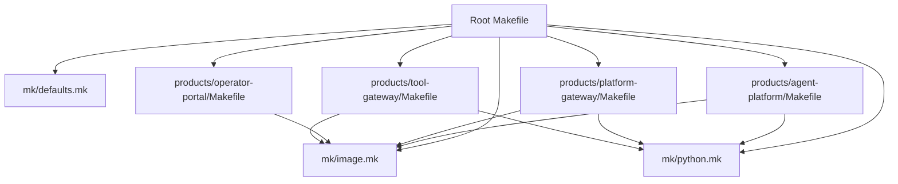
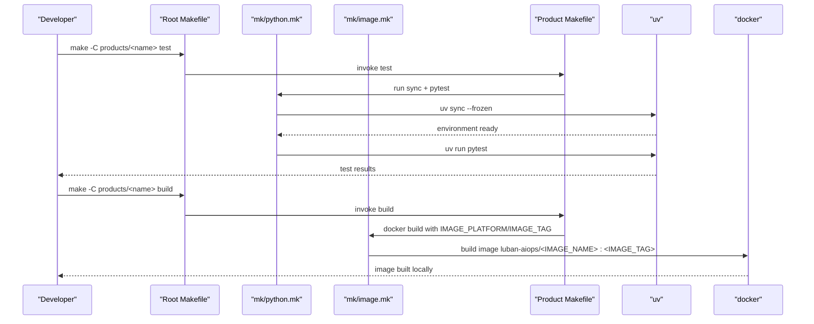
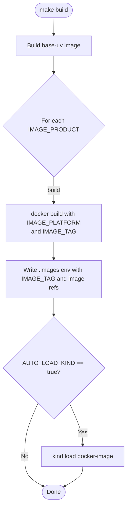
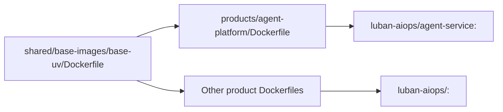
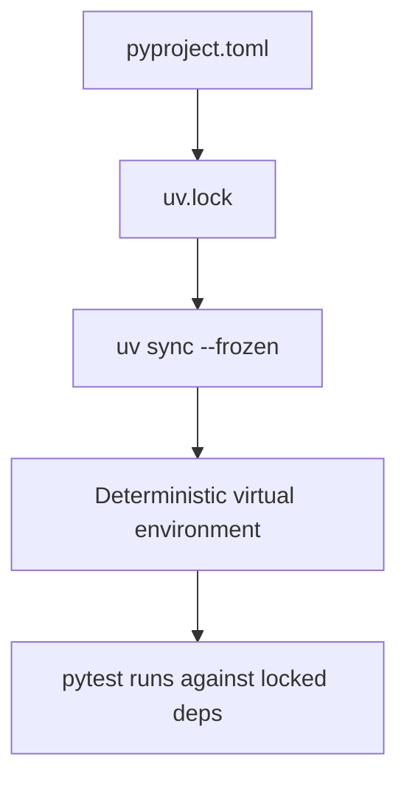
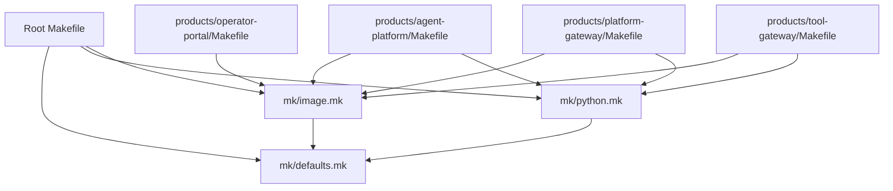

# Build System and Makefile Orchestration

<cite>
**Referenced Files in This Document**
- [Makefile](file://Makefile)
- [defaults.mk](file://mk/defaults.mk)
- [python.mk](file://mk/python.mk)
- [image.mk](file://mk/image.mk)
- [agent-platform Makefile](file://products/agent-platform/Makefile)
- [platform-gateway Makefile](file://products/platform-gateway/Makefile)
- [operator-portal Makefile](file://products/operator-portal/Makefile)
- [tool-gateway Makefile](file://products/tool-gateway/Makefile)
- [agent-platform Dockerfile](file://products/agent-platform/Dockerfile)
- [base-uv Dockerfile](file://shared/base-images/base-uv/Dockerfile)
- [agent-platform pyproject.toml](file://products/agent-platform/pyproject.toml)
- [README.md](file://README.md)
</cite>

## Table of Contents
1. Introduction
2. Project Structure
3. Core Components
4. Architecture Overview
5. Detailed Component Analysis
6. Dependency Analysis
7. Performance Considerations
8. Troubleshooting Guide
9. Conclusion
10. Appendices

## Introduction
This document explains the build system and Makefile orchestration for the repository. It covers how the root Makefile coordinates builds across all products, how the modular mk/ fragments standardize Python and container image builds, and how each product Makefile exposes consistent targets (build, test, lint, clean). It also documents dependency management with uv, lock-file usage for reproducible builds, caching strategies, parallel execution options, environment variable configuration, common workflows, custom target creation, troubleshooting, and the relationship between Make targets and CI/CD pipeline stages.

## Project Structure
The workspace is organized around a root Makefile that delegates to per-product Makefiles under products/. Shared build logic lives in mk/, including defaults for configuration, Python tooling, and Docker image building. Each product typically includes both mk/image.mk and mk/python.mk, setting IMAGE_NAME to define its container image name. The operator-portal is a non-Python SPA served by nginx and only uses mk/image.mk with a wider build context.

**Diagram sources**
- [Makefile:1-211](file://Makefile#L1-L211)
- [defaults.mk:1-53](file://mk/defaults.mk#L1-L53)
- [image.mk:1-58](file://mk/image.mk#L1-L58)
- [python.mk:1-20](file://mk/python.mk#L1-L20)
- [agent-platform Makefile:1-10](file://products/agent-platform/Makefile#L1-L10)
- [platform-gateway Makefile:1-10](file://products/platform-gateway/Makefile#L1-L10)
- [operator-portal Makefile:1-14](file://products/operator-portal/Makefile#L1-L14)
- [tool-gateway Makefile:1-10](file://products/tool-gateway/Makefile#L1-L10)

**Section sources**
- [Makefile:1-211](file://Makefile#L1-L211)
- [README.md:15-65](file://README.md#L15-L65)

## Core Components
- Root Makefile: Orchestrates cross-cutting tasks (sync, test, lint, base-images, build, push, overlays, verify, deploy), computes coordinated image tags, writes build state for deployment, and delegates per-product work.
- mk/defaults.mk: Single source of truth for overridable build settings such as IMAGE_PLATFORM, IMAGE_TAG_PREFIX, REGISTRY, AUTO_LOAD_KIND, KIND_CLUSTER_NAME, and base image versions.
- mk/python.mk: Provides sync and test targets using uv with frozen lock files and disables telemetry exporters during tests to keep output clean.
- mk/image.mk: Provides help, build, push, and lint targets for Docker images; resolves IMAGE_REF based on REGISTRY; supports custom contexts and Dockerfiles.
- Product Makefiles: Minimal files that set IMAGE_NAME and include shared fragments. Operator-portal overrides IMAGE_CONTEXT and IMAGE_DOCKERFILE due to a multi-stage build requiring repo-wide assets.

Key responsibilities:
- Reproducible Python environments via uv sync --frozen against per-product uv.lock.
- Coordinated image tagging and optional kind loading.
- Policy validation and overlay rendering as part of verification.

**Section sources**
- [Makefile:14-46](file://Makefile#L14-L46)
- [Makefile:77-124](file://Makefile#L77-L124)
- [defaults.mk:15-52](file://mk/defaults.mk#L15-L52)
- [python.mk:7-19](file://mk/python.mk#L7-L19)
- [image.mk:18-58](file://mk/image.mk#L18-L58)
- [agent-platform Makefile:1-10](file://products/agent-platform/Makefile#L1-L10)
- [platform-gateway Makefile:1-10](file://products/platform-gateway/Makefile#L1-L10)
- [operator-portal Makefile:1-14](file://products/operator-portal/Makefile#L1-L14)
- [tool-gateway Makefile:1-10](file://products/tool-gateway/Makefile#L1-L10)

## Architecture Overview
The build architecture separates concerns into three layers:
- Orchestration layer (root Makefile): Defines global variables, computes tags, and dispatches per-product tasks.
- Shared fragment layer (mk/): Encapsulates reusable targets for Python and Docker images.
- Product layer (products/*/Makefile): Declares product-specific metadata (IMAGE_NAME) and optionally overrides context or Dockerfile path.

**Diagram sources**
- [Makefile:77-99](file://Makefile#L77-L99)
- [python.mk:11-19](file://mk/python.mk#L11-L19)
- [image.mk:38-48](file://mk/image.mk#L38-L48)
- [agent-platform Makefile:1-10](file://products/agent-platform/Makefile#L1-L10)

## Detailed Component Analysis

### Root Makefile
Responsibilities:
- Enumerates Python and image products.
- Computes a coordinated IMAGE_TAG from VERSION, prefix, profile, git SHA, and dirty status.
- Delegates sync, test, lint to per-product Makefiles.
- Builds shared base image and then all product images with coordinated tag.
- Writes .images.env for downstream deploy scripts.
- Optionally loads images into a local kind cluster.
- Validates GitOps overlays, policy bundles, scenarios, version lockstep, and secret vocabulary.
- Provides deploy, deploy-samples, undeploy-samples, e2e, and clean.

**Diagram sources**
- [Makefile:89-124](file://Makefile#L89-L124)

**Section sources**
- [Makefile:14-46](file://Makefile#L14-L46)
- [Makefile:48-64](file://Makefile#L48-L64)
- [Makefile:77-124](file://Makefile#L77-L124)
- [Makefile:130-168](file://Makefile#L130-L168)
- [Makefile:171-211](file://Makefile#L171-L211)

### mk/defaults.mk
Defines overridable defaults used by root and fragments:
- IMAGE_PLATFORM: Target platform for docker build.
- IMAGE_TAG_PREFIX and IMAGE_TAG_PROFILE: Used to compose coordinated tags.
- REGISTRY: Optional registry re-tag/push target.
- AUTO_LOAD_KIND and KIND_CLUSTER_NAME: Local kind integration flags.
- BASE_UV_IMAGE, BASE_UV_TAG, BASE_UV_UV_VERSION, BASE_UV_PYTHON_VERSION: Pinned base image parameters.

These use ?= so command-line overrides always win.

**Section sources**
- [defaults.mk:1-52](file://mk/defaults.mk#L1-L52)

### mk/python.mk
Provides:
- sync: Install dependencies using uv sync --frozen against the product’s uv.lock.
- test: Ensure environment is synced, then run pytest with OTLP exporters disabled to avoid noisy logs while keeping tracing SDK active.

This ensures deterministic, reproducible environments per product.

**Section sources**
- [python.mk:1-19](file://mk/python.mk#L1-L19)

### mk/image.mk
Provides:
- help: Lists available targets for the product.
- build: Runs docker build with IMAGE_PLATFORM, IMAGE_DOCKERFILE, and IMAGE_CONTEXT; tags as luban-aiops/<IMAGE_NAME>:<IMAGE_TAG>. If REGISTRY is set, also creates a tagged reference to REGISTRY/luban-aiops/<IMAGE_NAME>:<IMAGE_TAG>.
- push: Pushes the image (with optional re-tag if REGISTRY is set).
- lint: Lints Dockerfile using hadolint if available; otherwise runs hadolint via docker; otherwise skips.

Resolves IMAGE_REF based on whether REGISTRY is set.

**Section sources**
- [image.mk:18-58](file://mk/image.mk#L18-L58)

### Product Makefiles
Each product Makefile is intentionally minimal:
- agent-platform, platform-gateway, tool-gateway: Set IMAGE_NAME and include both mk/image.mk and mk/python.mk.
- operator-portal: Sets IMAGE_NAME, IMAGE_CONTEXT to the repo root, and IMAGE_DOCKERFILE to the root Dockerfile because it needs repo-wide assets (VERSION file and web-ui/app).

This pattern keeps product Makefiles declarative and reusable.

**Section sources**
- [agent-platform Makefile:1-10](file://products/agent-platform/Makefile#L1-L10)
- [platform-gateway Makefile:1-10](file://products/platform-gateway/Makefile#L1-L10)
- [tool-gateway Makefile:1-10](file://products/tool-gateway/Makefile#L1-L10)
- [operator-portal Makefile:1-14](file://products/operator-portal/Makefile#L1-L14)

### Docker Images and Base Image Strategy
- Products depend on a shared base image built from shared/base-images/base-uv/Dockerfile.
- The base image installs a pinned uv version, sets up a non-root app user, and configures uv environment variables for deterministic interpreter resolution and linking behavior.
- Product Dockerfiles copy project metadata and source, then run uv sync --frozen --no-dev to install runtime dependencies deterministically.

**Diagram sources**
- [base-uv Dockerfile:1-40](file://shared/base-images/base-uv/Dockerfile#L1-L40)
- [agent-platform Dockerfile:1-13](file://products/agent-platform/Dockerfile#L1-L13)

**Section sources**
- [base-uv Dockerfile:1-40](file://shared/base-images/base-uv/Dockerfile#L1-L40)
- [agent-platform Dockerfile:1-13](file://products/agent-platform/Dockerfile#L1-L13)

### Python Dependencies and Lock Files
- Each Python product has a pyproject.toml and a uv.lock.
- The root README states that backend services standardize on uv for environment and package management and pin interpreter versions via .python-version.
- mk/python.mk enforces frozen installs and tests against the locked environment.

**Diagram sources**
- [agent-platform pyproject.toml:1-38](file://products/agent-platform/pyproject.toml#L1-L38)
- [python.mk:11-19](file://mk/python.mk#L11-L19)

**Section sources**
- [README.md:76-82](file://README.md#L76-L82)
- [agent-platform pyproject.toml:1-38](file://products/agent-platform/pyproject.toml#L1-L38)
- [python.mk:11-19](file://mk/python.mk#L11-L19)

## Dependency Analysis
- Coupling:
  - Root Makefile depends on mk/defaults.mk and enumerates products to delegate tasks.
  - Product Makefiles depend on mk/image.mk and mk/python.mk.
  - Dockerfiles depend on the shared base image.
- Cohesion:
  - mk/ modules encapsulate language- and tool-specific logic, improving reuse and reducing duplication.
- External dependencies:
  - docker, uv, kustomize, kind (optional), hadolint (optional).

**Diagram sources**
- [Makefile:14-46](file://Makefile#L14-L46)
- [defaults.mk:15-52](file://mk/defaults.mk#L15-L52)
- [python.mk:1-19](file://mk/python.mk#L1-L19)
- [image.mk:18-58](file://mk/image.mk#L18-L58)
- [agent-platform Makefile:1-10](file://products/agent-platform/Makefile#L1-L10)
- [platform-gateway Makefile:1-10](file://products/platform-gateway/Makefile#L1-L10)
- [operator-portal Makefile:1-14](file://products/operator-portal/Makefile#L1-L14)
- [tool-gateway Makefile:1-10](file://products/tool-gateway/Makefile#L1-L10)

**Section sources**
- [Makefile:14-46](file://Makefile#L14-L46)
- [image.mk:18-58](file://mk/image.mk#L18-L58)
- [python.mk:1-19](file://mk/python.mk#L1-L19)

## Performance Considerations
- Parallelism:
  - GNU make supports parallel execution via -j. Use make -j$(nproc) at the root level to run independent product tasks concurrently where supported by the underlying commands.
- Caching:
  - Docker layer caching accelerates repeated builds when inputs change minimally.
  - uv sync --frozen caches resolved packages in the uv cache directory; ensure the cache is preserved across CI jobs for faster cold starts.
- Determinism:
  - Frozen installs and pinned base image versions reduce variability and rebuilds caused by upstream drift.
- I/O-bound steps:
  - Tests and Docker builds are often I/O bound; consider dedicated runners with fast disks and network access to improve throughput.

[No sources needed since this section provides general guidance]

## Troubleshooting Guide
Common issues and resolutions:
- Missing tools:
  - hadolint not installed: image.mk falls back to running hadolint via docker; if docker is unavailable, lint is skipped.
  - kustomize missing: overlays target will fail; install kustomize to render GitOps overlays.
  - kind missing or misconfigured: AUTO_LOAD_KIND requires KIND_CLUSTER_NAME to be set; otherwise build exits with an error.
- Registry authentication:
  - When REGISTRY is set, push may require login to the target registry.
- Version mismatches:
  - validate-version and validate-secret-vocabulary enforce lockstep across products; failures indicate drift between VERSION, product metadata, and contracts.
- Test noise:
  - If you see OTLP exporter retries in test output, ensure OTEL_*_EXPORTER=none is set; mk/python.mk already sets these for tests.

**Section sources**
- [image.mk:50-58](file://mk/image.mk#L50-L58)
- [Makefile:110-124](file://Makefile#L110-L124)
- [Makefile:171-176](file://Makefile#L171-L176)
- [Makefile:161-168](file://Makefile#L161-L168)
- [python.mk:14-19](file://mk/python.mk#L14-L19)

## Conclusion
The build system centers on a root Makefile that orchestrates consistent, reproducible builds across multiple products using shared mk/ fragments. Python environments are managed with uv and frozen lock files, while Docker images are built with a shared base image and coordinated tagging. Cross-cutting validations (overlays, policies, versions, vocabulary) are integrated into the verification gate, enabling reliable local development and CI pipelines.

[No sources needed since this section summarizes without analyzing specific files]

## Appendices

### Environment Variables Reference
- IMAGE_PLATFORM: Target platform for docker build (default linux/amd64).
- IMAGE_TAG_PREFIX / IMAGE_TAG_PROFILE: Compose coordinated image tags.
- REGISTRY: Optional registry prefix for re-tagging and pushing images.
- AUTO_LOAD_KIND / KIND_CLUSTER_NAME: Enable automatic loading of built images into a local kind cluster.
- BASE_UV_IMAGE / BASE_UV_TAG / BASE_UV_UV_VERSION / BASE_UV_PYTHON_VERSION: Configure the shared base image.
- NAMESPACE: Namespace used by sample deployment helpers.

**Section sources**
- [defaults.mk:20-52](file://mk/defaults.mk#L20-L52)
- [Makefile:29-46](file://Makefile#L29-L46)

### Common Workflows
- Sync dependencies for all Python products:
  - make sync
- Run all product tests:
  - make test
- Lint all product Dockerfiles:
  - make lint
- Build shared base image and all product images with coordinated tag:
  - make build
- Push images to a registry:
  - make push REGISTRY=<your-registry>
- Verify everything (tests, overlays, policies, scenarios, versions, vocabulary):
  - make verify
- Deploy dev-k8s overlay:
  - make deploy
- Run end-to-end demos:
  - make e2e

**Section sources**
- [Makefile:77-124](file://Makefile#L77-L124)
- [Makefile:171-204](file://Makefile#L171-L204)

### Custom Target Creation
To add a new per-product target:
- Define the target in the product Makefile or extend mk/python.mk/mk/image.mk if it applies broadly.
- Add a corresponding entry in the root Makefile if you want it aggregated at the workspace level.
- Use the existing patterns: set variables early, include shared fragments, and rely on defaults.mk for configuration.

[No sources needed since this section provides general guidance]

### Relationship Between Make Targets and CI/CD Stages
Typical CI stages map to Make targets:
- Setup: Install tools (docker, uv, kustomize, hadolint).
- Lint: make lint (Dockerfile linting).
- Test: make test (product test suites).
- Verify: make verify (full pre-commit/pre-push gate).
- Build: make build (coordinated image builds and optional kind load).
- Push: make push (publish images to registry).
- Deploy: make deploy (apply dev-k8s overlay).
- E2E: make e2e (run demo scripts against deployed cluster).

**Section sources**
- [Makefile:77-124](file://Makefile#L77-L124)
- [Makefile:171-204](file://Makefile#L171-L204)
- [README.md:89-92](file://README.md#L89-L92)