# Docker Image Building and Optimization

<cite>
**Referenced Files in This Document**
- [Dockerfile](file://shared/base-images/base-uv/Dockerfile)
- [Makefile](file://Makefile)
- [defaults.mk](file://mk/defaults.mk)
- [image.mk](file://mk/image.mk)
- [python.mk](file://mk/python.mk)
- [.dockerignore](file://.dockerignore)
- [agent-platform Dockerfile](file://products/agent-platform/Dockerfile)
- [platform-gateway Dockerfile](file://products/platform-gateway/Dockerfile)
- [operator-portal Dockerfile](file://products/operator-portal/Dockerfile)
- [audit-service deployment](file://shared/platform-ops/gitops/dev-k8s/base/audit-service/audit-service-deployment.yaml)
- [incident-service deployment](file://shared/platform-ops/gitops/dev-k8s/base/incident-service/incident-service-deployment.yaml)
- [browser-check-target deployment](file://shared/platform-ops/gitops/runtime-profiles/browser-dev/browser-check-target-deployment.yaml)
- [sync-runtime-secret.sh](file://shared/platform-ops/gitops/sync-runtime-secret.sh)
</cite>

## Table of Contents
1. [Introduction](#introduction)
2. [Project Structure](#project-structure)
3. [Core Components](#core-components)
4. [Architecture Overview](#architecture-overview)
5. [Detailed Component Analysis](#detailed-component-analysis)
6. [Dependency Analysis](#dependency-analysis)
7. [Performance Considerations](#performance-considerations)
8. [Troubleshooting Guide](#troubleshooting-guide)
9. [Conclusion](#conclusion)
10. [Appendices](#appendices)

## Introduction
This document explains how the platform builds, optimizes, and deploys container images for all services. It focuses on the shared base image strategy using a pinned UV-based Python runtime, multi-stage builds where applicable, dependency caching, security scanning integration points, image tagging conventions, registry management, health checks, resource limits, secrets handling, and the relationship between images and Kubernetes deployments.

## Project Structure
The repository uses a consistent build system:
- A shared base image is built once and reused by all Python services.
- Each product has a minimal Dockerfile that layers application code and dependencies on top of the base image.
- The operator portal uses a two-stage build to compile a static frontend and serve it with nginx.
- Makefiles orchestrate coordinated builds, tagging, pushing, and optional loading into a local kind cluster.

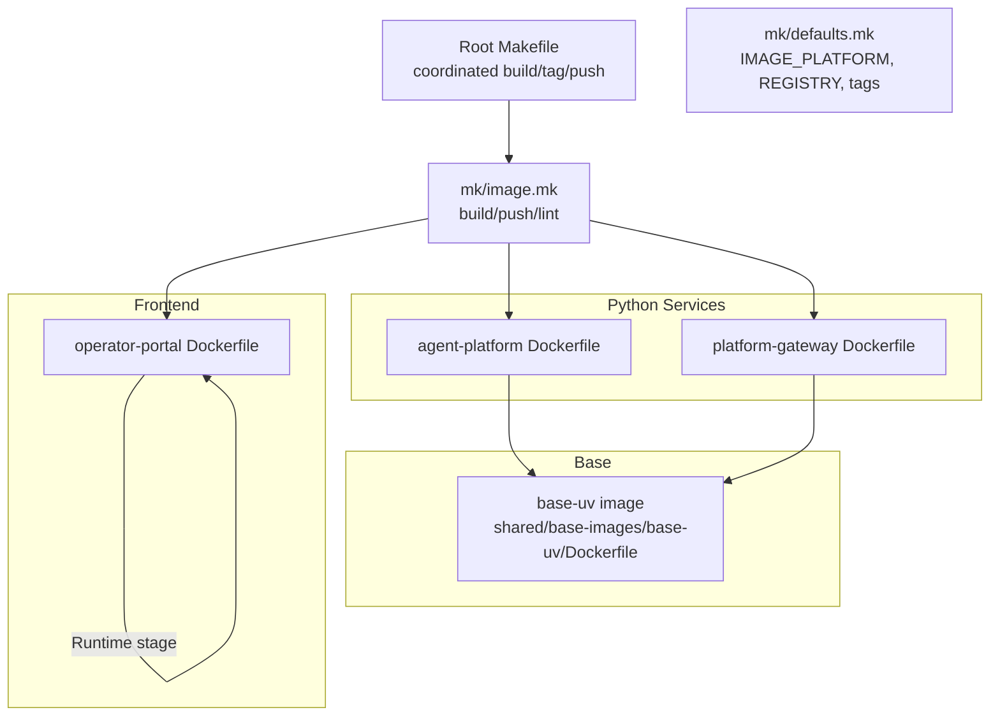

**Diagram sources**
- [Makefile:89-124](file://Makefile#L89-L124)
- [image.mk:22-48](file://mk/image.mk#L22-L48)
- [defaults.mk:20-50](file://mk/defaults.mk#L20-L50)
- [Dockerfile:1-40](file://shared/base-images/base-uv/Dockerfile#L1-L40)
- [agent-platform Dockerfile:1-13](file://products/agent-platform/Dockerfile#L1-L13)
- [platform-gateway Dockerfile:1-13](file://products/platform-gateway/Dockerfile#L1-L13)
- [operator-portal Dockerfile:1-29](file://products/operator-portal/Dockerfile#L1-L29)

**Section sources**
- [Makefile:14-17](file://Makefile#L14-L17)
- [Makefile:89-124](file://Makefile#L89-L124)
- [image.mk:1-58](file://mk/image.mk#L1-L58)
- [defaults.mk:1-53](file://mk/defaults.mk#L1-L53)

## Core Components
- Shared base image (base-uv): Provides a minimal Amazon Linux 2023 environment with a pinned uv binary, no system Python, and a non-root app user. Environment variables configure deterministic Python resolution and link behavior.
- Product Dockerfiles: Copy only necessary files, install frozen dependencies via uv sync, and run the service through uv.
- Operator portal: Multi-stage build compiles a Vite/React SPA and serves it with an unprivileged nginx image.
- Build orchestration: Root Makefile computes a coordinated tag, builds all images, writes image state for deployment, and optionally loads images into a kind cluster.
- Defaults and fragments: Centralized defaults for platforms, registries, and base image versions; per-product fragments handle linting and building.

**Section sources**
- [Dockerfile:1-40](file://shared/base-images/base-uv/Dockerfile#L1-L40)
- [agent-platform Dockerfile:1-13](file://products/agent-platform/Dockerfile#L1-L13)
- [platform-gateway Dockerfile:1-13](file://products/platform-gateway/Dockerfile#L1-L13)
- [operator-portal Dockerfile:1-29](file://products/operator-portal/Dockerfile#L1-L29)
- [Makefile:48-124](file://Makefile#L48-L124)
- [image.mk:22-58](file://mk/image.mk#L22-L58)
- [defaults.mk:20-50](file://mk/defaults.mk#L20-L50)

## Architecture Overview
The build pipeline ensures reproducible, secure, and optimized images across services.

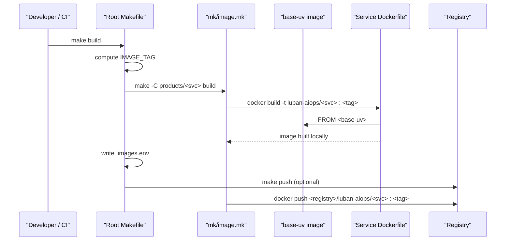

**Diagram sources**
- [Makefile:48-124](file://Makefile#L48-L124)
- [image.mk:22-48](file://mk/image.mk#L22-L48)
- [defaults.mk:20-50](file://mk/defaults.mk#L20-L50)

## Detailed Component Analysis

### Base Image Strategy (base-uv)
- Minimal OS: Amazon Linux 2023 minimal reduces attack surface and size.
- Pinned toolchain: uv and Python versions are pinned via build args and defaults to ensure reproducibility.
- No system Python: uv resolves the interpreter from each product’s .python-version or UV_PYTHON fallback.
- Non-root user: An app user (uid 1000) is created and used at runtime.
- Deterministic env: Variables disable bytecode writing, enforce unbuffered output, set link mode, and pin Python install location.

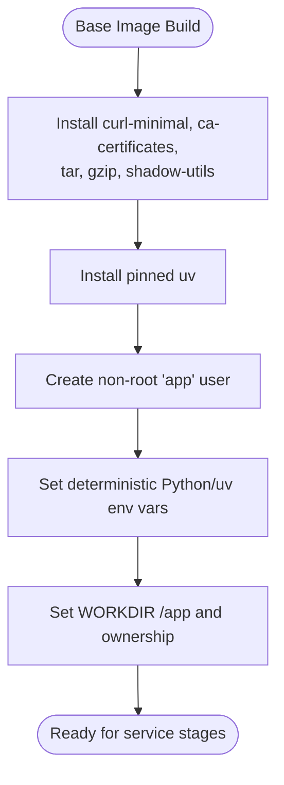

**Diagram sources**
- [Dockerfile:13-39](file://shared/base-images/base-uv/Dockerfile#L13-L39)

**Section sources**
- [Dockerfile:1-40](file://shared/base-images/base-uv/Dockerfile#L1-L40)
- [defaults.mk:45-50](file://mk/defaults.mk#L45-L50)

### Python Service Images
- Layering: Each service copies only its source tree and lockfiles first, then runs uv sync --frozen --no-dev to install production dependencies. This maximizes cache hits when only source changes.
- Runtime: Services run via uv run, inheriting the base image’s non-root user and deterministic Python setup.
- Exposed ports: Services expose their HTTP port (e.g., 8000).

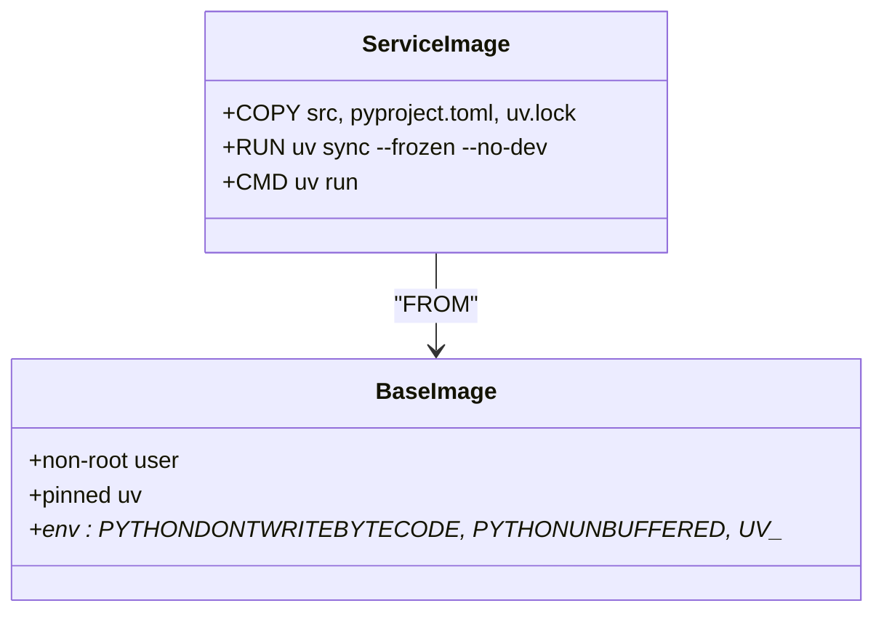

**Diagram sources**
- [Dockerfile:13-39](file://shared/base-images/base-uv/Dockerfile#L13-L39)
- [agent-platform Dockerfile:1-13](file://products/agent-platform/Dockerfile#L1-L13)
- [platform-gateway Dockerfile:1-13](file://products/platform-gateway/Dockerfile#L1-L13)

**Section sources**
- [agent-platform Dockerfile:1-13](file://products/agent-platform/Dockerfile#L1-L13)
- [platform-gateway Dockerfile:1-13](file://products/platform-gateway/Dockerfile#L1-L13)
- [python.mk:11-19](file://mk/python.mk#L11-L19)

### Operator Portal Multi-Stage Build
- Build stage: Uses a Node image to compile the SPA, injecting the repository VERSION at build time so the UI can display the platform version.
- Runtime stage: Uses an unprivileged nginx image to serve static assets and proxy API calls.

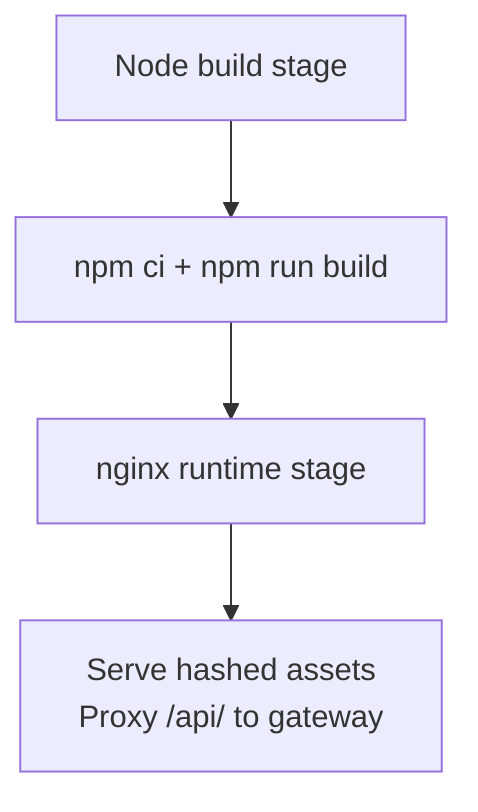

**Diagram sources**
- [operator-portal Dockerfile:11-29](file://products/operator-portal/Dockerfile#L11-L29)

**Section sources**
- [operator-portal Dockerfile:1-29](file://products/operator-portal/Dockerfile#L1-L29)

### Coordinated Builds and Tagging
- Tag computation: The root Makefile computes a coordinated tag combining semver (from VERSION), prefix/profile, git SHA, and dirty-state timestamp.
- Build scope: All image products are built with the same tag to keep deployments consistent.
- State file: After building, the root Makefile writes an .images.env containing all image references for GitOps overlays.
- Optional kind load: When enabled, images are loaded into a local kind cluster for fast iteration.

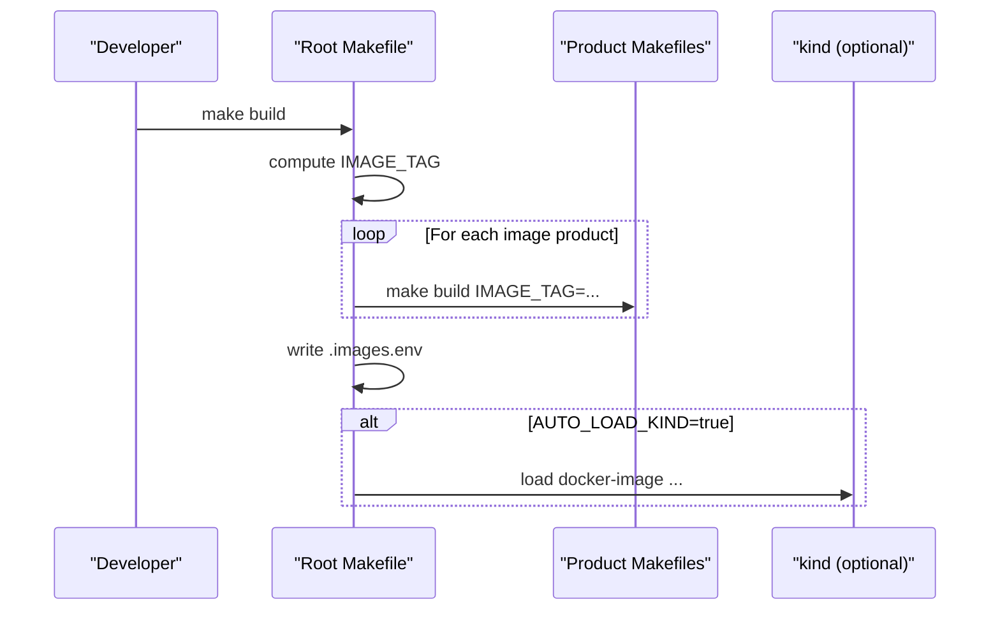

**Diagram sources**
- [Makefile:48-124](file://Makefile#L48-L124)
- [defaults.mk:27-39](file://mk/defaults.mk#L27-L39)

**Section sources**
- [Makefile:48-124](file://Makefile#L48-L124)
- [defaults.mk:27-39](file://mk/defaults.mk#L27-L39)

### Registry Management and Push
- Local-only builds: Without REGISTRY set, images are tagged locally under luban-aiops/.
- Push to registry: With REGISTRY set, images are re-tagged and pushed to the configured registry.
- Linting: Per-product Dockerfiles are linted via hadolint (local or docker-run fallback).

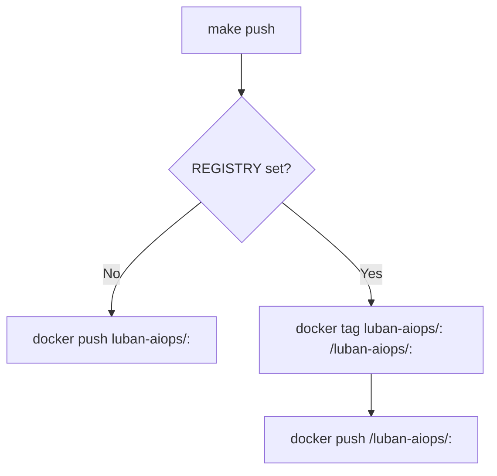

**Diagram sources**
- [image.mk:26-48](file://mk/image.mk#L26-L48)

**Section sources**
- [image.mk:22-58](file://mk/image.mk#L22-L58)

### Health Checks and Readiness/Liveness
- Services expose HTTP health endpoints. Deployments define readinessProbe on /health/ready and livenessProbe on /health/live with tuned delays and timeouts to avoid premature restarts during startup.
- Example targets show consistent patterns across services.

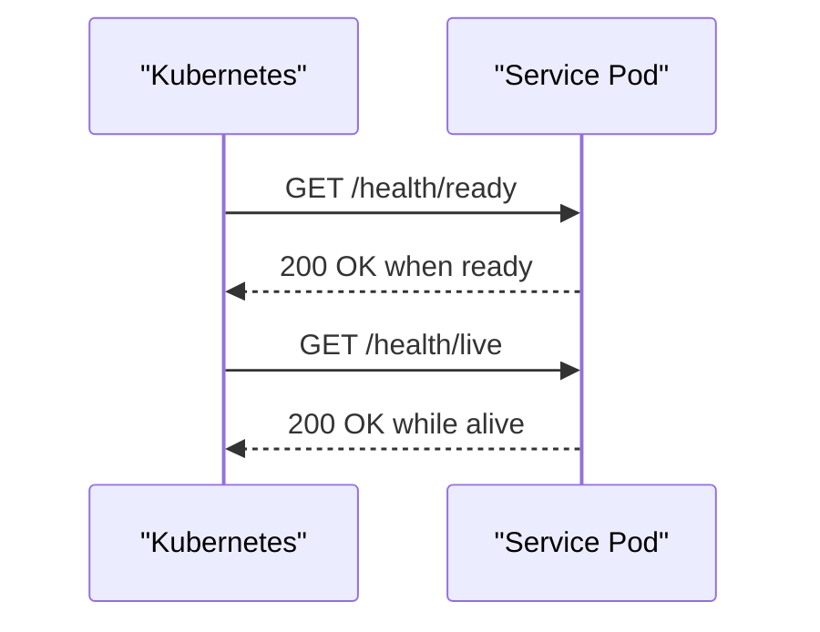

**Diagram sources**
- [audit-service deployment:42-57](file://shared/platform-ops/gitops/dev-k8s/base/audit-service/audit-service-deployment.yaml#L42-L57)
- [incident-service deployment:42-57](file://shared/platform-ops/gitops/dev-k8s/base/incident-service/incident-service-deployment.yaml#L42-L57)

**Section sources**
- [audit-service deployment:42-57](file://shared/platform-ops/gitops/dev-k8s/base/audit-service/audit-service-deployment.yaml#L42-L57)
- [incident-service deployment:42-57](file://shared/platform-ops/gitops/dev-k8s/base/incident-service/incident-service-deployment.yaml#L42-L57)

### Security Best Practices in Container Definitions
- Non-root execution: Base image creates and switches to a non-root user; runtime containers should honor this.
- Minimal base: Amazon Linux 2023 minimal reduces vulnerabilities and image size.
- Unprivileged runtime: The operator portal uses an unprivileged nginx image.
- Strict context: .dockerignore excludes caches, node_modules, and build artifacts to prevent accidental inclusion.

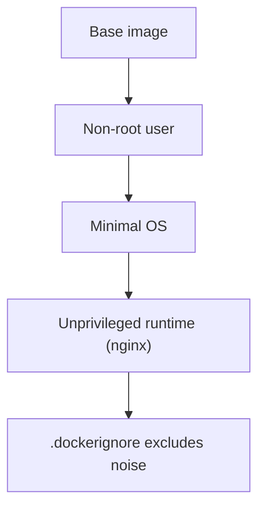

**Diagram sources**
- [Dockerfile:19-39](file://shared/base-images/base-uv/Dockerfile#L19-L39)
- [operator-portal Dockerfile:23-29](file://products/operator-portal/Dockerfile#L23-L29)
- [.dockerignore:1-18](file://.dockerignore#L1-L18)

**Section sources**
- [Dockerfile:19-39](file://shared/base-images/base-uv/Dockerfile#L19-L39)
- [operator-portal Dockerfile:23-29](file://products/operator-portal/Dockerfile#L23-L29)
- [.dockerignore:1-18](file://.dockerignore#L1-L18)

### Secrets Management in Containers
- Secrets are not baked into images. They are provisioned at deploy time via scripts that create Kubernetes Secrets from profile-specific .env files.
- The sync script reads a profile secret file and applies a generic Secret into the target namespace.

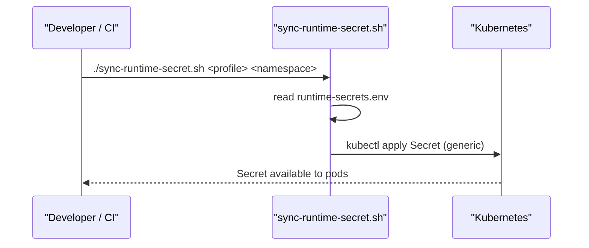

**Diagram sources**
- [sync-runtime-secret.sh:1-28](file://shared/platform-ops/gitops/sync-runtime-secret.sh#L1-L28)

**Section sources**
- [sync-runtime-secret.sh:1-28](file://shared/platform-ops/gitops/sync-runtime-secret.sh#L1-L28)

### Relationship Between Images and Deployment Configurations
- Coordinated tagging: The root Makefile writes all image references into .images.env, which GitOps overlays consume to deploy consistent sets of images.
- Health probes: Deployments reference service health endpoints to manage rollout and recovery safely.
- Resource limits: While not shown here, typical deployments pair these images with CPU/memory requests and limits to ensure stable scheduling and protection against noisy neighbors.

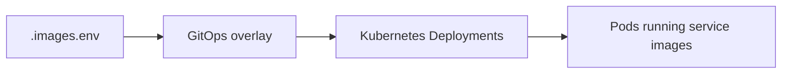

**Diagram sources**
- [Makefile:97-124](file://Makefile#L97-L124)

**Section sources**
- [Makefile:97-124](file://Makefile#L97-L124)

## Dependency Analysis
- Base image coupling: All Python services depend on the shared base-uv image; updating the base image affects all services uniformly.
- Build-time vs runtime: Dependencies are installed at build time with uv sync --frozen, ensuring deterministic runtime environments.
- Orchestration coupling: The root Makefile coordinates builds and pushes across all image products, enforcing a single tag per release candidate.

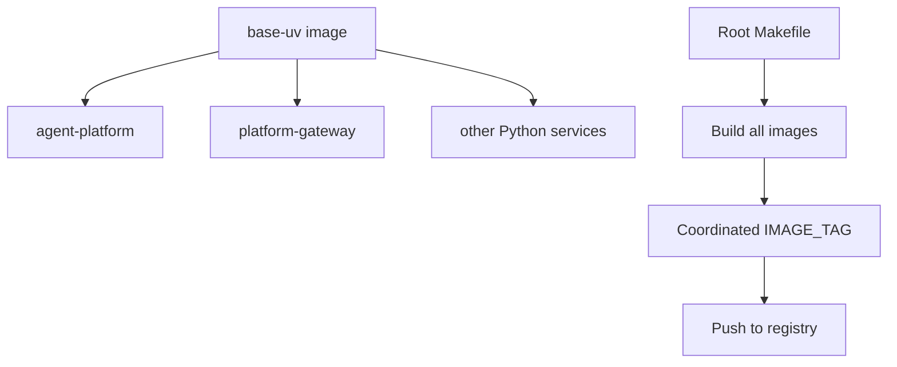

**Diagram sources**
- [Makefile:14-17](file://Makefile#L14-L17)
- [Makefile:89-124](file://Makefile#L89-L124)
- [defaults.mk:45-50](file://mk/defaults.mk#L45-L50)

**Section sources**
- [Makefile:14-17](file://Makefile#L14-L17)
- [Makefile:89-124](file://Makefile#L89-L124)
- [defaults.mk:45-50](file://mk/defaults.mk#L45-L50)

## Performance Considerations
- Dependency pre-installation: Use uv sync --frozen --no-dev in the image build to cache dependency installation separately from source changes.
- Layer ordering: Copy lockfiles and project metadata before copying source to maximize cache reuse.
- Minimal runtime: Avoid installing development tools or extra packages in the final image; rely on the base image and frozen deps.
- Context pruning: .dockerignore excludes caches and generated artifacts to reduce build context size and improve cache efficiency.
- Multi-stage builds: Compile heavy assets (e.g., frontend) in a builder stage and copy only outputs to a minimal runtime stage.

[No sources needed since this section provides general guidance]

## Troubleshooting Guide
- Slow builds: Ensure lockfiles are copied before source and that .dockerignore excludes unnecessary files. Verify uv sync is cached by checking layer rebuilds.
- Startup crashes: Check readiness/liveness probe paths and initialDelaySeconds; misconfigured probes can cause restart loops.
- OOM kills: Review pod resource limits and compare with actual memory usage; adjust limits or fix leaks if exit code indicates OOM.
- Missing secrets: If a pod fails to start due to missing configuration, verify that the corresponding Secret was synced via the provided scripts and mounted correctly.
- Image tag mismatches: Confirm that .images.env contains the expected IMAGE_TAG and that overlays reference those references.

**Section sources**
- [audit-service deployment:42-57](file://shared/platform-ops/gitops/dev-k8s/base/audit-service/audit-service-deployment.yaml#L42-L57)
- [incident-service deployment:42-57](file://shared/platform-ops/gitops/dev-k8s/base/incident-service/incident-service-deployment.yaml#L42-L57)
- [browser-check-target deployment:21-47](file://shared/platform-ops/gitops/runtime-profiles/browser-dev/browser-check-target-deployment.yaml#L21-L47)
- [sync-runtime-secret.sh:15-26](file://shared/platform-ops/gitops/sync-runtime-secret.sh#L15-L26)

## Conclusion
The platform standardizes containerization around a pinned, minimal base image and disciplined Dockerfiles that separate dependency installation from source changes. Coordinated tagging and GitOps-driven deployments ensure consistency across services. Health probes and best practices in base images and contexts provide a solid foundation for reliability and security. Secrets are managed outside images and provisioned at deploy time, aligning with operational best practices.

[No sources needed since this section summarizes without analyzing specific files]

## Appendices

### Image Tag Conventions and Promotion Workflow
- Tag composition: <semver>-<prefix>[-<profile>]-<gitsha>[-dirty-<timestamp>]
- Prefix/profile: Controlled via IMAGE_TAG_PREFIX and IMAGE_TAG_PROFILE
- Registry promotion: Set REGISTRY to re-tag and push to a target registry; use the same coordinated tag across all services for consistent rollouts.

**Section sources**
- [Makefile:48-64](file://Makefile#L48-L64)
- [defaults.mk:27-39](file://mk/defaults.mk#L27-L39)
- [image.mk:26-48](file://mk/image.mk#L26-L48)

### Security Scanning Integration Points
- Linting: Per-product Dockerfiles are linted via hadolint (local or docker-run fallback) as part of verification.
- Recommended additions: Integrate vulnerability scanning (e.g., Trivy, Grype) in CI after image build and before push to gate releases on severity thresholds.

**Section sources**
- [image.mk:50-58](file://mk/image.mk#L50-L58)