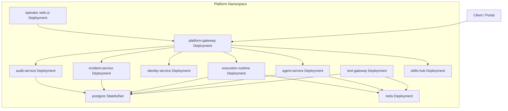
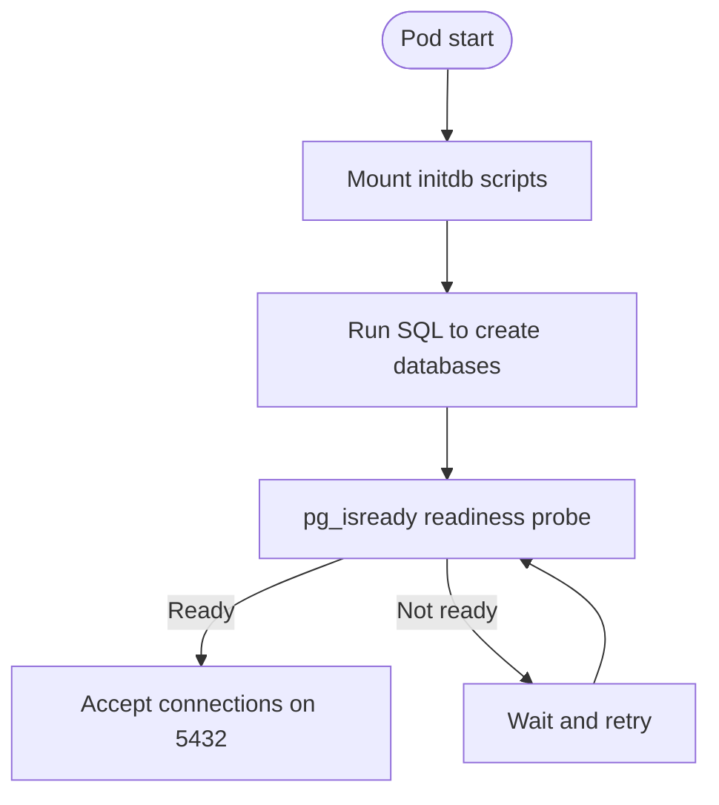
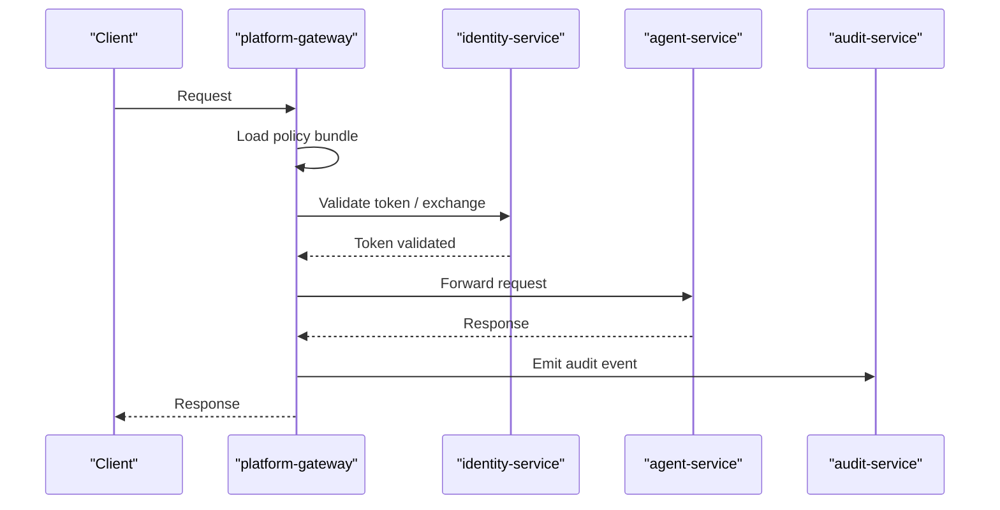
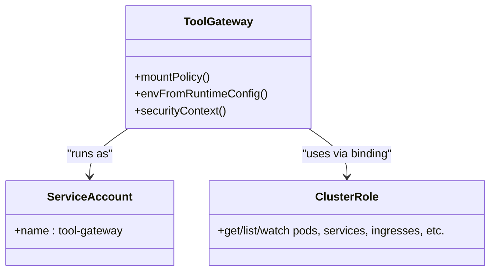
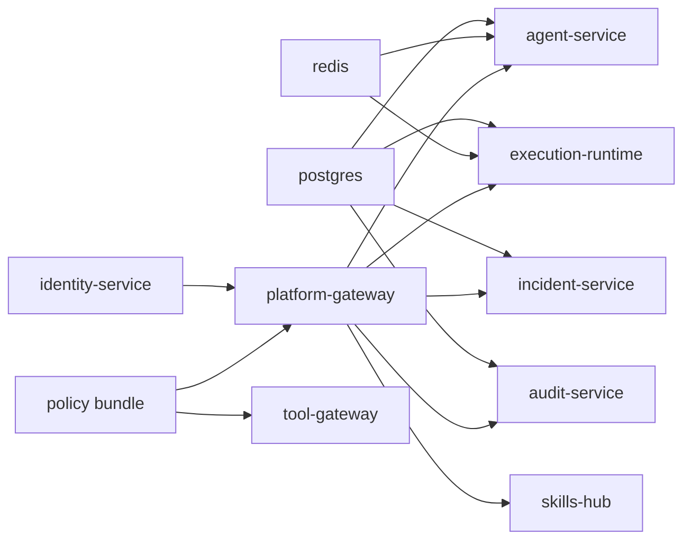

# Base Configuration and Common Resources

<cite>
**Referenced Files in This Document**
- [kustomization.yaml](file://shared/platform-ops/gitops/dev-k8s/base/kustomization.yaml)
- [namespace.yaml](file://shared/platform-ops/gitops/dev-k8s/base/shared/namespace.yaml)
- [policy.yaml](file://shared/platform-ops/gitops/dev-k8s/base/shared/policy.yaml)
- [runtime.env](file://shared/platform-ops/gitops/dev-k8s/base/shared/runtime.env)
- [postgres-service.yaml](file://shared/platform-ops/gitops/dev-k8s/base/infra/postgres-service.yaml)
- [postgres-statefulset.yaml](file://shared/platform-ops/gitops/dev-k8s/base/infra/postgres-statefulset.yaml)
- [create-sessions-db.sql](file://shared/platform-ops/gitops/dev-k8s/base/infra/create-sessions-db.sql)
- [redis-deployment.yaml](file://shared/platform-ops/gitops/dev-k8s/base/infra/redis-deployment.yaml)
- [redis-service.yaml](file://shared/platform-ops/gitops/dev-k8s/base/infra/redis-service.yaml)
- [platform-gateway-deployment.yaml](file://shared/platform-ops/gitops/dev-k8s/base/platform-gateway/platform-gateway-deployment.yaml)
- [platform-gateway-rbac.yaml](file://shared/platform-ops/gitops/dev-k8s/base/platform-gateway/rbac.yaml)
- [tool-gateway-deployment.yaml](file://shared/platform-ops/gitops/dev-k8s/base/tool-gateway/tool-gateway-deployment.yaml)
- [tool-gateway-rbac.yaml](file://shared/platform-ops/gitops/dev-k8s/base/tool-gateway/rbac.yaml)
- [agent-service-service.yaml](file://shared/platform-ops/gitops/dev-k8s/base/agent-platform/agent-service-service.yaml)
- [identity-service-service.yaml](file://shared/platform-ops/gitops/dev-k8s/base/identity-broker/identity-service-service.yaml)
- [audit-service-service.yaml](file://shared/platform-ops/gitops/dev-k8s/base/audit-service/audit-service-service.yaml)
- [execution-runtime-service.yaml](file://shared/platform-ops/gitops/dev-k8s/base/execution-runtime/execution-runtime-service.yaml)
- [incident-service-service.yaml](file://shared/platform-ops/gitops/dev-k8s/base/incident-service/incident-service-service.yaml)
- [skills-hub-service.yaml](file://shared/platform-ops/gitops/dev-k8s/base/skills-hub/skills-hub-service.yaml)
- [web-ui-service.yaml](file://shared/platform-ops/gitops/dev-k8s/base/operator-portal/web-ui-service.yaml)
- [web-ui-httproute.yaml](file://shared/platform-ops/gitops/dev-k8s/base/operator-portal/web-ui-httproute.yaml)
- [configuration-reference.md](file://docs/guides/configuration-reference.md)
</cite>

## Table of Contents
1. [Introduction](#introduction)
2. [Project Structure](#project-structure)
3. [Core Components](#core-components)
4. [Architecture Overview](#architecture-overview)
5. [Detailed Component Analysis](#detailed-component-analysis)
6. [Dependency Analysis](#dependency-analysis)
7. [Performance Considerations](#performance-considerations)
8. [Troubleshooting Guide](#troubleshooting-guide)
9. [Conclusion](#conclusion)
10. [Appendices](#appendices)

## Introduction
This document describes the base Kubernetes configuration and shared resources for the platform. It covers namespace setup, common ConfigMaps and Secrets, infrastructure services (PostgreSQL and Redis), service definitions, deployments, RBAC, security contexts, storage and persistence, monitoring and observability baselines, and backup and disaster recovery considerations for critical services. The goal is to provide a clear, code-grounded reference for operators deploying and maintaining the platform’s base layer.

## Project Structure
The base deployment is assembled with Kustomize under shared/platform-ops/gitops/dev-k8s/base. A single Kustomization defines the namespace, generates shared runtime configuration, includes policy and skills content, and declares all platform resources: infrastructure, gateways, services, and the operator portal.

```mermaid
graph TB
K["Kustomization<br/>dev-k8s/base"] --> N["Namespace<br/>dev-luban-aiops"]
K --> C["ConfigMap<br/>platform-runtime-config"]
K --> P["ConfigMap<br/>platform-policy"]
K --> S["ConfigMap<br/>skills-*"]
K --> PG["StatefulSet<br/>postgres"]
K --> PGSvc["Service<br/>postgres + postgres-headless"]
K --> RDS["Deployment<br/>redis"]
K --> RDSSvc["Service<br/>redis"]
K --> GW1["Deployment<br/>platform-gateway"]
K --> GW2["Deployment<br/>tool-gateway"]
K --> AG["Deployment<br/>agent-service"]
K --> ID["Deployment<br/>identity-service"]
K --> AU["Deployment<br/>audit-service"]
K --> EX["Deployment<br/>execution-runtime"]
K --> IN["Deployment<br/>incident-service"]
K --> SK["Deployment<br/>skills-hub"]
K --> OP["Deployment<br/>operator web-ui"]
```

**Diagram sources**
- [kustomization.yaml:1-72](file://shared/platform-ops/gitops/dev-k8s/base/kustomization.yaml#L1-L72)

**Section sources**
- [kustomization.yaml:1-72](file://shared/platform-ops/gitops/dev-k8s/base/kustomization.yaml#L1-L72)
- [namespace.yaml:1-5](file://shared/platform-ops/gitops/dev-k8s/base/shared/namespace.yaml#L1-L5)

## Core Components
- Namespace: dev-luban-aiops hosts all platform components.
- Shared runtime configuration: A single ConfigMap aggregates environment variables from multiple runtime-config.env files and a shared runtime.env file.
- Policy bundle: A ConfigMap containing the default action-authorization policy is mounted into gateway pods.
- Infrastructure:
  - PostgreSQL StatefulSet with persistent volume and init scripts for database creation.
  - Redis Deployment with ephemeral storage for development use.
- Services: Internal ClusterIP services expose each component within the namespace; PostgreSQL also exposes a headless service for stable DNS.
- Gateways: platform-gateway and tool-gateway are deployed with strict security contexts and Prometheus scrape annotations.
- Operator Portal: Web UI Deployment and Service, plus an HTTPRoute for ingress exposure.

**Section sources**
- [namespace.yaml:1-5](file://shared/platform-ops/gitops/dev-k8s/base/shared/namespace.yaml#L1-L5)
- [kustomization.yaml:6-45](file://shared/platform-ops/gitops/dev-k8s/base/kustomization.yaml#L6-L45)
- [postgres-statefulset.yaml:1-63](file://shared/platform-ops/gitops/dev-k8s/base/infra/postgres-statefulset.yaml#L1-L63)
- [redis-deployment.yaml:1-30](file://shared/platform-ops/gitops/dev-k8s/base/infra/redis-deployment.yaml#L1-L30)
- [platform-gateway-deployment.yaml:1-49](file://shared/platform-ops/gitops/dev-k8s/base/platform-gateway/platform-gateway-deployment.yaml#L1-L49)
- [tool-gateway-deployment.yaml:1-49](file://shared/platform-ops/gitops/dev-k8s/base/tool-gateway/tool-gateway-deployment.yaml#L1-L49)
- [web-ui-httproute.yaml:1-200](file://shared/platform-ops/gitops/dev-k8s/base/operator-portal/web-ui-httproute.yaml#L1-L200)

## Architecture Overview
The base architecture centers on two gateways that enforce identity, authorization, and policy, routing requests to backend services. Data stores include PostgreSQL for durable state and Redis for caching/session data. Observability is enabled via OpenTelemetry and Prometheus scraping.

**Diagram sources**
- [kustomization.yaml:45-72](file://shared/platform-ops/gitops/dev-k8s/base/kustomization.yaml#L45-L72)
- [postgres-service.yaml:1-23](file://shared/platform-ops/gitops/dev-k8s/base/infra/postgres-service.yaml#L1-L23)
- [redis-service.yaml:1-12](file://shared/platform-ops/gitops/dev-k8s/base/infra/redis-service.yaml#L1-L12)
- [platform-gateway-deployment.yaml:1-49](file://shared/platform-ops/gitops/dev-k8s/base/platform-gateway/platform-gateway-deployment.yaml#L1-L49)
- [tool-gateway-deployment.yaml:1-49](file://shared/platform-ops/gitops/dev-k8s/base/tool-gateway/tool-gateway-deployment.yaml#L1-L49)

## Detailed Component Analysis

### Namespace and Shared Configuration
- Namespace: dev-luban-aiops is created explicitly.
- Shared runtime configuration:
  - A ConfigMap named platform-runtime-config is generated by merging shared/runtime.env and per-service runtime-config.env files.
  - OTEL is enabled by default and points to an OpenObserve router endpoint; authentication headers are injected via per-service secrets.
  - Identity broker URL is set centrally for both gateways.

**Section sources**
- [namespace.yaml:1-5](file://shared/platform-ops/gitops/dev-k8s/base/shared/namespace.yaml#L1-L5)
- [kustomization.yaml:6-17](file://shared/platform-ops/gitops/dev-k8s/base/kustomization.yaml#L6-L17)
- [runtime.env:1-12](file://shared/platform-ops/gitops/dev-k8s/base/shared/runtime.env#L1-L12)
- [configuration-reference.md:398-443](file://docs/guides/configuration-reference.md#L398-L443)

### Infrastructure: PostgreSQL
- StatefulSet runs a single replica of PostgreSQL with a PersistentVolumeClaim for durability.
- Init scripts create required databases on fresh clusters; existing clusters are handled by sync scripts.
- Readiness probe ensures the server is ready before accepting traffic.
- Headless service provides stable DNS for pod addressing; regular Service exposes port 5432 within the namespace.

**Diagram sources**
- [postgres-statefulset.yaml:16-55](file://shared/platform-ops/gitops/dev-k8s/base/infra/postgres-statefulset.yaml#L16-L55)
- [create-sessions-db.sql:1-6](file://shared/platform-ops/gitops/dev-k8s/base/infra/create-sessions-db.sql#L1-L6)
- [postgres-service.yaml:1-23](file://shared/platform-ops/gitops/dev-k8s/base/infra/postgres-service.yaml#L1-L23)

**Section sources**
- [postgres-statefulset.yaml:1-63](file://shared/platform-ops/gitops/dev-k8s/base/infra/postgres-statefulset.yaml#L1-L63)
- [postgres-service.yaml:1-23](file://shared/platform-ops/gitops/dev-k8s/base/infra/postgres-service.yaml#L1-L23)
- [create-sessions-db.sql:1-6](file://shared/platform-ops/gitops/dev-k8s/base/infra/create-sessions-db.sql#L1-L6)

### Infrastructure: Redis
- Deployment runs Redis with append-only disabled for development simplicity.
- Data directory is backed by an emptyDir, meaning data is not persisted across restarts.
- Service exposes port 6379 within the namespace.

**Section sources**
- [redis-deployment.yaml:1-30](file://shared/platform-ops/gitops/dev-k8s/base/infra/redis-deployment.yaml#L1-L30)
- [redis-service.yaml:1-12](file://shared/platform-ops/gitops/dev-k8s/base/infra/redis-service.yaml#L1-L12)

### Platform Gateway
- Deployment mounts the policy ConfigMap read-only and injects runtime configuration via envFrom.
- Security context enforces non-root execution, no privilege escalation, and a runtime-default seccomp profile.
- Prometheus scrape annotations enable metrics collection.
- ServiceAccount is defined for least-privilege identity.

**Diagram sources**
- [platform-gateway-deployment.yaml:1-49](file://shared/platform-ops/gitops/dev-k8s/base/platform-gateway/platform-gateway-deployment.yaml#L1-L49)
- [policy.yaml:1-52](file://shared/platform-ops/gitops/dev-k8s/base/shared/policy.yaml#L1-L52)

**Section sources**
- [platform-gateway-deployment.yaml:1-49](file://shared/platform-ops/gitops/dev-k8s/base/platform-gateway/platform-gateway-deployment.yaml#L1-L49)
- [platform-gateway-rbac.yaml:1-5](file://shared/platform-ops/gitops/dev-k8s/base/platform-gateway/rbac.yaml#L1-L5)
- [policy.yaml:1-52](file://shared/platform-ops/gitops/dev-k8s/base/shared/policy.yaml#L1-L52)

### Tool Gateway
- Deployment mirrors security posture and configuration injection of the platform gateway.
- RBAC grants cluster-wide read-only access to core workloads, networking surfaces, and autoscaling resources for health checks and diagnostics.
- No mutating verbs are granted anywhere.

**Diagram sources**
- [tool-gateway-deployment.yaml:1-49](file://shared/platform-ops/gitops/dev-k8s/base/tool-gateway/tool-gateway-deployment.yaml#L1-L49)
- [tool-gateway-rbac.yaml:1-66](file://shared/platform-ops/gitops/dev-k8s/base/tool-gateway/rbac.yaml#L1-L66)

**Section sources**
- [tool-gateway-deployment.yaml:1-49](file://shared/platform-ops/gitops/dev-k8s/base/tool-gateway/tool-gateway-deployment.yaml#L1-L49)
- [tool-gateway-rbac.yaml:1-66](file://shared/platform-ops/gitops/dev-k8s/base/tool-gateway/rbac.yaml#L1-L66)

### Backend Services and Networking
- agent-service, identity-service, audit-service, execution-runtime, incident-service, and skills-hub expose internal services on standard ports for inter-service communication.
- Operator portal web-ui is exposed via a Service and an HTTPRoute for external access.

**Section sources**
- [agent-service-service.yaml:1-11](file://shared/platform-ops/gitops/dev-k8s/base/agent-platform/agent-service-service.yaml#L1-L11)
- [identity-service-service.yaml:1-11](file://shared/platform-ops/gitops/dev-k8s/base/identity-broker/identity-service-service.yaml#L1-L11)
- [audit-service-service.yaml:1-11](file://shared/platform-ops/gitops/dev-k8s/base/audit-service/audit-service-service.yaml#L1-L11)
- [execution-runtime-service.yaml:1-11](file://shared/platform-ops/gitops/dev-k8s/base/execution-runtime/execution-runtime-service.yaml#L1-L11)
- [incident-service-service.yaml:1-11](file://shared/platform-ops/gitops/dev-k8s/base/incident-service/incident-service-service.yaml#L1-L11)
- [skills-hub-service.yaml:1-11](file://shared/platform-ops/gitops/dev-k8s/base/skills-hub/skills-hub-service.yaml#L1-L11)
- [web-ui-service.yaml:1-11](file://shared/platform-ops/gitops/dev-k8s/base/operator-portal/web-ui-service.yaml#L1-L11)
- [web-ui-httproute.yaml:1-200](file://shared/platform-ops/gitops/dev-k8s/base/operator-portal/web-ui-httproute.yaml#L1-L200)

### RBAC and Authorization
- platform-gateway uses a dedicated ServiceAccount.
- tool-gateway has a ClusterRoleBinding to a read-only ClusterRole scoped to get/list/watch across core, apps, batch, networking.k8s.io, and autoscaling resources.
- Default action-authorization policy enforces deny-by-default, explicit allow/deny, and require_approval outcomes with tiered approvals for mutating actions.

**Section sources**
- [platform-gateway-rbac.yaml:1-5](file://shared/platform-ops/gitops/dev-k8s/base/platform-gateway/rbac.yaml#L1-L5)
- [tool-gateway-rbac.yaml:1-66](file://shared/platform-ops/gitops/dev-k8s/base/tool-gateway/rbac.yaml#L1-L66)
- [policy.yaml:1-326](file://shared/platform-ops/gitops/dev-k8s/base/shared/policy.yaml#L1-L326)

### Storage Classes, PVCs, and Persistence Strategy
- PostgreSQL uses a PersistentVolumeClaim with ReadWriteOnce access mode and a 1Gi request.
- Redis uses an emptyDir volume; data is ephemeral and suitable for development or cache-only scenarios.
- Init scripts provision additional databases on first run; operational environments should rely on idempotent sync scripts for upgrades.

**Section sources**
- [postgres-statefulset.yaml:41-63](file://shared/platform-ops/gitops/dev-k8s/base/infra/postgres-statefulset.yaml#L41-L63)
- [redis-deployment.yaml:24-29](file://shared/platform-ops/gitops/dev-k8s/base/infra/redis-deployment.yaml#L24-L29)
- [create-sessions-db.sql:1-6](file://shared/platform-ops/gitops/dev-k8s/base/infra/create-sessions-db.sql#L1-L6)

### Monitoring and Observability Baseline
- Prometheus scraping is enabled via annotations on gateway Deployments pointing to /metrics on port 8000.
- OpenTelemetry is enabled globally; traces, metrics, and logs are exported to an OpenObserve router endpoint using OTLP HTTP. Authentication headers are provided through per-service Secrets.

**Section sources**
- [platform-gateway-deployment.yaml:14-17](file://shared/platform-ops/gitops/dev-k8s/base/platform-gateway/platform-gateway-deployment.yaml#L14-L17)
- [tool-gateway-deployment.yaml:14-17](file://shared/platform-ops/gitops/dev-k8s/base/tool-gateway/tool-gateway-deployment.yaml#L14-L17)
- [runtime.env:1-12](file://shared/platform-ops/gitops/dev-k8s/base/shared/runtime.env#L1-L12)
- [configuration-reference.md:398-443](file://docs/guides/configuration-reference.md#L398-L443)

### Backup and Disaster Recovery
- PostgreSQL:
  - Use the StatefulSet-backed PersistentVolumeClaim for data durability.
  - Back up the underlying volume or use pg_dump/pg_basebackup against the Service endpoint.
  - Ensure init scripts remain synchronized to recreate databases on new nodes or restores.
- Redis:
  - Data is stored in emptyDir; do not rely on it for durable state. If persistence is needed, switch to a PVC and enable append-only mode.
- Secrets and ConfigMaps:
  - Back up Secrets containing credentials and OTLP headers separately from manifests.
  - Version-control policy and runtime configuration; reconcile changes via GitOps.

[No sources needed since this section provides general guidance]

## Dependency Analysis
The base layer composes infrastructure, gateways, and services with clear separation of concerns. Gateways depend on identity and policy; services depend on PostgreSQL and/or Redis. Prometheus scrapes gateways; OTel exports flow out-of-cluster.

**Diagram sources**
- [kustomization.yaml:45-72](file://shared/platform-ops/gitops/dev-k8s/base/kustomization.yaml#L45-L72)
- [policy.yaml:1-52](file://shared/platform-ops/gitops/dev-k8s/base/shared/policy.yaml#L1-L52)

**Section sources**
- [kustomization.yaml:45-72](file://shared/platform-ops/gitops/dev-k8s/base/kustomization.yaml#L45-L72)

## Performance Considerations
- PostgreSQL readiness probes prevent premature traffic during startup.
- Redis append-only is disabled in development; enabling it may improve durability at a small performance cost.
- Gateways mount policy bundles as ConfigMaps to avoid cold starts on every deploy.
- Prometheus scraping is lightweight and can be tuned via scrape intervals at the collector level.

[No sources needed since this section provides general guidance]

## Troubleshooting Guide
- Pod cannot connect to PostgreSQL:
  - Verify readiness probe passes and the PVC is bound.
  - Check init scripts exist and are mounted under /docker-entrypoint-initdb.d.
- Redis data loss after restart:
  - Expected in development due to emptyDir; migrate to PVC and enable append-only if persistence is required.
- Gateway policy errors:
  - Confirm the policy ConfigMap is mounted and readable.
  - Validate rule versioning and precedence; higher-priority rules override lower ones.
- Missing OTLP headers:
  - Ensure per-service Secrets contain OTEL_EXPORTER_OTLP_HEADERS and are referenced in envFrom.

**Section sources**
- [postgres-statefulset.yaml:31-55](file://shared/platform-ops/gitops/dev-k8s/base/infra/postgres-statefulset.yaml#L31-L55)
- [redis-deployment.yaml:20-29](file://shared/platform-ops/gitops/dev-k8s/base/infra/redis-deployment.yaml#L20-L29)
- [platform-gateway-deployment.yaml:41-48](file://shared/platform-ops/gitops/dev-k8s/base/platform-gateway/platform-gateway-deployment.yaml#L41-L48)
- [tool-gateway-deployment.yaml:41-48](file://shared/platform-ops/gitops/dev-k8s/base/tool-gateway/tool-gateway-deployment.yaml#L41-L48)
- [runtime.env:1-12](file://shared/platform-ops/gitops/dev-k8s/base/shared/runtime.env#L1-L12)

## Conclusion
The base configuration establishes a secure, observable, and maintainable foundation for the platform. It centralizes configuration, enforces least-privilege access, persists critical state, and exposes consistent services for application components. Operators should extend this baseline with production-grade storage, network policies, and robust backup procedures tailored to their environment.

## Appendices

### Service Endpoints Summary
- PostgreSQL: Service postgres (port 5432), headless postgres-headless for stable DNS.
- Redis: Service redis (port 6379).
- Agent service: Service agent-service (port 8000).
- Identity service: Service identity-service (port 8000).
- Audit service: Service audit-service (port 8000).
- Execution runtime: Service execution-runtime (port 8000).
- Incident service: Service incident-service (port 8000).
- Skills hub: Service skills-hub (port 8000).
- Operator portal: Service web-ui (port 8000) with HTTPRoute for external access.

**Section sources**
- [postgres-service.yaml:1-23](file://shared/platform-ops/gitops/dev-k8s/base/infra/postgres-service.yaml#L1-L23)
- [redis-service.yaml:1-12](file://shared/platform-ops/gitops/dev-k8s/base/infra/redis-service.yaml#L1-L12)
- [agent-service-service.yaml:1-11](file://shared/platform-ops/gitops/dev-k8s/base/agent-platform/agent-service-service.yaml#L1-L11)
- [identity-service-service.yaml:1-11](file://shared/platform-ops/gitops/dev-k8s/base/identity-broker/identity-service-service.yaml#L1-L11)
- [audit-service-service.yaml:1-11](file://shared/platform-ops/gitops/dev-k8s/base/audit-service/audit-service-service.yaml#L1-L11)
- [execution-runtime-service.yaml:1-11](file://shared/platform-ops/gitops/dev-k8s/base/execution-runtime/execution-runtime-service.yaml#L1-L11)
- [incident-service-service.yaml:1-11](file://shared/platform-ops/gitops/dev-k8s/base/incident-service/incident-service-service.yaml#L1-L11)
- [skills-hub-service.yaml:1-11](file://shared/platform-ops/gitops/dev-k8s/base/skills-hub/skills-hub-service.yaml#L1-L11)
- [web-ui-service.yaml:1-11](file://shared/platform-ops/gitops/dev-k8s/base/operator-portal/web-ui-service.yaml#L1-L11)
- [web-ui-httproute.yaml:1-200](file://shared/platform-ops/gitops/dev-k8s/base/operator-portal/web-ui-httproute.yaml#L1-L200)