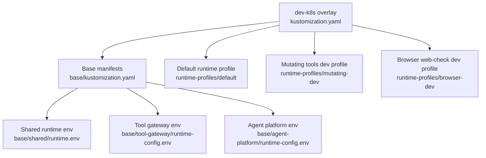
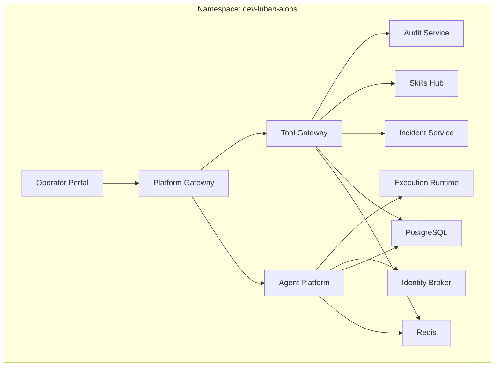
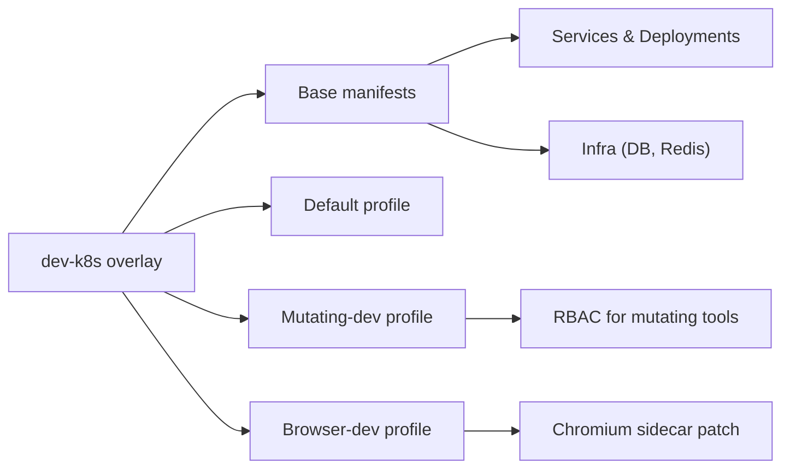
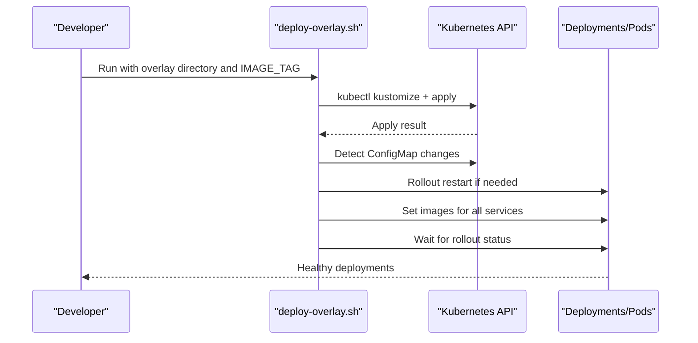

# Environment-Specific Overlays

<cite>
**Referenced Files in This Document**
- [kustomization.yaml](file://shared/platform-ops/gitops/dev-k8s/kustomization.yaml)
- [base kustomization.yaml](file://shared/platform-ops/gitops/dev-k8s/base/kustomization.yaml)
- [runtime.env](file://shared/platform-ops/gitops/dev-k8s/base/shared/runtime.env)
- [tool-gateway runtime-config.env](file://shared/platform-ops/gitops/dev-k8s/base/tool-gateway/runtime-config.env)
- [agent-platform runtime-config.env](file://shared/platform-ops/gitops/dev-k8s/base/agent-platform/runtime-config.env)
- [default profile kustomization.yaml](file://shared/platform-ops/gitops/runtime-profiles/default/kustomization.yaml)
- [default profile configmap.yaml](file://shared/platform-ops/gitops/runtime-profiles/default/configmap.yaml)
- [mutating-dev kustomization.yaml](file://shared/platform-ops/gitops/runtime-profiles/mutating-dev/kustomization.yaml)
- [mutating.env](file://shared/platform-ops/gitops/runtime-profiles/mutating-dev/mutating.env)
- [browser-dev kustomization.yaml](file://shared/platform-ops/gitops/runtime-profiles/browser-dev/kustomization.yaml)
- [browser.env](file://shared/platform-ops/gitops/runtime-profiles/browser-dev/browser.env)
- [deploy-overlay.sh](file://shared/platform-ops/gitops/deploy-overlay.sh)
- [runtime profiles README.md](file://shared/platform-ops/gitops/runtime-profiles/README.md)
</cite>

## Table of Contents
1. [Introduction](#introduction)
2. [Project Structure](#project-structure)
3. [Core Components](#core-components)
4. [Architecture Overview](#architecture-overview)
5. [Detailed Component Analysis](#detailed-component-analysis)
6. [Dependency Analysis](#dependency-analysis)
7. [Performance Considerations](#performance-considerations)
8. [Troubleshooting Guide](#troubleshooting-guide)
9. [Conclusion](#conclusion)
10. [Appendices](#appendices)

## Introduction
This document explains the environment-specific Kustomize overlays used to deploy the Luban AIOps platform. It focuses on:
- The development overlay configuration, including debug and feature flags, resource posture, and local development tooling.
- How staging and production overlays differ conceptually from dev (scaling, security, performance).
- Runtime profiles for specialized environments such as browser-dev and mutating-dev.
- Environment variable management, secret injection, and configuration differentiation across environments.
- Deployment validation, testing strategies, promotion workflows between environments, rollback procedures, and emergency response configurations.

The overlays are centered around a base set of Kubernetes manifests and a dev-k8s overlay that composes multiple runtime profiles. Secrets and sensitive values are provisioned by scripts and never committed to version control.

**Section sources**
- [runtime profiles README.md:1-57](file://shared/platform-ops/gitops/runtime-profiles/README.md#L1-L57)

## Project Structure
The deployment is organized as a layered Kustomize composition:
- Base manifests define services, deployments, services, RBAC, and shared ConfigMaps for the entire platform.
- The dev-k8s overlay composes the base with one or more runtime profiles and merges environment variables into a single runtime ConfigMap.
- Runtime profiles encapsulate optional capabilities (e.g., browser web-check tools, mutating tools) and default LLM provider settings.

**Diagram sources**
- [kustomization.yaml:1-22](file://shared/platform-ops/gitops/dev-k8s/kustomization.yaml#L1-L22)
- [base kustomization.yaml:1-72](file://shared/platform-ops/gitops/dev-k8s/base/kustomization.yaml#L1-L72)

**Section sources**
- [kustomization.yaml:1-22](file://shared/platform-ops/gitops/dev-k8s/kustomization.yaml#L1-L22)
- [base kustomization.yaml:1-72](file://shared/platform-ops/gitops/dev-k8s/base/kustomization.yaml#L1-L72)

## Core Components
- Development overlay root: Composes base resources and runtime profiles; merges environment variables into a unified ConfigMap; applies strategic patches (e.g., sidecar for browser tools).
- Base layer: Declares all core platform components and their service endpoints; generates a shared runtime ConfigMap from per-service env files; includes infrastructure (Redis, Postgres), gateways, agent platform, operator portal, and auxiliary services.
- Runtime profiles:
  - Default: Provides the active LLM provider profile via a ConfigMap (e.g., provider, model name, base URL).
  - Mutating-dev: Enables bounded mutating tools in dev by merging an environment flag and applying RBAC for pod deletion.
  - Browser-dev: Enables browser web-check tools in dev by merging environment flags, adding a sample target app, and patching the tool-gateway Deployment to include a Chromium sidecar.

Environment variables are consolidated into a single runtime ConfigMap consumed by services through envFrom or mounts. Secrets are provisioned separately by sync scripts and mounted as Secrets.

**Section sources**
- [base kustomization.yaml:1-72](file://shared/platform-ops/gitops/dev-k8s/base/kustomization.yaml#L1-L72)
- [default profile kustomization.yaml:1-5](file://shared/platform-ops/gitops/runtime-profiles/default/kustomization.yaml#L1-L5)
- [default profile configmap.yaml:1-11](file://shared/platform-ops/gitops/runtime-profiles/default/configmap.yaml#L1-L11)
- [mutating-dev kustomization.yaml:1-22](file://shared/platform-ops/gitops/runtime-profiles/mutating-dev/kustomization.yaml#L1-L22)
- [browser-dev kustomization.yaml:1-29](file://shared/platform-ops/gitops/runtime-profiles/browser-dev/kustomization.yaml#L1-L29)

## Architecture Overview
The dev overlay composes a common base with optional runtime profiles. The resulting manifest set is applied to a dedicated namespace. Services communicate over cluster-internal DNS using Service URLs configured in environment variables. Observability is enabled via OpenTelemetry exporters pointing at a cluster-local endpoint.

[No sources needed since this diagram shows conceptual workflow, not actual code structure]

## Detailed Component Analysis

### Development Overlay Configuration
- Namespace: All resources are deployed under a dedicated namespace.
- Resource composition: The overlay references the base and multiple runtime profiles.
- Environment aggregation: A ConfigMap generator merges per-service env files plus profile env files into a single runtime ConfigMap.
- Strategic patches: The overlay applies a patch to add a browser sidecar to the tool-gateway Deployment when the browser-dev profile is included.

Key behaviors:
- Debug and feature flags are controlled via environment variables in the merged ConfigMap.
- Mutating tools and browser tools are disabled by default in the base and opt-in via profiles.
- Observability is enabled by default in shared runtime env.

**Section sources**
- [kustomization.yaml:1-22](file://shared/platform-ops/gitops/dev-k8s/kustomization.yaml#L1-L22)
- [base kustomization.yaml:1-72](file://shared/platform-ops/gitops/dev-k8s/base/kustomization.yaml#L1-L72)
- [runtime.env:1-12](file://shared/platform-ops/gitops/dev-k8s/base/shared/runtime.env#L1-L12)

### Runtime Profiles

#### Default Profile (LLM Provider)
- Supplies a ConfigMap with the active LLM provider profile (provider, model name, base URL).
- Decouples provider selection from directory choice; the same profile can be reused with different providers.

**Section sources**
- [default profile kustomization.yaml:1-5](file://shared/platform-ops/gitops/runtime-profiles/default/kustomization.yaml#L1-L5)
- [default profile configmap.yaml:1-11](file://shared/platform-ops/gitops/runtime-profiles/default/configmap.yaml#L1-L11)

#### Mutating-Dev Profile
- Merges an environment flag enabling bounded mutating tools.
- Applies RBAC required for the pod-delete mutating tool.
- Keeps the base deny-by-default posture unless explicitly opted in.

**Section sources**
- [mutating-dev kustomization.yaml:1-22](file://shared/platform-ops/gitops/runtime-profiles/mutating-dev/kustomization.yaml#L1-L22)
- [mutating.env:1-4](file://shared/platform-ops/gitops/runtime-profiles/mutating-dev/mutating.env#L1-L4)
- [tool-gateway runtime-config.env:1-67](file://shared/platform-ops/gitops/dev-k8s/base/tool-gateway/runtime-config.env#L1-L67)

#### Browser-Dev Profile
- Merges environment flags enabling browser web-check tools, CDP endpoint, origin allowlist, and credential sets path.
- Adds a sample browser-check target application and network policy.
- Patches the tool-gateway Deployment to include a Chromium sidecar.

**Section sources**
- [browser-dev kustomization.yaml:1-29](file://shared/platform-ops/gitops/runtime-profiles/browser-dev/kustomization.yaml#L1-L29)
- [browser.env:1-11](file://shared/platform-ops/gitops/runtime-profiles/browser-dev/browser.env#L1-L11)
- [kustomization.yaml:1-22](file://shared/platform-ops/gitops/dev-k8s/kustomization.yaml#L1-L22)

### Environment Variable Management and Secret Injection
- Environment variables:
  - Shared runtime env enables observability and defines broker endpoints.
  - Per-service env files define service-specific configuration (e.g., gateway features, database URLs, worker endpoints).
  - Profile env files merge additional flags for browser and mutating tools.
- Secrets:
  - Secrets are provisioned by sync scripts and mounted into pods; they are not committed to version control.
  - Examples include OTLP headers, audit ingest credentials, execution handoff tokens, incident and skills client secrets, and browser credentials.

Operational notes:
- Changes to environment ConfigMaps trigger rolling restarts of relevant deployments to pick up new values.
- Image updates are applied after rendering and applying the overlay.

**Section sources**
- [runtime.env:1-12](file://shared/platform-ops/gitops/dev-k8s/base/shared/runtime.env#L1-L12)
- [tool-gateway runtime-config.env:1-67](file://shared/platform-ops/gitops/dev-k8s/base/tool-gateway/runtime-config.env#L1-L67)
- [agent-platform runtime-config.env:1-50](file://shared/platform-ops/gitops/dev-k8s/base/agent-platform/runtime-config.env#L1-L50)
- [deploy-overlay.sh:1-108](file://shared/platform-ops/gitops/deploy-overlay.sh#L1-L108)

### Deployment Validation and Testing Strategies
- Render-only validation: Use kustomize render to validate overlay correctness before applying.
- Apply and rollout status: The deployment script applies rendered manifests and waits for rollout status of each deployment.
- ConfigMap change detection: If environment/policy ConfigMaps change, the script restarts affected deployments to ensure new values take effect.
- Feature gating verification: Confirm that mutating and browser tools remain disabled unless their respective profiles are included.

**Section sources**
- [deploy-overlay.sh:1-108](file://shared/platform-ops/gitops/deploy-overlay.sh#L1-L108)

### Promotion Workflows Between Environments
- Conceptual flow:
  - Develop in dev overlay with runtime profiles enabled as needed.
  - Promote changes to staging by selecting a staging overlay that pins images and tightens security/performance knobs.
  - Promote to production by selecting a production overlay with hardened policies, scaling, and strict access controls.
- Best practices:
  - Keep overlays immutable per environment; pin images and versions.
  - Use separate namespaces per environment.
  - Provision secrets via CI/CD pipelines per environment.
  - Validate with render-only and dry-run steps before apply.

[No sources needed since this section provides general guidance]

### Rollback Procedures and Emergency Response
- Rollback options:
  - Reapply a previous overlay commit to revert configuration and images.
  - Use image rollback by setting previous IMAGE_TAG values and reapplying.
  - Restart specific deployments if only environment variables changed.
- Emergency response:
  - Disable risky features quickly by removing or adjusting profile env flags (e.g., disabling browser or mutating tools).
  - Scale down or isolate affected services by editing replicas or network policies temporarily.
  - Revert recent ConfigMap changes and restart impacted deployments.

[No sources needed since this section provides general guidance]

## Dependency Analysis
The dev overlay depends on:
- Base manifests for all platform components.
- Runtime profiles for optional capabilities and LLM provider settings.
- Sync scripts for provisioning secrets and databases.

**Diagram sources**
- [kustomization.yaml:1-22](file://shared/platform-ops/gitops/dev-k8s/kustomization.yaml#L1-L22)
- [base kustomization.yaml:1-72](file://shared/platform-ops/gitops/dev-k8s/base/kustomization.yaml#L1-L72)
- [mutating-dev kustomization.yaml:1-22](file://shared/platform-ops/gitops/runtime-profiles/mutating-dev/kustomization.yaml#L1-L22)
- [browser-dev kustomization.yaml:1-29](file://shared/platform-ops/gitops/runtime-profiles/browser-dev/kustomization.yaml#L1-L29)

**Section sources**
- [kustomization.yaml:1-22](file://shared/platform-ops/gitops/dev-k8s/kustomization.yaml#L1-L22)
- [base kustomization.yaml:1-72](file://shared/platform-ops/gitops/dev-k8s/base/kustomization.yaml#L1-L72)

## Performance Considerations
- Observability: Enabled by default in shared runtime env; ensure exporter endpoints are reachable and tuned for your backend.
- Database connectivity: Ensure Postgres and Redis are sized appropriately for dev workloads; verify connection strings and timeouts.
- Feature toggles: Keep mutating and browser tools disabled unless necessary to reduce attack surface and resource usage.
- Scaling: In staging/production, adjust replica counts, resource requests/limits, and autoscaling policies per service needs.

[No sources needed since this section provides general guidance]

## Troubleshooting Guide
Common issues and resolutions:
- ConfigMap changes not taking effect: Restart affected deployments; the deployment script detects ConfigMap changes and performs rollouts automatically.
- Missing secrets: Ensure sync scripts have provisioned required secrets (audit, execution handoff, incidents, skills, OTLP headers, browser credentials).
- Browser tools not working: Verify browser-dev profile is included, CDP endpoint is reachable, origins are allowed, and sidecar is present.
- Mutating tools blocked: Confirm mutating-dev profile is included, RBAC is applied, and policy grants exist; ensure HITL timeout is configured where required.

Validation tips:
- Render-only checks with kustomize.
- Inspect rendered ConfigMaps and Deployments for correct env values and patches.
- Check rollout status and logs for failures.

**Section sources**
- [deploy-overlay.sh:1-108](file://shared/platform-ops/gitops/deploy-overlay.sh#L1-L108)
- [tool-gateway runtime-config.env:1-67](file://shared/platform-ops/gitops/dev-k8s/base/tool-gateway/runtime-config.env#L1-L67)
- [browser.env:1-11](file://shared/platform-ops/gitops/runtime-profiles/browser-dev/browser.env#L1-L11)
- [mutating.env:1-4](file://shared/platform-ops/gitops/runtime-profiles/mutating-dev/mutating.env#L1-L4)

## Conclusion
The Kustomize overlays provide a modular, secure, and testable way to configure the Luban AIOps platform across environments. The dev overlay composes a robust base with optional runtime profiles for specialized capabilities like browser web-checks and bounded mutating tools. Secrets and sensitive configuration are managed out-of-band, ensuring safe separation of concerns. Staging and production overlays should build on these patterns with stricter security, performance tuning, and scaling policies. Operational scripts streamline deployment, validation, and rollout management, while clear feature gates enable rapid rollback and emergency response.

[No sources needed since this section summarizes without analyzing specific files]

## Appendices

### Environment Variables Reference
- Shared runtime env: Observability and broker endpoints.
- Tool gateway env: Feature flags for mutating and browser tools, service URLs, and client IDs.
- Agent platform env: Worker endpoints, session store configuration, and integration URLs.
- Profile env: Flags enabling browser and mutating tools in dev.

**Section sources**
- [runtime.env:1-12](file://shared/platform-ops/gitops/dev-k8s/base/shared/runtime.env#L1-L12)
- [tool-gateway runtime-config.env:1-67](file://shared/platform-ops/gitops/dev-k8s/base/tool-gateway/runtime-config.env#L1-L67)
- [agent-platform runtime-config.env:1-50](file://shared/platform-ops/gitops/dev-k8s/base/agent-platform/runtime-config.env#L1-L50)
- [browser.env:1-11](file://shared/platform-ops/gitops/runtime-profiles/browser-dev/browser.env#L1-L11)
- [mutating.env:1-4](file://shared/platform-ops/gitops/runtime-profiles/mutating-dev/mutating.env#L1-L4)

### Deployment Workflow Sequence

**Diagram sources**
- [deploy-overlay.sh:1-108](file://shared/platform-ops/gitops/deploy-overlay.sh#L1-L108)