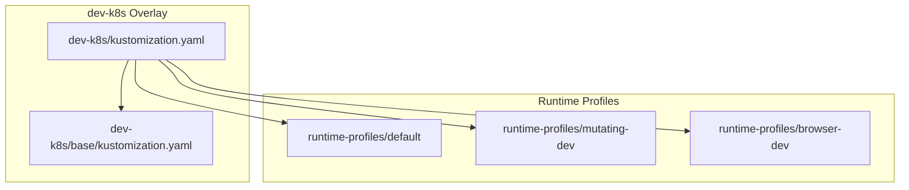
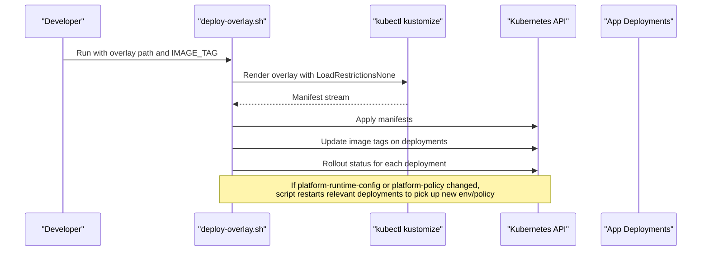
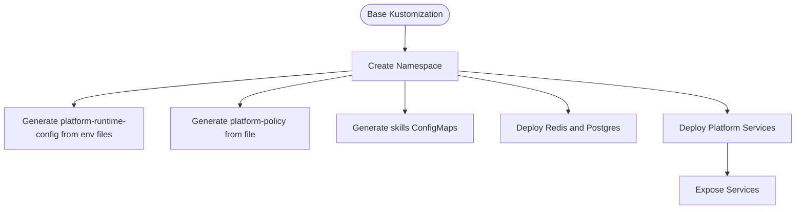
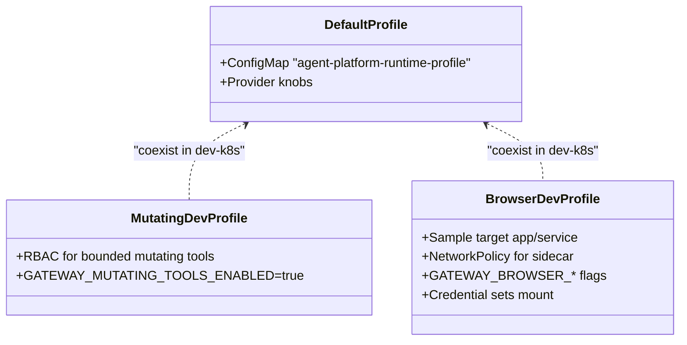
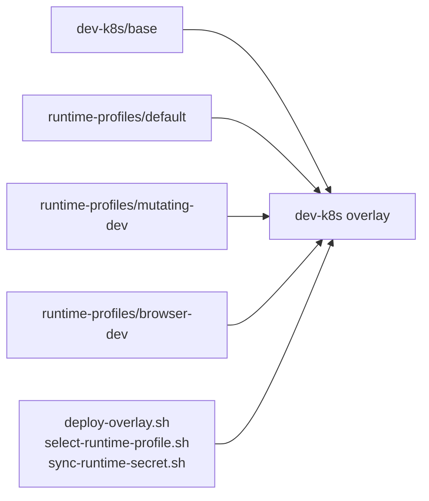

# GitOps Deployment with Kustomize

<cite>
**Referenced Files in This Document**
- [README.md](file://shared/platform-ops/README.md)
- [kustomization.yaml](file://shared/platform-ops/gitops/dev-k8s/kustomization.yaml)
- [base kustomization.yaml](file://shared/platform-ops/gitops/dev-k8s/base/kustomization.yaml)
- [runtime profiles README.md](file://shared/platform-ops/gitops/runtime-profiles/README.md)
- [default profile kustomization.yaml](file://shared/platform-ops/gitops/runtime-profiles/default/kustomization.yaml)
- [default profile configmap.yaml](file://shared/platform-ops/gitops/runtime-profiles/default/configmap.yaml)
- [mutating-dev kustomization.yaml](file://shared/platform-ops/gitops/runtime-profiles/mutating-dev/kustomization.yaml)
- [mutating-dev env](file://shared/platform-ops/gitops/runtime-profiles/mutating-dev/mutating.env)
- [browser-dev kustomization.yaml](file://shared/platform-ops/gitops/runtime-profiles/browser-dev/kustomization.yaml)
- [browser-dev env](file://shared/platform-ops/gitops/runtime-profiles/browser-dev/browser.env)
- [deploy-overlay.sh](file://shared/platform-ops/gitops/deploy-overlay.sh)
- [select-runtime-profile.sh](file://shared/platform-ops/gitops/select-runtime-profile.sh)
- [sync-runtime-secret.sh](file://shared/platform-ops/gitops/sync-runtime-secret.sh)
</cite>

## Table of Contents
1. [Introduction](#introduction)
2. [Project Structure](#project-structure)
3. [Core Components](#core-components)
4. [Architecture Overview](#architecture-overview)
5. [Detailed Component Analysis](#detailed-component-analysis)
6. [Dependency Analysis](#dependency-analysis)
7. [Performance Considerations](#performance-considerations)
8. [Troubleshooting Guide](#troubleshooting-guide)
9. [Conclusion](#conclusion)
10. [Appendices](#appendices)

## Introduction
This document explains the GitOps deployment model for the platform using Kustomize overlays under shared/platform-ops/gitops/. It covers how base configurations are separated from environment-specific overlays, how runtime profiles configure execution postures (including browser-dev and mutating-dev), and how Kubernetes resources, namespaces, service discovery, secrets, ConfigMaps, and environment variables are managed. It also documents deployment automation scripts, rollback procedures, validation steps, monitoring/logging considerations, health checks, troubleshooting guidance, and performance tuning recommendations.

## Project Structure
The GitOps configuration is organized around a durable dev-k8s overlay that composes:
- A base layer containing all product and infrastructure manifests.
- Runtime profile overlays that add or modify behavior without changing base manifests.
- Environment-specific overlays (currently focused on development; staging and production follow the same pattern).



**Diagram sources**
- [kustomization.yaml:1-22](file://shared/platform-ops/gitops/dev-k8s/kustomization.yaml#L1-L22)
- [base kustomization.yaml:1-72](file://shared/platform-ops/gitops/dev-k8s/base/kustomization.yaml#L1-L72)
- [runtime profiles README.md:1-57](file://shared/platform-ops/gitops/runtime-profiles/README.md#L1-L57)

**Section sources**
- [README.md:1-47](file://shared/platform-ops/README.md#L1-L47)
- [kustomization.yaml:1-22](file://shared/platform-ops/gitops/dev-k8s/kustomization.yaml#L1-L22)
- [base kustomization.yaml:1-72](file://shared/platform-ops/gitops/dev-k8s/base/kustomization.yaml#L1-L72)
- [runtime profiles README.md:1-57](file://shared/platform-ops/gitops/runtime-profiles/README.md#L1-L57)

## Core Components
- Base layer: Declares namespace, services, deployments, RBAC, and generates ConfigMaps for runtime configuration and policy. It also includes sample skill content and database init SQL.
- Runtime profiles:
  - default: Provides an agent-platform runtime profile ConfigMap with provider/model metadata.
  - mutating-dev: Enables bounded mutating tools posture via environment flags and RBAC for pod deletion.
  - browser-dev: Enables browser web-check posture by adding a sidecar patch, a sample target app, network policy, and environment flags.
- Automation:
  - deploy-overlay.sh: Renders and applies Kustomize overlays, updates images, restarts pods when ConfigMaps change, and waits for rollouts.
  - select-runtime-profile.sh: Rewrites dev-k8s overlay to switch the active LLM runtime profile while preserving committed dev postures.
  - sync-runtime-secret.sh: Syncs per-profile secret files into a Kubernetes Secret.

**Section sources**
- [base kustomization.yaml:1-72](file://shared/platform-ops/gitops/dev-k8s/base/kustomization.yaml#L1-L72)
- [default profile kustomization.yaml:1-5](file://shared/platform-ops/gitops/runtime-profiles/default/kustomization.yaml#L1-L5)
- [default profile configmap.yaml:1-11](file://shared/platform-ops/gitops/runtime-profiles/default/configmap.yaml#L1-L11)
- [mutating-dev kustomization.yaml:1-22](file://shared/platform-ops/gitops/runtime-profiles/mutating-dev/kustomization.yaml#L1-L22)
- [mutating-dev env:1-4](file://shared/platform-ops/gitops/runtime-profiles/mutating-dev/mutating.env#L1-L4)
- [browser-dev kustomization.yaml:1-29](file://shared/platform-ops/gitops/runtime-profiles/browser-dev/kustomization.yaml#L1-L29)
- [browser-dev env:1-11](file://shared/platform-ops/gitops/runtime-profiles/browser-dev/browser.env#L1-L11)
- [deploy-overlay.sh:1-108](file://shared/platform-ops/gitops/deploy-overlay.sh#L1-L108)
- [select-runtime-profile.sh:1-55](file://shared/platform-ops/gitops/select-runtime-profile.sh#L1-L55)
- [sync-runtime-secret.sh:1-29](file://shared/platform-ops/gitops/sync-runtime-secret.sh#L1-L29)

## Architecture Overview
The dev-k8s overlay composes base resources with runtime profiles to produce a complete Kubernetes manifest set. The base defines the namespace and all platform services. Runtime profiles contribute environment flags and optional features like browser tooling or mutating tool access. The deployment script applies the rendered output, updates container images, restarts workloads when configuration changes occur, and validates rollout status.



**Diagram sources**
- [deploy-overlay.sh:1-108](file://shared/platform-ops/gitops/deploy-overlay.sh#L1-L108)
- [kustomization.yaml:1-22](file://shared/platform-ops/gitops/dev-k8s/kustomization.yaml#L1-L22)

## Detailed Component Analysis

### Base Layer: Namespace, Services, and ConfigMaps
- Namespace isolation: The base declares the target namespace for all platform components.
- Service discovery: Each service has a corresponding Service resource exposing stable DNS names within the namespace.
- ConfigMaps:
  - platform-runtime-config aggregates runtime environment variables from multiple env files across products and profiles.
  - platform-policy holds policy data consumed by services.
  - skills-sre-alerting and skills-platform-runbooks package sample skill content as ConfigMaps with flattened keys for mounting.
- Infrastructure: Includes Redis and Postgres StatefulSet/Service definitions and database initialization SQL.



**Diagram sources**
- [base kustomization.yaml:1-72](file://shared/platform-ops/gitops/dev-k8s/base/kustomization.yaml#L1-L72)

**Section sources**
- [base kustomization.yaml:1-72](file://shared/platform-ops/gitops/dev-k8s/base/kustomization.yaml#L1-L72)

### Runtime Profiles: Default, Mutating-Dev, Browser-Dev
- Default profile:
  - Adds a ConfigMap defining the agent-platform runtime profile label, provider, model name, and base URL.
- Mutating-Dev profile:
  - Adds RBAC enabling bounded mutating tools (e.g., pod deletion) and sets GATEWAY_MUTATING_TOOLS_ENABLED=true via merging into platform-runtime-config.
- Browser-Dev profile:
  - Adds a sample browser-check target application and service, a network policy for the sidecar, and environment flags enabling browser tools with a deny-by-default origin allowlist.
  - The dev-k8s overlay patches the tool-gateway Deployment to include a chromium-headless-shell sidecar and mounts credential sets.



**Diagram sources**
- [default profile configmap.yaml:1-11](file://shared/platform-ops/gitops/runtime-profiles/default/configmap.yaml#L1-L11)
- [mutating-dev kustomization.yaml:1-22](file://shared/platform-ops/gitops/runtime-profiles/mutating-dev/kustomization.yaml#L1-L22)
- [mutating-dev env:1-4](file://shared/platform-ops/gitops/runtime-profiles/mutating-dev/mutating.env#L1-L4)
- [browser-dev kustomization.yaml:1-29](file://shared/platform-ops/gitops/runtime-profiles/browser-dev/kustomization.yaml#L1-L29)
- [browser-dev env:1-11](file://shared/platform-ops/gitops/runtime-profiles/browser-dev/browser.env#L1-L11)
- [kustomization.yaml:1-22](file://shared/platform-ops/gitops/dev-k8s/kustomization.yaml#L1-L22)

**Section sources**
- [runtime profiles README.md:1-57](file://shared/platform-ops/gitops/runtime-profiles/README.md#L1-L57)
- [default profile kustomization.yaml:1-5](file://shared/platform-ops/gitops/runtime-profiles/default/kustomization.yaml#L1-L5)
- [default profile configmap.yaml:1-11](file://shared/platform-ops/gitops/runtime-profiles/default/configmap.yaml#L1-L11)
- [mutating-dev kustomization.yaml:1-22](file://shared/platform-ops/gitops/runtime-profiles/mutating-dev/kustomization.yaml#L1-L22)
- [mutating-dev env:1-4](file://shared/platform-ops/gitops/runtime-profiles/mutating-dev/mutating.env#L1-L4)
- [browser-dev kustomization.yaml:1-29](file://shared/platform-ops/gitops/runtime-profiles/browser-dev/kustomization.yaml#L1-L29)
- [browser-dev env:1-11](file://shared/platform-ops/gitops/runtime-profiles/browser-dev/browser.env#L1-L11)
- [kustomization.yaml:1-22](file://shared/platform-ops/gitops/dev-k8s/kustomization.yaml#L1-L22)

### Development, Staging, and Production Profiles
- Development (dev-k8s):
  - Composed overlay including base plus default, mutating-dev, and browser-dev profiles.
  - Uses namespace dev-luban-aiops and merges environment variables from profile env files into platform-runtime-config.
- Staging and Production:
  - Follow the same Kustomize pattern: create environment overlays referencing base and selecting appropriate runtime profiles.
  - Replace dev-only features (e.g., browser-dev, mutating-dev) with hardened profiles and restrict feature flags accordingly.
  - Use separate namespaces and stricter policies per environment.

[No sources needed since this section generalizes the pattern beyond the current dev-k8s implementation]

### Kubernetes Resource Management, Namespace Isolation, and Service Discovery
- Namespace isolation: All resources are scoped to the overlay’s namespace (dev-luban-aiops in dev).
- Service discovery: Each service exposes a stable DNS name within the namespace; applications reference these names for inter-service communication.
- RBAC: Platform and tool gateway RBAC are declared in the base layer to enforce least privilege.

**Section sources**
- [base kustomization.yaml:1-72](file://shared/platform-ops/gitops/dev-k8s/base/kustomization.yaml#L1-L72)

### Secrets, ConfigMaps, and Environment Variable Injection
- ConfigMaps:
  - platform-runtime-config aggregates runtime environment variables from base env files and profile env files.
  - platform-policy provides policy data.
  - Skill content is packaged into dedicated ConfigMaps with flattened keys for mounting.
- Secrets:
  - Per-profile secrets are synced via sync-runtime-secret.sh into a Kubernetes Secret referenced by the agent platform.
  - Additional secret sync scripts exist for audit, incidents, sessions DB, skills, OTel, delegation, execution signing/handoff, and browser credentials.
- Environment variable injection:
  - Services consume environment variables through envFrom or mounted ConfigMaps/Secrets.
  - Changes to platform-runtime-config or platform-policy trigger automatic restarts of relevant deployments to apply new values.

**Section sources**
- [base kustomization.yaml:1-72](file://shared/platform-ops/gitops/dev-k8s/base/kustomization.yaml#L1-L72)
- [deploy-overlay.sh:63-76](file://shared/platform-ops/gitops/deploy-overlay.sh#L63-L76)
- [sync-runtime-secret.sh:1-29](file://shared/platform-ops/gitops/sync-runtime-secret.sh#L1-L29)

### Deployment Automation Scripts
- deploy-overlay.sh:
  - Validates inputs and resolves overlay directory.
  - Loads image state if present and constructs image references.
  - Renders Kustomize with LoadRestrictionsNone to include external skill content.
  - Applies manifests and updates image tags on all deployments.
  - Detects ConfigMap changes and restarts affected deployments to pick up new environment/policy values.
  - Waits for rollout status of all deployments.
- select-runtime-profile.sh:
  - Prevents switching committed dev postures (mutating-dev, browser-dev).
  - Rewrites dev-k8s overlay to select the requested LLM runtime profile while preserving dev postures.
- sync-runtime-secret.sh:
  - Creates or updates a generic Secret from a per-profile .env file.

**Section sources**
- [deploy-overlay.sh:1-108](file://shared/platform-ops/gitops/deploy-overlay.sh#L1-L108)
- [select-runtime-profile.sh:1-55](file://shared/platform-ops/gitops/select-runtime-profile.sh#L1-L55)
- [sync-runtime-secret.sh:1-29](file://shared/platform-ops/gitops/sync-runtime-secret.sh#L1-L29)

### Rollback Procedures
- Image rollback:
  - Re-run deploy-overlay.sh with a previous IMAGE_TAG to revert all deployments to the prior image version.
- Configuration rollback:
  - Revert changes to overlay files and reapply to restore previous ConfigMaps and patches.
- Partial rollback:
  - Use kubectl rollout undo on specific deployments if only one component needs reverting.
- Validation after rollback:
  - Confirm rollout status and verify endpoints respond as expected.

[No sources needed since this section provides operational guidance based on the deployment workflow]

### Validation Steps
- Pre-deploy:
  - Ensure IMAGE_TAG is set and images are built.
  - Verify overlay path exists and is correct.
- Post-deploy:
  - Check rollout status for all deployments.
  - Validate that platform-runtime-config and platform-policy were applied and pods restarted when necessary.
  - Confirm service endpoints are reachable within the namespace.

**Section sources**
- [deploy-overlay.sh:41-44](file://shared/platform-ops/gitops/deploy-overlay.sh#L41-L44)
- [deploy-overlay.sh:97-105](file://shared/platform-ops/gitops/deploy-overlay.sh#L97-L105)

### Monitoring, Logging, and Health Checks
- Monitoring and logging:
  - OTel-related secret synchronization scripts indicate observability integration points.
  - Policy and runtime configuration are centralized in ConfigMaps for consistent behavior across environments.
- Health check endpoints:
  - Services expose standard HTTP endpoints; validate readiness/liveness via kubectl exec or curl within the cluster.
  - Use rollout status and service reachability checks to confirm health.

**Section sources**
- [base kustomization.yaml:1-72](file://shared/platform-ops/gitops/dev-k8s/base/kustomization.yaml#L1-L72)

### Troubleshooting Guidance
- Common issues:
  - Missing IMAGE_TAG: deploy-overlay.sh requires IMAGE_TAG; build images first or export the tag.
  - Unknown overlay directory: Ensure the overlay path exists relative to the script location.
  - ConfigMap not taking effect: Restart affected deployments; the script handles this automatically when it detects changes.
  - Profile selection errors: select-runtime-profile.sh rejects non-switchable profiles; use supported LLM profiles.
  - Secrets missing: Ensure per-profile secret files exist before syncing; CI can inject secrets directly.
- Diagnostic steps:
  - Inspect rollout status and events for failing deployments.
  - Verify ConfigMaps and Secrets exist in the target namespace.
  - Check service endpoints and network policies for connectivity issues.

**Section sources**
- [deploy-overlay.sh:10-23](file://shared/platform-ops/gitops/deploy-overlay.sh#L10-L23)
- [deploy-overlay.sh:41-44](file://shared/platform-ops/gitops/deploy-overlay.sh#L41-L44)
- [select-runtime-profile.sh:9-25](file://shared/platform-ops/gitops/select-runtime-profile.sh#L9-L25)
- [sync-runtime-secret.sh:10-22](file://shared/platform-ops/gitops/sync-runtime-secret.sh#L10-L22)

### Performance Tuning Recommendations
- Resource requests/limits:
  - Tune CPU/memory requests and limits on deployments based on observed usage.
- Replicas:
  - Increase replicas for high-throughput services like platform-gateway and tool-gateway.
- ConfigMap/Secret size:
  - Keep ConfigMaps and Secrets minimal to reduce pod startup overhead.
- Sidecars:
  - Monitor sidecar impact (e.g., browser sidecar) and adjust resources accordingly.
- Database and cache:
  - Ensure Postgres and Redis have adequate resources and proper persistence settings.

[No sources needed since this section provides general guidance]

## Dependency Analysis
The dev-k8s overlay depends on:
- Base resources for all platform services and infrastructure.
- Runtime profiles for environment-specific behavior.
- Automation scripts for applying manifests, updating images, and syncing secrets.



**Diagram sources**
- [kustomization.yaml:1-22](file://shared/platform-ops/gitops/dev-k8s/kustomization.yaml#L1-L22)
- [base kustomization.yaml:1-72](file://shared/platform-ops/gitops/dev-k8s/base/kustomization.yaml#L1-L72)
- [default profile kustomization.yaml:1-5](file://shared/platform-ops/gitops/runtime-profiles/default/kustomization.yaml#L1-L5)
- [mutating-dev kustomization.yaml:1-22](file://shared/platform-ops/gitops/runtime-profiles/mutating-dev/kustomization.yaml#L1-L22)
- [browser-dev kustomization.yaml:1-29](file://shared/platform-ops/gitops/runtime-profiles/browser-dev/kustomization.yaml#L1-L29)
- [deploy-overlay.sh:1-108](file://shared/platform-ops/gitops/deploy-overlay.sh#L1-L108)
- [select-runtime-profile.sh:1-55](file://shared/platform-ops/gitops/select-runtime-profile.sh#L1-L55)
- [sync-runtime-secret.sh:1-29](file://shared/platform-ops/gitops/sync-runtime-secret.sh#L1-L29)

**Section sources**
- [kustomization.yaml:1-22](file://shared/platform-ops/gitops/dev-k8s/kustomization.yaml#L1-L22)
- [base kustomization.yaml:1-72](file://shared/platform-ops/gitops/dev-k8s/base/kustomization.yaml#L1-L72)
- [deploy-overlay.sh:1-108](file://shared/platform-ops/gitops/deploy-overlay.sh#L1-L108)
- [select-runtime-profile.sh:1-55](file://shared/platform-ops/gitops/select-runtime-profile.sh#L1-L55)
- [sync-runtime-secret.sh:1-29](file://shared/platform-ops/gitops/sync-runtime-secret.sh#L1-L29)

## Performance Considerations
- Prefer minimal ConfigMaps and Secrets to reduce pod startup time.
- Use horizontal scaling for stateless services behind gateways.
- Monitor sidecar resource usage and tune accordingly.
- Ensure database and cache resources match workload demands.
- Avoid frequent ConfigMap churn; batch changes and rely on automatic restarts when detected.

[No sources needed since this section provides general guidance]

## Troubleshooting Guide
- Verify overlay path and IMAGE_TAG before deploying.
- Check rollout status and events for failures.
- Confirm ConfigMaps and Secrets exist and contain expected keys.
- Validate service endpoints and network policies.
- Use selective rollout restarts if only specific services need reapplication of configuration.

**Section sources**
- [deploy-overlay.sh:10-23](file://shared/platform-ops/gitops/deploy-overlay.sh#L10-L23)
- [deploy-overlay.sh:97-105](file://shared/platform-ops/gitops/deploy-overlay.sh#L97-L105)
- [select-runtime-profile.sh:9-25](file://shared/platform-ops/gitops/select-runtime-profile.sh#L9-L25)
- [sync-runtime-secret.sh:10-22](file://shared/platform-ops/gitops/sync-runtime-secret.sh#L10-L22)

## Conclusion
The GitOps deployment model leverages Kustomize overlays to cleanly separate base platform resources from environment-specific behaviors. The dev-k8s overlay composes base manifests with runtime profiles to enable controlled feature toggles such as browser web-checks and bounded mutating tools. Automation scripts streamline deployment, image updates, configuration propagation, and validation. Following the outlined procedures ensures reliable rollouts, straightforward rollbacks, and robust troubleshooting for platform operations.

## Appendices

### Appendix A: Directory Tree Overview
```
shared/platform-ops/gitops/
├── dev-k8s/
│   ├── base/                          # Base manifests and generated ConfigMaps
│   ├── kustomization.yaml             # Dev overlay composition
│   └── deploy.sh                      # Local dev deployment helper
├── runtime-profiles/
│   ├── default/                       # Agent platform runtime profile
│   ├── mutating-dev/                  # Bounded mutating tools posture
│   └── browser-dev/                   # Browser web-check posture
├── deploy-overlay.sh                  # Main deployment automation
├── select-runtime-profile.sh          # Switch LLM runtime profile
└── sync-*.sh                          # Secret and data sync helpers
```

[No sources needed since this section summarizes structure already covered]