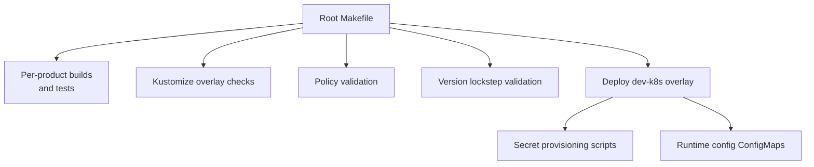
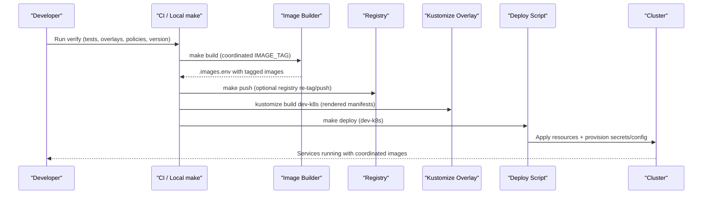
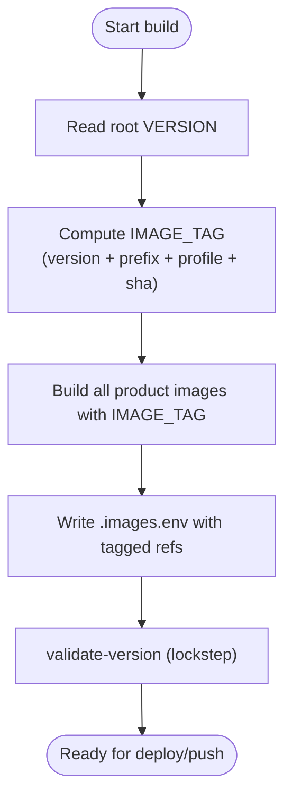
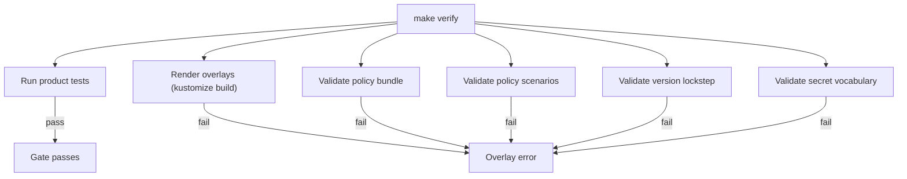
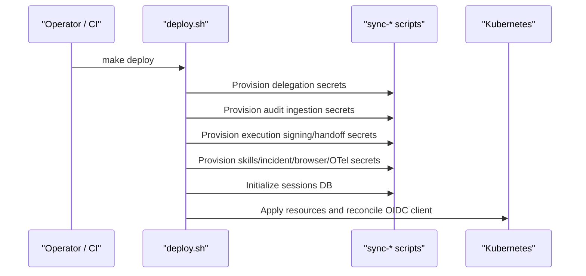
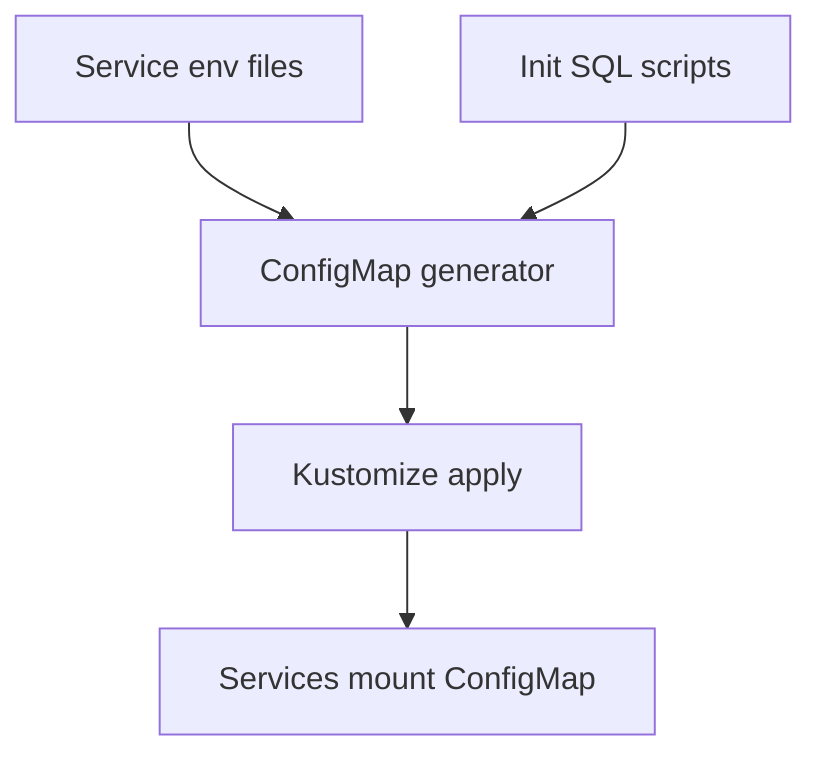
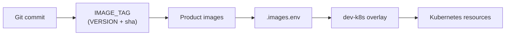
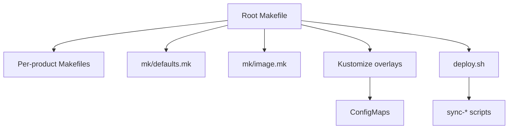

# Release Management and Version Promotion

<cite>
**Referenced Files in This Document**
- [README.md](file://README.md)
- [Makefile](file://Makefile)
- [defaults.mk](file://mk/defaults.mk)
- [image.mk](file://mk/image.mk)
- [kustomization.yaml](file://shared/platform-ops/gitops/dev-k8s/base/kustomization.yaml)
- [deploy.sh](file://shared/platform-ops/gitops/dev-k8s/deploy.sh)
- [2026-07-26-release-0-runtime-and-dev-k8s-overlays.md](file://docs/agentic-aiops-platform/release-notes/2026-07-26-release-0-runtime-and-dev-k8s-overlays.md)
- [delivery-roadmap.md](file://docs/agentic-aiops-platform/delivery-roadmap.md)
</cite>

## Table of Contents
1. [Introduction](#introduction)
2. [Project Structure](#project-structure)
3. [Core Components](#core-components)
4. [Architecture Overview](#architecture-overview)
5. [Detailed Component Analysis](#detailed-component-analysis)
6. [Dependency Analysis](#dependency-analysis)
7. [Performance Considerations](#performance-considerations)
8. [Troubleshooting Guide](#troubleshooting-guide)
9. [Conclusion](#conclusion)
10. [Appendices](#appendices)

## Introduction
This document describes the release management, version promotion, automated releases, and deployment pipelines for the Agentic AIOps platform. It explains how versions are coordinated across products and images, how GitOps overlays render deployments, how secrets and configuration are synchronized, and how verification gates protect promotions. It also covers rollback strategies, hotfix handling, monitoring during releases, validation after deployment, auditability, and compliance considerations grounded in the repository’s current build and deploy tooling.

## Project Structure
The workspace is organized around product-oriented services under `products/`, shared contracts and operations under `shared/`, and documentation under `docs/`. The root Makefile orchestrates cross-cutting concerns: testing, linting, image building, policy validation, overlay rendering, and deployment to a Kubernetes cluster via GitOps overlays.

**Diagram sources**
- [Makefile:14-46](file://Makefile#L14-L46)
- [Makefile:96-183](file://Makefile#L96-L183)
- [kustomization.yaml:6-20](file://shared/platform-ops/gitops/dev-k8s/base/kustomization.yaml#L6-L20)
- [deploy.sh:1-62](file://shared/platform-ops/gitops/dev-k8s/deploy.sh#L1-L62)

**Section sources**
- [README.md:15-54](file://README.md#L15-L54)
- [Makefile:14-46](file://Makefile#L14-L46)

## Core Components
- Coordinated image tagging and build state:
  - A single semver-driven tag is computed from the root VERSION file and propagated to all product images.
  - Build outputs are recorded in an `.images.env` file consumed by the deploy step.
- Verification gate:
  - Runs per-product tests, Kustomize overlay renders, policy validation, scenario evaluation, version lockstep checks, and secret vocabulary validation.
- Policy synchronization:
  - A canonical policy bundle is copied into consumer locations; diffs and validations are provided.
- Secret and configuration synchronization:
  - Deployment script provisions secrets (delegation, audit ingestion, execution signing/handoff, skills credentials, incident credentials, browser credentials, OTel credentials), initializes databases, and reconciles OIDC clients.
- Runtime configuration:
  - Kustomization generates a runtime ConfigMap from environment files for each service.

**Section sources**
- [Makefile:36-64](file://Makefile#L36-L64)
- [Makefile:96-129](file://Makefile#L96-L129)
- [Makefile:132-168](file://Makefile#L132-L168)
- [Makefile:171-183](file://Makefile#L171-L183)
- [kustomization.yaml:6-20](file://shared/platform-ops/gitops/dev-k8s/base/kustomization.yaml#L6-L20)
- [deploy.sh:11-52](file://shared/platform-ops/gitops/dev-k8s/deploy.sh#L11-L52)

## Architecture Overview
The release pipeline coordinates code, images, and deployed artifacts through a deterministic flow:

**Diagram sources**
- [Makefile:178-183](file://Makefile#L178-L183)
- [Makefile:96-129](file://Makefile#L96-L129)
- [kustomization.yaml:45-71](file://shared/platform-ops/gitops/dev-k8s/base/kustomization.yaml#L45-L71)
- [deploy.sh:1-62](file://shared/platform-ops/gitops/dev-k8s/deploy.sh#L1-L62)

## Detailed Component Analysis

### Version Promotion and Tag Management
- Single source of truth:
  - The root VERSION file defines the platform version used to prefix coordinated image tags.
- Tag computation:
  - Tags follow the pattern `<semver>-<prefix>[-<profile>]-<gitsha>[-dirty-<timestamp>]`.
  - Prefix/profile can be set via defaults; profile supports overlays like runtime profiles.
- Lockstep enforcement:
  - A dedicated target validates that the root version aligns with product metadata and portal references.
- Image state:
  - After building, a `.images.env` file records the exact image references used for deployment, enabling reproducible rollouts and audits.

**Diagram sources**
- [Makefile:39-64](file://Makefile#L39-L64)
- [Makefile:96-109](file://Makefile#L96-L109)
- [Makefile:161-163](file://Makefile#L161-L163)

**Section sources**
- [Makefile:39-64](file://Makefile#L39-L64)
- [Makefile:96-109](file://Makefile#L96-L109)
- [Makefile:161-163](file://Makefile#L161-L163)

### Automated Releases and CI Gates
- Pre-commit/pre-push gate:
  - `make verify` runs tests, overlay renders, policy validation, scenario evaluation, version lockstep, and secret vocabulary validation.
- Per-product routines:
  - Each product exposes its own test, build, lint targets; the root Makefile aggregates them.
- Optional kind loading:
  - Built images can be auto-loaded into a local kind cluster for fast iteration.

**Diagram sources**
- [Makefile:178-179](file://Makefile#L178-L179)
- [Makefile:81-87](file://Makefile#L81-L87)

**Section sources**
- [Makefile:14-23](file://Makefile#L14-L23)
- [Makefile:81-87](file://Makefile#L81-L87)
- [Makefile:178-179](file://Makefile#L178-L179)

### Secrets Synchronization Across Environments
- Deploy-time provisioning:
  - The deploy script calls multiple sync scripts to create or update secrets required by services (delegation, audit ingestion, execution signing/handoff, skills, incidents, browser credentials, OTel).
- External injection support:
  - Each sync script respects skip flags so CI can inject secrets externally without failing open.
- Idempotent database setup:
  - Sessions database initialization is idempotent and does not involve secrets.

**Diagram sources**
- [deploy.sh:11-58](file://shared/platform-ops/gitops/dev-k8s/deploy.sh#L11-L58)

**Section sources**
- [deploy.sh:1-62](file://shared/platform-ops/gitops/dev-k8s/deploy.sh#L1-L62)

### Database Migrations and Configuration Updates
- Runtime configuration:
  - Kustomization generates a runtime ConfigMap from environment files for each service, centralizing configuration updates.
- Database initialization:
  - SQL init scripts are included via ConfigMap generators and applied during deployment to prepare schemas for skills, incidents, and sessions.

**Diagram sources**
- [kustomization.yaml:6-44](file://shared/platform-ops/gitops/dev-k8s/base/kustomization.yaml#L6-L44)

**Section sources**
- [kustomization.yaml:6-44](file://shared/platform-ops/gitops/dev-k8s/base/kustomization.yaml#L6-L44)

### Changelog Generation and Release Notes
- Release notes directory:
  - The project maintains dated release notes under `docs/agentic-aiops-platform/release-notes/`.
- Delivery roadmap:
  - The roadmap documents release stacking logic and completion signals, guiding when features are promoted across environments.

**Section sources**
- [2026-07-26-release-0-runtime-and-dev-k8s-overlays.md:99-132](file://docs/agentic-aiops-platform/release-notes/2026-07-26-release-0-runtime-and-dev-k8s-overlays.md#L99-L132)
- [delivery-roadmap.md:287-296](file://docs/agentic-aiops-platform/delivery-roadmap.md#L287-L296)
- [delivery-roadmap.md:528-551](file://docs/agentic-aiops-platform/delivery-roadmap.md#L528-L551)

### Approval Workflows and Quality Checks
- Policy validation and diffing:
  - Canonical policy bundles are validated against schemas and evaluated against scenario expectations; diffs between canonical and candidate bundles are supported.
- Version and secret vocabulary lockstep:
  - Targets ensure consistent versions and secret definitions across components before promotion.

**Section sources**
- [Makefile:132-168](file://Makefile#L132-L168)

### Rollback Procedures and Hotfix Handling
- Rollback strategy:
  - Because images are tagged deterministically and stored in `.images.env`, rollback consists of redeploying the previous overlay with the prior IMAGE_TAG.
- Hotfix process:
  - For urgent fixes, rebuild images with a new tag and redeploy the overlay; use the same secret provisioning and configuration flow to maintain consistency.
- Emergency release handling:
  - Use external secret injection flags to bypass local secret provisioning in CI while ensuring fail-closed behavior where applicable.

[No sources needed since this section provides general guidance derived from existing build/deploy mechanics]

### Monitoring and Alerting During Releases
- Observability integration:
  - OTel credentials are provisioned at deploy time to enable observability backends; this supports monitoring and alerting during and after releases.
- Audit trail:
  - The platform ingests durable audit events, which can be queried post-deployment to validate release behavior and detect anomalies.

**Section sources**
- [deploy.sh:49-52](file://shared/platform-ops/gitops/dev-k8s/deploy.sh#L49-L52)

### Deployment Validation and Post-Release Verification
- E2E demos:
  - The e2e target runs demo scripts against a deployed cluster to validate core flows end-to-end.
- Overlay rendering:
  - Kustomize build checks ensure manifests are valid before deployment.

**Section sources**
- [Makefile:193-204](file://Makefile#L193-L204)
- [Makefile:171-176](file://Makefile#L171-L176)

### Relationship Between Code Versions, Container Images, and Deployed Artifacts
- Code to image:
  - Each product builds a container image tagged with the coordinated IMAGE_TAG derived from the root VERSION and git SHA.
- Image to artifact:
  - `.images.env` captures the exact image references used for deployment, linking code commits to deployed artifacts.
- Artifact to overlay:
  - The dev-k8s overlay consumes these images and applies resources to the cluster, including ConfigMaps and services.

**Diagram sources**
- [Makefile:39-64](file://Makefile#L39-L64)
- [Makefile:96-109](file://Makefile#L96-L109)
- [kustomization.yaml:45-71](file://shared/platform-ops/gitops/dev-k8s/base/kustomization.yaml#L45-L71)

**Section sources**
- [Makefile:39-64](file://Makefile#L39-L64)
- [Makefile:96-109](file://Makefile#L96-L109)

### Audit Trails and Compliance Requirements
- Durable audit trail:
  - The platform ingests and stores audit events, providing a queryable record of actions and decisions.
- Secret governance:
  - Secret vocabulary validation ensures consistent secret naming and usage across components, supporting compliance and security reviews.
- Policy enforcement:
  - Canonical policy bundles are validated and scenario-tested to enforce authorization and operational constraints consistently across environments.

**Section sources**
- [Makefile:132-168](file://Makefile#L132-L168)
- [deploy.sh:11-52](file://shared/platform-ops/gitops/dev-k8s/deploy.sh#L11-L52)

## Dependency Analysis
The root Makefile depends on per-product Makefiles and shared fragments to orchestrate builds, tests, and deployments. Kustomize overlays depend on service manifests and generated ConfigMaps. The deploy script depends on multiple secret provisioning scripts and optional OIDC reconciliation.

**Diagram sources**
- [Makefile:14-46](file://Makefile#L14-L46)
- [defaults.mk:1-53](file://mk/defaults.mk#L1-L53)
- [image.mk:1-58](file://mk/image.mk#L1-L58)
- [kustomization.yaml:6-71](file://shared/platform-ops/gitops/dev-k8s/base/kustomization.yaml#L6-L71)
- [deploy.sh:1-62](file://shared/platform-ops/gitops/dev-k8s/deploy.sh#L1-L62)

**Section sources**
- [Makefile:14-46](file://Makefile#L14-L46)
- [defaults.mk:1-53](file://mk/defaults.mk#L1-L53)
- [image.mk:1-58](file://mk/image.mk#L1-L58)

## Performance Considerations
- Deterministic tagging reduces cache misses and speeds up subsequent builds when tags are reused.
- Kustomize overlay rendering is performed as part of verification to catch configuration errors early.
- Auto-loading images into kind accelerates local iteration but should be disabled in CI to avoid overhead.

[No sources needed since this section provides general guidance]

## Troubleshooting Guide
- If `make verify` fails:
  - Check test output for failing product suites.
  - Inspect overlay render errors from kustomize.
  - Review policy validation and scenario results.
  - Confirm version lockstep and secret vocabulary alignment.
- If deployment fails:
  - Verify secret provisioning flags and environment variables.
  - Ensure the correct cluster context is active.
  - Check logs for services after rollout to identify misconfigurations.

**Section sources**
- [Makefile:178-183](file://Makefile#L178-L183)
- [deploy.sh:1-62](file://shared/platform-ops/gitops/dev-k8s/deploy.sh#L1-L62)

## Conclusion
The platform uses a coordinated, GitOps-driven release model anchored by a single version source and deterministic image tagging. The verification gate enforces quality and policy compliance before promotion. Secrets and configuration are synchronized at deploy time, and audit trails provide traceability. Rollbacks and hotfixes leverage immutable image tags and overlay-based deployments, while e2e demos and overlay checks validate releases. This approach balances repeatability, safety, and operational clarity.

[No sources needed since this section summarizes without analyzing specific files]

## Appendices

### Key Targets Summary
- `make verify`: Pre-commit/pre-push gate (tests, overlays, policies, scenarios, version, vocabulary).
- `make build`: Build all images with coordinated tag and write `.images.env`.
- `make push`: Push images to registry (with optional re-tag).
- `make deploy`: Deploy dev-k8s overlay and provision secrets/config.
- `make e2e`: Run end-to-end demos against deployed cluster.

**Section sources**
- [Makefile:77-129](file://Makefile#L77-L129)
- [Makefile:178-204](file://Makefile#L178-L204)