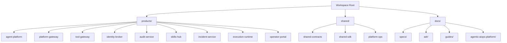
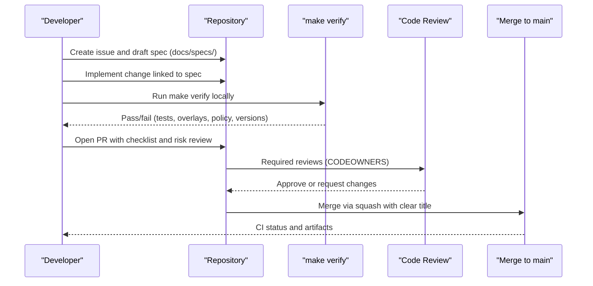
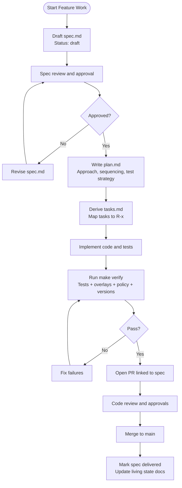
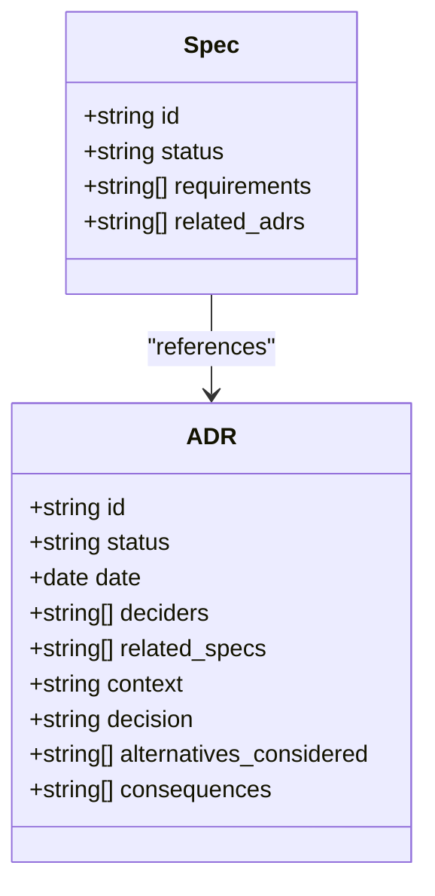
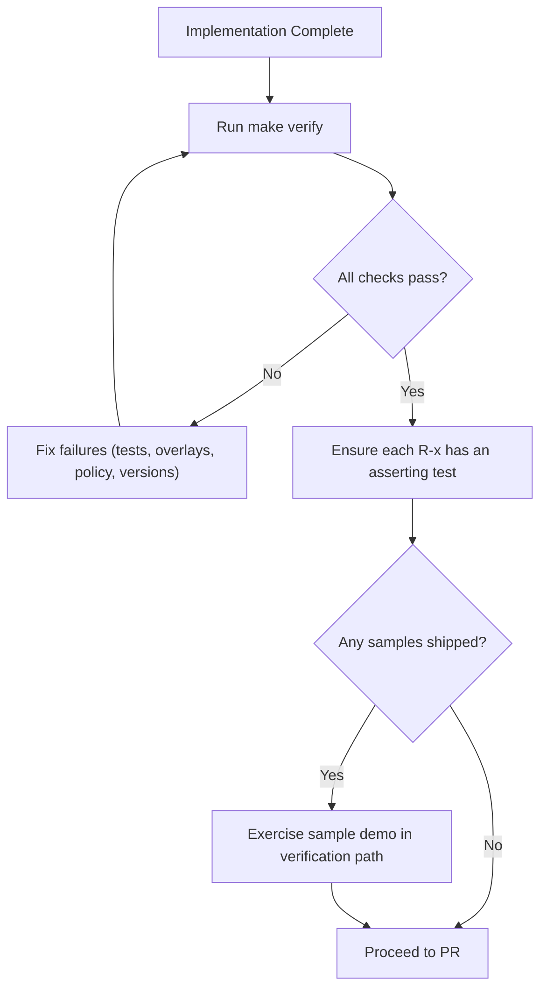
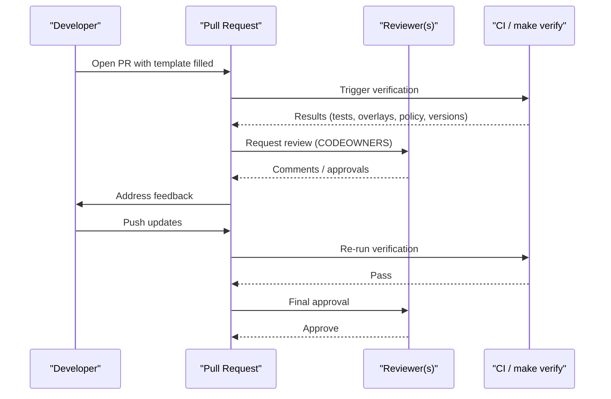
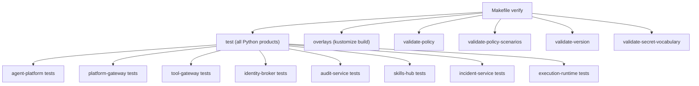
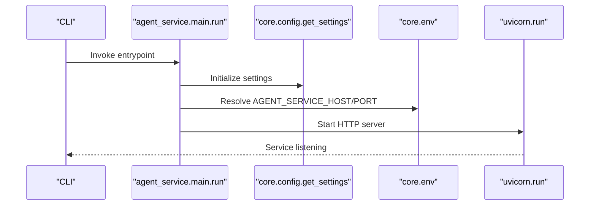

# Contribution Workflow and Guidelines

<cite>
**Referenced Files in This Document**
- [CONTRIBUTING.md](file://CONTRIBUTING.md)
- [README.md](file://README.md)
- [Makefile](file://Makefile)
- [pull_request_template.md](file://.github/pull_request_template.md)
- [docs/specs/README.md](file://docs/specs/README.md)
- [docs/specs/templates/spec.md](file://docs/specs/templates/spec.md)
- [docs/specs/templates/plan.md](file://docs/specs/templates/plan.md)
- [docs/specs/templates/tasks.md](file://docs/specs/templates/tasks.md)
- [docs/adr/README.md](file://docs/adr/README.md)
- [docs/adr/template.md](file://docs/adr/template.md)
- [docs/adr/0008-spec-delivery-traceability-gate.md](file://docs/adr/0008-spec-delivery-traceability-gate.md)
- [docs/guides/adding-a-tool.md](file://docs/guides/adding-a-tool.md)
- [shared/shared-contracts/README.md](file://shared/shared-contracts/README.md)
- [products/agent-platform/pyproject.toml](file://products/agent-platform/pyproject.toml)
- [products/agent-platform/src/agent_service/main.py](file://products/agent-platform/src/agent_service/main.py)
- [docs/workspace/github-repository-governance.md](file://docs/workspace/github-repository-governance.md)
</cite>

## Table of Contents
1. Introduction
2. Project Structure
3. Core Components
4. Architecture Overview
5. Detailed Component Analysis
6. Dependency Analysis
7. Performance Considerations
8. Troubleshooting Guide
9. Conclusion
10. Appendices

## Introduction
This document defines the complete contribution workflow for the Luban AIOPS platform, from issue creation to pull request submission and review. It explains the spec-driven development process, how to create specifications, plan implementation tasks, and track progress through Architecture Decision Records (ADRs). It also documents code review processes, quality gates, acceptance criteria, coding standards, naming conventions, branching strategy, commit message conventions, merge policies, documentation update practices, and community interaction norms.

The workspace is organized as a modular platform with product-oriented boundaries, explicit integration points, and shared contracts. Contributions must preserve product boundaries, trust boundaries, traceable changes, and release-by-release delivery discipline.

**Section sources**
- [README.md:1-92](file://README.md#L1-L92)
- [CONTRIBUTING.md:1-23](file://CONTRIBUTING.md#L1-L23)

## Project Structure
The repository is a monorepo workspace with clear ownership:
- products/: user-facing and service-facing capabilities
- shared/: low-level shared contracts, SDKs, and platform operations assets
- docs/: architecture, design, delivery plans, and workspace guidance

Work should be done in the directory that owns the capability being changed. Logic should not be moved into shared/ unless it is genuinely reusable and dependency-light.

**Diagram sources**
- [README.md:15-55](file://README.md#L15-L55)

**Section sources**
- [README.md:15-55](file://README.md#L15-L55)
- [CONTRIBUTING.md:14-23](file://CONTRIBUTING.md#L14-L23)

## Core Components
This section summarizes the key components that shape contributions:

- Spec-driven development: All qualifying changes require a spec under docs/specs/ before implementation. Architecturally significant decisions are recorded as ADRs under docs/adr/. Implementation PRs link the spec ID they serve. Delivered specs are frozen; follow-up changes get a new spec.
- Versioning and lockstep: The root VERSION file is the single source of truth. Products version in lockstep with the platform. make validate-version enforces this.
- Testing and verification: make test runs all product tests; make verify runs the full pre-commit gate including tests, GitOps overlay rendering, policy validation, scenarios, version lockstep, and secret vocabulary checks.
- Pull requests: Must align to a product or shared module, link the relevant spec (or justify why none is required), describe the target release slice, call out identity/policy/approval/audit/execution impact, update related docs, and run make verify plus relevant product tests.
- Branch naming and commits: Use descriptive branch names and small, reviewable commits with prefixes like docs:, feat:, fix:, chore:, refactor:.
- Design review checklist: Apply when changes cross product boundaries, ensuring trust model preservation, explicit contracts, identity continuity, alignment to a named release slice, and requirement-to-test mapping per ADR-0008.

**Section sources**
- [CONTRIBUTING.md:24-138](file://CONTRIBUTING.md#L24-L138)
- [Makefile:77-179](file://Makefile#L77-L179)

## Architecture Overview
Contributions flow through a disciplined pipeline anchored by specs, ADRs, tests, and verification gates.

**Diagram sources**
- [CONTRIBUTING.md:97-138](file://CONTRIBUTING.md#L97-L138)
- [Makefile:171-179](file://Makefile#L171-L179)
- [docs/workspace/github-repository-governance.md:32-60](file://docs/workspace/github-repository-governance.md#L32-L60)

## Detailed Component Analysis

### Spec-Driven Development Workflow
Specs define what and why, plan defines how, and tasks track execution. Each spec lives under docs/specs/SPEC-NNN-slug/ with spec.md, plan.md, and tasks.md. Status transitions: draft → approved → in-progress → delivered → superseded. Requirements use stable IDs R-1, R-2, etc., and tasks reference them for traceability.

**Diagram sources**
- [docs/specs/README.md:53-107](file://docs/specs/README.md#L53-L107)
- [docs/specs/templates/spec.md:1-56](file://docs/specs/templates/spec.md#L1-L56)
- [docs/specs/templates/plan.md:1-35](file://docs/specs/templates/plan.md#L1-L35)
- [docs/specs/templates/tasks.md:1-21](file://docs/specs/templates/tasks.md#L1-L21)

**Section sources**
- [docs/specs/README.md:9-107](file://docs/specs/README.md#L9-L107)
- [docs/specs/templates/spec.md:1-56](file://docs/specs/templates/spec.md#L1-L56)
- [docs/specs/templates/plan.md:1-35](file://docs/specs/templates/plan.md#L1-L35)
- [docs/specs/templates/tasks.md:1-21](file://docs/specs/templates/tasks.md#L1-L21)

### Architecture Decision Records (ADRs)
ADRs capture architecturally significant decisions across products, technology selections, trust model changes, or reversals. They are numbered sequentially, immutable except for status changes and supersession links, and referenced by specs.

**Diagram sources**
- [docs/adr/README.md:1-50](file://docs/adr/README.md#L1-L50)
- [docs/adr/template.md:1-28](file://docs/adr/template.md#L1-L28)

**Section sources**
- [docs/adr/README.md:1-50](file://docs/adr/README.md#L1-L50)
- [docs/adr/template.md:1-28](file://docs/adr/template.md#L1-L28)

### Quality Gates and Acceptance Criteria
Quality gates ensure deliverables are demonstrably delivered:
- make verify is the verification gate: runs every product test suite, renders GitOps overlays, validates policy bundles and scenarios, enforces version lockstep, and validates secret vocabulary.
- Per ADR-0008, a spec advances to delivered only when every R-x acceptance criterion maps to at least one asserting test (recorded in tasks.md) and any shipped samples/demo is exercised by its own script in the verification path.
- Changes to shared/shared-contracts schemas require contract-parity tests in consuming services; enum vocabularies must be asserted for value-set equality between JSON schema and consuming types.

**Diagram sources**
- [Makefile:171-179](file://Makefile#L171-L179)
- [docs/adr/0008-spec-delivery-traceability-gate.md:34-78](file://docs/adr/0008-spec-delivery-traceability-gate.md#L34-L78)
- [CONTRIBUTING.md:70-88](file://CONTRIBUTING.md#L70-L88)

**Section sources**
- [Makefile:171-179](file://Makefile#L171-L179)
- [docs/adr/0008-spec-delivery-traceability-gate.md:34-78](file://docs/adr/0008-spec-delivery-traceability-gate.md#L34-L78)
- [CONTRIBUTING.md:70-88](file://CONTRIBUTING.md#L70-L88)

### Code Review Process and PR Checklist
Pull requests must:
- Align to a product or shared module
- Link the implementing spec or explain why none is required
- Describe the target release slice
- Call out impacts on identity, policy, approvals, audit, or execution safety
- Update related documentation and examples
- Run make verify and relevant product tests

Use the provided PR template to structure summary, checklist, risk review, validation, and related context.

**Diagram sources**
- [.github/pull_request_template.md:1-33](file://.github/pull_request_template.md#L1-L33)
- [CONTRIBUTING.md:97-138](file://CONTRIBUTING.md#L97-L138)
- [docs/workspace/github-repository-governance.md:32-60](file://docs/workspace/github-repository-governance.md#L32-L60)

**Section sources**
- [.github/pull_request_template.md:1-33](file://.github/pull_request_template.md#L1-L33)
- [CONTRIBUTING.md:97-138](file://CONTRIBUTING.md#L97-L138)
- [docs/workspace/github-repository-governance.md:32-60](file://docs/workspace/github-repository-governance.md#L32-L60)

### Coding Standards, Style Guides, and Naming Conventions
- Python toolchain: Services standardize on uv for environment and package management; interpreter versions pinned via .python-version files.
- Product packaging: Each product declares dependencies and scripts in pyproject.toml; agent-platform uses FastAPI/Uvicorn and Pydantic models aligned with shared contracts.
- Tool naming convention: <system>.<verb>_<noun> (e.g., k8s.list_pods); result semantics include success/error/denied with evidence envelopes.
- Risk-tier enforcement: Tools declare risk_level read/write/admin; mutating tools require additional flags and produce approval cards.
- Error handling: execute() never raises; structured ToolResult with stable error codes ensures consistent agent reasoning and evidence panel rendering.

**Section sources**
- [README.md:76-82](file://README.md#L76-L82)
- [products/agent-platform/pyproject.toml:1-38](file://products/agent-platform/pyproject.toml#L1-L38)
- [shared/shared-contracts/README.md:102-127](file://shared/shared-contracts/README.md#L102-L127)
- [docs/guides/adding-a-tool.md:13-45](file://docs/guides/adding-a-tool.md#L13-L45)
- [docs/guides/adding-a-tool.md:139-210](file://docs/guides/adding-a-tool.md#L139-L210)

### Branching Strategy, Commit Messages, and Merge Policies
- Branch naming: Use descriptive names such as docs/release-0-foundation, feat/operator-portal-shell, feat/policy-center-evaluator, chore/repo-governance.
- Commit messages: Prefer small, reviewable commits with prefixes docs:, feat:, fix:, chore:, refactor:.
- Merge strategy: Recommended default is squash merges with clear PR titles; branch protection requires PRs, approvals, up-to-date branches, conversation resolution, and blocks force pushes/deletions.

**Section sources**
- [CONTRIBUTING.md:108-125](file://CONTRIBUTING.md#L108-L125)
- [docs/workspace/github-repository-governance.md:32-60](file://docs/workspace/github-repository-governance.md#L32-L60)

### Writing Effective Documentation Updates
Documentation tiers:
- Tier 1: Architecture record — long-lived, rarely edited; new decisions captured as ADRs.
- Tier 2: Feature specs — short-lived, written before implementation, frozen after delivery.
- Tier 3: Living state docs — must reflect current state (root README, CHANGELOG, product READMEs, GitOps overlay READMEs).

When delivering a spec, include a task to update affected living state docs. Keep living state docs intentionally minimal to reduce stale surface area.

**Section sources**
- [docs/specs/README.md:9-33](file://docs/specs/README.md#L9-L33)
- [docs/specs/templates/tasks.md:14-21](file://docs/specs/templates/tasks.md#L14-L21)

### Contributing New Features, Bug Fixes, and Platform Improvements
- New features: Draft a spec, write plan and tasks, implement with tests, ensure acceptance criteria map to assertions, exercise any shipped samples, run make verify, open PR linked to spec.
- Bug fixes: Include regression tests that fail without the fix; if touching shared contracts, add contract-parity tests in consumers.
- Platform improvements: Follow spec-driven process when crossing product boundaries or affecting trust/identity/policy/audit/execution behavior; otherwise, keep changes scoped and well-tested.

**Section sources**
- [CONTRIBUTING.md:24-95](file://CONTRIBUTING.md#L24-L95)
- [docs/specs/README.md:34-52](file://docs/specs/README.md#L34-L52)

### Community Interaction Norms, Communication Channels, and Escalation Procedures
- Repository governance: Use main as protected default branch; enable PR-based changes, required review coverage aligned to CODEOWNERS, and issue/PR templates.
- Labels and milestones: Define label groups and milestones to organize work and track releases.
- Escalation: For complex technical decisions that cross product boundaries or affect trust models, propose an ADR and seek consensus among deciders; link related specs and record consequences.

**Section sources**
- [docs/workspace/github-repository-governance.md:1-64](file://docs/workspace/github-repository-governance.md#L1-L64)
- [docs/adr/README.md:16-33](file://docs/adr/README.md#L16-L33)

## Dependency Analysis
The verification pipeline orchestrates multiple product test suites and shared validations.

**Diagram sources**
- [Makefile:14-17](file://Makefile#L14-L17)
- [Makefile:77-179](file://Makefile#L77-L179)

**Section sources**
- [Makefile:14-17](file://Makefile#L14-L17)
- [Makefile:77-179](file://Makefile#L77-L179)

## Performance Considerations
- Keep connectors thin and testable; isolate configuration and transport seams to enable mocking and fast iteration.
- Avoid loading optional dependencies unless enabled; lazy imports prevent unnecessary startup overhead.
- Prefer deterministic outputs and bounded payloads to reduce agent processing and evidence panel rendering costs.
- Use standardized error envelopes to avoid exception handling overhead and improve agent reasoning efficiency.

[No sources needed since this section provides general guidance]

## Troubleshooting Guide
Common issues and resolutions:
- Verification failures: Run make verify to identify failing areas (tests, overlays, policy, versions). Inspect specific targets: overlays, validate-policy, validate-policy-scenarios, validate-version, validate-secret-vocabulary.
- Policy bundle mismatches: Use make policy-diff CANDIDATE=<path> to compare candidate bundles against canonical; validate scenarios per engine.
- Contract drift: Ensure enum vocabularies match between JSON schemas and consuming types; add contract-parity tests where needed.
- Sample demos not exercising behavior: Wire sample scripts into the verification path per ADR-0008 so “declared delivered” equals “demonstrably delivered.”

**Section sources**
- [Makefile:130-179](file://Makefile#L130-L179)
- [docs/adr/0008-spec-delivery-traceability-gate.md:34-78](file://docs/adr/0008-spec-delivery-traceability-gate.md#L34-L78)
- [CONTRIBUTING.md:70-88](file://CONTRIBUTING.md#L70-L88)

## Conclusion
Contributions to the Luban AIOPS platform are governed by a rigorous spec-driven workflow, strong quality gates, and clear governance. By creating specs, planning with ADRs, writing tests that assert acceptance criteria, and running make verify, contributors ensure safe, traceable, and high-quality deliveries. Adhering to naming conventions, risk-tier enforcement, and merge policies maintains platform integrity while enabling independent evolution of capabilities.

[No sources needed since this section summarizes without analyzing specific files]

## Appendices

### Appendix A: Entry Points and Service Lifecycle
Services start via their entrypoints and configuration loaders. For example, the agent-platform service initializes settings and runs Uvicorn with host/port resolved from environment variables.

**Diagram sources**
- [products/agent-platform/src/agent_service/main.py:1-22](file://products/agent-platform/src/agent_service/main.py#L1-L22)

**Section sources**
- [products/agent-platform/src/agent_service/main.py:1-22](file://products/agent-platform/src/agent_service/main.py#L1-L22)