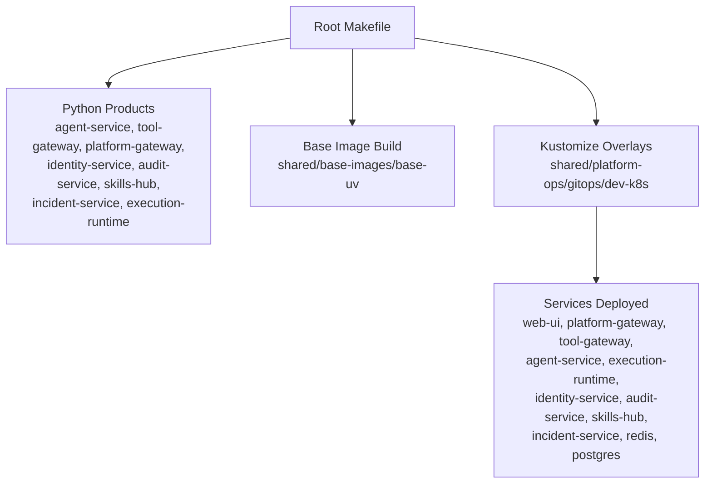
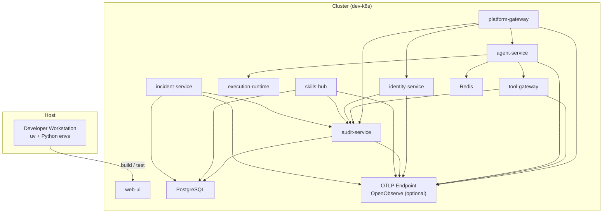
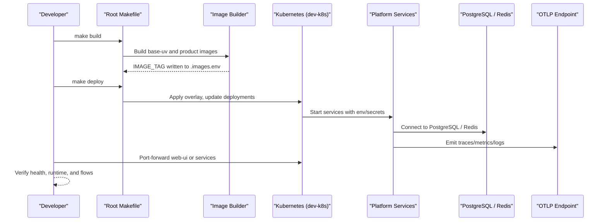
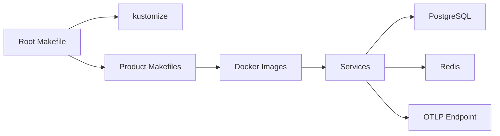

# Development Environment Setup

<cite>
**Referenced Files in This Document**
- [README.md](file://README.md)
- [Makefile](file://Makefile)
- [mk/defaults.mk](file://mk/defaults.mk)
- [shared/base-images/base-uv/Dockerfile](file://shared/base-images/base-uv/Dockerfile)
- [products/agent-platform/Dockerfile](file://products/agent-platform/Dockerfile)
- [products/agent-platform/pyproject.toml](file://products/agent-platform/pyproject.toml)
- [shared/platform-ops/gitops/dev-k8s/README.md](file://shared/platform-ops/gitops/dev-k8s/README.md)
- [shared/platform-ops/gitops/dev-k8s/base/shared/runtime.env](file://shared/platform-ops/gitops/dev-k8s/base/shared/runtime.env)
- [shared/platform-ops/gitops/dev-k8s/base/agent-platform/runtime-config.env](file://shared/platform-ops/gitops/dev-k8s/base/agent-platform/runtime-config.env)
- [shared/platform-ops/gitops/dev-k8s/base/infra/postgres-statefulset.yaml](file://shared/platform-ops/gitops/dev-k8s/base/infra/postgres-statefulset.yaml)
- [shared/platform-ops/gitops/dev-k8s/base/infra/redis-deployment.yaml](file://shared/platform-ops/gitops/dev-k8s/base/infra/redis-deployment.yaml)
- [shared/platform-ops/gitops/dev-k8s/deploy.sh](file://shared/platform-ops/gitops/dev-k8s/deploy.sh)
</cite>

## Table of Contents
1. Introduction
2. Project Structure
3. Core Components
4. Architecture Overview
5. Detailed Component Analysis
6. Dependency Analysis
7. Performance Considerations
8. Troubleshooting Guide
9. Conclusion

## Introduction
This document explains how to set up a local development environment for the Luban AIOPS platform. It covers Python environment setup with uv, dependency management, virtual environment configuration, Kubernetes development cluster setup using the dev-k8s overlay, environment variables and secrets, Docker container building and testing, database dependencies (PostgreSQL, Redis), Elasticsearch/OpenTelemetry integration, IDE recommendations, debugging, hot-reloading guidance, troubleshooting, and performance tips for local development.

## Project Structure
The workspace is organized into product-oriented services under products/, shared contracts and operations under shared/, and documentation under docs/. The root Makefile orchestrates verification, builds, and deployment across all Python products and GitOps overlays.

**Diagram sources**
- [Makefile:14-109](file://Makefile#L14-L109)
- [shared/platform-ops/gitops/dev-k8s/README.md:1-55](file://shared/platform-ops/gitops/dev-k8s/README.md#L1-L55)

**Section sources**
- [README.md:15-54](file://README.md#L15-L54)
- [Makefile:14-109](file://Makefile#L14-L109)

## Core Components
- Python toolchain: All backend services use uv for environment and package management. Each product has its own pyproject.toml and lockfile. The workspace pins the interpreter via .python-version and uses a shared base image that installs uv and manages interpreters per project.
- Container strategy: Product Dockerfiles build from luban-aiops/base-uv, which installs a pinned uv and runs as a non-root user. Images are built with coordinated tags and can be auto-loaded into kind.
- Dev Kubernetes overlay: The dev-k8s overlay deploys all platform services plus Redis and PostgreSQL. It composes runtime environment fragments into a single ConfigMap and provisions secrets through helper scripts during deploy.

Key responsibilities:
- Root Makefile: Aggregates per-product sync/test/lint/build/push, renders Kustomize overlays, validates policies and versions, and coordinates deploy.
- Base image: Provides a deterministic Python + uv runtime with consistent environment variables for reproducible builds.
- Dev overlay: Defines service wiring, environment variables, secrets, and optional profiles (mutating tools, browser checks).

**Section sources**
- [README.md:76-81](file://README.md#L76-L81)
- [shared/base-images/base-uv/Dockerfile:1-39](file://shared/base-images/base-uv/Dockerfile#L1-L39)
- [products/agent-platform/Dockerfile:1-13](file://products/agent-platform/Dockerfile#L1-L13)
- [shared/platform-ops/gitops/dev-k8s/README.md:1-73](file://shared/platform-ops/gitops/dev-k8s/README.md#L1-L73)

## Architecture Overview
Local development consists of:
- Host machine running uv-managed Python environments per product.
- Optional local Kubernetes cluster (e.g., kind) where images are built and loaded.
- In-cluster infrastructure: Redis for AgentScope coordination, PostgreSQL for durable stores (audit, sessions, skills, incidents).
- OpenTelemetry exporter configured to push traces/metrics/logs to an OTLP endpoint (e.g., OpenObserve) when enabled.

**Diagram sources**
- [shared/platform-ops/gitops/dev-k8s/README.md:56-73](file://shared/platform-ops/gitops/dev-k8s/README.md#L56-L73)
- [shared/platform-ops/gitops/dev-k8s/base/shared/runtime.env:1-12](file://shared/platform-ops/gitops/dev-k8s/base/shared/runtime.env#L1-L12)
- [shared/platform-ops/gitops/dev-k8s/base/agent-platform/runtime-config.env:1-50](file://shared/platform-ops/gitops/dev-k8s/base/agent-platform/runtime-config.env#L1-L50)

## Detailed Component Analysis

### Python Environment and Dependencies with uv
- Interpreter pinning: The workspace uses a global .python-version; each product also carries its own version file so container builds honor the same target.
- Per-product environments: Use uv to create and manage isolated environments per product directory. Install dependencies from pyproject.toml and lockfiles.
- Service entrypoints: Each product exposes CLI entrypoints defined in pyproject.scripts for running services locally.

Recommended workflow:
- Ensure uv is installed on your host.
- From each product directory, run dependency sync and tests using uv-based commands exposed by the product Makefiles or directly via uv.
- For example, agent-service defines scripts such as agent-service, agent-service-runtime, and agent-service-native.

Notes:
- The base image installs uv and sets environment variables so that uv resolves the interpreter deterministically during image builds.
- When building images, the base-uv image ensures consistent Python and uv behavior across environments.

**Section sources**
- [README.md:76-81](file://README.md#L76-L81)
- [products/agent-platform/pyproject.toml:1-38](file://products/agent-platform/pyproject.toml#L1-L38)
- [shared/base-images/base-uv/Dockerfile:1-39](file://shared/base-images/base-uv/Dockerfile#L1-L39)
- [products/agent-platform/Dockerfile:1-13](file://products/agent-platform/Dockerfile#L1-L13)

### Local Kubernetes Cluster and Dev Overlay
- The dev-k8s overlay deploys all platform services plus Redis and PostgreSQL.
- Runtime configuration is composed from per-product env fragments into a single ConfigMap.
- Secrets are provisioned via helper scripts during deploy (audit, skills, incidents, delegation, browser credentials, runtime secrets).
- Profiles allow enabling mutating tools and browser capabilities in dev.

Typical steps:
- Build images with make build.
- Optionally load images into kind with AUTO_LOAD_KIND=true and KIND_CLUSTER_NAME set.
- Deploy with make deploy, which applies the overlay, updates deployments to explicit image tags, waits for rollout, and reconciles Keycloak client settings.

Verification:
- Check pods and services in the dev namespace.
- Port-forward web-ui to access the portal shell and proxied /api paths.
- Verify agent-service runtime metadata via platform-gateway.

**Section sources**
- [shared/platform-ops/gitops/dev-k8s/README.md:1-73](file://shared/platform-ops/gitops/dev-k8s/README.md#L1-L73)
- [shared/platform-ops/gitops/dev-k8s/README.md:311-339](file://shared/platform-ops/gitops/dev-k8s/README.md#L311-L339)
- [shared/platform-ops/gitops/dev-k8s/README.md:692-762](file://shared/platform-ops/gitops/dev-k8s/README.md#L692-L762)
- [Makefile:96-124](file://Makefile#L96-L124)

### Environment Variables, Secrets, and Service Endpoints
- Shared runtime env: Enables OpenTelemetry and defines the identity broker URL used by both gateways.
- Agent platform env: Configures Redis for AgentScope, session and state stores pointing to PostgreSQL, tool gateway URL, execution worker URL, audit emitter, incident service, and skills hub endpoints.
- Secrets:
  - Audit ingestion secret shared across emitters and ingest service.
  - Skills query secret shared across callers and skills-hub.
  - Incident webhook token and query secret.
  - Delegation secrets for broker-mediated token exchange.
  - Browser credential sets for headless browser tools.
  - Runtime secrets for LLM provider keys and OIDC client secrets.

Provisioning:
- make deploy runs helper scripts to create databases and sync secrets automatically unless skipped.
- You can selectively skip steps (e.g., SKIP_AUDIT_SECRETS=true) when secrets are injected by CI.

Service discovery:
- Services communicate via in-cluster DNS names (service links disabled to avoid collisions).
- Example endpoints: http://audit-service:8000, http://skills-hub:8000, http://incident-service:8000, http://tool-gateway:8000, http://identity-service:8000.

**Section sources**
- [shared/platform-ops/gitops/dev-k8s/base/shared/runtime.env:1-12](file://shared/platform-ops/gitops/dev-k8s/base/shared/runtime.env#L1-L12)
- [shared/platform-ops/gitops/dev-k8s/base/agent-platform/runtime-config.env:1-50](file://shared/platform-ops/gitops/dev-k8s/base/agent-platform/runtime-config.env#L1-L50)
- [shared/platform-ops/gitops/dev-k8s/README.md:200-310](file://shared/platform-ops/gitops/dev-k8s/README.md#L200-L310)
- [shared/platform-ops/gitops/dev-k8s/README.md:340-561](file://shared/platform-ops/gitops/dev-k8s/README.md#L340-L561)

### Docker Container Building and Testing
- Base image: Built from shared/base-images/base-uv with pinned uv and Python versions.
- Product images: Built via make build, which delegates to each product’s Makefile and writes a coordinated IMAGE_TAG to .images.env.
- Auto-load into kind: Set AUTO_LOAD_KIND=true and KIND_CLUSTER_NAME to load images after build.
- Push to registry: Use make push with REGISTRY set to re-tag and push images.

Testing:
- Run make test to execute all Python product test suites.
- Run make verify to run tests, render overlays, validate policies and scenarios, and enforce version/vocabulary lockstep.

**Section sources**
- [shared/base-images/base-uv/Dockerfile:1-39](file://shared/base-images/base-uv/Dockerfile#L1-L39)
- [Makefile:89-128](file://Makefile#L89-L128)
- [Makefile:178-183](file://Makefile#L178-L183)

### Database Dependencies (PostgreSQL, Redis) and Observability
- PostgreSQL: Deployed as a StatefulSet with a PVC for durability in dev. Databases created idempotently (sessions, skills, incidents, audit).
- Redis: Deployed with emptyDir storage for dev; used for AgentScope kernel coordination.
- OpenTelemetry: Enabled via OTEL_ENABLED and OTEL_EXPORTER_OTLP_ENDPOINT in shared runtime env. Auth headers are provisioned via sync-otel-secrets.sh.

Operational notes:
- If Postgres is unreachable at startup, some stores fail open to in-memory backends with metrics counters indicating fallbacks.
- Verify readiness via health endpoints and metrics exposed by services.

**Section sources**
- [shared/platform-ops/gitops/dev-k8s/base/infra/postgres-statefulset.yaml](file://shared/platform-ops/gitops/dev-k8s/base/infra/postgres-statefulset.yaml)
- [shared/platform-ops/gitops/dev-k8s/base/infra/redis-deployment.yaml](file://shared/platform-ops/gitops/dev-k8s/base/infra/redis-deployment.yaml)
- [shared/platform-ops/gitops/dev-k8s/base/shared/runtime.env:1-12](file://shared/platform-ops/gitops/dev-k8s/base/shared/runtime.env#L1-L12)
- [shared/platform-ops/gitops/dev-k8s/README.md:375-424](file://shared/platform-ops/gitops/dev-k8s/README.md#L375-L424)
- [shared/platform-ops/gitops/dev-k8s/README.md:563-599](file://shared/platform-ops/gitops/dev-k8s/README.md#L563-L599)

### IDE Configuration Recommendations and Debugging
- Python: Configure your IDE to use the project’s .python-version and uv-managed environments. Prefer per-project interpreter selection to match container behavior.
- FastAPI services: Many services expose /health and /metrics endpoints for quick validation. Use port-forwarding to inspect responses locally or in-cluster.
- Tracing and logs: With OTEL_ENABLED=true, ensure your OTLP endpoint is reachable. Use metrics endpoints to confirm telemetry emission.
- Hot reloading: For local development, you can run services directly with uv in watch mode if supported by your framework/tooling. Note that this repository’s standard entrypoints invoke the service via uv run; adjust your IDE launch configuration to start the process in debug mode and enable reload if desired.

[No sources needed since this section provides general guidance]

### End-to-End Workflow Sequence

**Diagram sources**
- [Makefile:96-124](file://Makefile#L96-L124)
- [shared/platform-ops/gitops/dev-k8s/README.md:692-762](file://shared/platform-ops/gitops/dev-k8s/README.md#L692-L762)
- [shared/platform-ops/gitops/dev-k8s/base/shared/runtime.env:1-12](file://shared/platform-ops/gitops/dev-k8s/base/shared/runtime.env#L1-L12)

## Dependency Analysis
- Build-time dependencies:
  - Root Makefile depends on kustomize for overlay rendering and on per-product Makefiles for image builds.
  - Base image depends on Amazon Linux minimal with curl-minimal to install uv.
- Runtime dependencies:
  - Services depend on in-cluster DNS for service discovery.
  - Agent platform depends on Redis for AgentScope coordination and PostgreSQL for session/state persistence.
  - Audit, skills, and incident services depend on PostgreSQL.
  - All services optionally emit telemetry to an OTLP endpoint.

**Diagram sources**
- [Makefile:171-176](file://Makefile#L171-L176)
- [shared/base-images/base-uv/Dockerfile:1-39](file://shared/base-images/base-uv/Dockerfile#L1-L39)
- [shared/platform-ops/gitops/dev-k8s/base/shared/runtime.env:1-12](file://shared/platform-ops/gitops/dev-k8s/base/shared/runtime.env#L1-L12)

**Section sources**
- [Makefile:14-109](file://Makefile#L14-L109)
- [shared/platform-ops/gitops/dev-k8s/README.md:56-73](file://shared/platform-ops/gitops/dev-k8s/README.md#L56-L73)

## Performance Considerations
- Use coordinated image tags to avoid stale tag rollouts and unnecessary pulls.
- Keep OTEL_ENABLED off in tight local loops if telemetry overhead is noticeable; otherwise, ensure the OTLP endpoint is close and healthy.
- Prefer targeted restarts (ConfigMap changes only) instead of full redeployments when possible.
- Avoid mutating tools and browser sidecars unless needed for the feature under test.
- Use kind with sufficient CPU/memory for smooth local development.

[No sources needed since this section provides general guidance]

## Troubleshooting Guide
Common issues and resolutions:
- Missing secrets:
  - Audit, skills, incidents, delegation, and browser credentials are provisioned by helper scripts during deploy. If skipped or failed, run the corresponding sync script manually.
- Postgres not ready:
  - Databases are created idempotently; if services crashloop due to missing databases, run the relevant sync script and restart affected deployments.
- OIDC callback failures:
  - Ensure the canonical hostname resolves and matches registered redirect URIs. Use port-forward for asset inspection but sign-in requires the canonical origin.
- Telemetry not visible:
  - Confirm OTEL_ENABLED and OTEL_EXPORTER_OTLP_ENDPOINT are set and reachable. Verify auth headers were provisioned by sync-otel-secrets.sh.
- Mutating tools not available:
  - Verify the mutating-dev profile is active and RBAC grants are applied. Toggle posture by adjusting the profile and restarting tool-gateway.

Useful commands:
- make verify: Runs tests, renders overlays, validates policies/scenarios, and enforces version/vocabulary lockstep.
- make e2e: Runs end-to-end demo scripts against a deployed cluster (requires port-forwards for chat legs).
- Port-forward services to inspect health and runtime metadata.

**Section sources**
- [shared/platform-ops/gitops/dev-k8s/README.md:200-310](file://shared/platform-ops/gitops/dev-k8s/README.md#L200-L310)
- [shared/platform-ops/gitops/dev-k8s/README.md:340-561](file://shared/platform-ops/gitops/dev-k8s/README.md#L340-L561)
- [shared/platform-ops/gitops/dev-k8s/README.md:663-690](file://shared/platform-ops/gitops/dev-k8s/README.md#L663-L690)
- [Makefile:178-204](file://Makefile#L178-L204)

## Conclusion
You now have a complete guide to setting up the Luban AIOPS local development environment using uv for Python, building and deploying containers, configuring the dev-k8s overlay, managing environment variables and secrets, and validating services with health and telemetry. Follow the recommended workflows for dependency management, cluster setup, and verification to iterate quickly and reliably.