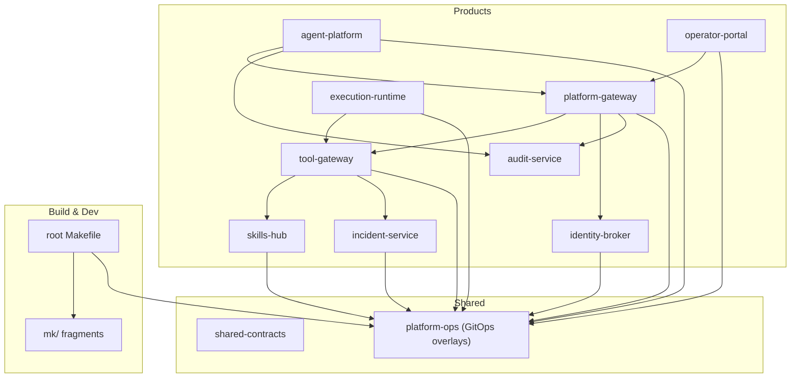
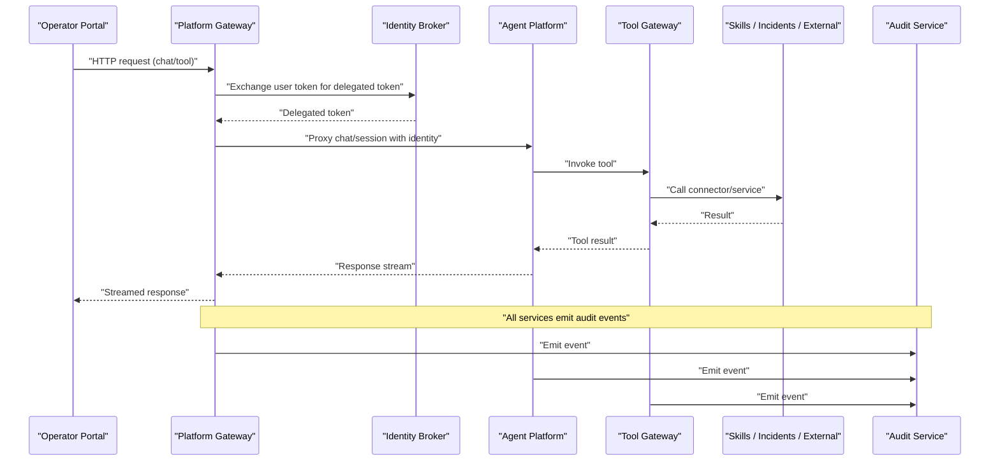
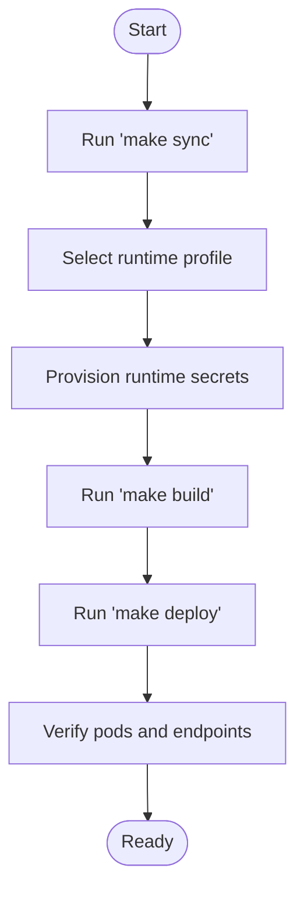
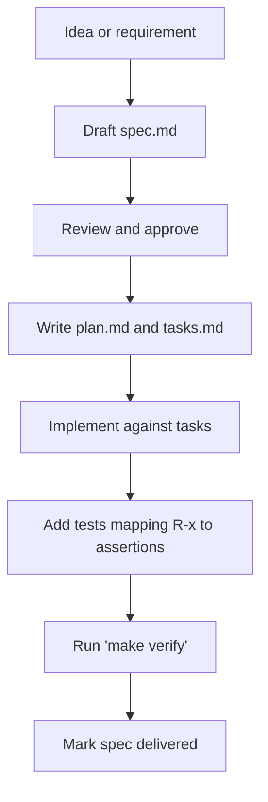
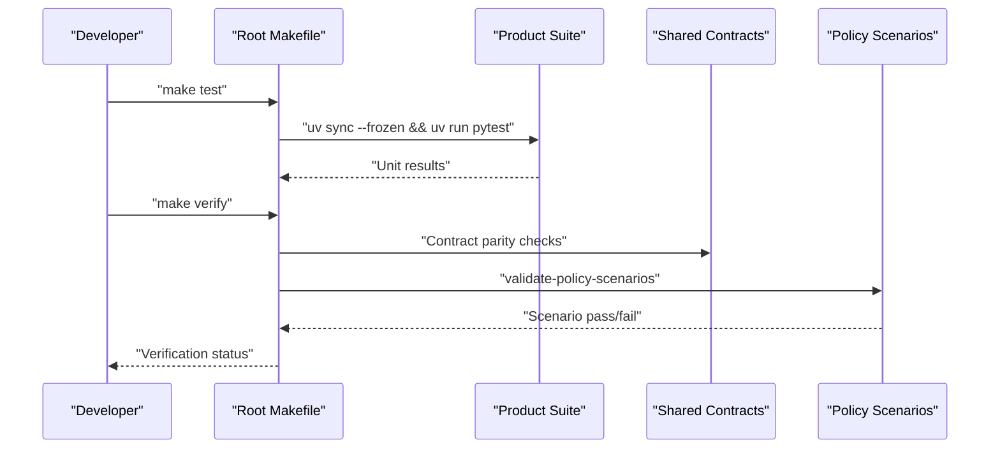
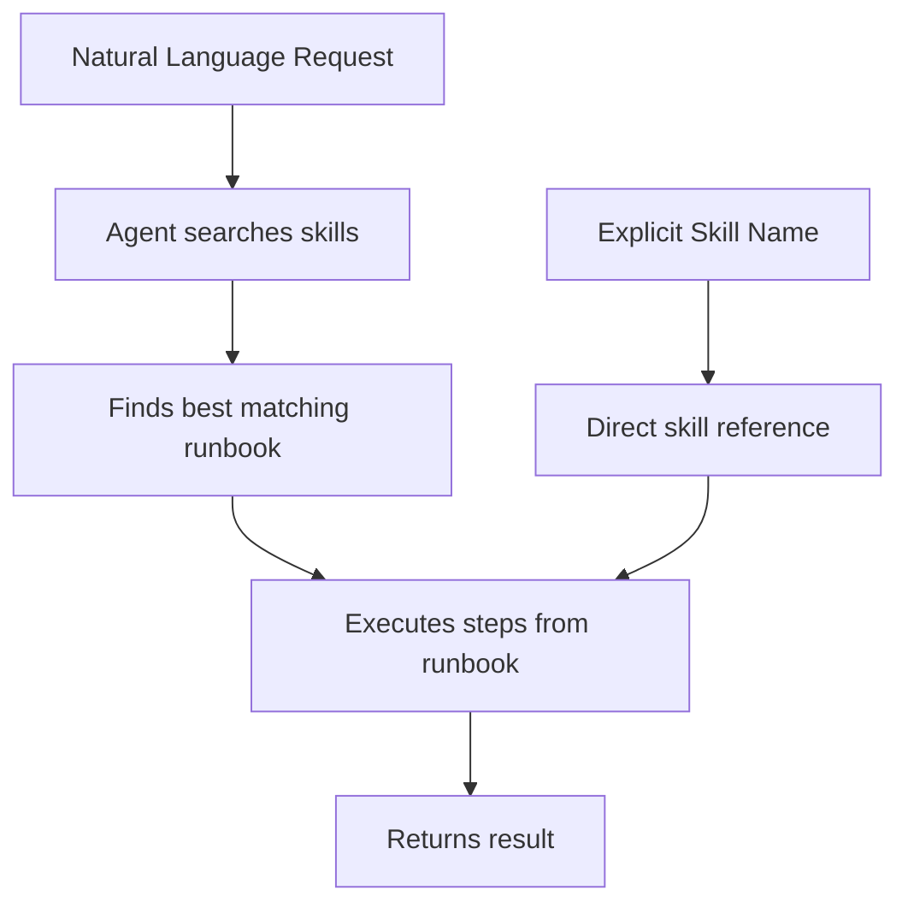
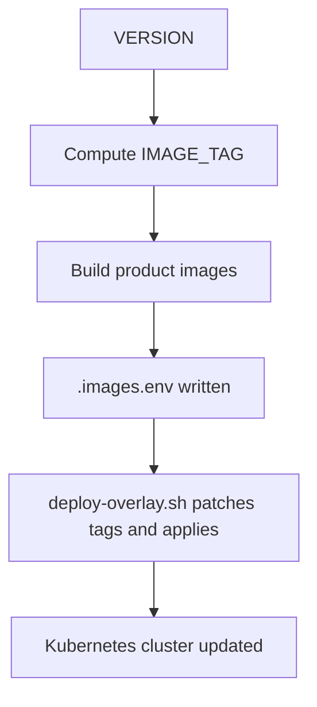
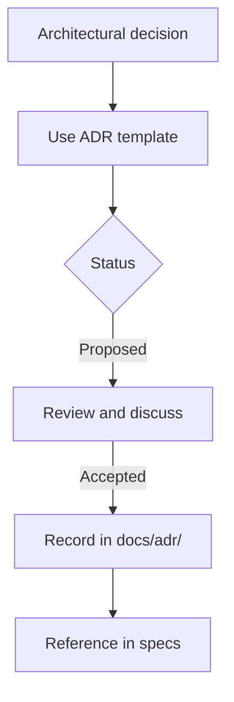
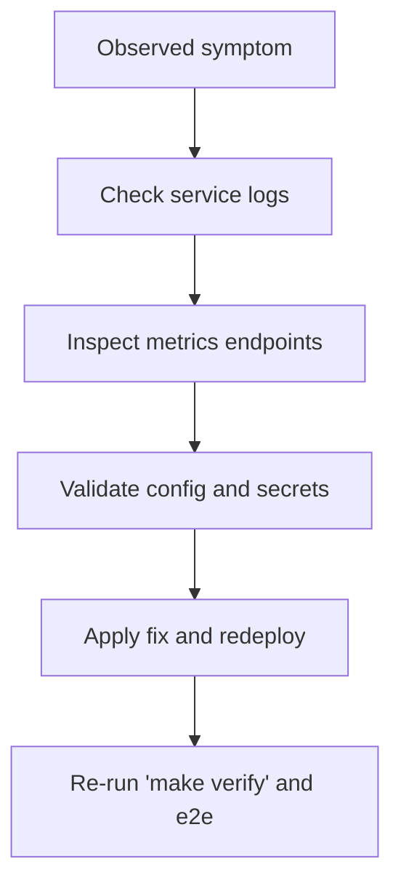
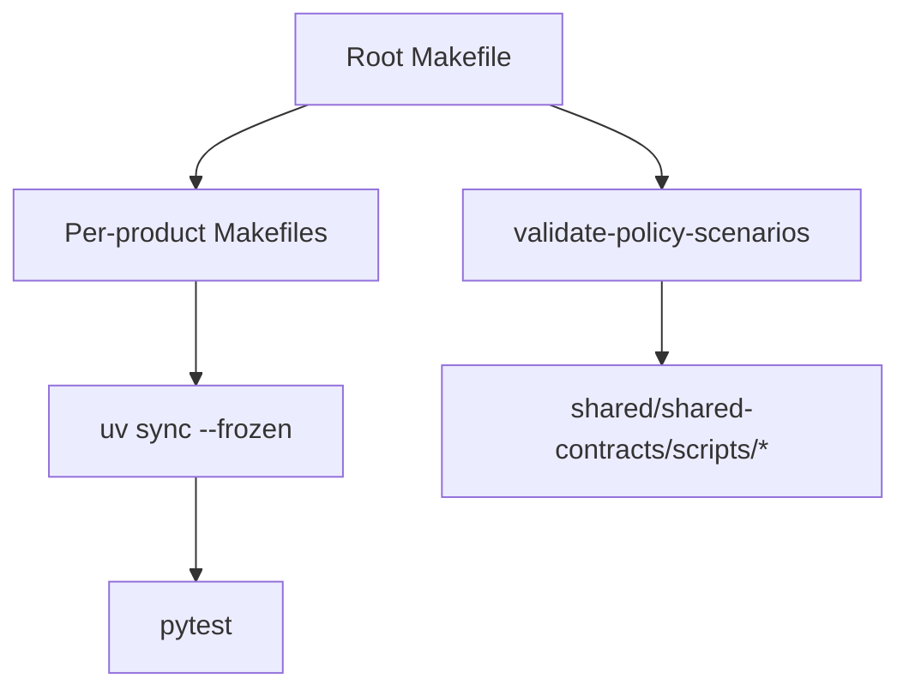

# Development Guide

<cite>
**Referenced Files in This Document**
- [README.md](file://README.md)
- [CONTRIBUTING.md](file://CONTRIBUTING.md)
- [Makefile](file://Makefile)
- [mk/defaults.mk](file://mk/defaults.mk)
- [mk/python.mk](file://mk/python.mk)
- [products/agent-platform/Makefile](file://products/agent-platform/Makefile)
- [products/agent-platform/pyproject.toml](file://products/agent-platform/pyproject.toml)
- [docs/specs/README.md](file://docs/specs/README.md)
- [docs/adr/README.md](file://docs/adr/README.md)
- [docs/adr/template.md](file://docs/adr/template.md)
- [docs/guides/getting-started.md](file://docs/guides/getting-started.md)
- [docs/guides/troubleshooting.md](file://docs/guides/troubleshooting.md)
- [docs/guides/skills-guide.md](file://docs/guides/skills-guide.md)
- [shared/platform-ops/gitops/deploy-overlay.sh](file://shared/platform-ops/gitops/deploy-overlay.sh)
- [shared/platform-ops/gitops/select-runtime-profile.sh](file://shared/platform-ops/gitops/select-runtime-profile.sh)
- [shared/platform-ops/gitops/sync-runtime-secret.sh](file://shared/platform-ops/gitops/sync-runtime-secret.sh)
- [products/platform-gateway/tests/test_policy_scenarios.py](file://products/platform-gateway/tests/test_policy_scenarios.py)
- [products/agent-platform/tests/test_app.py](file://products/agent-platform/tests/test_app.py)
- [samples/README.md](file://samples/README.md)
- [samples/acme-admin/README.md](file://samples/acme-admin/README.md)
- [samples/acme-admin/adhoc-password-reset/WALKTHROUGH.md](file://samples/acme-admin/adhoc-password-reset/WALKTHROUGH.md)
- [samples/acme-admin/password-reset/WALKTHROUGH.md](file://samples/acme-admin/password-reset/WALKTHROUGH.md)
</cite>

## Update Summary
**Changes Made**
- Updated contribution workflow section to emphasize conversational-first principles
- Enhanced sample walkthrough documentation with detailed examples
- Added guidance on presenting both conversational and deterministic forms in documentation
- Updated testing strategy to include sample verification requirements

## Table of Contents
1. Introduction
2. Project Structure
3. Core Components
4. Architecture Overview
5. Detailed Component Analysis
6. Dependency Analysis
7. Performance Considerations
8. Troubleshooting Guide
9. Conclusion
10. Appendices

## Introduction
This guide explains how to develop, test, build, and deploy the Luban AIOps platform as a contributor. It covers local environment setup, code organization principles, spec-driven development, testing strategy across unit/integration/e2e/contract layers, the Makefile-based build system with uv for dependency management, container building and deployment automation, ADR process, debugging and performance analysis techniques, and conventions for writing tests and maintaining quality.

The workspace is modular and product-oriented. Each product owns its capability, boundaries are explicit, and shared contracts live under shared/. The root Makefile orchestrates cross-cutting tasks such as verification, policy validation, overlay rendering, coordinated image builds, and deployment.

**Section sources**
- [README.md:15-46](file://README.md#L15-L46)
- [README.md:76-91](file://README.md#L76-L91)

## Project Structure
At a high level:
- products/: product-oriented services (agent-platform, platform-gateway, tool-gateway, identity-broker, audit-service, skills-hub, incident-service, execution-runtime, operator-portal).
- shared/: shared contracts, SDKs, policies, scripts, and GitOps overlays.
- docs/: architecture records, specs, guides, and release notes.
- mk/: shared Makefile fragments for Python and image builds.
- samples/: tutorial content installed into dev clusters out-of-band.

**Diagram sources**
- [Makefile:14-27](file://Makefile#L14-L27)
- [Makefile:96-124](file://Makefile#L96-L124)
- [shared/platform-ops/gitops/deploy-overlay.sh:25-44](file://shared/platform-ops/gitops/deploy-overlay.sh#L25-L44)

**Section sources**
- [README.md:15-46](file://README.md#L15-L46)
- [Makefile:14-27](file://Makefile#L14-L27)

## Core Components
- Product services implement bounded capabilities and expose APIs/tools through gateways.
- Shared contracts define schemas, policies, and scripts that bind services together.
- GitOps overlays configure runtime profiles, secrets, and service wiring for dev environments.
- The root Makefile provides unified targets for sync, test, lint, build, push, verify, deploy, e2e, and policy operations.

Key responsibilities:
- agent-platform: agent runtime, sessions, streaming, model providers, evidence store, HITL bridging.
- platform-gateway: portal-facing edge, token verification, policy enforcement, chat/session proxying, delegation.
- tool-gateway: normalized tool and connector access (MCP and external systems), browser tools, skills/incidents connectors.
- identity-broker: SSO, identity federation, group normalization, token exchange.
- audit-service: durable audit trail ingest, retention-bounded storage, permission-scoped query API.
- skills-hub: Markdown skill ingestion, validation, indexing, retrieval.
- incident-service: intake, triage, collaboration dispatch, report documents.
- execution-runtime: isolated execution workers for bounded operational actions.
- operator-portal: web UI for operators/approvers/auditors.

**Section sources**
- [README.md:24-46](file://README.md#L24-L46)

## Architecture Overview
The platform follows a gateway-mediated flow:
- The operator portal calls platform-gateway.
- platform-gateway authenticates, enforces policy, proxies chat/session requests to agent-platform, and delegates tokens via identity-broker.
- agent-platform invokes tools through tool-gateway; tool-gateway may call external systems or internal services (skills-hub, incident-service).
- All services emit audit events to audit-service.
- Execution-runtime runs bounded, signed, isolated actions when approved.

**Diagram sources**
- [Makefile:14-27](file://Makefile#L14-L27)
- [shared/platform-ops/gitops/deploy-overlay.sh:25-44](file://shared/platform-ops/gitops/deploy-overlay.sh#L25-L44)

## Detailed Component Analysis

### Local Environment Setup and Workflow
- Prerequisites include Kubernetes, kubectl, GNU make, Docker/Podman, kustomize, and uv.
- Clone the repo, run `make sync` to install dependencies per product using uv lockfiles.
- Select an LLM runtime profile, provision secrets, build images, and deploy via `make deploy`.
- Use `AUTO_LOAD_KIND=true` to auto-load images into a kind cluster after build.

**Diagram sources**
- [docs/guides/getting-started.md:20-91](file://docs/guides/getting-started.md#L20-L91)
- [shared/platform-ops/gitops/select-runtime-profile.sh:1-54](file://shared/platform-ops/gitops/select-runtime-profile.sh#L1-L54)
- [shared/platform-ops/gitops/sync-runtime-secret.sh:1-28](file://shared/platform-ops/gitops/sync-runtime-secret.sh#L1-L28)

**Section sources**
- [docs/guides/getting-started.md:6-18](file://docs/guides/getting-started.md#L6-L18)
- [docs/guides/getting-started.md:20-91](file://docs/guides/getting-started.md#L20-L91)

### Code Organization Principles
- Work within the owning product directory; avoid moving logic to shared/ unless it is genuinely reusable and dependency-light.
- Keep identity, policy, orchestration, and execution concerns separated.
- Prefer explicit APIs and contracts over hidden coupling.
- Version all products in lockstep with the platform version enforced by `make validate-version`.

**Section sources**
- [CONTRIBUTING.md:14-23](file://CONTRIBUTING.md#L14-L23)
- [CONTRIBUTING.md:33-57](file://CONTRIBUTING.md#L33-L57)

### Spec-Driven Development Process
- Qualifying changes require a spec under docs/specs/ before implementation.
- Specs have three tiers: architecture record, feature specs, living state docs.
- Each spec includes spec.md (requirements), plan.md (technical approach), tasks.md (execution checklist).
- Enforcement: `make verify` runs tests and renders overlays; contract tests bind models to shared schemas; ADR-0008 requires acceptance criteria mapped to tests and exercised samples.

**Diagram sources**
- [docs/specs/README.md:9-33](file://docs/specs/README.md#L9-L33)
- [docs/specs/README.md:53-113](file://docs/specs/README.md#L53-L113)

**Section sources**
- [docs/specs/README.md:9-33](file://docs/specs/README.md#L9-L33)
- [docs/specs/README.md:53-113](file://docs/specs/README.md#L53-L113)
- [CONTRIBUTING.md:24-31](file://CONTRIBUTING.md#L24-L31)

### Testing Strategy
- Unit tests: per-product pytest suites executed via `uv run pytest`; disabled OTLP exporters during tests to keep output clean.
- Integration tests: contract parity tests binding gateway models to shared JSON schemas; scenario harness validates policy bundles.
- E2E tests: demo scripts under shared/platform-ops/e2e run against a deployed dev cluster; use `make e2e`.
- Contract tests: enforce enum vocabulary equality between JSON schemas and consuming Pydantic Literals; policy scenarios validated via scripts.

**Diagram sources**
- [mk/python.mk:11-19](file://mk/python.mk#L11-L19)
- [Makefile:144-151](file://Makefile#L144-L151)
- [products/platform-gateway/tests/test_policy_scenarios.py:1-35](file://products/platform-gateway/tests/test_policy_scenarios.py#L1-L35)

**Section sources**
- [CONTRIBUTING.md:59-88](file://CONTRIBUTING.md#L59-L88)
- [mk/python.mk:11-19](file://mk/python.mk#L11-L19)
- [Makefile:144-151](file://Makefile#L144-L151)
- [products/platform-gateway/tests/test_policy_scenarios.py:1-35](file://products/platform-gateway/tests/test_policy_scenarios.py#L1-L35)
- [products/agent-platform/tests/test_app.py:1-52](file://products/agent-platform/tests/test_app.py#L1-L52)

### Enhanced Sample Walkthroughs and Conversational-First Approach

**Updated** The platform now emphasizes conversational-first principles in both documentation and sample implementations. Contributors should present the conversational form of a request as the primary path while providing exact, skill-naming prompts as deterministic variants for testing purposes.

#### Conversational-First Documentation Guidelines
- Present natural language requests as the primary example users would type
- Include deterministic skill-naming variants for reproducible testing
- Explain when and why to name specific skills vs. asking conversationally
- Demonstrate how the agent discovers runbooks through `skills.search`

#### Enhanced Sample Implementation
The acme-admin sample suite demonstrates this approach comprehensively:

**Diagram sources**
- [docs/guides/skills-guide.md:37-66](file://docs/guides/skills-guide.md#L37-L66)
- [samples/acme-admin/README.md:280-321](file://samples/acme-admin/README.md#L280-L321)

#### Sample Walkthrough Structure
Each sample now includes:
- **Conversational prompt**: Natural language request users would actually type
- **Deterministic variant**: Exact message for reproducible testing
- **Step-by-step verification**: Clear expectations for each interaction
- **Troubleshooting guidance**: Common issues and resolutions

**Section sources**
- [CONTRIBUTING.md:96-99](file://CONTRIBUTING.md#L96-L99)
- [docs/guides/skills-guide.md:37-66](file://docs/guides/skills-guide.md#L37-L66)
- [samples/acme-admin/README.md:280-321](file://samples/acme-admin/README.md#L280-L321)
- [samples/acme-admin/adhoc-password-reset/WALKTHROUGH.md:67-91](file://samples/acme-admin/adhoc-password-reset/WALKTHROUGH.md#L67-L91)
- [samples/acme-admin/password-reset/WALKTHROUGH.md:83-103](file://samples/acme-admin/password-reset/WALKTHROUGH.md#L83-L103)

### Build System and Deployment Automation
- Root Makefile aggregates per-product routines and owns cross-cutting tasks: sync, test, lint, base-images, build, push, overlays, verify, deploy, e2e.
- Image tagging is coordinated from the VERSION file and git metadata; `.images.env` stores built image references for deployment.
- GitOps overlays render via kustomize; deploy script patches image tags and applies manifests.
- Python dependency management uses uv with frozen lockfiles per product.

**Diagram sources**
- [Makefile:39-64](file://Makefile#L39-L64)
- [Makefile:96-124](file://Makefile#L96-L124)
- [shared/platform-ops/gitops/deploy-overlay.sh:25-44](file://shared/platform-ops/gitops/deploy-overlay.sh#L25-L44)

**Section sources**
- [Makefile:14-27](file://Makefile#L14-L27)
- [Makefile:96-124](file://Makefile#L96-L124)
- [mk/defaults.mk:20-50](file://mk/defaults.mk#L20-L50)
- [shared/platform-ops/gitops/deploy-overlay.sh:25-44](file://shared/platform-ops/gitops/deploy-overlay.sh#L25-L44)

### Architecture Decision Records (ADRs)
- ADRs capture architecturally significant decisions as immutable records.
- Write an ADR when a decision constrains multiple products, selects technologies, changes trust model, or reverses prior decisions.
- Use the provided template; statuses include proposed, accepted, superseded.
- Specs reference related ADRs; ADR index maintained in docs/adr/README.md.

**Diagram sources**
- [docs/adr/README.md:16-33](file://docs/adr/README.md#L16-L33)
- [docs/adr/template.md:1-28](file://docs/adr/template.md#L1-L28)

**Section sources**
- [docs/adr/README.md:1-50](file://docs/adr/README.md#L1-L50)
- [docs/adr/template.md:1-28](file://docs/adr/template.md#L1-L28)

### Debugging Techniques, Profiling, and Performance Analysis
- Use standard Kubernetes diagnostics: list pods, view logs, check readiness, inspect env vars, port-forward services.
- Check metrics endpoints for service health and counters (delegation, audit emit, evidence store writes).
- For telemetry issues, verify OTEL_ENABLED, endpoint paths, and auth headers; exporter errors surface in pod logs.
- For policy issues, inspect readiness fields and mounted policy files; validate canonical bundle and scenarios.
- For session/evidence issues, inspect transcript flags and evidence store degradation behavior.

**Diagram sources**
- [docs/guides/troubleshooting.md:6-28](file://docs/guides/troubleshooting.md#L6-L28)
- [docs/guides/troubleshooting.md:171-208](file://docs/guides/troubleshooting.md#L171-L208)
- [docs/guides/troubleshooting.md:551-586](file://docs/guides/troubleshooting.md#L551-L586)

**Section sources**
- [docs/guides/troubleshooting.md:6-28](file://docs/guides/troubleshooting.md#L6-L28)
- [docs/guides/troubleshooting.md:171-208](file://docs/guides/troubleshooting.md#L171-L208)
- [docs/guides/troubleshooting.md:551-586](file://docs/guides/troubleshooting.md#L551-L586)

### Guidelines for Writing Tests and Maintaining Quality
- Behavior changes and bug fixes must carry regression tests that fail without the change.
- Changes to shared contracts require contract-parity tests asserting value-set equality between JSON schemas and consuming types.
- New endpoints and tools must include deny/error path tests (auth failure, policy deny, upstream failure).
- No numeric coverage bar; reviewers judge whether risky branches are exercised.
- Per ADR-0008, each acceptance criterion maps to at least one asserting test recorded in tasks.md; any shipped sample must be exercised by its own demo script in the verification path.

**Updated** When documenting features, always include both conversational and deterministic forms:
- Primary examples should show natural language requests users would actually type
- Deterministic variants should be clearly marked as testing-specific
- Explain how the agent discovers and executes runbooks conversationally
- Ensure samples demonstrate both approaches with clear explanations

**Section sources**
- [CONTRIBUTING.md:59-88](file://CONTRIBUTING.md#L59-L88)
- [CONTRIBUTING.md:96-99](file://CONTRIBUTING.md#L96-L99)
- [docs/specs/README.md:101-113](file://docs/specs/README.md#L101-L113)
- [docs/guides/skills-guide.md:37-66](file://docs/guides/skills-guide.md#L37-L66)

### Platform Conventions
- Product package names differ from directory names (e.g., agent-platform is agent_service).
- Shared contracts live under shared/shared-contracts; product tests live under products/<name>/tests/.
- Keep shared modules small and dependency-light; prefer API/event contracts over direct coupling.
- Maintain consistent image tagging and version lockstep across products.

**Section sources**
- [README.md:47-54](file://README.md#L47-L54)
- [CONTRIBUTING.md:14-23](file://CONTRIBUTING.md#L14-L23)

## Dependency Analysis
Python dependencies are managed per product via uv and pyproject.toml. The root Makefile coordinates syncing and testing across all Python products. Shared scripts validate policies and scenarios.

**Diagram sources**
- [Makefile:77-83](file://Makefile#L77-L83)
- [mk/python.mk:11-19](file://mk/python.mk#L11-L19)
- [Makefile:144-151](file://Makefile#L144-L151)

**Section sources**
- [products/agent-platform/pyproject.toml:1-38](file://products/agent-platform/pyproject.toml#L1-L38)
- [Makefile:77-83](file://Makefile#L77-L83)
- [mk/python.mk:11-19](file://mk/python.mk#L11-L19)

## Performance Considerations
- Disable OTLP exporters during tests to avoid noise while keeping tracing active for tests that need it.
- Use readiness endpoints to detect degraded states (policy load, store backends).
- Monitor metrics for delegation exchanges, audit emit delivery, evidence store writes, and policy decisions.
- For long-running operations, consider delegated token TTL and provider rate limits.

[No sources needed since this section provides general guidance]

## Troubleshooting Guide
Common symptoms and resolutions:
- Token delegation failures: verify secrets and restart affected deployments.
- Tool list empty: check TOOL_GATEWAY_URL, tool-gateway readiness, and connector configuration.
- Portal login fails: validate OIDC configuration and Keycloak reachability.
- Stream stalls: ensure LLM provider configured and keys valid; check timeouts.
- Policy denied: inspect policy bundle and role mappings; re-sync if drifted.
- Elastic not configured: enable and configure connector.
- Image pull errors: always deploy via make deploy to patch image tags.
- Audit missing events: verify emitter URLs, client secrets, and retention settings.
- Skills search empty: check source sync status and secrets.
- Incident intake failures: verify webhook token and configuration.
- Triage stuck: check relay credentials and session availability.

**Section sources**
- [docs/guides/troubleshooting.md:32-67](file://docs/guides/troubleshooting.md#L32-L67)
- [docs/guides/troubleshooting.md:71-99](file://docs/guides/troubleshooting.md#L71-L99)
- [docs/guides/troubleshooting.md:102-135](file://docs/guides/troubleshooting.md#L102-L135)
- [docs/guides/troubleshooting.md:138-168](file://docs/guides/troubleshooting.md#L138-L168)
- [docs/guides/troubleshooting.md:171-208](file://docs/guides/troubleshooting.md#L171-L208)
- [docs/guides/troubleshooting.md:211-231](file://docs/guides/troubleshooting.md#L211-L231)
- [docs/guides/troubleshooting.md:235-258](file://docs/guides/troubleshooting.md#L235-L258)
- [docs/guides/troubleshooting.md:261-289](file://docs/guides/troubleshooting.md#L261-L289)
- [docs/guides/troubleshooting.md:314-353](file://docs/guides/troubleshooting.md#L314-L353)
- [docs/guides/troubleshooting.md:356-381](file://docs/guides/troubleshooting.md#L356-L381)
- [docs/guides/troubleshooting.md:385-410](file://docs/guides/troubleshooting.md#L385-L410)
- [docs/guides/troubleshooting.md:413-448](file://docs/guides/troubleshooting.md#L413-L448)
- [docs/guides/troubleshooting.md:450-484](file://docs/guides/troubleshooting.md#L450-L484)
- [docs/guides/troubleshooting.md:486-519](file://docs/guides/troubleshooting.md#L486-L519)
- [docs/guides/troubleshooting.md:521-549](file://docs/guides/troubleshooting.md#L521-L549)
- [docs/guides/troubleshooting.md:551-586](file://docs/guides/troubleshooting.md#L551-L586)
- [docs/guides/troubleshooting.md:588-613](file://docs/guides/troubleshooting.md#L588-L613)
- [docs/guides/troubleshooting.md:614-643](file://docs/guides/troubleshooting.md#L614-L643)
- [docs/guides/troubleshooting.md:645-672](file://docs/guides/troubleshooting.md#L645-L672)
- [docs/guides/troubleshooting.md:674-696](file://docs/guides/troubleshooting.md#L674-L696)
- [docs/guides/troubleshooting.md:698-718](file://docs/guides/troubleshooting.md#L698-L718)
- [docs/guides/troubleshooting.md:720-783](file://docs/guides/troubleshooting.md#L720-L783)

## Conclusion
This guide consolidates the development workflow, testing strategy, build and deployment automation, spec-driven development, ADR process, debugging techniques, and quality conventions for the Luban AIOps platform. Contributors should follow spec-driven practices, maintain contract parity, exercise error paths in tests, and rely on the root Makefile and GitOps overlays for reproducible builds and deployments.

**Updated** The platform now emphasizes conversational-first principles throughout the development process. When contributing new features or updating existing ones, present natural language interactions as the primary user experience while providing deterministic variants for testing and reproducibility.

[No sources needed since this section summarizes without analyzing specific files]

## Appendices

### Quick Commands Reference
- `make sync`: Install/refresh dependencies for every Python product.
- `make test`: Run every product test suite.
- `make verify`: Full pre-commit gate (tests, overlays, policy validation, scenarios, version lockstep).
- `make build`: Build all images with coordinated tag and write .images.env.
- `make deploy`: Apply overlay, patch images, wait for rollout, provision secrets.
- `make e2e`: Run e2e demo scripts against deployed dev cluster.
- `make policy-diff CANDIDATE=<path>`: Compare candidate policy bundle against canonical.
- `make validate-version`: Enforce lockstep versions across products and portal.

**Section sources**
- [Makefile:77-183](file://Makefile#L77-L183)

### Sample Development Guidelines

**New Section** The platform provides comprehensive sample development guidelines that demonstrate the conversational-first approach:

#### Sample Structure
Each sample follows a consistent pattern:
- `README.md`: Tutorial walkthrough explaining the automation pattern
- `WALKTHROUGH.md`: Live, click-by-click run against a cluster
- `skill/`: Skill document(s) installed by `make deploy-samples`
- `demo/`: Demo/test scripts for automated verification

#### Conversational-First Pattern
Samples demonstrate both approaches:
1. **Primary path**: Natural language requests users would actually type
2. **Deterministic variant**: Exact messages for reproducible testing
3. **Explanation**: Clear guidance on when to use each approach

**Section sources**
- [samples/README.md:81-167](file://samples/README.md#L81-L167)
- [samples/acme-admin/README.md:280-321](file://samples/acme-admin/README.md#L280-L321)