# End-to-End Testing

<cite>
**Referenced Files in This Document**
- [Makefile](file://Makefile)
- [browser-check-demo.sh](file://shared/platform-ops/e2e/browser-check-demo.sh)
- [documents-demo.sh](file://shared/platform-ops/e2e/documents-demo.sh)
- [incident-demo.sh](file://shared/platform-ops/e2e/incident-demo.sh)
- [mutating-demo.sh](file://shared/platform-ops/e2e/mutating-demo.sh)
- [skills-demo.sh](file://shared/platform-ops/e2e/skills-demo.sh)
- [App.studio.test.tsx](file://products/operator-portal/web-ui/app/src/__tests__/App.studio.test.tsx)
- [sessions.test.ts](file://products/operator-portal/web-ui/app/src/api/__tests__/sessions.test.ts)
- [ConfirmationCard.test.tsx](file://products/operator-portal/web-ui/app/src/chat/__tests__/ConfirmationCard.test.tsx)
- [config.py](file://products/tool-gateway/src/tool-gateway/core/config.py)
- [browser_sessions.py](file://products/tool-gateway/src/tool-gateway/tools/browser_sessions.py)
- [test_browser_connector.py](file://products/tool-gateway/tests/test_browser_connector.py)
</cite>

## Table of Contents
1. Introduction
2. Project Structure
3. Core Components
4. Architecture Overview
5. Detailed Component Analysis
6. Dependency Analysis
7. Performance Considerations
8. Troubleshooting Guide
9. Conclusion

## Introduction
This document explains the end-to-end testing strategy for the platform, covering full workflow validation across browser automation, document workflows, incident triage, mutating operations, and skills management. It also documents the React component test suite used to validate portal behavior, including navigation, workspace scoping, approval flows, and session APIs. Guidance is provided for environment setup (Kubernetes cluster preparation, service deployment, and test data seeding), authenticated user flows, file uploads, real-time updates, error scenarios, reporting, debugging failed tests, and maintaining reliable suites. Where applicable, performance benchmarking and load testing approaches are outlined to validate scalability under realistic usage patterns.

## Project Structure
The repository provides:
- Shell-based E2E demo scripts under shared/platform-ops/e2e that exercise live services via HTTP and kubectl against a deployed dev cluster.
- A React unit/integration test suite under products/operator-portal/web-ui/app/src/__tests__ and related subdirectories that validates UI wiring, state handling, and API client behavior using Vitest and Testing Library.
- A root Makefile that orchestrates builds, deploys, and runs the E2E demos as a single gate.

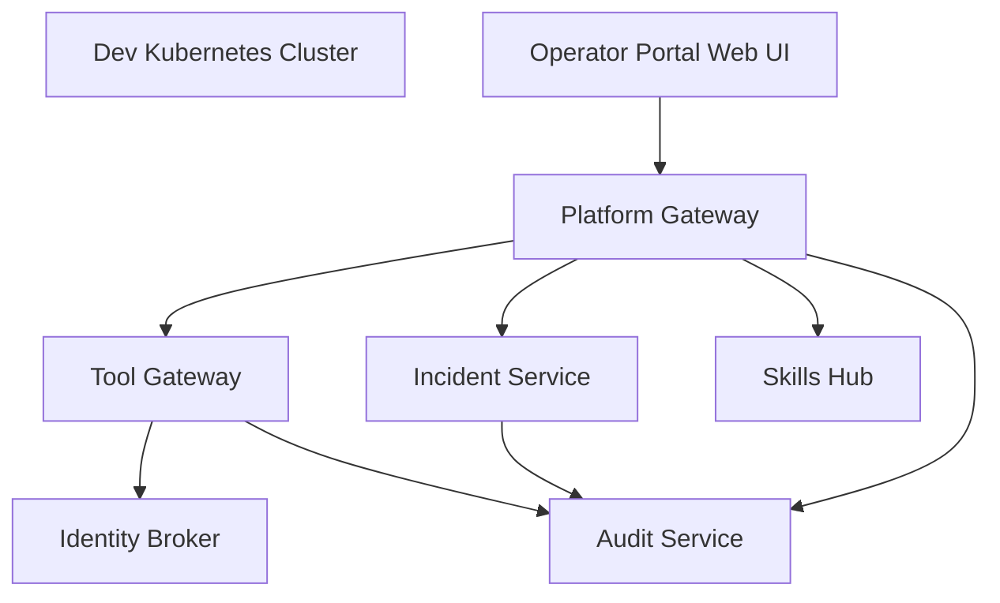

**Diagram sources**
- [Makefile:171-183](file://Makefile#L171-L183)
- [browser-check-demo.sh:70-133](file://shared/platform-ops/e2e/browser-check-demo.sh#L70-L133)
- [documents-demo.sh:70-124](file://shared/platform-ops/e2e/documents-demo.sh#L70-L124)
- [incident-demo.sh:43-132](file://shared/platform-ops/e2e/incident-demo.sh#L43-L132)
- [mutating-demo.sh:80-152](file://shared/platform-ops/e2e/mutating-demo.sh#L80-L152)
- [skills-demo.sh:40-83](file://shared/platform-ops/e2e/skills-demo.sh#L40-L83)

**Section sources**
- [Makefile:14-34](file://Makefile#L14-L34)
- [Makefile:178-204](file://Makefile#L178-L204)

## Core Components
- E2E demo scripts:
  - Browser web-check smoke test validates tool discovery, origin allowlisting, CDP connectivity, and an optional chat leg with HITL approval.
  - Documents demo validates creation, publish, read-scoping, anti-enumeration, and audit trail for shift summaries.
  - Incident demo validates webhook intake, deduplication, resolution, visibility, operator triage, and audit dispatch.
  - Mutating tools demo validates deny-by-default posture, policy gating, RBAC checks, and an optional HITL flow with signed execution receipts.
  - Skills demo validates source sync status, deterministic search ranking, and agent invocation of skills.search during chat.
- React test suite:
  - App navigation and workspace wiring tests ensure Studio gating, mode-scoped workspaces, and view routing correctness.
  - Session API client tests assert request shapes, error propagation, and session_type scoping.
  - Confirmation card tests assert tier badges, decision surfaces, receipt rendering, redaction, and flow replay behavior.

**Section sources**
- [browser-check-demo.sh:1-59](file://shared/platform-ops/e2e/browser-check-demo.sh#L1-L59)
- [documents-demo.sh:1-38](file://shared/platform-ops/e2e/documents-demo.sh#L1-L38)
- [incident-demo.sh:1-29](file://shared/platform-ops/e2e/incident-demo.sh#L1-L29)
- [mutating-demo.sh:1-63](file://shared/platform-ops/e2e/mutating-demo.sh#L1-L63)
- [skills-demo.sh:1-26](file://shared/platform-ops/e2e/skills-demo.sh#L1-L26)
- [App.studio.test.tsx:1-16](file://products/operator-portal/web-ui/app/src/__tests__/App.studio.test.tsx#L1-L16)
- [sessions.test.ts:1-13](file://products/operator-portal/web-ui/app/src/api/__tests__/sessions.test.ts#L1-L13)
- [ConfirmationCard.test.tsx:1-12](file://products/operator-portal/web-ui/app/src/chat/__tests__/ConfirmationCard.test.tsx#L1-L12)

## Architecture Overview
The E2E scripts drive a realistic user journey by:
- Obtaining tokens from the identity broker and delegating them to tool-gateway where required.
- Interacting with platform-gateway endpoints for sessions, chat streaming, approvals, documents, incidents, and audits.
- Executing cluster-side calls via kubectl exec to reach tool-gateway or service pods directly for control-plane assertions.
- Validating sidecar connectivity (CDP) and feature flags through runtime configuration.

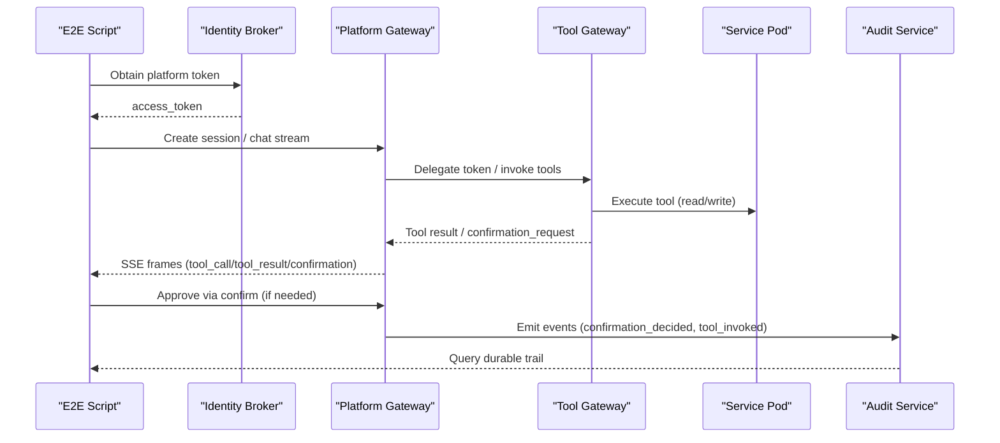

**Diagram sources**
- [browser-check-demo.sh:96-133](file://shared/platform-ops/e2e/browser-check-demo.sh#L96-L133)
- [mutating-demo.sh:111-152](file://shared/platform-ops/e2e/mutating-demo.sh#L111-L152)
- [incident-demo.sh:141-168](file://shared/platform-ops/e2e/incident-demo.sh#L141-L168)
- [skills-demo.sh:91-124](file://shared/platform-ops/e2e/skills-demo.sh#L91-L124)

## Detailed Component Analysis

### E2E Framework and Environment Setup
- Prerequisites:
  - A running Kubernetes cluster with the dev-k8s overlay deployed.
  - Port forwards for identity-service and platform-gateway when running chat legs.
  - Runtime secrets and config maps provisioned (browser credentials, webhook tokens, query clients).
- Build and deploy:
  - Use the root Makefile targets to build images, render overlays, and deploy the platform.
  - Run samples separately so base overlays remain unmodified.
- Running E2E:
  - The e2e target executes the demo scripts sequentially and reports pass/fail.

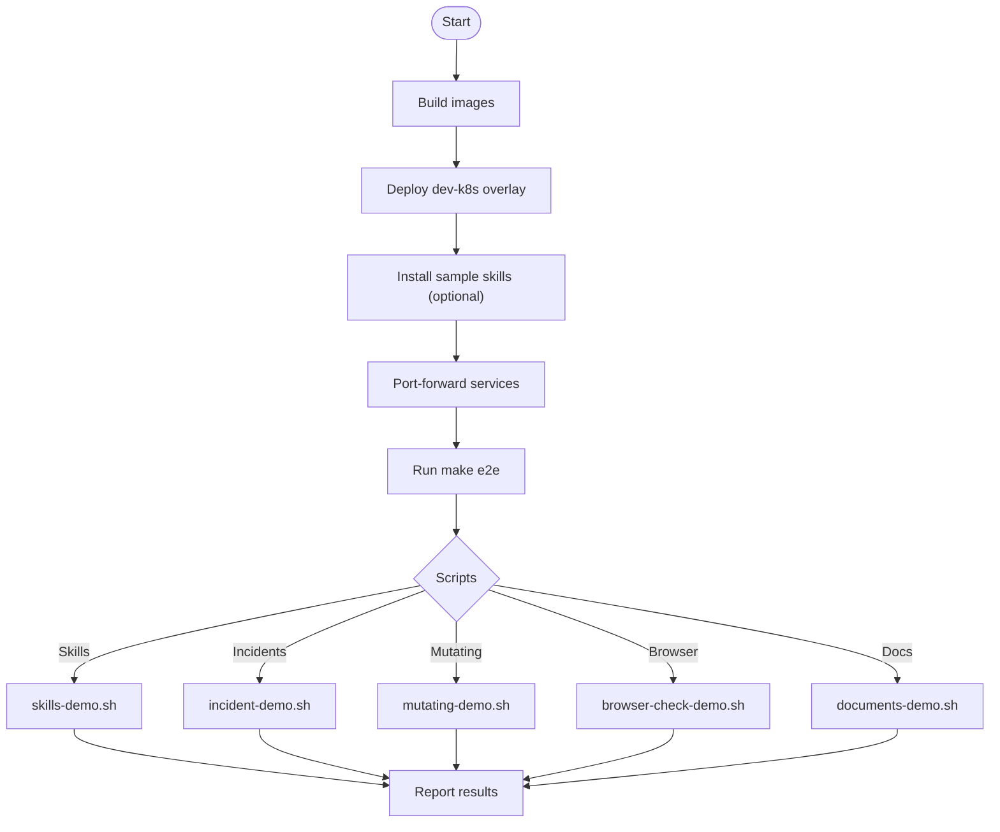

**Diagram sources**
- [Makefile:96-124](file://Makefile#L96-L124)
- [Makefile:181-204](file://Makefile#L181-L204)

**Section sources**
- [Makefile:178-204](file://Makefile#L178-L204)
- [browser-check-demo.sh:43-58](file://shared/platform-ops/e2e/browser-check-demo.sh#L43-L58)
- [documents-demo.sh:26-38](file://shared/platform-ops/e2e/documents-demo.sh#L26-L38)
- [incident-demo.sh:16-28](file://shared/platform-ops/e2e/incident-demo.sh#L16-L28)
- [mutating-demo.sh:48-62](file://shared/platform-ops/e2e/mutating-demo.sh#L48-L62)
- [skills-demo.sh:13-25](file://shared/platform-ops/e2e/skills-demo.sh#L13-L25)

### Browser Automation Testing (Web Tools and CDP)
- Discovery and risk tiers:
  - When disabled, no web.* tools appear; invoke fails closed with TOOL_NOT_FOUND.
  - When enabled, baseline tools are registered with correct risk levels; off-allowlist origins are denied server-side.
- CDP connectivity:
  - The gateway pod must reach the Chromium sidecar’s CDP endpoint to navigate, snapshot, screenshot, and interact.
- Optional chat leg:
  - Creates a session, streams a message that triggers web.* tools, parks a confirmation_request for write-tier actions, approves via confirm, and asserts the resumed turn completes with operational outcomes and durable receipts.

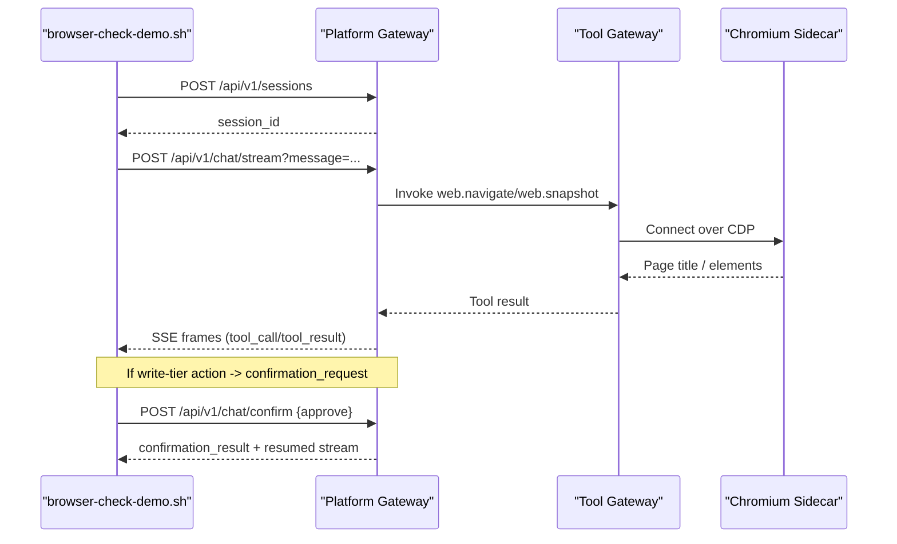

**Diagram sources**
- [browser-check-demo.sh:135-227](file://shared/platform-ops/e2e/browser-check-demo.sh#L135-L227)
- [browser-check-demo.sh:229-343](file://shared/platform-ops/e2e/browser-check-demo.sh#L229-L343)

**Section sources**
- [browser-check-demo.sh:10-41](file://shared/platform-ops/e2e/browser-check-demo.sh#L10-L41)
- [browser-check-demo.sh:140-227](file://shared/platform-ops/e2e/browser-check-demo.sh#L140-L227)
- [browser-check-demo.sh:229-343](file://shared/platform-ops/e2e/browser-check-demo.sh#L229-L343)
- [config.py:17-24](file://products/tool-gateway/src/tool-gateway/core/config.py#L17-L24)
- [browser_sessions.py:285-307](file://products/tool-gateway/src/tool-gateway/tools/browser_sessions.py#L285-L307)
- [test_browser_connector.py:532-555](file://products/tool-gateway/tests/test_browser_connector.py#L532-L555)

### Operations Document Repository Workflow
- Roles and permissions:
  - Observer cannot create documents; owner creates draft citing a session; reader gets 404 until published.
- Draft lifecycle:
  - Draft includes deterministic handover section and counts-only summary; publish flips state and is one-way (re-publish returns conflict).
- Visibility and audit:
  - Published listing is envelope-only with summary; full content fetches are audited; cross-owner reads are recorded.
- Session rename:
  - Owner can rename; foreign callers get 404; auditors get 403 on update attempts.

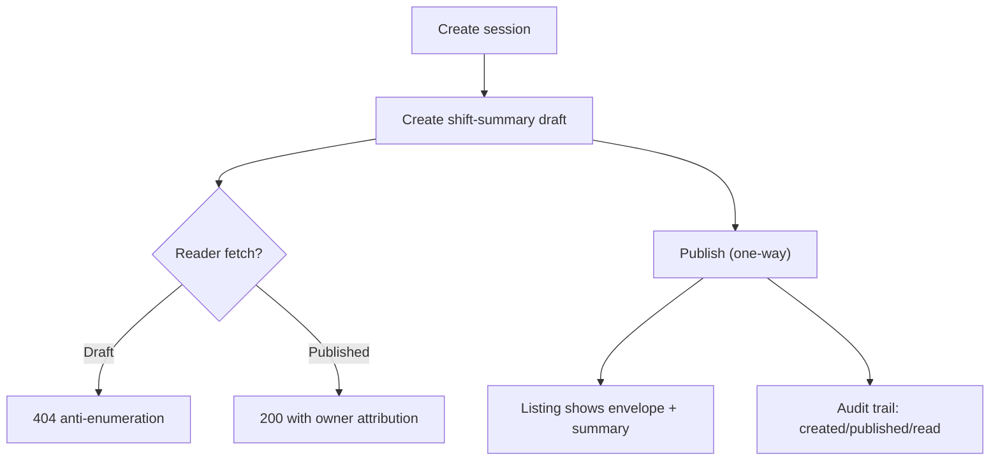

**Diagram sources**
- [documents-demo.sh:99-178](file://shared/platform-ops/e2e/documents-demo.sh#L99-L178)
- [documents-demo.sh:180-234](file://shared/platform-ops/e2e/documents-demo.sh#L180-L234)

**Section sources**
- [documents-demo.sh:1-38](file://shared/platform-ops/e2e/documents-demo.sh#L1-L38)
- [documents-demo.sh:99-178](file://shared/platform-ops/e2e/documents-demo.sh#L99-L178)
- [documents-demo.sh:180-234](file://shared/platform-ops/e2e/documents-demo.sh#L180-L234)

### Incident Triage and Collaboration
- Webhook intake:
  - Rejects missing/bad bearer tokens; accepts valid payloads to create incidents; duplicates by groupKey; resolves on resolved status.
- Visibility:
  - Platform caller credential can list incidents via the same query surface the portal uses.
- Operator triage:
  - Through platform-gateway, triage produces a validated report and dispatches to audit connector; durable trail carries incident_triaged.

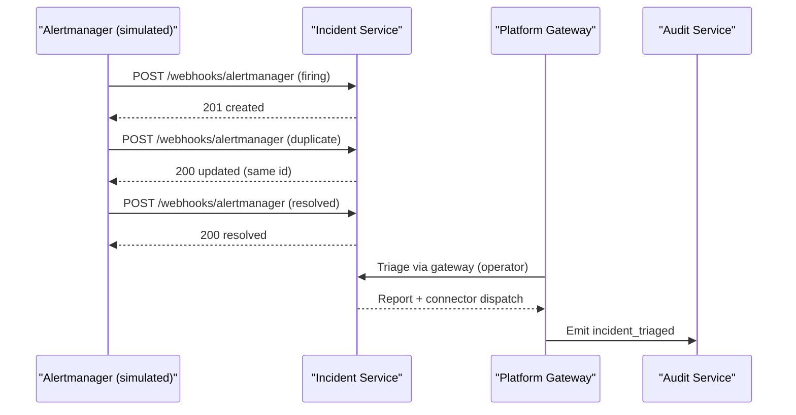

**Diagram sources**
- [incident-demo.sh:63-132](file://shared/platform-ops/e2e/incident-demo.sh#L63-L132)
- [incident-demo.sh:141-195](file://shared/platform-ops/e2e/incident-demo.sh#L141-L195)

**Section sources**
- [incident-demo.sh:1-29](file://shared/platform-ops/e2e/incident-demo.sh#L1-L29)
- [incident-demo.sh:63-132](file://shared/platform-ops/e2e/incident-demo.sh#L63-L132)
- [incident-demo.sh:141-195](file://shared/platform-ops/e2e/incident-demo.sh#L141-L195)

### Mutating Operations and HITL Approval
- Deny-by-default posture:
  - Without enabling mutating tools, k8s.delete_pod is absent from discovery and invokes fail closed; service account lacks delete RBAC.
- Opt-in posture:
  - Discovery exposes write-tier tool; observer denied by policy; operator admitted but connector-level errors expected for nonexistent resources.
- HITL leg (opt-in):
  - Chat stream parks confirmation_request with risk_level=write; self-approval rejected; designated approver approves; durable trail records confirmation_decided and tool_invoked; session detail shows approved card with signed receipt; inbox lists decided item; second approve returns already_resolved.

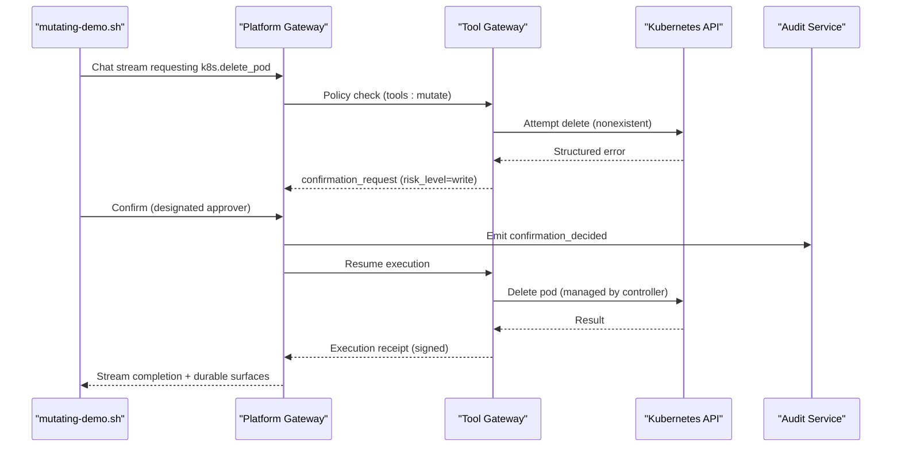

**Diagram sources**
- [mutating-demo.sh:154-244](file://shared/platform-ops/e2e/mutating-demo.sh#L154-L244)
- [mutating-demo.sh:246-504](file://shared/platform-ops/e2e/mutating-demo.sh#L246-L504)

**Section sources**
- [mutating-demo.sh:1-63](file://shared/platform-ops/e2e/mutating-demo.sh#L1-L63)
- [mutating-demo.sh:154-244](file://shared/platform-ops/e2e/mutating-demo.sh#L154-L244)
- [mutating-demo.sh:246-504](file://shared/platform-ops/e2e/mutating-demo.sh#L246-L504)

### Skills Management and Search Ranking
- Source synchronization:
  - Status endpoint verifies both sample sources synced without errors.
- Deterministic ranking:
  - Search for alert name returns the matching runbook first; top match is validated.
- Agent invocation:
  - Chat stream includes skills.search tool_call and corresponding tool_result frame pair.

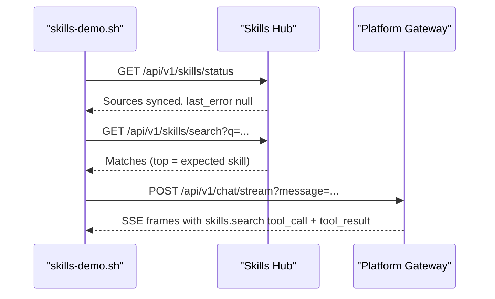

**Diagram sources**
- [skills-demo.sh:40-83](file://shared/platform-ops/e2e/skills-demo.sh#L40-L83)
- [skills-demo.sh:91-124](file://shared/platform-ops/e2e/skills-demo.sh#L91-L124)

**Section sources**
- [skills-demo.sh:1-26](file://shared/platform-ops/e2e/skills-demo.sh#L1-L26)
- [skills-demo.sh:40-83](file://shared/platform-ops/e2e/skills-demo.sh#L40-L83)
- [skills-demo.sh:91-124](file://shared/platform-ops/e2e/skills-demo.sh#L91-L124)

### React Component Testing Approach
- Navigation and workspace wiring:
  - Tests assert Studio entry gating, operation vs development workspace scoping, and view routing correctness.
- Inbox refresh wiring:
  - Decision callback refreshes both workspaces to keep panels current after approvals.
- View parameters:
  - Documents, Incidents, Settings wired to operation workspace; ChatView parameterized by mode.

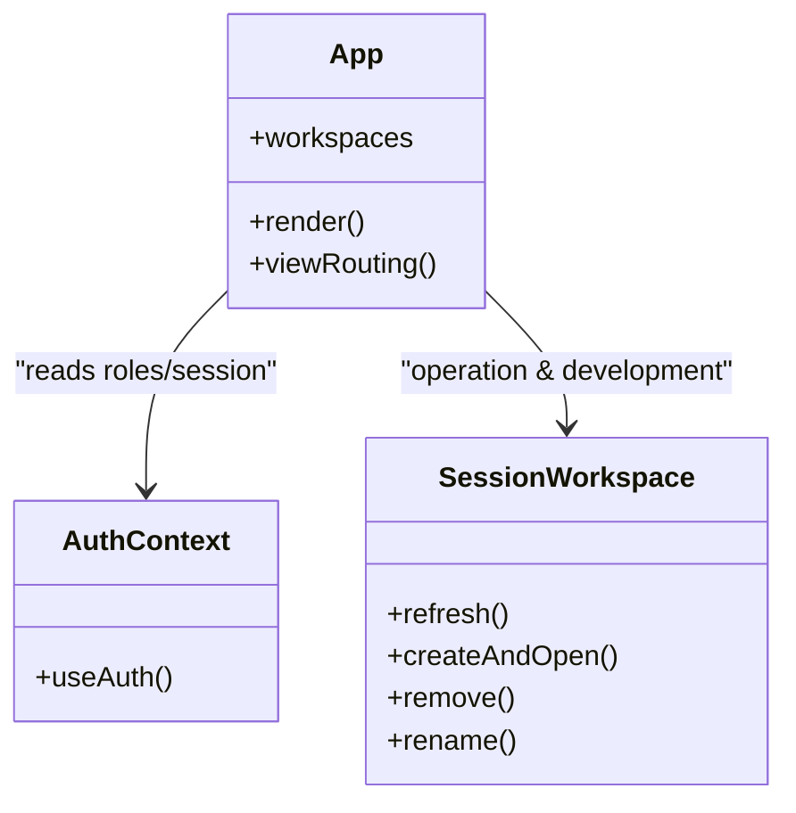

**Diagram sources**
- [App.studio.test.tsx:17-32](file://products/operator-portal/web-ui/app/src/__tests__/App.studio.test.tsx#L17-L32)
- [App.studio.test.tsx:104-159](file://products/operator-portal/web-ui/app/src/__tests__/App.studio.test.tsx#L104-L159)
- [App.studio.test.tsx:166-335](file://products/operator-portal/web-ui/app/src/__tests__/App.studio.test.tsx#L166-L335)

**Section sources**
- [App.studio.test.tsx:1-16](file://products/operator-portal/web-ui/app/src/__tests__/App.studio.test.tsx#L1-L16)
- [App.studio.test.tsx:166-335](file://products/operator-portal/web-ui/app/src/__tests__/App.studio.test.tsx#L166-L335)

### API Client and Real-Time Updates
- Session API client:
  - Asserts request paths, body shapes (including session_type and skill_target), and error propagation with structured details.
- Real-time updates:
  - E2E scripts consume SSE streams and assert frame types (tool_call, tool_result, confirmation_request, confirmation_result).
  - React tests mock hooks and verify UI reacts to decisions and workspace changes.

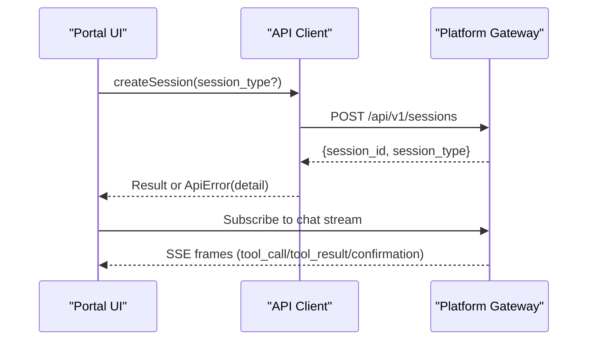

**Diagram sources**
- [sessions.test.ts:46-112](file://products/operator-portal/web-ui/app/src/api/__tests__/sessions.test.ts#L46-L112)
- [sessions.test.ts:114-183](file://products/operator-portal/web-ui/app/src/api/__tests__/sessions.test.ts#L114-L183)
- [sessions.test.ts:185-259](file://products/operator-portal/web-ui/app/src/api/__tests__/sessions.test.ts#L185-L259)

**Section sources**
- [sessions.test.ts:1-13](file://products/operator-portal/web-ui/app/src/api/__tests__/sessions.test.ts#L1-L13)
- [sessions.test.ts:46-112](file://products/operator-portal/web-ui/app/src/api/__tests__/sessions.test.ts#L46-L112)
- [sessions.test.ts:114-183](file://products/operator-portal/web-ui/app/src/api/__tests__/sessions.test.ts#L114-L183)
- [sessions.test.ts:185-259](file://products/operator-portal/web-ui/app/src/api/__tests__/sessions.test.ts#L185-L259)

### Confirmation Cards and Signed Receipts
- Tier badges and decision surfaces:
  - Tier_1 (operator confirmation) vs tier_2 (approver required); non-deciders see read-only cards.
- Execution receipts:
  - Decided cards show status, digest-match state, and rejection reasons when present.
- Flow replay:
  - Graduated flows render as a single decision surface with per-call audit context.

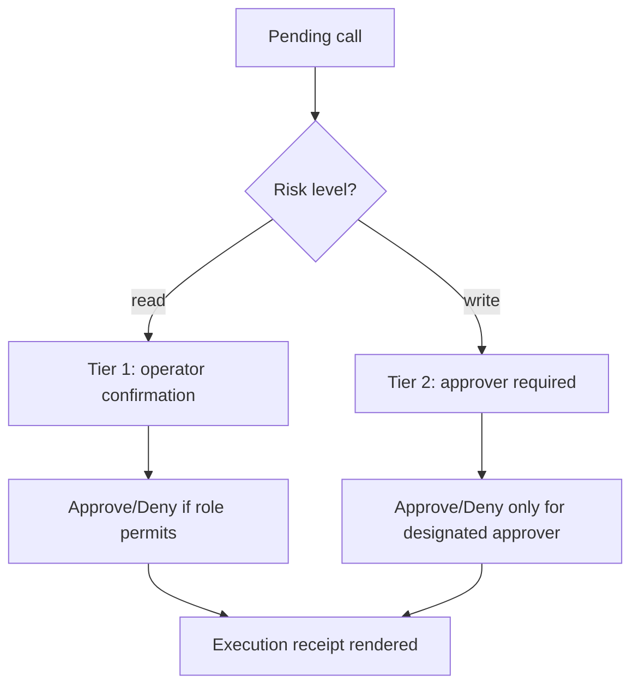

**Diagram sources**
- [ConfirmationCard.test.tsx:55-103](file://products/operator-portal/web-ui/app/src/chat/__tests__/ConfirmationCard.test.tsx#L55-L103)
- [ConfirmationCard.test.tsx:105-200](file://products/operator-portal/web-ui/app/src/chat/__tests__/ConfirmationCard.test.tsx#L105-L200)
- [ConfirmationCard.test.tsx:533-621](file://products/operator-portal/web-ui/app/src/chat/__tests__/ConfirmationCard.test.tsx#L533-L621)

**Section sources**
- [ConfirmationCard.test.tsx:1-12](file://products/operator-portal/web-ui/app/src/chat/__tests__/ConfirmationCard.test.tsx#L1-L12)
- [ConfirmationCard.test.tsx:55-103](file://products/operator-portal/web-ui/app/src/chat/__tests__/ConfirmationCard.test.tsx#L55-L103)
- [ConfirmationCard.test.tsx:105-200](file://products/operator-portal/web-ui/app/src/chat/__tests__/ConfirmationCard.test.tsx#L105-L200)
- [ConfirmationCard.test.tsx:533-621](file://products/operator-portal/web-ui/app/src/chat/__tests__/ConfirmationCard.test.tsx#L533-L621)

## Dependency Analysis
- E2E scripts depend on:
  - Identity broker for token issuance and delegation.
  - Platform gateway for sessions, chat streaming, approvals, documents, incidents, and audit queries.
  - Tool gateway for tool discovery and invocation; may connect to CDP sidecar for browser tools.
  - Services (skills-hub, incident-service) for domain-specific capabilities.
- React tests depend on:
  - Mocked auth context and session workspace to isolate UI logic.
  - Stubbed fetch to assert API client behavior and error propagation.

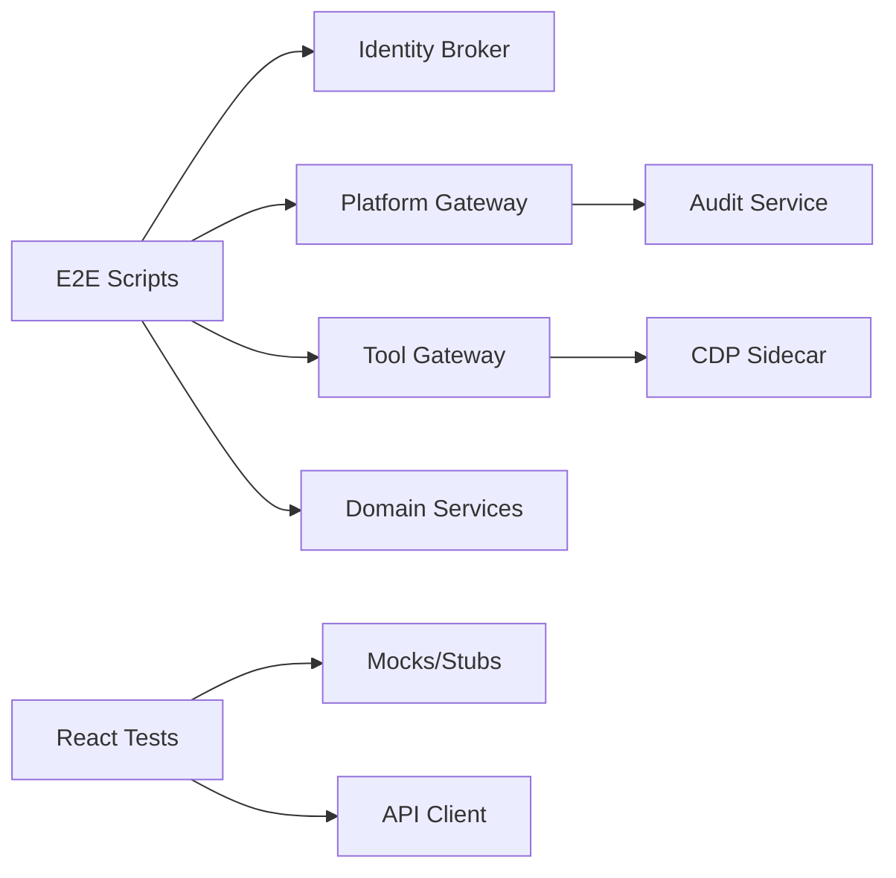

**Diagram sources**
- [browser-check-demo.sh:96-133](file://shared/platform-ops/e2e/browser-check-demo.sh#L96-L133)
- [mutating-demo.sh:111-152](file://shared/platform-ops/e2e/mutating-demo.sh#L111-L152)
- [incident-demo.sh:141-168](file://shared/platform-ops/e2e/incident-demo.sh#L141-L168)
- [skills-demo.sh:91-124](file://shared/platform-ops/e2e/skills-demo.sh#L91-L124)
- [App.studio.test.tsx:17-32](file://products/operator-portal/web-ui/app/src/__tests__/App.studio.test.tsx#L17-L32)
- [sessions.test.ts:20-44](file://products/operator-portal/web-ui/app/src/api/__tests__/sessions.test.ts#L20-L44)

**Section sources**
- [browser-check-demo.sh:96-133](file://shared/platform-ops/e2e/browser-check-demo.sh#L96-L133)
- [mutating-demo.sh:111-152](file://shared/platform-ops/e2e/mutating-demo.sh#L111-L152)
- [incident-demo.sh:141-168](file://shared/platform-ops/e2e/incident-demo.sh#L141-L168)
- [skills-demo.sh:91-124](file://shared/platform-ops/e2e/skills-demo.sh#L91-L124)
- [App.studio.test.tsx:17-32](file://products/operator-portal/web-ui/app/src/__tests__/App.studio.test.tsx#L17-L32)
- [sessions.test.ts:20-44](file://products/operator-portal/web-ui/app/src/api/__tests__/sessions.test.ts#L20-L44)

## Performance Considerations
- E2E script timing:
  - Streams and long-running operations use timeouts; tune max-time values for stability under load.
- Browser automation:
  - CDP connection and page interactions can be latency-sensitive; ensure sidecar readiness and resource limits are appropriate.
- Load testing approach:
  - Reproduce realistic usage by scripting concurrent sessions and tool invocations against the gateway while monitoring audit events and service metrics.
  - Validate throughput and error rates under sustained load; adjust timeouts and concurrency to reflect production patterns.
- Benchmarking:
  - Measure time-to-first-frame, confirmation round-trip, and tool execution latency across different roles and tool categories.

[No sources needed since this section provides general guidance]

## Troubleshooting Guide
- Common failures:
  - Unauthenticated requests return 401; ensure tokens are obtained and delegated correctly.
  - Feature flags:
    - Browser tools disabled: expect no web.* tools and TOOL_NOT_FOUND on invoke.
    - Mutating tools disabled: expect absence of k8s.delete_pod and TOOL_NOT_FOUND on invoke.
  - Origin allowlist:
    - Off-allowlist navigation denied server-side; verify target URL is permitted.
  - HITL bridging:
    - If AGENT_HITL_CONFIRM_TIMEOUT is zero, chat legs requiring HITL cannot run.
- Debugging steps:
  - Inspect port forwards and service reachability.
  - Check runtime config and secrets for required entries.
  - Query audit events to trace confirmation_decided and tool_invoked events.
  - For browser tools, verify CDP endpoint accessibility from the gateway pod.

**Section sources**
- [browser-check-demo.sh:70-94](file://shared/platform-ops/e2e/browser-check-demo.sh#L70-L94)
- [browser-check-demo.sh:135-167](file://shared/platform-ops/e2e/browser-check-demo.sh#L135-L167)
- [browser-check-demo.sh:193-227](file://shared/platform-ops/e2e/browser-check-demo.sh#L193-L227)
- [mutating-demo.sh:100-186](file://shared/platform-ops/e2e/mutating-demo.sh#L100-L186)
- [incident-demo.sh:63-78](file://shared/platform-ops/e2e/incident-demo.sh#L63-L78)
- [documents-demo.sh:99-105](file://shared/platform-ops/e2e/documents-demo.sh#L99-L105)

## Conclusion
The platform’s E2E framework combines shell-driven scripts against a live Kubernetes cluster with targeted React tests to validate both system-wide workflows and UI behavior. The scripts enforce security postures (deny-by-default, origin allowlists, policy gates), validate real-time collaboration (HITL approvals, SSE streams), and ensure durability (audit trails, signed receipts). The React suite ensures consistent navigation, workspace scoping, and robust error handling in the portal. Together, these layers provide confidence in full-platform functionality, reliability, and safety under realistic usage patterns.

[No sources needed since this section summarizes without analyzing specific files]