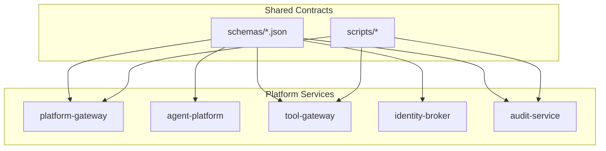
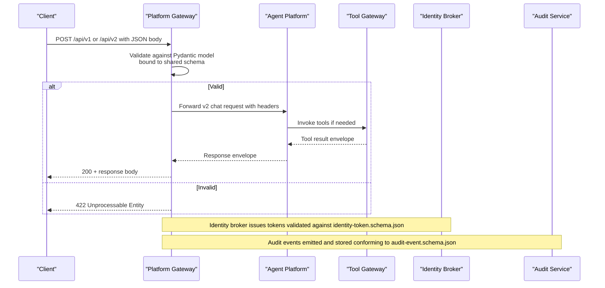
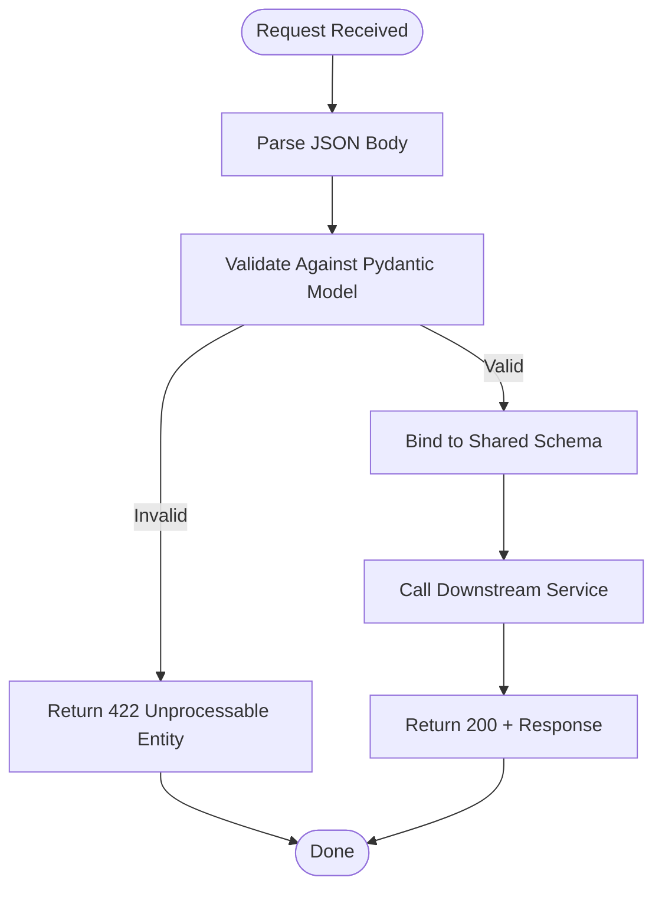
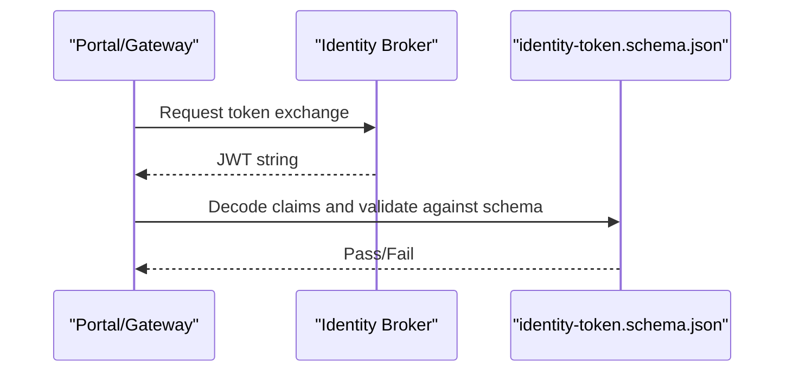
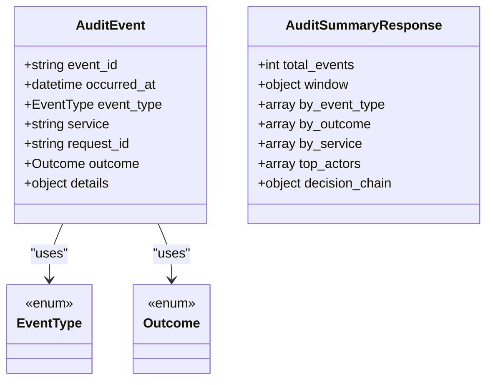
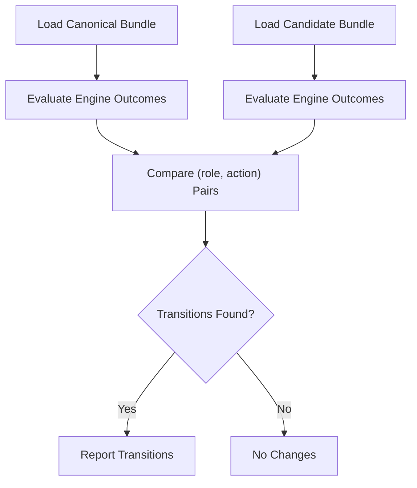
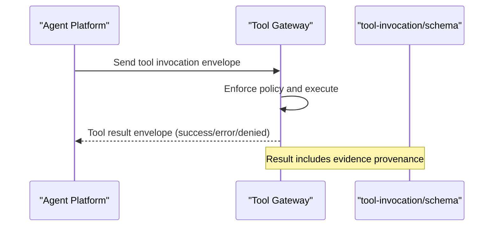
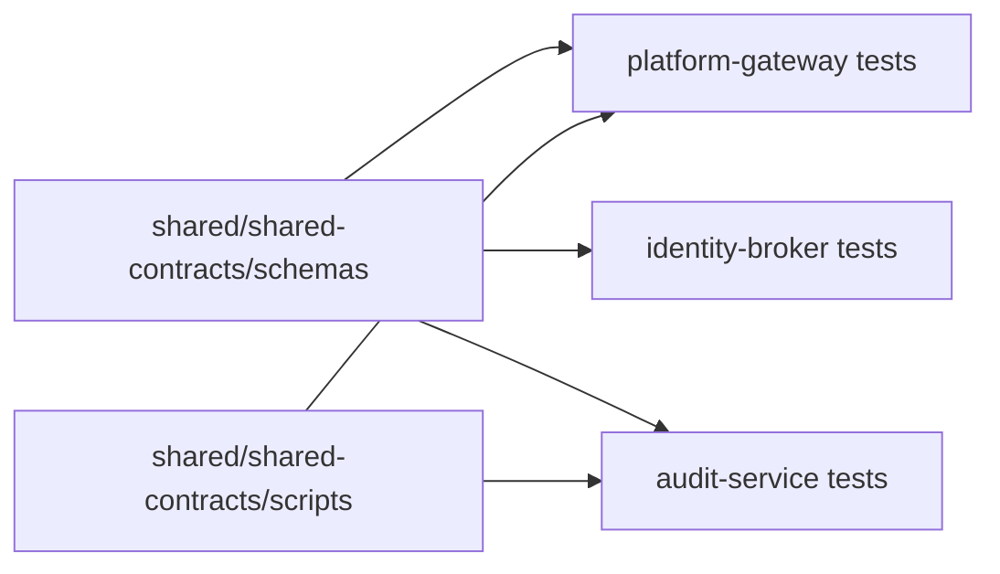

# API Contract Testing

<cite>
**Referenced Files in This Document**
- [README.md](file://shared/shared-contracts/README.md)
- [chat-request.schema.json](file://shared/shared-contracts/schemas/chat-request.schema.json)
- [agent-chat-request.schema.json](file://shared/shared-contracts/schemas/agent-chat-request.schema.json)
- [identity-token.schema.json](file://shared/shared-contracts/schemas/identity-token.schema.json)
- [audit-event.schema.json](file://shared/shared-contracts/schemas/audit-event.schema.json)
- [audit-summary.schema.json](file://shared/shared-contracts/schemas/audit-summary.schema.json)
- [policy-matrix.schema.json](file://shared/shared-contracts/schemas/policy-matrix.schema.json)
- [tool-invocation.schema.json](file://shared/shared-contracts/schemas/tool-invocation.schema.json)
- [tool-result.schema.json](file://shared/shared-contracts/schemas/tool-result.schema.json)
- [validate_version.py](file://shared/shared-contracts/scripts/validate_version.py)
- [policy_diff.py](file://shared/shared-contracts/scripts/policy_diff.py)
- [test_contracts.py (platform-gateway)](file://products/platform-gateway/tests/test_contracts.py)
- [test_contracts.py (identity-broker)](file://products/identity-broker/tests/test_contracts.py)
- [test_contracts.py (audit-service)](file://products/audit-service/tests/test_contracts.py)
</cite>

## Table of Contents
1. [Introduction](#introduction)
2. [Project Structure](#project-structure)
3. [Core Components](#core-components)
4. [Architecture Overview](#architecture-overview)
5. [Detailed Component Analysis](#detailed-component-analysis)
6. [Dependency Analysis](#dependency-analysis)
7. [Performance Considerations](#performance-considerations)
8. [Troubleshooting Guide](#troubleshooting-guide)
9. [Conclusion](#conclusion)
10. [Appendices](#appendices)

## Introduction
This document explains how to perform contract-based API testing across the platform services using JSON Schema definitions and validation scripts under shared/shared-contracts/. It covers request and response payload validation for agent platform, tool gateway, identity broker, and audit service; outlines the contract validation workflow; documents schema versioning strategies and backward compatibility testing; and provides guidance for testing authentication flows, policy enforcement, inter-service communication, error responses, status codes, edge cases, and API evolution scenarios.

The shared contracts define:
- Portal/gateway v1 chat contract and streaming envelopes
- Platform-owned agent-service v2 chat contract and session/stream metadata
- Identity token claims issued by identity-broker
- Policy decision and matrix models
- Tool invocation and result envelopes
- Audit event and summary schemas

These are consumed by product services and validated by per-product tests that bind Pydantic models to the shared schemas and assert runtime behavior at endpoints.

**Section sources**
- [README.md:1-127](file://shared/shared-contracts/README.md#L1-L127)

## Project Structure
At a high level:
- shared/shared-contracts/schemas/: canonical JSON Schemas for cross-service payloads
- shared/shared-contracts/scripts/: utilities for version consistency and policy impact analysis
- products/*/tests/test_contracts.py: per-service contract alignment tests that validate models and endpoints against shared schemas

**Diagram sources**
- [README.md:21-50](file://shared/shared-contracts/README.md#L21-L50)

**Section sources**
- [README.md:21-50](file://shared/shared-contracts/README.md#L21-L50)

## Core Components
- Shared JSON Schemas define the authoritative wire format for requests, responses, events, tokens, and policy artifacts.
- Per-service tests bind local Pydantic models to these schemas and assert parity of properties, required fields, enums, and extra-field rejection.
- Validation scripts enforce non-schema concerns such as version consistency and policy bundle impact.

Key responsibilities:
- Agent platform and tool gateway: v2 agent chat contract, streaming events, sessions, tool invocation/result envelopes
- Identity broker: JWT claim set conformance to identity-token.schema.json
- Audit service: ingestion and query payloads conform to audit-event and audit-summary schemas
- Platform gateway: v1/v2 chat contracts, session records, identity context, policy matrix

**Section sources**
- [README.md:32-50](file://shared/shared-contracts/README.md#L32-L50)
- [test_contracts.py (platform-gateway):30-158](file://products/platform-gateway/tests/test_contracts.py#L30-L158)
- [test_contracts.py (identity-broker):58-90](file://products/identity-broker/tests/test_contracts.py#L58-L90)
- [test_contracts.py (audit-service):43-197](file://products/audit-service/tests/test_contracts.py#L43-L197)

## Architecture Overview
Contract validation spans three layers:
- Schema layer: canonical JSON Schemas in shared/shared-contracts/schemas/
- Model layer: per-service Pydantic models bound to schemas via tests
- Runtime layer: FastAPI route handlers validate incoming JSON bodies against Pydantic models, returning 422 on invalid payloads before any business logic executes

**Diagram sources**
- [test_contracts.py (platform-gateway):307-345](file://products/platform-gateway/tests/test_contracts.py#L307-L345)
- [test_contracts.py (identity-broker):62-90](file://products/identity-broker/tests/test_contracts.py#L62-L90)
- [test_contracts.py (audit-service):67-107](file://products/audit-service/tests/test_contracts.py#L67-L107)

## Detailed Component Analysis

### Agent Platform and Tool Gateway Contracts (v2)
- The v2 agent chat request schema defines the wire contract between tool-gateway and agent-platform, with identity conveyed via headers and structured output support.
- The v1 chat request schema remains for portal/gateway entry points.
- Tests ensure Pydantic models match schema properties, required fields, and forbid extras when the schema does.

Validation workflow:
- Load shared schema from shared/shared-contracts/schemas/
- Construct sample payloads using service models
- Assert jsonschema.validate passes for valid payloads
- Assert jsonschema.ValidationError is raised for invalid payloads (missing required, empty strings, unknown fields)

**Diagram sources**
- [test_contracts.py (platform-gateway):307-345](file://products/platform-gateway/tests/test_contracts.py#L307-L345)
- [chat-request.schema.json:1-38](file://shared/shared-contracts/schemas/chat-request.schema.json#L1-L38)
- [agent-chat-request.schema.json:1-35](file://shared/shared-contracts/schemas/agent-chat-request.schema.json#L1-L35)

**Section sources**
- [README.md:52-67](file://shared/shared-contracts/README.md#L52-L67)
- [chat-request.schema.json:1-38](file://shared/shared-contracts/schemas/chat-request.schema.json#L1-L38)
- [agent-chat-request.schema.json:1-35](file://shared/shared-contracts/schemas/agent-chat-request.schema.json#L1-L35)
- [test_contracts.py (platform-gateway):30-158](file://products/platform-gateway/tests/test_contracts.py#L30-L158)

### Identity Broker Token Contract
- The identity broker issues JWTs whose claim sets must validate against identity-token.schema.json.
- Tests decode tokens without signature verification and assert audience, actor, subject, and roles align with expectations for both portal and delegated tokens.

**Diagram sources**
- [test_contracts.py (identity-broker):62-90](file://products/identity-broker/tests/test_contracts.py#L62-L90)
- [identity-token.schema.json](file://shared/shared-contracts/schemas/identity-token.schema.json)

**Section sources**
- [README.md:68-77](file://shared/shared-contracts/README.md#L68-L77)
- [test_contracts.py (identity-broker):62-90](file://products/identity-broker/tests/test_contracts.py#L62-L90)

### Audit Service Event and Summary Contracts
- AuditEvent and IngestRequest must conform to audit-event.schema.json and related schemas.
- Tests assert property parity, required field handling, enum vocabulary alignment, and rejection of unknown values or extra fields.
- AuditSummaryResponse validates against audit-summary.schema.json.

**Diagram sources**
- [test_contracts.py (audit-service):43-197](file://products/audit-service/tests/test_contracts.py#L43-L197)
- [audit-event.schema.json](file://shared/shared-contracts/schemas/audit-event.schema.json)
- [audit-summary.schema.json](file://shared/shared-contracts/schemas/audit-summary.schema.json)

**Section sources**
- [test_contracts.py (audit-service):43-197](file://products/audit-service/tests/test_contracts.py#L43-L197)

### Policy Enforcement and Matrix Contracts
- Policy decisions and matrices follow policy-decision.schema.json and policy-matrix.schema.json.
- The policy-diff script evaluates canonical vs candidate bundles using the actual engine implementations to report per-(role, action) outcome transitions.
- Tests assert model parity with policy-matrix.schema.json and verify endpoint behavior for malformed inputs.

**Diagram sources**
- [policy_diff.py:117-183](file://shared/shared-contracts/scripts/policy_diff.py#L117-L183)
- [test_contracts.py (platform-gateway):113-131](file://products/platform-gateway/tests/test_contracts.py#L113-L131)

**Section sources**
- [README.md:79-96](file://shared/shared-contracts/README.md#L79-L96)
- [policy_diff.py:1-188](file://shared/shared-contracts/scripts/policy_diff.py#L1-L188)
- [test_contracts.py (platform-gateway):113-131](file://products/platform-gateway/tests/test_contracts.py#L113-L131)

### Tool Invocation and Result Envelopes
- Tool invocation and result envelopes are defined by tool-invocation.schema.json and tool-result.schema.json.
- These govern the wire format between agent-platform (caller) and tool-gateway (executor), including status semantics and evidence provenance.

**Diagram sources**
- [README.md:98-113](file://shared/shared-contracts/README.md#L98-L113)
- [tool-invocation.schema.json](file://shared/shared-contracts/schemas/tool-invocation.schema.json)
- [tool-result.schema.json](file://shared/shared-contracts/schemas/tool-result.schema.json)

**Section sources**
- [README.md:98-113](file://shared/shared-contracts/README.md#L98-L113)

## Dependency Analysis
- All product tests import shared schemas from shared/shared-contracts/schemas/ and validate models against them.
- The platform-gateway tests also exercise FastAPI routes to ensure malformed bodies return 422 before backend calls.
- The identity-broker tests validate issued JWT claims against the shared identity-token schema.
- The audit-service tests validate both ingestion and summary responses against their respective schemas.

**Diagram sources**
- [test_contracts.py (platform-gateway):21-27](file://products/platform-gateway/tests/test_contracts.py#L21-L27)
- [test_contracts.py (identity-broker):22-28](file://products/identity-broker/tests/test_contracts.py#L22-L28)
- [test_contracts.py (audit-service):20-26](file://products/audit-service/tests/test_contracts.py#L20-L26)

**Section sources**
- [test_contracts.py (platform-gateway):21-27](file://products/platform-gateway/tests/test_contracts.py#L21-L27)
- [test_contracts.py (identity-broker):22-28](file://products/identity-broker/tests/test_contracts.py#L22-L28)
- [test_contracts.py (audit-service):20-26](file://products/audit-service/tests/test_contracts.py#L20-L26)

## Performance Considerations
- Schema validation occurs at the boundary (FastAPI models) to fail fast with 422 errors, avoiding unnecessary downstream processing.
- Policy evaluation uses the same engine path as production, ensuring realistic outcomes during diff runs.
- Version checks scan multiple files once per run; keep test suites focused to minimize CI time.

[No sources needed since this section provides general guidance]

## Troubleshooting Guide
Common failures and how to diagnose them:
- 422 Unprocessable Entity on chat endpoints: indicates malformed request body; check required fields, types, and unknown fields. See route validation tests for examples.
- Schema mismatch errors: ensure Pydantic models mirror shared schema properties, required fields, and enum values exactly.
- Policy outcome drift: use policy_diff to compare canonical and candidate bundles and inspect per-(role, action) transitions.
- Version drift: run validate_version to detect mismatches between root VERSION and product metadata/build-time constants.

Recommended steps:
- Run per-service contract tests to catch model/schema drift early.
- Use policy_diff with --engine api or --engine tools to review changes before merging.
- Validate new payloads against shared schemas using the same jsonschema approach used in tests.

**Section sources**
- [test_contracts.py (platform-gateway):307-345](file://products/platform-gateway/tests/test_contracts.py#L307-L345)
- [policy_diff.py:117-183](file://shared/shared-contracts/scripts/policy_diff.py#L117-L183)
- [validate_version.py:73-144](file://shared/shared-contracts/scripts/validate_version.py#L73-L144)

## Conclusion
Contract-based testing ensures consistent, verifiable interfaces across platform services. By binding Pydantic models to shared JSON Schemas and exercising endpoints through tests, the platform catches invalid payloads early, enforces policy semantics consistently, and maintains backward compatibility during evolution. Use the provided scripts to manage version consistency and policy impact, and rely on per-service tests to guard against schema drift.

[No sources needed since this section summarizes without analyzing specific files]

## Appendices

### Using Validation Scripts
- validate_version.py: Ensures all products and portal build-time constants match the root VERSION file. Run it from the repository root or pass a repo-root argument.
- policy_diff.py: Compares canonical and candidate policy bundles using the actual engine implementation. Choose engine api or tools and supply candidate and optional canonical paths.

Usage notes:
- Both scripts exit non-zero on failure, suitable for CI gates.
- policy_diff logs only transitions; unchanged pairs are summarized.

**Section sources**
- [validate_version.py:1-149](file://shared/shared-contracts/scripts/validate_version.py#L1-L149)
- [policy_diff.py:1-188](file://shared/shared-contracts/scripts/policy_diff.py#L1-L188)

### Backward Compatibility and Schema Evolution Strategies
- Additive changes: Introduce new optional fields with defaults so older clients continue to work.
- Enum expansion: Ensure model mirrors include new values; tests will fail if they do not.
- Deprecation: Mark deprecated fields in documentation and tests; avoid removing required fields until consumers are updated.
- Versioned contracts: Maintain v1 and v2 surfaces where necessary; tests demonstrate parity checks for each surface.

**Section sources**
- [test_contracts.py (platform-gateway):161-299](file://products/platform-gateway/tests/test_contracts.py#L161-L299)
- [README.md:32-50](file://shared/shared-contracts/README.md#L32-L50)

### Testing Error Responses, Status Codes, and Edge Cases
- Malformed bodies should return 422 before any backend call; tests cover missing message, empty message, unknown fields, and non-JSON content.
- For identity broker, ensure issued tokens validate against identity-token.schema.json and carry correct audiences and actors.
- For audit service, ensure ingestion rejects unknown event types/outcomes and rejects extra fields.

**Section sources**
- [test_contracts.py (platform-gateway):307-345](file://products/platform-gateway/tests/test_contracts.py#L307-L345)
- [test_contracts.py (identity-broker):62-90](file://products/identity-broker/tests/test_contracts.py#L62-L90)
- [test_contracts.py (audit-service):181-197](file://products/audit-service/tests/test_contracts.py#L181-L197)