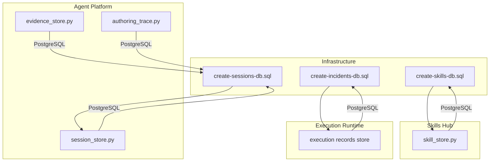
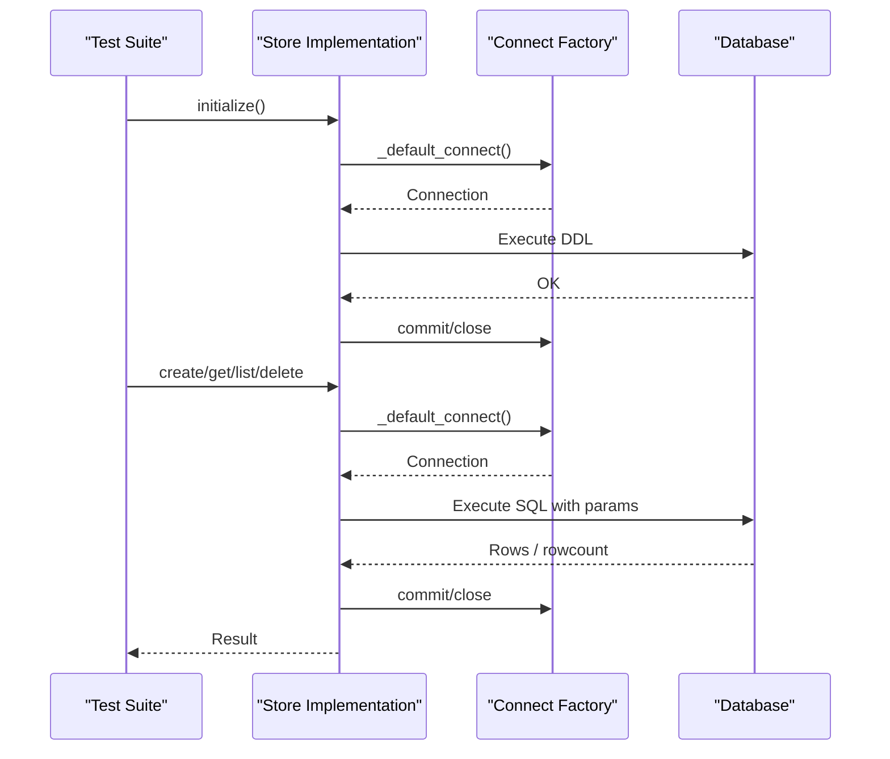
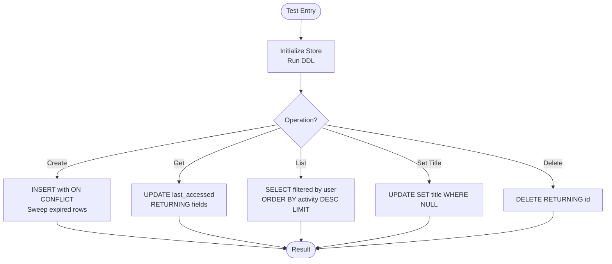
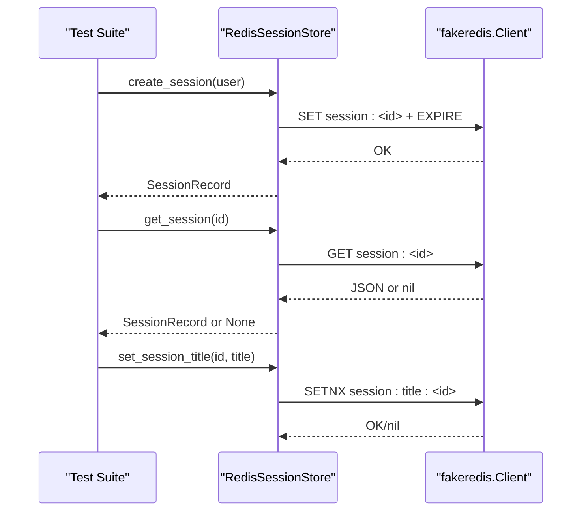
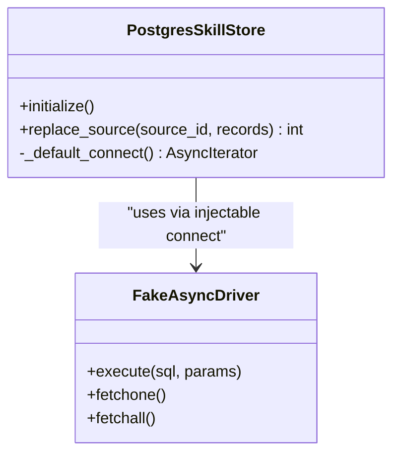
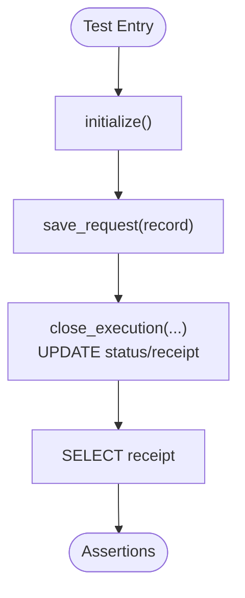
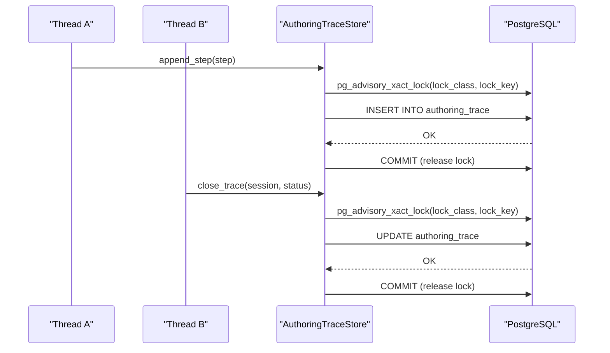
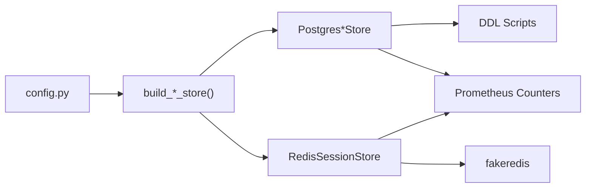

# Database Integration Testing

<cite>
**Referenced Files in This Document**
- [create-sessions-db.sql](file://shared/platform-ops/gitops/dev-k8s/base/infra/create-sessions-db.sql)
- [create-skills-db.sql](file://shared/platform-ops/gitops/dev-k8s/base/infra/create-skills-db.sql)
- [create-incidents-db.sql](file://shared/platform-ops/gitops/dev-k8s/base/infra/create-incidents-db.sql)
- [session_store.py](file://products/agent-platform/src/agent_service/services/session_store.py)
- [skill_store.py](file://products/skills-hub/src/skills_hub/services/skill_store.py)
- [evidence_store.py](file://products/agent-platform/src/agent_service/services/evidence_store.py)
- [test_postgres_session_store.py](file://products/agent-platform/tests/test_postgres_session_store.py)
- [test_redis_session_store.py](file://products/agent-platform/tests/test_redis_session_store.py)
- [test_skill_store.py](file://products/skills-hub/tests/test_skill_store.py)
- [test_execution_records.py](file://products/execution-runtime/tests/test_execution_records.py)
- [test_authoring_trace.py](file://products/agent-platform/tests/test_authoring_trace.py)
- [test_confirmation_records.py](file://products/agent-platform/tests/test_confirmation_records.py)
- [test_operation_documents.py](file://products/agent-platform/tests/test_operation_documents.py)
- [test_runtime_kernel.py](file://products/agent-platform/tests/test_runtime_kernel.py)
- [test_documents.py](file://products/agent-platform/tests/test_documents.py)
- [test_shift_summary.py](file://products/agent-platform/tests/test_shift_summary.py)
- [config.py](file://products/agent-platform/src/agent_service/core/config.py)
</cite>

## Table of Contents
1. [Introduction](#introduction)
2. [Project Structure](#project-structure)
3. [Core Components](#core-components)
4. [Architecture Overview](#architecture-overview)
5. [Detailed Component Analysis](#detailed-component-analysis)
6. [Dependency Analysis](#dependency-analysis)
7. [Performance Considerations](#performance-considerations)
8. [Troubleshooting Guide](#troubleshooting-guide)
9. [Conclusion](#conclusion)
10. [Appendices](#appendices)

## Introduction
This document provides comprehensive guidance for database integration testing across PostgreSQL and Redis storage backends used by the platform. It covers test database setup using SQL schema files, connection management, transaction handling, data isolation strategies for concurrent tests, mocking external dependencies, test data lifecycle, complex query validation, indexing performance, migration scenarios, connection pooling, retry logic, error handling, seeding strategies, and consistency practices across test suites.

The focus is on:
- Session store (PostgreSQL and Redis)
- Skills hub store (PostgreSQL)
- Evidence store (PostgreSQL)
- Execution records (PostgreSQL)
- Authoring trace and confirmation records (PostgreSQL)

## Project Structure
The repository organizes database initialization scripts under shared infrastructure definitions and implements per-service stores with injectable connect factories to enable deterministic testing without live databases.

**Diagram sources**
- [create-sessions-db.sql:1-6](file://shared/platform-ops/gitops/dev-k8s/base/infra/create-sessions-db.sql#L1-L6)
- [create-skills-db.sql:1-6](file://shared/platform-ops/gitops/dev-k8s/base/infra/create-skills-db.sql#L1-L6)
- [create-incidents-db.sql:1-6](file://shared/platform-ops/gitops/dev-k8s/base/infra/create-incidents-db.sql#L1-L6)
- [session_store.py:652-695](file://products/agent-platform/src/agent_service/services/session_store.py#L652-L695)
- [skill_store.py:251-322](file://products/skills-hub/src/skills_hub/services/skill_store.py#L251-L322)
- [evidence_store.py:362-407](file://products/agent-platform/src/agent_service/services/evidence_store.py#L362-L407)

**Section sources**
- [create-sessions-db.sql:1-6](file://shared/platform-ops/gitops/dev-k8s/base/infra/create-sessions-db.sql#L1-L6)
- [create-skills-db.sql:1-6](file://shared/platform-ops/gitops/dev-k8s/base/infra/create-skills-db.sql#L1-L6)
- [create-incidents-db.sql:1-6](file://shared/platform-ops/gitops/dev-k8s/base/infra/create-incidents-db.sql#L1-L6)

## Core Components
- PostgresSessionStore: PostgreSQL-backed session store with per-operation connections, TTL-aware queries, DDL initialization, and a fail-open fallback to in-memory when unreachable.
- RedisSessionStore: Redis-backed session store using fakeredis in tests; supports TTL, user-scoped listing, title overlay semantics, and health checks.
- PostgresSkillStore: PostgreSQL-backed skills store with per-operation connections, DDL initialization, and atomic per-source replace operations.
- PostgresEvidenceStore: PostgreSQL-backed evidence store sharing the sessions database with per-operation connections and DDL initialization.
- Execution record store: PostgreSQL-backed store for execution requests/receipts with fake driver support in tests.
- Authoring trace and confirmation records: PostgreSQL-backed stores using advisory locks and transactions to ensure concurrency safety.

Key patterns:
- Injected connect factories allow tests to substitute fakes or real drivers.
- initialize() runs DDL once per store instance.
- Transactions are explicit per operation; autocommit is disabled by default.
- Error metrics and fallback behavior are recorded via Prometheus counters.

**Section sources**
- [session_store.py:652-695](file://products/agent-platform/src/agent_service/services/session_store.py#L652-L695)
- [skill_store.py:251-322](file://products/skills-hub/src/skills_hub/services/skill_store.py#L251-L322)
- [evidence_store.py:362-407](file://products/agent-platform/src/agent_service/services/evidence_store.py#L362-L407)
- [test_execution_records.py:93-175](file://products/execution-runtime/tests/test_execution_records.py#L93-L175)
- [test_authoring_trace.py:529-585](file://products/agent-platform/tests/test_authoring_trace.py#L529-L585)

## Architecture Overview
The system uses multiple backends for different concerns:
- Sessions: PostgreSQL or Redis
- Skills: PostgreSQL
- Evidence: PostgreSQL
- Execution records: PostgreSQL
- Authoring traces and confirmations: PostgreSQL

**Diagram sources**
- [session_store.py:652-695](file://products/agent-platform/src/agent_service/services/session_store.py#L652-L695)
- [skill_store.py:251-322](file://products/skills-hub/src/skills_hub/services/skill_store.py#L251-L322)
- [evidence_store.py:362-407](file://products/agent-platform/src/agent_service/services/evidence_store.py#L362-L407)

## Detailed Component Analysis

### PostgreSQL Session Store Integration Tests
- Purpose: Validate DDL, CRUD, TTL, user-scoped listing, set-once title, deletion, readiness, error recording, and factory selection/fallback.
- Setup: Use a fake sync psycopg driver that captures executed SQL and parameters; optionally simulate failures.
- Isolation: Each test constructs its own store instance with a fresh fake connect; no global state is shared.
- Key validations:
  - DDL includes table creation and indexes.
  - Create inserts with conflict-safe upsert and triggers sweep of expired rows.
  - Get refreshes TTL and returns mapped fields including session type.
  - List orders by most-recently-active with limit and optional filters.
  - Set title enforces server-side set-once constraint.
  - Delete returns boolean based on affected row.
  - Readiness checks succeed/fail based on connectivity.
  - Errors increment Prometheus counters and propagate exceptions.
  - Factory selects postgres backend from environment and falls back to memory on failure.

**Diagram sources**
- [test_postgres_session_store.py:86-251](file://products/agent-platform/tests/test_postgres_session_store.py#L86-L251)
- [session_store.py:652-695](file://products/agent-platform/src/agent_service/services/session_store.py#L652-L695)

**Section sources**
- [test_postgres_session_store.py:86-251](file://products/agent-platform/tests/test_postgres_session_store.py#L86-L251)
- [test_postgres_session_store.py:267-347](file://products/agent-platform/tests/test_postgres_session_store.py#L267-L347)
- [session_store.py:652-695](file://products/agent-platform/src/agent_service/services/session_store.py#L652-L695)

### Redis Session Store Integration Tests
- Purpose: Validate CRUD, TTL expiration, user-scoped listing, title overlay semantics, deletion, readiness, and factory selection/fallback.
- Setup: Use fakeredis.FakeRedis to avoid a live Redis server; configure isolated DB number for tests.
- Isolation: Per-test fixtures provide fresh clients and stores; no cross-test leakage.
- Key validations:
  - Create generates unique session IDs and persists user context.
  - Get returns None for missing sessions.
  - Delete removes session and associated title key.
  - TTL behavior verified by expiring keys and checking visibility.
  - User listing filters correctly and respects deletions.
  - Set title is minted once and not overwritten by subsequent touches.
  - Health check reports readiness against fakeredis client.
  - Factory selects redis backend when configured and falls back to memory if unreachable.

**Diagram sources**
- [test_redis_session_store.py:18-28](file://products/agent-platform/tests/test_redis_session_store.py#L18-L28)
- [test_redis_session_store.py:35-161](file://products/agent-platform/tests/test_redis_session_store.py#L35-L161)
- [test_redis_session_store.py:168-194](file://products/agent-platform/tests/test_redis_session_store.py#L168-L194)
- [test_redis_session_store.py:228-274](file://products/agent-platform/tests/test_redis_session_store.py#L228-L274)

**Section sources**
- [test_redis_session_store.py:35-161](file://products/agent-platform/tests/test_redis_session_store.py#L35-L161)
- [test_redis_session_store.py:168-194](file://products/agent-platform/tests/test_redis_session_store.py#L168-L194)
- [test_redis_session_store.py:228-274](file://products/agent-platform/tests/test_redis_session_store.py#L228-L274)

### Skills Store Integration Tests
- Purpose: Validate in-memory store atomic swaps, filtering, pagination, search ranking, and Postgres adapter behavior including web_target/risk_class persistence.
- Setup: In-memory store for fast unit-style tests; Postgres adapter tested with a fake async driver capturing SQL and parameters.
- Isolation: Each test creates a new store instance; source IDs isolate datasets.
- Key validations:
  - Replace source atomically swaps content per source.
  - Listing supports pagination and filters by source/tag.
  - Search ranks results and excludes zero scores.
  - Postgres replace_source issues DELETE then INSERT within one connection/transaction.
  - web_target and risk_class columns persist and round-trip correctly.

**Diagram sources**
- [skill_store.py:251-322](file://products/skills-hub/src/skills_hub/services/skill_store.py#L251-L322)
- [test_skill_store.py:260-303](file://products/skills-hub/tests/test_skill_store.py#L260-L303)

**Section sources**
- [test_skill_store.py:85-200](file://products/skills-hub/tests/test_skill_store.py#L85-L200)
- [test_skill_store.py:260-303](file://products/skills-hub/tests/test_skill_store.py#L260-L303)
- [skill_store.py:251-322](file://products/skills-hub/src/skills_hub/services/skill_store.py#L251-L322)

### Execution Records Integration Tests
- Purpose: Validate DDL execution, request save, receipt update, and close behavior against a fake driver.
- Setup: Fake cursor/connection pair that tracks calls and in-memory state keyed by confirm_id/call_id.
- Isolation: Each test uses a fresh fake store and backing dict.
- Key validations:
  - initialize() runs DDL without raising.
  - close_execution updates status and receipt when existing row exists.
  - SELECT receipt returns persisted value when present.

**Diagram sources**
- [test_execution_records.py:93-175](file://products/execution-runtime/tests/test_execution_records.py#L93-L175)

**Section sources**
- [test_execution_records.py:93-175](file://products/execution-runtime/tests/test_execution_records.py#L93-L175)

### Authoring Trace Concurrency and Locking
- Purpose: Ensure append_step and close_trace acquire transaction-scoped advisory locks to prevent race conditions between concurrent appends and closes.
- Setup: Fake driver captures SQL and parameters; lock keys are derived per session to isolate contention.
- Isolation: Separate fake connects per test; lock keys differ across sessions but match for same session.
- Key validations:
  - Advisory lock acquired before writes.
  - Lock released by commit after insert/update.
  - Same session reuses identical lock parameters; different sessions use distinct lock keys.

**Diagram sources**
- [test_authoring_trace.py:529-585](file://products/agent-platform/tests/test_authoring_trace.py#L529-L585)

**Section sources**
- [test_authoring_trace.py:529-585](file://products/agent-platform/tests/test_authoring_trace.py#L529-L585)

### Confirmation Records Pagination and Limits
- Purpose: Validate inbox limits, pending load ordering, and paginated history with total counts.
- Setup: In-memory store for quick assertions; fake driver for Postgres path where applicable.
- Isolation: Fresh store instances per test; deterministic timestamps.
- Key validations:
  - Pending inbox capped at configured limit.
  - History paginates with consistent totals across pages.
  - Newest items first in listings.

**Section sources**
- [test_confirmation_records.py:241-326](file://products/agent-platform/tests/test_confirmation_records.py#L241-L326)

### Operation Documents and Evidence Stores
- Purpose: Validate per-owner caps, expiration sweeps, readiness, and Postgres adapter interactions.
- Setup: In-memory store for core behaviors; fake driver for Postgres path capturing SQL and rows.
- Isolation: Per-test store instances; no shared state.
- Key validations:
  - Per-owner cap enforced.
  - Expired documents swept on write.
  - Postgres adapter initializes DDL and executes queries safely.

**Section sources**
- [test_operation_documents.py:138-179](file://products/agent-platform/tests/test_operation_documents.py#L138-L179)
- [evidence_store.py:362-407](file://products/agent-platform/src/agent_service/services/evidence_store.py#L362-L407)

### Data Isolation Across Test Suites
- Strategy:
  - Use per-test store instances with injected connect factories.
  - Clear module-level singletons in autouse fixtures to prevent leakage.
  - For Redis tests, use fakeredis with isolated DB numbers.
  - For Postgres tests, capture SQL and assert behavior without touching live databases.
- Examples:
  - Autouse fixture clears in-memory stores and captured audit events.
  - Kernel tests clear tracing and execution record singletons before/after each test.

**Section sources**
- [test_documents.py:43-68](file://products/agent-platform/tests/test_documents.py#L43-L68)
- [test_runtime_kernel.py:1801-1833](file://products/agent-platform/tests/test_runtime_kernel.py#L1801-L1833)

## Dependency Analysis
Stores depend on:
- Environment configuration for backend selection and credentials.
- Connect factories for database access, enabling test substitution.
- Prometheus metrics for error counting and fallback tracking.
- SQL schemas defined in infrastructure scripts for database provisioning.

**Diagram sources**
- [config.py:1-11](file://products/agent-platform/src/agent_service/core/config.py#L1-L11)
- [session_store.py:915-947](file://products/agent-platform/src/agent_service/services/session_store.py#L915-L947)
- [test_postgres_session_store.py:295-347](file://products/agent-platform/tests/test_postgres_session_store.py#L295-L347)
- [test_redis_session_store.py:228-274](file://products/agent-platform/tests/test_redis_session_store.py#L228-L274)

**Section sources**
- [config.py:1-11](file://products/agent-platform/src/agent_service/core/config.py#L1-L11)
- [session_store.py:915-947](file://products/agent-platform/src/agent_service/services/session_store.py#L915-L947)

## Performance Considerations
- Connection model: Stores open connections per operation; suitable for low-volume workloads and simplifies testing.
- Indexing: Session store DDL includes indexes for user and access time; validate usage in list and TTL predicates.
- Sweeping: Expired rows are deleted with limits to avoid long-running cleanup during hot paths.
- Advisory locks: Transaction-scoped locks prevent races without blocking unrelated sessions.
- Redis TTL: Lazy expiry handled by tests by manipulating key TTLs; consider timing in integration tests.

[No sources needed since this section provides general guidance]

## Troubleshooting Guide
Common issues and resolutions:
- Unreachable Postgres: Factory falls back to in-memory store and increments fallback counter; verify SESSION_DB_URL and network reachability.
- Missing DSN: Startup fails with ValueError when required environment variables are absent; ensure SESSION_DB_URL is set for postgres backend.
- Connection errors: Operations raise exceptions and increment error counters; inspect metrics and logs for operation-specific failures.
- Test isolation leaks: Clear module-level singletons in fixtures to prevent cross-test contamination.
- Redis connectivity: When testing redis backend, patch redis module to return fakeredis; otherwise unreachable Redis triggers fallback to memory.

**Section sources**
- [test_postgres_session_store.py:295-347](file://products/agent-platform/tests/test_postgres_session_store.py#L295-L347)
- [test_redis_session_store.py:228-274](file://products/agent-platform/tests/test_redis_session_store.py#L228-L274)
- [test_documents.py:43-68](file://products/agent-platform/tests/test_documents.py#L43-L68)

## Conclusion
The test suite employs robust patterns for database integration testing:
- Injected connect factories enable deterministic tests without live databases.
- DDL initialization ensures schema readiness.
- Transactions and advisory locks enforce correctness under concurrency.
- Mocking strategies cover both PostgreSQL and Redis backends.
- Metrics and fallback mechanisms provide resilience and observability.
Adopt these patterns to maintain reliable, isolated, and performant tests across evolving storage backends.

[No sources needed since this section summarizes without analyzing specific files]

## Appendices

### Test Database Setup Procedures
- Create databases using SQL scripts:
  - Sessions: create-sessions-db.sql
  - Skills: create-skills-db.sql
  - Incidents: create-incidents-db.sql
- Initialize stores via initialize() to run DDL.
- Configure environment variables for backend selection and connection details.

**Section sources**
- [create-sessions-db.sql:1-6](file://shared/platform-ops/gitops/dev-k8s/base/infra/create-sessions-db.sql#L1-L6)
- [create-skills-db.sql:1-6](file://shared/platform-ops/gitops/dev-k8s/base/infra/create-skills-db.sql#L1-L6)
- [create-incidents-db.sql:1-6](file://shared/platform-ops/gitops/dev-k8s/base/infra/create-incidents-db.sql#L1-L6)
- [session_store.py:652-695](file://products/agent-platform/src/agent_service/services/session_store.py#L652-L695)
- [skill_store.py:251-322](file://products/skills-hub/src/skills_hub/services/skill_store.py#L251-L322)
- [evidence_store.py:362-407](file://products/agent-platform/src/agent_service/services/evidence_store.py#L362-L407)

### Connection Management and Transaction Handling
- Per-operation connections with autocommit disabled.
- Explicit commits after writes; rollbacks on exceptions.
- Advisory locks for critical sections in authoring trace operations.

**Section sources**
- [session_store.py:652-695](file://products/agent-platform/src/agent_service/services/session_store.py#L652-L695)
- [skill_store.py:251-322](file://products/skills-hub/src/skills_hub/services/skill_store.py#L251-L322)
- [evidence_store.py:362-407](file://products/agent-platform/src/agent_service/services/evidence_store.py#L362-L407)
- [test_authoring_trace.py:529-585](file://products/agent-platform/tests/test_authoring_trace.py#L529-L585)

### Data Isolation Strategies for Concurrent Tests
- Per-test store instances with injected connect factories.
- Clearing module-level singletons in autouse fixtures.
- Using fakeredis with isolated DB numbers for Redis tests.

**Section sources**
- [test_documents.py:43-68](file://products/agent-platform/tests/test_documents.py#L43-L68)
- [test_runtime_kernel.py:1801-1833](file://products/agent-platform/tests/test_runtime_kernel.py#L1801-L1833)
- [test_redis_session_store.py:228-274](file://products/agent-platform/tests/test_redis_session_store.py#L228-L274)

### Mocking External Dependencies and Test Data Lifecycle
- Fake drivers capture SQL and parameters; optional failure injection.
- Seeding strategies:
  - In-memory stores: direct method calls to create records.
  - Postgres adapters: rely on DDL and captured SQL assertions.
- Teardown: No persistent state; fake drivers reset per test.

**Section sources**
- [test_postgres_session_store.py:38-74](file://products/agent-platform/tests/test_postgres_session_store.py#L38-L74)
- [test_execution_records.py:93-175](file://products/execution-runtime/tests/test_execution_records.py#L93-L175)
- [test_skill_store.py:260-303](file://products/skills-hub/tests/test_skill_store.py#L260-L303)

### Testing Complex Queries, Indexing Performance, and Migration Scenarios
- Complex queries validated via SQL assertions in tests (e.g., ORDER BY, LIMIT, WHERE clauses).
- Index usage inferred from DDL and query predicates; extend tests to include explain plans if needed.
- Migration scenarios: initialize() applies DDL; tests assert DDL contents and behavior changes.

**Section sources**
- [test_postgres_session_store.py:86-251](file://products/agent-platform/tests/test_postgres_session_store.py#L86-L251)
- [test_skill_store.py:260-303](file://products/skills-hub/tests/test_skill_store.py#L260-L303)

### Connection Pooling, Retry Logic, and Error Handling
- Current implementation opens per-operation connections; pooling can be added via connect factory abstraction.
- Retry logic: Not explicitly implemented in stores; add retries around connect and execute calls if needed.
- Error handling: Exceptions raised and counted via Prometheus metrics; fallback to in-memory for session store.

**Section sources**
- [session_store.py:652-695](file://products/agent-platform/src/agent_service/services/session_store.py#L652-L695)
- [test_postgres_session_store.py:267-347](file://products/agent-platform/tests/test_postgres_session_store.py#L267-L347)

### Best Practices for Test Data Generation and Consistency
- Generate minimal, deterministic data per test.
- Use fixed IDs where necessary to assert behavior.
- Ensure teardown clears any leaked state via fixtures.
- Validate both in-memory and Postgres paths for parity.

**Section sources**
- [test_shift_summary.py:52-105](file://products/agent-platform/tests/test_shift_summary.py#L52-L105)
- [test_skill_store.py:85-200](file://products/skills-hub/tests/test_skill_store.py#L85-L200)
- [test_postgres_session_store.py:86-251](file://products/agent-platform/tests/test_postgres_session_store.py#L86-L251)