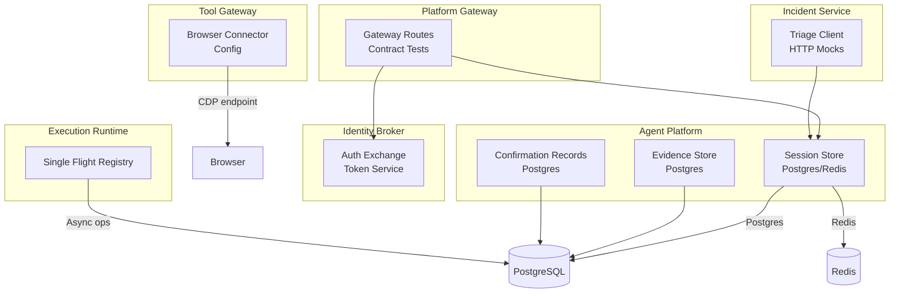
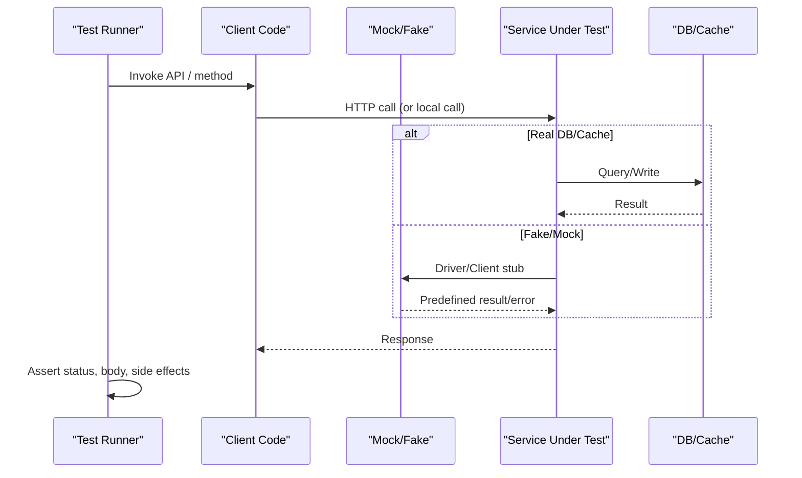
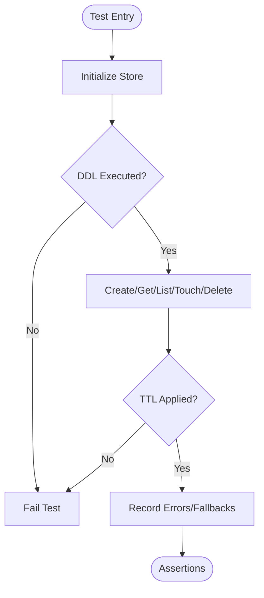
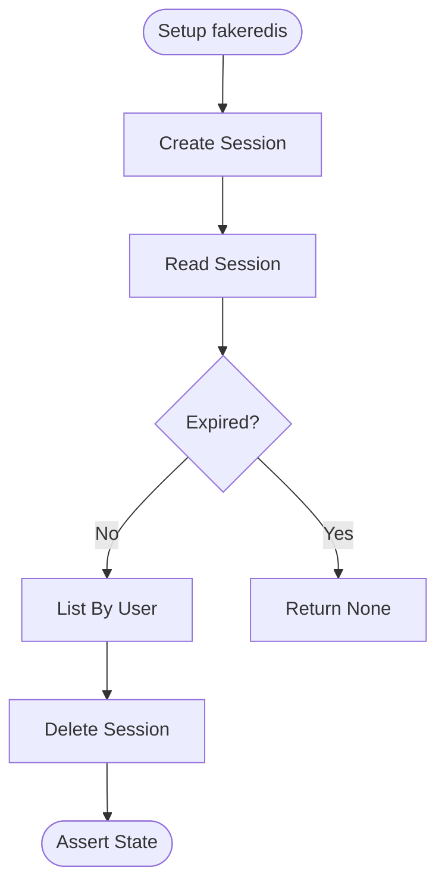
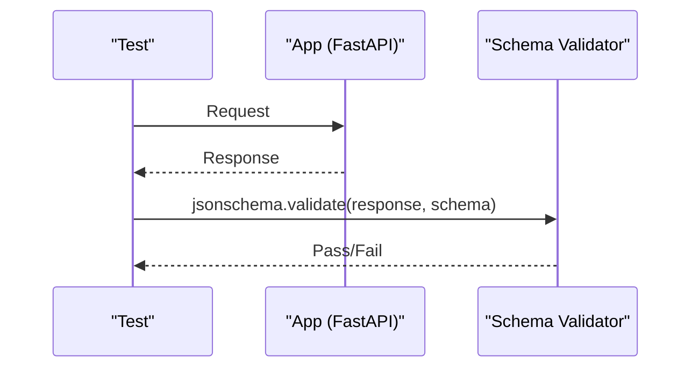
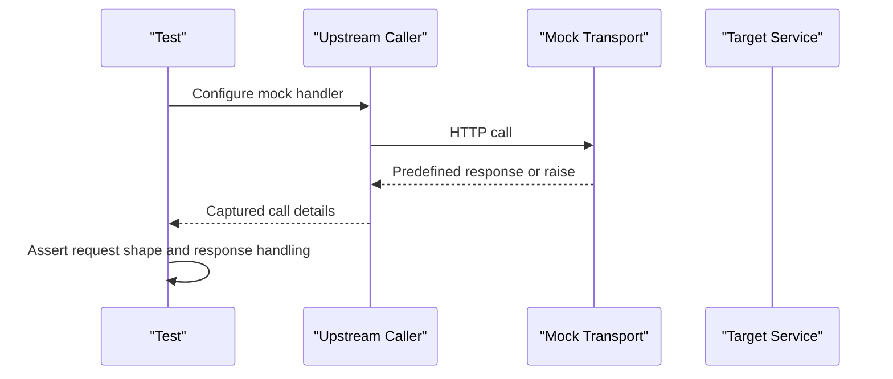
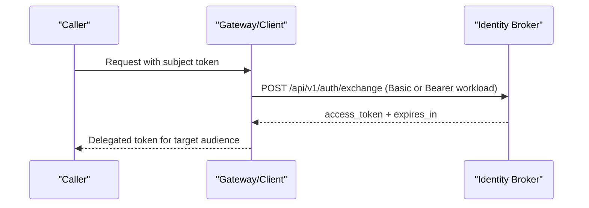
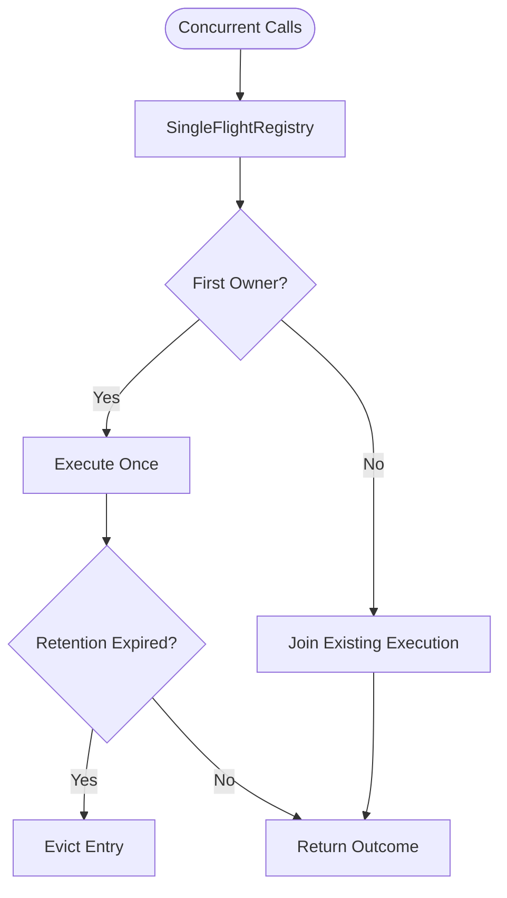
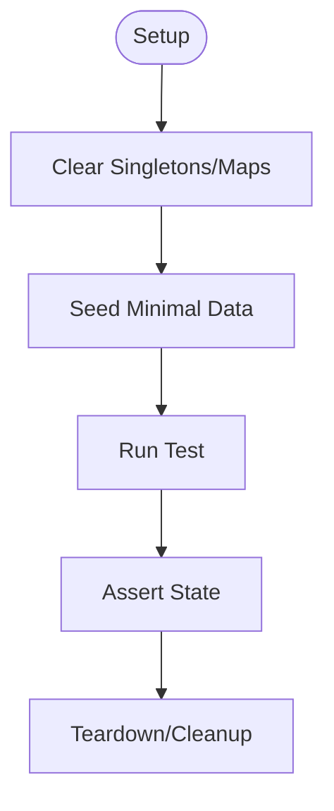
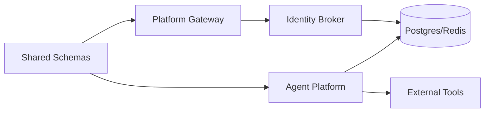

# Integration Testing

<cite>
**Referenced Files in This Document**
- [test_postgres_session_store.py](file://products/agent-platform/tests/test_postgres_session_store.py)
- [test_redis_session_store.py](file://products/agent-platform/tests/test_redis_session_store.py)
- [session_store.py](file://products/agent-platform/src/agent_service/services/session_store.py)
- [evidence_store.py](file://products/agent-platform/src/agent_service/services/evidence_store.py)
- [confirmation_records.py](file://products/agent-platform/src/agent_service/services/confirmation_records.py)
- [test_contract_adapter.py](file://products/agent-platform/tests/test_contract_adapter.py)
- [test_contracts.py](file://products/platform-gateway/tests/test_contracts.py)
- [auth.py](file://products/identity-broker/src/identity_service/api/routes/auth.py)
- [test_exchange_service.py](file://products/identity-broker/tests/test_exchange_service.py)
- [test_delegation.py](file://products/platform-gateway/tests/test_delegation.py)
- [test_incidents_proxy.py](file://products/platform-gateway/tests/test_incidents_proxy.py)
- [test_triage.py](file://products/incident-service/tests/test_triage.py)
- [test_incident_report.py](file://products/agent-platform/tests/test_incident_report.py)
- [config.py](file://products/tool-gateway/src/tool_gateway/core/config.py)
- [test_browser_connector.py](file://products/tool-gateway/tests/test_browser_connector.py)
- [test_operation_documents.py](file://products/agent-platform/tests/test_operation_documents.py)
- [test_single_flight.py](file://products/execution-runtime/tests/test_single_flight.py)
- [CONTRIBUTING.md](file://CONTRIBUTING.md)
</cite>

## Table of Contents
1. Introduction
2. Project Structure
3. Core Components
4. Architecture Overview
5. Detailed Component Analysis
6. Dependency Analysis
7. Performance Considerations
8. Troubleshooting Guide
9. Conclusion

## Introduction
This document explains how to design and run integration tests for service-to-service communication and external system interactions across the platform. It focuses on:
- Database integrations with PostgreSQL and Redis, including test setup and cleanup
- API contract testing using JSON Schema from shared/shared-contracts/schemas/
- Inter-service HTTP calls with client mocking, request/response validation, and error handling
- Authentication flows, token exchange, and authorization checks
- Asynchronous operations, message queues, and event-driven patterns
- Isolated test environments, test data persistence, and external dependency management
- Performance considerations and strategies for parallel execution

## Project Structure
Integration tests are distributed per product under products/<service>/tests/. Contracts live centrally under shared/shared-contracts/schemas/ and are consumed by multiple services. Key areas:
- Agent Platform: session stores (Postgres/Redis), evidence store, confirmation records, contract adapter tests
- Platform Gateway: contract alignment and route validation, proxying to upstream services
- Identity Broker: token exchange endpoints and workload-token support
- Incident Service: triage flow calling agent service via HTTP
- Tool Gateway: browser connector configuration and environment-driven settings
- Execution Runtime: single-flight registry for idempotent async operations

**Diagram sources**
- [session_store.py:652-695](file://products/agent-platform/src/agent_service/services/session_store.py#L652-L695)
- [evidence_store.py:362-407](file://products/agent-platform/src/agent_service/services/evidence_store.py#L362-L407)
- [confirmation_records.py:492-522](file://products/agent-platform/src/agent_service/services/confirmation_records.py#L492-L522)
- [test_contracts.py:30-67](file://products/platform-gateway/tests/test_contracts.py#L30-L67)
- [auth.py:123-162](file://products/identity-broker/src/identity_service/api/routes/auth.py#L123-L162)
- [test_triage.py:219-257](file://products/incident-service/tests/test_triage.py#L219-L257)
- [config.py:1-29](file://products/tool-gateway/src/tool_gateway/core/config.py#L1-L29)
- [test_single_flight.py:17-49](file://products/execution-runtime/tests/test_single_flight.py#L17-L49)

**Section sources**
- [test_postgres_session_store.py:1-347](file://products/agent-platform/tests/test_postgres_session_store.py#L1-L347)
- [test_redis_session_store.py:1-274](file://products/agent-platform/tests/test_redis_session_store.py#L1-L274)
- [test_contract_adapter.py:1-665](file://products/agent-platform/tests/test_contract_adapter.py#L1-L665)
- [test_contracts.py:1-350](file://products/platform-gateway/tests/test_contracts.py#L1-L350)

## Core Components
- Session stores: Postgres and Redis backends with TTL, sweep, and fallback behavior; tested against fake drivers or fakeredis
- Evidence store: Postgres-backed frame storage sharing the sessions database
- Confirmation records: Postgres-backed approval inbox with pagination and limits
- Contract validation: End-to-end schema validation of responses and model parity with shared JSON schemas
- Auth and delegation: Token exchange endpoint supporting Basic and workload tokens; delegated token issuance
- Upstream clients: HTTP clients mocked via httpx.MockTransport or custom fakes to assert call shape and handle errors
- Browser connector: Environment-driven configuration validated in tests
- Single flight: Idempotent async operation registry ensuring one execution per key

**Section sources**
- [session_store.py:652-695](file://products/agent-platform/src/agent_service/services/session_store.py#L652-L695)
- [evidence_store.py:362-407](file://products/agent-platform/src/agent_service/services/evidence_store.py#L362-L407)
- [confirmation_records.py:492-522](file://products/agent-platform/src/agent_service/services/confirmation_records.py#L492-L522)
- [test_contract_adapter.py:35-63](file://products/agent-platform/tests/test_contract_adapter.py#L35-L63)
- [test_contracts.py:30-159](file://products/platform-gateway/tests/test_contracts.py#L30-L159)
- [auth.py:123-162](file://products/identity-broker/src/identity_service/api/routes/auth.py#L123-L162)
- [test_exchange_service.py:168-193](file://products/identity-broker/tests/test_exchange_service.py#L168-L193)
- [test_delegation.py:147-188](file://products/platform-gateway/tests/test_delegation.py#L147-L188)
- [test_triage.py:219-257](file://products/incident-service/tests/test_triage.py#L219-L257)
- [test_incident_report.py:46-96](file://products/agent-platform/tests/test_incident_report.py#L46-L96)
- [config.py:1-29](file://products/tool-gateway/src/tool_gateway/core/config.py#L1-L29)
- [test_browser_connector.py:367-396](file://products/tool-gateway/tests/test_browser_connector.py#L367-L396)
- [test_single_flight.py:17-49](file://products/execution-runtime/tests/test_single_flight.py#L17-L49)

## Architecture Overview
The integration test strategy centers on:
- Contract-first validation: Every response is validated against shared JSON Schemas
- Isolation: Each service uses in-memory or fake backends for deterministic tests
- External dependencies: HTTP clients are mocked; databases are either real containers or fakes depending on scope
- Error paths: Tests assert 4xx/5xx behaviors and audit emissions where applicable

[No sources needed since this diagram shows conceptual workflow, not actual code structure]

## Detailed Component Analysis

### PostgreSQL Integration Testing
- Use a fake psycopg driver to capture SQL and assert DDL/queries without a live server
- Validate initialize() runs DDL, create/get/list/touch/delete operations emit expected SQL, and TTL predicates are applied
- Verify fallback behavior when connection fails and metrics/errors are recorded

**Diagram sources**
- [test_postgres_session_store.py:86-118](file://products/agent-platform/tests/test_postgres_session_store.py#L86-L118)
- [session_store.py:652-695](file://products/agent-platform/src/agent_service/services/session_store.py#L652-L695)

**Section sources**
- [test_postgres_session_store.py:81-287](file://products/agent-platform/tests/test_postgres_session_store.py#L81-L287)
- [session_store.py:652-695](file://products/agent-platform/src/agent_service/services/session_store.py#L652-L695)

### Redis Integration Testing
- Use fakeredis to simulate Redis behavior deterministically
- Validate TTL expiration, user-scoped listing, title overlays, and deletion semantics
- Confirm build_session_store selects Redis backend and falls back to memory when unreachable

**Diagram sources**
- [test_redis_session_store.py:35-95](file://products/agent-platform/tests/test_redis_session_store.py#L35-L95)
- [test_redis_session_store.py:168-182](file://products/agent-platform/tests/test_redis_session_store.py#L168-L182)
- [test_redis_session_store.py:228-274](file://products/agent-platform/tests/test_redis_session_store.py#L228-L274)

**Section sources**
- [test_redis_session_store.py:1-274](file://products/agent-platform/tests/test_redis_session_store.py#L1-L274)

### API Contract Testing with JSON Schema
- Validate live responses from FastAPI routes against shared schemas
- Ensure Pydantic models mirror schema properties, required fields, and additionalProperties rules
- Enforce enum vocabulary parity between schemas and models to prevent drift

**Diagram sources**
- [test_contract_adapter.py:35-63](file://products/agent-platform/tests/test_contract_adapter.py#L35-L63)
- [test_contracts.py:30-159](file://products/platform-gateway/tests/test_contracts.py#L30-L159)

**Section sources**
- [test_contract_adapter.py:35-665](file://products/agent-platform/tests/test_contract_adapter.py#L35-L665)
- [test_contracts.py:30-350](file://products/platform-gateway/tests/test_contracts.py#L30-L350)

### Inter-Service Communication and HTTP Client Mocking
- Use httpx.MockTransport or custom AsyncClient fakes to capture requests and return controlled responses
- Assert URL, headers, auth, and JSON payloads; verify error propagation and timeouts
- Cover both synchronous and asynchronous client usage

**Diagram sources**
- [test_incidents_proxy.py:51-93](file://products/platform-gateway/tests/test_incidents_proxy.py#L51-L93)
- [test_triage.py:219-257](file://products/incident-service/tests/test_triage.py#L219-L257)
- [test_incident_report.py:46-96](file://products/agent-platform/tests/test_incident_report.py#L46-L96)

**Section sources**
- [test_incidents_proxy.py:51-93](file://products/platform-gateway/tests/test_incidents_proxy.py#L51-L93)
- [test_triage.py:219-257](file://products/incident-service/tests/test_triage.py#L219-L257)
- [test_incident_report.py:46-96](file://products/agent-platform/tests/test_incident_report.py#L46-L96)

### Authentication Flows, Token Exchange, and Authorization
- The identity broker supports Basic credentials and Bearer workload tokens for token exchange
- Tests assert successful exchanges, missing credential handling, invalid subject tokens, and rejection of unregistered workloads
- Delegation client tests confirm correct audience and header usage

**Diagram sources**
- [auth.py:123-162](file://products/identity-broker/src/identity_service/api/routes/auth.py#L123-L162)
- [test_exchange_service.py:168-193](file://products/identity-broker/tests/test_exchange_service.py#L168-L193)
- [test_exchange_service.py:414-443](file://products/identity-broker/tests/test_exchange_service.py#L414-L443)
- [test_delegation.py:147-188](file://products/platform-gateway/tests/test_delegation.py#L147-L188)

**Section sources**
- [auth.py:123-162](file://products/identity-broker/src/identity_service/api/routes/auth.py#L123-L162)
- [test_exchange_service.py:168-443](file://products/identity-broker/tests/test_exchange_service.py#L168-L443)
- [test_delegation.py:147-188](file://products/platform-gateway/tests/test_delegation.py#L147-L188)

### Asynchronous Operations and Event-Driven Patterns
- Single-flight registry ensures concurrent duplicate requests join a single execution, with eviction and replay semantics
- Stream events and confirmation frames are normalized and validated against contracts, enabling event-driven UI updates

**Diagram sources**
- [test_single_flight.py:17-49](file://products/execution-runtime/tests/test_single_flight.py#L17-L49)
- [test_contract_adapter.py:239-397](file://products/agent-platform/tests/test_contract_adapter.py#L239-L397)

**Section sources**
- [test_single_flight.py:17-49](file://products/execution-runtime/tests/test_single_flight.py#L17-L49)
- [test_contract_adapter.py:239-397](file://products/agent-platform/tests/test_contract_adapter.py#L239-L397)

### Test Data Persistence and Cleanup
- In-memory stores and fakeredis provide isolation; clear module-level singletons between tests to avoid leakage
- For Postgres-backed components, use fake drivers to assert SQL and avoid real DB state; if using real DB, prefer per-test transactions or isolated schemas
- Operation documents and confirmation records include caps, retention sweeps, and pagination that must be verified

**Diagram sources**
- [test_runtime_kernel.py:1801-1833](file://products/agent-platform/tests/test_runtime_kernel.py#L1801-L1833)
- [test_operation_documents.py:138-155](file://products/agent-platform/tests/test_operation_documents.py#L138-L155)
- [test_confirmation_records.py:241-326](file://products/agent-platform/tests/test_confirmation_records.py#L241-L326)

**Section sources**
- [test_runtime_kernel.py:1801-1833](file://products/agent-platform/tests/test_runtime_kernel.py#L1801-L1833)
- [test_operation_documents.py:138-155](file://products/agent-platform/tests/test_operation_documents.py#L138-L155)
- [test_confirmation_records.py:241-326](file://products/agent-platform/tests/test_confirmation_records.py#L241-L326)

### External Service Dependencies
- Browser connector settings are driven by environment variables; tests parse and validate these knobs
- When integrating with external tools, prefer mocks or lightweight local services (e.g., fake CDP endpoint) to keep tests fast and deterministic

**Section sources**
- [config.py:1-29](file://products/tool-gateway/src/tool_gateway/core/config.py#L1-L29)
- [test_browser_connector.py:367-396](file://products/tool-gateway/tests/test_browser_connector.py#L367-L396)

## Dependency Analysis
- Services depend on shared schemas for contract enforcement; changes to schemas require parity tests in consuming services
- HTTP clients are decoupled behind interfaces, allowing full replacement with fakes in tests
- Database backends are injected via connect factories, enabling fake drivers and fallback logic verification

**Diagram sources**
- [test_contract_adapter.py:22-28](file://products/agent-platform/tests/test_contract_adapter.py#L22-L28)
- [test_contracts.py:21-27](file://products/platform-gateway/tests/test_contracts.py#L21-L27)
- [session_store.py:652-695](file://products/agent-platform/src/agent_service/services/session_store.py#L652-L695)

**Section sources**
- [CONTRIBUTING.md:70-95](file://CONTRIBUTING.md#L70-L95)

## Performance Considerations
- Prefer fake drivers and fakeredis to avoid network latency and resource contention
- Keep test datasets minimal; rely on caps, TTLs, and sweeps to exercise boundary conditions without large volumes
- Use isolated test processes or fixtures to clear global state and avoid cross-test interference
- Parallelize tests at the product level; within a product, group by feature to minimize shared mutable state

[No sources needed since this section provides general guidance]

## Troubleshooting Guide
- Contract mismatches: If a response fails schema validation, check the specific schema file and ensure model defaults and enums match
- Auth failures: Verify Basic vs Bearer workload token usage and audience values; inspect audit events for deny reasons
- DB connectivity: When Postgres/Redis are unreachable, ensure fallback to in-memory is exercised and metrics increment
- HTTP mocks: Confirm transport handlers cover success and failure paths; assert captured calls for URL, headers, and payload

**Section sources**
- [test_contract_adapter.py:202-234](file://products/agent-platform/tests/test_contract_adapter.py#L202-L234)
- [auth.py:123-162](file://products/identity-broker/src/identity_service/api/routes/auth.py#L123-L162)
- [test_postgres_session_store.py:253-287](file://products/agent-platform/tests/test_postgres_session_store.py#L253-L287)
- [test_redis_session_store.py:258-267](file://products/agent-platform/tests/test_redis_session_store.py#L258-L267)
- [test_incidents_proxy.py:51-93](file://products/platform-gateway/tests/test_incidents_proxy.py#L51-L93)

## Conclusion
The integration test suite enforces contracts, isolates dependencies, and validates critical flows across services. By combining schema validation, fake backends, and HTTP mocks, the tests provide strong guarantees for correctness, security, and resilience while remaining fast and parallelizable.

[No sources needed since this section summarizes without analyzing specific files]