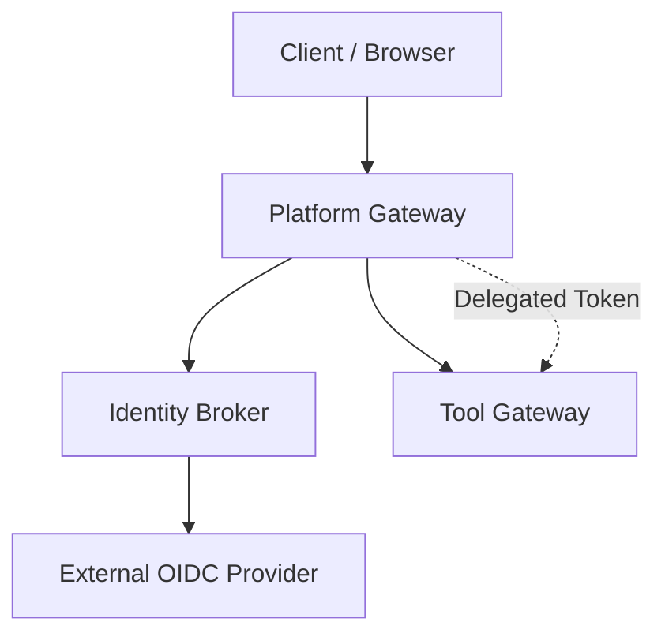
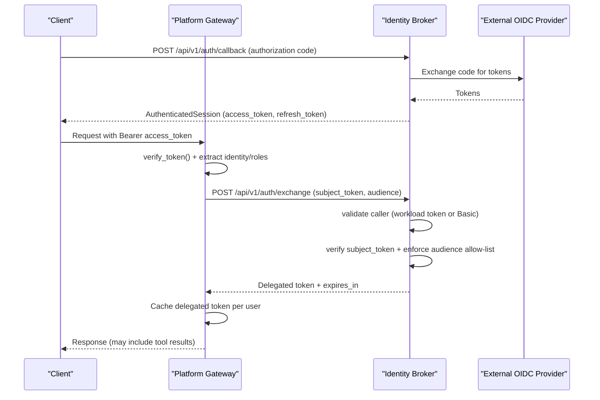
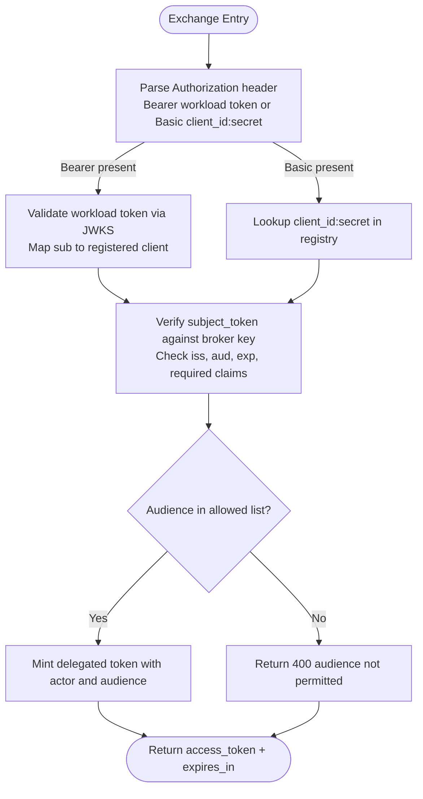
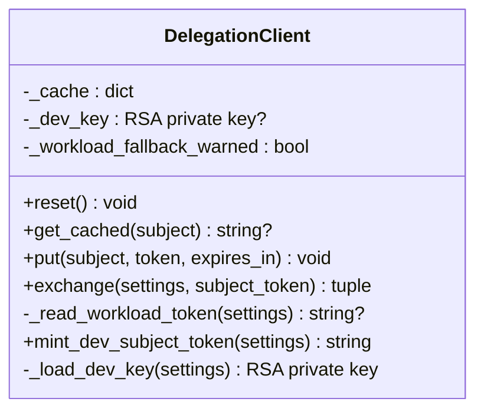
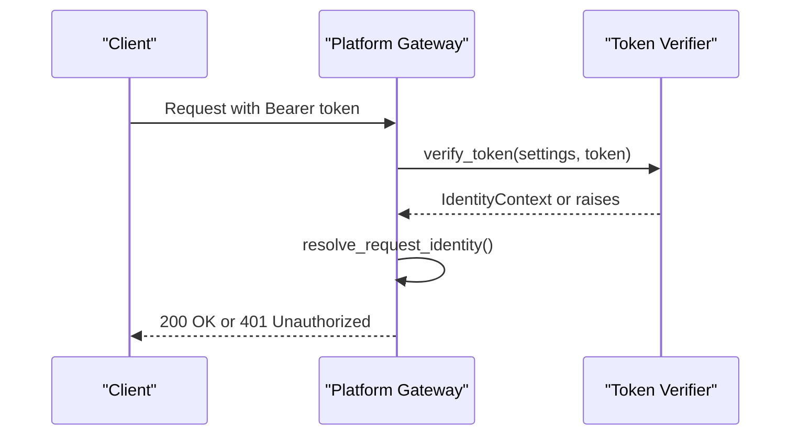
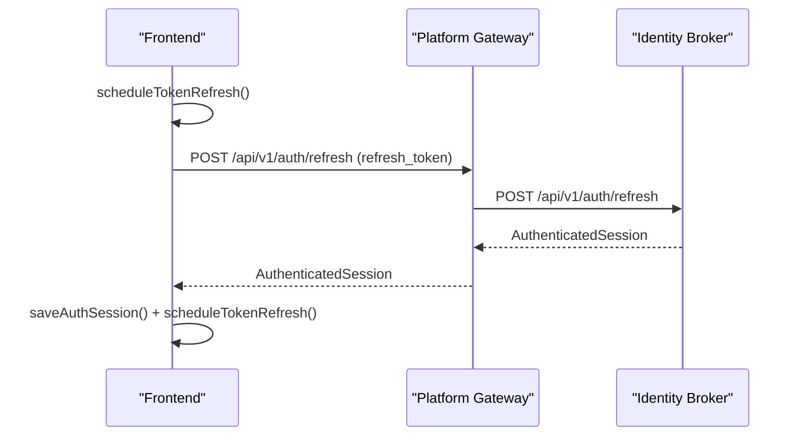
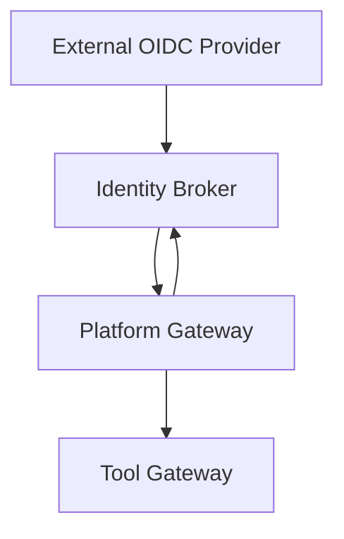

# Authentication Flow Testing

<cite>
**Referenced Files in This Document**
- [exchange_service.py](file://products/identity-broker/src/identity_service/services/exchange_service.py)
- [auth routes (identity broker)](file://products/identity-broker/src/identity_service/api/routes/auth.py)
- [delegation_client.py](file://products/platform-gateway/src/platform_gateway/services/delegation_client.py)
- [gateway auth tests](file://products/platform-gateway/tests/test_gateway_auth.py)
- [delegation tests](file://products/platform-gateway/tests/test_delegation.py)
- [OIDC refresh client](file://products/operator-portal/web-ui/app/src/auth/oidc.ts)
- [platform gateway auth routes](file://products/platform-gateway/src/platform_gateway/api/routes/auth.py)
</cite>

## Table of Contents
1. Introduction
2. Project Structure
3. Core Components
4. Architecture Overview
5. Detailed Component Analysis
6. Dependency Analysis
7. Performance Considerations
8. Troubleshooting Guide
9. Conclusion
10. Appendices

## Introduction
This document provides a comprehensive guide to testing authentication flows across the platform, focusing on:
- OIDC token exchange and delegation via the identity broker service
- Platform gateway authentication middleware, request context setup, and authorization checks
- Cross-service identity propagation using delegated tokens
- Workload identity patterns where services authenticate each other with projected service-account tokens
- Session management, token refresh, and logout procedures across service boundaries
- Strategies for mocking external OIDC providers and simulating failure scenarios such as expired tokens, invalid credentials, and permission denials
- Best practices for testing security-sensitive code paths and ensuring robust error handling

The guidance is grounded in the repository’s identity broker and platform gateway implementations and their test suites.

## Project Structure
The authentication surface spans two primary products:
- Identity broker service: issues platform tokens, handles OIDC callback, supports token refresh, and performs broker-mediated token exchange for delegation
- Platform gateway: verifies incoming user tokens, resolves identities, optionally runs in dev mode with synthetic identity, obtains delegated tokens for tool execution, and exposes auth endpoints for clients

**Diagram sources**
- [auth routes (identity broker):114-183](file://products/identity-broker/src/identity_service/api/routes/auth.py#L114-L183)
- [delegation_client.py:78-101](file://products/platform-gateway/src/platform_gateway/services/delegation_client.py#L78-L101)

**Section sources**
- [auth routes (identity broker):34-111](file://products/identity-broker/src/identity_service/api/routes/auth.py#L34-L111)
- [platform gateway auth routes:85-111](file://products/platform-gateway/src/platform_gateway/api/routes/auth.py#L85-L111)

## Core Components
- Identity broker exchange service: authenticates callers via static HTTP Basic or projected workload tokens, validates subject tokens against the broker’s signing key, enforces audience allow-lists, and mints short-lived delegated tokens with actor context
- Platform gateway delegation client: caches per-user delegated tokens, exchanges subject tokens at the broker, prefers projected workload tokens when available, and falls back to static credentials; failures are non-fatal so chat can proceed without tools
- Platform gateway auth middleware: verifies incoming user tokens, enforces audience, supports synthetic dev identity when required auth is disabled, and maps verified tokens into request-scoped identity contexts
- Frontend session refresh: schedules token refresh before expiry and calls the platform gateway refresh endpoint to obtain new sessions

Key responsibilities:
- Token validation and role extraction occur in the gateway verifier and broker exchange logic
- Permission mapping is enforced by audience allow-lists and role copying from subject tokens during delegation
- Cross-service identity propagation uses delegated tokens carrying actor information

**Section sources**
- [exchange_service.py:46-120](file://products/identity-broker/src/identity_service/services/exchange_service.py#L46-L120)
- [exchange_service.py:123-195](file://products/identity-broker/src/identity_service/services/exchange_service.py#L123-L195)
- [delegation_client.py:44-101](file://products/platform-gateway/src/platform_gateway/services/delegation_client.py#L44-L101)
- [delegation_client.py:128-174](file://products/platform-gateway/src/platform_gateway/services/delegation_client.py#L128-L174)
- [gateway auth tests:20-103](file://products/platform-gateway/tests/test_gateway_auth.py#L20-L103)
- [OIDC refresh client:38-73](file://products/operator-portal/web-ui/app/src/auth/oidc.ts#L38-L73)

## Architecture Overview
The end-to-end authentication flow includes:
- User login via OIDC callback to the identity broker, which issues a platform token
- Platform gateway verifies the user token and extracts identity and roles
- For tool execution, the gateway obtains a delegated token from the identity broker using either a projected workload token or static credentials
- The delegated token carries actor context and audience targeting, enabling cross-service identity propagation
- Clients schedule token refresh before expiry and call the gateway refresh endpoint to maintain sessions

**Diagram sources**
- [auth routes (identity broker):54-111](file://products/identity-broker/src/identity_service/api/routes/auth.py#L54-L111)
- [auth routes (identity broker):114-183](file://products/identity-broker/src/identity_service/api/routes/auth.py#L114-L183)
- [delegation_client.py:78-101](file://products/platform-gateway/src/platform_gateway/services/delegation_client.py#L78-L101)
- [exchange_service.py:148-195](file://products/identity-broker/src/identity_service/services/exchange_service.py#L148-L195)

## Detailed Component Analysis

### Identity Broker Exchange Service
The exchange service implements broker-mediated token delegation:
- Caller authentication supports both static HTTP Basic credentials and projected workload tokens validated against a configured cluster OIDC issuer
- Subject token verification uses the broker’s own signing key and enforces issuer, audience, and required claims
- Audience allow-list enforcement ensures only permitted audiences can be targeted by delegated tokens
- Delegated tokens copy roles verbatim from the subject token and include actor context identifying the calling service

Testing strategies:
- Mock OIDC discovery and JWKS retrieval for workload token validation
- Validate that missing or malformed credentials return 401
- Verify that expired or invalid subject tokens return 401
- Confirm that disallowed audiences return 400
- Assert that delegated tokens carry correct actor and audience claims

**Diagram sources**
- [exchange_service.py:46-120](file://products/identity-broker/src/identity_service/services/exchange_service.py#L46-L120)
- [exchange_service.py:123-195](file://products/identity-broker/src/identity_service/services/exchange_service.py#L123-L195)

**Section sources**
- [exchange_service.py:46-120](file://products/identity-broker/src/identity_service/services/exchange_service.py#L46-L120)
- [exchange_service.py:123-195](file://products/identity-broker/src/identity_service/services/exchange_service.py#L123-L195)

### Platform Gateway Delegation Client
The gateway-side delegation client:
- Caches per-user delegated tokens with near-expiry refresh windows
- Exchanges subject tokens at the broker using either projected workload tokens or static credentials
- Prefers projected workload tokens when available and warns once if falling back to static credentials
- Treats exchange failures as non-fatal to preserve chat functionality even without tools

Testing strategies:
- Mock HTTP calls to the broker exchange endpoint
- Assert cache hit/miss behavior and eviction after refresh window
- Validate that workload token path is read fresh on each exchange
- Confirm fallback logging and behavior when workload token file is missing
- Ensure unconfigured credentials result in no exchange attempt

**Diagram sources**
- [delegation_client.py:44-174](file://products/platform-gateway/src/platform_gateway/services/delegation_client.py#L44-L174)

**Section sources**
- [delegation_client.py:44-101](file://products/platform-gateway/src/platform_gateway/services/delegation_client.py#L44-L101)
- [delegation_client.py:103-174](file://products/platform-gateway/src/platform_gateway/services/delegation_client.py#L103-L174)
- [delegation tests:26-105](file://products/platform-gateway/tests/test_delegation.py#L26-L105)
- [delegation tests:107-268](file://products/platform-gateway/tests/test_delegation.py#L107-L268)

### Platform Gateway Authentication Middleware
The gateway middleware:
- Verifies incoming user tokens using configured audience and signing keys
- Supports synthetic dev identity when authentication is optional
- Maps verified tokens into identity contexts including subject, username, roles, and groups
- Enforces required authentication on protected routes

Testing strategies:
- Mock token verification to simulate valid and invalid tokens
- Assert that malformed Authorization headers return 401
- Confirm synthetic identity is returned when require_auth is false
- Validate that protected routes reject unauthenticated requests

**Diagram sources**
- [gateway auth tests:20-103](file://products/platform-gateway/tests/test_gateway_auth.py#L20-L103)

**Section sources**
- [gateway auth tests:20-103](file://products/platform-gateway/tests/test_gateway_auth.py#L20-L103)
- [gateway auth tests:105-181](file://products/platform-gateway/tests/test_gateway_auth.py#L105-L181)
- [gateway auth tests:183-249](file://products/platform-gateway/tests/test_gateway_auth.py#L183-L249)

### Session Management, Refresh, and Logout
- Frontend schedules token refresh before expiry and calls the platform gateway refresh endpoint
- The identity broker exposes a refresh endpoint that returns a refreshed authenticated session
- The platform gateway exposes a refresh endpoint that logs refresh events and forwards to the identity broker

Testing strategies:
- Mock refresh endpoint responses to simulate success and failure
- Assert that failed refresh clears the session and triggers re-authentication
- Validate logout URL generation and audit logging

**Diagram sources**
- [OIDC refresh client:38-73](file://products/operator-portal/web-ui/app/src/auth/oidc.ts#L38-L73)
- [platform gateway auth routes:85-111](file://products/platform-gateway/src/platform_gateway/api/routes/auth.py#L85-L111)
- [auth routes (identity broker):214-231](file://products/identity-broker/src/identity_service/api/routes/auth.py#L214-L231)

**Section sources**
- [OIDC refresh client:38-73](file://products/operator-portal/web-ui/app/src/auth/oidc.ts#L38-L73)
- [platform gateway auth routes:85-111](file://products/platform-gateway/src/platform_gateway/api/routes/auth.py#L85-L111)
- [auth routes (identity broker):214-231](file://products/identity-broker/src/identity_service/api/routes/auth.py#L214-L231)

## Dependency Analysis
The authentication flow depends on:
- External OIDC provider for initial user authentication
- Identity broker for token issuance, refresh, and delegation
- Platform gateway for token verification, identity resolution, and delegation orchestration
- Tool gateway for executing tools under delegated identity

**Diagram sources**
- [auth routes (identity broker):54-111](file://products/identity-broker/src/identity_service/api/routes/auth.py#L54-L111)
- [delegation_client.py:78-101](file://products/platform-gateway/src/platform_gateway/services/delegation_client.py#L78-L101)

**Section sources**
- [auth routes (identity broker):54-111](file://products/identity-broker/src/identity_service/api/routes/auth.py#L54-L111)
- [delegation_client.py:78-101](file://products/platform-gateway/src/platform_gateway/services/delegation_client.py#L78-L101)

## Performance Considerations
- Delegated token caching reduces repeated broker calls and improves response times
- Near-expiry refresh windows minimize unnecessary re-exchanges while maintaining token freshness
- Workload token preference avoids static credential overhead in production environments
- Non-fatal delegation failures ensure service continuity even when the broker is unavailable

[No sources needed since this section provides general guidance]

## Troubleshooting Guide
Common issues and how to test them:
- Expired subject tokens: assert 401 responses from the broker exchange endpoint
- Invalid credentials: validate 401 responses for missing or incorrect Basic or workload tokens
- Disallowed audiences: confirm 400 responses when requested audience is not in the client’s allow-list
- Missing workload token: verify fallback to static credentials and warning logs
- Token refresh failures: ensure frontend clears session and prompts re-authentication

**Section sources**
- [exchange_service.py:46-120](file://products/identity-broker/src/identity_service/services/exchange_service.py#L46-L120)
- [exchange_service.py:123-195](file://products/identity-broker/src/identity_service/services/exchange_service.py#L123-L195)
- [delegation_client.py:103-174](file://products/platform-gateway/src/platform_gateway/services/delegation_client.py#L103-L174)
- [OIDC refresh client:38-73](file://products/operator-portal/web-ui/app/src/auth/oidc.ts#L38-L73)

## Conclusion
This document outlined comprehensive testing strategies for authentication flows across the identity broker and platform gateway. It covered OIDC token exchange, delegation, cross-service identity propagation, workload identity patterns, session management, and error handling. By leveraging the existing test suites and mocking external dependencies, teams can validate security-sensitive code paths and ensure robust behavior under various failure scenarios.

[No sources needed since this section summarizes without analyzing specific files]

## Appendices

### Test Scenarios Checklist
- Valid OIDC login and token issuance
- Gateway token verification and identity extraction
- Delegated token exchange with workload and static credentials
- Audience allow-list enforcement
- Role copying and actor context in delegated tokens
- Cached delegated token reuse and refresh behavior
- Frontend token refresh scheduling and failure handling
- Logout URL generation and audit logging

[No sources needed since this section provides general guidance]