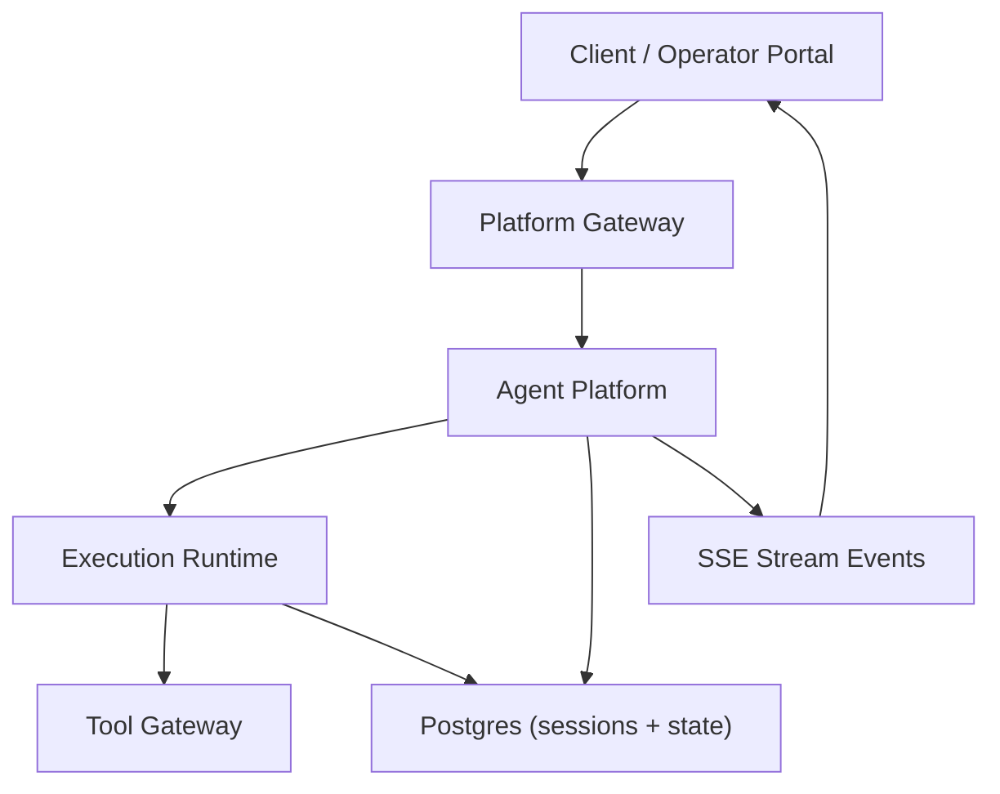
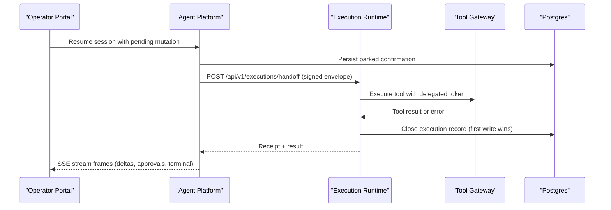
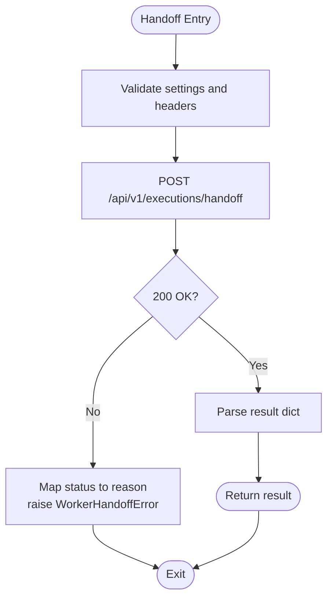
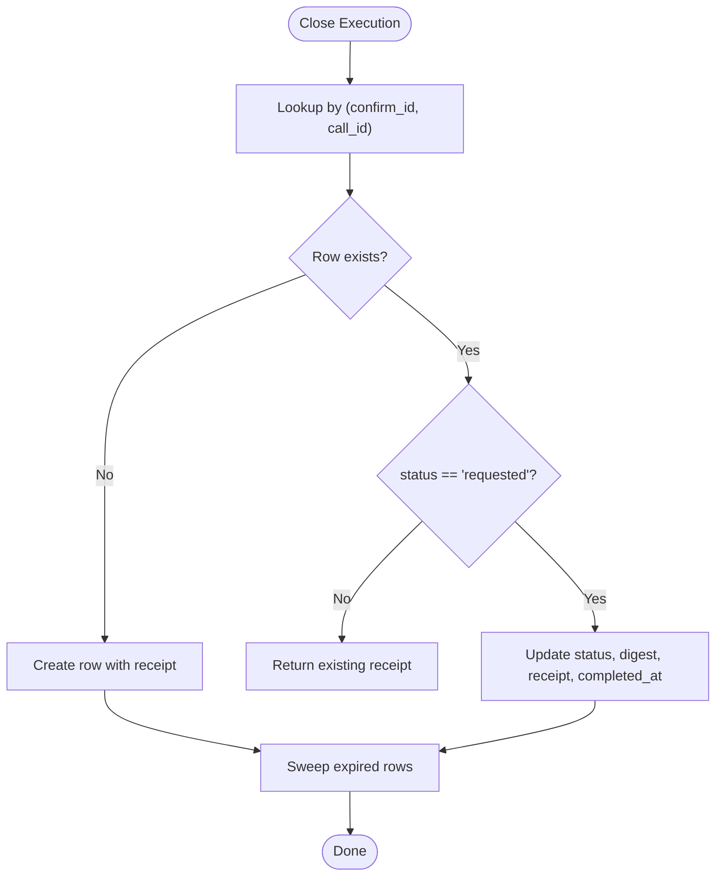
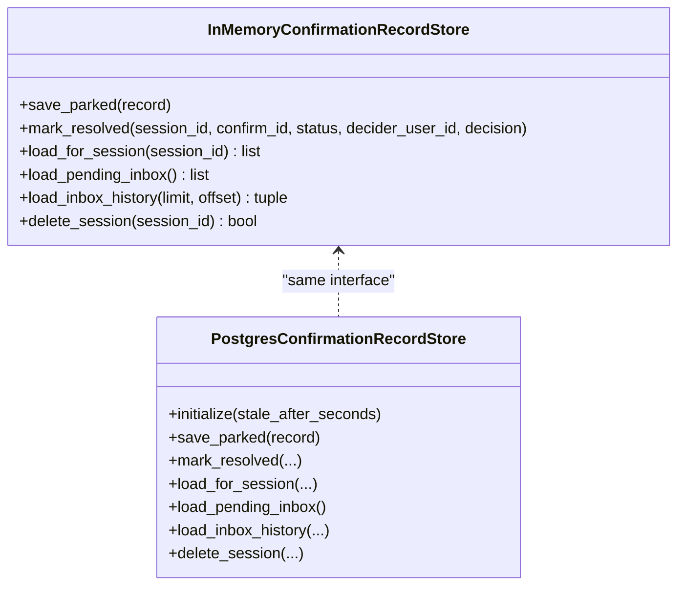
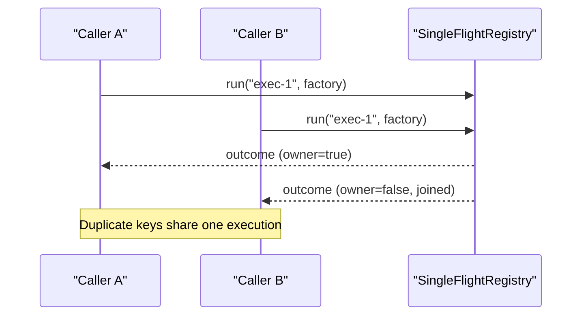
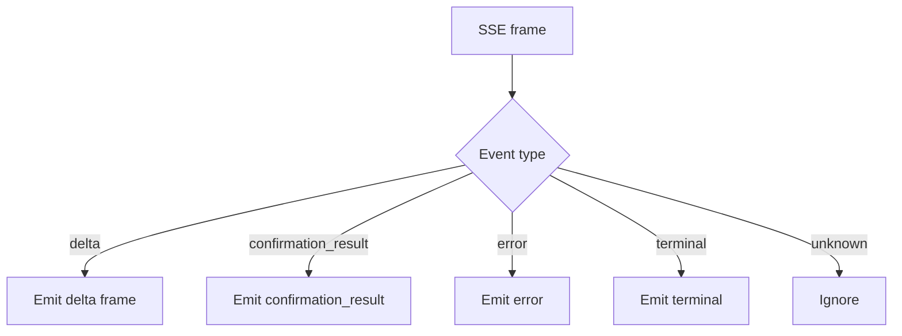
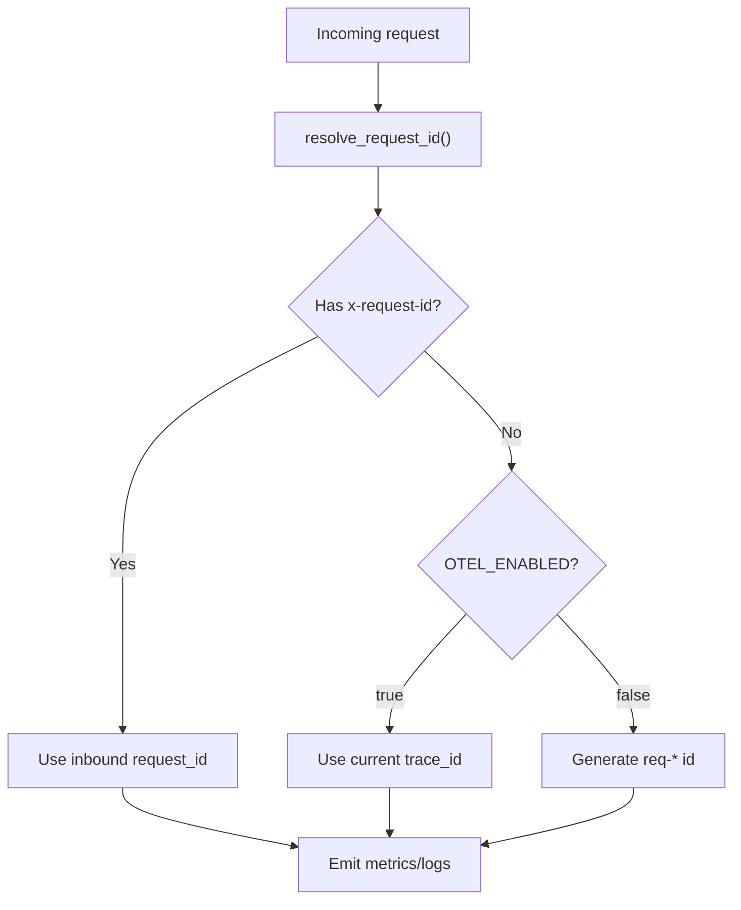
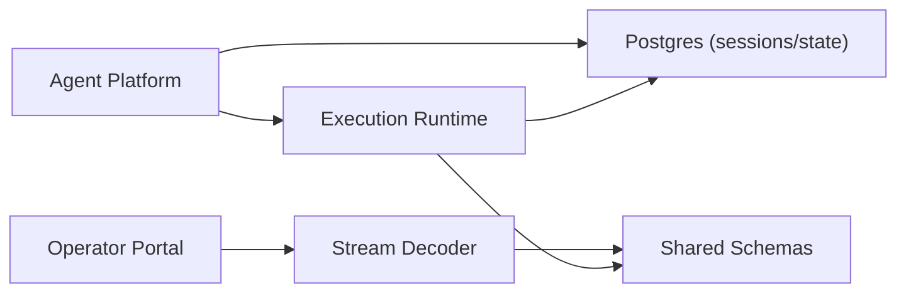

# Distributed System Testing

<cite>
**Referenced Files in This Document**
- [execution_worker_client.py](file://products/agent-platform/src/agent_service/services/execution_worker_client.py)
- [test_execution_worker_client.py](file://products/agent-platform/tests/test_execution_worker_client.py)
- [execution_records.py (execution-runtime)](file://products/execution-runtime/src/execution_runtime/services/execution_records.py)
- [handoff.py](file://products/execution-runtime/src/execution_runtime/api/routes/handoff.py)
- [test_single_flight.py](file://products/execution-runtime/tests/test_single_flight.py)
- [confirmation_records.py](file://products/agent-platform/src/agent_service/services/confirmation_records.py)
- [test_confirmation_records.py](file://products/agent-platform/tests/test_confirmation_records.py)
- [test_execution_records.py](file://products/agent-platform/tests/test_execution_records.py)
- [execution-receipt.schema.json](file://shared/shared-contracts/schemas/execution-receipt.schema.json)
- [stream-event.schema.json](file://shared/shared-contracts/schemas/stream-event.schema.json)
- [decoder.ts](file://products/operator-portal/web-ui/app/src/stream/decoder.ts)
- [decoder.test.ts](file://products/operator-portal/web-ui/app/src/stream/__tests__/decoder.test.ts)
- [test_observability.py](file://products/tool-gateway/tests/test_observability.py)
- [SPEC-016-session-store-postgres-separation/spec.md](file://docs/specs/SPEC-016-session-store-postgres-separation/spec.md)
- [CrashLoopsAndOOM.md](file://shared/platform-ops/skills/platform-runbooks/guides/CrashLoopsAndOOM.md)
</cite>

## Table of Contents
1. Introduction
2. Project Structure
3. Core Components
4. Architecture Overview
5. Detailed Component Analysis
6. Dependency Analysis
7. Performance Considerations
8. Troubleshooting Guide
9. Conclusion

## Introduction
This document provides comprehensive distributed system testing guidance for the platform’s asynchronous, event-driven, and eventually consistent behaviors. It focuses on message handoff between services, durable confirmation records, execution receipts, stream events, single-flight deduplication, idempotency guarantees, failure recovery, and observability across service boundaries. The guidance is grounded in the repository’s implementation and tests to ensure accuracy and actionability.

## Project Structure
The platform implements a multi-service architecture with clear separation of concerns:
- Agent Platform orchestrates sessions, approvals, and evidence, and hands off mutating executions to an isolated worker.
- Execution Runtime executes tool calls, writes signed receipts, and closes execution records.
- Tool Gateway proxies tool invocations with policy enforcement and observability.
- Operator Portal consumes streams and renders approval cards and transcripts.
- Shared contracts define schemas for cross-service payloads such as execution receipts and stream events.

**Diagram sources**
- [execution_worker_client.py:54-144](file://products/agent-platform/src/agent_service/services/execution_worker_client.py#L54-L144)
- [handoff.py:236-263](file://products/execution-runtime/src/execution_runtime/api/routes/handoff.py#L236-L263)
- [execution_records.py (execution-runtime):127-191](file://products/execution-runtime/src/execution_runtime/services/execution_records.py#L127-L191)
- [confirmation_records.py:259-443](file://products/agent-platform/src/agent_service/services/confirmation_records.py#L259-L443)
- [stream-event.schema.json:1-27](file://shared/shared-contracts/schemas/stream-event.schema.json#L1-L27)

**Section sources**
- [execution_worker_client.py:1-145](file://products/agent-platform/src/agent_service/services/execution_worker_client.py#L1-L145)
- [execution_records.py (execution-runtime):1-345](file://products/execution-runtime/src/execution_runtime/services/execution_records.py#L1-L345)
- [confirmation_records.py:1-744](file://products/agent-platform/src/agent_service/services/confirmation_records.py#L1-L744)
- [stream-event.schema.json:1-27](file://shared/shared-contracts/schemas/stream-event.schema.json#L1-L27)

## Core Components
- Execution handoff client: Sends signed execution envelopes to the worker with bounded timeouts and structured error propagation.
- Execution record store: Closes execution rows exactly once with first-write-wins semantics; supports memory and Postgres backends.
- Confirmation record store: Persists parked approvals and their resolution with startup TTL sweep and bounded inbox history.
- Single-flight registry: Deduplicates concurrent executions by key, supports replay and eviction.
- Stream decoder: Parses server-sent events into UI frames, handling deltas, errors, and terminal events.
- Observability bridge: Correlates requests across services using request IDs or trace IDs, exposes metrics, and gates OTel safely.

**Section sources**
- [execution_worker_client.py:54-144](file://products/agent-platform/src/agent_service/services/execution_worker_client.py#L54-L144)
- [execution_records.py (execution-runtime):87-124](file://products/execution-runtime/src/execution_runtime/services/execution_records.py#L87-L124)
- [confirmation_records.py:141-244](file://products/agent-platform/src/agent_service/services/confirmation_records.py#L141-L244)
- [test_single_flight.py:17-199](file://products/execution-runtime/tests/test_single_flight.py#L17-L199)
- [decoder.ts:161-202](file://products/operator-portal/web-ui/app/src/stream/decoder.ts#L161-L202)
- [test_observability.py:106-125](file://products/tool-gateway/tests/test_observability.py#L106-L125)

## Architecture Overview
The end-to-end flow for a mutating tool call involves session resumption, approval parking, execution handoff, tool execution, receipt signing, and eventual consistency via durable stores.

**Diagram sources**
- [execution_worker_client.py:54-144](file://products/agent-platform/src/agent_service/services/execution_worker_client.py#L54-L144)
- [handoff.py:236-263](file://products/execution-runtime/src/execution_runtime/api/routes/handoff.py#L236-L263)
- [execution_records.py (execution-runtime):127-191](file://products/execution-runtime/src/execution_runtime/services/execution_records.py#L127-L191)
- [confirmation_records.py:521-582](file://products/agent-platform/src/agent_service/services/confirmation_records.py#L521-L582)
- [stream-event.schema.json:1-27](file://shared/shared-contracts/schemas/stream-event.schema.json#L1-L27)

## Detailed Component Analysis

### Execution Handoff and Worker Interaction
- The agent platform’s handoff client posts a signed execution envelope to the worker with a bearer token and optional x-request-id correlation header. Timeouts raise a dedicated exception so resumed streams can surface structured timeout results. Transport failures map to a fail-closed worker_unavailable reason.
- Tests verify happy path responses, headers, body contents, timeouts, transport errors, malformed responses, and log redaction of tokens.

**Diagram sources**
- [execution_worker_client.py:54-144](file://products/agent-platform/src/agent_service/services/execution_worker_client.py#L54-L144)

**Section sources**
- [execution_worker_client.py:54-144](file://products/agent-platform/src/agent_service/services/execution_worker_client.py#L54-L144)
- [test_execution_worker_client.py:56-276](file://products/agent-platform/tests/test_execution_worker_client.py#L56-L276)

### Execution Record Closing and Idempotency
- The worker closes execution records exactly once. If a row is already closed (e.g., from a resumed stream timeout), the existing receipt survives and is returned to callers. This ensures late arrivals do not overwrite earlier outcomes.
- Postgres backend uses conditional updates to enforce “requested” status before closing, and sweeps expired rows opportunistically.

**Diagram sources**
- [execution_records.py (execution-runtime):92-116](file://products/execution-runtime/src/execution_runtime/services/execution_records.py#L92-L116)
- [execution_records.py (execution-runtime):160-191](file://products/execution-runtime/src/execution_runtime/services/execution_records.py#L160-L191)

**Section sources**
- [execution_records.py (execution-runtime):87-124](file://products/execution-runtime/src/execution_runtime/services/execution_records.py#L87-L124)
- [execution_records.py (execution-runtime):127-191](file://products/execution-runtime/src/execution_runtime/services/execution_records.py#L127-L191)
- [test_execution_records.py:78-102](file://products/agent-platform/tests/test_execution_records.py#L78-L102)

### Durable Confirmations and Eventual Consistency
- Confirmation records persist parked approvals and their resolutions. On startup, stale pending rows past the HITL TTL are marked expired to prevent inconsistent states after restarts. Inbox history is bounded and paginated; resolved rows beyond the window are swept opportunistically.
- Tests validate per-session caps, inbox limits, pagination totals, and Postgres behavior under connection failures.

**Diagram sources**
- [confirmation_records.py:141-244](file://products/agent-platform/src/agent_service/services/confirmation_records.py#L141-L244)
- [confirmation_records.py:492-686](file://products/agent-platform/src/agent_service/services/confirmation_records.py#L492-L686)

**Section sources**
- [confirmation_records.py:1-744](file://products/agent-platform/src/agent_service/services/confirmation_records.py#L1-L744)
- [test_confirmation_records.py:241-326](file://products/agent-platform/tests/test_confirmation_records.py#L241-L326)

### Single-Flight Deduplication and Replay
- The single-flight registry ensures that concurrent duplicate requests for the same execution key join one owner, return identical outcomes, and support replay without re-execution. Completed flights are evicted after retention; failed flights release joiners and allow retries.
- Tests cover concurrency joins, replay, eviction, capacity caps, and failure release.

**Diagram sources**
- [test_single_flight.py:36-63](file://products/execution-runtime/tests/test_single_flight.py#L36-L63)

**Section sources**
- [test_single_flight.py:17-199](file://products/execution-runtime/tests/test_single_flight.py#L17-L199)

### Stream Events and UI Rendering
- The operator portal decodes SSE frames into UI-friendly structures, mapping delta frames, approval results, errors, and terminal events. Tests assert correct mapping and filtering of unknown types.

**Diagram sources**
- [decoder.ts:161-202](file://products/operator-portal/web-ui/app/src/stream/decoder.ts#L161-L202)
- [decoder.test.ts:10-33](file://products/operator-portal/web-ui/app/src/stream/__tests__/decoder.test.ts#L10-L33)

**Section sources**
- [decoder.ts:161-202](file://products/operator-portal/web-ui/app/src/stream/decoder.ts#L161-L202)
- [decoder.test.ts:1-33](file://products/operator-portal/web-ui/app/src/stream/__tests__/decoder.test.ts#L1-L33)

### Observability and Correlation Across Services
- Request ID resolution prefers inbound headers, falls back to generated IDs when tracing is disabled, and bridges to OpenTelemetry trace IDs when enabled. Metrics endpoints expose domain counters and are exempt from authentication.
- Tests validate metric presence, label correctness, correlation bridging, and safe gating when collectors are unreachable.

**Diagram sources**
- [test_observability.py:106-125](file://products/tool-gateway/tests/test_observability.py#L106-L125)

**Section sources**
- [test_observability.py:33-158](file://products/tool-gateway/tests/test_observability.py#L33-L158)

## Dependency Analysis
- Agent Platform depends on Execution Runtime for executing mutations and relies on durable stores for confirmation and execution records.
- Execution Runtime depends on Postgres for execution records and may fall back to in-memory storage if unavailable.
- Operator Portal depends on stream events and decoders to render live interactions.
- Shared schemas constrain cross-service payloads like execution receipts and stream events.

**Diagram sources**
- [execution_records.py (execution-runtime):310-333](file://products/execution-runtime/src/execution_runtime/services/execution_records.py#L310-L333)
- [confirmation_records.py:693-744](file://products/agent-platform/src/agent_service/services/confirmation_records.py#L693-L744)
- [execution-receipt.schema.json:1-47](file://shared/shared-contracts/schemas/execution-receipt.schema.json#L1-L47)
- [stream-event.schema.json:1-27](file://shared/shared-contracts/schemas/stream-event.schema.json#L1-L27)

**Section sources**
- [execution_records.py (execution-runtime):310-333](file://products/execution-runtime/src/execution_runtime/services/execution_records.py#L310-L333)
- [confirmation_records.py:693-744](file://products/agent-platform/src/agent_service/services/confirmation_records.py#L693-L744)
- [execution-receipt.schema.json:1-47](file://shared/shared-contracts/schemas/execution-receipt.schema.json#L1-L47)
- [stream-event.schema.json:1-27](file://shared/shared-contracts/schemas/stream-event.schema.json#L1-L27)

## Performance Considerations
- Bounded timeouts: Handoff uses configurable timeouts to prevent long-running resume stalls; tests assert timeout behavior and structured error propagation.
- First-write-wins semantics: Execution record closing avoids duplicate writes and reduces contention; Postgres conditional updates enforce this at the database level.
- Retention and sweeping: Both confirmation and execution records sweep expired data opportunistically to control storage growth and query performance.
- Metrics exposure: Prometheus metrics are exposed and labeled for request counts and durations; tests assert presence and labels.
- Capacity planning: Use single-flight deduplication to reduce redundant work; monitor metrics to identify hotspots and tune timeouts and retention windows accordingly.

[No sources needed since this section provides general guidance]

## Troubleshooting Guide
- Worker unavailability: Missing configuration or transport errors raise structured reasons; tests verify fail-closed posture and token redaction in logs.
- Late completions: When a resumed stream times out and later the worker completes, the first close wins; late completions are logged and counted without overwriting earlier receipts.
- Session store durability: Postgres separation introduces TTL semantics drift; mitigation includes exact expiry checks on reads and fail-open fallback to memory at startup.
- Crash loops and OOM: Diagnose container exit codes and memory limits; capture previous logs and adjust resource limits or fix leaks.

**Section sources**
- [test_execution_worker_client.py:117-276](file://products/agent-platform/tests/test_execution_worker_client.py#L117-L276)
- [handoff.py:236-263](file://products/execution-runtime/src/execution_runtime/api/routes/handoff.py#L236-L263)
- [SPEC-016-session-store-postgres-separation/spec.md:144-157](file://docs/specs/SPEC-016-session-store-postgres-separation/spec.md#L144-L157)
- [CrashLoopsAndOOM.md:1-46](file://shared/platform-ops/skills/platform-runbooks/guides/CrashLoopsAndOOM.md#L1-L46)

## Conclusion
The platform implements robust patterns for distributed testing: deterministic idempotent record closing, durable confirmation lifecycles, single-flight deduplication, structured error handling, and cross-service observability. Tests validate these behaviors across network failures, timeouts, and eventual consistency scenarios. By leveraging these patterns and test strategies, teams can confidently evolve microservice interactions while maintaining reliability and auditability.