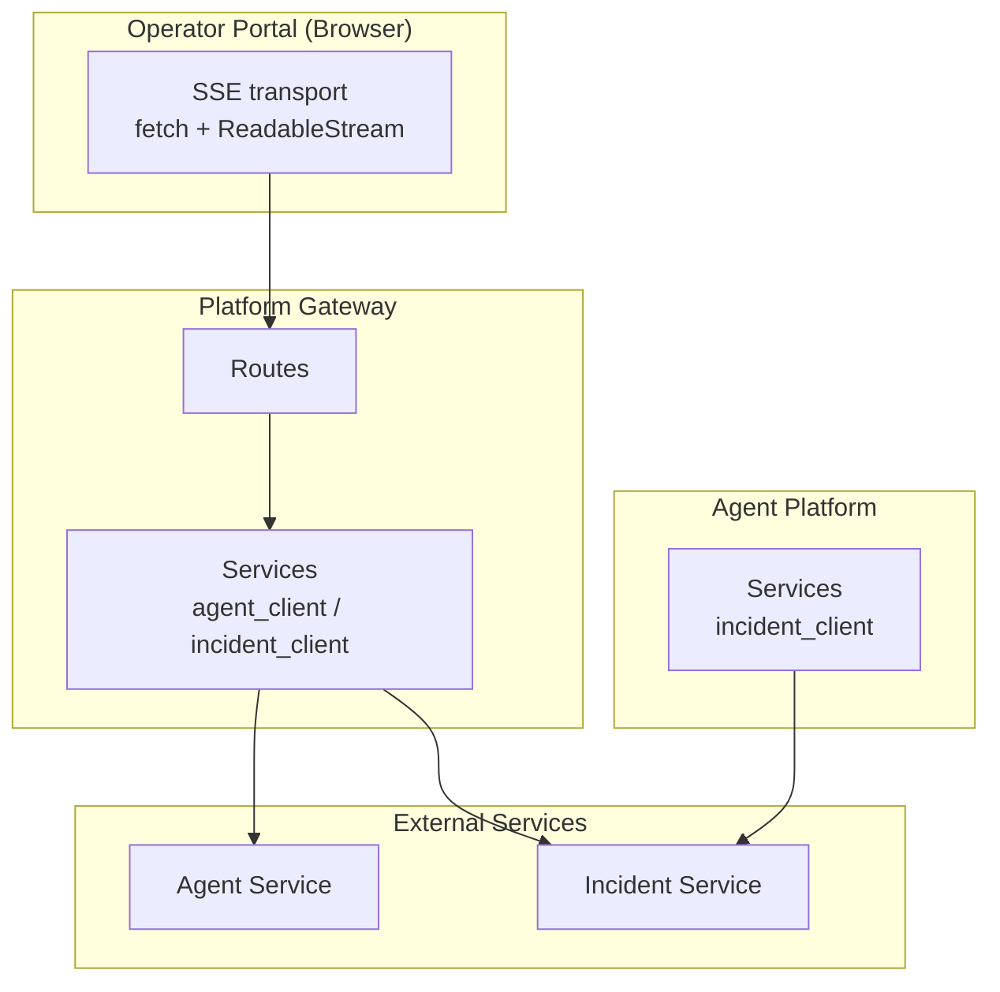
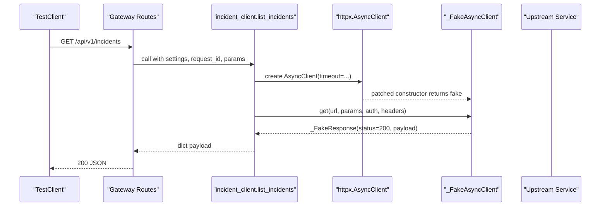
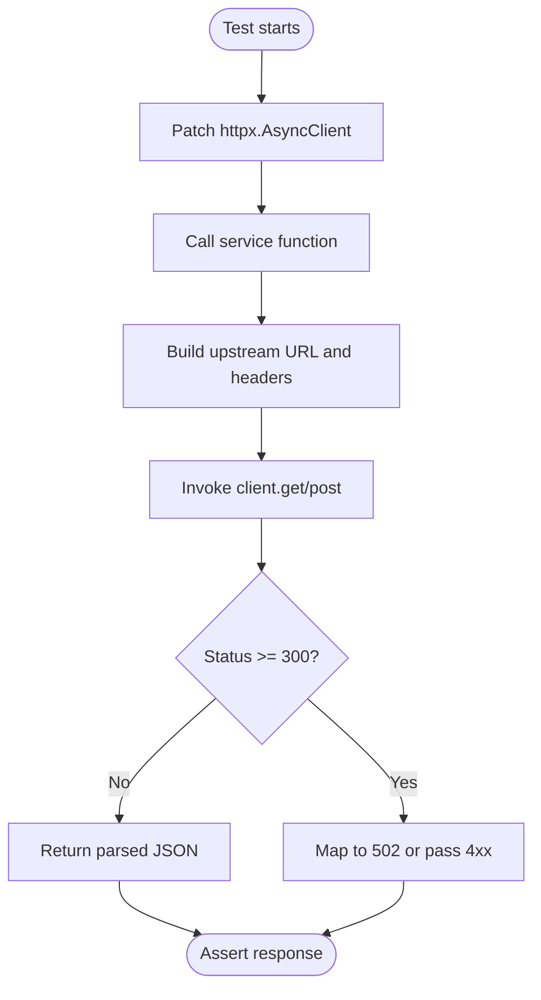
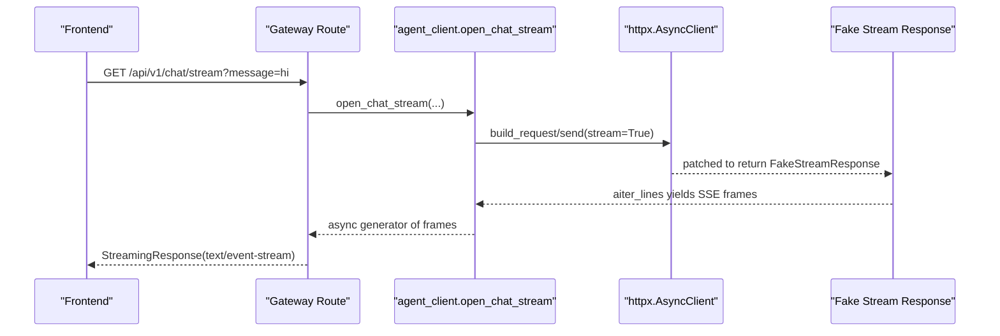
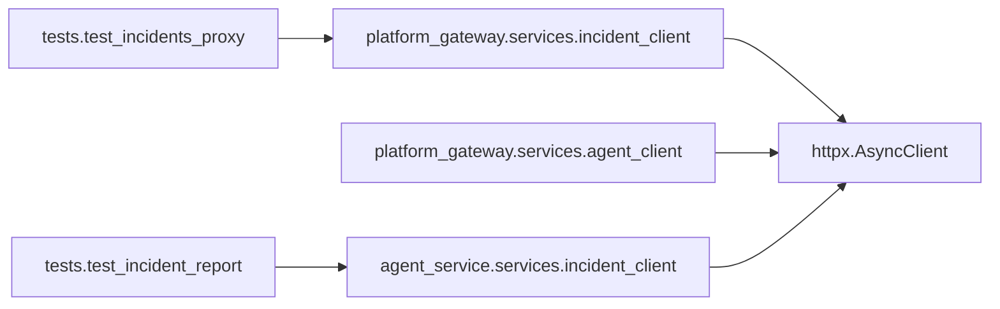

# HTTP Client Mocking

<cite>
**Referenced Files in This Document**
- [incident_client.py](file://products/platform-gateway/src/platform_gateway/services/incident_client.py)
- [test_incidents_proxy.py](file://products/platform-gateway/tests/test_incidents_proxy.py)
- [agent_client.py](file://products/platform-gateway/src/platform_gateway/services/agent_client.py)
- [gateway_service.py](file://products/platform-gateway/src/platform_gateway/services/gateway_service.py)
- [incident_client.py](file://products/agent-platform/src/agent_service/services/incident_client.py)
- [test_incident_report.py](file://products/agent-platform/tests/test_incident_report.py)
- [transport.ts](file://products/operator-portal/web-ui/app/src/stream/transport.ts)
- [useChatStream.ts](file://products/operator-portal/web-ui/app/src/stream/useChatStream.ts)
- [decoder.ts](file://products/operator-portal/web-ui/app/src/stream/decoder.ts)
- [test_chat_stream_modality.py](file://products/platform-gateway/tests/test_chat_stream_modality.py)
</cite>

## Table of Contents
1. Introduction
2. Project Structure
3. Core Components
4. Architecture Overview
5. Detailed Component Analysis
6. Dependency Analysis
7. Performance Considerations
8. Troubleshooting Guide
9. Conclusion

## Introduction
This document explains how to mock HTTP clients for testing inter-service communication across the platform. It focuses on mocking httpx.AsyncClient and synchronous httpx.Client used by services, simulating success, error, timeout, and network failure scenarios, validating request payloads/headers/query parameters, and covering retry logic, circuit breaker patterns, streaming responses, and WebSocket-like flows. It also provides reusable fixture patterns found in this codebase to keep tests deterministic and fast.

## Project Structure
The repository contains multiple products that call each other over HTTP:
- Platform Gateway proxies requests to Agent Service and Incident Service using httpx.AsyncClient.
- Agent Platform calls Incident Service via httpx.AsyncClient to assemble incident reports.
- Operator Portal uses browser fetch with streaming SSE for real-time features.

**Diagram sources**
- [incident_client.py:65-193](file://products/platform-gateway/src/platform_gateway/services/incident_client.py#L65-L193)
- [agent_client.py:1-39](file://products/platform-gateway/src/platform_gateway/services/agent_client.py#L1-L39)
- [incident_client.py:77-122](file://products/agent-platform/src/agent_service/services/incident_client.py#L77-L122)
- [transport.ts:108-164](file://products/operator-portal/web-ui/app/src/stream/transport.ts#L108-L164)

**Section sources**
- [incident_client.py:65-193](file://products/platform-gateway/src/platform_gateway/services/incident_client.py#L65-L193)
- [agent_client.py:1-39](file://products/platform-gateway/src/platform_gateway/services/agent_client.py#L1-L39)
- [incident_client.py:77-122](file://products/agent-platform/src/agent_service/services/incident_client.py#L77-L122)
- [transport.ts:108-164](file://products/operator-portal/web-ui/app/src/stream/transport.ts#L108-L164)

## Core Components
- Platform Gateway incident client: builds URLs, sets Basic auth, forwards x-request-id, maps upstream errors to 502 or passes 4xx through.
- Agent Platform incident client: structured exception hierarchy (not configured, unavailable, not found, rejected), reads timeouts from settings.
- Tests demonstrate two primary mocking strategies:
  - Patch httpx.AsyncClient constructor to return a fake context manager that records calls and returns controlled responses or raises exceptions.
  - Patch higher-level service functions to inject StreamingResponse or async generators for stream endpoints.

Key patterns observed:
- FakeAsyncClient implements async context manager protocol and get/post methods to capture method, url, params, json, auth, headers.
- _FakeResponse exposes status_code and json() to simulate response bodies.
- Tests patch at the module where httpx is imported to ensure the production code uses the fake.

**Section sources**
- [test_incidents_proxy.py:51-133](file://products/platform-gateway/tests/test_incidents_proxy.py#L51-L133)
- [test_incident_report.py:58-99](file://products/agent-platform/tests/test_incident_report.py#L58-L99)
- [incident_client.py:65-193](file://products/platform-gateway/src/platform_gateway/services/incident_client.py#L65-L193)
- [incident_client.py:77-122](file://products/agent-platform/src/agent_service/services/incident_client.py#L77-L122)

## Architecture Overview
End-to-end flow for proxying an incidents list request with mocked HTTP:

**Diagram sources**
- [test_incidents_proxy.py:128-154](file://products/platform-gateway/tests/test_incidents_proxy.py#L128-L154)
- [incident_client.py:65-85](file://products/platform-gateway/src/platform_gateway/services/incident_client.py#L65-L85)

**Section sources**
- [test_incidents_proxy.py:128-154](file://products/platform-gateway/tests/test_incidents_proxy.py#L128-L154)
- [incident_client.py:65-85](file://products/platform-gateway/src/platform_gateway/services/incident_client.py#L65-L85)

## Detailed Component Analysis

### Mocking httpx.AsyncClient for synchronous-style proxies
Use a small fake that mimics the async context manager and captures arguments. Assert on captured calls to validate URL, query params, JSON body, auth tuple, and headers such as x-request-id.

- Validate successful responses by returning a fake response with status_code and json().
- Validate error propagation by raising httpx.HTTPError or returning non-2xx responses; assert gateway maps them to 502 or passes 4xx through.
- Validate configuration failures by ensuring missing base URL yields 503 before any outbound call.

**Diagram sources**
- [incident_client.py:65-193](file://products/platform-gateway/src/platform_gateway/services/incident_client.py#L65-L193)
- [test_incidents_proxy.py:51-133](file://products/platform-gateway/tests/test_incidents_proxy.py#L51-L133)

**Section sources**
- [test_incidents_proxy.py:51-133](file://products/platform-gateway/tests/test_incidents_proxy.py#L51-L133)
- [incident_client.py:65-193](file://products/platform-gateway/src/platform_gateway/services/incident_client.py#L65-L193)

### Validating request payloads, headers, and query parameters
- Query parameters: assert forwarded filters like status, severity, limit, offset are present on the recorded call.
- JSON body: assert title, summary, labels are sent unchanged when creating resources.
- Headers: verify x-request-id forwarding, operator identity headers (e.g., x-user-id), delegated tokens (e.g., x-delegated-token), and content-type when applicable.
- Auth: confirm Basic auth tuple matches the service’s client credentials, never the user token.

Examples in this codebase:
- Incidents list filters forwarded and verified.
- Create incident includes reported_by header and JSON body.
- Triage forwards operator identity and delegated token.

**Section sources**
- [test_incidents_proxy.py:174-195](file://products/platform-gateway/tests/test_incidents_proxy.py#L174-L195)
- [test_incidents_proxy.py:247-266](file://products/platform-gateway/tests/test_incidents_proxy.py#L247-L266)
- [test_incidents_proxy.py:302-329](file://products/platform-gateway/tests/test_incidents_proxy.py#L302-L329)

### Simulating error responses, timeouts, and network failures
- Upstream 4xx: pass through with detail message extracted from response envelope.
- Upstream 5xx: map to 502 “unavailable”.
- Transport errors: raise httpx.HTTPError (e.g., ConnectError) and map to 502.
- Missing configuration: raise 503 before making any outbound call.
- Timeouts: set explicit timeouts on AsyncClient; tests can assert timeout values or rely on test harness to fail if too slow.

Patterns:
- Use _FakeAsyncClient(response=..., raise_exc=...) to simulate both response-based and exception-based failures.
- For agent platform incident client, use monkeypatch to replace httpx.AsyncClient and assert structured exceptions (not configured, unavailable, not found, rejected).

**Section sources**
- [test_incidents_proxy.py:361-386](file://products/platform-gateway/tests/test_incidents_proxy.py#L361-L386)
- [incident_client.py:35-63](file://products/platform-gateway/src/platform_gateway/services/incident_client.py#L35-L63)
- [test_incident_report.py:107-168](file://products/agent-platform/tests/test_incident_report.py#L107-L168)

### Testing retry logic and circuit breaker patterns
- The codebase does not implement retries or circuit breakers around these HTTP calls. Tests focus on single-call behavior and error mapping.
- To test retry logic, wrap the service call in a retry decorator and stub the underlying httpx.AsyncClient to fail N times then succeed; assert total attempts and final outcome.
- To test a circuit breaker, add a stateful wrapper around the client that opens/closes based on failure thresholds; drive it via tests that toggle fake responses between success and failure.

[No sources needed since this section provides general guidance]

### Testing streaming responses and real-time features
- Gateway chat stream: tests patch the route handler to return a FastAPI StreamingResponse with SSE frames and assert modality metadata and audit logs.
- Agent client streaming: tests patch httpx.AsyncClient to provide a minimal stream response and assert frames yielded and early error handling for unknown sessions.
- Operator Portal SSE: frontend uses fetch with ReadableStream and decodes SSE lines; tests stub fetch to return canned SSE bodies and assert UI behavior.

**Diagram sources**
- [test_chat_stream_modality.py:121-180](file://products/platform-gateway/tests/test_chat_stream_modality.py#L121-L180)
- [test_chat_stream_modality.py:217-283](file://products/platform-gateway/tests/test_chat_stream_modality.py#L217-L283)
- [transport.ts:108-164](file://products/operator-portal/web-ui/app/src/stream/transport.ts#L108-L164)

**Section sources**
- [test_chat_stream_modality.py:33-119](file://products/platform-gateway/tests/test_chat_stream_modality.py#L33-L119)
- [test_chat_stream_modality.py:121-180](file://products/platform-gateway/tests/test_chat_stream_modality.py#L121-L180)
- [test_chat_stream_modality.py:217-283](file://products/platform-gateway/tests/test_chat_stream_modality.py#L217-L283)
- [transport.ts:108-164](file://products/operator-portal/web-ui/app/src/stream/transport.ts#L108-L164)
- [useChatStream.ts:276-312](file://products/operator-portal/web-ui/app/src/stream/useChatStream.ts#L276-L312)
- [decoder.ts:204-250](file://products/operator-portal/web-ui/app/src/stream/decoder.ts#L204-L250)

### Mocking external API dependencies and third-party integrations
- Replace httpx.AsyncClient or httpx.Client constructors with fakes that record calls and return controlled responses.
- For modules that import httpx directly, patch at the module namespace where it is used (e.g., services.incident_client.httpx.AsyncClient).
- For synchronous clients (audit emitters), patch httpx.Client similarly and assert errors are swallowed and counted.

**Section sources**
- [test_incidents_proxy.py:128-133](file://products/platform-gateway/tests/test_incidents_proxy.py#L128-L133)
- [test_incident_report.py:93-99](file://products/agent-platform/tests/test_incident_report.py#L93-L99)

### Reusable mock fixtures and utilities
Recommended patterns derived from the codebase:
- FakeAsyncClient: implements __aenter__/__aexit__, get/post, records calls, optionally raises exceptions.
- _FakeResponse: exposes status_code and json() to mimic httpx.Response.
- Patch helpers:
  - _patch_httpx: patches httpx.AsyncClient in the target module and returns a context manager.
  - _patch_http: monkeypatches httpx.AsyncClient in a specific module namespace.
- For streaming routes, return FastAPI StreamingResponse with an async generator yielding SSE frames.

Usage tips:
- Always assert on captured calls to validate URL, method, params, json, auth, headers.
- For error paths, assert both status codes and mapped details.
- For streams, assert frame sequences and error propagation before any data is committed.

**Section sources**
- [test_incidents_proxy.py:51-133](file://products/platform-gateway/tests/test_incidents_proxy.py#L51-L133)
- [test_incident_report.py:58-99](file://products/agent-platform/tests/test_incident_report.py#L58-L99)
- [test_chat_stream_modality.py:33-81](file://products/platform-gateway/tests/test_chat_stream_modality.py#L33-L81)

## Dependency Analysis
- Platform Gateway depends on httpx.AsyncClient for all outbound calls to Agent Service and Incident Service.
- Agent Platform depends on httpx.AsyncClient for fetching incident bundles.
- Tests depend on patching those imports to isolate behavior and control outcomes.

**Diagram sources**
- [incident_client.py:65-193](file://products/platform-gateway/src/platform_gateway/services/incident_client.py#L65-L193)
- [agent_client.py:1-39](file://products/platform-gateway/src/platform_gateway/services/agent_client.py#L1-L39)
- [incident_client.py:77-122](file://products/agent-platform/src/agent_service/services/incident_client.py#L77-L122)
- [test_incidents_proxy.py:128-133](file://products/platform-gateway/tests/test_incidents_proxy.py#L128-L133)
- [test_incident_report.py:93-99](file://products/agent-platform/tests/test_incident_report.py#L93-L99)

**Section sources**
- [incident_client.py:65-193](file://products/platform-gateway/src/platform_gateway/services/incident_client.py#L65-L193)
- [agent_client.py:1-39](file://products/platform-gateway/src/platform_gateway/services/agent_client.py#L1-L39)
- [incident_client.py:77-122](file://products/agent-platform/src/agent_service/services/incident_client.py#L77-L122)
- [test_incidents_proxy.py:128-133](file://products/platform-gateway/tests/test_incidents_proxy.py#L128-L133)
- [test_incident_report.py:93-99](file://products/agent-platform/tests/test_incident_report.py#L93-L99)

## Performance Considerations
- Keep mocks lightweight: avoid unnecessary I/O or sleeps in fake responses.
- Use targeted patches to minimize test coupling and startup overhead.
- For streaming tests, yield small chunks to keep tests fast while still exercising decoding logic.
- Avoid asserting on timing-sensitive behaviors unless necessary; prefer functional assertions on outputs and call counts.

[No sources needed since this section provides general guidance]

## Troubleshooting Guide
Common issues and resolutions:
- Wrong patch target: ensure you patch httpx.AsyncClient in the module where it is imported, not globally.
- Missing context manager methods: fake must implement __aenter__/__aexit__ for async with blocks.
- Streaming early errors: ensure errors occur before committing the response; tests show mapping of upstream 404/409/500 to appropriate gateway statuses.
- Configuration checks: missing base URL should short-circuit with 503; verify no outbound calls are made.

**Section sources**
- [test_incidents_proxy.py:361-386](file://products/platform-gateway/tests/test_incidents_proxy.py#L361-L386)
- [test_chat_stream_modality.py:182-215](file://products/platform-gateway/tests/test_chat_stream_modality.py#L182-L215)
- [test_chat_stream_modality.py:217-283](file://products/platform-gateway/tests/test_chat_stream_modality.py#L217-L283)

## Conclusion
This codebase demonstrates robust, repeatable patterns for mocking HTTP clients during tests:
- Use small fake clients that record calls and return controlled responses or raise exceptions.
- Validate request construction (URLs, headers, params, bodies) and response mapping (4xx passthrough, 5xx to 502, config errors to 503).
- For streaming, patch route handlers or lower-level clients to yield SSE frames and assert error propagation before data commitment.
- Adopt reusable fixtures (_FakeAsyncClient, _FakeResponse, patch helpers) to standardize HTTP testing across services.

These practices enable reliable, fast, and isolated tests for inter-service communication without relying on live dependencies.