# Service Communication Testing

<cite>
**Referenced Files in This Document**
- [test_delegation.py](file://products/platform-gateway/tests/test_delegation.py)
- [delegation_client.py](file://products/platform-gateway/src/platform_gateway/services/delegation_client.py)
- [test_auth_legs.py](file://products/platform-gateway/tests/test_auth_legs.py)
- [auth.py](file://products/identity-broker/src/identity_service/api/routes/auth.py)
- [identity_service.py](file://products/identity-broker/src/identity_service/services/identity_service.py)
- [test_tool_invoke.py](file://products/tool-gateway/tests/test_tool_invoke.py)
- [browser_connector.py](file://products/tool-gateway/src/tool_gateway/tools/browser_connector.py)
- [test_execution_worker_client.py](file://products/agent-platform/tests/test_execution_worker_client.py)
- [execution_records.py](file://products/execution-runtime/src/execution_runtime/services/execution_records.py)
- [test_incidents_proxy.py](file://products/platform-gateway/tests/test_incidents_proxy.py)
- [test_audit_emitter.py](file://products/platform-gateway/tests/test_audit_emitter.py)
- [test_session_service.py](file://products/agent-platform/tests/test_session_service.py)
- [test_operation_documents.py](file://products/agent-platform/tests/test_operation_documents.py)
- [create-incidents-db.sql](file://shared/platform-ops/gitops/dev-k8s/base/infra/create-incidents-db.sql)
</cite>

## Table of Contents
1. Introduction
2. Project Structure
3. Core Components
4. Architecture Overview
5. Detailed Component Analysis
6. Dependency Analysis
7. Performance Considerations
8. Troubleshooting Guide
9. Conclusion

## Introduction
This document explains how to test service-to-service communication across the platform with a focus on HTTP client mocking, request and response validation, error handling, token delegation flows, tool invocation workflows, asynchronous operations, event-driven patterns, authentication and authorization between services, distributed transactions, eventual consistency, cross-service data synchronization, and performance testing strategies for microservice interactions.

The repository provides concrete, runnable tests that demonstrate:
- Mocking external HTTP dependencies using httpx.AsyncClient stand-ins and FastAPI TestClient.
- Validating headers, payloads, and status code mapping across service boundaries.
- Exercising OIDC-based identity flows through the identity broker and gateway legs.
- Verifying delegated token exchange and audience scoping for downstream tools.
- Handling timeouts, transport errors, and upstream 5xx mappings into structured responses.
- Ensuring audit emission resilience under network failures.
- Testing session lifecycle cleanup and cascading store deletions.
- Validating operation document retention and sweep behavior.

## Project Structure
The platform is organized by product packages, each with its own source tree and tests:
- Platform Gateway: routes, policy enforcement, proxying, delegation client, and auth leg error mapping.
- Identity Broker: OIDC login, callback, logout URL, and userinfo normalization.
- Tool Gateway: tool registry, token verification, policy admission, and browser connector guards.
- Agent Platform: execution worker handoff, session management, HITL confirmations, and operation documents.
- Execution Runtime: execution record storage and completion semantics.
- Shared Ops: database initialization scripts used in development environments.

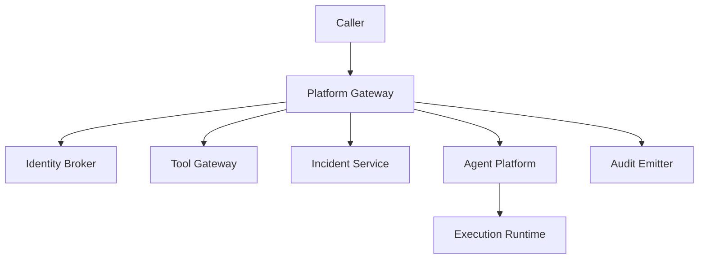

[No sources needed since this diagram shows conceptual workflow, not actual code structure]

## Core Components
- Delegation client: exchanges subject tokens for delegated tokens with per-user caching and workload-token preference.
- Auth legs: gateway proxies identity broker endpoints and maps transport/5xx errors to structured 502 responses.
- Tool invocation: validates delegated tokens via JWKS, enforces policy, and executes tools with evidence envelopes.
- Execution worker handoff: sends signed handoff requests with bearer tokens and request IDs; handles timeouts and rejections.
- Incident proxy: enforces per-action policies, forwards gateway credentials, and maps upstream errors.
- Audit emitter: delivers audit events asynchronously and swallows transport errors while recording metrics.
- Session service: manages sessions, state stores, evidence stores, and flow stores with cascade deletion.
- Operation documents: typed store with retention sweep and owner-scoped visibility.

**Section sources**
- [delegation_client.py:185-228](file://products/platform-gateway/src/platform_gateway/services/delegation_client.py#L185-L228)
- [test_auth_legs.py:129-237](file://products/platform-gateway/tests/test_auth_legs.py#L129-L237)
- [test_tool_invoke.py:129-182](file://products/tool-gateway/tests/test_tool_invoke.py#L129-L182)
- [test_execution_worker_client.py:56-115](file://products/agent-platform/tests/test_execution_worker_client.py#L56-L115)
- [test_incidents_proxy.py:135-173](file://products/platform-gateway/tests/test_incidents_proxy.py#L135-L173)
- [test_audit_emitter.py:138-151](file://products/platform-gateway/tests/test_audit_emitter.py#L138-L151)
- [test_session_service.py:110-139](file://products/agent-platform/tests/test_session_service.py#L110-L139)
- [test_operation_documents.py:138-155](file://products/agent-platform/tests/test_operation_documents.py#L138-L155)

## Architecture Overview
The platform uses an API gateway pattern where the platform gateway authenticates callers, enforces policies, proxies to downstream services, and coordinates token delegation. The identity broker centralizes OIDC flows and normalizes user context. Tools are invoked through the tool gateway after token verification and policy checks. Execution workers receive handoff requests from the agent platform and persist execution records. Audit events are emitted asynchronously and must be resilient to transport failures.

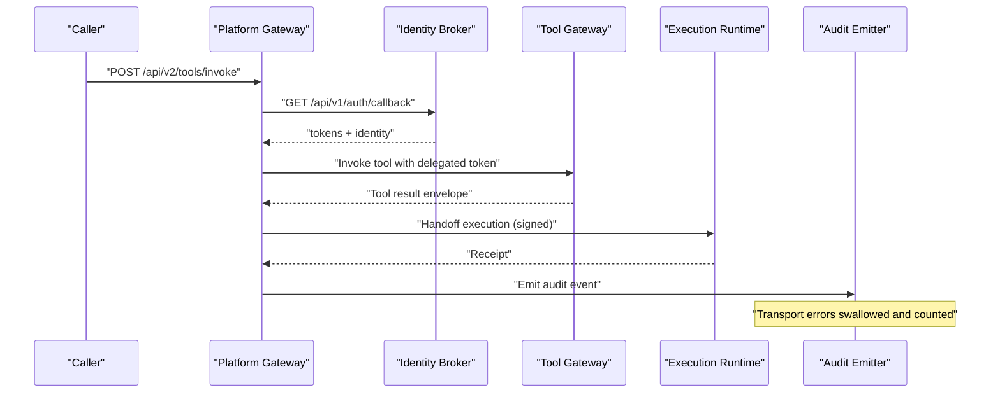

**Diagram sources**
- [test_tool_invoke.py:199-231](file://products/tool-gateway/tests/test_tool_invoke.py#L199-L231)
- [test_auth_legs.py:141-155](file://products/platform-gateway/tests/test_auth_legs.py#L141-L155)
- [test_execution_worker_client.py:81-115](file://products/agent-platform/tests/test_execution_worker_client.py#L81-L115)
- [test_audit_emitter.py:138-151](file://products/platform-gateway/tests/test_audit_emitter.py#L138-L151)

## Detailed Component Analysis

### Token Exchange and Delegation Flow
The delegation client caches delegated tokens per user, mints dev subject tokens when needed, and prefers projected workload tokens over static credentials. Tests verify cache hit/miss behavior, per-user isolation, expiration eviction, exchange payload composition, audience scoping, and fallback logging.

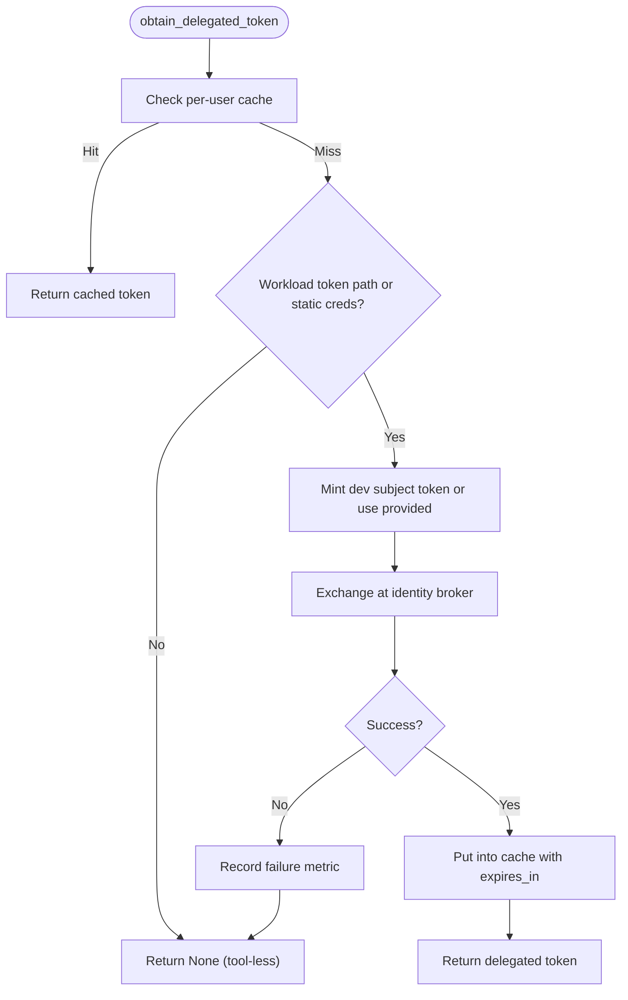

**Diagram sources**
- [delegation_client.py:190-228](file://products/platform-gateway/src/platform_gateway/services/delegation_client.py#L190-L228)
- [test_delegation.py:33-51](file://products/platform-gateway/tests/test_delegation.py#L33-L51)
- [test_delegation.py:66-105](file://products/platform-gateway/tests/test_delegation.py#L66-L105)
- [test_delegation.py:114-160](file://products/platform-gateway/tests/test_delegation.py#L114-L160)
- [test_delegation.py:207-255](file://products/platform-gateway/tests/test_delegation.py#L207-L255)

**Section sources**
- [test_delegation.py:26-105](file://products/platform-gateway/tests/test_delegation.py#L26-L105)
- [test_delegation.py:107-160](file://products/platform-gateway/tests/test_delegation.py#L107-L160)
- [test_delegation.py:162-255](file://products/platform-gateway/tests/test_delegation.py#L162-L255)
- [delegation_client.py:185-228](file://products/platform-gateway/src/platform_gateway/services/delegation_client.py#L185-L228)

### Authentication Legs and Error Mapping
The gateway proxies identity broker endpoints and maps upstream 4xx details through while converting 5xx and transport failures into structured 502 responses. Tests assert correct forwarding of payloads, error detail preservation, and consistent error posture across login, callback, and refresh legs.

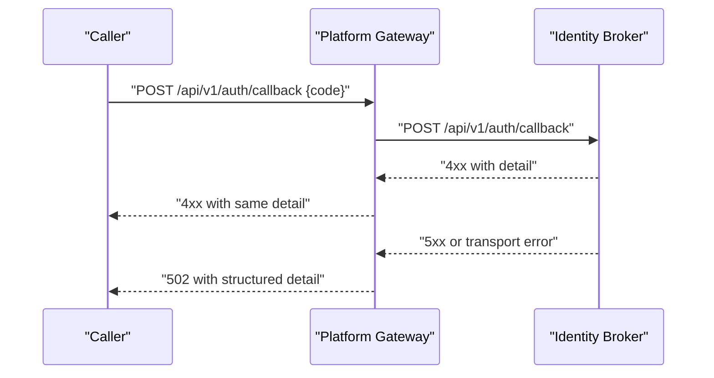

**Diagram sources**
- [test_auth_legs.py:141-207](file://products/platform-gateway/tests/test_auth_legs.py#L141-L207)
- [auth.py:44-81](file://products/identity-broker/src/identity_service/api/routes/auth.py#L44-L81)
- [identity_service.py:195-226](file://products/identity-broker/src/identity_service/services/identity_service.py#L195-L226)

**Section sources**
- [test_auth_legs.py:101-127](file://products/platform-gateway/tests/test_auth_legs.py#L101-L127)
- [test_auth_legs.py:129-237](file://products/platform-gateway/tests/test_auth_legs.py#L129-L237)
- [auth.py:44-81](file://products/identity-broker/src/identity_service/api/routes/auth.py#L44-L81)
- [identity_service.py:195-226](file://products/identity-broker/src/identity_service/services/identity_service.py#L195-L226)

### Tool Invocation Workflow and Policy Admission
Tool invocation requires a valid delegated token with the correct audience. The tool gateway verifies tokens via JWKS, enforces policy based on roles and risk tiers, and returns structured envelopes including evidence. Tests cover discovery, invoke success paths, session correlation, approval kind propagation, unknown tools, wrong audiences, and mutating tool admission.

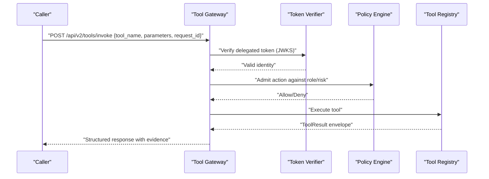

**Diagram sources**
- [test_tool_invoke.py:129-182](file://products/tool-gateway/tests/test_tool_invoke.py#L129-L182)
- [test_tool_invoke.py:199-389](file://products/tool-gateway/tests/test_tool_invoke.py#L199-L389)
- [test_tool_invoke.py:392-484](file://products/tool-gateway/tests/test_tool_invoke.py#L392-L484)

**Section sources**
- [test_tool_invoke.py:129-182](file://products/tool-gateway/tests/test_tool_invoke.py#L129-L182)
- [test_tool_invoke.py:199-389](file://products/tool-gateway/tests/test_tool_invoke.py#L199-L389)
- [test_tool_invoke.py:392-484](file://products/tool-gateway/tests/test_tool_invoke.py#L392-L484)
- [test_tool_invoke.py:486-545](file://products/tool-gateway/tests/test_tool_invoke.py#L486-L545)

### Browser Connector Interaction Guard
Browser interaction tools are guarded by session-scoped locks to prevent concurrent interactions. The guard resolves a session key from identity and acquires an interaction lock before executing the wrapped tool. Tests validate read/write tier classification and ensure write-tier tools inherit interaction guards.

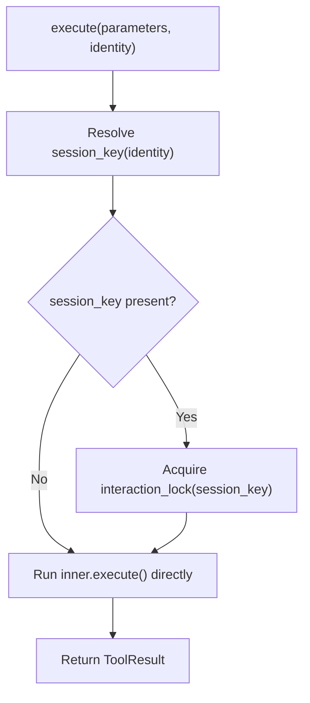

**Diagram sources**
- [browser_connector.py:287-315](file://products/tool-gateway/src/tool_gateway/tools/browser_connector.py#L287-L315)
- [test_browser_connector.py:557-580](file://products/tool-gateway/tests/test_browser_connector.py#L557-L580)

**Section sources**
- [browser_connector.py:287-315](file://products/tool-gateway/src/tool_gateway/tools/browser_connector.py#L287-L315)
- [test_browser_connector.py:557-580](file://products/tool-gateway/tests/test_browser_connector.py#L557-L580)

### Execution Worker Handoff and Asynchronous Operations
The agent platform hands off executions to the execution runtime with a signed request, bearer token, and request ID. Tests assert successful handoff, timeout handling, malformed responses, and rejection reasons. The execution runtime persists receipts and ensures first-close-wins semantics.

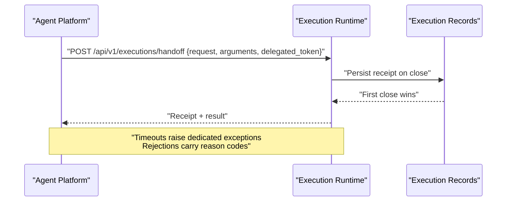

**Diagram sources**
- [test_execution_worker_client.py:56-115](file://products/agent-platform/tests/test_execution_worker_client.py#L56-L115)
- [test_execution_worker_client.py:146-182](file://products/agent-platform/tests/test_execution_worker_client.py#L146-L182)
- [test_execution_worker_client.py:207-243](file://products/agent-platform/tests/test_execution_worker_client.py#L207-L243)
- [execution_records.py:87-124](file://products/execution-runtime/src/execution_runtime/services/execution_records.py#L87-L124)

**Section sources**
- [test_execution_worker_client.py:56-115](file://products/agent-platform/tests/test_execution_worker_client.py#L56-L115)
- [test_execution_worker_client.py:117-182](file://products/agent-platform/tests/test_execution_worker_client.py#L117-L182)
- [test_execution_worker_client.py:207-243](file://products/agent-platform/tests/test_execution_worker_client.py#L207-L243)
- [execution_records.py:87-124](file://products/execution-runtime/src/execution_runtime/services/execution_records.py#L87-L124)

### Incident Proxy and Cross-Service Data Synchronization
The platform gateway proxies incident endpoints with per-action policy enforcement, forwards gateway credentials, and maps upstream errors. Triage operations forward operator identity and a delegated token. Tests assert list/get/create/t triage flows, parameter forwarding, invalid id rejection, and error mapping.

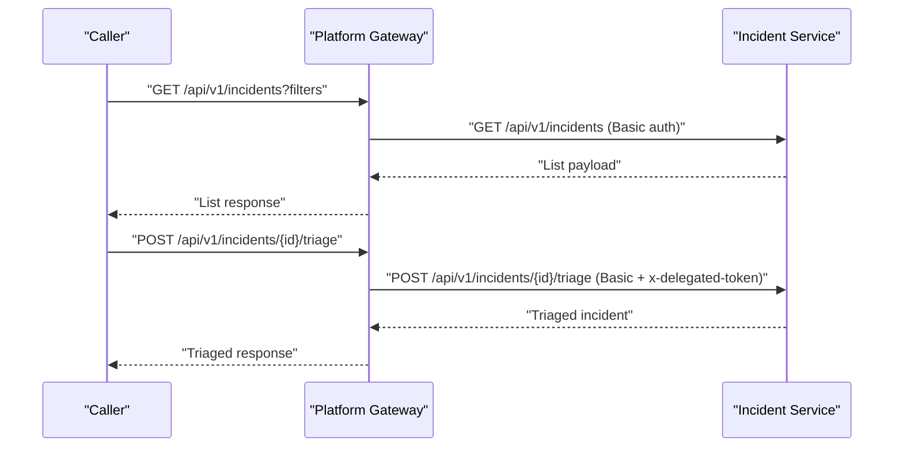

**Diagram sources**
- [test_incidents_proxy.py:135-173](file://products/platform-gateway/tests/test_incidents_proxy.py#L135-L173)
- [test_incidents_proxy.py:198-245](file://products/platform-gateway/tests/test_incidents_proxy.py#L198-L245)
- [test_incidents_proxy.py:247-358](file://products/platform-gateway/tests/test_incidents_proxy.py#L247-L358)
- [test_incidents_proxy.py:361-387](file://products/platform-gateway/tests/test_incidents_proxy.py#L361-L387)

**Section sources**
- [test_incidents_proxy.py:135-173](file://products/platform-gateway/tests/test_incidents_proxy.py#L135-L173)
- [test_incidents_proxy.py:198-245](file://products/platform-gateway/tests/test_incidents_proxy.py#L198-L245)
- [test_incidents_proxy.py:247-358](file://products/platform-gateway/tests/test_incidents_proxy.py#L247-L358)
- [test_incidents_proxy.py:361-387](file://products/platform-gateway/tests/test_incidents_proxy.py#L361-L387)

### Audit Emission Resilience
Audit events are delivered asynchronously and must not break caller flows on transport errors. Tests simulate connect errors and assert that delivery does not raise and emits a failure metric.

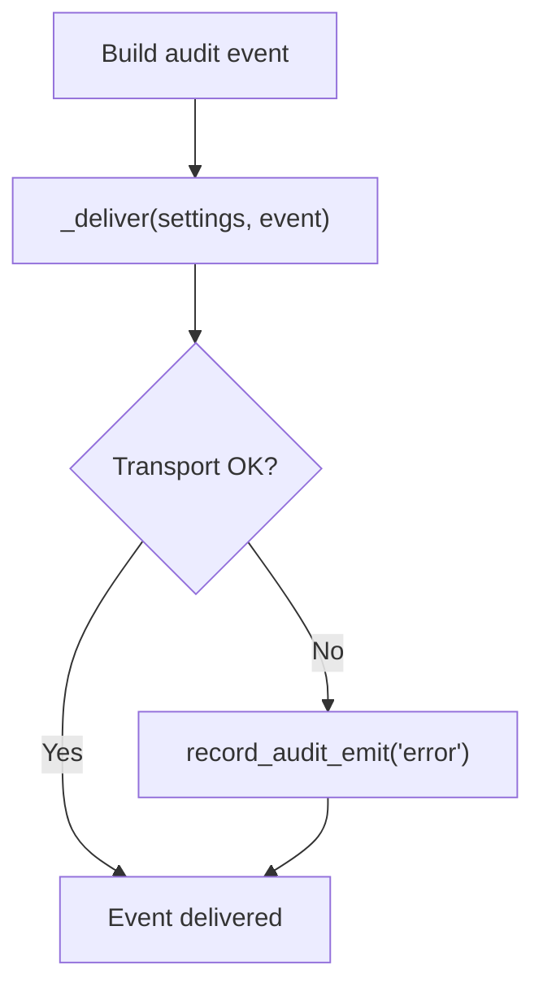

**Diagram sources**
- [test_audit_emitter.py:138-151](file://products/platform-gateway/tests/test_audit_emitter.py#L138-L151)

**Section sources**
- [test_audit_emitter.py:138-151](file://products/platform-gateway/tests/test_audit_emitter.py#L138-L151)

### Session Lifecycle and Cascading Cleanup
Session management includes creation, retrieval, named sessions, ownership enforcement, and cascade deletion of related stores (state, evidence, flow contexts/approvals, authoring traces). Tests assert TTL eviction, max entries, environment configuration, route integrity, race conditions, and fail-open cleanup behaviors.

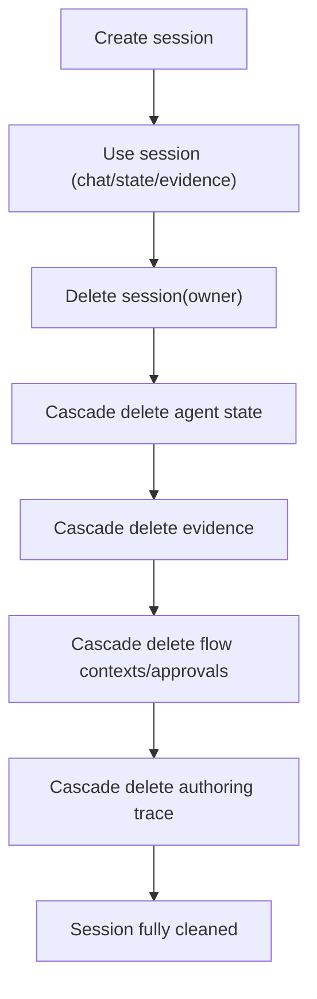

**Diagram sources**
- [test_session_service.py:110-139](file://products/agent-platform/tests/test_session_service.py#L110-L139)
- [test_session_service.py:141-225](file://products/agent-platform/tests/test_session_service.py#L141-L225)
- [test_session_service.py:227-318](file://products/agent-platform/tests/test_session_service.py#L227-L318)
- [test_session_service.py:320-425](file://products/agent-platform/tests/test_session_service.py#L320-L425)

**Section sources**
- [test_session_service.py:110-139](file://products/agent-platform/tests/test_session_service.py#L110-L139)
- [test_session_service.py:141-225](file://products/agent-platform/tests/test_session_service.py#L141-L225)
- [test_session_service.py:227-318](file://products/agent-platform/tests/test_session_service.py#L227-L318)
- [test_session_service.py:320-425](file://products/agent-platform/tests/test_session_service.py#L320-L425)

### Operation Documents Retention and Sweep
Operation documents follow a draft-to-published lifecycle with owner-scoped visibility and retention sweeps. Tests assert per-owner caps, expired document removal, readiness checks, and Postgres backend SQL shape via fake drivers.

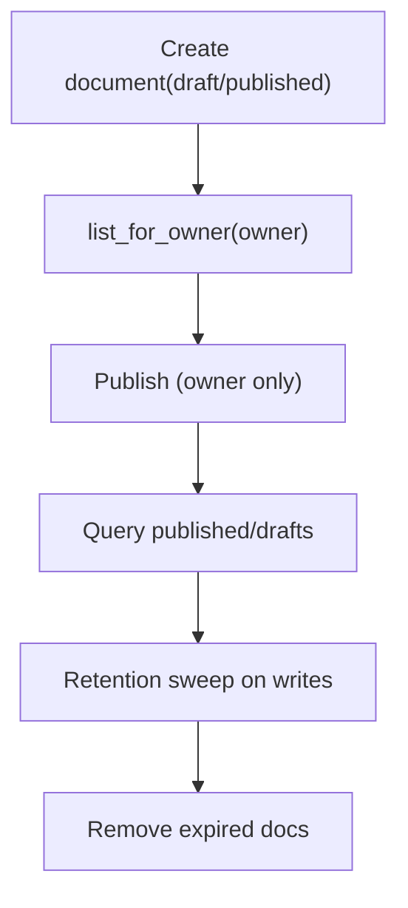

**Diagram sources**
- [test_operation_documents.py:138-155](file://products/agent-platform/tests/test_operation_documents.py#L138-L155)
- [test_operation_documents.py:160-179](file://products/agent-platform/tests/test_operation_documents.py#L160-L179)

**Section sources**
- [test_operation_documents.py:138-155](file://products/agent-platform/tests/test_operation_documents.py#L138-L155)
- [test_operation_documents.py:160-179](file://products/agent-platform/tests/test_operation_documents.py#L160-L179)

## Dependency Analysis
The following diagram highlights direct dependencies exercised by tests and their relationships:

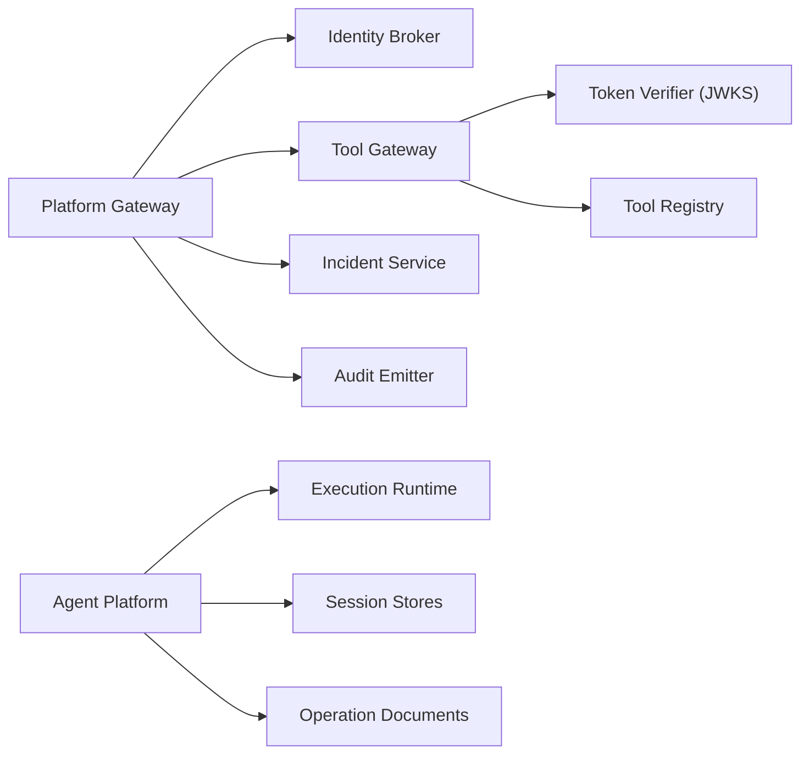

**Diagram sources**
- [test_auth_legs.py:129-237](file://products/platform-gateway/tests/test_auth_legs.py#L129-L237)
- [test_tool_invoke.py:129-182](file://products/tool-gateway/tests/test_tool_invoke.py#L129-L182)
- [test_execution_worker_client.py:56-115](file://products/agent-platform/tests/test_execution_worker_client.py#L56-L115)
- [test_session_service.py:110-139](file://products/agent-platform/tests/test_session_service.py#L110-L139)
- [test_operation_documents.py:138-155](file://products/agent-platform/tests/test_operation_documents.py#L138-L155)

**Section sources**
- [test_auth_legs.py:129-237](file://products/platform-gateway/tests/test_auth_legs.py#L129-L237)
- [test_tool_invoke.py:129-182](file://products/tool-gateway/tests/test_tool_invoke.py#L129-L182)
- [test_execution_worker_client.py:56-115](file://products/agent-platform/tests/test_execution_worker_client.py#L56-L115)
- [test_session_service.py:110-139](file://products/agent-platform/tests/test_session_service.py#L110-L139)
- [test_operation_documents.py:138-155](file://products/agent-platform/tests/test_operation_documents.py#L138-L155)

## Performance Considerations
- Timeouts and budgets: Execution handoff respects configured timeouts; tests assert dedicated timeout exceptions and header propagation. Validate end-to-end latency budgets for tool invocations and handoffs.
- Caching: Delegation client caches per-user tokens; tests assert single exchange under repeated calls. Ensure cache keys isolate users and respect expiry windows.
- Concurrency: Browser connector serializes interactions per session via locks; tests validate write-tier tools inherit interaction guards. Measure contention under concurrent tool calls.
- Backpressure: Audit emission swallows transport errors and records metrics; avoid blocking critical paths on async delivery.
- Retention sweeps: Operation documents sweep expired rows on writes; tune sweep limits and retention days to balance throughput and storage.

[No sources needed since this section provides general guidance]

## Troubleshooting Guide
Common issues and how tests help diagnose them:
- Upstream unreachable or 5xx: Gateway maps transport failures and 5xx to structured 502 responses; tests assert status codes and detail messages.
- Wrong audience or missing auth: Tool gateway rejects tokens with incorrect audience; tests assert 401 before policy evaluation.
- Missing configuration: Delegation disabled without workload token path or static credentials; tests assert non-fatal behavior returning None.
- Handoff failures: Execution worker unavailability raises dedicated errors; tests assert reason codes and log redaction of secrets.
- Session leaks: Cascade deletion ensures evidence, flow contexts, and authoring traces are removed; tests assert empty stores post-delete.
- Retention gaps: Operation document sweep removes expired entries; tests assert old documents are reclaimed on subsequent writes.

**Section sources**
- [test_auth_legs.py:189-207](file://products/platform-gateway/tests/test_auth_legs.py#L189-L207)
- [test_tool_invoke.py:173-182](file://products/tool-gateway/tests/test_tool_invoke.py#L173-L182)
- [test_delegation.py:61-65](file://products/platform-gateway/tests/test_delegation.py#L61-L65)
- [test_execution_worker_client.py:146-182](file://products/agent-platform/tests/test_execution_worker_client.py#L146-L182)
- [test_session_service.py:227-318](file://products/agent-platform/tests/test_session_service.py#L227-L318)
- [test_operation_documents.py:146-155](file://products/agent-platform/tests/test_operation_documents.py#L146-L155)

## Conclusion
The test suite demonstrates robust patterns for validating inter-service communication:
- Mock external HTTP clients and assert exact request shapes, headers, and payloads.
- Map upstream errors consistently to structured responses for predictable caller behavior.
- Exercise OIDC flows and delegated token exchange with audience scoping and workload-token preference.
- Enforce policy at tool invocation boundaries and return standardized envelopes with evidence.
- Handle asynchronous operations and event emission with resilience guarantees.
- Ensure session and document lifecycles clean up all related state reliably.
- Prepare for performance and load testing by measuring timeouts, concurrency, and retention sweeps.

For distributed transactions and eventual consistency:
- Prefer idempotent operations and first-close-wins semantics for receipts.
- Use explicit correlation identifiers (request_id, chat_session_id) across services.
- Validate cross-service data synchronization via proxy tests and store cascade assertions.
- Use shared schemas and contract tests to maintain compatibility across services.

[No sources needed since this section summarizes without analyzing specific files]