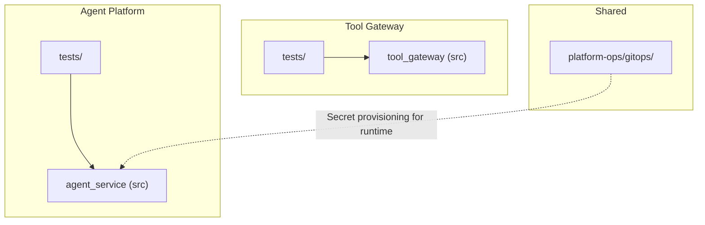
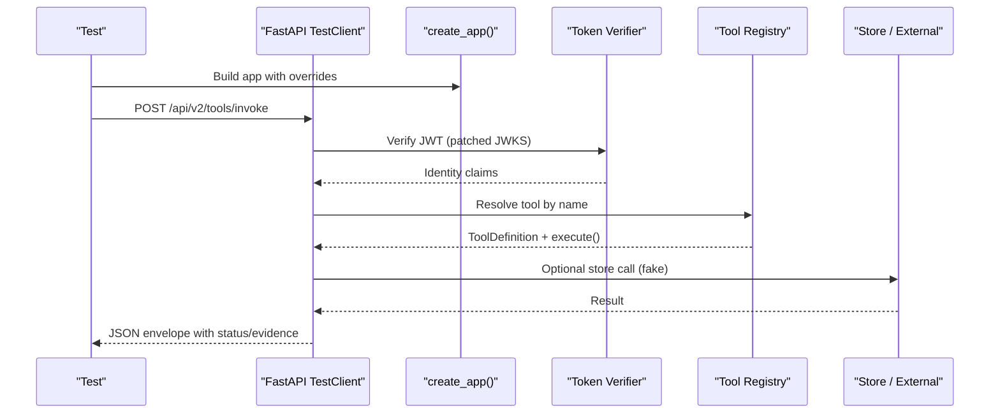
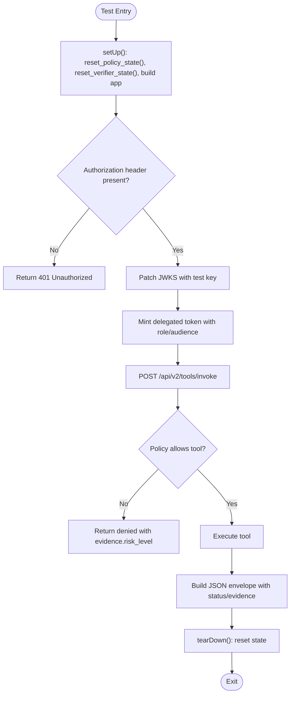
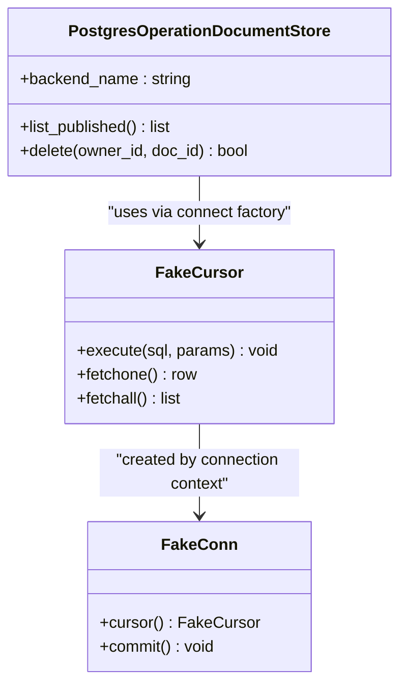
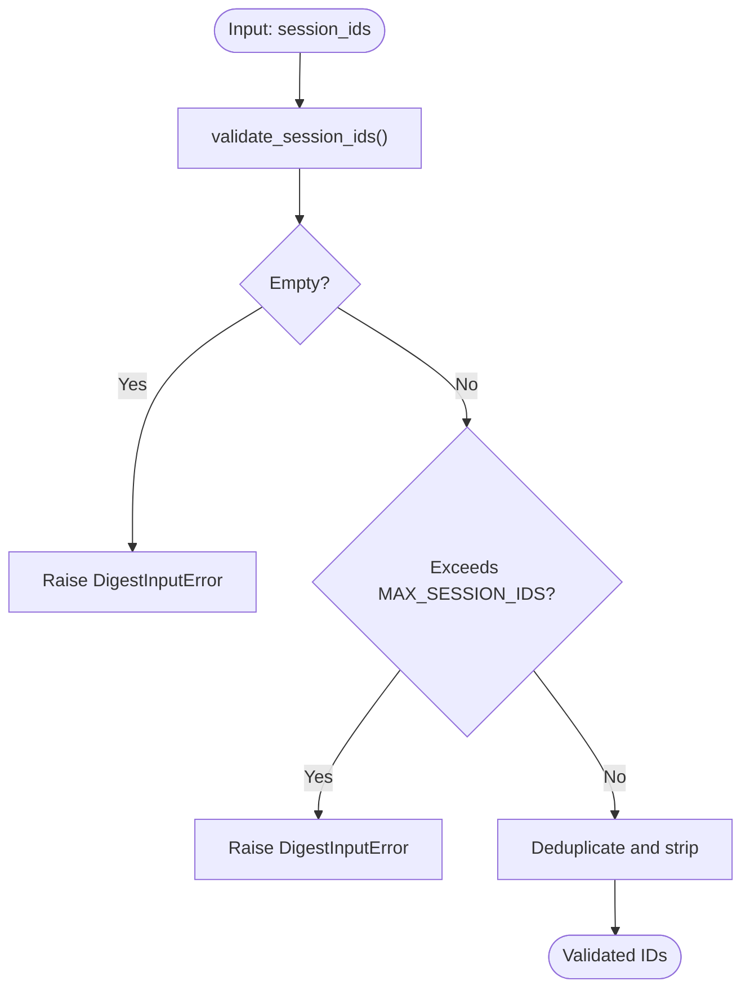
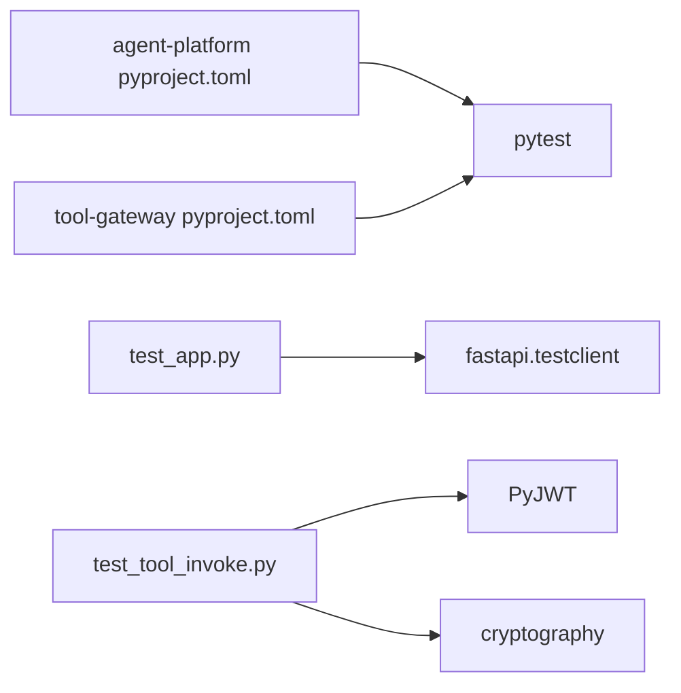

# Test Maintenance and Best Practices

<cite>
**Referenced Files in This Document**
- [pyproject.toml](file://products/agent-platform/pyproject.toml)
- [pyproject.toml](file://products/tool-gateway/pyproject.toml)
- [test_app.py](file://products/agent-platform/tests/test_app.py)
- [test_tool_invoke.py](file://products/tool-gateway/tests/test_tool_invoke.py)
- [shift_summary.py](file://products/agent-platform/src/agent_service/services/shift_summary.py)
- [operation_documents.py](file://products/agent-platform/src/agent_service/services/operation_documents.py)
- [test_operation_documents.py](file://products/agent-platform/tests/test_operation_documents.py)
- [test_confirmation_records.py](file://products/agent-platform/tests/test_confirmation_records.py)
- [authoring_trace.py](file://products/agent-platform/src/agent_service/services/authoring_trace.py)
- [sync-execution-handoff-secret.sh](file://shared/platform-ops/gitops/sync-execution-handoff-secret.sh)
</cite>

## Table of Contents
1. Introduction
2. Project Structure
3. Core Components
4. Architecture Overview
5. Detailed Component Analysis
6. Dependency Analysis
7. Performance Considerations
8. Troubleshooting Guide
9. Conclusion
10. Appendices

## Introduction
This document provides comprehensive test maintenance guidance for the Luban AIOps platform. It focuses on keeping test suites reliable, measurable, and maintainable across multiple Python services. It covers:
- Measuring and reporting coverage with pytest-cov, including thresholds and gap analysis
- Organizing tests, naming conventions, and code structure guidelines
- Managing test data via fixtures, factories, and deterministic generation
- Debugging failing tests, isolation, and flaky test identification
- Continuous integration setup for automated execution, parallelization, caching, and artifacts
- Refactoring tests alongside production code while preserving backward compatibility
- Security and compliance testing approaches
- Optimizing performance and reducing execution time

## Project Structure
The repository is organized by product under products/, each with its own Python package and a co-located tests/ directory. Each product declares its dependencies and dev dependencies in pyproject.toml. Tests use FastAPI TestClient and either unittest or pytest depending on the file.

**Diagram sources**
- [pyproject.toml:1-38](file://products/agent-platform/pyproject.toml#L1-L38)
- [pyproject.toml:1-37](file://products/tool-gateway/pyproject.toml#L1-L37)
- [sync-execution-handoff-secret.sh:1-38](file://shared/platform-ops/gitops/sync-execution-handoff-secret.sh#L1-L38)

**Section sources**
- [pyproject.toml:1-38](file://products/agent-platform/pyproject.toml#L1-L38)
- [pyproject.toml:1-37](file://products/tool-gateway/pyproject.toml#L1-L37)

## Core Components
Key testing patterns observed across the project:
- API smoke and contract tests using FastAPI TestClient to validate endpoints and response shapes
- End-to-end style invocation tests that exercise authentication, policy, and tool execution paths
- Store-backed tests that inject fake database connections to assert SQL behavior without real DBs
- Deterministic token minting and JWKS patching to control identity and authorization flows
- Explicit state resets between tests to ensure isolation

Examples:
- Agent platform API contract surface and readiness checks are validated through HTTP calls against an in-process app instance.
- Tool gateway invoke tests build a minimal registry, mint delegated tokens, patch JWKS verification, and assert status codes, structured error envelopes, and evidence fields.

**Section sources**
- [test_app.py:1-52](file://products/agent-platform/tests/test_app.py#L1-L52)
- [test_tool_invoke.py:1-549](file://products/tool-gateway/tests/test_tool_invoke.py#L1-L549)

## Architecture Overview
The test architecture mirrors the service architecture:
- Tests instantiate application objects (e.g., create_app()) and drive them via TestClient
- Authentication and policy are exercised with controlled tokens and patched verifiers
- Data stores are replaced with in-memory or fake implementations to avoid external dependencies
- Configuration is overridden per test to enable features like auth enforcement or mutating tools

**Diagram sources**
- [test_tool_invoke.py:18-138](file://products/tool-gateway/tests/test_tool_invoke.py#L18-L138)
- [test_tool_invoke.py:184-210](file://products/tool-gateway/tests/test_tool_invoke.py#L184-L210)

## Detailed Component Analysis

### API Contract and Readiness Testing (Agent Platform)
- Uses FastAPI TestClient to hit /api/v2/runtime and /api/v2/health
- Asserts status codes and specific fields such as runtime_mode, session_store options, agent_state readiness
- Validates session creation and chat endpoint behavior, including required headers and structured output expectations

Best practices demonstrated:
- Minimal assertions focused on contract stability
- Use of explicit request headers to simulate real callers
- Assertions on both success and missing-required-field scenarios

**Section sources**
- [test_app.py:6-52](file://products/agent-platform/tests/test_app.py#L6-L52)

### Tool Invocation and Authorization Flow (Tool Gateway)
- Builds a small ToolRegistry with test tools (read and write risk levels)
- Mints RS256-signed delegated tokens with controlled keys and patches JWKS client
- Resets policy and verifier state in setUp/tearDown to ensure isolation
- Exercises:
  - Authentication requirements
  - Role-based access (operator, developer, observer, approver)
  - Audience validation before policy evaluation
  - Structured error envelopes for unknown tools and exceptions
  - Risk-tier admission for mutating tools
  - Propagation of correlation and provenance fields into identity

**Diagram sources**
- [test_tool_invoke.py:129-143](file://products/tool-gateway/tests/test_tool_invoke.py#L129-L143)
- [test_tool_invoke.py:184-210](file://products/tool-gateway/tests/test_tool_invoke.py#L184-L210)
- [test_tool_invoke.py:392-466](file://products/tool-gateway/tests/test_tool_invoke.py#L392-L466)

**Section sources**
- [test_tool_invoke.py:1-549](file://products/tool-gateway/tests/test_tool_invoke.py#L1-L549)

### Store Backends and SQL Behavior Validation
- Fake database connectors capture executed SQL and rows to assert query correctness
- Tests verify filtering, scoping, and pagination behavior at the query layer
- Demonstrates how to isolate persistence logic from network or DB availability

**Diagram sources**
- [operation_documents.py:380-401](file://products/agent-platform/src/agent_service/services/operation_documents.py#L380-L401)
- [test_operation_documents.py:304-335](file://products/agent-platform/tests/test_operation_documents.py#L304-L335)
- [test_confirmation_records.py:290-326](file://products/agent-platform/tests/test_confirmation_records.py#L290-L326)

**Section sources**
- [test_operation_documents.py:304-335](file://products/agent-platform/tests/test_operation_documents.py#L304-L335)
- [test_confirmation_records.py:241-326](file://products/agent-platform/tests/test_confirmation_records.py#L241-L326)
- [operation_documents.py:347-401](file://products/agent-platform/src/agent_service/services/operation_documents.py#L347-L401)

### Input Validation and Defensive Degradation
- Tests assert strict input validation for bounded inputs and reject invalid values early
- Production code demonstrates defensive degradation when reading secondary stores, logging warnings instead of failing hard

**Diagram sources**
- [shift_summary.py:97-110](file://products/agent-platform/src/agent_service/services/shift_summary.py#L97-L110)

**Section sources**
- [shift_summary.py:93-119](file://products/agent-platform/src/agent_service/services/shift_summary.py#L93-L119)
- [test_shift_summary.py:193-223](file://products/agent-platform/tests/test_shift_summary.py#L193-L223)

### Environment Configuration and Robustness
- Integer configuration parsing degrades gracefully with warnings on bad values or below-floor settings
- Tests can override environment variables to select backends or feature flags

**Section sources**
- [authoring_trace.py:973-1007](file://products/agent-platform/src/agent_service/services/authoring_trace.py#L973-L1007)
- [test_operation_documents.py:331-335](file://products/agent-platform/tests/test_operation_documents.py#L331-L335)

## Dependency Analysis
- Each product pins pytest in dev dependencies; coverage tooling is not declared here but can be added similarly
- Tests depend on FastAPI TestClient and, where applicable, cryptography and PyJWT for token operations
- Some tests rely on fakeredis for Redis-backed sessions

**Diagram sources**
- [pyproject.toml:28-33](file://products/agent-platform/pyproject.toml#L28-L33)
- [pyproject.toml:28-32](file://products/tool-gateway/pyproject.toml#L28-L32)
- [test_app.py:1-3](file://products/agent-platform/tests/test_app.py#L1-L3)
- [test_tool_invoke.py:10-23](file://products/tool-gateway/tests/test_tool_invoke.py#L10-L23)

**Section sources**
- [pyproject.toml:28-33](file://products/agent-platform/pyproject.toml#L28-L33)
- [pyproject.toml:28-32](file://products/tool-gateway/pyproject.toml#L28-L32)

## Performance Considerations
Guidelines derived from current test patterns:
- Keep tests fast by avoiding real network calls; mock or patch external clients (e.g., JWKS, HTTPX)
- Use in-memory or fake stores to eliminate I/O latency
- Reset shared state in setUp/tearDown to prevent cross-test pollution and reduce need for cleanup
- Prefer targeted assertions over broad snapshots to minimize churn and speed up failures
- For large datasets, generate only what is needed and cap sizes in tests

[No sources needed since this section provides general guidance]

## Troubleshooting Guide
Common issues and strategies:
- Authentication failures: Ensure tokens have correct audience and roles; verify JWKS patching aligns with test keys
- Policy denials: Confirm policy state is reset and registry flags (e.g., allow_mutating) match the scenario
- Flaky tests: Isolate stateful components (policy engine, token verifier) and reset between tests
- Store errors: Validate SQL fragments captured by fake cursors; check scoping and filters
- Logging and degradation: When secondary stores fail, logs should indicate degradation; tests should assert graceful handling

**Section sources**
- [test_tool_invoke.py:129-143](file://products/tool-gateway/tests/test_tool_invoke.py#L129-L143)
- [test_tool_invoke.py:184-210](file://products/tool-gateway/tests/test_tool_invoke.py#L184-L210)
- [test_confirmation_records.py:290-326](file://products/agent-platform/tests/test_confirmation_records.py#L290-L326)
- [authoring_trace.py:973-1007](file://products/agent-platform/src/agent_service/services/authoring_trace.py#L973-L1007)

## Conclusion
The test suite demonstrates strong practices:
- Contract-focused API tests
- Controlled authentication and policy flows with realistic tokens
- Isolated store interactions with fake backends
- Defensive input validation and robust configuration handling
Adopting the recommendations in this document will further improve reliability, coverage, and maintainability across the platform’s services.

[No sources needed since this section summarizes without analyzing specific files]

## Appendices

### Coverage Measurement and Reporting with pytest-cov
Recommended approach:
- Add pytest-cov to dev dependencies per product (similar to pytest declaration)
- Run coverage with branch and per-file reports
- Enforce thresholds via CI to block merges below minimums
- Perform gap analysis by reviewing per-file coverage and focusing on high-risk modules

Example commands:
- Generate report: pytest --cov=agent_service --cov-report=term-missing --cov-report=html
- Enforce threshold: pytest --cov=agent_service --cov-fail-under=80

[No sources needed since this section provides general guidance]

### Test Organization Patterns and Naming Conventions
Observed patterns:
- One test file per module or feature area
- Clear separation of concerns: API tests vs store tests vs policy/auth tests
- Use of classes to group related tests and share setUp/tearDown
- Descriptive method names indicating scenario and expected outcome

Guidelines:
- Group tests by feature or domain
- Name methods to describe the assertion, e.g., test_invoke_rejects_wrong_audience_before_policy
- Keep tests small and focused on one behavior

[No sources needed since this section provides general guidance]

### Managing Test Data: Fixtures, Factories, and Generation
Patterns observed:
- Local helper functions to mint tokens and build registries
- Inline fake cursor/connection factories to capture SQL and return controlled rows
- Deterministic data generation using loops and fixed seeds

Recommendations:
- Extract reusable fixtures for common data (tokens, users, tools)
- Centralize factories for complex objects
- Use deterministic generators for IDs and timestamps

**Section sources**
- [test_tool_invoke.py:88-127](file://products/tool-gateway/tests/test_tool_invoke.py#L88-L127)
- [test_confirmation_records.py:290-326](file://products/agent-platform/tests/test_confirmation_records.py#L290-L326)

### Debugging Techniques and Logging Strategies
- Use structured responses and evidence fields to diagnose failures
- Log warnings on degraded reads to aid investigation
- Capture SQL via fake cursors to inspect queries
- Reset global state to reproduce issues deterministically

**Section sources**
- [shift_summary.py:113-119](file://products/agent-platform/src/agent_service/services/shift_summary.py#L113-L119)
- [test_operation_documents.py:304-325](file://products/agent-platform/tests/test_operation_documents.py#L304-L325)

### Continuous Integration Setup
- Run tests per product with coverage enabled
- Cache dependency installs (e.g., uv cache) to speed up builds
- Parallelize tests within a product using pytest-xdist if appropriate
- Collect artifacts: HTML coverage reports, logs, and test results
- Gate merges on coverage thresholds and test success

[No sources needed since this section provides general guidance]

### Refactoring Tests Alongside Production Code
- Keep tests close to the code they cover
- Preserve backward compatibility by maintaining existing assertions during refactors
- Introduce new tests for changed behavior before modifying implementation
- Use dependency injection to swap implementations safely in tests

[No sources needed since this section provides general guidance]

### Security and Compliance Testing
- Exercise authentication and authorization paths with realistic tokens
- Validate audience checks and role-based access
- Ensure sensitive fields are not leaked in responses
- Include compliance checks for audit trails and evidence structures

**Section sources**
- [test_tool_invoke.py:144-182](file://products/tool-gateway/tests/test_tool_invoke.py#L144-L182)
- [test_tool_invoke.py:218-383](file://products/tool-gateway/tests/test_tool_invoke.py#L218-L383)

### Reducing Execution Time
- Mock external calls (network, DB, crypto)
- Use in-memory stores for unit tests
- Limit dataset sizes in tests
- Avoid unnecessary setup/teardown work

[No sources needed since this section provides general guidance]

### Secret Provisioning and Runtime Dependencies
- Secrets used by services (e.g., execution handoff token) are provisioned via GitOps scripts
- Tests should not require cluster secrets; use mocks or environment overrides

**Section sources**
- [sync-execution-handoff-secret.sh:1-38](file://shared/platform-ops/gitops/sync-execution-handoff-secret.sh#L1-L38)