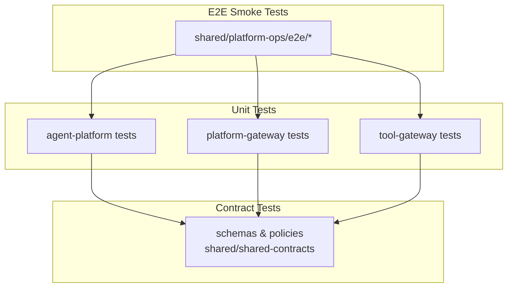
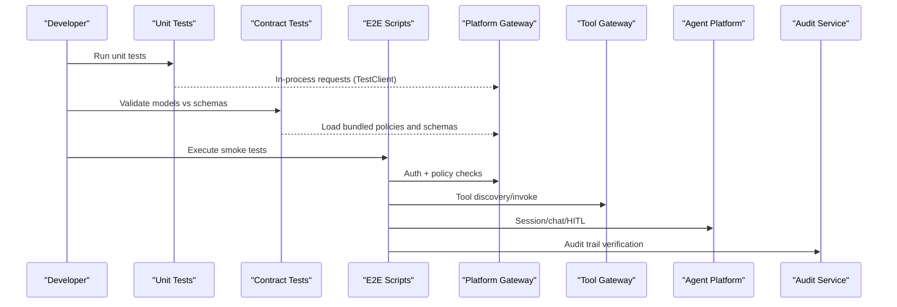
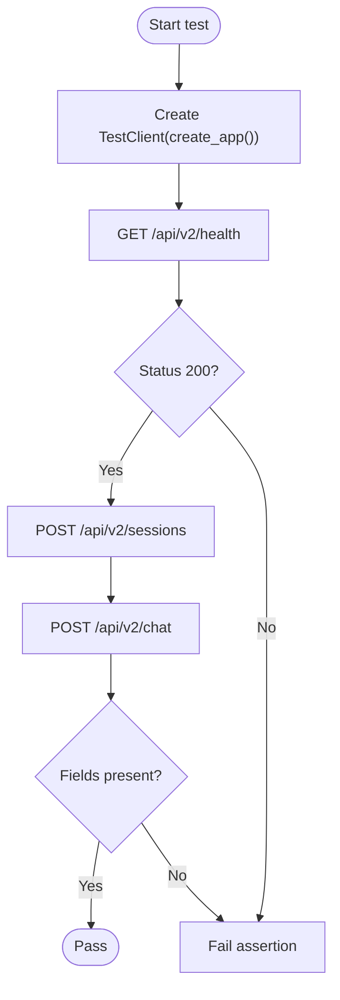
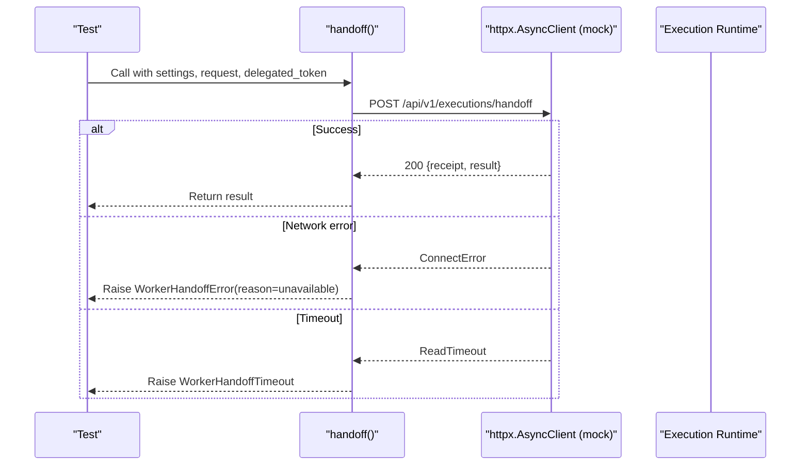
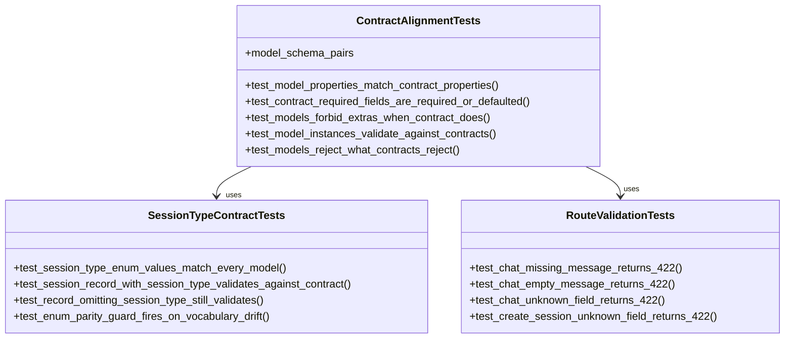
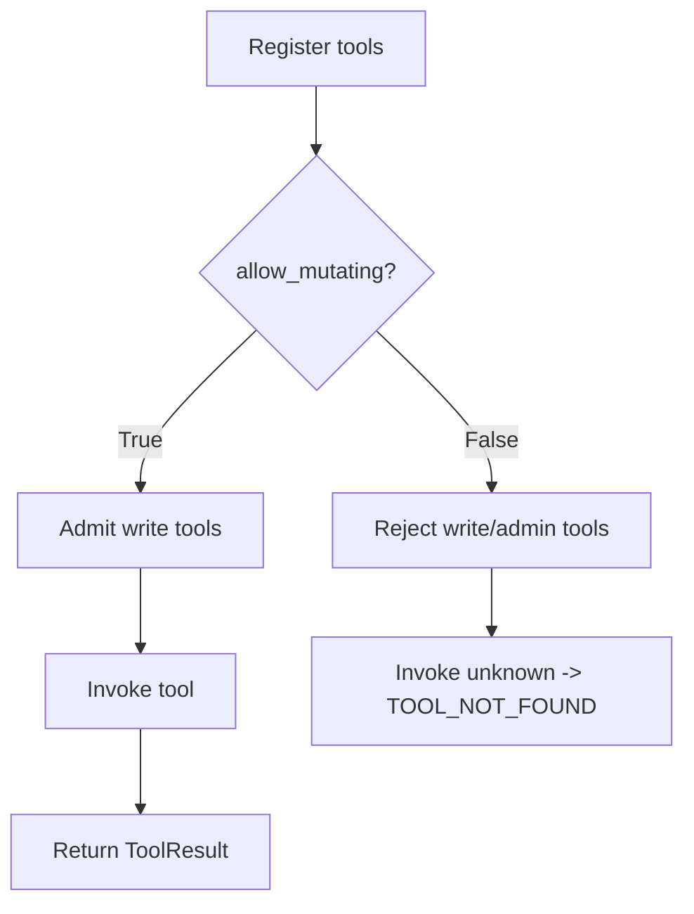
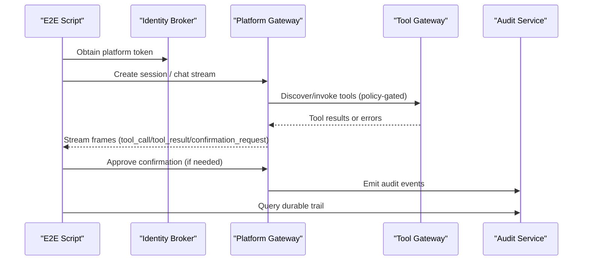
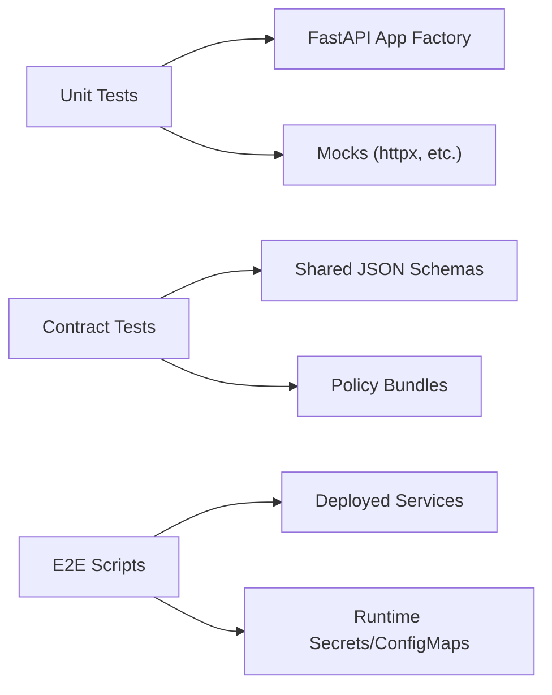

# Testing Strategy and Implementation

<cite>
**Referenced Files in This Document**
- [browser-check-demo.sh](file://shared/platform-ops/e2e/browser-check-demo.sh)
- [documents-demo.sh](file://shared/platform-ops/e2e/documents-demo.sh)
- [incident-demo.sh](file://shared/platform-ops/e2e/incident-demo.sh)
- [mutating-demo.sh](file://shared/platform-ops/e2e/mutating-demo.sh)
- [skills-demo.sh](file://shared/platform-ops/e2e/skills-demo.sh)
- [test_app.py](file://products/agent-platform/tests/test_app.py)
- [test_execution_worker_client.py](file://products/agent-platform/tests/test_execution_worker_client.py)
- [test_contracts.py](file://products/platform-gateway/tests/test_contracts.py)
- [test_policy_engine.py](file://products/platform-gateway/tests/test_policy_engine.py)
- [test_tool_registry.py](file://products/tool-gateway/tests/test_tool_registry.py)
</cite>

## Table of Contents
1. Introduction
2. Project Structure
3. Core Components
4. Architecture Overview
5. Detailed Component Analysis
6. Dependency Analysis
7. Performance Considerations
8. Troubleshooting Guide
9. Conclusion

## Introduction
This document describes the multi-layered testing strategy across the platform’s microservices. It covers unit tests using pytest and unittest, mocking strategies for external dependencies, test data management, integration testing for service-to-service communication and databases, end-to-end (E2E) procedures via shared scripts, contract testing for API schemas and policy definitions, and guidance on organization, naming, assertions, performance/security testing, coverage maintenance, and debugging failing tests.

## Project Structure
The repository organizes tests alongside each product:
- Unit and contract tests live under products/<service>/tests/.
- E2E smoke tests that exercise a running cluster live under shared/platform-ops/e2e/.
- Shared contracts (JSON schemas and policy bundles) under shared/shared-contracts/ are consumed by contract tests.

**Section sources**
- [test_app.py:1-52](file://products/agent-platform/tests/test_app.py#L1-L52)
- [test_contracts.py:1-350](file://products/platform-gateway/tests/test_contracts.py#L1-L350)
- [test_tool_registry.py:1-172](file://products/tool-gateway/tests/test_tool_registry.py#L1-L172)
- [browser-check-demo.sh:1-352](file://shared/platform-ops/e2e/browser-check-demo.sh#L1-L352)
- [documents-demo.sh:1-235](file://shared/platform-ops/e2e/documents-demo.sh#L1-L235)
- [incident-demo.sh:1-195](file://shared/platform-ops/e2e/incident-demo.sh#L1-L195)
- [mutating-demo.sh:1-512](file://shared/platform-ops/e2e/mutating-demo.sh#L1-L512)
- [skills-demo.sh:1-125](file://shared/platform-ops/e2e/skills-demo.sh#L1-L125)

## Core Components
- Agent Platform unit tests validate FastAPI endpoints, session/chat flows, and runtime behavior using an in-process test client.
- Platform Gateway contract tests bind Pydantic models to shared JSON schemas and assert enum parity and validation semantics.
- Tool Gateway unit tests cover tool registration, invocation, risk-tier gating, and result serialization.
- Execution worker handoff tests mock HTTP clients to verify error handling, timeouts, redaction, and header propagation.

Key patterns observed:
- In-process FastAPI TestClient for route-level unit tests.
- Mocking of async HTTP clients with AsyncMock to isolate network calls.
- Contract alignment tests against shared schema files.
- Deterministic E2E scripts that obtain tokens, call APIs, and assert structured responses.

**Section sources**
- [test_app.py:6-52](file://products/agent-platform/tests/test_app.py#L6-L52)
- [test_execution_worker_client.py:1-276](file://products/agent-platform/tests/test_execution_worker_client.py#L1-L276)
- [test_contracts.py:30-159](file://products/platform-gateway/tests/test_contracts.py#L30-L159)
- [test_tool_registry.py:56-131](file://products/tool-gateway/tests/test_tool_registry.py#L56-L131)

## Architecture Overview
The testing architecture spans three layers:
- Unit layer: fast, isolated, mocking external services.
- Integration/contract layer: validates model-schema parity and policy evaluation.
- E2E layer: runs against a deployed cluster to assert real interactions including auth, policy gates, HITL approvals, audit trails, and browser/Kubernetes tool execution.

**Diagram sources**
- [test_app.py:6-52](file://products/agent-platform/tests/test_app.py#L6-L52)
- [test_contracts.py:30-159](file://products/platform-gateway/tests/test_contracts.py#L30-L159)
- [test_policy_engine.py:35-67](file://products/platform-gateway/tests/test_policy_engine.py#L35-L67)
- [browser-check-demo.sh:85-167](file://shared/platform-ops/e2e/browser-check-demo.sh#L85-L167)
- [mutating-demo.sh:100-234](file://shared/platform-ops/e2e/mutating-demo.sh#L100-L234)
- [incident-demo.sh:63-132](file://shared/platform-ops/e2e/incident-demo.sh#L63-L132)

## Detailed Component Analysis

### Agent Platform Unit Testing
- Uses FastAPI TestClient to hit /api/v2 routes without starting a server.
- Asserts health, readiness, session creation, chat request/response shape, and required headers.
- Validates structured output behavior when no response schema is provided.

**Diagram sources**
- [test_app.py:6-52](file://products/agent-platform/tests/test_app.py#L6-L52)

**Section sources**
- [test_app.py:6-52](file://products/agent-platform/tests/test_app.py#L6-L52)

### Execution Worker Handoff: Mocking External Dependencies
- Mocks httpx.AsyncClient to simulate success, transport errors, timeouts, and malformed payloads.
- Verifies configuration-driven timeouts, bearer token and x-request-id propagation, and log redaction of secrets.
- Maps HTTP errors to domain-specific exceptions with reasons.

**Diagram sources**
- [test_execution_worker_client.py:56-115](file://products/agent-platform/tests/test_execution_worker_client.py#L56-L115)
- [test_execution_worker_client.py:117-205](file://products/agent-platform/tests/test_execution_worker_client.py#L117-L205)
- [test_execution_worker_client.py:207-244](file://products/agent-platform/tests/test_execution_worker_client.py#L207-L244)
- [test_execution_worker_client.py:246-272](file://products/agent-platform/tests/test_execution_worker_client.py#L246-L272)

**Section sources**
- [test_execution_worker_client.py:56-115](file://products/agent-platform/tests/test_execution_worker_client.py#L56-L115)
- [test_execution_worker_client.py:117-205](file://products/agent-platform/tests/test_execution_worker_client.py#L117-L205)
- [test_execution_worker_client.py:207-244](file://products/agent-platform/tests/test_execution_worker_client.py#L207-L244)
- [test_execution_worker_client.py:246-272](file://products/agent-platform/tests/test_execution_worker_client.py#L246-L272)

### Platform Gateway Contract and Policy Testing
- Binds Pydantic models to shared JSON schemas; asserts property parity, required fields, extra-field forbiddance, and instance validation.
- Enforces additive enum drift detection for session_type across schemas and models.
- Validates policy engine semantics: deny-by-default, precedence, disabled rules, bundle provenance hashes, and require_approval flow.

**Diagram sources**
- [test_contracts.py:30-159](file://products/platform-gateway/tests/test_contracts.py#L30-L159)
- [test_contracts.py:161-305](file://products/platform-gateway/tests/test_contracts.py#L161-L305)
- [test_contracts.py:307-345](file://products/platform-gateway/tests/test_contracts.py#L307-L345)

**Section sources**
- [test_contracts.py:30-159](file://products/platform-gateway/tests/test_contracts.py#L30-L159)
- [test_contracts.py:161-305](file://products/platform-gateway/tests/test_contracts.py#L161-L305)
- [test_contracts.py:307-345](file://products/platform-gateway/tests/test_contracts.py#L307-L345)

### Tool Gateway Registry and Risk-Tier Gating
- Registers tools, lists definitions, invokes them, and verifies unknown-tool error codes.
- Enforces deny-by-default for write/admin tools unless mutating gate is enabled.
- Validates ToolDefinition and ToolResult serialization, including evidence fields.

**Diagram sources**
- [test_tool_registry.py:56-131](file://products/tool-gateway/tests/test_tool_registry.py#L56-L131)

**Section sources**
- [test_tool_registry.py:56-131](file://products/tool-gateway/tests/test_tool_registry.py#L56-L131)
- [test_tool_registry.py:132-172](file://products/tool-gateway/tests/test_tool_registry.py#L132-L172)

### E2E Procedures: Browser Tools, Documents, Incidents, Mutating Tools, Skills
Each script performs deterministic assertions against a running cluster:

- Browser web-check tools:
  - Control: unauthenticated access rejected.
  - Disabled mode: no web.* tools in discovery; invoke fails closed with TOOL_NOT_FOUND.
  - Enabled mode: baseline six web.* tools registered with correct risk tiers; off-allowlist navigation denied; allowed navigation succeeds; snapshot enumerates elements; CDP sidecar reachable.
  - Optional chat leg: scripted agent uses skills and web.* tools, parks one confirmation_request for the single write-tier interaction, approves via confirm endpoint, and asserts durable surfaces.

- Operations documents:
  - Role matrix enforced; draft created with digest/provenance; owner-only until publish; published listing envelope-only; audit trail events verified; session rename ownership and role checks.

- Incident triage:
  - Webhook intake rejects bad tokens; create/dedupe/resolve flows validated; query visibility through portal surface; operator-initiated triage produces report and dispatches to audit connector; durable trail checked.

- Mutating tools:
  - Deny-by-default: k8s.delete_pod absent from discovery; invoke fails closed; RBAC absent.
  - Opt-in: tool present with write risk; observer denied; operator admitted through policy gates; optional HITL leg parks confirmation_request, enforces tier_2 approval, and asserts signed execution receipts and correlated audit events.

- Skills:
  - Status reports both sample sources synced; alert-name search ranks expected runbook first; chat leg asserts skills.search tool_call/tool_result frames.

**Diagram sources**
- [browser-check-demo.sh:96-167](file://shared/platform-ops/e2e/browser-check-demo.sh#L96-L167)
- [browser-check-demo.sh:170-227](file://shared/platform-ops/e2e/browser-check-demo.sh#L170-L227)
- [browser-check-demo.sh:229-343](file://shared/platform-ops/e2e/browser-check-demo.sh#L229-L343)
- [documents-demo.sh:88-197](file://shared/platform-ops/e2e/documents-demo.sh#L88-L197)
- [incident-demo.sh:63-132](file://shared/platform-ops/e2e/incident-demo.sh#L63-L132)
- [incident-demo.sh:141-186](file://shared/platform-ops/e2e/incident-demo.sh#L141-L186)
- [mutating-demo.sh:100-234](file://shared/platform-ops/e2e/mutating-demo.sh#L100-L234)
- [mutating-demo.sh:246-496](file://shared/platform-ops/e2e/mutating-demo.sh#L246-L496)
- [skills-demo.sh:40-125](file://shared/platform-ops/e2e/skills-demo.sh#L40-L125)

**Section sources**
- [browser-check-demo.sh:85-352](file://shared/platform-ops/e2e/browser-check-demo.sh#L85-L352)
- [documents-demo.sh:88-235](file://shared/platform-ops/e2e/documents-demo.sh#L88-L235)
- [incident-demo.sh:63-195](file://shared/platform-ops/e2e/incident-demo.sh#L63-L195)
- [mutating-demo.sh:100-512](file://shared/platform-ops/e2e/mutating-demo.sh#L100-L512)
- [skills-demo.sh:40-125](file://shared/platform-ops/e2e/skills-demo.sh#L40-L125)

## Dependency Analysis
- Unit tests depend on in-process app factories and mocked I/O.
- Contract tests depend on shared schemas and policy bundles.
- E2E scripts depend on cluster state, port-forwarded services, and secrets/configmaps.

**Diagram sources**
- [test_app.py:6-52](file://products/agent-platform/tests/test_app.py#L6-L52)
- [test_contracts.py:21-28](file://products/platform-gateway/tests/test_contracts.py#L21-L28)
- [test_policy_engine.py:23-32](file://products/platform-gateway/tests/test_policy_engine.py#L23-L32)
- [browser-check-demo.sh:43-68](file://shared/platform-ops/e2e/browser-check-demo.sh#L43-L68)

**Section sources**
- [test_app.py:6-52](file://products/agent-platform/tests/test_app.py#L6-L52)
- [test_contracts.py:21-28](file://products/platform-gateway/tests/test_contracts.py#L21-L28)
- [test_policy_engine.py:23-32](file://products/platform-gateway/tests/test_policy_engine.py#L23-L32)
- [browser-check-demo.sh:43-68](file://shared/platform-ops/e2e/browser-check-demo.sh#L43-L68)

## Performance Considerations
- Prefer unit tests for speed and isolation; they do not start servers or touch networks.
- Use mocks for all external calls (HTTP clients, databases, message brokers).
- Reserve E2E scripts for critical paths; they are slower and environment-dependent.
- For load/performance testing beyond smoke tests, consider adding dedicated harnesses that target gateway endpoints with controlled concurrency while reusing token issuance patterns seen in E2E scripts.

[No sources needed since this section provides general guidance]

## Troubleshooting Guide
Common failure modes and how to debug:
- Unauthenticated or misconfigured tokens:
  - E2E scripts explicitly check 401/403 responses and print diagnostic context. Verify identity broker port-forward and secret contents.
- Policy denials:
  - Confirm roles/groups and action names; review policy bundle and precedence rules. Contract tests demonstrate deny-by-default behavior.
- Tool not found:
  - When mutating tools are disabled, expect TOOL_NOT_FOUND; enable the feature flag and RBAC accordingly before rerunning.
- Timeouts and network errors:
  - Handoff tests map transport errors to specific reasons; ensure worker URL and timeout settings are correct.
- Audit trail gaps:
  - E2E scripts wait briefly for fire-and-forget emissions and query audit events with appropriate credentials.

Actionable tips:
- Re-run the minimal failing step from the relevant E2E script with verbose curl to inspect payloads.
- For unit failures, reduce scope to the smallest assertion and print intermediate values.
- For contract failures, compare model properties and enum values against the referenced schema files.

**Section sources**
- [browser-check-demo.sh:85-167](file://shared/platform-ops/e2e/browser-check-demo.sh#L85-L167)
- [mutating-demo.sh:100-234](file://shared/platform-ops/e2e/mutating-demo.sh#L100-L234)
- [incident-demo.sh:63-132](file://shared/platform-ops/e2e/incident-demo.sh#L63-L132)
- [test_execution_worker_client.py:117-205](file://products/agent-platform/tests/test_execution_worker_client.py#L117-L205)
- [test_policy_engine.py:55-72](file://products/platform-gateway/tests/test_policy_engine.py#L55-L72)

## Conclusion
The platform employs a layered testing strategy:
- Fast, isolated unit tests with mocks for core logic and service boundaries.
- Contract tests ensuring strict alignment between models and shared schemas/policies.
- Deterministic E2E smoke tests validating authentication, authorization, policy enforcement, HITL approvals, tool execution, and audit durability.
Following these patterns ensures reliability, safety, and maintainability across the microservices ecosystem.

[No sources needed since this section summarizes without analyzing specific files]