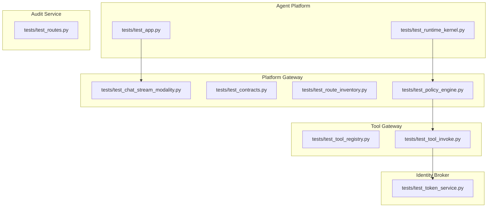
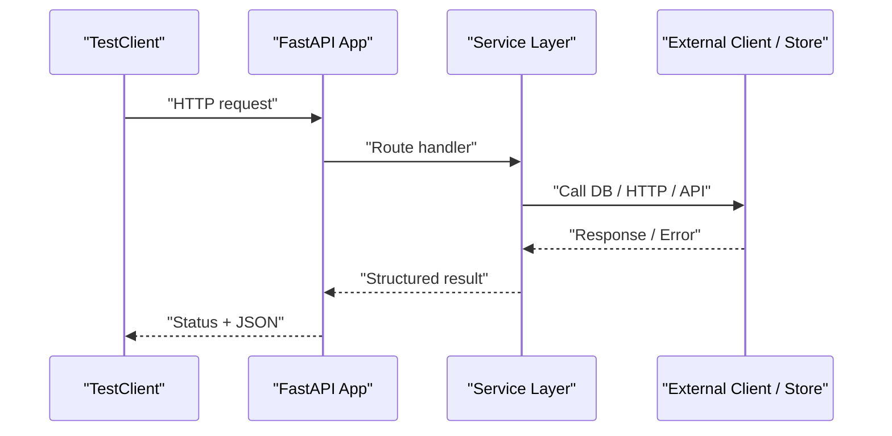
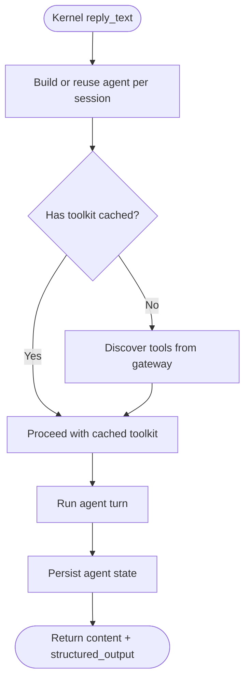
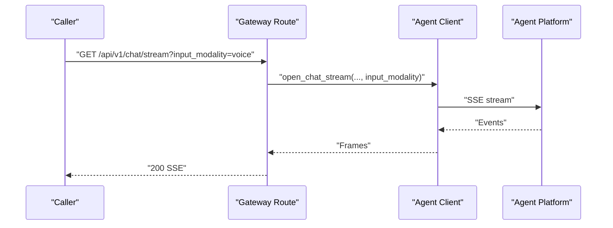
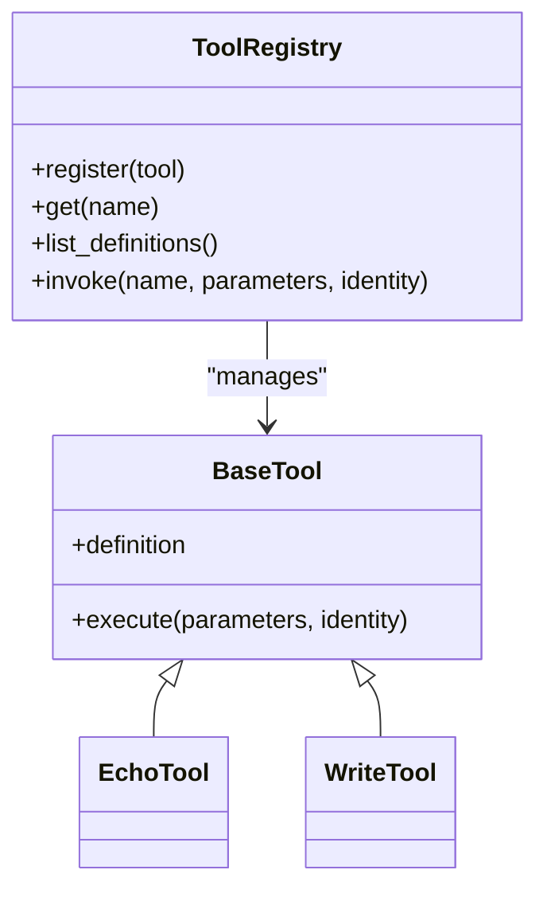
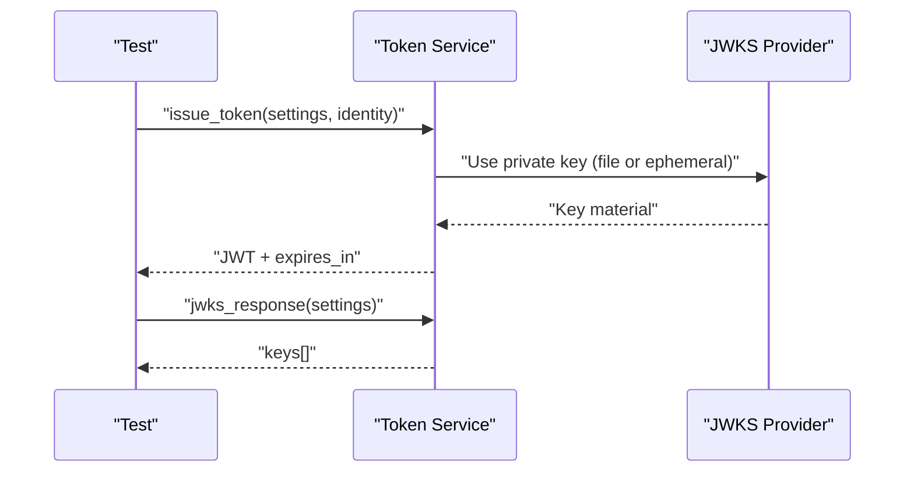
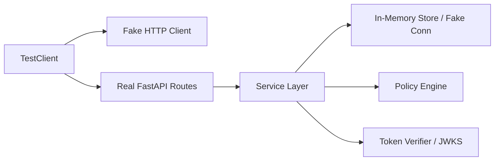

# Unit Testing

<cite>
**Referenced Files in This Document**
- [test_app.py](file://products/agent-platform/tests/test_app.py)
- [test_runtime_kernel.py](file://products/agent-platform/tests/test_runtime_kernel.py)
- [test_chat_stream_modality.py](file://products/platform-gateway/tests/test_chat_stream_modality.py)
- [test_contracts.py](file://products/platform-gateway/tests/test_contracts.py)
- [test_route_inventory.py](file://products/platform-gateway/tests/test_route_inventory.py)
- [test_policy_engine.py](file://products/platform-gateway/tests/test_policy_engine.py)
- [test_tool_registry.py](file://products/tool-gateway/tests/test_tool_registry.py)
- [test_tool_invoke.py](file://products/tool-gateway/tests/test_tool_invoke.py)
- [test_token_service.py](file://products/identity-broker/tests/test_token_service.py)
- [test_incident_report.py](file://products/agent-platform/tests/test_incident_report.py)
- [test_routes.py](file://products/audit-service/tests/test_routes.py)
</cite>

## Table of Contents
1. Introduction
2. Project Structure
3. Core Components
4. Architecture Overview
5. Detailed Component Analysis
6. Dependency Analysis
7. Performance Considerations
8. Troubleshooting Guide
9. Conclusion

## Introduction
This document explains the unit testing approach used across the Luban AIOPS platform services. It covers the pytest and unittest-based patterns, test organization, naming conventions, assertion practices, mocking strategies for external dependencies (databases, HTTP clients, third-party APIs), test data management, fixtures usage, parameterized testing, service-specific patterns (agent kernel, policy engine, tool registry, identity tokens), async and streaming tests, FastAPI route and Pydantic model validation, isolation techniques, dependency injection in tests, and how to keep test suites clean across microservices.

## Project Structure
Each product ships its own test suite under a top-level tests directory adjacent to its source package:
- products/agent-platform/tests
- products/platform-gateway/tests
- products/tool-gateway/tests
- products/identity-broker/tests
- products/audit-service/tests

Tests are organized by feature or component rather than by framework, with one file per major area (for example, policy engine, tool registry, token service). Tests use either unittest.TestCase classes or plain functions when appropriate. FastAPI TestClient is used for end-to-end route tests within a single process, while unit tests target services and kernels directly.

**Diagram sources**
- [test_app.py:1-52](file://products/agent-platform/tests/test_app.py#L1-L52)
- [test_runtime_kernel.py:1-800](file://products/agent-platform/tests/test_runtime_kernel.py#L1-L800)
- [test_chat_stream_modality.py:1-283](file://products/platform-gateway/tests/test_chat_stream_modality.py#L1-L283)
- [test_contracts.py:307-349](file://products/platform-gateway/tests/test_contracts.py#L307-L349)
- [test_route_inventory.py:83-120](file://products/platform-gateway/tests/test_route_inventory.py#L83-L120)
- [test_policy_engine.py:1-599](file://products/platform-gateway/tests/test_policy_engine.py#L1-L599)
- [test_tool_registry.py:1-172](file://products/tool-gateway/tests/test_tool_registry.py#L1-L172)
- [test_tool_invoke.py:1-549](file://products/tool-gateway/tests/test_tool_invoke.py#L1-L549)
- [test_token_service.py:1-161](file://products/identity-broker/tests/test_token_service.py#L1-L161)
- [test_routes.py:1-39](file://products/audit-service/tests/test_routes.py#L1-L39)

**Section sources**
- [test_app.py:1-52](file://products/agent-platform/tests/test_app.py#L1-L52)
- [test_contracts.py:307-349](file://products/platform-gateway/tests/test_contracts.py#L307-L349)
- [test_route_inventory.py:83-120](file://products/platform-gateway/tests/test_route_inventory.py#L83-L120)

## Core Components
The platform’s test surface centers on:
- FastAPI route smoke tests and contract validation using TestClient
- Kernel and runtime behavior tests for agent lifecycle, toolkit caching, and structured output
- Policy engine evaluation and bundle provenance tests
- Tool registry and invocation tests including risk-tier gating and auth flows
- Identity broker JWT issuance and JWKS response tests
- Audit service ingestion/query route tests with settings patching

Key patterns:
- Use TestClient(create_app()) for route-level tests
- Patch settings via app.dependency_overrides[get_settings]
- Mock external HTTP clients with lightweight fakes or context managers
- Reset global state between tests using service-provided reset helpers
- Assert both status codes and structured response bodies

**Section sources**
- [test_app.py:1-52](file://products/agent-platform/tests/test_app.py#L1-L52)
- [test_contracts.py:307-349](file://products/platform-gateway/tests/test_contracts.py#L307-L349)
- [test_policy_engine.py:1-599](file://products/platform-gateway/tests/test_policy_engine.py#L1-L599)
- [test_tool_registry.py:1-172](file://products/tool-gateway/tests/test_tool_registry.py#L1-L172)
- [test_tool_invoke.py:1-549](file://products/tool-gateway/tests/test_tool_invoke.py#L1-L549)
- [test_token_service.py:1-161](file://products/identity-broker/tests/test_token_service.py#L1-L161)
- [test_routes.py:1-39](file://products/audit-service/tests/test_routes.py#L1-L39)

## Architecture Overview
The testing architecture mirrors the runtime architecture:
- Route tests exercise FastAPI apps in-process with TestClient
- Service tests call business logic directly with mocked dependencies
- Kernel tests validate async event streams and agent lifecycle
- Policy engine tests assert decision outcomes against YAML bundles and schemas
- Token tests verify JWT claims and JWKS key material

**Diagram sources**
- [test_chat_stream_modality.py:33-81](file://products/platform-gateway/tests/test_chat_stream_modality.py#L33-L81)
- [test_tool_invoke.py:184-232](file://products/tool-gateway/tests/test_tool_invoke.py#L184-L232)
- [test_token_service.py:30-96](file://products/identity-broker/tests/test_token_service.py#L30-L96)

## Detailed Component Analysis

### Agent Platform: Kernel and Runtime Tests
- Kernel reply and stream behaviors are validated without real LLM calls by injecting fake agents and tools
- Toolkit discovery is cached per delegated token; tests assert cache reuse and eviction semantics
- Structured output round-trips are verified by passing schemas and asserting returned payloads
- State persistence is tested by swapping in an in-memory store and asserting snapshots

**Diagram sources**
- [test_runtime_kernel.py:219-300](file://products/agent-platform/tests/test_runtime_kernel.py#L219-L300)
- [test_runtime_kernel.py:301-565](file://products/agent-platform/tests/test_runtime_kernel.py#L301-L565)
- [test_runtime_kernel.py:713-749](file://products/agent-platform/tests/test_runtime_kernel.py#L713-L749)
- [test_runtime_kernel.py:757-796](file://products/agent-platform/tests/test_runtime_kernel.py#L757-L796)

**Section sources**
- [test_runtime_kernel.py:1-800](file://products/agent-platform/tests/test_runtime_kernel.py#L1-L800)

### Platform Gateway: Streaming, Contracts, and Policy
- Streaming modality is forwarded through routes and upstream client calls; invalid values are rejected at the schema layer
- Contract tests assert that malformed requests return 422 before any backend call
- Route inventory tests ensure only expected endpoints are exposed and tool routes do not leak
- Policy engine tests cover deny-by-default, precedence, disabled rules, bundle provenance hashes, and approval workflows

**Diagram sources**
- [test_chat_stream_modality.py:33-81](file://products/platform-gateway/tests/test_chat_stream_modality.py#L33-L81)
- [test_chat_stream_modality.py:121-181](file://products/platform-gateway/tests/test_chat_stream_modality.py#L121-L181)

**Section sources**
- [test_chat_stream_modality.py:1-283](file://products/platform-gateway/tests/test_chat_stream_modality.py#L1-L283)
- [test_contracts.py:307-349](file://products/platform-gateway/tests/test_contracts.py#L307-L349)
- [test_route_inventory.py:83-120](file://products/platform-gateway/tests/test_route_inventory.py#L83-L120)
- [test_policy_engine.py:1-599](file://products/platform-gateway/tests/test_policy_engine.py#L1-L599)

### Tool Gateway: Registry, Invocation, and Risk-Tier Admission
- Registry tests validate registration, listing, invocation, and risk-tier gating for mutating tools
- Invocation tests exercise full auth path with a controlled JWKS key, verifying audience checks, role-based access, and error envelopes
- Mutating tool admission is enforced at both discovery and invoke endpoints

**Diagram sources**
- [test_tool_registry.py:10-53](file://products/tool-gateway/tests/test_tool_registry.py#L10-L53)
- [test_tool_registry.py:56-130](file://products/tool-gateway/tests/test_tool_registry.py#L56-L130)
- [test_tool_invoke.py:28-86](file://products/tool-gateway/tests/test_tool_invoke.py#L28-L86)

**Section sources**
- [test_tool_registry.py:1-172](file://products/tool-gateway/tests/test_tool_registry.py#L1-L172)
- [test_tool_invoke.py:1-549](file://products/tool-gateway/tests/test_tool_invoke.py#L1-L549)

### Identity Broker: Token Issuance and JWKS
- Token issuance tests assert JWT structure, issuer, subject, roles, audiences, TTL, and header fields
- JWKS response tests verify key format, kid presence, and consistency with token headers
- Key persistence tests confirm stable keys across restarts when a file-backed key path is configured

**Diagram sources**
- [test_token_service.py:30-96](file://products/identity-broker/tests/test_token_service.py#L30-L96)
- [test_token_service.py:98-157](file://products/identity-broker/tests/test_token_service.py#L98-L157)

**Section sources**
- [test_token_service.py:1-161](file://products/identity-broker/tests/test_token_service.py#L1-L161)

### Audit Service: Route-Level Ingestion and Query
- Route tests drive the real FastAPI app with an in-memory store
- Settings are patched and caches cleared around each test to isolate environment-dependent behavior
- Authentication and payload validation are exercised via TestClient

**Section sources**
- [test_routes.py:1-39](file://products/audit-service/tests/test_routes.py#L1-L39)

## Dependency Analysis
Common test-time dependencies and their handling:
- FastAPI TestClient: Used to instantiate apps and send HTTP requests in-process
- httpx.AsyncClient: Mocked or replaced with fakes to capture calls and simulate responses
- Database connectors: Replaced with in-memory stores or fake connection/context managers
- Policy bundles: Loaded from temporary files or shared contracts; state reset between runs
- JWT/JWKS: Controlled keys injected via patches to avoid network calls

**Diagram sources**
- [test_chat_stream_modality.py:33-81](file://products/platform-gateway/tests/test_chat_stream_modality.py#L33-L81)
- [test_tool_invoke.py:112-127](file://products/tool-gateway/tests/test_tool_invoke.py#L112-L127)
- [test_incident_report.py:58-96](file://products/agent-platform/tests/test_incident_report.py#L58-L96)
- [test_policy_engine.py:1-599](file://products/platform-gateway/tests/test_policy_engine.py#L1-L599)

**Section sources**
- [test_chat_stream_modality.py:1-283](file://products/platform-gateway/tests/test_chat_stream_modality.py#L1-L283)
- [test_tool_invoke.py:1-549](file://products/tool-gateway/tests/test_tool_invoke.py#L1-L549)
- [test_incident_report.py:46-96](file://products/agent-platform/tests/test_incident_report.py#L46-L96)
- [test_policy_engine.py:1-599](file://products/platform-gateway/tests/test_policy_engine.py#L1-L599)

## Performance Considerations
- Prefer in-memory stores and fakes over real databases or network calls to keep tests fast and deterministic
- Reset global state (policy bundles, token caches, verifier state) between tests to avoid cross-test coupling
- Use minimal payloads and selective assertions to reduce flakiness and improve clarity
- For streaming tests, limit event counts and assert early boundaries to minimize overhead

[No sources needed since this section provides general guidance]

## Troubleshooting Guide
Common issues and remedies observed in the test suites:
- Unexpected 422 errors: Validate request bodies against Pydantic models; missing or unknown fields cause 422 before backend calls
- Auth failures: Ensure correct audience and roles in minted tokens; patch JWKS client with a known public key
- Stale sessions in streaming: Upstream 404/409 must propagate as HTTP errors; transport failures map to 502
- Policy load errors: Malformed YAML or invalid rule blocks raise explicit errors; tests assert these paths
- Missing registries: Services require a configured registry; absence yields 503

**Section sources**
- [test_contracts.py:307-349](file://products/platform-gateway/tests/test_contracts.py#L307-L349)
- [test_tool_invoke.py:184-232](file://products/tool-gateway/tests/test_tool_invoke.py#L184-L232)
- [test_chat_stream_modality.py:217-283](file://products/platform-gateway/tests/test_chat_stream_modality.py#L217-L283)
- [test_policy_engine.py:163-195](file://products/platform-gateway/tests/test_policy_engine.py#L163-L195)
- [test_tool_invoke.py:529-545](file://products/tool-gateway/tests/test_tool_invoke.py#L529-L545)

## Conclusion
The Luban AIOPS platform uses a consistent, layered testing strategy:
- Route tests validate contracts, auth, and streaming behavior with FastAPI TestClient
- Service tests focus on business logic with isolated mocks and in-memory stores
- Kernel tests ensure async event processing, toolkit caching, and state persistence
- Policy engine tests enforce deny-by-default, precedence, and approval semantics
- Token tests secure the identity boundary with controlled keys and strict claim validation

Following these patterns ensures reliable, maintainable, and fast tests across the microservices architecture.