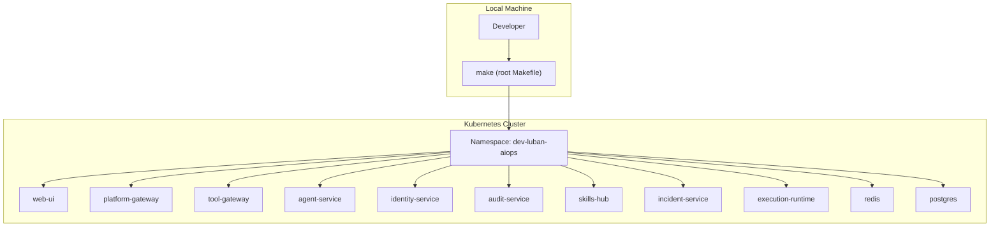
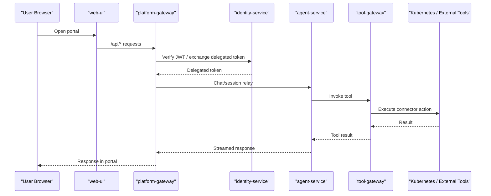
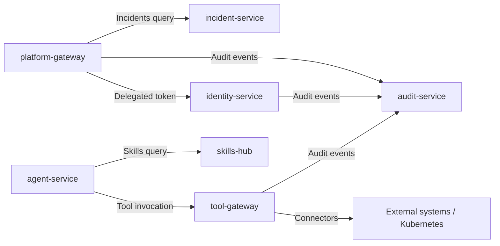

# Getting Started

<cite>
**Referenced Files in This Document**
- [README.md](file://README.md)
- [Makefile](file://Makefile)
- [getting-started.md](file://docs/guides/getting-started.md)
- [configuration-reference.md](file://docs/guides/configuration-reference.md)
- [troubleshooting.md](file://docs/guides/troubleshooting.md)
- [dev-k8s README.md](file://shared/platform-ops/gitops/dev-k8s/README.md)
- [deploy.sh](file://shared/platform-ops/gitops/dev-k8s/deploy.sh)
- [reconcile-portal-oidc-client.sh](file://shared/platform-ops/gitops/dev-k8s/reconcile-portal-oidc-client.sh)
- [verify-runtime-profile.sh](file://shared/platform-ops/gitops/verify-runtime-profile.sh)
- [pyproject.toml](file://products/agent-platform/pyproject.toml)
</cite>

## Table of Contents
1. Introduction
2. Project Structure
3. Core Components
4. Architecture Overview
5. Detailed Component Analysis
6. Dependency Analysis
7. Performance Considerations
8. Troubleshooting Guide
9. Conclusion
10. Appendices

## Introduction
This guide helps you set up the Luban AIOps platform locally and deploy it to a Kubernetes cluster using the dev-k8s overlay. It covers prerequisites, environment setup, building images, deploying with Make targets, first-time configuration (OIDC identity provider, operator accounts), and verifying service health. It also explains how to use the root Makefile commands for your development workflow and points to configuration references and troubleshooting resources.

## Project Structure
The repository is organized into product-oriented services under products/, shared contracts and operations under shared/, and documentation under docs/. The dev-k8s overlay in shared/platform-ops/gitops/dev-k8s defines the development deployment for all platform services and dependencies.

**Diagram sources**
- [dev-k8s README.md:5-29](file://shared/platform-ops/gitops/dev-k8s/README.md#L5-L29)
- [Makefile:14-17](file://Makefile#L14-L17)

**Section sources**
- [README.md:15-54](file://README.md#L15-L54)
- [dev-k8s README.md:5-29](file://shared/platform-ops/gitops/dev-k8s/README.md#L5-L29)

## Core Components
- Operator portal (web UI): operator-portal/web-ui
- Agent runtime and orchestration: agent-platform
- Identity broker (SSO, OIDC, role mapping): identity-broker
- Platform gateway (portal-facing edge, token verification, proxying): platform-gateway
- Tool gateway (normalized tool access, connectors): tool-gateway
- Audit service (durable audit trail): audit-service
- Skills hub (skill ingestion and retrieval): skills-hub
- Incident service (intake, triage, collaboration): incident-service
- Execution runtime (isolated worker for bounded actions): execution-runtime
- In-cluster dependencies: redis, postgres

These components are deployed together by the dev-k8s overlay and coordinated via the root Makefile.

**Section sources**
- [README.md:24-45](file://README.md#L24-L45)
- [dev-k8s README.md:5-29](file://shared/platform-ops/gitops/dev-k8s/README.md#L5-L29)

## Architecture Overview
The typical request flow starts at the portal web UI, which proxies API calls to the platform gateway. The gateway authenticates users via the identity broker, then relays chat and session requests to the agent service. For tool execution, the agent service calls the tool gateway, which may invoke Kubernetes or other connectors. Optional features include skills search, incidents intake/triage, durable auditing, and isolated execution workers.

**Diagram sources**
- [dev-k8s README.md:151-166](file://shared/platform-ops/gitops/dev-k8s/README.md#L151-L166)
- [configuration-reference.md:33-88](file://docs/guides/configuration-reference.md#L33-L88)

## Detailed Component Analysis

### Prerequisites and Local Environment
- Python: Services require Python 3.11+ (enforced by project metadata).
- Kubernetes: 1.28+ cluster with kubectl access.
- Tools: GNU make 4.x, Docker/Podman 24+, kustomize 5.x, uv 0.8+.
- External dependencies:
  - Redis: used for AgentScope coordination (in-cluster redis deployment).
  - PostgreSQL: used for durable audit trail, skills store, incidents store, sessions, and agent state.
  - Elasticsearch: optional; enable via tool-gateway settings if needed.
  - OIDC Identity Provider: Keycloak realm configured by the overlay scripts.

Recommended local cluster: kind, with optional auto-loading of images via make build.

**Section sources**
- [pyproject.toml:5](file://products/agent-platform/pyproject.toml#L5)
- [getting-started.md:6-18](file://docs/guides/getting-started.md#L6-L18)
- [dev-k8s README.md:20-29](file://shared/platform-ops/gitops/dev-k8s/README.md#L20-L29)
- [configuration-reference.md:22-27](file://docs/guides/configuration-reference.md#L22-L27)

### Step-by-Step Setup Using the dev-k8s Overlay
1. Clone the repository and sync Python dependencies:
   - Run make sync to install per-product dependencies from lockfiles.
2. Select an LLM runtime profile:
   - Use select-runtime-profile.sh default to activate the default profile ConfigMap.
3. Provision the LLM API key:
   - Copy the example secrets file, fill in your real key, and sync it into the cluster.
4. Build images:
   - Run make build to create coordinated images and write .images.env.
   - For kind clusters, set AUTO_LOAD_KIND=true and KIND_CLUSTER_NAME to load images automatically.
5. Deploy:
   - Run make deploy to apply the overlay, patch image tags, wait for rollout, provision secrets, and reconcile the Keycloak client.
6. Verify pods and services:
   - Check that all pods are Running and Ready.

**Section sources**
- [getting-started.md:20-91](file://docs/guides/getting-started.md#L20-L91)
- [dev-k8s README.md:311-338](file://shared/platform-ops/gitops/dev-k8s/README.md#L311-L338)
- [deploy.sh:1-62](file://shared/platform-ops/gitops/dev-k8s/deploy.sh#L1-L62)

### First-Time Configuration: OIDC Identity Provider and Operator Accounts
- The overlay provisions a self-contained Keycloak realm named luban-aiops with role groups and test users.
- During make deploy, the script reconciles the browser client settings (redirect URIs, scopes, PKCE) against the committed OIDC configuration.
- After deployment, log in via the portal’s canonical hostname to complete the OIDC callback.

Key behaviors:
- The primary callback URI is fixed; extra redirect URIs are registered for reachability only.
- Test users map to platform roles (e.g., ops-admins → platform-admin).

**Section sources**
- [dev-k8s README.md:74-131](file://shared/platform-ops/gitops/dev-k8s/README.md#L74-L131)
- [reconcile-portal-oidc-client.sh:274-316](file://shared/platform-ops/gitops/dev-k8s/reconcile-portal-oidc-client.sh#L274-L316)
- [getting-started.md:123-155](file://docs/guides/getting-started.md#L123-L155)

### Verifying Service Health
- Check pod status and services:
  - kubectl -n dev-luban-aiops get pods,svc
- Port-forward web-ui to inspect assets and proxied /api/:
  - kubectl -n dev-luban-aiops port-forward service/web-ui 18080:8080
- Verify agent-service runtime metadata:
  - Port-forward agent-service and call /api/v2/runtime and /api/v2/health.
- Confirm delegation metrics:
  - Check platform-gateway metrics for successful token exchanges.

**Section sources**
- [dev-k8s README.md:728-761](file://shared/platform-ops/gitops/dev-k8s/README.md#L728-L761)
- [getting-started.md:103-178](file://docs/guides/getting-started.md#L103-L178)

### Development Workflow With the Root Makefile
- make verify: Runs tests, overlays validation, policy checks, scenario validations, version lockstep, and secret vocabulary checks.
- make test: Executes every product test suite.
- make build: Builds all images with a coordinated tag and writes .images.env; optionally loads images into kind.
- make deploy: Applies the dev-k8s overlay, patches image tags, waits for rollout, provisions secrets, and reconciles the Keycloak client.

Additional useful targets:
- make lint: Lints Dockerfiles.
- make push: Pushes images.
- make e2e: Runs end-to-end demo scripts against a deployed cluster.

**Section sources**
- [Makefile:77-183](file://Makefile#L77-L183)
- [Makefile:193-204](file://Makefile#L193-L204)

### Initial Configuration References
- Runtime profiles and provider selection:
  - Use select-runtime-profile.sh to switch active profiles.
  - Verify overlays render correctly with verify-runtime-profile.sh.
- Secrets provisioning:
  - Token delegation, audit, skills, incidents, OTel headers, and browser credentials are provisioned during make deploy or via dedicated sync scripts.
- Policy bundle management:
  - Edit the canonical policy file, validate, sync, and redeploy to enforce changes.

**Section sources**
- [dev-k8s README.md:243-259](file://shared/platform-ops/gitops/dev-k8s/README.md#L243-L259)
- [dev-k8s README.md:340-414](file://shared/platform-ops/gitops/dev-k8s/README.md#L340-L414)
- [configuration-reference.md:282-327](file://docs/guides/configuration-reference.md#L282-L327)

## Dependency Analysis
The platform relies on several cross-service dependency chains:
- Token delegation chain between platform-gateway and identity-service.
- Tool relay chain from agent-service to tool-gateway.
- Durable audit trail ingestion from multiple emitters to audit-service.
- Skills and incidents retrieval chains with their own credential registries.

**Diagram sources**
- [configuration-reference.md:33-88](file://docs/guides/configuration-reference.md#L33-L88)
- [configuration-reference.md:128-157](file://docs/guides/configuration-reference.md#L128-L157)
- [configuration-reference.md:170-212](file://docs/guides/configuration-reference.md#L170-L212)
- [configuration-reference.md:214-280](file://docs/guides/configuration-reference.md#L214-L280)

**Section sources**
- [configuration-reference.md:33-88](file://docs/guides/configuration-reference.md#L33-L88)
- [configuration-reference.md:128-157](file://docs/guides/configuration-reference.md#L128-L157)
- [configuration-reference.md:170-212](file://docs/guides/configuration-reference.md#L170-L212)
- [configuration-reference.md:214-280](file://docs/guides/configuration-reference.md#L214-L280)

## Performance Considerations
- Prefer using make build with AUTO_LOAD_KIND for kind to avoid stale image tags and reduce rollout delays.
- Keep policy bundles synchronized across consumers to prevent reload issues; changes take effect on restart.
- Monitor metrics endpoints for delegation, audit emit counters, and readiness states to detect bottlenecks early.
- Avoid raw kubectl apply -k for deployments; always use make deploy to ensure correct image tags and post-deploy steps.

[No sources needed since this section provides general guidance]

## Troubleshooting Guide
Common symptoms and resolutions:
- “Access not granted” or “no tools available”:
  - Likely missing or mismatched token delegation secrets. Re-provision delegation secrets and restart affected deployments.
- Portal login fails:
  - Check OIDC configuration and Keycloak reachability; reconcile the portal client if redirect URIs mismatch.
- Stream never completes or empty response:
  - Ensure agent-service has a valid LLM provider and API key; check runtime metadata and health endpoints.
- Tool returns “denied by policy”:
  - Verify user roles and policy bundle; re-sync and redeploy if drifted.
- Pods fail with ErrImagePull:
  - Do not use raw kubectl apply -k; run make deploy to patch image tags.
- Audit view empty or recent events missing:
  - Check emitter URLs, audit-service readiness, and ingest credentials; re-run sync-audit-secrets.sh if needed.
- Skills searches return nothing:
  - Check skills-hub sync status, connector registration URL, and query secret halves; re-run sync-skills-secrets.sh.
- Alertmanager alerts never create incidents:
  - Verify INCIDENT_WEBHOOK_TOKEN and re-run sync-incident-secrets.sh.

For detailed diagnostics and commands, consult the troubleshooting guide.

**Section sources**
- [troubleshooting.md:32-67](file://docs/guides/troubleshooting.md#L32-L67)
- [troubleshooting.md:102-135](file://docs/guides/troubleshooting.md#L102-L135)
- [troubleshooting.md:138-168](file://docs/guides/troubleshooting.md#L138-L168)
- [troubleshooting.md:171-207](file://docs/guides/troubleshooting.md#L171-L207)
- [troubleshooting.md:235-258](file://docs/guides/troubleshooting.md#L235-L258)
- [troubleshooting.md:314-381](file://docs/guides/troubleshooting.md#L314-L381)
- [troubleshooting.md:413-448](file://docs/guides/troubleshooting.md#L413-L448)
- [troubleshooting.md:450-484](file://docs/guides/troubleshooting.md#L450-L484)

## Conclusion
You now have the essentials to set up the Luban AIOps platform locally, deploy it using the dev-k8s overlay, configure OIDC identity, create operator accounts, and verify service health. Use the root Makefile targets to streamline your development workflow, and refer to the configuration reference and troubleshooting guide for deeper insights and issue resolution.

[No sources needed since this section summarizes without analyzing specific files]

## Appendices

### Quick Commands Reference
- Sync dependencies: make sync
- Select runtime profile: shared/platform-ops/gitops/select-runtime-profile.sh default
- Provision LLM API key: copy example env, edit, then sync-runtime-secret.sh default
- Build images: make build
- Deploy: make deploy
- Verify overlays: shared/platform-ops/gitops/verify-runtime-profile.sh
- Access portal: kubectl -n dev-luban-aiops port-forward service/web-ui 18080:8080

**Section sources**
- [getting-started.md:20-91](file://docs/guides/getting-started.md#L20-L91)
- [dev-k8s README.md:243-259](file://shared/platform-ops/gitops/dev-k8s/README.md#L243-L259)
- [dev-k8s README.md:728-761](file://shared/platform-ops/gitops/dev-k8s/README.md#L728-L761)