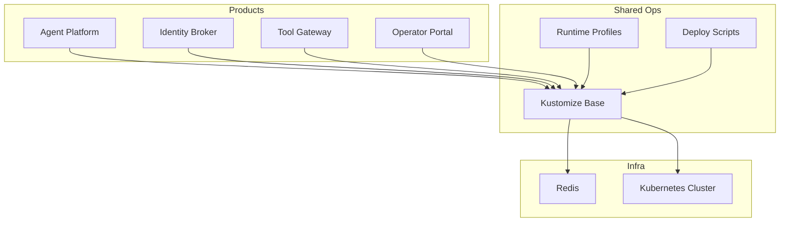
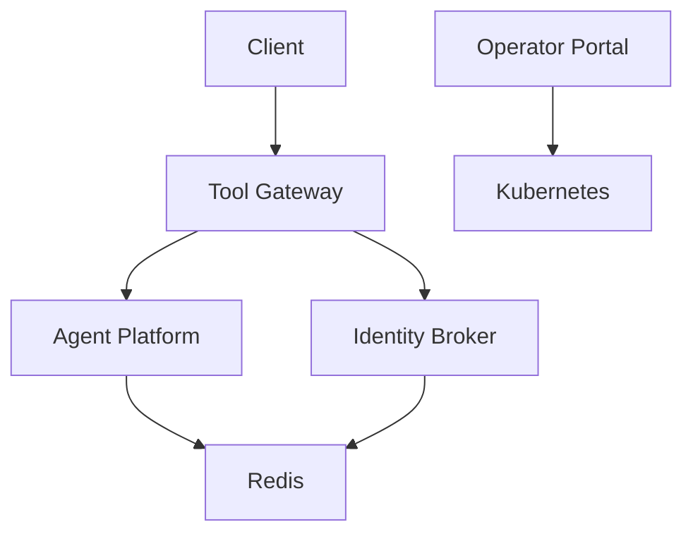

# Getting Started

<cite>
**Referenced Files in This Document**
- [README.md](file://README.md)
- [Makefile](file://Makefile)
- [products/agent-platform/README.md](file://products/agent-platform/README.md)
- [products/identity-broker/README.md](file://products/identity-broker/README.md)
- [products/tool-gateway/README.md](file://products/tool-gateway/README.md)
- [shared/platform-ops/gitops/dev-k8s/README.md](file://shared/platform-ops/gitops/dev-k8s/README.md)
- [shared/platform-ops/gitops/deploy-overlay.sh](file://shared/platform-ops/gitops/deploy-overlay.sh)
- [shared/platform-ops/gitops/select-runtime-profile.sh](file://shared/platform-ops/gitops/select-runtime-profile.sh)
- [shared/platform-ops/gitops/sync-runtime-secret.sh](file://shared/platform-ops/gitops/sync-runtime-secret.sh)
- [shared/platform-ops/gitops/runtime-profiles/openai/configmap.yaml](file://shared/platform-ops/gitops/runtime-profiles/openai/configmap.yaml)
- [shared/platform-ops/gitops/runtime-profiles/openai/runtime-secrets.example.env](file://shared/platform-ops/gitops/runtime-profiles/openai/runtime-secrets.example.env)
- [shared/platform-ops/gitops/dev-k8s/base/kustomization.yaml](file://shared/platform-ops/gitops/dev-k8s/base/kustomization.yaml)
- [shared/platform-ops/gitops/dev-k8s/base/shared/observability.env](file://shared/platform-ops/gitops/dev-k8s/base/shared/observability.env)
- [shared/platform-ops/gitops/dev-k8s/base/tool-gateway/policy.yaml](file://shared/platform-ops/gitops/dev-k8s/base/tool-gateway/policy.yaml)
- [shared/platform-ops/gitops/dev-k8s/base/tool-gateway/rbac.yaml](file://shared/platform-ops/gitops/dev-k8s/base/tool-gateway/rbac.yaml)
- [shared/platform-ops/gitops/dev-k8s/base/infra/redis-deployment.yaml](file://shared/platform-ops/gitops/dev-k8s/base/infra/redis-deployment.yaml)
- [shared/platform-ops/gitops/dev-k8s/base/infra/redis-service.yaml](file://shared/platform-ops/gitops/dev-k8s/base/infra/redis-service.yaml)
- [shared/platform-ops/gitops/dev-k8s/base/agent-platform/agent-service-deployment.yaml](file://shared/platform-ops/gitops/dev-k8s/base/agent-platform/agent-service-deployment.yaml)
- [shared/platform-ops/gitops/dev-k8s/base/agent-platform/agent-service-service.yaml](file://shared/platform-ops/gitops/dev-k8s/base/agent-platform/agent-service-service.yaml)
- [shared/platform-ops/gitops/dev-k8s/base/identity-broker/identity-service-deployment.yaml](file://shared/platform-ops/gitops/dev-k8s/base/identity-broker/identity-service-deployment.yaml)
- [shared/platform-ops/gitops/dev-k8s/base/identity-broker/identity-service-service.yaml](file://shared/platform-ops/gitops/dev-k8s/base/identity-broker/identity-service-service.yaml)
- [shared/platform-ops/gitops/dev-k8s/base/operator-portal/web-ui-deployment.yaml](file://shared/platform-ops/gitops/dev-k8s/base/operator-portal/web-ui-deployment.yaml)
- [shared/platform-ops/gitops/dev-k8s/base/operator-portal/web-ui-service.yaml](file://shared/platform-ops/gitops/dev-k8s/base/operator-portal/web-ui-service.yaml)
- [shared/platform-ops/gitops/dev-k8s/base/tool-gateway/api-gateway-deployment.yaml](file://shared/platform-ops/gitops/dev-k8s/base/tool-gateway/api-gateway-deployment.yaml)
- [shared/platform-ops/gitops/dev-k8s/base/tool-gateway/api-gateway-service.yaml](file://shared/platform-ops/gitops/dev-k8s/base/tool-gateway/api-gateway-service.yaml)
- [shared/platform-ops/gitops/dev-k8s/deploy.sh](file://shared/platform-ops/gitops/deploy.sh)
- [shared/platform-ops/gitops/reconcile-portal-oidc-client.sh](file://shared/platform-ops/gitops/reconcile-portal-oidc-client.sh)
</cite>

## Table of Contents
1. Introduction
2. Prerequisites
3. Project Structure Overview
4. Quick Start: Local Development
5. Quick Start: Production Deployment
6. Environment Configuration and Secrets
7. Initial Validation and First API Call
8. Troubleshooting Guide
9. Next Steps by Persona
10. Architecture Overview
11. Conclusion

## Introduction
This guide helps you get up and running with the Luban AIOps Platform for local development and production deployment. It covers prerequisites, installation steps, environment configuration, secret management, initial validation, and common troubleshooting tips. You will also find links to additional resources and next steps tailored for developers, operators, and security teams.

## Prerequisites
Ensure your environment meets the following requirements before proceeding:
- Python 3.x (for local development and building services)
- Docker (container build and runtime)
- Kubernetes cluster (local or managed) with kubectl configured
- kustomize (used by GitOps overlays)
- curl or HTTP client for API testing
- Optional: Helm if you prefer Helm-based deployments later

Notes:
- The platform uses Kustomize overlays under shared/platform-ops/gitops for both development and production profiles.
- Runtime profiles are provided for OpenAI, DashScope, and DeepSeek; select one based on your needs.

**Section sources**
- [shared/platform-ops/gitops/dev-k8s/README.md](file://shared/platform-ops/gitops/dev-k8s/README.md)
- [shared/platform-ops/gitops/runtime-profiles/README.md](file://shared/platform-ops/gitops/runtime-profiles/README.md)

## Project Structure Overview
The repository is organized into product services and shared operational assets:
- Products:
  - agent-platform: Agent runtime service and providers
  - identity-broker: Identity and token services
  - tool-gateway: API gateway, policy enforcement, and tool orchestration
  - operator-portal: Web UI for operators
- Shared:
  - platform-ops: GitOps overlays, scripts, runtime profiles, and base Kustomize manifests
  - shared-contracts: JSON schemas and observability conventions
  - shared-sdk: SDK documentation

[No sources needed since this diagram shows conceptual structure]

## Quick Start: Local Development
Follow these steps to run the platform locally using Kustomize overlays:

1. Prepare your environment
   - Ensure Docker, kubectl, and kustomize are installed and working.
   - Create or switch to a local Kubernetes context (e.g., minikube, kind, docker-desktop).

2. Select a runtime profile
   - Choose a runtime profile (OpenAI, DashScope, DeepSeek) to configure provider credentials and settings.
   - Use the selection script to set the active profile.

3. Sync runtime secrets
   - Copy example secrets from the selected runtime profile into your environment or Kubernetes secrets as required by the overlay.
   - Use the sync script to apply secrets consistently across namespaces.

4. Deploy base resources
   - Apply the Kustomize base to create namespaces, Redis, and core services.
   - Verify that Redis and core services are healthy.

5. Deploy overlays
   - Apply the dev overlay to deploy all platform components (agent-platform, identity-broker, tool-gateway, operator-portal).
   - Confirm pods are running and services are exposed.

6. Access the Operator Portal
   - Port-forward or expose the web UI service to access the portal locally.

7. Make your first API call
   - Use the tool-gateway endpoints to send a chat request and receive a response.
   - Validate health endpoints to ensure services are ready.

Key scripts and overlays:
- Select runtime profile: shared/platform-ops/gitops/select-runtime-profile.sh
- Sync runtime secrets: shared/platform-ops/gitops/sync-runtime-secret.sh
- Deploy overlay: shared/platform-ops/gitops/deploy-overlay.sh
- Base Kustomization: shared/platform-ops/gitops/dev-k8s/base/kustomization.yaml

**Section sources**
- [shared/platform-ops/gitops/select-runtime-profile.sh](file://shared/platform-ops/gitops/select-runtime-profile.sh)
- [shared/platform-ops/gitops/sync-runtime-secret.sh](file://shared/platform-ops/gitops/sync-runtime-secret.sh)
- [shared/platform-ops/gitops/deploy-overlay.sh](file://shared/platform-ops/gitops/deploy-overlay.sh)
- [shared/platform-ops/gitops/dev-k8s/base/kustomization.yaml](file://shared/platform-ops/gitops/dev-k8s/base/kustomization.yaml)

## Quick Start: Production Deployment
For production, use the same Kustomize overlays with appropriate overlays and secrets:

1. Prepare production environment
   - Provision a managed Kubernetes cluster and configure kubectl.
   - Set up persistent storage for Redis and any stateful components.
   - Configure ingress and TLS termination at the cluster edge.

2. Select and configure runtime profile
   - Choose the desired runtime profile and populate secrets securely (e.g., via sealed secrets or external secret managers).
   - Use the sync script to apply secrets to the target namespace.

3. Apply Kustomize overlays
   - Apply the base and production-specific overlays to deploy all services.
   - Verify deployments, services, and policies are applied correctly.

4. Configure observability and policies
   - Review observability configuration and enable metrics/logs/traces as needed.
   - Inspect and customize policy definitions for governance and compliance.

5. Validate and monitor
   - Check health endpoints and run smoke tests against the tool-gateway.
   - Monitor pod status, logs, and metrics dashboards.

Key files for production considerations:
- Policy definition: shared/platform-ops/gitops/dev-k8s/base/tool-gateway/policy.yaml
- RBAC rules: shared/platform-ops/gitops/dev-k8s/base/tool-gateway/rbac.yaml
- Observability env: shared/platform-ops/gitops/dev-k8s/base/shared/observability.env

**Section sources**
- [shared/platform-ops/gitops/dev-k8s/base/tool-gateway/policy.yaml](file://shared/platform-ops/gitops/dev-k8s/base/tool-gateway/policy.yaml)
- [shared/platform-ops/gitops/dev-k8s/base/tool-gateway/rbac.yaml](file://shared/platform-ops/gitops/dev-k8s/base/tool-gateway/rbac.yaml)
- [shared/platform-ops/gitops/dev-k8s/base/shared/observability.env](file://shared/platform-ops/gitops/dev-k8s/base/shared/observability.env)

## Environment Configuration and Secrets
Environment variables and secrets are managed through Kustomize overlays and scripts:

- Runtime profiles
  - OpenAI profile includes configmap and example secrets template.
  - Use the example file to populate actual secrets for your environment.

- Secrets synchronization
  - The sync script ensures secrets are applied consistently across namespaces.
  - Follow the script usage to update secrets without manual edits.

- Observability configuration
  - Centralized observability environment variables control logging, metrics, and tracing.

- Example references
  - OpenAI runtime configmap: shared/platform-ops/gitops/runtime-profiles/openai/configmap.yaml
  - OpenAI runtime secrets example: shared/platform-ops/gitops/runtime-profiles/openai/runtime-secrets.example.env

Best practices:
- Never commit real secrets to version control; use the example templates and external secret stores.
- Rotate secrets regularly and audit access.
- Validate configurations with the verification script before deploying.

**Section sources**
- [shared/platform-ops/gitops/runtime-profiles/openai/configmap.yaml](file://shared/platform-ops/gitops/runtime-profiles/openai/configmap.yaml)
- [shared/platform-ops/gitops/runtime-profiles/openai/runtime-secrets.example.env](file://shared/platform-ops/gitops/runtime-profiles/openai/runtime-secrets.example.env)
- [shared/platform-ops/gitops/sync-runtime-secret.sh](file://shared/platform-ops/gitops/sync-runtime-secret.sh)
- [shared/platform-ops/gitops/dev-k8s/base/shared/observability.env](file://shared/platform-ops/gitops/dev-k8s/base/shared/observability.env)

## Initial Validation and First API Call
After deployment, validate the platform and make your first API call:

1. Health checks
   - Verify health endpoints for each service (tool-gateway, identity-broker, agent-platform).
   - Ensure all pods are Running and Services are Ready.

2. Operator Portal
   - Access the web UI via port-forwarding or ingress.
   - Confirm basic navigation and service status displays.

3. First API call
   - Use the tool-gateway chat endpoint to send a request and receive a response.
   - Include necessary authentication headers as configured by the identity broker.

4. Session and tools
   - Explore session management and tool invocation through the gateway.
   - Validate policy enforcement by attempting restricted actions.

Use curl or an HTTP client to test endpoints. Refer to service READMEs for endpoint details and examples.

**Section sources**
- [products/tool-gateway/README.md](file://products/tool-gateway/README.md)
- [products/identity-broker/README.md](file://products/identity-broker/README.md)
- [products/agent-platform/README.md](file://products/agent-platform/README.md)

## Troubleshooting Guide
Common issues and resolutions:

- Pods not starting
  - Check resource limits and requests in deployments.
  - Verify image pull permissions and registry access.
  - Inspect pod logs and events for errors.

- Secrets not applied
  - Ensure the sync script ran successfully and secrets exist in the target namespace.
  - Validate secret names and keys match expectations.

- Runtime profile misconfiguration
  - Re-run the selection script and verify configmaps and secrets are updated.
  - Confirm provider credentials are valid and accessible.

- Network and ingress issues
  - Verify Service types and Ingress configurations.
  - Check DNS resolution and TLS certificates.

- Policy enforcement blocks requests
  - Review policy definitions and RBAC rules.
  - Adjust policies to allow intended operations while maintaining security.

Useful commands:
- kubectl get pods, svc, ing -n <namespace>
- kubectl describe pod <pod-name> -n <namespace>
- kubectl logs <pod-name> -n <namespace>
- kubectl get configmaps, secrets -n <namespace>

**Section sources**
- [shared/platform-ops/gitops/dev-k8s/base/infra/redis-deployment.yaml](file://shared/platform-ops/gitops/dev-k8s/base/infra/redis-deployment.yaml)
- [shared/platform-ops/gitops/dev-k8s/base/infra/redis-service.yaml](file://shared/platform-ops/gitops/dev-k8s/base/infra/redis-service.yaml)
- [shared/platform-ops/gitops/dev-k8s/base/tool-gateway/api-gateway-deployment.yaml](file://shared/platform-ops/gitops/dev-k8s/base/tool-gateway/api-gateway-deployment.yaml)
- [shared/platform-ops/gitops/dev-k8s/base/tool-gateway/api-gateway-service.yaml](file://shared/platform-ops/gitops/dev-k8s/base/tool-gateway/api-gateway-service.yaml)
- [shared/platform-ops/gitops/dev-k8s/base/agent-platform/agent-service-deployment.yaml](file://shared/platform-ops/gitops/dev-k8s/base/agent-platform/agent-service-deployment.yaml)
- [shared/platform-ops/gitops/dev-k8s/base/agent-platform/agent-service-service.yaml](file://shared/platform-ops/gitops/dev-k8s/base/agent-platform/agent-service-service.yaml)
- [shared/platform-ops/gitops/dev-k8s/base/identity-broker/identity-service-deployment.yaml](file://shared/platform-ops/gitops/dev-k8s/base/identity-broker/identity-service-deployment.yaml)
- [shared/platform-ops/gitops/dev-k8s/base/identity-broker/identity-service-service.yaml](file://shared/platform-ops/gitops/dev-k8s/base/identity-broker/identity-service-service.yaml)
- [shared/platform-ops/gitops/dev-k8s/base/operator-portal/web-ui-deployment.yaml](file://shared/platform-ops/gitops/dev-k8s/base/operator-portal/web-ui-deployment.yaml)
- [shared/platform-ops/gitops/dev-k8s/base/operator-portal/web-ui-service.yaml](file://shared/platform-ops/gitops/dev-k8s/base/operator-portal/web-ui-service.yaml)

## Next Steps by Persona
- Developers
  - Explore service codebases and APIs under products/* directories.
  - Run unit tests and integration tests locally.
  - Extend providers and tools as needed.

- Operators
  - Manage Kustomize overlays and secrets lifecycle.
  - Implement CI/CD pipelines for automated deployments.
  - Configure monitoring, alerting, and log aggregation.

- Security Teams
  - Review RBAC rules and policy definitions.
  - Audit secrets management and rotation procedures.
  - Enforce compliance policies and conduct periodic assessments.

Additional resources:
- Repository README for high-level overview and links
- Product READMEs for detailed service documentation
- GitOps scripts and overlays for deployment automation

**Section sources**
- [README.md](file://README.md)
- [products/agent-platform/README.md](file://products/agent-platform/README.md)
- [products/identity-broker/README.md](file://products/identity-broker/README.md)
- [products/tool-gateway/README.md](file://products/tool-gateway/README.md)

## Architecture Overview
The platform consists of several microservices orchestrated via Kubernetes and exposed through an API gateway. Core components include:
- Tool Gateway: Central API entry point with policy enforcement and tool orchestration
- Identity Broker: Authentication, authorization, and token management
- Agent Platform: Agent runtime and provider integrations
- Operator Portal: Web UI for operational tasks
- Redis: Stateful component for sessions and caching

[No sources needed since this diagram shows conceptual architecture]

## Conclusion
You now have the essential information to install, configure, and operate the Luban AIOps Platform for both local development and production. Use the provided scripts and overlays to manage deployments, secrets, and runtime profiles. For deeper exploration, consult the product READMEs and GitOps assets. If you encounter issues, refer to the troubleshooting guide and leverage Kubernetes diagnostics.