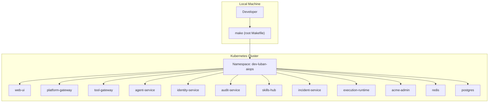
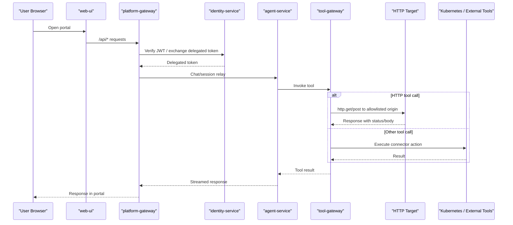
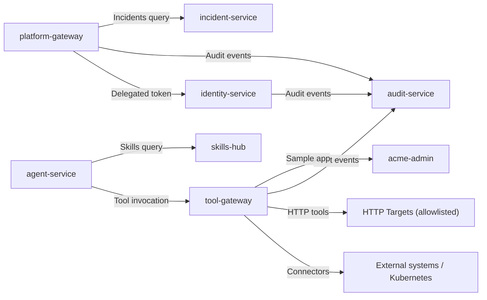

# Getting Started

<cite>
**Referenced Files in This Document**
- [README.md](file://README.md)
- [Makefile](file://Makefile)
- [getting-started.md](file://docs/guides/getting-started.md)
- [configuration-reference.md](file://docs/guides/configuration-reference.md)
- [troubleshooting.md](file://docs/guides/troubleshooting.md)
- [dev-k8s README.md](file://shared/platform-ops/gitops/dev-k8s/README.md)
- [deploy.sh](file://shared/platform-ops/gitops/dev-k8s/deploy.sh)
- [reconcile-portal-oidc-client.sh](file://shared/platform-ops/gitops/dev-k8s/reconcile-portal-oidc-client.sh)
- [verify-runtime-profile.sh](file://shared/platform-ops/gitops/verify-runtime-profile.sh)
- [pyproject.toml](file://products/agent-platform/pyproject.toml)
- [http_connector.py](file://products/tool-gateway/src/tool_gateway/tools/http_connector.py)
- [acme-admin README.md](file://samples/acme-admin/README.md)
- [acme-admin deploy.sh](file://samples/acme-admin/deploy.sh)
- [api.py](file://samples/acme-admin/app/src/acme_admin/api.py)
- [pages.py](file://samples/acme-admin/app/src/acme_admin/pages.py)
- [CheckServiceHealth.md](file://samples/acme-admin/health-check/skill/CheckServiceHealth.md)
- [CheckUserStatus.md](file://samples/acme-admin/user-status/skill/CheckUserStatus.md)
- [LockUnlockUser.md](file://samples/acme-admin/lock-unlock-user/skill/LockUnlockUser.md)
- [ResetAcmePassword.md](file://samples/acme-admin/password-reset/skill/ResetAcmePassword.md)
- [http-check-demo.sh](file://shared/platform-ops/e2e/http-check-demo.sh)
- [SPEC-058 spec.md](file://docs/specs/SPEC-058-http-service-check-tools/spec.md)
- [SPEC-059 spec.md](file://docs/specs/SPEC-059-acme-admin-sample-app-and-skill-suite/spec.md)
</cite>

## Update Summary
**Changes Made**
- Updated Available Endpoints section with comprehensive API and HTML surface documentation from actual source files
- Enhanced Skill Demonstrations section with detailed descriptions of all four skill rungs and their approval models
- Added specific endpoint tables for both JSON API and HTML surfaces based on actual implementation
- Updated deployment instructions to reflect the consolidated acme-admin samples structure
- Enhanced troubleshooting guidance with HTTP tool-specific issues and acme-admin sample problems

## Table of Contents
1. Introduction
2. Project Structure
3. Core Components
4. Architecture Overview
5. HTTP Service-Check Tools
6. ACME Admin Sample Application
7. Detailed Component Analysis
8. Dependency Analysis
9. Performance Considerations
10. Troubleshooting Guide
11. Conclusion
12. Appendices

## Introduction
This guide helps you set up the Luban AIOps platform locally and deploy it to a Kubernetes cluster using the dev-k8s overlay. It covers prerequisites, environment setup, building images, deploying with Make targets, first-time configuration (OIDC identity provider, operator accounts), and verifying service health. The platform now includes HTTP service-check tools (`http.get`, `http.post`) and an ACME Admin sample application for quick platform exploration and skill demonstrations.

## Project Structure
The repository is organized into product-oriented services under products/, shared contracts and operations under shared/, samples under samples/, and documentation under docs/. The dev-k8s overlay in shared/platform-ops/gitops/dev-k8s defines the development deployment for all platform services and dependencies.



**Diagram sources**
- [dev-k8s README.md:5-29](file://shared/platform-ops/gitops/dev-k8s/README.md#L5-L29)
- [Makefile:14-17](file://Makefile#L14-L17)
- [acme-admin deploy.sh:46-58](file://samples/acme-admin/deploy.sh#L46-L58)

**Section sources**
- [README.md:15-54](file://README.md#L15-L54)
- [dev-k8s README.md:5-29](file://shared/platform-ops/gitops/dev-k8s/README.md#L5-L29)

## Core Components
- Operator portal (web UI): operator-portal/web-ui
- Agent runtime and orchestration: agent-platform
- Identity broker (SSO, OIDC, role mapping): identity-broker
- Platform gateway (portal-facing edge, token verification, proxying): platform-gateway
- Tool gateway (normalized tool access, connectors): tool-gateway
- Audit service (durable audit trail): audit-service
- Skills hub (skill ingestion and retrieval): skills-hub
- Incident service (intake, triage, collaboration): incident-service
- Execution runtime (isolated worker for bounded actions): execution-runtime
- ACME Admin sample application (sample admin console for skill demonstrations): samples/acme-admin
- In-cluster dependencies: redis, postgres

These components are deployed together by the dev-k8s overlay and coordinated via the root Makefile.

**Section sources**
- [README.md:24-45](file://README.md#L24-L45)
- [dev-k8s README.md:5-29](file://shared/platform-ops/gitops/dev-k8s/README.md#L5-L29)
- [acme-admin README.md:1-16](file://samples/acme-admin/README.md#L1-L16)

## Architecture Overview
The typical request flow starts at the portal web UI, which proxies API calls to the platform gateway. The gateway authenticates users via the identity broker, then relays chat and session requests to the agent service. For tool execution, the agent service calls the tool gateway, which may invoke Kubernetes or other connectors. The new HTTP tools allow agents to make HTTP requests to allowlisted origins, while the ACME Admin sample provides a real target for demonstrating skill workflows.



**Diagram sources**
- [dev-k8s README.md:151-166](file://shared/platform-ops/gitops/dev-k8s/README.md#L151-L166)
- [configuration-reference.md:33-88](file://docs/guides/configuration-reference.md#L33-L88)
- [http_connector.py:389-491](file://products/tool-gateway/src/tool_gateway/tools/http_connector.py#L389-L491)

## HTTP Service-Check Tools

### Overview
The platform now includes two HTTP service-check tools that allow agents to interact with external HTTP services through a secure, bounded interface:

- **`http.get`**: Read-tier tool for fetching URLs, checking service health, and retrieving JSON/text responses
- **`http.post`**: Write-tier tool for sending bounded JSON objects to external APIs with approval requirements

### Security Model
Both tools implement strict security controls:
- **Allowlist enforcement**: Only pre-approved origins can be accessed
- **Credential management**: Authentication uses named credential sets, never inline secrets
- **Request bounds**: POST bodies limited to 32 keys, depth 2, and configurable byte limits
- **Redirect handling**: GET follows up to 3 validated redirects; POST refuses redirects
- **Scheme validation**: Only HTTP/HTTPS schemes allowed; loopback/link-local/multicast addresses blocked

### Configuration
Enable HTTP tools through runtime profiles:
```bash
# Enable HTTP connector and add allowlisted origins
export GATEWAY_HTTP_ENABLED=true
export GATEWAY_HTTP_ALLOW_ORIGINS="http://acme-admin:8080,https://api.example.com"
export GATEWAY_MUTATING_TOOLS_ENABLED=true  # Required for http.post
```

### Usage Examples
```python
# Health check example (read-only)
http.get(url="http://acme-admin:8080/healthz")

# User lock operation (write with approval)
http.post(
    url="http://acme-admin:8080/api/users/alice/lock",
    body={"locked": True},
    credential_set="acme-admin"
)
```

**Section sources**
- [http_connector.py:1-25](file://products/tool-gateway/src/tool_gateway/tools/http_connector.py#L1-L25)
- [http_connector.py:322-359](file://products/tool-gateway/src/tool_gateway/tools/http_connector.py#L322-L359)
- [http_connector.py:497-592](file://products/tool-gateway/src/tool_gateway/tools/http_connector.py#L497-L592)
- [http_connector.py:595-699](file://products/tool-gateway/src/tool_gateway/tools/http_connector.py#L595-L699)
- [http-check-demo.sh:10-34](file://shared/platform-ops/e2e/http-check-demo.sh#L10-L34)

## ACME Admin Sample Application

### Purpose
The ACME Admin sample application is a standalone FastAPI-based user administration console designed specifically for demonstrating platform capabilities and skill workflows. Unlike previous static browser targets, this application maintains state, validates authentication, and provides both JSON API and HTML surfaces for comprehensive testing.

### Features
- **In-memory store**: Deterministic seed data with four test users (alice, bob, carol, dave)
- **Authentication**: Basic auth for API endpoints, session-based auth for HTML interface
- **Mutations**: Lock/unlock users, password resets with proper approval flows
- **Health monitoring**: Comprehensive health endpoint with service status information
- **NetworkPolicy**: Enforced network isolation for security demonstration

### Deployment
Deploy the sample application after platform deployment:
```bash
# Deploy the sample application
make deploy-sample-app

# Install skill documents that demonstrate the application
make deploy-samples

# Expose the admin interface for walkthroughs
kubectl -n dev-luban-aiops port-forward svc/acme-admin 8080:8080
open http://localhost:8080/admin/
```

### Available Endpoints

#### JSON API Surface (`/api/*`)
| Method | Path | Description | Authentication |
|--------|------|-------------|----------------|
| GET | `/healthz` | Service health check with eight keys: status, service, version, hostname, uptime_seconds, started_at, users_seeded, store_revision | No auth required |
| GET | `/api/hello?name=` | Echo endpoint for testing with bounded name parameter | No auth required |
| GET | `/api/users` | List all users with store revision | Admin (Basic Auth) |
| GET | `/api/users/{identifier}` | Get single user by username or email | Admin (Basic Auth) |
| POST | `/api/users/{identifier}/lock` | Lock user account | Admin (Basic Auth) |
| POST | `/api/users/{identifier}/unlock` | Unlock user account | Admin (Basic Auth) |
| POST | `/api/users/{identifier}/password` | Reset user password with password body | Admin (Basic Auth) |
| POST | `/internal/reset-demo` | Reset demo state (header-gated) | Header: X-Luban-Demo-Reset |

#### HTML Interface Surface
| Path | Description | Authentication |
|------|-------------|----------------|
| `/` | Public landing page with staff sign-in form | None |
| `/status` | Service status page showing api, database, queue status | None |
| `/admin/` | Operator login form with auto-submit functionality | None (redirects if already logged in) |
| `POST /admin/login` | Login endpoint that issues session cookie | None |
| `/admin/users/` | User management console with table display | Session cookie |
| `POST /admin/users/reset/` | Password reset submission | Session cookie |
| `/admin/users/reset/done/` | Confirmation page rendered from store | Session cookie |

### Skill Demonstrations
The sample includes a progressive four-rung ladder plus two additional approval model demonstrations:

#### Four-Rung Ladder
| # | Sample | Surface | Effect | Cards | Approval Kind |
|---|---|---|---|---|---|
| 1 | Health Check | `http.get` | Read | 0 | — |
| 2 | User Status | Bound browser flow | Read | 0 | — |
| 3 | Lock/Unlock User | `http.post` | Write | 1 | `action` |
| 4 | Password Reset | Bound browser flow | Write | 1 | `flow` |

#### Additional Approval Models
| Sample | Skill | Approval Shape |
|---|---|---|
| Adhoc Password Reset | Hand-written runbook, no `web_target` | N `action` cards for N writes |
| Skill Graduation | None — the skill is the artifact the demo produces | N `action` cards to author, then 1 `flow` card to replay |

Each skill demonstrates different aspects of the platform's approval workflow, from completely read-only operations to complex multi-step browser flows requiring operator approval.

**Section sources**
- [acme-admin README.md:1-16](file://samples/acme-admin/README.md#L1-L16)
- [acme-admin README.md:18-36](file://samples/acme-admin/README.md#L18-L36)
- [acme-admin README.md:38-77](file://samples/acme-admin/README.md#L38-L77)
- [acme-admin README.md:94-144](file://samples/acme-admin/README.md#L94-L144)
- [acme-admin deploy.sh:107-163](file://samples/acme-admin/deploy.sh#L107-L163)
- [api.py:88-196](file://samples/acme-admin/app/src/acme_admin/api.py#L88-L196)
- [pages.py:422-601](file://samples/acme-admin/app/src/acme_admin/pages.py#L422-L601)

## Detailed Component Analysis

### Prerequisites and Local Environment
- Python: Services require Python 3.11+ (enforced by project metadata).
- Kubernetes: 1.28+ cluster with kubectl access.
- Tools: GNU make 4.x, Docker/Podman 24+, kustomize 5.x, uv 0.8+.
- External dependencies:
  - Redis: used for AgentScope coordination (in-cluster redis deployment).
  - PostgreSQL: used for durable audit trail, skills store, incidents store, sessions, and agent state.
  - Elasticsearch: optional; enable via tool-gateway settings if needed.
  - OIDC Identity Provider: Keycloak realm configured by the overlay scripts.

Recommended local cluster: kind, with optional auto-loading of images via make build.

**Section sources**
- [pyproject.toml:5](file://products/agent-platform/pyproject.toml#L5)
- [getting-started.md:6-18](file://docs/guides/getting-started.md#L6-L18)
- [dev-k8s README.md:20-29](file://shared/platform-ops/gitops/dev-k8s/README.md#L20-L29)
- [configuration-reference.md:22-27](file://docs/guides/configuration-reference.md#L22-L27)

### Step-by-Step Setup Using the dev-k8s Overlay
1. Clone the repository and sync Python dependencies:
   - Run make sync to install per-product dependencies from lockfiles.
2. Select an LLM runtime profile:
   - Use select-runtime-profile.sh default to activate the default profile ConfigMap.
3. Provision the LLM API key:
   - Copy the example secrets file, fill in your real key, and sync it into the cluster.
4. Build images:
   - Run make build to create coordinated images and write .images.env.
   - For kind clusters, set AUTO_LOAD_KIND=true and KIND_CLUSTER_NAME to load images automatically.
5. Deploy:
   - Run make deploy to apply the overlay, patch image tags, wait for rollout, provision secrets, and reconcile the Keycloak client.
6. Deploy sample application (optional):
   - Run make deploy-sample-app to deploy the ACME Admin sample for skill demonstrations.
7. Install sample skills (optional):
   - Run make deploy-samples to install skill documents that demonstrate HTTP tools and browser flows.
8. Verify pods and services:
   - Check that all pods are Running and Ready.

**Section sources**
- [getting-started.md:20-91](file://docs/guides/getting-started.md#L20-L91)
- [dev-k8s README.md:311-338](file://shared/platform-ops/gitops/dev-k8s/README.md#L311-L338)
- [deploy.sh:1-62](file://shared/platform-ops/gitops/dev-k8s/deploy.sh#L1-L62)
- [acme-admin README.md:38-47](file://samples/acme-admin/README.md#L38-L47)

### First-Time Configuration: OIDC Identity Provider and Operator Accounts
- The overlay provisions a self-contained Keycloak realm named luban-aiops with role groups and test users.
- During make deploy, the script reconciles the browser client settings (redirect URIs, scopes, PKCE) against the committed OIDC configuration.
- After deployment, log in via the portal's canonical hostname to complete the OIDC callback.

Key behaviors:
- The primary callback URI is fixed; extra redirect URIs are registered for reachability only.
- Test users map to platform roles (e.g., ops-admins → platform-admin).

**Section sources**
- [dev-k8s README.md:74-131](file://shared/platform-ops/gitops/dev-k8s/README.md#L74-L131)
- [reconcile-portal-oidc-client.sh:274-316](file://shared/platform-ops/gitops/dev-k8s/reconcile-portal-oidc-client.sh#L274-L316)
- [getting-started.md:123-155](file://docs/guides/getting-started.md#L123-L155)

### Verifying Service Health
- Check pod status and services:
  - kubectl -n dev-luban-aiops get pods,svc
- Port-forward web-ui to inspect assets and proxied /api/:
  - kubectl -n dev-luban-aiops port-forward service/web-ui 18080:8080
- Verify agent-service runtime metadata:
  - Port-forward agent-service and call /api/v2/runtime and /api/v2/health.
- Confirm delegation metrics:
  - Check platform-gateway metrics for successful token exchanges.
- Verify ACME Admin sample (if deployed):
  - kubectl -n dev-luban-aiops exec deployment/acme-admin -- curl http://localhost:8080/healthz

**Section sources**
- [dev-k8s README.md:728-761](file://shared/platform-ops/gitops/dev-k8s/README.md#L728-L761)
- [getting-started.md:103-178](file://docs/guides/getting-started.md#L103-L178)
- [acme-admin deploy.sh:256-265](file://samples/acme-admin/deploy.sh#L256-L265)

### Development Workflow With the Root Makefile
- make verify: Runs tests, overlays validation, policy checks, scenario validations, version lockstep, and secret vocabulary checks.
- make test: Executes every product test suite.
- make build: Builds all images with a coordinated tag and writes .images.env; optionally loads images into kind.
- make deploy: Applies the dev-k8s overlay, patches image tags, waits for rollout, provisions secrets, and reconciles the Keycloak client.
- make deploy-sample-app: Builds and deploys the ACME Admin sample application with health assertions.
- make deploy-samples: Installs tutorial sample skills including HTTP tool demonstrations.

Additional useful targets:
- make lint: Lints Dockerfiles.
- make push: Pushes images.
- make e2e: Runs end-to-end demo scripts against a deployed cluster, including HTTP tool demos.

**Section sources**
- [Makefile:77-183](file://Makefile#L77-L183)
- [Makefile:185-205](file://Makefile#L185-L205)
- [Makefile:207-220](file://Makefile#L207-L220)

### Initial Configuration References
- Runtime profiles and provider selection:
  - Use select-runtime-profile.sh to switch active profiles.
  - Verify overlays render correctly with verify-runtime-profile.sh.
- Secrets provisioning:
  - Token delegation, audit, skills, incidents, OTel headers, and browser credentials are provisioned during make deploy or via dedicated sync scripts.
- Policy bundle management:
  - Edit the canonical policy file, validate, sync, and redeploy to enforce changes.
- HTTP tool configuration:
  - Configure GATEWAY_HTTP_ENABLED, GATEWAY_HTTP_ALLOW_ORIGINS, and GATEWAY_MUTATING_TOOLS_ENABLED for HTTP tool functionality.

**Section sources**
- [dev-k8s README.md:243-259](file://shared/platform-ops/gitops/dev-k8s/README.md#L243-259)
- [dev-k8s README.md:340-414](file://shared/platform-ops/gitops/dev-k8s/README.md#L340-L414)
- [configuration-reference.md:282-327](file://docs/guides/configuration-reference.md#L282-L327)
- [http_connector.py:204-233](file://products/tool-gateway/src/tool_gateway/core/config.py#L204-L233)

## Dependency Analysis
The platform relies on several cross-service dependency chains:
- Token delegation chain between platform-gateway and identity-service.
- Tool relay chain from agent-service to tool-gateway.
- Durable audit trail ingestion from multiple emitters to audit-service.
- Skills and incidents retrieval chains with their own credential registries.
- HTTP tool chain from tool-gateway to allowlisted external services.



**Diagram sources**
- [configuration-reference.md:33-88](file://docs/guides/configuration-reference.md#L33-L88)
- [configuration-reference.md:128-157](file://docs/guides/configuration-reference.md#L128-L157)
- [configuration-reference.md:170-212](file://docs/guides/configuration-reference.md#L170-L212)
- [configuration-reference.md:214-280](file://docs/guides/configuration-reference.md#L214-L280)
- [http_connector.py:389-491](file://products/tool-gateway/src/tool_gateway/tools/http_connector.py#L389-L491)

**Section sources**
- [configuration-reference.md:33-88](file://docs/guides/configuration-reference.md#L33-L88)
- [configuration-reference.md:128-157](file://docs/guides/configuration-reference.md#L128-L157)
- [configuration-reference.md:170-212](file://docs/guides/configuration-reference.md#L170-L212)
- [configuration-reference.md:214-280](file://docs/guides/configuration-reference.md#L214-L280)

## Performance Considerations
- Prefer using make build with AUTO_LOAD_KIND for kind to avoid stale image tags and reduce rollout delays.
- Keep policy bundles synchronized across consumers to prevent reload issues; changes take effect on restart.
- Monitor metrics endpoints for delegation, audit emit counters, and readiness states to detect bottlenecks early.
- Avoid raw kubectl apply -k for deployments; always use make deploy to ensure correct image tags and post-deploy steps.
- HTTP tool performance: Configure appropriate timeout values and response size limits based on expected workloads.
- ACME Admin sample: Single replica deployment with in-memory storage; restarts reset state for demo purposes.

## Troubleshooting Guide
Common symptoms and resolutions:
- "Access not granted" or "no tools available":
  - Likely missing or mismatched token delegation secrets. Re-provision delegation secrets and restart affected deployments.
- Portal login fails:
  - Check OIDC configuration and Keycloak reachability; reconcile the portal client if redirect URIs mismatch.
- Stream never completes or empty response:
  - Ensure agent-service has a valid LLM provider and API key; check runtime metadata and health endpoints.
- Tool returns "denied by policy":
  - Verify user roles and policy bundle; re-sync and redeploy if drifted.
- Pods fail with ErrImagePull:
  - Do not use raw kubectl apply -k; run make deploy to patch image tags.
- Audit view empty or recent events missing:
  - Check emitter URLs, audit-service readiness, and ingest credentials; re-run sync-audit-secrets.sh if needed.
- Skills searches return nothing:
  - Check skills-hub sync status, connector registration URL, and query secret halves; re-run sync-skills-secrets.sh.
- Alertmanager alerts never create incidents:
  - Verify INCIDENT_WEBHOOK_TOKEN and re-run sync-incident-secrets.sh.
- HTTP tools not available:
  - Ensure GATEWAY_HTTP_ENABLED=true and origins are allowlisted; check GATEWAY_MUTATING_TOOLS_ENABLED for http.post.
- HTTP tool calls denied:
  - Verify origin is in GATEWAY_HTTP_ALLOW_ORIGINS; check NetworkPolicy enforcement; ensure credential sets are properly synced.
- ACME Admin sample not reachable:
  - Run make deploy-sample-app; verify secret synchronization with sync-browser-credentials.sh; check NetworkPolicy compliance.
- ACME Admin endpoints return 401:
  - Ensure admin credentials are properly synced; check that ACME_ADMIN_PASSWORD secret exists and matches the browser credential set.
- Browser flows fail to authenticate:
  - Verify GATEWAY_BROWSER_ALLOW_ORIGINS includes http://acme-admin:8080; check that credential sets are mounted in tool-gateway.
- Demo state appears corrupted:
  - Use the header-gated reset endpoint: curl -X POST -H 'X-Luban-Demo-Reset: 1' http://localhost:8080/internal/reset-demo

For detailed diagnostics and commands, consult the troubleshooting guide.

**Section sources**
- [troubleshooting.md:32-67](file://docs/guides/troubleshooting.md#L32-L67)
- [troubleshooting.md:102-135](file://docs/guides/troubleshooting.md#L102-L135)
- [troubleshooting.md:138-168](file://docs/guides/troubleshooting.md#L138-L168)
- [troubleshooting.md:171-207](file://docs/guides/troubleshooting.md#L171-L207)
- [troubleshooting.md:235-258](file://docs/guides/troubleshooting.md#L235-L258)
- [troubleshooting.md:314-381](file://docs/guides/troubleshooting.md#L314-L381)
- [troubleshooting.md:413-448](file://docs/guides/troubleshooting.md#L413-L448)
- [troubleshooting.md:450-484](file://docs/guides/troubleshooting.md#L450-L484)
- [http-check-demo.sh:151-178](file://shared/platform-ops/e2e/http-check-demo.sh#L151-L178)
- [acme-admin deploy.sh:135-163](file://samples/acme-admin/deploy.sh#L135-L163)

## Conclusion
You now have the essentials to set up the Luban AIOps platform locally, deploy it using the dev-k8s overlay, configure OIDC identity, create operator accounts, and verify service health. The platform now includes powerful HTTP service-check tools and an ACME Admin sample application with comprehensive endpoints and skill demonstrations for thorough platform exploration. Use the root Makefile targets to streamline your development workflow, and refer to the configuration reference and troubleshooting guide for deeper insights and issue resolution.

## Appendices

### Quick Commands Reference
- Sync dependencies: make sync
- Select runtime profile: shared/platform-ops/gitops/select-runtime-profile.sh default
- Provision LLM API key: copy example env, edit, then sync-runtime-secret.sh default
- Build images: make build
- Deploy platform: make deploy
- Deploy sample app: make deploy-sample-app
- Install sample skills: make deploy-samples
- Verify overlays: shared/platform-ops/gitops/verify-runtime-profile.sh
- Access portal: kubectl -n dev-luban-aiops port-forward service/web-ui 18080:8080
- Access ACME Admin: kubectl -n dev-luban-aiops port-forward svc/acme-admin 8080:8080

**Section sources**
- [getting-started.md:20-91](file://docs/guides/getting-started.md#L20-L91)
- [dev-k8s README.md:243-259](file://shared/platform-ops/gitops/dev-k8s/README.md#L243-L259)
- [dev-k8s README.md:728-761](file://shared/platform-ops/gitops/dev-k8s/README.md#L728-L761)
- [acme-admin README.md:79-92](file://samples/acme-admin/README.md#L79-L92)

### HTTP Tools Configuration Reference
- Enable HTTP connector: GATEWAY_HTTP_ENABLED=true
- Allowlist origins: GATEWAY_HTTP_ALLOW_ORIGINS="http://example.com,https://api.service.com"
- Enable mutating tools: GATEWAY_MUTATING_TOOLS_ENABLED=true (required for http.post)
- Configure timeouts: GATEWAY_HTTP_TIMEOUT_MS=10000
- Set response limits: GATEWAY_HTTP_MAX_RESPONSE_BYTES=65536
- Set request limits: GATEWAY_HTTP_MAX_REQUEST_BYTES=4096
- Credential sets: GATEWAY_HTTP_CREDENTIAL_SETS=/path/to/credential-sets.json

**Section sources**
- [http_connector.py:204-233](file://products/tool-gateway/src/tool_gateway/core/config.py#L204-L233)
- [http-check-demo.sh:136-145](file://shared/platform-ops/e2e/http-check-demo.sh#L136-L145)

### ACME Admin Sample Commands
- Deploy sample: make deploy-sample-app
- Undeploy sample: make undeploy-sample-app
- Access admin interface: kubectl -n dev-luban-aiops port-forward svc/acme-admin 8080:8080
- Check health: kubectl -n dev-luban-aiops exec deployment/acme-admin -- curl http://localhost:8080/healthz
- Reset demo data: kubectl -n dev-luban-aiops exec deployment/acme-admin -- curl -X POST -H 'X-Luban-Demo-Reset: 1' http://localhost:8080/internal/reset-demo

**Section sources**
- [acme-admin README.md:38-77](file://samples/acme-admin/README.md#L38-L77)
- [acme-admin README.md:169-181](file://samples/acme-admin/README.md#L169-L181)
- [Makefile:198-205](file://Makefile#L198-L205)